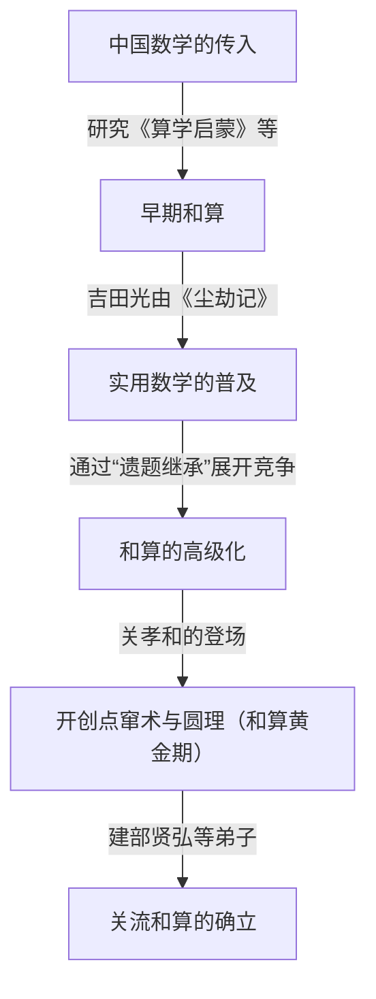
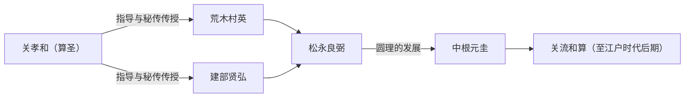

# 1. 引言：[关孝和](https://kenji.blog/zh-cn/p/seki-takakazu/)是谁？

在日本江户时代，有一位将独立发展的数学“和算”推向了前所未有高度的人物。他就是 **[关孝和](https://kenji.blog/zh-cn/p/seki-takakazu/)** （生于1640年代? - 卒于1708年）。他后来被尊称为“算圣”，在日本数学史上被定位为最重要的人物之一。

在同一时期的欧洲，[艾萨克·牛顿](https://kenji.blog/zh-cn/p/newton/)和戈特弗里德·莱布尼茨正在建立微积分学，而[关孝和](https://kenji.blog/zh-cn/p/seki-takakazu/)也在独立进行着极高水平的数学发现。本文将结合历史背景，深入探讨他的一生轶事以及世界顶尖水平的数学成就。

# 2. 和算的黎明期与[关孝和](https://kenji.blog/zh-cn/p/seki-takakazu/)登场前的日本数学

要理解[关孝和](https://kenji.blog/zh-cn/p/seki-takakazu/)的成就，必须了解当时日本的数学背景。江户时代初期，从中国传入的数学书籍在日本流传。其中特别重要的是元代朱世杰所著的《算学启蒙》（1299年）。这本书据说是丰臣秀吉出兵朝鲜时被带到日本的，对日本的知识分子产生了深远的影响。

在这一时期，大幅推动日本实用数学发展的是吉田光由的《尘劫记》（1627年）。《尘劫记》解说了算盘的使用方法和面积的测量方法等对日常生活和商业有用的数学，成为了一本畅销书。然而，它始终停留在实用、初等的算术层面，未能达到高等代数或几何的高度。

在注重实用的土壤中，最终出现了追求纯数学之美和逻辑深度的知识分子。他们创造了一种被称为“遗题继承”的独特文化，即在数学书籍中刊登未解决的问题以供读者挑战。这种智力游戏成为了和算快速高级化的原动力。而在和算发展的巅峰出现的这位天才，正是[关孝和](https://kenji.blog/zh-cn/p/seki-takakazu/)。

# 3. [关孝和](https://kenji.blog/zh-cn/p/seki-takakazu/)的生平与时代背景

## 3.1 身世与早年的轶事

[关孝和](https://kenji.blog/zh-cn/p/seki-takakazu/)的确切出生年份不详，但一般推测他生于1640年至1642年左右。他出生于上野国（现在的群马县）藤冈的武士内山家的次子，后来过继给关家作为养子。他的本名是新助，后来号自由斋。

据说他从小就对数学（算术）展现出异常的热情和天赋。在当时的日本，人们正在研究前面提到的《算学启蒙》等书籍，而[关孝和](https://kenji.blog/zh-cn/p/seki-takakazu/)通过自学读懂了这些书籍，并进一步发展了其内容。据传说，他从小就能心算复杂的计算，让周围的大人感到惊讶。他具有通过自学探索数学真理的能力，并且能够产生不受现有框架束缚的新思路。

## 3.2 出仕甲府藩与成为幕府直臣

[关孝和](https://kenji.blog/zh-cn/p/seki-takakazu/)不仅是一位数学家，也是一位真正的武士。他曾侍奉甲府藩主德川纲丰（后来的第6代将军德川家宣），担任过勘定吟味役等实际职务。由此可以看出，他不仅在数学方面，在历学（历法计算）、测量、地图制作等方面也具有卓越的实务能力。

当纲丰作为将军的继任者进入江户城西之丸时，[关孝和](https://kenji.blog/zh-cn/p/seki-takakazu/)也随之成为幕府的直臣（旗本）。人们可以想象出他极其克己的身影：白天履行武士的公务，夜晚则拿起算木和毛笔挑战未知的数学真理。

## 3.3 晚年与逝世

在成为幕府直臣后，他仍然继续研究，但在晚年，他经常卧病在床。1708年12月5日，[关孝和](https://kenji.blog/zh-cn/p/seki-takakazu/)离开了人世。他的墓现在位于东京都新宿区的净轮寺，成为了许多数学爱好者和研究者探访的圣地。

# 4. 代数学的革新：点窜术（傍书法）的开创

[关孝和](https://kenji.blog/zh-cn/p/seki-takakazu/)最大的功绩之一，是将从中国传入的计算技术升华为通向现代代数学的抽象且普遍的数学体系。

在当时的东亚数学中，使用的是一种叫做“天元术”的方法，即在棋盘上排列被称为“算木”的木棍来解方程。天元术是一种优秀的方法，但由于使用实物的木棍，它只能处理只有一个未知数的高次方程，难以求解包含多个未知变量的方程组。

因此，[关孝和](https://kenji.blog/zh-cn/p/seki-takakazu/)发明了一种通过笔算来进行代数记号书写的方法，称为 **傍书法** 。这种方法用汉字表示未知数和常数，并在其旁边添加符号来表达数学公式。这使得在纸上自由操作和变形包含多个未知数的复杂方程成为可能。

[关孝和](https://kenji.blog/zh-cn/p/seki-takakazu/)将使用这种傍书法整理方程、消去未知数并推导出最终解的方法称为“演段术”。后来，这被他的弟子们称为“点窜术”。点窜术奠定了和算的代数学基础，使得后来和算的飞跃性发展成为可能。

$$
\text{通过傍书法进行数学公式操作，其本质上与西方的 } ax^2 + bx + c = 0 \text{ 等符号代数学发挥了相同的作用。}
$$

# 5. 行列式的发现：领先于西方的壮举

[关孝和](https://kenji.blog/zh-cn/p/seki-takakazu/)最著名的世界级成就是发现了 **行列式** （Determinant）的概念。他在1683年的著作《解伏题之法》中，描述了作为从线性方程组中消去未知数的通用公式的行列式展开方法。

令人惊讶的是，这被认为与欧洲的[戈特弗里德·莱布尼茨](https://kenji.blog/zh-cn/p/leibniz/)得出行列式概念的时间（约1683年）相同，甚至稍微早一些。当时的日本处于锁国状态，西方数学信息几乎没有进入的余地。因此，[关孝和](https://kenji.blog/zh-cn/p/seki-takakazu/)是完全独立地得出这一伟大发现的。

[关孝和](https://kenji.blog/zh-cn/p/seki-takakazu/)正确地展示了 $n=2, 3, 4, 5$ 情况下的行列式展开（尽管在 $n=5$ 的情况下存在一些符号错误，但基本概念已经确立）。他领先于世界，推导出了相当于萨吕法则（Sarrus' rule）的计算方法。

$$
D = \begin{vmatrix} 
a_{11} & a_{12} & a_{13} \\ 
a_{21} & a_{22} & a_{23} \\
a_{31} & a_{32} & a_{33} 
\end{vmatrix} = a_{11}a_{22}a_{33} + a_{12}a_{23}a_{31} + a_{13}a_{21}a_{32} - a_{13}a_{22}a_{31} - a_{11}a_{23}a_{32} - a_{12}a_{21}a_{33}
$$

这一发现使得系统地判定复杂方程组解的存在条件成为可能，极大地提高了和算的计算能力。

# 6. 圆理：和算中微积分学的萌芽

不仅在代数学领域，[关孝和](https://kenji.blog/zh-cn/p/seki-takakazu/)在几何学和分析学领域也留下了划时代的成就。这就是 **圆理** 的开创。

圆理是一种用于求圆周率、圆弧长、球体体积等的极限方法，相当于西方微积分学（特别是积分法）的基础概念。

[关孝和](https://kenji.blog/zh-cn/p/seki-takakazu/)通过在圆内接正多边形并增加其边数来计算圆周率。他付出了惊人的努力，计算到了正131072边形（$2^{17}$边形）的周长。然而，他真正的天才之处并不仅仅在于重复计算。

他从一系列计算出的周长数据中发现了规律性，并应用了一种相当于 **艾特肯加速法** （Aitken's delta-squared process）的加速方法（加快收敛速度的算法）。结果，他成功地以较少的计算量求出了极高精度的近似值。

使用这种方法，[关孝和](https://kenji.blog/zh-cn/p/seki-takakazu/)准确地将圆周率计算到了小数点后第11位。

$$
\pi \approx 3.14159265359\dots
$$

这种高级计算算法的发现处于当时世界最高水平，并证明了和算不仅是单纯的智力谜题，而且具有严密的数学分析学的一面。

# 7. 伯努利数的发现与等幂求和公式

在他死后于1712年出版的遗作《括要算法》中，他完美地推导出了等幂求和（累乘和）的公式。

求自然数 $p$ 次方之和 $\sum_{k=1}^n k^p$ 的公式，自古以来就是数学家们关注的课题。[关孝和](https://kenji.blog/zh-cn/p/seki-takakazu/)系统地计算了该公式系数中出现的特定数列。这个数列正是现在被称为 **伯努利数** （Bernoulli numbers）的数列。

瑞士数学家雅各布·伯努利的著作《猜想术》（1713年出版）中也独立发表了这一数列。[关孝和](https://kenji.blog/zh-cn/p/seki-takakazu/)著作的出版比伯努利的著作早了一年，而发现时间本身也被认为[关孝和](https://kenji.blog/zh-cn/p/seki-takakazu/)稍早一些。巧合的是，在地球的两端，几乎在同一时代，两位天才达到了相同的数学真理。

伯努利数的定义如下：

$$
B_0 = 1, \quad B_1 = -\frac{1}{2}, \quad B_2 = \frac{1}{6}, \quad B_4 = -\frac{1}{30}, \quad B_6 = \frac{1}{42} \dots
$$

[关孝和](https://kenji.blog/zh-cn/p/seki-takakazu/)将此称为“垛积术”，并建立了一种利用类似于帕斯卡三角形（在和算中称为“立方式”）的系数表进行高效计算的方法。

# 8. 关流和算的发展与后继者们

[关孝和](https://kenji.blog/zh-cn/p/seki-takakazu/)本人并没有出版并广泛公布他所有的发现。他的数学作为秘传被传授给了有限的优秀弟子。

其中最著名的是 **建部贤弘** 。建部贤弘进一步发展了他老师的圆理，发现了相当于反三角函数泰勒展开的无穷级数展开，将和算推向了更高级的微积分学。

以[关孝和](https://kenji.blog/zh-cn/p/seki-takakazu/)为鼻祖，由建部贤弘等人整理的这一数学学派被称为“关流”。关流拥有极其系统且具教育性的体系，并完全席卷了江户时代日本的数学界。

# 9. 对历学的贡献以及与涩川春海的关系

[关孝和](https://kenji.blog/zh-cn/p/seki-takakazu/)的知识不仅限于纯数学。他也精通天文学和历学。当时的日本，从中国传入的旧历（宣明历）已经使用了800多年，与天体运行的实际情况产生了很大的偏差。

天文学家涩川春海注意到了这一点。涩川编制了新历“贞享历”，并被幕府采用。有一种说法认为，在此期间，[关孝和](https://kenji.blog/zh-cn/p/seki-takakazu/)在幕后为涩川春海提供了理论支持和复杂的计算。无论如何，[关孝和](https://kenji.blog/zh-cn/p/seki-takakazu/)的数学方法对于同时代历学和测量术的发展是不可或缺的。

# 10. 结语：[关孝和](https://kenji.blog/zh-cn/p/seki-takakazu/)在世界数学史上的地位

在处于锁国状态、来自外界的信息极其有限的日本，[关孝和](https://kenji.blog/zh-cn/p/seki-takakazu/)使用自己独特的语言和记号，构建了世界最前沿的数学。他的存在展示了人类智慧的潜力是多么广阔。

他独立发现了现代科学和工程不可或缺的数学工具，如行列式、伯努利数、艾特肯加速法以及作为微积分基础的圆理，这一事实让今天的我们感到极大的惊叹和自豪。

他所创立的和算在明治时代引入西方数学后结束了其使命。然而，由和算培养出的高度数学素养和逻辑思维能力，成为了日本快速发展为近代国家时强大的知识基础。

[关孝和](https://kenji.blog/zh-cn/p/seki-takakazu/)堪称跨越时空证明数学普遍性的“算圣”，是世界数学史上璀璨夺目的巨星。
