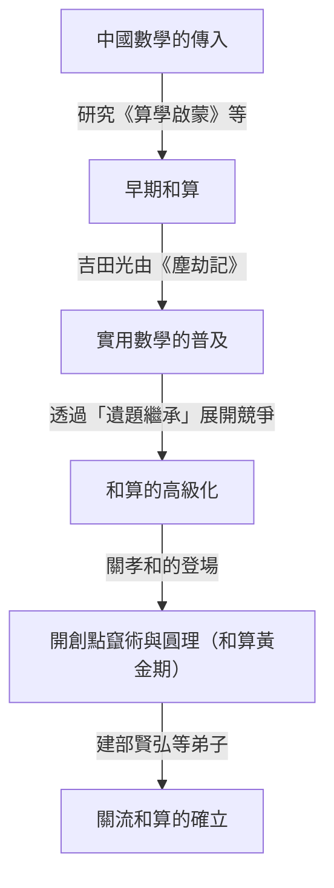
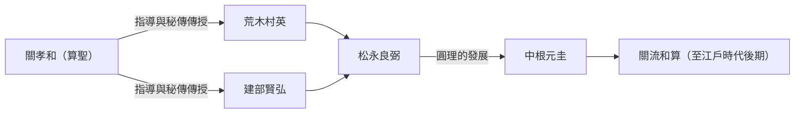

# 1. 引言：[關孝和](https://kenji.blog/zh-tw/p/seki-takakazu/)是誰？

在日本江戶時代，有一位將獨立發展的數學「和算」推向了前所未有高度的人物。他就是 **[關孝和](https://kenji.blog/zh-tw/p/seki-takakazu/)** （生於1640年代? - 卒於1708年）。他後來被尊稱為「算聖」，在日本數學史上被定位為最重要的人物之一。

在同一時期的歐洲，[艾薩克·牛頓](https://kenji.blog/zh-tw/p/newton/)和戈特弗里德·萊布尼茨正在建立微積分學，而[關孝和](https://kenji.blog/zh-tw/p/seki-takakazu/)也在獨立進行著極高水準的數學發現。本文將結合歷史背景，深入探討他的一生軼事以及世界頂尖水準的數學成就。

# 2. 和算的黎明期與[關孝和](https://kenji.blog/zh-tw/p/seki-takakazu/)登場前的日本數學

要理解[關孝和](https://kenji.blog/zh-tw/p/seki-takakazu/)的成就，必須了解當時日本的數學背景。江戶時代初期，從中國傳入的數學書籍在日本流傳。其中特別重要的是元代朱世傑所著的《算學啟蒙》（1299年）。這本書據說是豐臣秀吉出兵朝鮮時被帶到日本的，對日本的知識分子產生了深遠的影響。

在這一時期，大幅推動日本實用數學發展的是吉田光由的《塵劫記》（1627年）。《塵劫記》解說了算盤的使用方法和面積的測量方法等對日常生活和商業有用的數學，成為了一本暢銷書。然而，它始終停留在實用、初等的算術層面，未能達到高等代數或幾何的高度。

在注重實用的土壤中，最終出現了追求純數學之美和邏輯深度的知識分子。他們創造了一種被稱為「遺題繼承」的獨特文化，即在數學書籍中刊登未解決的問題以供讀者挑戰。這種智力遊戲成為了和算快速高級化的原動力。而在和算發展的巔峰出現的這位天才，正是[關孝和](https://kenji.blog/zh-tw/p/seki-takakazu/)。

# 3. [關孝和](https://kenji.blog/zh-tw/p/seki-takakazu/)的生平與時代背景

## 3.1 身世與早年的軼事

[關孝和](https://kenji.blog/zh-tw/p/seki-takakazu/)的確切出生年份不詳，但一般推測他生於1640年至1642年左右。他出生於上野國（現在的群馬縣）藤岡的武士內山家的次子，後來過繼給關家作為養子。他的本名是新助，後來號自由齋。

據說他從小就對數學（算術）展現出異常的熱情和天賦。在當時的日本，人們正在研究前面提到的《算學啟蒙》等書籍，而[關孝和](https://kenji.blog/zh-tw/p/seki-takakazu/)透過自學讀懂了這些書籍，並進一步發展了其內容。據傳說，他從小就能心算複雜的計算，讓周圍的大人感到驚訝。他具有透過自學探索數學真理的能力，並且能夠產生不受現有框架束縛的新思路。

## 3.2 出仕甲府藩與成為幕府直臣

[關孝和](https://kenji.blog/zh-tw/p/seki-takakazu/)不僅是一位數學家，也是一位真正的武士。他曾侍奉甲府藩主德川綱豐（後來的第6代將軍德川家宣），擔任過勘定吟味役等實際職務。由此可以看出，他不僅在數學方面，在曆學（曆法計算）、測量、地圖製作等方面也具有卓越的實務能力。

當綱豐作為將軍的繼任者進入江戶城西之丸時，[關孝和](https://kenji.blog/zh-tw/p/seki-takakazu/)也隨之成為幕府的直臣（旗本）。人們可以想像出他極其克己的身影：白天履行武士的公務，夜晚則拿起算木和毛筆挑戰未知的數學真理。

## 3.3 晚年與逝世

在成為幕府直臣後，他仍然繼續研究，但在晚年，他經常臥病在床。1708年12月5日，[關孝和](https://kenji.blog/zh-tw/p/seki-takakazu/)離開了人世。他的墓現在位於東京都新宿區的淨輪寺，成為了許多數學愛好者和研究者探訪的聖地。

# 4. 代數學的革新：點竄術（傍書法）的開創

[關孝和](https://kenji.blog/zh-tw/p/seki-takakazu/)最大的功績之一，是將從中國傳入的計算技術昇華為通向現代代數學的抽象且普遍的數學體系。

在當時的東亞數學中，使用的是一種叫做「天元術」的方法，即在棋盤上排列被稱為「算木」的木棍來解方程式。天元術是一種優秀的方法，但由於使用實物的木棍，它只能處理只有一個未知數的高次方程式，難以求解包含多個未知變數的聯立方程式。

因此，[關孝和](https://kenji.blog/zh-tw/p/seki-takakazu/)發明了一種透過筆算來進行代數記號書寫的方法，稱為 **傍書法** 。這種方法用漢字表示未知數和常數，並在其旁邊添加符號來表達數學公式。這使得在紙上自由操作和變形包含多個未知數的複雜方程式成為可能。

[關孝和](https://kenji.blog/zh-tw/p/seki-takakazu/)將使用這種傍書法整理方程式、消去未知數並推導出最終解的方法稱為「演段術」。後來，這被他的弟子們稱為「點竄術」。點竄術奠定了和算的代數學基礎，使得後來和算的飛躍性發展成為可能。

$$
\text{透過傍書法進行數學公式操作，其本質上與西方的 } ax^2 + bx + c = 0 \text{ 等符號代數學發揮了相同的作用。}
$$

# 5. 行列式的發現：領先於西方的壯舉

[關孝和](https://kenji.blog/zh-tw/p/seki-takakazu/)最著名的世界級成就是發現了 **行列式** （Determinant）的概念。他在1683年的著作《解伏題之法》中，描述了作為從線性聯立方程式中消去未知數的通用公式的行列式展開方法。

令人驚訝的是，這被認為與歐洲的[戈特弗里德·萊布尼茨](https://kenji.blog/zh-tw/p/leibniz/)得出行列式概念的時間（約1683年）相同，甚至稍微早一些。當時的日本處於鎖國狀態，西方數學資訊幾乎沒有進入的餘地。因此，[關孝和](https://kenji.blog/zh-tw/p/seki-takakazu/)是完全獨立地得出這一偉大發現的。

[關孝和](https://kenji.blog/zh-tw/p/seki-takakazu/)正確地展示了 $n=2, 3, 4, 5$ 情況下的行列式展開（儘管在 $n=5$ 的情況下存在一些符號錯誤，但基本概念已經確立）。他領先於世界，推導出了相當於薩呂法則（Sarrus' rule）的計算方法。

$$
D = \begin{vmatrix} 
a_{11} & a_{12} & a_{13} \\ 
a_{21} & a_{22} & a_{23} \\
a_{31} & a_{32} & a_{33} 
\end{vmatrix} = a_{11}a_{22}a_{33} + a_{12}a_{23}a_{31} + a_{13}a_{21}a_{32} - a_{13}a_{22}a_{31} - a_{11}a_{23}a_{32} - a_{12}a_{21}a_{33}
$$

這一發現使得系統地判定複雜方程式解的存在條件成為可能，極大地提高了和算的計算能力。

# 6. 圓理：和算中微積分學的萌芽

不僅在代數學領域，[關孝和](https://kenji.blog/zh-tw/p/seki-takakazu/)在幾何學和分析學領域也留下了劃時代的成就。這就是 **圓理** 的開創。

圓理是一種用於求圓周率、圓弧長、球體體積等的極限方法，相當於西方微積分學（特別是積分法）的基礎概念。

[關孝和](https://kenji.blog/zh-tw/p/seki-takakazu/)透過在圓內接正多邊形並增加其邊數來計算圓周率。他付出了驚人的努力，計算到了正131072邊形（$2^{17}$邊形）的周長。然而，他真正的天才之處並不僅僅在於重複計算。

他從一系列計算出的周長數據中發現了規律性，並應用了一種相當於 **艾特肯加速法** （Aitken's delta-squared process）的加速方法（加快收斂速度的演算法）。結果，他成功地以較少的計算量求出了極高精度的近似值。

使用這種方法，[關孝和](https://kenji.blog/zh-tw/p/seki-takakazu/)準確地將圓周率計算到了小數點後第11位。

$$
\pi \approx 3.14159265359\dots
$$

這種高級計算演算法的發現處於當時世界最高水準，並證明了和算不僅是單純的智力謎題，而且具有嚴密的數學分析學的一面。

# 7. 伯努利數的發現與等冪求和公式

在他死後於1712年出版的遺作《括要算法》中，他完美地推導出了等冪求和（累乘和）的公式。

求自然數 $p$ 次方之和 $\sum_{k=1}^n k^p$ 的公式，自古以來就是數學家們關注的課題。[關孝和](https://kenji.blog/zh-tw/p/seki-takakazu/)系統地計算了該公式係數中出現的特定數列。這個數列正是現在被稱為 **伯努利數** （Bernoulli numbers）的數列。

瑞士數學家雅各布·伯努利的著作《猜想術》（1713年出版）中也獨立發表了這一數列。[關孝和](https://kenji.blog/zh-tw/p/seki-takakazu/)著作的出版比伯努利的著作早了一年，而發現時間本身也被認為[關孝和](https://kenji.blog/zh-tw/p/seki-takakazu/)稍早一些。巧合的是，在地球的兩端，幾乎在同一時代，兩位天才達到了相同的數學真理。

伯努利數的定義如下：

$$
B_0 = 1, \quad B_1 = -\frac{1}{2}, \quad B_2 = \frac{1}{6}, \quad B_4 = -\frac{1}{30}, \quad B_6 = \frac{1}{42} \dots
$$

[關孝和](https://kenji.blog/zh-tw/p/seki-takakazu/)將此稱為「垛積術」，並建立了一種利用類似於帕斯卡三角形（在和算中稱為「立方式」）的係數表進行高效計算的方法。

# 8. 關流和算的發展與後繼者們

[關孝和](https://kenji.blog/zh-tw/p/seki-takakazu/)本人並沒有出版並廣泛公布他所有的發現。他的數學作為秘傳被傳授給了有限的優秀弟子。

其中最著名的是 **建部賢弘** 。建部賢弘進一步發展了他老師的圓理，發現了相當於反三角函數泰勒展開的無窮級數展開，將和算推向了更高級的微積分學。

以[關孝和](https://kenji.blog/zh-tw/p/seki-takakazu/)為鼻祖，由建部賢弘等人整理的這一數學學派被稱為「關流」。關流擁有極其系統且具教育性的體系，並完全席捲了江戶時代日本的數學界。

# 9. 對曆學的貢獻以及與澀川春海的關係

[關孝和](https://kenji.blog/zh-tw/p/seki-takakazu/)的知識不僅限於純數學。他也精通天文學和曆學。當時的日本，從中國傳入的舊曆（宣明曆）已經使用了800多年，與天體運行的實際情況產生了很大的偏差。

天文學家澀川春海注意到了這一點。澀川編製了新曆「貞享曆」，並被幕府採用。有一種說法認為，在此期間，[關孝和](https://kenji.blog/zh-tw/p/seki-takakazu/)在幕後為澀川春海提供了理論支持和複雜的計算。無論如何，[關孝和](https://kenji.blog/zh-tw/p/seki-takakazu/)的數學方法對於同時代曆學和測量術的發展是不可或缺的。

# 10. 結語：[關孝和](https://kenji.blog/zh-tw/p/seki-takakazu/)在世界數學史上的地位

在處於鎖國狀態、來自外界的資訊極其有限的日本，[關孝和](https://kenji.blog/zh-tw/p/seki-takakazu/)使用自己獨特的語言和記號，構建了世界最前沿的數學。他的存在展示了人類智慧的潛力是多麼廣闊。

他獨立發現了現代科學和工程不可或缺的數學工具，如行列式、伯努利數、艾特肯加速法以及作為微積分基礎的圓理，這一事實讓今天的我們感到極大的驚嘆和自豪。

他所創立的和算在明治時代引入西方數學後結束了其使命。然而，由和算培養出的高度數學素養和邏輯思維能力，成為了日本快速發展為近代國家時強大的知識基礎。

[關孝和](https://kenji.blog/zh-tw/p/seki-takakazu/)堪稱跨越時空證明數學普遍性的「算聖」，是世界數學史上璀璨奪目的巨星。
