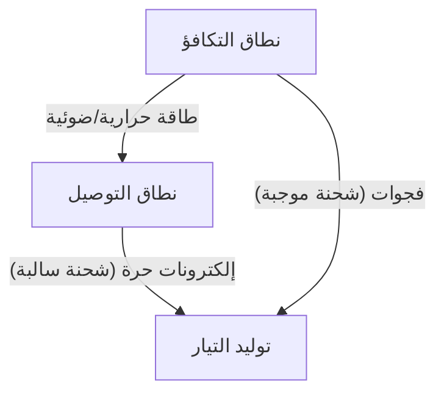
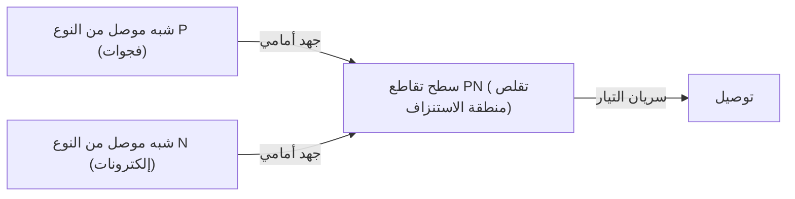
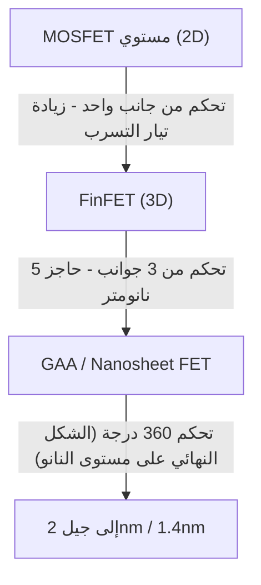

المجتمع الرقمي الحديث مبني على "الحجر السحري" المعروف باسم أشباه الموصلات. من الهواتف الذكية وأجهزة الكمبيوتر والسيارات إلى مراكز البيانات الضخمة التي تشغل الذكاء الاصطناعي، تتم جميع عمليات الحوسبة والتحكم بواسطة أجهزة أشباه الموصلات. ومع ذلك، لا يوجد الكثير من الناس الذين يفهمون بعمق الآليات الفيزيائية الأساسية. في هذه المقالة، سنكشف أساسيات أشباه الموصلات من منظور ميكانيكا الكم، ونشرح الصورة الكاملة لأشباه الموصلات والترانزستورات بتفاصيل هائلة، وصولاً إلى ثنائيات تقاطع PN، وMOSFET، وأحدث تقنيات FinFET و GAA (Gate-All-Around).

## 1. الخواص الكهربائية للمواد وميكانيكا الكم لفجوة النطاق

لماذا توصل بعض المواد الكهرباء بسهولة (الموصلات) والبعض الآخر لا (العوازل)؟ وما هي "أشباه الموصلات" التي تقع بينهما؟ للإجابة على هذا السؤال، يجب أن نفهم "نظرية النطاق" في ميكانيكا الكم.

### 1.1 سلوك الذرات والإلكترونات
تتكون الذرة من نواة ذرية وإلكترونات تدور حولها. وفقًا لميكانيكا الكم، لا يمكن للإلكترونات أن تمتلك طاقة مستمرة، بل يمكنها فقط أن تأخذ مستويات طاقة منفصلة ومحددة. عندما تتحد ذرات متعددة لتشكل بلورة، تتداخل مستويات الطاقة لكل ذرة، مما يشكل "نطاق طاقة" يتكون من عدد لا يحصى من مستويات الطاقة المتقاربة.

### 1.2 التصنيف حسب نظرية النطاق
تنقسم نطاقات الطاقة بشكل أساسي إلى "نطاق التكافؤ (Valence Band)" المليء بالإلكترونات، و"نطاق التوصيل (Conduction Band)" حيث لا توجد إلكترونات (أو توجد بشكل جزئي). وبين هذين النطاقين، توجد منطقة لا يمكن للإلكترونات أن توجد فيها تسمى "فجوة النطاق (Band Gap)".

- **الموصلات (مثل المعادن)**: يتداخل نطاق التكافؤ ونطاق التوصيل، أو يوجد بالفعل العديد من الإلكترونات في نطاق التوصيل. لذلك، مع تطبيق جهد (طاقة) بسيط، يمكن للإلكترونات التحرك بحرية ويتدفق التيار.
- **العوازل (مثل الزجاج والمطاط)**: نطاق التكافؤ مليء تمامًا بالإلكترونات، وفجوة النطاق بينه وبين نطاق التوصيل كبيرة جدًا (عادةً عدة إلكترون فولت أو أكثر)، لذلك لا يمكن للطاقة الحرارية في درجة حرارة الغرفة أن تجعل الإلكترونات تقفز إلى نطاق التوصيل.
- **أشباه الموصلات (مثل السيليكون والجرمانيوم)**: مثل العوازل، نطاق التكافؤ مليء، لكن فجوة النطاق صغيرة نسبيًا (حوالي 1.1 إلكترون فولت للسيليكون). لذلك، عند توفير طاقة حرارية أو ضوئية، تُثار بعض الإلكترونات وتقفز عبر فجوة النطاق إلى نطاق التوصيل.

تعمل كل من الإلكترونات المثارة إلى نطاق التوصيل (الإلكترونات الحرة) والفجوات المتبقية في نطاق التكافؤ (الثقوب) كـ "حاملات" تحمل الشحنة، مما يسمح بتدفق التيار. هذه هي الآلية الأساسية لأشباه الموصلات.

## 2. بلورة السيليكون والرابطة التساهمية
السيليكون (Si)، وهو ثاني أكثر العناصر وفرة على وجه الأرض بعد الأكسجين، هو بطل أشباه الموصلات. تحتوي ذرة السيليكون على أربعة إلكترونات تكافؤ في غلافها الخارجي. في بلورة السيليكون النقي (شبه موصل ذاتي)، تشارك كل ذرة سيليكون إلكترون تكافؤ واحد مع كل من ذرات السيليكون الأربع المجاورة، وتشكل رابطة مستقرة للغاية تسمى "الرابطة التساهمية".

عند الصفر المطلق (-273.15 درجة مئوية)، تكون جميع الإلكترونات مقيدة بالروابط التساهمية، وبالتالي يصبح السيليكون عازلًا مثاليًا. ومع ذلك، في درجة حرارة الغرفة، تُكسر بعض الروابط التساهمية بسبب الطاقة الحرارية، وتتولد أزواج من الإلكترونات الحرة والفجوات، مما يسمح بتدفق كمية ضئيلة من الكهرباء. ولكن مع السيليكون النقي وحده، يكون عدد الحاملات قليلًا جدًا ولا يمكن استخدامه كمكون إلكتروني عملي. وهنا يُستخدم سحر يسمى "التطعيم (Doping)".

## 3. التطعيم: ولادة أشباه الموصلات من النوعين N و P
يُطلق على عملية الخلط المتعمد لكمية ضئيلة (بنسبة واحد إلى عدة ملايين أو مئات الملايين) من الشوائب في السيليكون النقي (شبه موصل ذاتي) اسم "التطعيم". بتغيير نوع هذه الشوائب (المنشطات)، يمكننا إنشاء نوعين من أشباه الموصلات بخصائص مختلفة تمامًا.

### 3.1 شبه موصل من النوع N (النوع السالب)
يُخلط السيليكون (4 إلكترونات تكافؤ) بعنصر (مانح) يحتوي على 5 إلكترونات تكافؤ، مثل الفوسفور (P) أو الزرنيخ (As). ونتيجة لذلك، تدخل ذرة الفوسفور في الهيكل الشبكي لبلورة السيليكون، ولكن يُستخدم 4 إلكترونات فقط للرابطة التساهمية، مما يترك الإلكترون الخامس من ذرة الفوسفور زائدًا. من السهل أن يخرج هذا الإلكترون الزائد من قيود الرابطة التساهمية، ويصبح "إلكترونًا حرًا" يمكنه التحرك بحرية في البلورة بطاقة حرارية عند درجة حرارة الغرفة.
نظرًا لأن الإلكترون يحمل شحنة سالبة (Negative)، فإن هذا النوع من أشباه الموصلات حيث تكون الإلكترونات هي الحاملات الرئيسية يسمى "شبه موصل من النوع N".

### 3.2 شبه موصل من النوع P (النوع الموجب)
بالعكس، يُخلط السيليكون بعنصر (مستقبل) يحتوي على 3 إلكترونات تكافؤ فقط، مثل البورون (B) أو الغاليوم (Ga). ولإنشاء رابطة تساهمية، ينقص إلكترون واحد، مما يخلق مساحة فارغة تسمى "فجوة (ثقب)". عندما ينتقل إلكترون من رابطة مجاورة إلى هذه المساحة الفارغة، يصبح المكان الأصلي للإلكترون فجوة جديدة. بهذه الطريقة، تتحرك الفجوات داخل البلورة كما لو كانت جسيمات ذات شحنة موجبة (Positive) حاملةً التيار. هذا هو "شبه الموصل من النوع P".

## 4. تقاطع PN وآلية عمل الدايود
مجرد دمج شبه موصل من النوع P وشبه موصل من النوع N ماديًا لا يؤدي إلى شيء، ولكن عند ربطهما بشكل مستمر على المستوى الذري (تقاطع PN)، تحدث ظاهرة فيزيائية مثيرة للاهتمام للغاية. هذا هو المبدأ الأساسي لـ "الدايود".

### 4.1 تكوين منطقة الاستنزاف
بمجرد تكوين تقاطع PN، تبدأ الإلكترونات الحرة الوفيرة في منطقة N والفجوات الوفيرة في منطقة P بالانتشار بسبب اختلاف التركيز بينهما. عندما تلتقي الإلكترونات الحرة والفجوات بالقرب من السطح الفاصل، تتحد مع بعضها البعض وتختفي (إعادة التركيب).
ونتيجة لذلك، تتشكل منطقة خالية من الحاملات (لا إلكترونات حرة ولا فجوات) بالقرب من السطح الفاصل. وهذا ما يسمى "منطقة الاستنزاف (Depletion Region)". عندما تتشكل منطقة الاستنزاف، تبقى أيونات موجبة في جانب N وأيونات سالبة في جانب P، ويتولد مجال كهربائي (جهد داخلي) في الداخل. يعمل هذا المجال الكهربائي كحاجز (حاجز جهد) يمنع المزيد من انتشار الإلكترونات والفجوات.

### 4.2 عملية التقويم (سريان التيار في اتجاه واحد)
عند تطبيق جهد خارجي على تقاطع PN، يختلف سلوكه تمامًا اعتمادًا على اتجاه الجهد.

- **الانحياز الأمامي**: يتم تطبيق جهد موجب على جانب P وجهد سالب على جانب N. عندئذٍ، يلغي الجهد الخارجي حاجز الجهد الداخلي، وتُدفع الفجوات من النوع P إلى النوع N والإلكترونات من النوع N إلى النوع P، وتتقلص أو تختفي منطقة الاستنزاف. ونتيجة لذلك، تتدفق كمية كبيرة من التيار بقوة.
- **الانحياز العكسي**: يتم تطبيق جهد سالب على جانب P وجهد موجب على جانب N. عندئذٍ، تُسحب الإلكترونات والفجوات بعيدًا عن السطح الفاصل، وتتسع منطقة الاستنزاف أكثر. نظرًا لارتفاع حاجز الجهد، لا يتدفق التيار تقريبًا.

تُسمى خاصية السماح للتيار بالتدفق في اتجاه واحد فقط "عملية التقويم"، وتلعب دورًا حيويًا في دوائر الإمداد بالطاقة التي تحول التيار المتردد (AC) إلى تيار مستمر (DC).

## 5. ولادة الترانزستور و MOSFET
كان الدايود عنصرًا ثوريًا، ولكنه لم يكن سوى صمام أحادي الاتجاه. ما كانت البشرية تسعى إليه حقًا هو جهاز سحري يمكنه أداء "تكبير" و "تبديل (Switching)" الإشارات الكهربائية بحرية، أي "الترانزستور".

### 5.1 من الترانزستور ثنائي القطب إلى ترانزستور تأثير المجال
كانت الترانزستورات المبكرة عبارة عن ترانزستورات ثنائية القطب بهيكل PNP أو NPN، لكن تصنيعها كان صعبًا وكانت تستهلك قدرًا كبيرًا من الطاقة. اليوم، يتم تشكيل أكثر من 99% من الدوائر الرقمية في العالم بواسطة نوع من الترانزستورات يسمى "MOSFET (Metal-Oxide-Semiconductor Field-Effect Transistor: ترانزستور تأثير المجال ذو أكسيد المعدن وشبه الموصل)".

### 5.2 هيكل ومبدأ عمل MOSFET
يتكون MOSFET (سنأخذ هنا كمثال وضع التعزيز من النوع N-channel) من الأطراف الأربعة التالية (عادةً، يتم التعامل معه كـ 3 أطراف لأن الركيزة موصلة بالمصدر).
1. **المصدر (Source)**: مصدر الحاملات (الإلكترونات) (النوع N).
2. **المصرف (Drain)**: وجهة تفريغ الحاملات (النوع N).
3. **البوابة (Gate)**: مقبض "الصنبور" الذي يتحكم في تدفق التيار.
4. **الركيزة (Substrate / Body)**: اللوحة الأساسية بأكملها (النوع P).

يتم إنشاء منطقتين من النوع N (المصدر والمصرف) في ركيزة سيليكون من النوع P. في هذه الحالة، تقف منطقة من النوع P كعقبة بين المصدر والمصرف (تقاطع PN متتالي متصل بالظهر)، ولا يتدفق التيار حتى لو تم تطبيق جهد موجب على المصرف.
يتم تشكيل طبقة عازلة رقيقة جدًا (أكسيد السيليكون: Oxide) فوق منطقة النوع P بين المصدر والمصرف، وفوقها يتم وضع قطب كهربائي معدني أو بولي سيليكون (بوابة: Metal).

**آلية التشغيل (ON): تكوين القناة**
عند تطبيق جهد موجب على قطب البوابة، يحدث تغيير في منطقة سيليكون النوع P أسفل الطبقة العازلة مباشرة. وبسبب الجهد الموجب، تتنافر الفجوات (وهي الحاملات الأغلبية في منطقة P) وتُدفع إلى عمق الركيزة (استنزاف)، وفي الوقت نفسه، تُجذب الإلكترونات (وهي الحاملات الأقلية الموجودة بنسبة ضئيلة في منطقة P) إلى السطح.
عندما يتجاوز جهد البوابة قيمة معينة (جهد العتبة: Threshold Voltage)، تتجمع الإلكترونات على السطح أسفل الطبقة العازلة مباشرةً، وتنقلب المنطقة التي كانت من النوع P محليًا إلى النوع N. يُسمى هذا "طبقة الانعكاس (Inversion Layer)" أو "القناة (Channel)".
عندما تتشكل القناة، يتم توصيل المصدر من النوع N والمصرف من النوع N بواسطة قناة من النوع N، ويتدفق التيار ببراعة!

**آلية الإيقاف (OFF)**
عندما يعود جهد البوابة إلى الصفر، تتشتت الإلكترونات التي تم جذبها، وتختفي القناة. يظهر جدار النوع P مرة أخرى، ويتم قطع التيار.
بهذه الطريقة، الميزة الأكبر لـ MOSFET هي أنه يمكنه تشغيل/إيقاف تيار ضخم بين المصدر والمصرف بجهد ضئيل يطبق على البوابة. علاوة على ذلك، نظرًا لأن البوابة معزولة بالطبقة العازلة، لا يتدفق أي تيار تقريبًا في البوابة نفسها، مما يسمح بالقيادة باستهلاك منخفض جدًا للطاقة (هذا هو جوهر تقنية CMOS).

## 6. قانون مور وحدود التصغير
في عام 1965، اقترح جوردون مور، المؤسس المشارك لشركة إنتل، قاعدة تجريبية مفادها أن "عدد الترانزستورات الموجودة في دائرة متكاملة من أشباه الموصلات سيتضاعف كل عامين تقريبًا". هذا هو "قانون مور" الشهير. كلما أصبحت الترانزستورات أصغر (تصغير)، زاد عدد الدوائر التي يمكن حشوها في شريحة واحدة، ليس ذلك فحسب، بل أصبحت مسافة حركة الإلكترونات أقصر، مما يزيد من سرعة التشغيل، ويمكن خفض الجهد، مما يقلل من استهلاك الطاقة. استمرت هذه الدورة الحميدة السحرية المعروفة باسم "تحجيم دينارد (Dennard Scaling)" لعقود.

ومع ذلك، بدأت الغيوم تخيم على هذا السحر في العقد الأول من القرن الحادي والعشرين. مع تقلص الترانزستورات إلى مقياس النانومتر، أصبحت الحدود الفيزيائية (التأثيرات الكمومية) واضحة.

### 6.1 تأثير القناة القصيرة وتيار التسرب
عندما تصبح المسافة بين المصدر والمصرف (طول القناة) قصيرة جدًا، وحتى عندما يكون جهد البوابة في حالة الإيقاف، فإن جهد المصرف يقلل من حاجز الجهد على جانب المصدر، مما يؤدي إلى تسرب التيار بشكل غير مقصود. وهذا ما يسمى "تأثير القناة القصيرة (Short Channel Effect)".
بالإضافة إلى ذلك، أصبح عازل البوابة رقيقًا إلى مستوى عدة طبقات ذرية، وأصبح "تيار تسرب البوابة" حيث تمر الإلكترونات عبر الطبقة العازلة بسبب تأثير النفق الكمومي مشكلة خطيرة. نظرًا لأن الكهرباء تستمر في التسرب حتى عند إيقاف تشغيل المفتاح، ترتفع درجة حرارة الهواتف الذكية وتنفد البطارية بسرعة.

## 7. التطور إلى هياكل ثلاثية الأبعاد: من FinFET إلى GAA
للاختراق حدود التصغير، أعاد مهندسو أشباه الموصلات النظر في هيكل الترانزستور من الأساس. إنه تحول نموذجي من مستوى ثنائي الأبعاد (2D) إلى ثلاثي الأبعاد (3D).

### 7.1 ظهور FinFET
في حوالي عام 2011، وضعت إنتل وشركات أخرى "FinFET (Fin Field-Effect Transistor)" قيد الاستخدام العملي. بينما يخلق MOSFET التقليدي قناة على ركيزة مسطحة، يقوم FinFET برفع ركيزة السيليكون عموديًا مثل زعنفة السمكة (Fin)، ويضع قطب البوابة ليحيط بهذه الزعنفة.
في النوع المسطح، كانت البوابة قادرة على التحكم فقط من سطح واحد "فوق" القناة، ولكن في FinFET يمكن التحكم في القناة من 3 اتجاهات: "أعلى، يسار، يمين". ونتيجة لذلك، زادت قوة سيطرة المجال الكهربائي بواسطة البوابة (السيطرة الكهروستاتيكية) بشكل كبير، وتم كبح تأثير القناة القصيرة بقوة، ونجح في تقليل تيار التسرب بشكل كبير. مع ظهور FinFET، استعاد قانون مور حيويته، وأصبح بطل الأجيال من 22 نانومتر إلى 5 نانومتر.

### 7.2 الهيكل النهائي: GAA (Gate-All-Around)
ومع ذلك، مع تقدم التصغير إلى 3 نانومتر و 2 نانومتر، أصبحت حدود التحكم من 3 جوانب لـ FinFET واضحة. لذلك ظهر الهيكل الترانزستور من الجيل التالي "GAA (Gate-All-Around)".
في GAA، يُصنع السيليكون الذي يشكل القناة في شكل أسلاك رفيعة (نانو واير) أو شكل صفائح (نانو شيت: يُسمى MBCFET في Samsung، و RibbonFET في Intel وما إلى ذلك) بحيث يُعلق تمامًا في الهواء، وتحيط به البوابة من جميع الزوايا الـ 360 درجة (حرفيًا Gate-All-Around).
ونتيجة لذلك، تصل قدرة البوابة على التحكم في القناة إلى الحد الأقصى الفيزيائي، مما يجعل من الممكن إيقاف تيار التسرب بشكل شبه كامل. علاوة على ذلك، من خلال تغيير عرض النانو شيت بمرونة، هناك ميزة كبيرة تتمثل في تسهيل التصميم الأمثل للدوائر التي تركز على الأداء وتلك التي تركز على توفير الطاقة على نفس الشريحة.

## 8. نحو المستقبل
يعد تطور أشباه الموصلات تتويجًا للفيزياء والكيمياء وعلوم المواد واستثمارات رأسمالية ضخمة وحكمة بشرية. يتكرر سحر ميكانيكا الكم، الذي يتحكم بدقة في سلوك إلكترون واحد، في التشغيل/الإيقاف بسرعة مذهلة تبلغ مليارات المرات في الثانية في راحة أيدينا، ليخلق كونًا رقميًا ضخمًا.
بعد GAA، يتقدم البحث في CFET (Complementary FET) الذي يكدس الترانزستورات عموديًا، والمواد الجديدة التي ستحل محل السيليكون (أنابيب الكربون النانوية، ثنائي كالكوجينيدات المعادن الانتقالية ثنائية الأبعاد، إلخ). سيستمر "السحر" الذي تنسجه أشباه الموصلات في توسيع آفاق البشرية وفتح مسار لمستقبل جديد.
