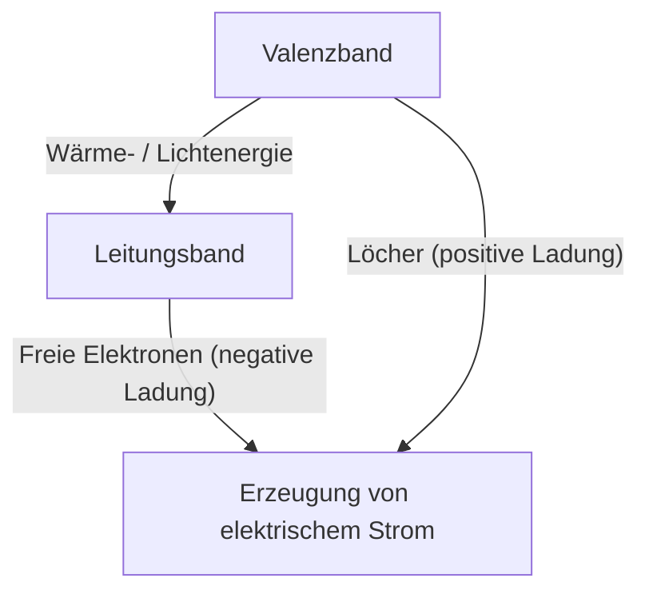
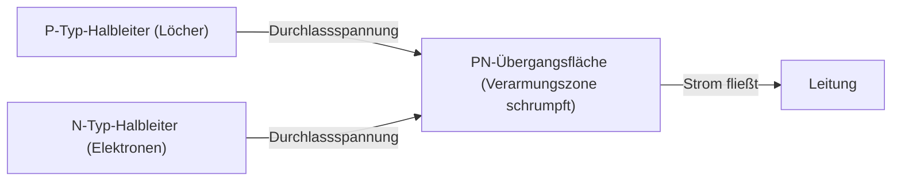
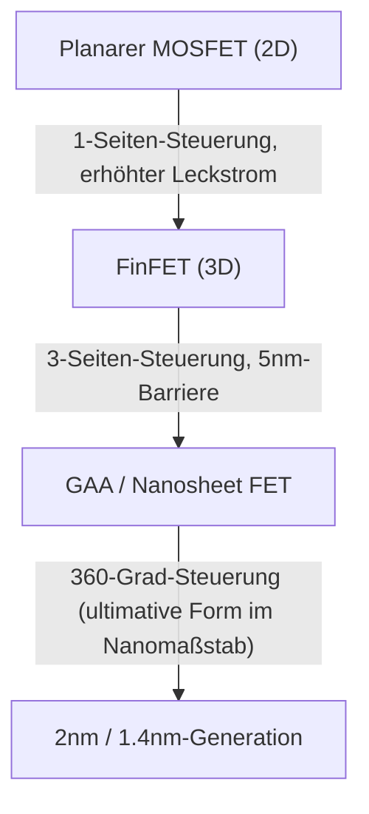

Die moderne digitale Gesellschaft basiert auf dem "magischen Stein", den Halbleitern. Von Smartphones, Computern und Autos bis hin zu den riesigen Rechenzentren, die KI antreiben, werden alle Berechnungen und Steuerungen von Halbleiterbauelementen durchgeführt. Allerdings haben nur wenige Menschen ein tiefes Verständnis für die physikalischen Mechanismen, die ihnen zugrunde liegen. In diesem Artikel werden wir die Grundlagen von Halbleitern aus einer quantenmechanischen Perspektive entschlüsseln und das gesamte Bild von Halbleitern und Transistoren in überwältigender Detailtiefe erklären, von PN-Übergangsdioden und MOSFETs bis hin zu den neuesten FinFET- und GAA (Gate-All-Around)-Technologien.

## 1. Elektrische Eigenschaften von Materie und die Quantenmechanik der Bandlücke

Warum leiten einige Materialien Elektrizität leicht (Leiter), während andere überhaupt keinen Strom leiten (Isolatoren)? Und was ist ein "Halbleiter", der in der Mitte positioniert ist? Um diese Frage zu beantworten, müssen wir die "Bändertheorie" der Quantenmechanik verstehen.

### 1.1 Das Verhalten von Atomen und Elektronen
Atome bestehen aus einem Atomkern und Elektronen, die ihn umkreisen. Nach der Quantenmechanik können Elektronen keine kontinuierliche Energie haben; sie können nur bestimmte, diskrete Energieniveaus annehmen. Wenn sich mehrere Atome verbinden, um einen Kristall zu bilden, überlappen sich die Energieniveaus der einzelnen Atome, wodurch ein "Energieband" entsteht, das aus unzähligen eng beieinander liegenden Energieniveaus besteht.

### 1.2 Klassifizierung durch die Bändertheorie
Das Energieband wird hauptsächlich in das "Valenzband" (Valence Band), das mit Elektronen gefüllt ist, und das "Leitungsband" (Conduction Band), in dem es keine (oder nur teilweise) Elektronen gibt, unterteilt. Und zwischen diesen beiden Bändern gibt es eine "Bandlücke", einen Bereich, in dem Elektronen nicht existieren können.

- **Leiter (wie Metalle)**: Das Valenzband und das Leitungsband überlappen sich, oder es befinden sich bereits viele Elektronen im Leitungsband. Daher können sich Elektronen schon bei Anlegen einer kleinen Spannung (Energie) frei bewegen, und Strom fließt.
- **Isolatoren (wie Glas, Gummi)**: Das Valenzband ist vollständig mit Elektronen gefüllt, und die Bandlücke zum Leitungsband ist sehr groß (typischerweise mehrere eV oder mehr). Daher können Elektronen mit der Wärmeenergie bei Raumtemperatur nicht in das Leitungsband springen.
- **Halbleiter (wie Silizium, Germanium)**: Wie bei Isolatoren ist das Valenzband gefüllt, aber die Bandlücke ist relativ klein (etwa 1,1 eV für Silizium). Wenn ihnen also Wärme- oder Lichtenergie zugeführt wird, springen einige Elektronen über die Bandlücke und werden in das Leitungsband angeregt.

Sowohl die in das Leitungsband angeregten Elektronen (freie Elektronen) als auch die im Valenzband verbleibenden Elektronenlöcher (Defektelektronen oder Löcher) fungieren als "Ladungsträger", die Ladungen transportieren, sodass Strom fließen kann. Dies ist der grundlegende Mechanismus von Halbleitern.

## 2. Siliziumkristall und kovalente Bindung
Silizium (Si), das am zweithäufigsten vorkommende Element auf der Erde nach Sauerstoff, ist der Hauptakteur bei Halbleitern. Siliziumatome haben 4 Valenzelektronen in ihrer äußersten Schale. In einem reinen Siliziumkristall (intrinsischer Halbleiter) teilt jedes Siliziumatom ein Valenzelektron mit seinen 4 benachbarten Siliziumatomen und bildet so eine extrem stabile Bindung, die "kovalente Bindung" genannt wird.

Am absoluten Nullpunkt (-273,15 °C) sind alle Elektronen in kovalenten Bindungen gefangen, sodass Silizium zu einem perfekten Isolator wird. Bei Raumtemperatur bricht die Wärmeenergie jedoch einige der kovalenten Bindungen auf, wodurch Paare von freien Elektronen und Löchern (Elektron-Loch-Paare) entstehen, und eine geringe Menge Strom kann fließen. Reine Siliziumkristalle haben jedoch viel zu wenig Ladungsträger, um als praktische elektronische Bauteile verwendet zu werden. Hier kommt die Magie der "Dotierung" ins Spiel.

## 3. Dotierung: Die Geburt von N-Typ- und P-Typ-Halbleitern
Die absichtliche Zugabe einer sehr geringen Menge (ein Atom pro mehreren Millionen bis mehreren Hundert Millionen) an Verunreinigungen zu reinem Silizium (intrinsischer Halbleiter) wird als "Dotierung" bezeichnet. Durch die Änderung der Art dieser Verunreinigungen (Dotanden) können zwei Arten von Halbleitern mit völlig unterschiedlichen Eigenschaften erzeugt werden.

### 3.1 N-Typ-Halbleiter (Negative type)
Silizium (4 Valenzelektronen) wird mit Elementen (Donatoren) gemischt, die 5 Valenzelektronen haben, wie Phosphor (P) oder Arsen (As). Die Phosphoratome treten in die Netzwerkstruktur des Siliziumkristalls ein, aber da nur 4 Elektronen für kovalente Bindungen verwendet werden, bleibt das fünfte Elektron des Phosphoratoms übrig. Dieses überschüssige Elektron wird leicht aus der Beschränkung der kovalenten Bindung gelöst und wird zu einem "freien Elektron", das sich mit der Wärmeenergie bei Raumtemperatur leicht frei im Kristall bewegen kann.
Da Elektronen eine negative Ladung haben, wird dieser Halbleiter, in dem Elektronen die Hauptladungsträger sind, als "N-Typ-Halbleiter" bezeichnet.

### 3.2 P-Typ-Halbleiter (Positive type)
Umgekehrt wird Silizium mit Elementen (Akzeptoren) gemischt, die nur 3 Valenzelektronen haben, wie Bor (B) oder Gallium (Ga). Es fehlt ein Elektron, um eine kovalente Bindung zu bilden, wodurch ein leerer Raum entsteht, der "Loch" (Defektelektron) genannt wird. Wenn ein Elektron von einer benachbarten Bindung in diesen leeren Raum zieht, wird der ursprüngliche Platz zu einem neuen Loch. Auf diese Weise bewegen sich Löcher durch den Kristall und transportieren Strom, als wären sie Teilchen mit einer positiven Ladung. Dies ist ein "P-Typ-Halbleiter".

## 4. PN-Übergang und der Dioden-Mechanismus
Wenn P-Typ- und N-Typ-Halbleiter einfach physikalisch aneinandergelegt werden, passiert nichts, aber wenn sie kontinuierlich auf atomarer Ebene verbunden werden (PN-Übergang), tritt ein sehr interessantes physikalisches Phänomen auf. Dies ist das Grundprinzip der "Diode".

### 4.1 Bildung der Verarmungszone
In dem Moment, in dem der PN-Übergang gebildet wird, beginnen die reichlich vorhandenen freien Elektronen im N-Typ-Bereich und die reichlich vorhandenen Löcher im P-Typ-Bereich aufgrund ihres gegenseitigen Konzentrationsunterschieds zu diffundieren. Wenn freie Elektronen und Löcher in der Nähe der Übergangsfläche aufeinandertreffen, verbinden sie sich miteinander und verschwinden (Rekombination).
Infolgedessen bildet sich in der Nähe der Übergangsfläche ein Bereich, in dem keine Ladungsträger (weder freie Elektronen noch Löcher) existieren. Dies wird als "Verarmungszone" (Depletion Region) bezeichnet. Wenn sich die Verarmungszone bildet, bleiben positive Ionen auf der N-Typ-Seite und negative Ionen auf der P-Typ-Seite zurück, wodurch intern ein elektrisches Feld (internes Potenzial) erzeugt wird. Dieses elektrische Feld wirkt als Barriere (Potenzialbarriere), die die weitere Diffusion von Elektronen und Löchern verhindert.

### 4.2 Gleichrichterwirkung (Einbahnstraße für Strom)
Wenn von außen eine Spannung an den PN-Übergang angelegt wird, ist das Verhalten je nach Richtung völlig unterschiedlich.

- **Durchlassspannung (Vorwärtsrichtung)**: Eine positive Spannung wird an die P-Typ-Seite und eine negative Spannung an die N-Typ-Seite angelegt. Die externe Spannung hebt die interne Potenzialbarriere auf, die Löcher vom P-Typ werden in den N-Typ gedrängt und die Elektronen vom N-Typ in den P-Typ, wodurch die Verarmungszone schrumpft und verschwindet. Infolgedessen fließt eine große Menge an Strom.
- **Sperrspannung (Rückwärtsrichtung)**: Eine negative Spannung wird an die P-Typ-Seite und eine positive Spannung an die N-Typ-Seite angelegt. Die Elektronen und Löcher werden jeweils in Richtung weg von der Übergangsfläche gezogen, und die Verarmungszone dehnt sich weiter aus. Da die Potenzialbarriere höher wird, fließt fast kein Strom.

Diese Eigenschaft, dass Strom nur in eine Richtung fließen kann, wird als "Gleichrichterwirkung" bezeichnet und spielt eine unverzichtbare Rolle in Stromversorgungsschaltungen, die AC (Wechselstrom) in DC (Gleichstrom) umwandeln.

## 5. Die Geburt des Transistors und MOSFET
Dioden waren bahnbrechende Bauelemente, aber sie sind nur einfache Einwegventile. Was die Menschheit wirklich brauchte, war ein magisches Gerät, das elektrische Signale frei "verstärken" und "schalten" konnte, nämlich den "Transistor".

### 5.1 Vom Bipolartransistor zum Feldeffekttransistor
Die frühen Transistoren waren Bipolartransistoren mit PNP- oder NPN-Struktur, hatten jedoch den Nachteil, dass sie schwer herzustellen waren und viel Strom verbrauchten. Heute machen mehr als 99 % der digitalen Schaltkreise der Welt Transistortypen aus, die als "MOSFET" (Metal-Oxide-Semiconductor Field-Effect Transistor) bezeichnet werden.

### 5.2 Struktur und Funktionsprinzip des MOSFET
Ein MOSFET (hier nehmen wir den N-Kanal-Anreicherungstyp als Beispiel) besteht aus den folgenden 4 Anschlüssen (normalerweise wird das Substrat mit der Source verbunden, sodass es in der Praxis als 3 Anschlüsse behandelt wird):
1. **Source**: Die Quelle von Ladungsträgern (Elektronen) (N-Typ).
2. **Drain**: Das Ziel der Entladung von Ladungsträgern (N-Typ).
3. **Gate**: Der Griff des "Wasserhahns", der den Stromfluss steuert.
4. **Substrat (Body)**: Das gesamte Basismaterial (P-Typ).

Zwei N-Typ-Bereiche (Source und Drain) werden im P-Typ-Siliziumsubstrat erzeugt. Wie es ist, steht der P-Typ-Bereich zwischen Source und Drain (Rücken-an-Rücken-PN-Übergänge), und selbst wenn eine positive Spannung an das Drain angelegt wird, fließt kein Strom.
Ein extrem dünner Isolatorfilm (Siliziumoxid: Oxide) wird über dem P-Typ-Bereich zwischen Source und Drain gebildet, und eine Metall- oder Polysiliziumelektrode (Gate: Metal) wird darauf platziert.

**Einschalt-Mechanismus: Bildung des Kanals**
Wenn eine positive Spannung an die Gate-Elektrode angelegt wird, tritt direkt darunter im P-Typ-Siliziumbereich über den Isolierfilm hinweg eine Änderung auf. Durch die positive Spannung werden die Löcher, die die Majoritätsladungsträger im P-Typ-Bereich sind, abgestoßen und tief in das Substrat gedrängt (Verarmung). Gleichzeitig werden die Elektronen, die die Minoritätsladungsträger sind und geringfügig im P-Typ-Bereich existieren, an die Oberfläche gezogen.
Wenn die Gate-Spannung einen bestimmten Wert überschreitet (Schwellenspannung: Threshold Voltage), drängen sich Elektronen an der Oberfläche direkt unter dem Isolierfilm zusammen, und der ehemals P-Typ-Bereich kehrt sich lokal in einen N-Typ um. Dies wird als "Inversionsschicht" (Inversion Layer) oder "Kanal" (Channel) bezeichnet.
Wenn der Kanal gebildet ist, werden die N-Typ-Source und das N-Typ-Drain durch den N-Typ-Kanal verbunden, und es fließt Strom auf wunderbare Weise!

**Ausschalt-Mechanismus**
Wenn die Gate-Spannung wieder auf Null gesetzt wird, zerstreuen sich die angezogenen Elektronen und der Kanal verschwindet. Die Wand vom P-Typ steht wieder im Weg und der Strom wird unterbrochen.
Auf diese Weise ist das größte Merkmal des MOSFET, dass ein riesiger Strom zwischen Source und Drain durch nur eine geringe an das Gate angelegte Spannung ein- und ausgeschaltet (ON/OFF) werden kann. Da das Gate durch einen isolierenden Film isoliert ist, fließt außerdem kaum Strom durch das Gate selbst, was den Antrieb mit extrem geringem Stromverbrauch ermöglicht (dies ist der Kern der CMOS-Technologie).

## 6. Das Mooresche Gesetz und die Grenzen der Miniaturisierung
1965 schlug der Intel-Mitbegründer Gordon Moore eine empirische Regel vor: "Die Anzahl der Transistoren auf einem integrierten Halbleiterschaltkreis verdoppelt sich etwa alle zwei Jahre." Dies ist das berühmte "Mooresche Gesetz". Je kleiner die Transistoren gemacht werden (Miniaturisierung), desto mehr Schaltkreise können nicht nur auf einen einzigen Chip gepackt werden, sondern auch die Betriebsgeschwindigkeit steigt, da sich die Bewegungsstrecke der Elektronen verkürzt, und der Stromverbrauch sinkt, da auch die Spannung gesenkt werden kann. Ein magischer positiver Kreislauf namens "Dennard Scaling" setzte sich jahrzehntelang fort.

Ab den 2000er Jahren begannen sich jedoch Schatten über diese Magie zu legen. Als die Transistoren auf den Nanometermaßstab schrumpften, wurden physikalische Grenzen (quantenmechanische Effekte) deutlich.

### 6.1 Kurzkanaleffekt und Leckstrom
Wenn der Abstand zwischen Source und Drain (Kanallänge) extrem kurz wird, verringert die Drain-Spannung selbst bei ausgeschaltetem Gate die Potenzialbarriere auf der Source-Seite, was zu dem Phänomen führt, dass unbeabsichtigt Strom austritt. Dies wird als "Kurzkanaleffekt" (Short Channel Effect) bezeichnet.
Darüber hinaus wurden die Gate-Isolatorfilme auf wenige atomare Schichten verdünnt, und "Gate-Leckströme", bei denen Elektronen den Isolierfilm durch Quantentunnelung durchdringen, wurden zu einem ernsthaften Problem. Auch wenn der Schalter ausgeschaltet ist, tritt weiterhin Strom aus, wodurch Smartphones heiß werden und Batterien schnell leer sind.

## 7. Die Evolution zu dreidimensionalen Strukturen: Von FinFET zu GAA
Um die Grenzen der Miniaturisierung zu durchbrechen, haben Halbleiteringenieure die Struktur der Transistoren grundlegend überdacht. Es ist ein Paradigmenwechsel von der Fläche (2D) zur Dreidimensionalität (3D).

### 7.1 Das Aufkommen von FinFET
Um das Jahr 2011 haben Intel und andere den "FinFET" (Fin Field-Effect Transistor) in die Praxis umgesetzt. Während herkömmliche MOSFETs einen Kanal auf einem flachen Substrat erzeugten, stellt FinFET das Siliziumsubstrat vertikal wie eine Fischflosse (Fin) auf und ordnet die Gate-Elektrode so an, dass sie die Flosse überspannt.
Beim planaren Typ konnte das Gate nur von der einen "oberen" Seite des Kanals gesteuert werden, aber beim FinFET kann der Kanal aus drei Richtungen gesteuert werden: "oben, links und rechts". Dadurch verbesserte sich die elektrostatische Kontrolle durch das Gate dramatisch, der Kurzkanaleffekt wurde stark unterdrückt, und der Leckstrom konnte erheblich reduziert werden. Mit dem Aufkommen von FinFET lebte das Mooresche Gesetz wieder auf und wurde zum Hauptakteur von der 22-nm- bis zur 5-nm-Generation.

### 7.2 Die ultimative Struktur: GAA (Gate-All-Around)
Als die Miniaturisierung jedoch bei 3 nm und 2 nm weiter voranschritt, wurden selbst bei der 3-Seiten-Steuerung des FinFET Grenzen sichtbar. Hier kommt die Transistorstruktur der nächsten Generation, "GAA" (Gate-All-Around), ins Spiel.
Bei GAA ist das Silizium, das den Kanal bildet, wie ein dünner Draht (Nanodraht) oder eine Schicht (Nanosheet: von Samsung MBCFET und von Intel RibbonFET genannt) geformt und schwebt vollständig in der Luft. Sein gesamter 360-Grad-Umfang ist von der Gate-Elektrode umgeben (buchstäblich Gate-All-Around).
Dadurch erreicht die Fähigkeit des Gates, den Kanal zu steuern, ihre physikalischen Grenzen, und Leckströme können fast vollständig blockiert werden. Darüber hinaus hat es den großen Vorteil, dass durch die flexible Änderung der Breite des Nanosheets leistungsorientierte Schaltkreise und stromsparende Schaltkreise auf einem einzigen Chip leichter optimiert werden können.

## 8. Blick in die Zukunft
Die Evolution von Halbleitern ist eine Kristallisation aus Physik, Chemie, Materialwissenschaften, astronomischen Kapitalinvestitionen und menschlicher Weisheit. Die Magie der Quantenmechanik, die das Verhalten jedes einzelnen Elektrons präzise steuert, wiederholt ON/OFF in der extremen Geschwindigkeit von Milliarden Malen pro Sekunde in unserer Handfläche und erschafft ein riesiges digitales Universum.
Nach GAA wird an CFET (Complementary FET), bei dem Transistoren vertikal gestapelt werden, und an neuen Materialien, die Silizium ersetzen (Kohlenstoff-Nanoröhren, zweidimensionale Übergangsmetalldichalkogenide usw.), geforscht. Die "Magie", die von Halbleitern gewebt wird, wird auch weiterhin die Grenzen der Menschheit erweitern und eine neue Zukunft erschließen.
