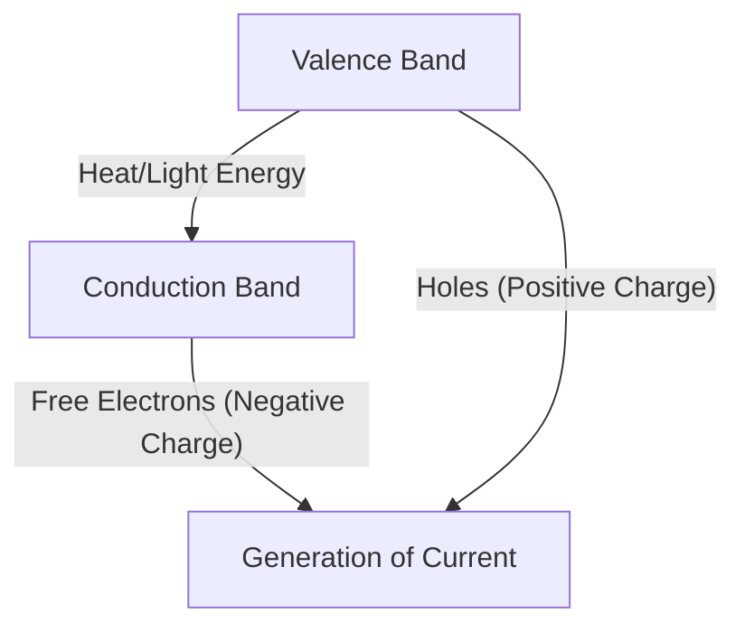
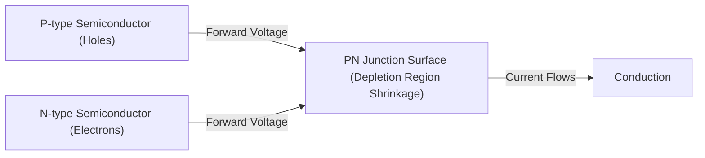
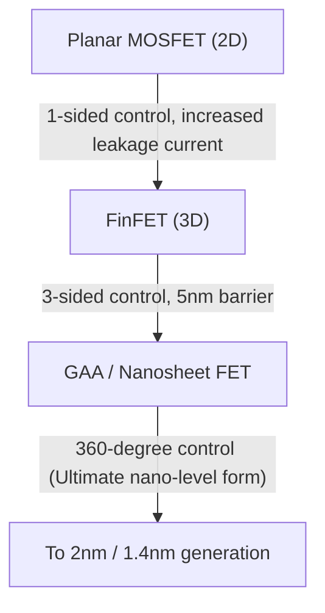

Modern digital society is built on the "magic stone" called semiconductors. From smartphones, computers, and cars to the massive data centers powering AI, all computation and control are performed by semiconductor devices. However, not many people deeply understand the physical mechanisms underlying them. In this article, we will unravel the basics of semiconductors from a quantum mechanical perspective, and explain the complete picture of semiconductors and transistors in overwhelming detail, covering PN junction diodes, MOSFETs, and the latest FinFET and GAA (Gate-All-Around) technologies.

## 1. Electrical Properties of Matter and Quantum Mechanics of Band Gaps

Why do some materials easily conduct electricity (conductors) while others do not (insulators)? And what exactly are "semiconductors" that sit in between? To answer this question, we must understand the "band theory" of quantum mechanics.

### 1.1 Behavior of Atoms and Electrons
Atoms consist of a nucleus and electrons orbiting around it. According to quantum mechanics, electrons cannot have continuous energy; they can only take specific, discrete energy levels. When multiple atoms bond to form a crystal, the energy levels of each atom overlap, forming "energy bands" consisting of countless closely spaced energy levels.

### 1.2 Classification by Band Theory
Energy bands are mainly divided into the "Valence Band," which is filled with electrons, and the "Conduction Band," where electrons do not exist (or partially exist). Between these two bands lies the "Band Gap," a region where electrons cannot exist.

- **Conductors (metals, etc.)**: The valence band and conduction band overlap, or there are already many electrons in the conduction band. Therefore, with just a slight voltage (energy), electrons can move freely, allowing current to flow.
- **Insulators (glass, rubber, etc.)**: The valence band is completely filled with electrons, and the band gap between it and the conduction band is extremely large (usually several eV or more), so electrons cannot jump to the conduction band with normal thermal energy at room temperature.
- **Semiconductors (silicon, germanium, etc.)**: Like insulators, the valence band is filled, but the band gap is relatively small (about 1.1 eV for silicon), so when thermal or light energy is applied, some electrons can jump across the band gap and be excited into the conduction band.

Both the electrons excited into the conduction band (free electrons) and the electron holes left in the valence band act as "carriers" that transport charge, allowing current to flow. This is the basic mechanism of a semiconductor.

## 2. Silicon Crystals and Covalent Bonds
Silicon (Si), the second most abundant element on Earth after oxygen, is the main character in semiconductors. A silicon atom has four valence electrons in its outermost shell. In a pure silicon crystal (intrinsic semiconductor), each silicon atom shares one valence electron with four adjacent silicon atoms, forming highly stable connections called "covalent bonds."

At absolute zero (-273.15°C), all electrons are trapped in covalent bonds, making silicon a perfect insulator. However, at room temperature, thermal energy breaks some of these covalent bonds, creating pairs of free electrons and holes (electron-hole pairs), allowing a tiny amount of electricity to flow. But pure silicon has too few carriers to be used as a practical electronic component. This is where the magic of "doping" comes in.

## 3. Doping: The Birth of N-type and P-type Semiconductors
Intentionally mixing a minuscule amount (one in several million to hundreds of millions) of impurities into pure silicon (intrinsic semiconductor) is called "doping." By changing the type of this impurity (dopant), we can create two types of semiconductors with completely different properties.

### 3.1 N-type Semiconductor (Negative type)
Elements with five valence electrons (donors), such as phosphorus (P) or arsenic (As), are mixed into silicon (which has four valence electrons). When a phosphorus atom enters the silicon crystal lattice, only four electrons are used for the covalent bonds, leaving the fifth electron of the phosphorus atom as an extra. This extra electron easily breaks free from the covalent bond and becomes a "free electron" that can move freely within the crystal at room temperature thermal energy.
Since electrons have a negative charge, this semiconductor, where electrons are the primary carriers, is called an "N-type semiconductor."

### 3.2 P-type Semiconductor (Positive type)
Conversely, elements with only three valence electrons (acceptors), such as boron (B) or gallium (Ga), are mixed into silicon. Because one electron is missing to form the covalent bonds, an empty room called a "hole" is created there. When an electron from a neighboring bond moves into this empty room, its original location becomes a new hole. In this way, holes move through the crystal as if they were particles with a positive charge, carrying current. This is a "P-type semiconductor."

## 4. Mechanisms of PN Junctions and Diodes
Simply physically attaching a P-type semiconductor and an N-type semiconductor together does nothing, but joining them continuously at the atomic level (PN junction) results in a very interesting physical phenomenon. This is the basic principle of a "diode."

### 4.1 Formation of the Depletion Region
The moment a PN junction is formed, the abundant free electrons in the N-type region and the abundant holes in the P-type region begin to diffuse due to their concentration difference. When free electrons and holes meet near the junction, they combine and disappear (recombination).
As a result, a region is formed near the junction where no carriers (neither free electrons nor holes) exist. This is called the "Depletion Region." Once the depletion region is formed, positive ions remain on the N-type side and negative ions remain on the P-type side, generating an electric field (built-in potential) inside. This electric field acts as a barrier (potential barrier) that prevents further diffusion of electrons and holes.

### 4.2 Rectification (One-way Current)
When a voltage is applied to the PN junction from the outside, its behavior is completely different depending on the direction.

- **Forward Bias**: A positive voltage is applied to the P-type side and a negative voltage to the N-type side. The external voltage cancels out the internal potential barrier, pushing the P-type holes towards the N-type and the N-type electrons towards the P-type, causing the depletion region to shrink and disappear. As a result, a large amount of current flows vigorously.
- **Reverse Bias**: A negative voltage is applied to the P-type side and a positive voltage to the N-type side. The electrons and holes are pulled away from the junction surface, respectively, and the depletion region widens further. Because the potential barrier becomes higher, almost no current flows.

This property of allowing current to flow in only one direction is called "rectification," and it plays an essential role in power supply circuits that convert AC (alternating current) to DC (direct current).

## 5. The Birth of the Transistor and MOSFET
While the diode was a revolutionary component, it is nothing more than a one-way valve. What humanity truly desired was a magic device that could freely "amplify" and "switch" electrical signals—the "transistor."

### 5.1 From Bipolar Transistors to Field-Effect Transistors
Early transistors were bipolar transistors with PNP or NPN structures, but they faced issues such as difficult manufacturing and high power consumption. Today, more than 99% of the world's digital circuits are composed of a type of transistor called a "MOSFET (Metal-Oxide-Semiconductor Field-Effect Transistor)."

### 5.2 MOSFET Structure and Operating Principle
A MOSFET (taking an N-channel enhancement mode as an example here) consists of the following four terminals (the substrate is usually connected to the source, making it effectively a 3-terminal device).
1. **Source**: The supply source of carriers (electrons) (N-type).
2. **Drain**: The discharge destination of carriers (N-type).
3. **Gate**: The "faucet" handle that controls the flow of current.
4. **Substrate / Body**: The entire substrate (P-type).

Two N-type regions (source and drain) are created within a P-type silicon substrate. As it is, the P-type region stands between the source and the drain (back-to-back PN junctions), so even if a positive voltage is applied to the drain, no current will flow.
An extremely thin insulating film (silicon oxide) is formed on the P-type region between the source and drain, and a metal or polysilicon electrode (gate) is placed on top of it.

**Switch ON Mechanism: Channel Formation**
When a positive voltage is applied to the gate electrode, a change occurs in the P-type silicon region immediately below the insulating film. The positive voltage repels the holes, which are the majority carriers in the P-type region, pushing them deeper into the substrate (depletion), while simultaneously attracting the minority carrier electrons, which exist sparingly in the P-type region, to the surface.
When the gate voltage exceeds a certain value (Threshold Voltage), electrons gather closely on the surface directly beneath the insulating film, and the formerly P-type region locally inverts into an N-type. This is called the "Inversion Layer" or "Channel."
Once the channel is formed, the N-type source and N-type drain are connected by the N-type channel, and current flows beautifully!

**Switch OFF Mechanism**
When the gate voltage returns to zero, the attracted electrons scatter, and the channel disappears. The P-type wall stands in the way again, and the current is blocked.
In this way, the greatest feature of a MOSFET is that it can turn ON/OFF a massive current between the source and drain with just a slight voltage applied to the gate. Furthermore, since the gate is isolated by an insulating film, almost no current flows through the gate itself, allowing it to be driven with extremely low power consumption (this is the core of CMOS technology).

## 6. Moore's Law and the Limits of Miniaturization
In 1965, Gordon Moore, co-founder of Intel, proposed an empirical rule stating that "the number of transistors incorporated into a semiconductor integrated circuit doubles approximately every two years." This is the famous "Moore's Law." The smaller the transistors were made (miniaturization), the more circuits could be packed into a single chip. Furthermore, because the travel distance of electrons became shorter, operating speeds increased, and voltages could be lowered, reducing power consumption. This magical virtuous cycle, known as "Dennard Scaling," continued for decades.

However, entering the 2000s, a shadow began to fall over this magic. As transistors shrank to the nanometer scale, physical limits (quantum mechanical effects) became pronounced.

### 6.1 Short Channel Effect and Leakage Current
When the distance between the source and drain (channel length) becomes extremely short, the voltage of the drain lowers the potential barrier on the source side even when the gate voltage is OFF, causing current to unintentionally leak out. This is called the "Short Channel Effect."
Additionally, the gate insulating film became as thin as several atomic layers, leading to a serious problem called "gate leakage current," where electrons slip through the insulating film due to quantum tunneling. Since electricity continues to leak even when the switch is turned off, this causes smartphones to heat up and batteries to drain quickly.

## 7. Evolution to 3D Structures: From FinFET to GAA
To break through the limits of miniaturization, semiconductor engineers fundamentally re-evaluated the structure of the transistor itself. It was a paradigm shift from a planar (2D) to a three-dimensional (3D) structure.

### 7.1 The Advent of FinFET
Around 2011, Intel and others commercialized the "FinFET (Fin Field-Effect Transistor)." While conventional MOSFETs created a channel on a planar substrate, FinFET stands the silicon substrate vertically like a fish's fin, and places the gate electrode so as to straddle that fin.
In the planar type, the gate could only control the channel from one side ("above"), but in FinFET, the channel can be controlled by wrapping it from three directions: "top, left, and right." This dramatically improved the gate's electric field dominance (electrostatic control), powerfully suppressing the short channel effect and succeeding in significantly reducing leakage current. With the advent of FinFET, Moore's Law was breathed new life, becoming the main player from the 22nm to the 5nm generation.

### 7.2 The Ultimate Structure: GAA (Gate-All-Around)
However, as miniaturization advanced further to 3nm and 2nm, limits started to appear even with FinFET's 3-sided control. Therefore, the next-generation transistor structure, "GAA (Gate-All-Around)," emerged.
In GAA, the silicon that serves as the channel is made into thin wires (nanowires) or sheets (nanosheets: called MBCFET by Samsung, RibbonFET by Intel, etc.) and completely suspended in midair, with the gate electrode wrapping around all 360 degrees of its circumference (literally Gate-All-Around).
This brings the gate's channel control capability to its physical limit, making it possible to almost completely block leakage current. Furthermore, by flexibly changing the width of the nanosheets, there is a major advantage in that it becomes easier to optimally design performance-oriented circuits and power-saving-oriented circuits on a single chip.

## 8. Towards the Future
The evolution of semiconductors is a crystallization of physics, chemistry, materials science, astronomical-scale capital investment, and human wisdom. The magic of quantum mechanics, which precisely controls the behavior of a single electron, turns ON/OFF billions of times per second in the palm of our hands, creating a massive digital universe.
After GAA, research is also progressing on CFETs (Complementary FETs) that stack transistors vertically, and new materials to replace silicon (such as carbon nanotubes and 2D transition metal dichalcogenides). The "magic" woven by semiconductors will continue to push the boundaries of humanity and carve out a new future.
