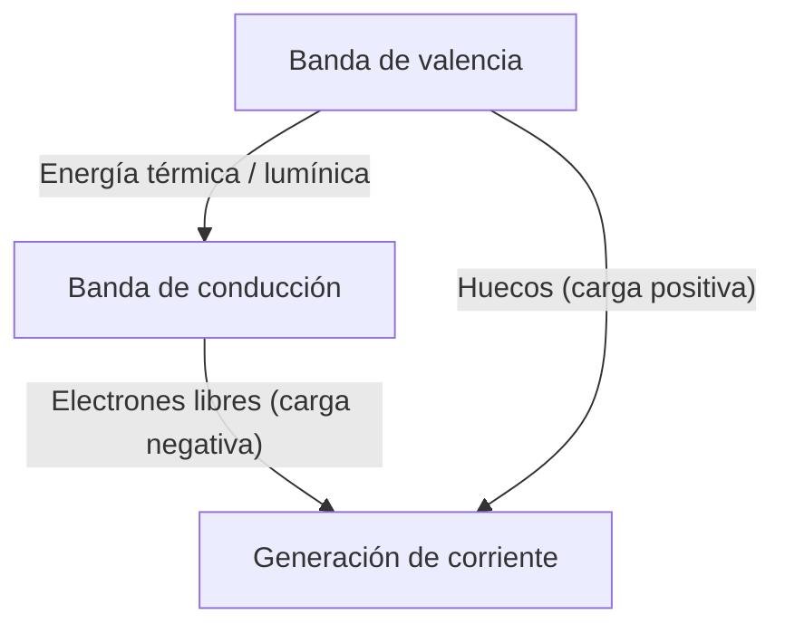
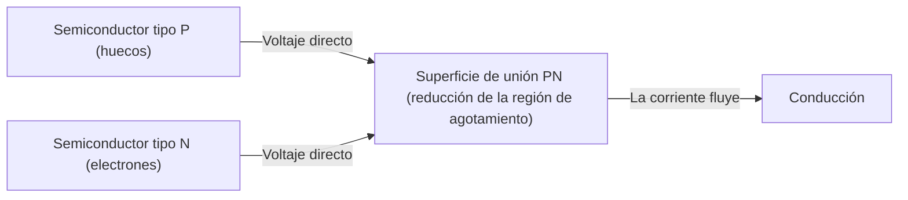
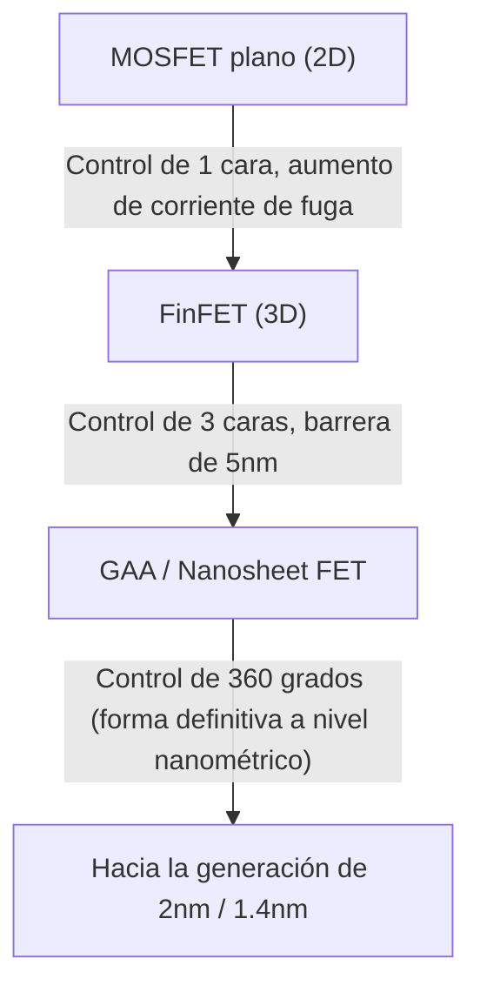

La sociedad digital moderna está construida sobre "piedras mágicas" llamadas semiconductores. Desde teléfonos inteligentes, computadoras y automóviles hasta los gigantescos centros de datos que impulsan la IA, todos los cálculos y controles son realizados por dispositivos semiconductores. Sin embargo, no mucha gente comprende profundamente los mecanismos físicos subyacentes. En este artículo, desentrañaremos los conceptos básicos de los semiconductores desde una perspectiva de mecánica cuántica, y explicaremos la imagen completa de los semiconductores y transistores, incluidos los diodos de unión PN, MOSFETs, y las últimas tecnologías FinFET y GAA (Gate-All-Around), con un detalle asombroso.

## 1. Propiedades eléctricas de la materia y mecánica cuántica de la banda prohibida

¿Por qué algunos materiales conducen fácilmente la electricidad (conductores) y otros no (aislantes)? ¿Y qué son los "semiconductores" que se encuentran en el medio? Para responder a esta pregunta, necesitamos entender la "teoría de bandas" de la mecánica cuántica.

### 1.1 El comportamiento de átomos y electrones
Los átomos están formados por un núcleo y electrones que orbitan a su alrededor. Según la mecánica cuántica, los electrones no pueden tener energía continua, sino que sólo pueden tomar niveles de energía discretos específicos. Cuando múltiples átomos se combinan para formar un cristal, los niveles de energía de cada átomo se superponen, formando "bandas de energía" que consisten en innumerables niveles de energía estrechamente espaciados.

### 1.2 Clasificación por teoría de bandas
Las bandas de energía se dividen principalmente en la "banda de valencia (Valence Band)", que está llena de electrones, y la "banda de conducción (Conduction Band)", donde no existen electrones (o existen parcialmente). Y entre estas dos bandas, hay una "banda prohibida (Band Gap)" que es una región donde no pueden existir electrones.

- **Conductores (como metales)**: La banda de valencia y la banda de conducción se superponen, o ya hay muchos electrones en la banda de conducción. Por lo tanto, aplicando solo un ligero voltaje (energía), los electrones pueden moverse libremente y fluye la corriente.
- **Aislantes (vidrio, caucho, etc.)**: La banda de valencia está completamente llena de electrones y la banda prohibida entre ella y la banda de conducción es muy grande (generalmente varios eV o más), por lo que los electrones no pueden saltar a la banda de conducción con energía térmica a temperatura ambiente.
- **Semiconductores (silicio, germanio, etc.)**: Al igual que los aislantes, la banda de valencia está llena, pero la banda prohibida es relativamente pequeña (alrededor de 1.1 eV para el silicio). Por lo tanto, cuando se aplica energía térmica o luminosa, algunos electrones saltan la banda prohibida y son excitados a la banda de conducción.

Los electrones excitados a la banda de conducción (electrones libres) y los huecos dejados por los electrones en la banda de valencia (huecos: holes), ambos actúan como "portadores" que transportan carga, permitiendo que la corriente fluya. Este es el mecanismo básico de un semiconductor.

## 2. Cristal de silicio y enlaces covalentes
El silicio (Si), el segundo elemento más abundante en la Tierra después del oxígeno, es el protagonista de los semiconductores. Un átomo de silicio tiene 4 electrones de valencia en su capa más externa. En un cristal de silicio puro (semiconductor intrínseco), cada átomo de silicio comparte un electrón de valencia con 4 átomos de silicio adyacentes, formando conexiones muy estables llamadas "enlaces covalentes".

En el cero absoluto (-273.15℃), todos los electrones están atrapados en enlaces covalentes, por lo que el silicio es un aislante perfecto. Sin embargo, a temperatura ambiente, algunos enlaces covalentes se rompen por la energía térmica, se generan pares de electrones libres y huecos (pares electrón-hueco), y fluye una pequeña cantidad de electricidad. Sin embargo, el silicio puro por sí solo tiene muy pocos portadores y no puede usarse como un componente electrónico práctico. Es por eso que se utiliza la magia del "dopaje".

## 3. Dopaje: El nacimiento de los semiconductores tipo N y tipo P
Añadir intencionalmente una cantidad muy pequeña de impurezas (una por cada varios millones a cientos de millones) al silicio puro (semiconductor intrínseco) se llama "dopaje". Al cambiar el tipo de impureza (dopante), se pueden crear dos tipos de semiconductores con propiedades completamente diferentes.

### 3.1 Semiconductor tipo N (tipo Negativo)
Al silicio (4 electrones de valencia), se le añaden elementos (donantes) con 5 electrones de valencia, como fósforo (P) o arsénico (As). Entonces, el átomo de fósforo entra en la estructura de red del cristal de silicio, pero dado que solo se usan 4 electrones para el enlace covalente, el quinto electrón del átomo de fósforo sobra. Este electrón sobrante se libera fácilmente de la restricción del enlace covalente y se convierte en un "electrón libre" que se mueve libremente en el cristal con energía térmica a temperatura ambiente.
Como el electrón tiene una carga negativa (Negative), este semiconductor donde los electrones son los principales portadores se llama "semiconductor tipo N".

### 3.2 Semiconductor tipo P (tipo Positivo)
A la inversa, al silicio se le añaden elementos (aceptores) con solo 3 electrones de valencia, como boro (B) o galio (Ga). Para formar un enlace covalente, falta un electrón, y allí se crea una habitación vacía llamada "hueco (hole)". Cuando un electrón de un enlace adyacente se mueve a esta habitación vacía, el lugar original se convierte en un nuevo hueco. De esta manera, los huecos se mueven por el cristal y transportan corriente, como si fueran partículas con carga positiva (Positive). Este es un "semiconductor tipo P".

## 4. Unión PN y el mecanismo del diodo
Si simplemente se unen físicamente un semiconductor tipo P y un semiconductor tipo N, no sucede nada, pero si se unen de forma continua a nivel atómico (unión PN), ocurre un fenómeno físico muy interesante. Este es el principio básico de un "diodo".

### 4.1 Formación de la región de agotamiento
En el momento en que se forma una unión PN, los abundantes electrones libres en la región tipo N y los abundantes huecos en la región tipo P comienzan a difundirse debido a la diferencia de concentración entre sí. Cuando un electrón libre y un hueco se encuentran cerca de la superficie de unión, se unen y desaparecen (se recombinan).
Como resultado, se forma una región sin portadores (ni electrones libres ni huecos) cerca de la superficie de unión. Esto se llama "región de agotamiento (Depletion Region)". Cuando se forma la región de agotamiento, quedan iones positivos en el lado tipo N y iones negativos en el lado tipo P, generando un campo eléctrico interno (potencial interno) en el interior. Este campo eléctrico actúa como una barrera (barrera de potencial) que impide una mayor difusión de electrones y huecos.

### 4.2 Acción rectificadora (corriente unidireccional)
Cuando se aplica un voltaje externo a una unión PN, el comportamiento es completamente diferente según la dirección en que se aplique.

- **Polarización directa**: Se aplica un voltaje positivo al lado tipo P y un voltaje negativo al lado tipo N. Entonces, el voltaje externo cancela la barrera de potencial interna, los huecos del tipo P son empujados hacia el tipo N y los electrones del tipo N hacia el tipo P, y la región de agotamiento se reduce y desaparece. Como resultado, una gran cantidad de corriente fluye vigorosamente.
- **Polarización inversa**: Se aplica un voltaje negativo al lado tipo P y un voltaje positivo al lado tipo N. Entonces, los electrones y los huecos son atraídos en una dirección que los aleja de la superficie de unión, y la región de agotamiento se expande aún más. Como la barrera de potencial aumenta, casi no fluye corriente.

Esta propiedad de permitir que la corriente fluya solo en una dirección se llama "acción rectificadora", y juega un papel esencial en los circuitos de alimentación que convierten CA (corriente alterna) en CC (corriente continua).

## 5. El nacimiento del transistor y el MOSFET
El diodo fue un elemento revolucionario, pero era solo una válvula unidireccional. Lo que la humanidad realmente buscaba era un dispositivo mágico que pudiera realizar "amplificación" y "conmutación" de señales eléctricas a voluntad, a saber, el "transistor".

### 5.1 Del transistor bipolar al transistor de efecto de campo
Los primeros transistores eran transistores bipolares con estructuras PNP o NPN, pero tenían problemas porque eran difíciles de fabricar y consumían mucha energía. Hoy en día, más del 99% de los circuitos digitales en todo el mundo están compuestos por un tipo de transistor llamado "MOSFET (Metal-Oxide-Semiconductor Field-Effect Transistor: Transistor de efecto de campo metal-óxido-semiconductor)".

### 5.2 Estructura y principio de funcionamiento del MOSFET
Un MOSFET (aquí usamos el tipo canal N en modo de enriquecimiento como ejemplo) consta de los siguientes cuatro terminales (normalmente, el sustrato está conectado a la fuente, por lo que en la práctica se trata como de 3 terminales).
1. **Fuente (Source)**: Fuente de suministro de portadores (electrones) (tipo N).
2. **Drenador (Drain)**: Destino de escape de los portadores (tipo N).
3. **Puerta (Gate)**: La manija del "grifo" que controla el flujo de corriente.
4. **Sustrato (Substrate / Body)**: El sustrato completo (tipo P).

Se crean dos regiones tipo N (fuente y drenador) en un sustrato de silicio tipo P. Tal como están, una región tipo P se interpone entre la fuente y el drenador (uniones PN espalda con espalda), e incluso si se aplica un voltaje positivo al drenador, la corriente no fluirá.
Sobre la región tipo P entre la fuente y el drenador, se forma una película aislante muy delgada (óxido de silicio: Oxide), y encima se coloca un electrodo de metal o polisilicio (puerta: Metal).

**Mecanismo de encendido (ON): Formación del canal**
Cuando se aplica un voltaje positivo al electrodo de la puerta, se produce un cambio en la región de silicio tipo P justo debajo, separada por la película aislante. Debido al voltaje positivo, los huecos, que son los portadores mayoritarios en la región tipo P, son repelidos y empujados hacia la profundidad del sustrato (agotamiento) y, al mismo tiempo, los electrones, que son los portadores minoritarios y están ligeramente presentes en la región tipo P, son atraídos hacia la superficie.
Cuando el voltaje de la puerta excede un cierto valor (voltaje umbral: Threshold Voltage), los electrones se concentran en la superficie justo debajo de la película aislante, y la región que era tipo P se invierte localmente a tipo N. Esto se llama "capa de inversión (Inversion Layer)" o "canal (Channel)".
Cuando se forma el canal, la fuente tipo N y el drenador tipo N se conectan mediante el canal tipo N, ¡y la corriente fluye maravillosamente!

**Mecanismo de apagado (OFF)**
Cuando el voltaje de la puerta vuelve a cero, los electrones que habían sido atraídos se dispersan y el canal desaparece. La pared tipo P se interpone de nuevo, y se corta la corriente.
De esta manera, la mayor característica del MOSFET es que una corriente enorme entre la fuente y el drenador se puede encender y apagar (ON/OFF) con solo aplicar un ligero voltaje a la puerta. Además, como la puerta está aislada por la película aislante, casi no fluye corriente a través de la puerta en sí, y puede accionarse con un consumo de energía extremadamente bajo (este es el núcleo de la tecnología CMOS).

## 6. La ley de Moore y los límites de la miniaturización
En 1965, el cofundador de Intel, Gordon Moore, propuso una regla empírica de que "el número de transistores en un circuito integrado semiconductor se duplica aproximadamente cada dos años". Esta es la famosa "Ley de Moore". Cuanto más pequeños se hacen los transistores (miniaturización), no solo se pueden empaquetar más circuitos en un solo chip, sino que la distancia de desplazamiento de los electrones se vuelve más corta, por lo que aumenta la velocidad de funcionamiento, y el voltaje también se puede reducir, por lo que disminuye el consumo de energía. Este círculo virtuoso mágico llamado "escala de Dennard (Dennard Scaling)" continuó durante décadas.

Sin embargo, a partir de la década de 2000, esta magia comenzó a mostrar signos de desvanecimiento. A medida que los transistores se redujeron a la escala de los nanómetros, los límites físicos (efectos de mecánica cuántica) se hicieron evidentes.

### 6.1 Efecto de canal corto y corriente de fuga
Cuando la distancia entre la fuente y el drenador (longitud del canal) se vuelve extremadamente corta, incluso cuando el voltaje de la puerta está en estado OFF, el voltaje del drenador reduce la barrera de potencial del lado de la fuente, y ocurre el fenómeno de que la corriente se filtra involuntariamente. Esto se llama "efecto de canal corto (Short Channel Effect)".
Además, la película aislante de la puerta se ha vuelto tan delgada como unas pocas capas atómicas, y la "corriente de fuga de puerta", en la que los electrones atraviesan la película aislante mediante el efecto de túnel cuántico, también se ha convertido en un problema grave. Como la electricidad sigue filtrándose incluso cuando se apaga el interruptor, hace que el teléfono inteligente se caliente y la batería se agote rápidamente.

## 7. Evolución hacia estructuras tridimensionales: de FinFET a GAA
Para superar el límite de la miniaturización, los ingenieros de semiconductores revisaron fundamentalmente la propia estructura de los transistores. Este es un cambio de paradigma de plano (2D) a tridimensional (3D).

### 7.1 Aparición del FinFET
Alrededor de 2011, Intel y otras empresas pusieron en uso práctico el "FinFET (Fin Field-Effect Transistor)". Mientras que los MOSFET convencionales creaban un canal en un sustrato plano, el FinFET levanta el sustrato de silicio verticalmente como la aleta (Fin) de un pez, y coloca el electrodo de la puerta de manera que se asiente a horcajadas sobre la aleta.
En el tipo plano, la puerta solo podía controlar el canal desde 1 lado "arriba", pero en el FinFET, el canal se puede controlar para envolverlo desde 3 direcciones: "arriba, izquierda, derecha". Como resultado, el dominio del campo eléctrico por la puerta (control electrostático) mejoró drásticamente, suprimiendo fuertemente el efecto de canal corto y reduciendo significativamente la corriente de fuga. Con la aparición del FinFET, la ley de Moore resucitó y se convirtió en la protagonista desde la generación de 22nm hasta la de 5nm.

### 7.2 La estructura definitiva: GAA (Gate-All-Around)
Sin embargo, a medida que avanzaba la miniaturización a 3nm y 2nm, se hizo visible el límite incluso con el control de 3 lados del FinFET. Entonces apareció la estructura de transistores de próxima generación, el "GAA (Gate-All-Around)".
En el GAA, el silicio que sirve como canal tiene forma de cable fino (nanocable) o en forma de lámina (nanolámina: llamado MBCFET por Samsung, RibbonFET por Intel, etc.) y flota completamente en el aire, envolviendo los 360 grados a su alrededor con el electrodo de puerta (literalmente Gate-All-Around).
Como resultado, la capacidad de control del canal por la puerta alcanza su límite físico, haciendo posible bloquear casi por completo la corriente de fuga. Además, al cambiar de manera flexible el ancho de las nanoláminas, hay una gran ventaja de que es más fácil optimizar el diseño de circuitos que priorizan el rendimiento y circuitos que priorizan el ahorro de energía en un solo chip.

## 8. Hacia el futuro
La evolución de los semiconductores es una cristalización de la física, la química, la ciencia de los materiales, así como inversiones de capital a escala astronómica y la sabiduría humana. La magia de la mecánica cuántica que controla con precisión el comportamiento de un solo electrón se repite encendiendo y apagando (ON/OFF) a una velocidad asombrosa de miles de millones de veces por segundo en la palma de nuestra mano, creando un vasto universo digital.
Después de GAA, avanza la investigación de CFET (Complementary FET), donde los transistores se apilan verticalmente, y de nuevos materiales para reemplazar el silicio (como nanotubos de carbono y dicalcogenuros de metales de transición 2D). La "magia" tejida por los semiconductores seguirá ampliando los límites de la humanidad y abriendo un nuevo futuro.
