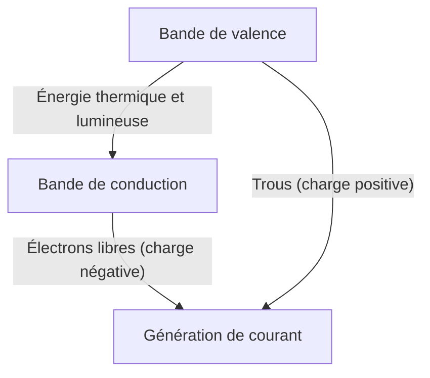
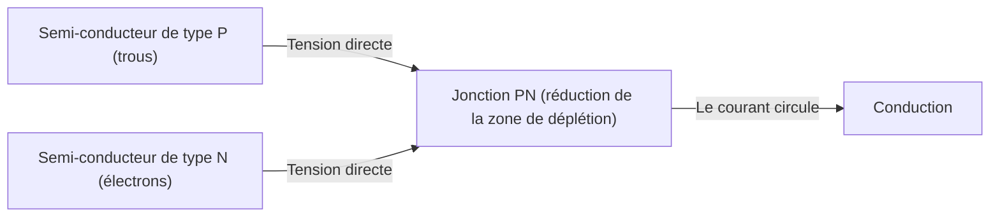
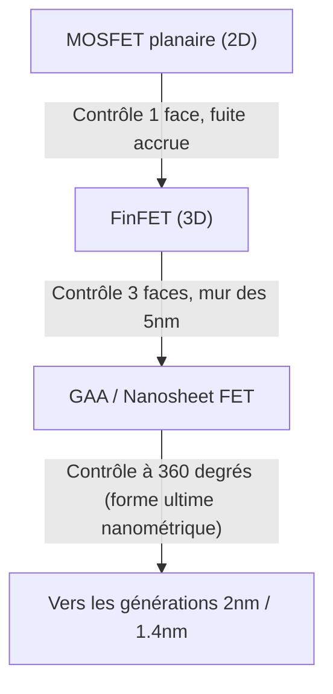

La société numérique moderne repose sur la "pierre magique" que sont les semi-conducteurs. Des smartphones aux ordinateurs, en passant par les automobiles et les immenses centres de données qui alimentent l'IA, tous les calculs et contrôles sont effectués par des dispositifs à semi-conducteurs. Cependant, rares sont ceux qui comprennent profondément les mécanismes physiques sous-jacents. Dans cet article, nous démystifierons les bases des semi-conducteurs du point de vue de la mécanique quantique, et expliquerons en détail l'ensemble de la technologie des semi-conducteurs et des transistors, des diodes à jonction PN aux MOSFET, jusqu'aux dernières technologies FinFET et GAA (Gate-All-Around).

## 1. Propriétés électriques des matériaux et mécanique quantique de la bande interdite

Pourquoi certains matériaux conduisent-ils facilement l'électricité (conducteurs) et d'autres non (isolants) ? Et que sont les "semi-conducteurs" qui se situent entre les deux ? Pour répondre à cette question, il est nécessaire de comprendre la "théorie des bandes" de la mécanique quantique.

### 1.1 Comportement des atomes et des électrons
Les atomes sont constitués d'un noyau atomique et d'électrons qui gravitent autour. Selon la mécanique quantique, les électrons ne peuvent pas avoir une énergie continue, mais seulement des niveaux d'énergie discrets spécifiques. Lorsque plusieurs atomes se lient pour former un cristal, les niveaux d'énergie de chaque atome se chevauchent, formant une "bande d'énergie" composée d'innombrables niveaux d'énergie rapprochés.

### 1.2 Classification par la théorie des bandes
Les bandes d'énergie se divisent principalement en "bande de valence" (Valence Band), qui est remplie d'électrons, et en "bande de conduction" (Conduction Band), où il n'y a pas d'électrons (ou partiellement). Entre ces deux bandes, il existe une région où les électrons ne peuvent pas exister, appelée "bande interdite" (gap ou bandgap).

- **Conducteurs (métaux, etc.)** : La bande de valence et la bande de conduction se chevauchent, ou la bande de conduction contient déjà de nombreux électrons. Ainsi, avec une légère tension (énergie), les électrons peuvent se déplacer librement et le courant circule.
- **Isolants (verre, caoutchouc, etc.)** : La bande de valence est complètement remplie d'électrons et la bande interdite avec la bande de conduction est très large (généralement plusieurs eV), de sorte que l'énergie thermique à température ambiante ne permet pas aux électrons de sauter dans la bande de conduction.
- **Semi-conducteurs (silicium, germanium, etc.)** : Comme pour les isolants, la bande de valence est remplie, mais la bande interdite est relativement petite (environ 1,1 eV pour le silicium), de sorte que lorsqu'ils reçoivent de la chaleur ou de l'énergie lumineuse, certains électrons franchissent la bande interdite et sont excités dans la bande de conduction.

Les électrons excités dans la bande de conduction (électrons libres) et les "trous" laissés dans la bande de valence agissent tous deux comme des "porteurs" de charge, permettant au courant de circuler. C'est le mécanisme de base des semi-conducteurs.

## 2. Cristal de silicium et liaison covalente
Le silicium (Si), le deuxième élément le plus abondant sur Terre après l'oxygène, est la vedette des semi-conducteurs. L'atome de silicium possède 4 électrons de valence dans sa couche périphérique. Dans un cristal de silicium pur (semi-conducteur intrinsèque), chaque atome de silicium partage un électron de valence avec 4 atomes de silicium voisins, formant un lien très stable appelé "liaison covalente".

Au zéro absolu (-273,15°C), tous les électrons sont emprisonnés dans les liaisons covalentes, le silicium est donc un isolant parfait. Cependant, à température ambiante, l'énergie thermique brise certaines liaisons covalentes, générant des paires électron-trou, et une petite quantité d'électricité peut circuler. Mais le silicium pur a trop peu de porteurs pour être utilisé comme composant électronique pratique. C'est là qu'intervient la magie du "dopage".

## 3. Dopage : Naissance des semi-conducteurs de type N et de type P
L'introduction intentionnelle d'une infime quantité (une pour plusieurs millions à plusieurs centaines de millions) d'impuretés dans du silicium pur (semi-conducteur intrinsèque) s'appelle le "dopage". En modifiant le type de cette impureté (dopant), il est possible de créer deux types de semi-conducteurs aux propriétés complètement différentes.

### 3.1 Semi-conducteur de type N (Negative type)
On mélange au silicium (4 électrons de valence) un élément possédant 5 électrons de valence (donneur), tel que le phosphore (P) ou l'arsenic (As). L'atome de phosphore s'insère alors dans la structure en réseau du cristal de silicium, mais comme seuls 4 électrons sont utilisés pour la liaison covalente, le 5ème électron du phosphore est en excès. Cet électron supplémentaire se détache facilement de la liaison covalente et devient un "électron libre" qui se déplace facilement dans le cristal avec l'énergie thermique à température ambiante.
Comme l'électron a une charge négative (Negative), ce semi-conducteur, dont les électrons sont les principaux porteurs, est appelé "semi-conducteur de type N".

### 3.2 Semi-conducteur de type P (Positive type)
À l'inverse, on mélange au silicium un élément ne possédant que 3 électrons de valence (accepteur), comme le bore (B) ou le gallium (Ga). Il manque un électron pour former une liaison covalente complète, ce qui crée un espace vide appelé "trou" (hole). Lorsqu'un électron provenant d'une liaison voisine se déplace dans cet espace vide, l'endroit où il se trouvait devient un nouveau trou. Ainsi, le trou se déplace dans le cristal comme une particule chargée positivement (Positive) et transporte le courant. C'est le "semi-conducteur de type P".

## 4. Mécanisme de la jonction PN et de la diode
Le simple fait de coller physiquement un semi-conducteur de type P et un semi-conducteur de type N ne produit rien, mais si on les joint de manière continue au niveau atomique (jonction PN), un phénomène physique très intéressant se produit. C'est le principe de base de la "diode".

### 4.1 Formation de la zone de déplétion
Au moment où la jonction PN est formée, les nombreux électrons libres de la région de type N et les nombreux trous de la région de type P commencent à diffuser en raison de leur différence de concentration. Lorsque des électrons libres et des trous se rencontrent près de la jonction, ils se combinent et disparaissent (recombinaison).
En conséquence, une région sans porteurs (ni électrons libres ni trous) se forme près de la jonction. C'est ce qu'on appelle la "zone de charge d'espace" ou "zone de déplétion" (Depletion Region). Lorsque la zone de déplétion se forme, des ions positifs restent du côté N et des ions négatifs du côté P, créant un champ électrique interne. Ce champ électrique agit comme une barrière (barrière de potentiel) qui empêche toute diffusion supplémentaire d'électrons et de trous.

### 4.2 Effet redresseur (Courant à sens unique)
Le comportement de la jonction PN lorsqu'une tension externe est appliquée varie complètement selon la direction.

- **Polarisation directe** : On applique une tension positive du côté P et négative du côté N. La tension externe annule alors la barrière de potentiel interne, les trous de type P sont poussés vers le type N et les électrons de type N vers le type P, ce qui réduit et élimine la zone de déplétion. En conséquence, un courant important circule.
- **Polarisation inverse** : On applique une tension négative du côté P et positive du côté N. Les électrons et les trous sont alors éloignés de la jonction, ce qui élargit encore la zone de déplétion. La barrière de potentiel devenant plus élevée, presque aucun courant ne circule.

Cette propriété de ne laisser passer le courant que dans une seule direction s'appelle l'"effet redresseur", et joue un rôle essentiel dans les circuits d'alimentation qui convertissent le courant alternatif (AC) en courant continu (DC).

## 5. Naissance du transistor et MOSFET
La diode était un composant révolutionnaire, mais elle n'est qu'une simple valve à sens unique. Ce que l'humanité recherchait vraiment, c'était un dispositif magique capable d'amplifier et de commuter librement des signaux électriques, à savoir le "transistor".

### 5.1 Du transistor bipolaire au transistor à effet de champ
Les premiers transistors étaient des transistors bipolaires à structure PNP ou NPN, mais ils étaient difficiles à fabriquer et consommaient beaucoup d'énergie. Aujourd'hui, plus de 99 % des circuits numériques dans le monde sont composés d'un type de transistor appelé "MOSFET" (Metal-Oxide-Semiconductor Field-Effect Transistor : transistor à effet de champ métal-oxyde-semi-conducteur).

### 5.2 Structure et principe de fonctionnement du MOSFET
Le MOSFET (en prenant ici l'exemple du mode d'enrichissement à canal N) est composé des 4 bornes suivantes (généralement, le substrat est connecté à la source, il est donc traité comme un composant à 3 bornes).
1. **Source** : Source d'alimentation des porteurs (électrons) (type N).
2. **Drain** : Point de sortie des porteurs (type N).
3. **Grille (Gate)** : La poignée du "robinet" qui contrôle le flux de courant.
4. **Substrat (Substrate / Body)** : L'ensemble de la base (type P).

Deux régions de type N (source et drain) sont créées dans un substrat de silicium de type P. En l'état, une région de type P fait obstacle entre la source et le drain (jonctions PN dos à dos), de sorte qu'aucun courant ne circule même si une tension positive est appliquée au drain.
Sur la région de type P entre la source et le drain, un très fin film isolant (oxyde de silicium : Oxide) est formé, sur lequel est placée une électrode en métal ou en polysilicium (grille : Metal).

**Mécanisme de mise sous tension (ON) : Formation du canal**
Lorsqu'une tension positive est appliquée à l'électrode de grille, un changement se produit dans la région de silicium de type P juste en dessous du film isolant. Sous l'effet de la tension positive, les trous (les porteurs majoritaires de la région de type P) sont repoussés au fond du substrat (déplétion), et en même temps, les électrons (les porteurs minoritaires présents en faible quantité dans la région de type P) sont attirés vers la surface.
Lorsque la tension de grille dépasse une certaine valeur (tension de seuil : Threshold Voltage), les électrons s'accumulent à la surface juste sous le film isolant, et la région qui était de type P s'inverse localement pour devenir de type N. C'est ce qu'on appelle la "couche d'inversion" ou le "canal".
Lorsque le canal est formé, la source de type N et le drain de type N sont reliés par le canal de type N, et le courant peut circuler !

**Mécanisme de mise hors tension (OFF)**
Lorsque la tension de grille retombe à zéro, les électrons qui avaient été attirés se dispersent, et le canal disparaît. La barrière de type P se dresse à nouveau et le courant est bloqué.
Ainsi, la caractéristique principale du MOSFET est qu'il permet d'allumer ou d'éteindre un courant énorme entre la source et le drain avec seulement une petite tension appliquée à la grille. De plus, comme la grille est isolée par le film isolant, presque aucun courant ne circule dans la grille elle-même, ce qui permet un fonctionnement à très faible consommation d'énergie (c'est le cœur de la technologie CMOS).

## 6. Loi de Moore et les limites de la miniaturisation
En 1965, le co-fondateur d'Intel, Gordon Moore, a proposé la règle empirique selon laquelle "le nombre de transistors intégrés sur une puce double environ tous les deux ans". C'est la célèbre "loi de Moore". Plus les transistors sont miniaturisés, plus on peut entasser de circuits sur une seule puce, mais aussi, la distance parcourue par les électrons étant plus courte, la vitesse de fonctionnement augmente, et comme la tension peut être abaissée, la consommation d'énergie diminue. Ce cercle vertueux magique appelé "Dennard Scaling" a perduré pendant des décennies.

Cependant, dans les années 2000, cette magie a commencé à s'estomper. Lorsque les transistors ont été réduits à l'échelle nanométrique, les limites physiques (effets quantiques) sont devenues manifestes.

### 6.1 Effet de canal court et courant de fuite
Lorsque la distance entre la source et le drain (longueur du canal) devient extrêmement courte, même avec la tension de grille à l'état OFF, la tension du drain abaisse la barrière de potentiel du côté de la source, provoquant une fuite de courant involontaire. C'est ce qu'on appelle l'"effet de canal court" (Short Channel Effect).
De plus, le film isolant de grille devenant lui aussi fin (de l'ordre de quelques couches atomiques), les électrons traversent le film isolant par effet tunnel quantique, causant un "courant de fuite de grille", un problème majeur. Puisque l'électricité continue de fuir même lorsque l'interrupteur est éteint, cela provoque l'échauffement des smartphones et l'épuisement rapide de la batterie.

## 7. Évolution vers des structures tridimensionnelles : Du FinFET au GAA
Pour surmonter les limites de la miniaturisation, les ingénieurs en semi-conducteurs ont fondamentalement repensé la structure du transistor. C'est le changement de paradigme du plan (2D) au tridimensionnel (3D).

### 7.1 L'avènement du FinFET
Vers 2011, Intel et d'autres ont mis en pratique le "FinFET" (Fin Field-Effect Transistor). Alors que le MOSFET traditionnel formait un canal sur un substrat plan, le FinFET dresse le substrat de silicium verticalement comme une nageoire (Fin) de poisson, et l'électrode de grille est placée de manière à chevaucher cette nageoire.
Dans le type plan, la grille ne contrôlait le canal que depuis une seule face, "par-dessus". Avec le FinFET, le canal est enveloppé et contrôlé sur trois côtés : "en haut, à gauche, à droite". Cela a considérablement amélioré le contrôle électrostatique par la grille, réprimant fortement l'effet de canal court et réduisant drastiquement les courants de fuite. Grâce au FinFET, la loi de Moore a repris vie, devenant l'acteur principal des générations de 22 nm à 5 nm.

### 7.2 La structure ultime : GAA (Gate-All-Around)
Cependant, à mesure que la miniaturisation se poursuit à 3 nm, puis 2 nm, même le contrôle à trois faces du FinFET atteint ses limites. C'est là qu'intervient la structure de transistor de nouvelle génération, le "GAA" (Gate-All-Around).
Dans le GAA, le silicium servant de canal est façonné sous forme de fils minces (nanofils) ou de feuilles (nanofeuilles : appelées MBCFET chez Samsung, RibbonFET chez Intel, etc.) complètement suspendus en l'air, et entièrement enveloppés par l'électrode de grille à 360 degrés (littéralement Gate-All-Around).
Ainsi, la capacité de la grille à contrôler le canal atteint sa limite physique, bloquant presque totalement les courants de fuite. De plus, en modifiant de manière flexible la largeur des nanofeuilles, il devient plus facile d'optimiser sur une même puce les circuits axés sur les performances et ceux axés sur l'économie d'énergie, ce qui constitue un avantage majeur.

## 8. Vers l'avenir
L'évolution des semi-conducteurs est le fruit de la physique, de la chimie, de la science des matériaux, ainsi que d'investissements colossaux et de la sagesse humaine. La magie de la mécanique quantique, qui contrôle avec précision le comportement d'un seul électron, s'allume et s'éteint des milliards de fois par seconde au creux de nos mains, créant un immense univers numérique.
Après le GAA, la recherche avance sur le CFET (Complementary FET), qui empile verticalement les transistors, et sur de nouveaux matériaux remplaçant le silicium (nanotubes de carbone, dichalcogénures de métaux de transition 2D, etc.). La "magie" tissée par les semi-conducteurs continuera de repousser les limites de l'humanité et d'ouvrir la voie à un nouvel avenir.
