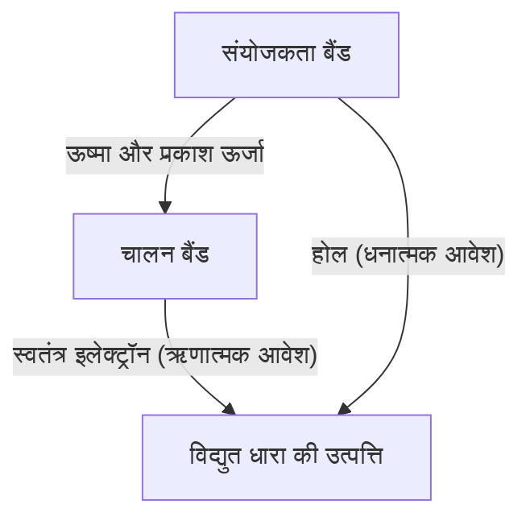
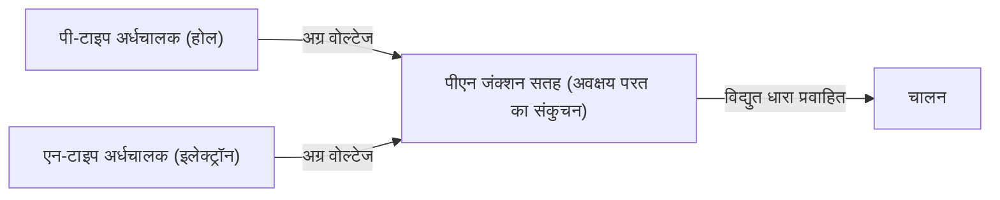
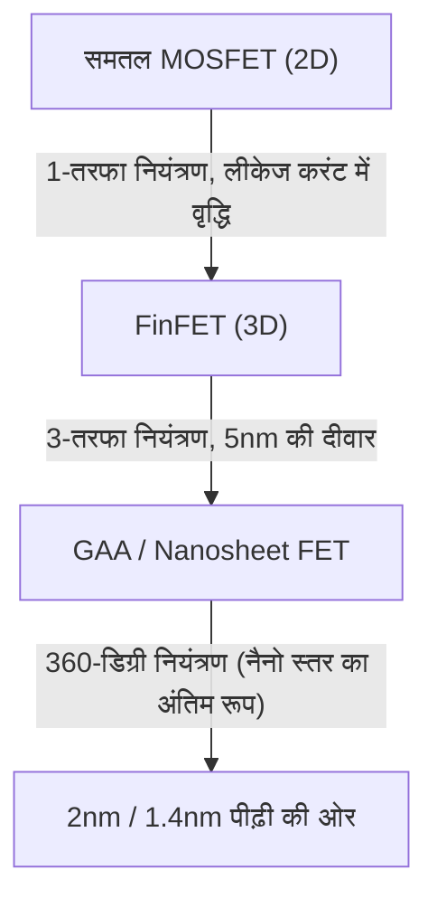

आज का आधुनिक डिजिटल समाज अर्धचालक नामक 'जादुई पत्थर' पर टिका है। स्मार्टफोन, पर्सनल कंप्यूटर, कार और एआई को चलाने वाले विशाल डेटा सेंटरों तक, सभी गणनाएं और नियंत्रण अर्धचालक उपकरणों द्वारा किए जाते हैं। हालांकि, ऐसे बहुत कम लोग हैं जो इसके मूल में मौजूद भौतिक तंत्र को गहराई से समझते हैं। इस लेख में, हम क्वांटम यांत्रिकी के दृष्टिकोण से अर्धचालकों की बुनियादी बातों को स्पष्ट करेंगे और पीएन जंक्शन डायोड, MOSFET, और नवीनतम FinFET और GAA (Gate-All-Around) तकनीकों तक, अर्धचालक और ट्रांजिस्टर की पूरी तस्वीर को अत्यधिक विस्तार से समझाएंगे।

## 1. पदार्थ के विद्युत गुण और बैंडगैप की क्वांटम यांत्रिकी

क्यों कुछ पदार्थ बिजली का संचालन आसानी से करते हैं (सुचालक), और कुछ पदार्थ बिजली का संचालन नहीं करते हैं (कुचालक)? और इन दोनों के बीच स्थित 'अर्धचालक' क्या है? इस प्रश्न का उत्तर देने के लिए, क्वांटम यांत्रिकी के 'बैंड सिद्धांत' को समझना आवश्यक है।

### 1.1 परमाणुओं और इलेक्ट्रॉनों का व्यवहार
परमाणु एक नाभिक और उसके चारों ओर घूमने वाले इलेक्ट्रॉनों से बने होते हैं। क्वांटम यांत्रिकी के अनुसार, इलेक्ट्रॉनों में निरंतर ऊर्जा नहीं हो सकती है, वे केवल विशिष्ट असतत ऊर्जा स्तर ही ले सकते हैं। जब कई परमाणु मिलकर एक क्रिस्टल बनाते हैं, तो प्रत्येक परमाणु के ऊर्जा स्तर ओवरलैप होते हैं, जिससे अनगिनत निकटवर्ती ऊर्जा स्तरों से बना एक 'ऊर्जा बैंड' बनता है।

### 1.2 बैंड सिद्धांत द्वारा वर्गीकरण
ऊर्जा बैंड को मुख्य रूप से 'संयोजकता बैंड (Valence Band)' जिसमें इलेक्ट्रॉन भरे होते हैं, और 'चालन बैंड (Conduction Band)' जिसमें इलेक्ट्रॉन मौजूद नहीं होते (या आंशिक रूप से मौजूद होते हैं) में विभाजित किया जाता है। और इन दोनों बैंडों के बीच एक 'बैंडगैप (वर्जित ऊर्जा अंतराल)' होता है, जो एक ऐसा क्षेत्र है जहाँ इलेक्ट्रॉन मौजूद नहीं रह सकते हैं।

- **सुचालक (जैसे धातु)**: संयोजकता बैंड और चालन बैंड एक-दूसरे पर ओवरलैप करते हैं, या चालन बैंड में पहले से ही कई इलेक्ट्रॉन मौजूद होते हैं। इसलिए, थोड़ा सा वोल्टेज (ऊर्जा) लगाने पर ही इलेक्ट्रॉन स्वतंत्र रूप से घूम सकते हैं और विद्युत धारा प्रवाहित होती है।
- **कुचालक (जैसे कांच, रबर)**: संयोजकता बैंड इलेक्ट्रॉनों से पूरी तरह भरा होता है, और चालन बैंड के साथ इसका बैंडगैप बहुत बड़ा (आमतौर पर कई eV से अधिक) होता है। इसलिए, सामान्य कमरे के तापमान की ऊष्मीय ऊर्जा से इलेक्ट्रॉन चालन बैंड में कूद नहीं सकते।
- **अर्धचालक (जैसे सिलिकॉन, जर्मेनियम)**: कुचालकों की तरह संयोजकता बैंड भरा होता है, लेकिन बैंडगैप अपेक्षाकृत छोटा (सिलिकॉन के मामले में लगभग 1.1 eV) होता है। इसलिए, जब ऊष्मा या प्रकाश ऊर्जा प्रदान की जाती है, तो कुछ इलेक्ट्रॉन बैंडगैप को पार करके चालन बैंड में उत्तेजित हो जाते हैं।

चालन बैंड में उत्तेजित इलेक्ट्रॉन (स्वतंत्र इलेक्ट्रॉन) और संयोजकता बैंड में छोड़े गए इलेक्ट्रॉनों के खाली स्थान (होल), दोनों आवेश ले जाने वाले 'वाहक' (कैरियर) के रूप में कार्य करते हैं, जिससे विद्युत धारा प्रवाहित हो सकती है। यही अर्धचालकों का मूल तंत्र है।

## 2. सिलिकॉन क्रिस्टल और सहसंयोजक बंध
पृथ्वी पर ऑक्सीजन के बाद दूसरा सबसे प्रचुर तत्व सिलिकॉन (Si), अर्धचालकों का मुख्य पात्र है। सिलिकॉन परमाणु के सबसे बाहरी कोश में 4 संयोजी इलेक्ट्रॉन होते हैं। शुद्ध सिलिकॉन क्रिस्टल (निज अर्धचालक) में, प्रत्येक सिलिकॉन परमाणु अपने आस-पास के 4 सिलिकॉन परमाणुओं के साथ एक-एक संयोजी इलेक्ट्रॉन साझा करता है, जिससे 'सहसंयोजक बंध' नामक एक बहुत ही स्थिर बंधन बनता है।

पूर्ण शून्य (-273.15℃) पर, सभी इलेक्ट्रॉन सहसंयोजक बंधों में फंसे होते हैं, इसलिए सिलिकॉन एक पूर्ण कुचालक बन जाता है। हालांकि, कमरे के तापमान पर, ऊष्मीय ऊर्जा के कारण कुछ सहसंयोजक बंध टूट जाते हैं, जिससे स्वतंत्र इलेक्ट्रॉन और होल के जोड़े (इलेक्ट्रॉन-होल युग्म) बनते हैं, और थोड़ी मात्रा में बिजली प्रवाहित होने लगती है। लेकिन शुद्ध सिलिकॉन में वाहकों की संख्या बहुत कम होती है, जिससे यह व्यावहारिक इलेक्ट्रॉनिक उपकरणों के लिए उपयोगी नहीं होता। यहीं 'डोपिंग' का जादू काम आता है।

## 3. डोपिंग: एन-टाइप और पी-टाइप अर्धचालकों का जन्म
शुद्ध सिलिकॉन (निज अर्धचालक) में बहुत कम मात्रा में (लाखों से करोड़ों में एक के अनुपात में) अशुद्धियों को जानबूझकर मिलाने की प्रक्रिया को 'डोपिंग' कहा जाता है। इस अशुद्धि (डोपेंट) के प्रकार को बदलकर, दो पूरी तरह से अलग गुणों वाले अर्धचालक बनाए जा सकते हैं।

### 3.1 एन-टाइप अर्धचालक (Negative type)
सिलिकॉन (4 संयोजी इलेक्ट्रॉन) में फॉस्फोरस (P) या आर्सेनिक (As) जैसे 5 संयोजी इलेक्ट्रॉन वाले तत्वों (दाता) को मिलाया जाता है। ऐसा करने पर, फॉस्फोरस परमाणु सिलिकॉन क्रिस्टल के नेटवर्क संरचना में प्रवेश करता है, लेकिन सहसंयोजक बंध के लिए केवल 4 इलेक्ट्रॉनों का उपयोग किया जाता है, जिससे फॉस्फोरस परमाणु का 5वां इलेक्ट्रॉन बच जाता है। यह बचा हुआ इलेक्ट्रॉन सहसंयोजक बंध के बंधन से आसानी से मुक्त हो जाता है और कमरे के तापमान की ऊष्मीय ऊर्जा के साथ क्रिस्टल के भीतर आसानी से घूमने वाला 'स्वतंत्र इलेक्ट्रॉन' बन जाता है।
इलेक्ट्रॉनों पर ऋणात्मक (Negative) आवेश होता है, इसलिए जिन अर्धचालकों में इलेक्ट्रॉन मुख्य वाहक होते हैं उन्हें 'एन-टाइप अर्धचालक' कहा जाता है।

### 3.2 पी-टाइप अर्धचालक (Positive type)
इसके विपरीत, जब सिलिकॉन में बोरॉन (B) या गैलियम (Ga) जैसे 3 संयोजी इलेक्ट्रॉन वाले तत्वों (ग्राही) को मिलाया जाता है, तो सहसंयोजक बंध बनाने के लिए एक इलेक्ट्रॉन की कमी हो जाती है, और वहाँ 'होल' नामक एक खाली कमरा बन जाता है। जब पास के बंध से एक इलेक्ट्रॉन इस खाली जगह में आता है, तो उसकी मूल जगह पर एक नया होल बन जाता है। इस तरह, होल क्रिस्टल के भीतर ऐसे चलते हैं मानो वे धनात्मक (Positive) आवेश वाले कण हों और विद्युत धारा का वहन करते हैं। यही 'पी-टाइप अर्धचालक' है।

## 4. पीएन जंक्शन और डायोड का तंत्र
पी-टाइप और एन-टाइप अर्धचालकों को भौतिक रूप से एक साथ जोड़ने से कुछ नहीं होता, लेकिन जब उन्हें परमाणु स्तर पर निरंतर जोड़ा जाता है (पीएन जंक्शन), तो एक बहुत ही दिलचस्प भौतिक घटना होती है। यही 'डायोड' का मूल सिद्धांत है।

### 4.1 अवक्षय परत का निर्माण
जैसे ही पीएन जंक्शन बनता है, एन-टाइप क्षेत्र के प्रचुर स्वतंत्र इलेक्ट्रॉन और पी-टाइप क्षेत्र के प्रचुर होल अपनी सांद्रता के अंतर के कारण विसरित होने लगते हैं। जब स्वतंत्र इलेक्ट्रॉन और होल जंक्शन सतह के पास मिलते हैं, तो वे एक-दूसरे से जुड़कर नष्ट (पुनर्संयोजन) हो जाते हैं।
परिणामस्वरूप, जंक्शन सतह के पास एक ऐसा क्षेत्र बनता है जहाँ कोई वाहक (न स्वतंत्र इलेक्ट्रॉन और न ही होल) मौजूद नहीं होता। इसे 'अवक्षय परत (Depletion Region)' कहा जाता है। जब अवक्षय परत बनती है, तो एन-टाइप की ओर धनात्मक आयन और पी-टाइप की ओर ऋणात्मक आयन रह जाते हैं, और इसके अंदर एक विद्युत क्षेत्र (आंतरिक विभव) उत्पन्न होता है। यह विद्युत क्षेत्र एक बाधा (विभव प्राचीर) के रूप में कार्य करता है जो इलेक्ट्रॉनों और होलों के आगे के प्रसार को रोकता है।

### 4.2 दिष्टकारी क्रिया (धारा का एकतरफा प्रवाह)
जब पीएन जंक्शन पर बाहर से वोल्टेज लगाया जाता है, तो इसका व्यवहार वोल्टेज की दिशा के आधार पर पूरी तरह से अलग होता है।

- **अग्र अभिनत (Forward Bias)**: पी-टाइप की ओर धनात्मक और एन-टाइप की ओर ऋणात्मक वोल्टेज लगाया जाता है। तब बाहरी वोल्टेज आंतरिक विभव प्राचीर को समाप्त कर देता है, पी-टाइप के होल एन-टाइप की ओर और एन-टाइप के इलेक्ट्रॉन पी-टाइप की ओर धकेले जाते हैं, जिससे अवक्षय परत सिकुड़ कर गायब हो जाती है। परिणामस्वरूप, बड़ी मात्रा में धारा तेजी से प्रवाहित होती है।
- **उत्क्रम अभिनत (Reverse Bias)**: पी-टाइप की ओर ऋणात्मक और एन-टाइप की ओर धनात्मक वोल्टेज लगाया जाता है। तब इलेक्ट्रॉन और होल दोनों जंक्शन सतह से दूर खिंच जाते हैं, जिससे अवक्षय परत और अधिक चौड़ी हो जाती है। विभव प्राचीर के उच्च होने के कारण धारा लगभग प्रवाहित नहीं होती है।

इस प्रकार, केवल एक दिशा में धारा को प्रवाहित होने देने के इस गुण को 'दिष्टकारी क्रिया' कहा जाता है, जो एसी (प्रत्यावर्ती धारा) को डीसी (दिष्ट धारा) में बदलने वाले पावर सर्किट में एक अनिवार्य भूमिका निभाता है।

## 5. ट्रांजिस्टर का जन्म और MOSFET
डायोड एक क्रांतिकारी उपकरण था, लेकिन यह केवल एक एकतरफा वाल्व था। मानवता को वास्तव में एक ऐसे जादुई उपकरण की तलाश थी जो स्वतंत्र रूप से विद्युत संकेतों को 'प्रवर्धित (Amplification)' और 'स्विच' कर सके, यानी 'ट्रांजिस्टर'।

### 5.1 द्विध्रुवी ट्रांजिस्टर से क्षेत्र-प्रभाव ट्रांजिस्टर तक
प्रारंभिक ट्रांजिस्टर पीएनपी या एनपीएन संरचना वाले द्विध्रुवी (Bipolar) ट्रांजिस्टर थे, लेकिन उनके निर्माण में कठिनाई और उच्च बिजली की खपत जैसी समस्याएं थीं। वर्तमान में, दुनिया भर के 99% से अधिक डिजिटल सर्किट 'MOSFET (Metal-Oxide-Semiconductor Field-Effect Transistor: धातु-ऑक्साइड-अर्धचालक क्षेत्र-प्रभाव ट्रांजिस्टर)' नामक प्रकार के ट्रांजिस्टर से बने हैं।

### 5.2 MOSFET की संरचना और कार्य सिद्धांत
MOSFET (यहाँ एन-चैनल एन्हांसमेंट मोड का उदाहरण लिया गया है) में निम्नलिखित 4 टर्मिनल होते हैं (आमतौर पर, सबस्ट्रेट को स्रोत से जोड़ा जाता है इसलिए इसे व्यावहारिक रूप से 3 टर्मिनल माना जाता है)।
1. **स्रोत (Source)**: वाहकों (इलेक्ट्रॉनों) की आपूर्ति का स्रोत (एन-टाइप)।
2. **ड्रेन (Drain)**: वाहकों के निकास का गंतव्य (एन-टाइप)।
3. **गेट (Gate)**: धारा के प्रवाह को नियंत्रित करने वाला 'नल' का हैंडल।
4. **सबस्ट्रेट (Substrate / Body)**: पूरा सब्सट्रेट या आधार (पी-टाइप)।

पी-टाइप सिलिकॉन सबस्ट्रेट के अंदर दो एन-टाइप क्षेत्र (स्रोत और ड्रेन) बनाए जाते हैं। इस स्थिति में, स्रोत और ड्रेन के बीच पी-टाइप क्षेत्र खड़ा होता है (बैक-टू-बैक पीएन जंक्शन), और ड्रेन पर धनात्मक वोल्टेज लगाने पर भी धारा प्रवाहित नहीं होती है।
स्रोत और ड्रेन के बीच के पी-टाइप क्षेत्र के ऊपर एक बहुत पतली इन्सुलेटर फिल्म (सिलिकॉन ऑक्साइड: Oxide) बनाई जाती है, और इसके ऊपर एक धातु या पॉलीसिलिकॉन इलेक्ट्रोड (गेट: Metal) रखा जाता है।

**स्विच ऑन का तंत्र: चैनल का निर्माण**
जब गेट इलेक्ट्रोड पर धनात्मक वोल्टेज लगाया जाता है, तो इन्सुलेटिंग फिल्म के ठीक नीचे पी-टाइप सिलिकॉन क्षेत्र में बदलाव होता है। धनात्मक वोल्टेज के कारण, पी-टाइप क्षेत्र के बहुसंख्यक वाहक (होल) प्रतिकर्षित होकर सबस्ट्रेट के अंदर धकेल दिए जाते हैं (अवक्षय), और साथ ही पी-टाइप क्षेत्र में मौजूद अल्पसंख्यक वाहक (इलेक्ट्रॉन) सतह की ओर आकर्षित होते हैं।
जब गेट वोल्टेज एक निश्चित मान (थ्रेशोल्ड वोल्टेज: Threshold Voltage) से अधिक हो जाता है, तो इन्सुलेटिंग फिल्म के ठीक नीचे की सतह पर इलेक्ट्रॉन जमा हो जाते हैं, और जो क्षेत्र पी-टाइप था वह स्थानीय रूप से एन-टाइप में बदल जाता है। इसे 'इंवर्जन लेयर (Inversion Layer)' या 'चैनल (Channel)' कहा जाता है।
चैनल बनने के बाद, एन-टाइप स्रोत और एन-टाइप ड्रेन एन-टाइप चैनल से जुड़ जाते हैं, और धारा सफलतापूर्वक प्रवाहित होने लगती है!

**स्विच ऑफ का तंत्र**
जब गेट वोल्टेज को शून्य पर वापस लाया जाता है, तो आकर्षित इलेक्ट्रॉन बिखर जाते हैं और चैनल गायब हो जाता है। पी-टाइप की दीवार फिर से खड़ी हो जाती है और धारा का प्रवाह अवरुद्ध हो जाता है।
इस प्रकार, गेट पर केवल थोड़ा सा वोल्टेज लगाकर स्रोत और ड्रेन के बीच की विशाल धारा को चालू/बंद किया जा सकता है, यही MOSFET की सबसे बड़ी विशेषता है। इसके अलावा, चूंकि गेट इन्सुलेटिंग फिल्म द्वारा अलग किया जाता है, इसलिए गेट में लगभग कोई धारा प्रवाहित नहीं होती है, जिसे इसे अत्यंत कम बिजली की खपत के साथ चलाया जा सकता है (यही CMOS तकनीक का मूल है)।

## 6. मूर का नियम और लघुकरण की सीमाएँ
1965 में, इंटेल के सह-संस्थापक गॉर्डन मूर ने एक अनुभवजन्य नियम प्रस्तावित किया कि 'सेमीकंडक्टर इंटीग्रेटेड सर्किट पर ट्रांजिस्टरों की संख्या हर दो साल में दोगुनी हो जाएगी'। इसे प्रसिद्ध 'मूर का नियम (Moore's Law)' कहा जाता है। ट्रांजिस्टर जितना छोटा (लघुकरण) होता गया, एक चिप पर उतने ही अधिक सर्किट पैक किए जा सके, और इलेक्ट्रॉनों की यात्रा दूरी कम होने से संचालन की गति भी बढ़ गई। इसके अलावा, वोल्टेज कम किए जाने से बिजली की खपत भी कम हुई, जिसे 'डेनार्ड स्केलिंग (Dennard Scaling)' का जादुई चक्र कहा गया, जो कई दशकों तक चलता रहा।

हालांकि, 2000 के दशक में इस जादू में गिरावट आने लगी। जब ट्रांजिस्टर नैनोमीटर पैमाने तक सिकुड़ गए, तो भौतिक सीमाएं (क्वांटम यांत्रिकी प्रभाव) स्पष्ट होने लगीं।

### 6.1 शॉर्ट चैनल प्रभाव और लीकेज करंट
जब स्रोत और ड्रेन के बीच की दूरी (चैनल की लंबाई) बहुत कम हो जाती है, तो गेट वोल्टेज के बंद (OFF) होने पर भी, ड्रेन वोल्टेज स्रोत की ओर विभव प्राचीर को कम कर देता है, जिससे अनजाने में धारा लीक होने लगती है। इसे 'शॉर्ट चैनल प्रभाव (Short Channel Effect)' कहा जाता है।
इसके अलावा, गेट इन्सुलेटिंग फिल्म भी कुछ परमाणु परतों जितनी पतली हो जाती है, और 'गेट लीकेज करंट' भी एक गंभीर समस्या बन गई है, जिसमें इलेक्ट्रॉन क्वांटम टनलिंग प्रभाव के माध्यम से इन्सुलेटिंग फिल्म को पार कर जाते हैं। चूंकि स्विच बंद होने पर भी बिजली लीक होती रहती है, इसलिए स्मार्टफोन गर्म हो जाते हैं और बैटरी जल्दी खत्म हो जाती है।

## 7. त्रि-आयामी संरचनाओं का विकास: FinFET से GAA तक
लघुकरण की सीमाओं को पार करने के लिए, अर्धचालक इंजीनियरों ने ट्रांजिस्टर की संरचना पर मौलिक रूप से पुनर्विचार किया। यह 2D (सपाट) से 3D (त्रि-आयामी) संरचना की ओर एक प्रतिमान बदलाव था।

### 7.1 FinFET का आगमन
2011 के आसपास, इंटेल और अन्य कंपनियों ने 'FinFET (Fin Field-Effect Transistor)' का व्यावसायीकरण किया। पारंपरिक MOSFET समतल सब्सट्रेट पर चैनल बनाते थे, जबकि FinFET में सिलिकॉन सब्सट्रेट मछली के पंख (Fin) की तरह लंबवत खड़ा होता है, और गेट इलेक्ट्रोड इसके ऊपर स्थित होता है।
समतल प्रकार में, गेट केवल चैनल के 'ऊपर' की ओर से नियंत्रण कर सकता था, लेकिन FinFET में, यह चैनल को तीन तरफ से (ऊपर, बाएँ, और दाएँ) लपेटते हुए नियंत्रित करता है। इससे गेट के विद्युत क्षेत्र का नियंत्रण (स्थिर विद्युत नियंत्रण) नाटकीय रूप से बढ़ जाता है, जो शॉर्ट चैनल प्रभाव को दृढ़ता से दबाने और लीकेज करंट को काफी कम करने में सफल रहा। FinFET के आगमन के साथ, मूर का नियम पुनर्जीवित हुआ, और यह 22nm से 5nm पीढ़ी तक प्रमुख तकनीक बन गया।

### 7.2 अंतिम संरचना: GAA (Gate-All-Around)
हालांकि, 3nm और 2nm जैसे आगे के लघुकरण के साथ, FinFET के तीन-तरफा नियंत्रण की भी सीमाएँ दिखने लगीं। यही कारण है कि 'GAA (Gate-All-Around)' नामक अगली पीढ़ी की ट्रांजिस्टर संरचना अस्तित्व में आई।
GAA में, चैनल के रूप में कार्य करने वाले सिलिकॉन को पतले तारों (नैनोवायर) या शीट (नैनोशीट: जिसे सैमसंग द्वारा MBCFET और इंटेल द्वारा RibbonFET कहा जाता है) का आकार दिया जाता है और पूरी तरह से हवा में निलंबित कर दिया जाता है, और इसके चारों ओर 360 डिग्री से गेट इलेक्ट्रोड द्वारा कवर किया जाता है (सचमुच Gate-All-Around)।
इसके परिणामस्वरूप, गेट की चैनल नियंत्रण क्षमता भौतिक सीमा तक पहुँच जाती है, जिससे लीकेज करंट लगभग पूरी तरह से रुक जाता है। इसके अलावा, नैनोशीट की चौड़ाई को लचीले ढंग से बदलकर, एक ही चिप पर प्रदर्शन-उन्मुख सर्किट और बिजली-बचत सर्किट दोनों को अनुकूलित करना आसान हो जाता है।

## 8. भविष्य की ओर
अर्धचालकों का विकास भौतिकी, रसायन विज्ञान, भौतिक विज्ञान, और खगोलीय पैमाने पर पूंजी निवेश तथा मानव ज्ञान का परिणति है। क्वांटम यांत्रिकी का जादू, जो एक भी इलेक्ट्रॉन के व्यवहार को सटीक रूप से नियंत्रित करता है, हमारे हाथों में हर सेकंड अरबों बार ON/OFF दोहरा रहा है, और एक विशाल डिजिटल ब्रह्मांड का निर्माण कर रहा है।
GAA के बाद, CFET (Complementary FET) पर शोध आगे बढ़ रहा है जो ट्रांजिस्टर को लंबवत रूप से स्टैक करता है, साथ ही सिलिकॉन को बदलने के लिए नई सामग्री (जैसे कार्बन नैनोट्यूब और 2D ट्रांजिशन मेटल डाइकैल्कोजेनाइड्स) का विकास भी हो रहा है। अर्धचालकों द्वारा बुना गया यह 'जादू' मानव सीमाओं को और आगे बढ़ाएगा और भविष्य के नए दरवाजे खोलेगा।
