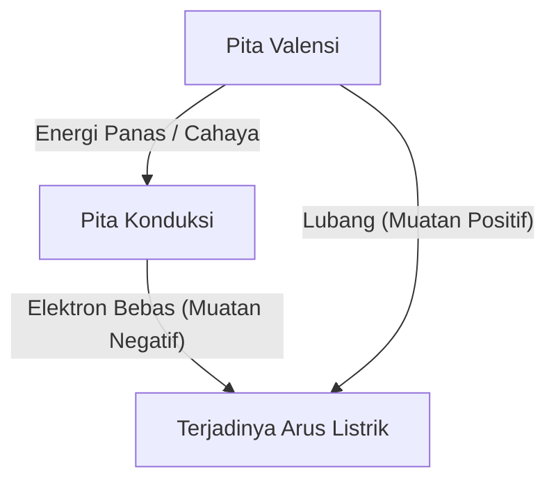
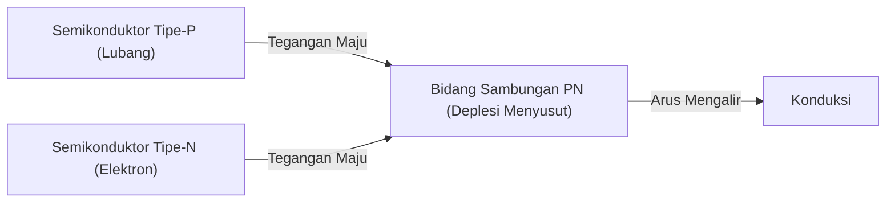
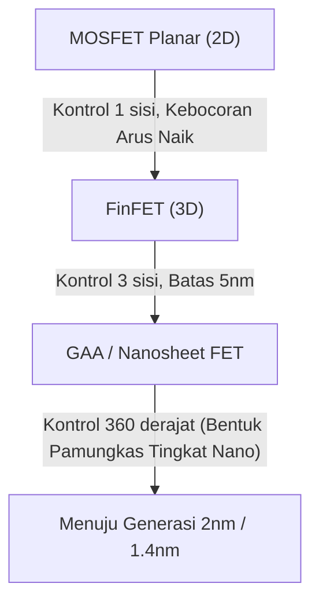

Masyarakat digital modern dibangun di atas "batu ajaib" yang disebut semikonduktor. Dari ponsel pintar, komputer, mobil, hingga pusat data raksasa yang menggerakkan AI, semua komputasi dan kontrol dilakukan oleh perangkat semikonduktor. Namun, tidak banyak orang yang benar-benar memahami mekanisme fisik yang mendasarinya. Dalam artikel ini, kita akan mengungkap dasar-dasar semikonduktor dari perspektif mekanika kuantum, dan menjelaskan secara sangat rinci keseluruhan gambaran semikonduktor dan transistor, mulai dari dioda sambungan PN, MOSFET, hingga teknologi FinFET dan GAA (Gate-All-Around) terbaru.

## 1. Sifat Listrik Materi dan Mekanika Kuantum Celah Pita

Mengapa beberapa materi mudah menghantarkan listrik (konduktor) dan beberapa tidak (isolator)? Dan apa itu "semikonduktor" yang terletak di antara keduanya? Untuk menjawab pertanyaan ini, kita perlu memahami "teori pita" dalam mekanika kuantum.

### 1.1 Perilaku Atom dan Elektron
Atom terdiri dari inti atom dan elektron yang mengorbit di sekitarnya. Menurut mekanika kuantum, elektron tidak dapat memiliki energi yang berkelanjutan, melainkan hanya dapat menempati tingkat energi diskrit tertentu. Ketika beberapa atom bergabung membentuk kristal, tingkat energi masing-masing atom tumpang tindih, membentuk "pita energi" yang terdiri dari tingkat energi yang berdekatan dalam jumlah yang tak terhingga.

### 1.2 Klasifikasi Menurut Teori Pita
Pita energi terutama dibagi menjadi "Pita Valensi (Valence Band)" yang terisi oleh elektron, dan "Pita Konduksi (Conduction Band)" yang tidak memiliki elektron (atau sebagian terisi). Di antara kedua pita ini, terdapat area di mana elektron tidak dapat berada, yang disebut "Celah Pita (Band Gap / Forbidden Band)".

- **Konduktor (seperti logam)**: Pita valensi dan pita konduksi tumpang tindih, atau sudah terdapat banyak elektron di dalam pita konduksi. Oleh karena itu, hanya dengan memberikan sedikit tegangan (energi), elektron dapat bergerak bebas, dan arus mengalir.
- **Isolator (seperti kaca, karet)**: Pita valensi sepenuhnya terisi dengan elektron, dan celah pita di antara pita konduksi sangat besar (biasanya lebih dari beberapa eV), sehingga energi panas pada suhu kamar tidak cukup bagi elektron untuk melompati pita konduksi.
- **Semikonduktor (seperti silikon, germanium)**: Sama seperti isolator, pita valensinya terisi, tetapi celah pitanya relatif kecil (untuk silikon, sekitar 1,1 eV). Jadi, jika diberikan energi panas atau cahaya, sebagian elektron akan melompati celah pita dan tereksitasi ke dalam pita konduksi.

Elektron yang tereksitasi ke dalam pita konduksi (elektron bebas) dan "lubang" (hole) yang ditinggalkan oleh elektron di pita valensi, keduanya bertindak sebagai "pembawa (carrier)" yang membawa muatan, sehingga memungkinkan arus untuk mengalir. Ini adalah mekanisme dasar dari semikonduktor.

## 2. Kristal Silikon dan Ikatan Kovalen
Elemen paling melimpah kedua di bumi setelah oksigen, yaitu silikon (Si), adalah tokoh utama dari semikonduktor. Atom silikon memiliki empat elektron valensi di kulit terluarnya. Dalam kristal silikon murni (semikonduktor intrinsik), setiap atom silikon membagikan masing-masing satu elektron valensi dengan empat atom silikon yang berdekatan, membentuk ikatan yang sangat stabil yang disebut "ikatan kovalen".

Pada nol mutlak (-273,15 °C), semua elektron terperangkap dalam ikatan kovalen, menjadikan silikon sebagai isolator sempurna. Namun, pada suhu kamar, sebagian ikatan kovalen terputus karena energi panas, sehingga terbentuk pasangan elektron bebas dan lubang (pasangan elektron-lubang), dan sedikit listrik dapat mengalir. Meskipun demikian, pada silikon murni jumlah pembawanya terlalu sedikit, sehingga tidak bisa digunakan sebagai komponen elektronik praktis. Di sinilah sihir bernama "doping" digunakan.

## 3. Doping: Lahirnya Semikonduktor Tipe-N dan Tipe-P
Praktik mencampurkan sejumlah kecil (dengan rasio satu dari beberapa juta hingga satu dari ratusan juta) kotoran (impurity) secara sengaja ke dalam silikon murni (semikonduktor intrinsik) disebut "doping". Dengan mengubah jenis kotoran (dopant) ini, kita bisa menciptakan semikonduktor dengan dua sifat yang sama sekali berbeda.

### 3.1 Semikonduktor Tipe-N (Negative type)
Silikon (4 elektron valensi) dicampur dengan elemen yang memiliki 5 elektron valensi (donor) seperti fosfor (P) atau arsenik (As). Akibatnya, atom fosfor masuk ke dalam struktur jaringan kristal silikon, tetapi karena hanya empat elektron yang digunakan untuk ikatan kovalen, elektron kelima dari atom fosfor menjadi tersisa. Elektron yang tersisa ini mudah lepas dari ikatan kovalen dan dengan mudah dapat bergerak bebas di dalam kristal sebagai "elektron bebas" pada energi panas seukuran suhu ruang.
Karena elektron bermuatan negatif, semikonduktor dengan elektron sebagai pembawa utama ini disebut "Semikonduktor Tipe-N".

### 3.2 Semikonduktor Tipe-P (Positive type)
Sebaliknya, silikon dicampur dengan elemen yang hanya memiliki 3 elektron valensi (akseptor) seperti boron (B) atau galium (Ga). Hal ini menyebabkan kekurangan satu elektron untuk membentuk ikatan kovalen, sehingga tercipta "ruangan kosong" yang disebut "lubang (hole)". Ketika elektron dari ikatan yang berdekatan pindah ke ruangan kosong ini, lokasi asalnya menjadi lubang yang baru. Dengan cara ini, lubang tersebut seolah-olah bergerak melewati kristal seperti partikel yang bermuatan positif, mengantarkan arus listrik. Inilah "Semikonduktor Tipe-P".

## 4. Sambungan PN dan Mekanisme Dioda
Jika Anda hanya menyatukan secara fisik semikonduktor tipe-P dan tipe-N, tidak ada yang terjadi. Namun, jika Anda menyambungkannya secara berkesinambungan pada tingkat atom (sambungan PN), fenomena fisik yang sangat menarik akan muncul. Ini adalah prinsip dasar dari "dioda".

### 4.1 Pembentukan Daerah Deplesi
Saat sambungan PN terbentuk, elektron bebas yang melimpah di daerah tipe-N dan lubang yang berlimpah di daerah tipe-P mulai berdifusi karena perbedaan konsentrasi di antara keduanya. Ketika elektron bebas dan lubang bertemu di dekat bidang persimpangan, mereka saling berikatan dan menghilang (rekombinasi).
Akibatnya, daerah di mana pembawa (baik elektron bebas maupun lubang) tidak ada terbentuk di dekat bidang persimpangan. Ini disebut "Daerah Deplesi (Depletion Region)". Ketika daerah deplesi terbentuk, ion positif tertinggal di sisi tipe-N dan ion negatif tertinggal di sisi tipe-P, sehingga menciptakan medan listrik (potensial internal) di dalamnya. Medan listrik ini bertindak sebagai penghalang (potensial barrier) yang mencegah difusi lebih lanjut dari elektron dan lubang.

### 4.2 Efek Penyearah (Arus Searah)
Jika Anda menerapkan tegangan pada sambungan PN dari luar, perilakunya akan sangat berbeda bergantung pada arah tegangan yang diterapkan.

- **Bias Maju (Forward Bias)**: Tegangan positif diterapkan pada sisi tipe-P dan tegangan negatif pada sisi tipe-N. Hal ini menyebabkan tegangan eksternal membatalkan penghalang potensial internal, dan lubang dari tipe-P didorong menuju tipe-N, sementara elektron dari tipe-N didorong menuju tipe-P, sehingga daerah deplesi menyusut dan hilang. Akibatnya, arus dalam jumlah besar mengalir dengan deras.
- **Bias Mundur (Reverse Bias)**: Tegangan negatif diterapkan pada sisi tipe-P dan tegangan positif pada sisi tipe-N. Hal ini menyebabkan elektron dan lubang ditarik menjauh dari bidang persimpangan, sehingga daerah deplesi semakin melebar. Penghalang potensial menjadi lebih tinggi, sehingga nyaris tidak ada arus yang mengalir.

Sifat mengalirkan arus hanya pada satu arah ini disebut "efek penyearah", yang memainkan peran penting dalam sirkuit daya untuk mengubah arus bolak-balik (AC) menjadi arus searah (DC).

## 5. Kelahiran Transistor dan MOSFET
Dioda merupakan komponen yang revolusioner, tetapi hanya sekadar katup satu arah. Apa yang sesungguhnya dicari umat manusia adalah perangkat magis yang dapat secara bebas melakukan "amplifikasi" dan "switching" sinyal listrik, yaitu "transistor".

### 5.1 Dari Transistor Bipolar ke Transistor Efek Medan
Transistor tahap awal adalah transistor bipolar dengan struktur PNP atau NPN, tetapi perangkat ini sulit diproduksi dan mengkonsumsi banyak daya. Saat ini, lebih dari 99% sirkuit digital di seluruh dunia terdiri dari jenis transistor yang disebut "MOSFET (Metal-Oxide-Semiconductor Field-Effect Transistor / Transistor Efek Medan Semikonduktor-Oksida-Logam)".

### 5.2 Struktur dan Prinsip Kerja MOSFET
MOSFET (mengambil contoh mode peningkatan saluran tipe-N) terdiri dari 4 terminal berikut (biasanya substrat dihubungkan dengan sumber sehingga praktis diperlakukan sebagai 3 terminal):
1. **Source (Sumber)**: Sumber pasokan pembawa (elektron) (tipe-N).
2. **Drain (Saluran Pembuangan)**: Tempat keluarnya pembawa (tipe-N).
3. **Gate (Gerbang)**: Tuas "keran" yang mengendalikan aliran arus.
4. **Substrate / Body (Substrat)**: Seluruh papan (tipe-P).

Dua daerah tipe-N (sumber dan pembuangan) dibuat di dalam substrat silikon tipe-P. Seperti keadaan awalnya, daerah tipe-P berada di antara sumber dan pembuangan (sambungan PN yang saling membelakangi), sehingga meskipun Anda menerapkan tegangan positif pada pembuangan, arus tidak akan mengalir.
Sebuah film isolator yang sangat tipis (silikon oksida: Oksida) dibentuk di atas wilayah tipe-P antara sumber dan pembuangan, dan elektroda logam atau polisilikon (gerbang: Logam) ditempatkan di atasnya.

**Mekanisme Switch ON: Pembentukan Saluran (Channel)**
Saat tegangan positif diterapkan ke elektroda gerbang, perubahan terjadi di daerah silikon tipe-P yang terletak tepat di bawah lapisan film insulasi. Karena tegangan positif, lubang (pembawa mayoritas) di wilayah tipe-P ditolak dan didorong ke kedalaman substrat (deplesi), sementara elektron (pembawa minoritas) yang jumlahnya sedikit di wilayah tipe-P tertarik ke permukaan.
Ketika tegangan gerbang melebihi nilai tertentu (Tegangan Ambang / Threshold Voltage), elektron berkumpul di permukaan tepat di bawah film insulasi, dan wilayah tipe-P secara lokal berbalik menjadi tipe-N. Hal ini disebut "Lapisan Inversi (Inversion Layer)" atau "Saluran (Channel)".
Begitu saluran terbentuk, sumber tipe-N dan pembuangan tipe-N terhubung dengan saluran tipe-N, memungkinkan arus mengalir dengan lancar!

**Mekanisme Switch OFF**
Saat tegangan gerbang dikembalikan ke nol, elektron yang tertarik tadi terpencar dan saluran menghilang. Dinding tipe-P sekali lagi menghalangi jalannya, sehingga arus listrik terputus.
Dengan demikian, fitur terbesar dari MOSFET adalah kemampuannya untuk MENGAKTIFKAN/MEMATIKAN aliran arus listrik yang besar antara sumber dan pembuangan hanya dengan sedikit tegangan yang diterapkan ke gerbang. Lebih lanjut, karena gerbang dipisahkan oleh film insulasi, hampir tidak ada arus listrik yang mengalir melaluinya, memungkinkannya untuk digerakkan dengan konsumsi daya yang sangat rendah (hal ini merupakan inti dari teknologi CMOS).

## 6. Hukum Moore dan Batas Miniaturisasi
Pada tahun 1965, Gordon Moore, salah satu pendiri Intel, mengajukan hukum empiris bahwa "jumlah transistor pada sirkuit terpadu semikonduktor berlipat ganda kira-kira setiap dua tahun". Ini adalah "Hukum Moore" yang terkenal. Semakin kecil transistornya (miniaturisasi), tidak hanya kita dapat memasukkan lebih banyak sirkuit ke dalam satu chip, tetapi jarak perjalanan elektron juga menjadi lebih pendek, sehingga kecepatan operasi meningkat, dan tegangan yang digunakan dapat dikurangi sehingga menurunkan konsumsi daya. Siklus positif yang mirip sihir ini dikenal sebagai "Penskalaan Dennard (Dennard Scaling)" dan telah berlangsung selama beberapa dekade.

Namun, memasuki tahun 2000-an, sihir ini mulai meredup. Saat transistor mengecil ke skala nanometer, batas fisik (efek mekanika kuantum) menjadi sangat jelas.

### 6.1 Efek Saluran Pendek dan Arus Bocor
Jika jarak antara sumber dan pembuangan (panjang saluran) menjadi sangat pendek, meskipun tegangan gerbang dalam status OFF, tegangan dari pembuangan dapat menurunkan penghalang potensial pada sisi sumber, sehingga menyebabkan arus listrik bocor secara tak terduga. Fenomena ini disebut "Efek Saluran Pendek (Short Channel Effect)".
Selain itu, seiring dengan menipisnya film insulasi gerbang hingga ke tingkat lapisan beberapa atom, muncul masalah serius tentang "arus bocor gerbang" di mana elektron menyelinap menembus film insulasi melalui efek terowongan kuantum. Karena listrik terus bocor meskipun sakelar telah dimatikan, hal ini menyebabkan ponsel pintar menjadi panas dan baterainya cepat habis.

## 7. Evolusi Menuju Struktur 3D: Dari FinFET ke GAA
Untuk menembus batas miniaturisasi, para teknisi semikonduktor meninjau kembali struktur transistor dari dasarnya. Ini merupakan pergeseran paradigma dari bentuk planar (2D) ke tiga dimensi (3D).

### 7.1 Munculnya FinFET
Sekitar tahun 2011, Intel dan perusahaan lainnya berhasil menggunakan "FinFET (Fin Field-Effect Transistor)" secara praktis. Berbeda dengan MOSFET konvensional yang membuat saluran pada substrat datar, FinFET menegakkan substrat silikon secara vertikal layaknya sirip ikan (Fin) dan menempatkan elektroda gerbang melintasi sirip tersebut.
Dalam bentuk planar, gerbang hanya dapat mengontrol saluran dari 1 sisi "atas", tetapi pada FinFET saluran dikontrol dari 3 arah "atas, kiri, dan kanan" sehingga seolah membungkusnya. Hasilnya, dominasi medan listrik oleh gerbang (dominasi elektrostatik) meningkat secara drastis, sehingga mampu menekan efek saluran pendek dengan kuat dan berhasil menekan kebocoran arus secara signifikan. Dengan munculnya FinFET, Hukum Moore kembali bernapas dan menjadi pendorong utama dari generasi 22nm hingga 5nm.

### 7.2 Struktur Pamungkas: GAA (Gate-All-Around)
Namun, ketika ukuran terus mengecil menuju 3nm dan 2nm, kontrol tiga sisi dari FinFET juga mulai menemui jalan buntu. Maka dari itu, hadirlah "GAA (Gate-All-Around)" yang merupakan struktur transistor generasi berikutnya.
Dalam GAA, silikon yang berfungsi sebagai saluran dibentuk seperti kawat tipis (kawat nano) atau lembaran (lembaran nano: Samsung menyebutnya MBCFET, sedangkan Intel menamakannya RibbonFET) dan ditangguhkan sepenuhnya di udara, sedangkan elektroda gerbang akan membungkus seluruh arah 360 derajat di sekitarnya (seperti arti harfiahnya, Gate-All-Around).
Dengan demikian, kemampuan kontrol saluran oleh gerbang telah mencapai batas fisiknya, memungkinkan aliran arus bocor diputus hampir sepenuhnya. Selanjutnya, dengan secara fleksibel mengubah lebar lembaran nano, akan lebih mudah untuk merancang serta mengoptimalkan sirkuit yang mengutamakan performa dan yang mengutamakan efisiensi energi pada sebuah chip. Hal ini merupakan keunggulan besar yang dimilikinya.

## 8. Menuju ke Masa Depan
Evolusi dari semikonduktor merupakan perpaduan dari fisika, kimia, ilmu material, investasi yang sangat besar, serta kristalisasi dari kebijaksanaan umat manusia. Sihir dari mekanika kuantum yang dengan cermat mengontrol kelakuan satu elektron ini berdenyut ON/OFF pada kecepatan yang luar biasa, mencapai miliaran kali dalam sedetik di telapak tangan kita, dan menciptakan jagat digital raksasa.
Setelah GAA, penelitian terus dilanjutkan pada teknologi seperti CFET (Complementary FET) yang menumpuk transistor secara vertikal, dan material-material baru untuk menggantikan silikon (seperti carbon nanotube atau dikalkogenida logam transisi dua dimensi). "Sihir" yang diuntai oleh semikonduktor tentu akan terus mendobrak keterbatasan manusia dan membuka masa depan yang baru.
