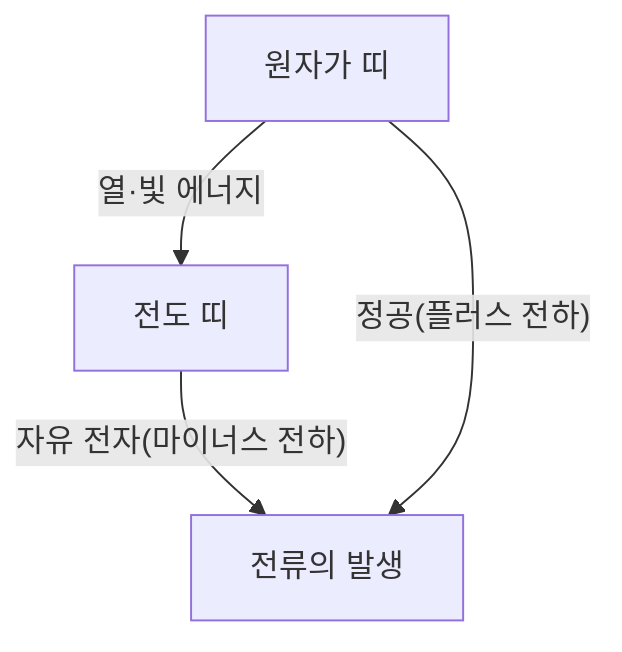
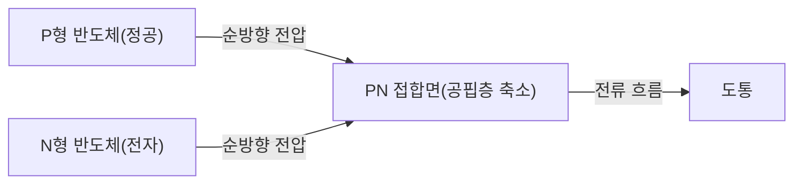
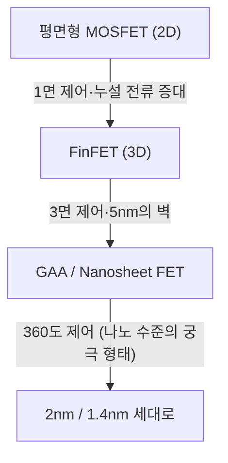

현대의 디지털 사회는 반도체라는 '마법의 돌' 위에 세워져 있습니다. 스마트폰, PC, 자동차, 그리고 AI를 구동하는 거대한 데이터 센터에 이르기까지 모든 계산과 제어는 반도체 디바이스를 통해 이루어집니다. 하지만 그 바탕에 있는 물리적 메커니즘을 깊이 이해하고 있는 사람은 결코 많지 않습니다. 본 기사에서는 양자역학적 관점에서 반도체의 기초를 파헤치고, PN 접합 다이오드, MOSFET, 그리고 최신 FinFET과 GAA(Gate-All-Around) 기술에 이르기까지 반도체와 트랜지스터의 전모를 압도적인 디테일로 해설합니다.

## 1. 물질의 전기적 성질과 밴드 갭의 양자역학

왜 어떤 물질은 전기가 잘 통하고(도체), 어떤 물질은 전기가 통하지 않을까요(절연체)? 그리고 그 중간에 위치한 '반도체'란 무엇일까요? 이 질문에 답하기 위해서는 양자역학의 '밴드 이론'을 이해해야 합니다.

### 1.1 원자와 전자의 행동
원자는 원자핵과 그 주위를 도는 전자로 구성되어 있습니다. 양자역학에 따르면, 전자는 연속적인 에너지를 가질 수 없으며 특정한 이산적인 에너지 준위만을 취할 수 있습니다. 여러 원자가 결합하여 결정을 형성하면, 각 원자의 에너지 준위가 겹쳐져 무수히 많은 인접한 에너지 준위로 이루어진 '에너지 밴드'가 형성됩니다.

### 1.2 밴드 이론에 의한 분류
에너지 밴드는 주로 전자가 채워져 있는 '원자가 띠(Valence Band)'와 전자가 존재하지 않는(또는 부분적으로 존재하는) '전도 띠(Conduction Band)'로 나뉩니다. 그리고 이 두 밴드 사이에는 전자가 존재할 수 없는 영역인 '밴드 갭(금지대)'이 존재합니다.

- **도체(금속 등)**: 원자가 띠와 전도 띠가 겹쳐져 있거나, 전도 띠에 이미 많은 전자가 존재합니다. 따라서 약간의 전압(에너지)만 가해도 전자는 자유롭게 이동할 수 있어 전류가 흐릅니다.
- **절연체(유리, 고무 등)**: 원자가 띠는 전자로 완전히 채워져 있으며, 전도 띠와의 밴드 갭이 매우 크기 때문에(일반적으로 수 eV 이상) 상온 정도의 열에너지로는 전자가 전도 띠로 넘어갈 수 없습니다.
- **반도체(실리콘, 게르마늄 등)**: 절연체와 마찬가지로 원자가 띠는 채워져 있지만, 밴드 갭이 비교적 작기 때문에(실리콘의 경우 약 1.1 eV) 열이나 빛 에너지를 받으면 일부 전자가 밴드 갭을 뛰어넘어 전도 띠로 들뜨게(여기) 됩니다.

전도 띠로 들뜬 전자(자유 전자)와 원자가 띠에 남겨진 전자의 빈자리(정공: 홀)는 모두 전하를 운반하는 '캐리어'로 작용하여 전류를 흐르게 할 수 있습니다. 이것이 반도체의 기본 원리입니다.

## 2. 실리콘 결정과 공유 결합
지구상에서 산소 다음으로 두 번째로 많이 존재하는 원소인 규소(실리콘, Si)는 반도체의 주역입니다. 실리콘 원자는 최외각에 4개의 원자가 전자를 가지고 있습니다. 순수한 실리콘 결정(진성 반도체)에서는 각 실리콘 원자가 인접한 4개의 실리콘 원자와 원자가 전자를 1개씩 내놓아 '공유 결합'이라는 매우 안정한 결합을 형성하고 있습니다.

절대 영도(-273.15℃)에서는 모든 전자가 공유 결합에 묶여 있기 때문에 실리콘은 완전한 절연체가 됩니다. 하지만 실온에서는 열에너지에 의해 일부 공유 결합이 끊어지고 자유 전자와 정공의 쌍(전자-정공 쌍)이 생성되어 약간의 전기가 흐르게 됩니다. 그러나 순수한 실리콘 상태로는 캐리어의 수가 너무 적어 실용적인 전자 부품으로 사용할 수 없습니다. 그래서 '도핑'이라는 마법이 사용됩니다.

## 3. 도핑: N형 반도체와 P형 반도체의 탄생
순수한 실리콘(진성 반도체)에 극미량(수백만 개에서 수억 개당 1개 비율)의 불순물을 의도적으로 섞는 것을 '도핑'이라고 부릅니다. 이 불순물(도펀트)의 종류를 바꿈으로써 전혀 다른 성질을 가진 두 종류의 반도체를 만들어낼 수 있습니다.

### 3.1 N형 반도체(Negative type)
실리콘(원자가 전자 4개)에 인(P)이나 비소(As) 등 원자가 전자를 5개 가진 원소(도너)를 섞습니다. 그러면 실리콘 결정의 그물망 구조에 인 원자가 들어가는데, 공유 결합에는 4개의 전자만 사용되므로 인 원자가 가진 5번째 전자가 남게 됩니다. 이 남은 전자는 공유 결합의 속박에서 벗어나기 쉬워 상온 정도의 열에너지로 쉽게 결정 내부를 자유롭게 돌아다니는 '자유 전자'가 됩니다.
전자는 마이너스(Negative) 전하를 가지므로, 전자가 주요 캐리어가 되는 이 반도체를 'N형 반도체'라고 부릅니다.

### 3.2 P형 반도체(Positive type)
반대로 실리콘에 붕소(B)나 갈륨(Ga) 등 원자가 전자를 3개밖에 가지지 않은 원소(억셉터)를 섞습니다. 공유 결합을 만들기 위해서는 전자가 1개 부족한 상태가 되어 그곳에 '정공(홀)'이라는 빈방이 생깁니다. 이웃한 결합에서 전자가 이 빈방으로 이동해 오면, 원래 있던 자리가 새로운 정공이 됩니다. 이처럼 정공이 마치 플러스(Positive) 전하를 가진 입자처럼 결정 내부를 이동하며 전류를 운반합니다. 이것이 'P형 반도체'입니다.

## 4. PN 접합과 다이오드의 메커니즘
P형 반도체와 N형 반도체를 단순히 물리적으로 붙이기만 해서는 아무 일도 일어나지 않지만, 원자 수준에서 연속적으로 접합(PN 접합)시키면 매우 흥미로운 물리 현상이 발생합니다. 이것이 '다이오드'의 기본 원리입니다.

### 4.1 공핍층의 형성
PN 접합을 형성하는 순간, N형 영역의 풍부한 자유 전자와 P형 영역의 풍부한 정공은 서로의 농도 차이에 의해 확산을 시작합니다. 접합면 부근에서 자유 전자와 정공이 만나면 서로 결합하여 소멸(재결합)해 버립니다.
그 결과, 접합면 부근에는 캐리어(자유 전자도 정공도)가 존재하지 않는 영역이 형성됩니다. 이를 '공핍층(Depletion Region)'이라고 부릅니다. 공핍층이 생기면 N형 측에는 플러스 이온이, P형 측에는 마이너스 이온이 남아 내부에 전계(내부 전위)가 발생합니다. 이 전계가 더 이상의 전자와 정공의 확산을 막는 장벽(전위 장벽)으로 작용합니다.

### 4.2 정류 작용(전류의 일방통행)
PN 접합에 외부에서 전압을 가하면, 가하는 방향에 따라 그 행동이 완전히 달라집니다.

- **순방향 바이어스**: P형 측에 플러스, N형 측에 마이너스 전압을 가합니다. 그러면 외부로부터의 전압이 내부의 전위 장벽을 상쇄하여, P형의 정공은 N형으로, N형의 전자는 P형으로 밀려나 공핍층이 축소·소멸합니다. 결과적으로 많은 양의 전류가 기세 좋게 흐릅니다.
- **역방향 바이어스**: P형 측에 마이너스, N형 측에 플러스 전압을 가합니다. 그러면 전자와 정공은 각각 접합면에서 멀어지는 방향으로 당겨져 공핍층이 더욱 넓어집니다. 전위 장벽이 높아지기 때문에 전류는 거의 흐르지 않습니다.

이처럼 한 방향으로만 전류를 흐르게 하는 성질을 '정류 작용'이라고 부르며, AC(교류)를 DC(직류)로 변환하는 전원 회로 등에서 필수적인 역할을 하고 있습니다.

## 5. 트랜지스터의 탄생과 MOSFET
다이오드는 획기적인 소자였지만, 단순한 일방통행 밸브에 불과합니다. 인류가 진정으로 원했던 것은 전기 신호의 '증폭'과 '스위칭'을 자유자재로 할 수 있는 마법의 디바이스, 즉 '트랜지스터'였습니다.

### 5.1 바이폴라 트랜지스터에서 전계 효과 트랜지스터로
초기의 트랜지스터는 PNP 또는 NPN 구조를 가진 바이폴라 트랜지스터였으나, 제조가 어렵고 소비 전력도 크다는 과제가 있었습니다. 현재 전 세계 디지털 회로의 99% 이상을 구성하고 있는 것은 'MOSFET(Metal-Oxide-Semiconductor Field-Effect Transistor: 금속-산화물-반도체 전계 효과 트랜지스터)'이라고 불리는 유형의 트랜지스터입니다.

### 5.2 MOSFET의 구조와 동작 원리
MOSFET(여기서는 N채널형 인핸스먼트 모드를 예로 듭니다)은 다음의 4개 단자로 구성됩니다(보통 기판은 소스에 연결되므로 실질적으로 3단자로 취급됩니다).
1. **소스(Source)**: 캐리어(전자)의 공급원(N형).
2. **드레인(Drain)**: 캐리어의 배출처(N형).
3. **게이트(Gate)**: 전류의 흐름을 제어하는 '수도꼭지'의 손잡이.
4. **기판(Substrate / Body)**: 기판 전체(P형).

P형 실리콘 기판 안에 2개의 N형 영역(소스와 드레인)을 만듭니다. 이대로는 소스와 드레인 사이에 P형 영역이 가로막고 있어(백-투-백 PN 접합), 드레인에 플러스 전압을 가해도 전류는 흐르지 않습니다.
소스와 드레인 사이의 P형 영역 위에 매우 얇은 절연체 막(산화 실리콘: Oxide)을 형성하고, 그 위에 금속 또는 폴리실리콘 전극(게이트: Metal)을 배치합니다.

**스위치 ON의 메커니즘: 채널의 형성**
게이트 전극에 플러스 전압을 가하면 절연막을 사이에 둔 바로 아래의 P형 실리콘 영역에 변화가 일어납니다. 플러스 전압에 의해 P형 영역의 다수 캐리어인 정공이 기판 안쪽으로 반발하여 밀려나고(공핍화), 동시에 P형 영역에 약간 존재하는 소수 캐리어인 전자가 표면으로 끌어당겨집니다.
게이트 전압이 일정한 값(문턱 전압: Threshold Voltage)을 넘으면 절연막 직하의 표면에 전자가 밀집되어 P형이었던 영역이 국소적으로 N형으로 반전됩니다. 이를 '반전층(Inversion Layer)' 또는 '채널(Channel)'이라고 부릅니다.
채널이 형성되면 N형의 소스와 N형의 드레인이 N형의 채널로 연결되어 멋지게 전류가 흐르게 됩니다!

**스위치 OFF의 메커니즘**
게이트의 전압을 0으로 되돌리면 끌어당겨져 있던 전자는 뿔뿔이 흩어지고 채널은 소멸합니다. 다시 P형의 벽이 가로막아 전류는 차단됩니다.
이처럼 게이트에 가하는 약간의 전압만으로 소스·드레인 사이의 거대한 전류를 ON/OFF 할 수 있는 것이 MOSFET의 가장 큰 특징입니다. 게다가 게이트는 절연막으로 격리되어 있어 게이트 자체에는 전류가 거의 흐르지 않아 매우 낮은 소비 전력으로 구동할 수 있습니다(이것이 CMOS 기술의 핵심이 됩니다).

## 6. 무어의 법칙과 미세화의 한계
1965년, 인텔의 공동 창업자 고든 무어는 "반도체 집적 회로에 탑재되는 트랜지스터의 수는 약 2년마다 두 배로 증가한다"는 경험 법칙을 제창했습니다. 이것이 유명한 '무어의 법칙'입니다. 트랜지스터를 작게(미세화) 만들면 만들수록 하나의 칩에 더 많은 회로를 집어넣을 수 있을 뿐만 아니라, 전자의 이동 거리가 짧아져 동작 속도가 빨라지고, 나아가 전압도 낮출 수 있어 소비 전력도 줄어든다는 '데나드 스케일링(Dennard Scaling)'이라 불리는 마법과 같은 선순환이 수십 년에 걸쳐 계속되었습니다.

그러나 2000년대에 들어서면서 이 마법에 그늘이 보이기 시작합니다. 트랜지스터가 나노미터 스케일까지 축소되자 물리적 한계(양자역학적 효과)가 두드러지게 나타난 것입니다.

### 6.1 쇼트 채널 효과와 누설 전류
소스와 드레인의 거리(채널 길이)가 극단적으로 짧아지면, 게이트 전압이 OFF인 상태에서도 드레인의 전압이 소스 측의 전위 장벽을 낮춰버려 의도치 않게 전류가 새어 나오는 현상이 발생합니다. 이를 '쇼트 채널 효과(Short Channel Effect)'라고 부릅니다.
또한 게이트 절연막도 수 원자층 수준까지 얇아져 전자가 절연막을 양자 터널 효과로 빠져나가버리는 '게이트 누설 전류'도 심각한 문제가 되었습니다. 스위치를 껐는데도 전기가 계속 새기 때문에 스마트폰이 뜨거워지고 배터리가 빨리 닳게 되는 원인이 됩니다.

## 7. 입체 구조로의 진화: FinFET에서 GAA로
미세화의 한계를 돌파하기 위해 반도체 기술자들은 트랜지스터의 구조 자체를 근본부터 재검토했습니다. 평면(2D)에서 입체(3D)로의 패러다임 전환입니다.

### 7.1 FinFET(핀펫)의 등장
2011년 무렵, 인텔 등이 상용화한 것이 'FinFET(Fin Field-Effect Transistor)'입니다. 기존의 MOSFET이 평면 기판 위에 채널을 만들었던 반면, FinFET에서는 실리콘 기판을 물고기의 지느러미(Fin)처럼 수직으로 세우고 그 지느러미를 넘어가듯 게이트 전극을 배치합니다.
평면형에서는 게이트가 채널의 '위' 1면에서만 제어할 수 있었지만, FinFET에서는 채널을 '위·좌·우'의 3방향에서 감싸듯이 제어할 수 있습니다. 이로 인해 게이트에 의한 전계 지배력(정전 지배)이 비약적으로 향상되어 쇼트 채널 효과를 강력하게 억제하고 누설 전류를 크게 줄이는 데 성공했습니다. FinFET의 등장으로 무어의 법칙은 숨을 불어넣어져 22nm에서 5nm 세대까지의 주역이 되었습니다.

### 7.2 궁극의 구조: GAA(Gate-All-Around)
하지만 3nm, 2nm로 더욱 미세화가 진행되자 FinFET의 3면 제어에서도 한계가 보이기 시작했습니다. 그래서 등장한 것이 차세대 트랜지스터 구조인 'GAA(Gate-All-Around)'입니다.
GAA에서는 채널이 되는 실리콘을 가는 와이어 모양(나노와이어)이나 시트 모양(나노시트: 삼성에서는 MBCFET, 인텔에서는 RibbonFET 등으로 불림)으로 만들어 완전히 허공에 띄우고, 그 주위 360도 전부를 게이트 전극으로 감쌉니다(문자 그대로 Gate-All-Around).
이를 통해 게이트에 의한 채널 제어 능력은 물리적인 극한에 달하여 누설 전류를 거의 완벽하게 차단할 수 있게 됩니다. 나아가 나노시트의 폭을 유연하게 바꿈으로써 성능 중시 회로와 절전 중시 회로를 하나의 칩 위에서 최적화 설계하기 쉬워진다는 큰 장점도 있습니다.

## 8. 미래를 향하여
반도체의 진화는 물리학, 화학, 재료 과학, 그리고 천문학적인 규모의 설비 투자와 인류 예지의 결정체입니다. 전자 하나의 행동을 정밀하게 제어하는 양자역학의 마법이 우리 손바닥 안에서 매초 수십억 번이라는 엄청난 속도로 ON/OFF를 반복하며 거대한 디지털 우주를 창조하고 있습니다.
GAA의 다음에는 트랜지스터를 수직으로 적층하는 CFET(Complementary FET)이나 실리콘을 대체할 신소재(탄소 나노튜브나 2차원 전이금속 디칼코게나이드 등)의 연구도 진행되고 있습니다. 반도체가 만들어내는 '마법'은 앞으로도 인류의 한계를 넓히고 새로운 미래를 열어갈 것입니다.
