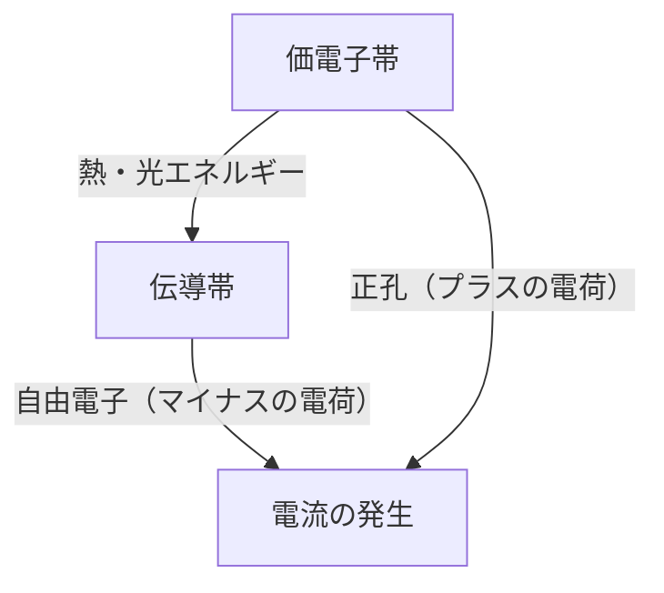
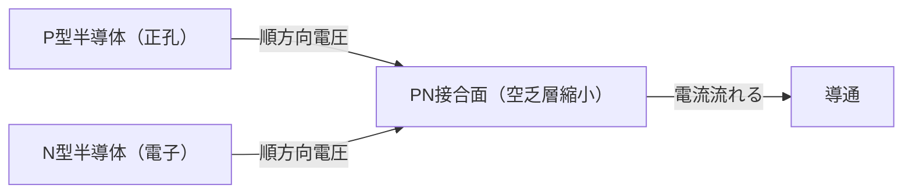
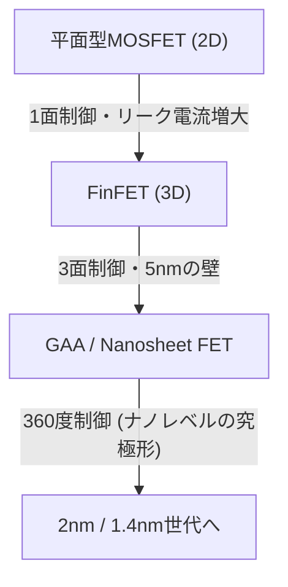

現代のデジタル社会は、半導体という「魔法の石」の上に成り立っています。スマートフォン、パソコン、自動車、そしてAIを駆動する巨大なデータセンターに至るまで、すべての計算・制御は半導体デバイスによって行われています。しかし、その根底にある物理的なメカニズムを深く理解している人は決して多くありません。本記事では、量子力学的な観点から半導体の基礎を解き明かし、PN接合ダイオード、MOSFET、そして最新のFinFETやGAA（Gate-All-Around）技術に至るまで、半導体とトランジスタの全貌を圧倒的な詳細さで解説します。

## 1. 物質の電気的性質とバンドギャップの量子力学

なぜ、ある物質は電気を流しやすく（導体）、ある物質は電気を通さない（絶縁体）のでしょうか？そして、その中間に位置する「半導体」とは何なのでしょうか？この問いに答えるためには、量子力学の「バンド理論」を理解する必要があります。

### 1.1 原子と電子の振る舞い
原子は原子核と、その周りを回る電子で構成されています。量子力学によれば、電子は連続的なエネルギーを持つことはできず、特定の離散的なエネルギー準位しかとることができません。複数の原子が結合して結晶を形成すると、それぞれの原子のエネルギー準位が重なり合い、無数の近接したエネルギー準位からなる「エネルギーバンド」が形成されます。

### 1.2 バンド理論による分類
エネルギーバンドは、主に電子が満たされている「価電子帯（Valence Band）」と、電子が存在しない（または部分的に存在する）「伝導帯（Conduction Band）」に分かれます。そして、これら2つのバンドの間には、電子が存在できない領域である「バンドギャップ（禁制帯）」が存在します。

- **導体（金属など）**: 価電子帯と伝導帯が重なり合っている、あるいは伝導帯にすでに多くの電子が存在しています。そのため、わずかな電圧（エネルギー）をかけるだけで電子は自由に移動でき、電流が流れます。
- **絶縁体（ガラス、ゴムなど）**: 価電子帯は電子で完全に満たされており、伝導帯との間のバンドギャップが非常に大きい（通常数eV以上）ため、常温程度の熱エネルギーでは電子が伝導帯に飛び越えることができません。
- **半導体（シリコン、ゲルマニウムなど）**: 絶縁体と同様に価電子帯は満たされていますが、バンドギャップが比較的小さい（シリコンの場合は約1.1 eV）ため、熱や光のエネルギーを与えられると、一部の電子がバンドギャップを飛び越えて伝導帯に励起されます。

伝導帯に励起された電子（自由電子）と、価電子帯に残された電子の抜け穴（正孔：ホール）は、どちらも電荷を運ぶ「キャリア」として働き、電流を流すことができるようになります。これが半導体の基本的な仕組みです。

## 2. シリコン結晶と共有結合
地球上で酸素に次いで2番目に多く存在する元素であるケイ素（シリコン、Si）は、半導体の主役です。シリコン原子は最外殻に4つの価電子を持っています。純粋なシリコンの結晶（真性半導体）では、各シリコン原子が隣り合う4つのシリコン原子と価電子を1つずつ出し合い、「共有結合」と呼ばれる非常に安定した結びつきを形成しています。

絶対零度（-273.15℃）ではすべての電子が共有結合に囚われているため、シリコンは完全な絶縁体となります。しかし、室温では熱エネルギーによって一部の共有結合が切れ、自由電子と正孔のペア（電子・正孔対）が生成され、わずかに電気が流れるようになります。しかし、純粋なシリコンのままではキャリアの数が少なすぎ、実用的な電子部品としては使えません。そこで「ドーピング」という魔法が使われます。

## 3. ドーピング：N型半導体とP型半導体の誕生
純粋なシリコン（真性半導体）に、ごく微量（数百万個から数億個に1個の割合）の不純物を意図的に混ぜ合わせることを「ドーピング」と呼びます。この不純物（ドーパント）の種類を変えることで、2種類の全く異なる性質を持つ半導体を作り出すことができます。

### 3.1 N型半導体（Negative type）
シリコン（価電子4個）に、リン（P）やヒ素（As）などの価電子を5個持つ元素（ドナー）を混ぜ合わせます。すると、シリコン結晶の網目構造にリン原子が入り込みますが、共有結合には4つの電子しか使われないため、リン原子の持つ5つ目の電子が余ってしまいます。この余った電子は共有結合の束縛から外れやすく、室温程度の熱エネルギーで容易に結晶内を自由に動き回る「自由電子」となります。
電子はマイナス（Negative）の電荷を持つため、電子が主要なキャリアとなるこの半導体を「N型半導体」と呼びます。

### 3.2 P型半導体（Positive type）
逆に、シリコンにホウ素（B）やガリウム（Ga）などの価電子を3個しか持たない元素（アクセプタ）を混ぜ合わせます。共有結合を作るためには電子が1つ足りない状態となり、そこに「正孔（ホール）」と呼ばれる空き部屋が生まれます。隣の結合から電子がこの空き部屋に移動してくると、元あった場所が新たな正孔となります。このように、正孔があたかもプラス（Positive）の電荷を持った粒子のように結晶内を移動して電流を運びます。これが「P型半導体」です。

## 4. PN接合とダイオードのメカニズム
P型半導体とN型半導体を単に物理的にくっつけるだけでは何も起きませんが、原子レベルで連続的に接合（PN接合）させると、非常に興味深い物理現象が発生します。これが「ダイオード」の基本原理です。

### 4.1 空乏層の形成
PN接合を形成した瞬間、N型領域の豊富な自由電子と、P型領域の豊富な正孔は、互いの濃度差によって拡散を始めます。接合面付近で自由電子と正孔が出会うと、互いに結びついて消滅（再結合）してしまいます。
その結果、接合面の付近にはキャリア（自由電子も正孔も）が存在しない領域が形成されます。これを「空乏層（Depletion Region）」と呼びます。空乏層ができると、N型側にはプラスのイオンが、P型側にはマイナスのイオンが残り、内部に電界（内部電位）が発生します。この電界が、これ以上の電子と正孔の拡散を妨げるバリア（電位障壁）として働きます。

### 4.2 整流作用（電流の一方通行）
PN接合に外部から電圧をかけると、かける方向によって振る舞いが全く異なります。

- **順方向バイアス**: P型側にプラス、N型側にマイナスの電圧をかけます。すると、外部からの電圧が内部の電位障壁を打ち消し、P型の正孔はN型へ、N型の電子はP型へと押し出され、空乏層が縮小・消滅します。結果として、大量の電流が勢いよく流れます。
- **逆方向バイアス**: P型側にマイナス、N型側にプラスの電圧をかけます。すると、電子と正孔はそれぞれ接合面から遠ざかる方向に引っ張られ、空乏層がさらに広がります。電位障壁が高くなるため、電流はほとんど流れません。

このように、一方向にしか電流を流さない性質を「整流作用」と呼び、AC（交流）をDC（直流）に変換する電源回路などで不可欠な役割を果たしています。

## 5. トランジスタの誕生とMOSFET
ダイオードは画期的な素子でしたが、単なる一方通行のバルブに過ぎません。人類が真に求めていたのは、電気信号の「増幅」と「スイッチング」を自在に行える魔法のデバイス、すなわち「トランジスタ」でした。

### 5.1 バイポーラ・トランジスタから電界効果トランジスタへ
初期のトランジスタはPNPまたはNPN構造を持つバイポーラ・トランジスタでしたが、製造が難しく消費電力も大きいという課題がありました。現在、世界中のデジタル回路の99%以上を構成しているのは、「MOSFET（Metal-Oxide-Semiconductor Field-Effect Transistor：金属-酸化物-半導体 電界効果トランジスタ）」と呼ばれるタイプのトランジスタです。

### 5.2 MOSFETの構造と動作原理
MOSFET（ここではNチャネル型エンハンスメントモードを例にします）は、以下の4つの端子から構成されます（通常、サブストレートはソースに接続されるため実質3端子として扱われます）。
1. **ソース（Source）**: キャリア（電子）の供給源（N型）。
2. **ドレイン（Drain）**: キャリアの排出先（N型）。
3. **ゲート（Gate）**: 電流の流れを制御する「蛇口」のハンドル。
4. **サブストレート（Substrate / Body）**: 基板全体（P型）。

P型のシリコン基板の中に、2つのN型の領域（ソースとドレイン）を作ります。このままでは、ソースとドレインの間にはP型の領域が立ちはだかっており（バック・トゥ・バックのPN接合）、ドレインにプラスの電圧をかけても電流は流れません。
ソースとドレインの間のP型領域の上に、非常に薄い絶縁体の膜（酸化シリコン：Oxide）を形成し、その上に金属またはポリシリコンの電極（ゲート：Metal）を配置します。

**スイッチONのメカニズム：チャネルの形成**
ゲート電極にプラスの電圧をかけると、絶縁膜を隔てたすぐ下のP型シリコン領域に変化が起きます。プラスの電圧によって、P型領域の多数キャリアである正孔が基板の奥へ反発されて押しやられ（空乏化）、同時に、P型領域にわずかに存在する少数キャリアの電子が表面に引き寄せられます。
ゲート電圧が一定の値（閾値電圧：Threshold Voltage）を超えると、絶縁膜の直下の表面に電子が密集し、P型であった領域が局所的にN型に反転します。これを「反転層（Inversion Layer）」または「チャネル（Channel）」と呼びます。
チャネルが形成されると、N型のソースとN型のドレインがN型のチャネルで繋がり、見事に電流が流れるようになります！

**スイッチOFFのメカニズム**
ゲートの電圧をゼロに戻すと、引き寄せられていた電子は散り散りになり、チャネルは消滅します。再びP型の壁が立ちはだかり、電流は遮断されます。
このように、ゲートにかけるわずかな電圧だけで、ソース・ドレイン間の巨大な電流をON/OFFできるのがMOSFETの最大の特徴です。さらに、ゲートは絶縁膜で隔離されているため、ゲート自体には電流がほとんど流れず、極めて低消費電力で駆動できます（これがCMOS技術の核となります）。

## 6. ムーアの法則と微細化の限界
1965年、インテルの共同創業者ゴードン・ムーアは「半導体集積回路に搭載されるトランジスタの数は約2年ごとに倍増する」という経験則を提唱しました。これが有名な「ムーアの法則」です。トランジスタを小さく（微細化）すればするほど、一つのチップにより多くの回路を詰め込めるだけでなく、電子の移動距離が短くなるため動作速度が上がり、さらに電圧も下げられるため消費電力も減るという「デナード・スケーリング（Dennard Scaling）」と呼ばれる魔法のような好循環が数十年にわたって続きました。

しかし、2000年代に入ると、この魔法に陰りが見え始めます。トランジスタがナノメートルスケールまで縮小すると、物理的な限界（量子力学的な効果）が顕著になってきたのです。

### 6.1 ショートチャネル効果とリーク電流
ソースとドレインの距離（チャネル長）が極端に短くなると、ゲート電圧がOFFの状態でも、ドレインの電圧がソース側の電位障壁を引き下げてしまい、意図せずに電流が漏れ出てしまう現象が発生します。これを「ショートチャネル効果（Short Channel Effect）」と呼びます。
また、ゲート絶縁膜も数原子層レベルまで薄くなり、電子が絶縁膜を量子トンネル効果ですり抜けてしまう「ゲートリーク電流」も深刻な問題となりました。スイッチを切っているのに電気が漏れ続けるため、スマートフォンが熱くなり、バッテリーがすぐに切れてしまう原因となります。

## 7. 立体構造への進化：FinFETからGAAへ
微細化の限界を突破するため、半導体技術者はトランジスタの構造そのものを根本から見直しました。平面（2D）から立体（3D）へのパラダイムシフトです。

### 7.1 FinFET（フィン・フェット）の登場
2011年頃、インテルなどが実用化したのが「FinFET（Fin Field-Effect Transistor）」です。従来のMOSFETが平面の基板上にチャネルを作っていたのに対し、FinFETではシリコン基板を魚のヒレ（Fin）のように垂直に立ち上げ、そのヒレをまたぐようにゲート電極を配置します。
平面型ではゲートがチャネルの「上」の1面からしか制御できていませんでしたが、FinFETではチャネルを「上・左・右」の3方向から包み込むように制御できます。これにより、ゲートによる電界の支配力（静電支配）が劇的に向上し、ショートチャネル効果を強力に抑え込み、リーク電流を大幅に減らすことに成功しました。FinFETの登場により、ムーアの法則は息を吹き返し、22nmから5nm世代までの主役となりました。

### 7.2 究極の構造：GAA（Gate-All-Around）
しかし、3nm、2nmとさらに微細化が進むと、FinFETの3面制御でも限界が見えてきました。そこで登場したのが、次世代のトランジスタ構造である「GAA（Gate-All-Around）」です。
GAAでは、チャネルとなるシリコンを細いワイヤー状（ナノワイヤー）やシート状（ナノシート：SamsungではMBCFET、IntelではRibbonFETなどと呼ばれる）にして完全に宙に浮かせ、その周囲360度すべてをゲート電極で包み込みます（文字通りGate-All-Around）。
これにより、ゲートによるチャネル制御能力は物理的な極限に達し、リーク電流をほぼ完全に遮断できるようになります。さらに、ナノシートの幅を柔軟に変えることで、性能重視の回路と省電力重視の回路を一つのチップ上で最適化設計しやすくなるという大きな利点もあります。

## 8. 未来へ向けて
半導体の進化は、物理学、化学、材料科学、そして天文学的な規模の設備投資と人類の叡智の結晶です。電子一つの振る舞いを精密に制御する量子力学の魔法が、私たちの手のひらの中で毎秒数十億回という凄まじい速度でON/OFFを繰り返し、巨大なデジタル宇宙を創り出しています。
GAAの次には、トランジスタを垂直に積層するCFET（Complementary FET）や、シリコンに代わる新素材（カーボンナノチューブや2次元遷移金属ダイカルコゲナイド等）の研究も進んでいます。半導体が織りなす「魔法」は、これからも人類の限界を押し広げ、新たな未来を切り拓いていくことでしょう。
