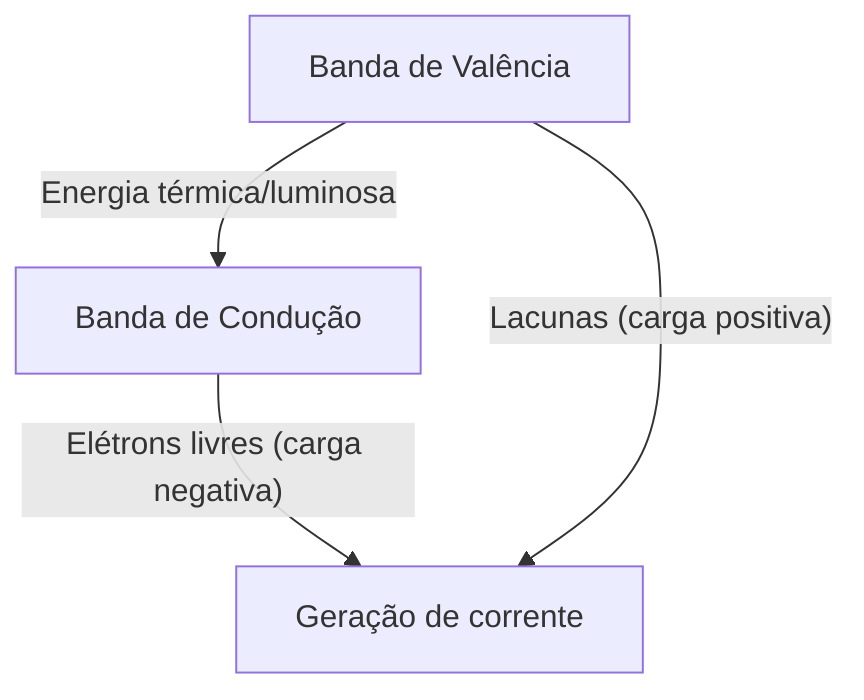
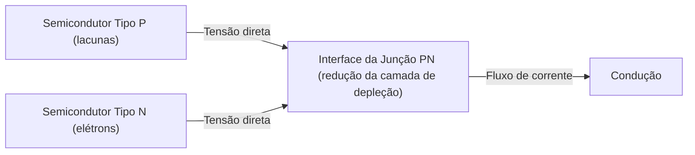
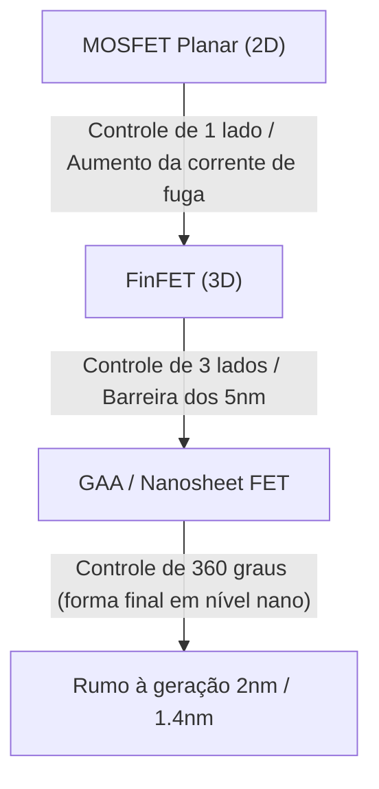

A sociedade digital moderna é construída sobre "pedras mágicas" chamadas semicondutores. Desde smartphones, computadores e automóveis até os gigantescos data centers que impulsionam a IA, toda computação e controle são realizados por dispositivos semicondutores. No entanto, poucas pessoas compreendem profundamente os mecanismos físicos subjacentes. Neste artigo, desvendaremos os fundamentos dos semicondutores a partir de uma perspectiva da mecânica quântica e explicaremos de forma abrangente os semicondutores e transistores com detalhes impressionantes, abrangendo diodos de junção PN, MOSFETs e as mais recentes tecnologias FinFET e GAA (Gate-All-Around).

## 1. Propriedades Elétricas da Matéria e Mecânica Quântica do Gap de Banda

Por que algumas substâncias conduzem eletricidade facilmente (condutores) e outras não (isolantes)? E o que são os "semicondutores", que se encontram em um ponto intermediário? Para responder a esta pergunta, precisamos entender a "teoria de bandas" da mecânica quântica.

### 1.1 O Comportamento de Átomos e Elétrons
Os átomos consistem em um núcleo e elétrons orbitando ao seu redor. De acordo com a mecânica quântica, os elétrons não podem ter energia contínua, mas apenas níveis de energia específicos e discretos. Quando múltiplos átomos se ligam para formar um cristal, seus níveis de energia se sobrepõem, formando "bandas de energia" que consistem em inumeráveis níveis de energia intimamente espaçados.

### 1.2 Classificação por Teoria de Bandas
As bandas de energia são divididas principalmente na "Banda de Valência" (Valence Band), que é preenchida por elétrons, e a "Banda de Condução" (Conduction Band), onde não há elétrons (ou apenas parcialmente). Entre essas duas bandas, existe um "gap de banda" (bandgap ou banda proibida), que é uma região onde os elétrons não podem existir.

- **Condutores (Metais, etc.)**: A banda de valência e a banda de condução se sobrepõem, ou muitos elétrons já estão presentes na banda de condução. Portanto, com a aplicação de uma pequena tensão (energia), os elétrons podem se mover livremente e a corrente flui.
- **Isolantes (Vidro, borracha, etc.)**: A banda de valência está completamente preenchida com elétrons, e o gap de banda entre ela e a banda de condução é muito grande (geralmente vários eV ou mais). Assim, a energia térmica em temperatura ambiente não é suficiente para que os elétrons saltem para a banda de condução.
- **Semicondutores (Silício, germânio, etc.)**: Como nos isolantes, a banda de valência está preenchida, mas o gap de banda é relativamente pequeno (cerca de 1,1 eV para o silício). Portanto, quando a energia térmica ou luminosa é aplicada, alguns elétrons saltam o gap de banda e são excitados para a banda de condução.

Os elétrons excitados para a banda de condução (elétrons livres) e os "buracos" deixados na banda de valência (lacunas) agem como "portadores" (carriers) que transportam carga, permitindo que a corrente flua. Este é o mecanismo básico dos semicondutores.

## 2. Cristais de Silício e Ligações Covalentes
O silício (Si), o segundo elemento mais abundante na Terra depois do oxigênio, é o protagonista dos semicondutores. Um átomo de silício possui 4 elétrons de valência em sua camada mais externa. Em um cristal de silício puro (semicondutor intrínseco), cada átomo de silício compartilha um elétron de valência com quatro átomos vizinhos, formando conexões altamente estáveis chamadas "ligações covalentes".

No zero absoluto (-273,15 °C), o silício é um isolante perfeito, pois todos os elétrons estão presos nas ligações covalentes. No entanto, em temperatura ambiente, a energia térmica quebra algumas dessas ligações, gerando pares de elétron-lacuna e permitindo que uma pequena quantidade de eletricidade flua. Ainda assim, o silício puro tem poucos portadores para ser usado como um componente eletrônico prático. É aqui que entra a mágica da "dopagem".

## 3. Dopagem: O Nascimento dos Semicondutores Tipo N e Tipo P
A "dopagem" refere-se à adição intencional de quantidades minúsculas (um em vários milhões a centenas de milhões) de impurezas ao silício puro (semicondutor intrínseco). Ao alterar o tipo dessa impureza (dopante), podemos criar dois tipos de semicondutores com propriedades completamente diferentes.

### 3.1 Semicondutor Tipo N (Negative)
No silício (4 elétrons de valência), são misturados elementos que possuem 5 elétrons de valência (doadores), como fósforo (P) ou arsênio (As). Quando um átomo de fósforo entra na estrutura cristalina do silício, apenas 4 elétrons são usados para as ligações covalentes, sobrando o quinto elétron. Este elétron extra se liberta facilmente da ligação covalente e se torna um "elétron livre" que pode se mover livremente pelo cristal com energia térmica em temperatura ambiente.
Como o elétron tem uma carga negativa (Negative), esse semicondutor, onde os elétrons são os principais portadores, é chamado de "Semicondutor Tipo N".

### 3.2 Semicondutor Tipo P (Positive)
Por outro lado, elementos com apenas 3 elétrons de valência (aceitadores), como boro (B) ou gálio (Ga), são misturados ao silício. Para formar as ligações covalentes, falta um elétron, criando um espaço vazio chamado "lacuna" (ou buraco). Quando um elétron de uma ligação vizinha se move para preencher esse espaço vazio, o local anterior de onde ele veio se torna uma nova lacuna. Dessa forma, as lacunas se movem pelo cristal transportando corrente como se fossem partículas com carga positiva (Positive). Isso é o "Semicondutor Tipo P".

## 4. Junção PN e o Mecanismo dos Diodos
Apenas juntar fisicamente um semicondutor Tipo P e um Tipo N não causa nada, mas quando eles são unidos de forma contínua em nível atômico (junção PN), ocorre um fenômeno físico fascinante. Este é o princípio básico do "diodo".

### 4.1 Formação da Camada de Depleção
No momento em que a junção PN é formada, a diferença de concentração faz com que os abundantes elétrons livres da região N e as abundantes lacunas da região P comecem a se difundir. Quando elétrons livres e lacunas se encontram perto da interface da junção, eles se recombinam e desaparecem.
Como resultado, uma região sem portadores (nem elétrons livres, nem lacunas) é formada próxima à interface da junção. Isso é chamado de "camada de depleção" (Depletion Region). Quando a camada de depleção é formada, íons positivos permanecem no lado N e íons negativos no lado P, criando um campo elétrico interno (potencial interno). Este campo elétrico atua como uma barreira de potencial que impede a difusão de mais elétrons e lacunas.

### 4.2 Efeito Retificador (Corrente de Mão Única)
Quando uma tensão externa é aplicada à junção PN, o comportamento varia completamente dependendo da direção em que é aplicada.

- **Polarização direta**: Aplica-se tensão positiva ao lado P e negativa ao lado N. A tensão externa anula a barreira de potencial interna, empurrando as lacunas do lado P para o lado N e os elétrons do lado N para o lado P, reduzindo ou eliminando a camada de depleção. Como resultado, uma grande quantidade de corrente flui vigorosamente.
- **Polarização reversa**: Aplica-se tensão negativa ao lado P e positiva ao lado N. Os elétrons e as lacunas são puxados para longe da interface da junção e a camada de depleção se alarga. A barreira de potencial torna-se mais alta e quase nenhuma corrente flui.

Essa propriedade de permitir que a corrente flua em apenas uma direção é chamada de "efeito retificador", e desempenha um papel essencial em circuitos de alimentação, convertendo CA (corrente alternada) em CC (corrente contínua).

## 5. O Nascimento dos Transistores e os MOSFETs
O diodo foi um componente revolucionário, mas não passava de uma válvula de mão única. O que a humanidade realmente buscava era um dispositivo mágico capaz de "amplificar" e "chavear" livremente sinais elétricos: o "transistor".

### 5.1 Dos Transistores Bipolares aos Transistores de Efeito de Campo
Os primeiros transistores eram transistores bipolares com estruturas PNP ou NPN, mas enfrentavam o desafio de serem difíceis de fabricar e consumirem muita energia. Hoje, mais de 99% dos circuitos digitais no mundo são compostos por transistores do tipo "MOSFET" (Transistor de Efeito de Campo de Semicondutor de Óxido Metálico).

### 5.2 Estrutura e Princípio de Funcionamento do MOSFET
O MOSFET (usando o modo de aprimoramento de canal N como exemplo) consiste em quatro terminais (geralmente, o substrato é conectado ao source, funcionando efetivamente como um dispositivo de 3 terminais).
1. **Source (Fonte)**: Fonte de portadores (elétrons) (Tipo N).
2. **Drain (Dreno)**: Destino de escoamento dos portadores (Tipo N).
3. **Gate (Porta)**: A "alavanca da torneira" que controla o fluxo da corrente.
4. **Substrato (Substrate / Body)**: A base do componente (Tipo P).

Dentro de um substrato de silício Tipo P, duas regiões Tipo N (source e drain) são criadas. No estado normal, há uma região P bloqueando o caminho entre o source e o drain (junções PN "costas com costas"), portanto, mesmo aplicando tensão positiva ao drain, a corrente não flui.
Uma película isolante muito fina (óxido de silício: Óxido) é formada sobre a região P entre o source e o drain, e sobre ela é colocado um eletrodo de metal ou polissilício (gate: Metal).

**Mecanismo Ligar (ON): Formação do Canal**
Quando uma tensão positiva é aplicada ao eletrodo do gate, ocorre uma mudança na região de silício P logo abaixo do filme isolante. A tensão positiva repele as lacunas (portadores majoritários) da região P para o fundo do substrato (depleção) e, ao mesmo tempo, atrai os elétrons (portadores minoritários presentes em pequenas quantidades) da região P para a superfície.
Quando a tensão do gate excede um determinado valor (tensão de limiar: Threshold Voltage), os elétrons se concentram na superfície logo abaixo do filme isolante, e a região que era Tipo P inverte-se localmente para Tipo N. Isso é chamado de "camada de inversão" (Inversion Layer) ou "canal" (Channel).
Quando o canal é formado, o source Tipo N e o drain Tipo N são conectados pelo canal Tipo N, e a corrente flui brilhantemente!

**Mecanismo Desligar (OFF)**
Quando a tensão do gate é reduzida a zero, os elétrons que foram atraídos se dispersam e o canal desaparece. A parede Tipo P bloqueia o caminho novamente e a corrente é interrompida.
A grande característica do MOSFET é que uma enorme corrente entre source e drain pode ser ligada e desligada com uma pequena tensão aplicada ao gate. Além disso, como o gate é isolado pelo filme dielétrico, quase não há corrente fluindo pelo próprio gate, o que permite o acionamento com baixíssimo consumo de energia (este é o núcleo da tecnologia CMOS).

## 6. A Lei de Moore e os Limites da Miniaturização
Em 1965, Gordon Moore, co-fundador da Intel, propôs uma regra empírica dizendo que "o número de transistores em um circuito integrado dobrará a cada dois anos". Esta é a famosa "Lei de Moore". Ao diminuir o tamanho dos transistores (miniaturização), não apenas mais circuitos podem ser embalados em um único chip, mas também a velocidade de operação aumenta, já que a distância percorrida pelos elétrons é mais curta. A tensão também pode ser reduzida, diminuindo o consumo de energia. Este ciclo virtuoso mágico, chamado "Dennard Scaling" (Escala de Dennard), continuou por décadas.

No entanto, nos anos 2000, essa mágica começou a perder força. À medida que os transistores encolheram para a escala nanométrica, os limites físicos (efeitos da mecânica quântica) tornaram-se evidentes.

### 6.1 Efeito de Canal Curto e Corrente de Fuga
Quando a distância entre source e drain (comprimento do canal) se torna extremamente curta, mesmo com a tensão do gate OFF, a tensão do drain diminui a barreira de potencial do lado do source, fazendo com que a corrente vaze não intencionalmente. Isso é conhecido como "efeito de canal curto" (Short Channel Effect).
Além disso, com a espessura do filme isolante do gate reduzida a níveis atômicos, os elétrons começaram a atravessá-lo pelo efeito de tunelamento quântico, resultando em "corrente de fuga do gate", um problema grave. Como a eletricidade continua a vazar mesmo quando o interruptor está desligado, isso causa superaquecimento nos smartphones e esgota a bateria rapidamente.

## 7. Evolução para Estruturas 3D: Do FinFET ao GAA
Para romper os limites da miniaturização, os engenheiros de semicondutores reformularam radicalmente a própria estrutura dos transistores. Uma mudança de paradigma de plano (2D) para tridimensional (3D).

### 7.1 O Surgimento do FinFET
Por volta de 2011, empresas como a Intel implementaram o "FinFET (Fin Field-Effect Transistor)". Enquanto o MOSFET convencional criava um canal em um substrato plano, o FinFET eleva verticalmente o substrato de silício como uma barbatana de peixe (Fin) e posiciona o eletrodo do gate ao redor da barbatana.
Nos transistores planares, o gate só podia controlar o canal pela "superfície superior" (1 lado). No FinFET, o gate envolve e controla o canal de "cima, esquerda e direita" (3 lados). Isso melhorou dramaticamente o domínio do campo elétrico pelo gate (controle eletrostático), reprimindo o efeito de canal curto e reduzindo significativamente a corrente de fuga. Com o advento do FinFET, a Lei de Moore reviveu e reinou das gerações de 22nm até 5nm.

### 7.2 A Estrutura Definitiva: GAA (Gate-All-Around)
No entanto, conforme a miniaturização avançou para 3nm e 2nm, até mesmo o controle trilateral do FinFET começou a mostrar seus limites. É aqui que surge o "GAA (Gate-All-Around)", a estrutura de transistor da próxima geração.
No GAA, o silício que forma o canal é moldado em fios finos (nanofios) ou folhas (nanofolhas, chamadas de MBCFET pela Samsung ou RibbonFET pela Intel), completamente suspensos no ar, e o eletrodo do gate os envolve 360 graus por todos os lados (literalmente Gate-All-Around).
Com isso, a capacidade de controle do canal pelo gate atinge seu limite físico, bloqueando a corrente de fuga quase por completo. Além disso, ao ajustar a largura das nanofolhas, torna-se mais fácil otimizar circuitos com foco no desempenho e circuitos focados na economia de energia em um mesmo chip.

## 8. Rumo ao Futuro
A evolução dos semicondutores é a cristalização da física, química, ciência dos materiais e investimentos de capital astronômicos combinados com a sabedoria humana. A magia da mecânica quântica, que controla de forma precisa o comportamento de um único elétron, liga e desliga bilhões de vezes por segundo na palma de nossas mãos, criando um gigantesco universo digital.
Depois do GAA, pesquisas avançam para transistores empilhados verticalmente, como o CFET (Complementary FET), e novos materiais para substituir o silício (como nanotubos de carbono e dicalcogenetos de metais de transição 2D). A "magia" tecida pelos semicondutores continuará a expandir os limites da humanidade, abrindo caminho para um novo futuro.
