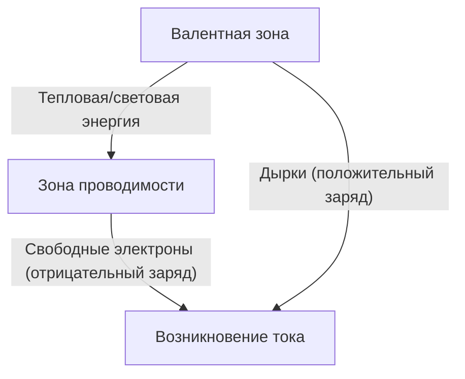
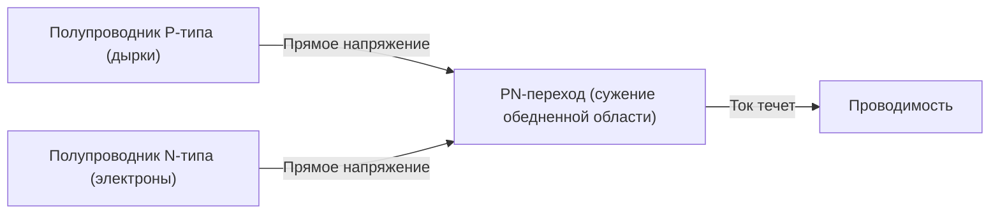
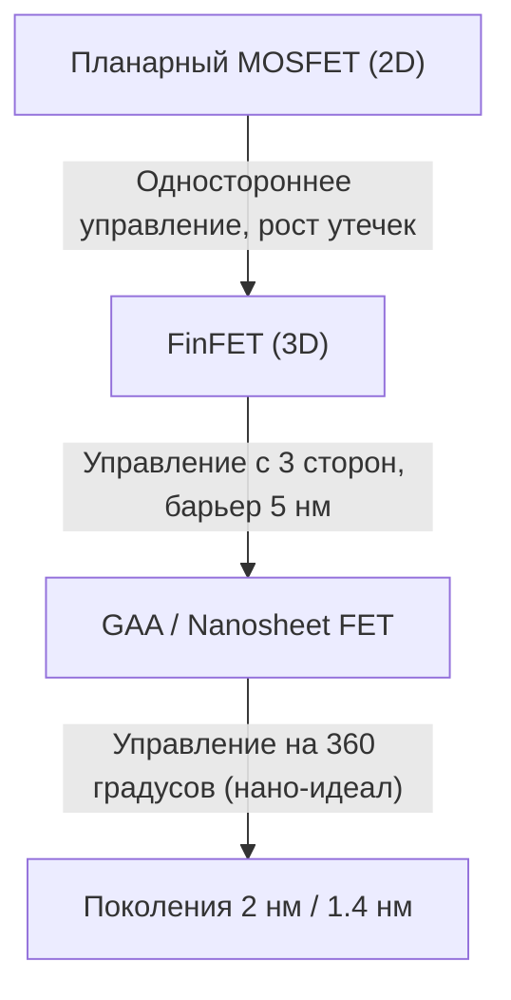

Современное цифровое общество построено на «магических камнях», называемых полупроводниками. От смартфонов, компьютеров и автомобилей до огромных центров обработки данных, управляющих искусственным интеллектом, все вычисления и управление осуществляются с помощью полупроводниковых устройств. Однако не так много людей глубоко понимают физические механизмы, лежащие в их основе. В этой статье мы раскроем основы полупроводников с точки зрения квантовой механики и объясним все о полупроводниках и транзисторах в невероятных подробностях, от PN-переходов, диодов и MOSFET до новейших технологий FinFET и GAA (Gate-All-Around).

## 1. Электрические свойства материалов и квантовая механика запрещенной зоны

Почему некоторые материалы легко проводят электричество (проводники), а другие не проводят его вообще (диэлектрики)? И что такое «полупроводники», находящиеся где-то посередине? Чтобы ответить на этот вопрос, необходимо понять «зонную теорию» квантовой механики.

### 1.1 Поведение атомов и электронов
Атомы состоят из ядра и вращающихся вокруг него электронов. Согласно квантовой механике, электроны не могут иметь непрерывную энергию и могут занимать только определенные дискретные энергетические уровни. Когда множество атомов объединяются, образуя кристалл, их энергетические уровни перекрываются, образуя «энергетические зоны», состоящие из бесчисленного количества близко расположенных энергетических уровней.

### 1.2 Классификация на основе зонной теории
Энергетические зоны делятся в основном на «валентную зону (Valence Band)», которая заполнена электронами, и «зону проводимости (Conduction Band)», в которой электронов нет (или они присутствуют частично). Между этими двумя зонами существует «запрещенная зона (Band Gap)», область, в которой электроны не могут находиться.

- **Проводники (например, металлы)**: Валентная зона и зона проводимости перекрываются, или в зоне проводимости уже много электронов. Поэтому при приложении даже небольшого напряжения (энергии) электроны могут свободно перемещаться, и протекает ток.
- **Диэлектрики (например, стекло, резина)**: Валентная зона полностью заполнена электронами, а ширина запрещенной зоны между ней и зоной проводимости очень велика (обычно несколько эВ и более), поэтому тепловой энергии при комнатной температуре недостаточно для того, чтобы электроны перепрыгнули в зону проводимости.
- **Полупроводники (например, кремний, германий)**: Как и у диэлектриков, валентная зона заполнена, но запрещенная зона относительно мала (около 1.1 эВ для кремния). При воздействии тепла или света некоторые электроны преодолевают запрещенную зону и возбуждаются в зону проводимости.

Электроны, возбужденные в зону проводимости (свободные электроны), и пустые места, оставленные электронами в валентной зоне (дырки), действуют как «носители», переносящие заряд и позволяющие току течь. Таков основной принцип работы полупроводников.

## 2. Кристалл кремния и ковалентные связи
Кремний (Si), второй по распространенности элемент на Земле после кислорода, является главным героем полупроводников. Атом кремния имеет 4 валентных электрона на внешней оболочке. В кристалле чистого кремния (собственном полупроводнике) каждый атом кремния делит по одному валентному электрону с четырьмя соседними атомами, образуя очень прочную связь, называемую «ковалентной связью».

При абсолютном нуле (-273,15 °C) все электроны заперты в ковалентных связях, поэтому кремний становится идеальным изолятором. Однако при комнатной температуре тепловая энергия разрывает некоторые ковалентные связи, создавая пары свободный электрон-дырка, и начинает протекать слабый ток. Однако количество носителей в чистом кремнии слишком мало для использования в практических электронных компонентах. Именно здесь применяется магия «легирования».

## 3. Легирование: Рождение полупроводников N-типа и P-типа
Преднамеренное добавление в чистый кремний (собственный полупроводник) ничтожно малого количества примесей (от одной на миллионы до одной на сотни миллионов) называется «легированием» (doping). Изменяя тип примеси (легирующей добавки), можно создать два типа полупроводников с совершенно разными свойствами.

### 3.1 Полупроводник N-типа (Negative type)
К кремнию (4 валентных электрона) добавляется элемент с 5 валентными электронами (донор), такой как фосфор (P) или мышьяк (As). В результате атом фосфора встраивается в сетчатую структуру кристалла кремния, но поскольку для образования ковалентных связей используются только 4 электрона, 5-й электрон атома фосфора оказывается лишним. Этот лишний электрон легко освобождается от уз ковалентной связи и при комнатной температуре становится «свободным электроном», который свободно перемещается по кристаллу.
Поскольку электроны имеют отрицательный (Negative) заряд, этот полупроводник, в котором электроны являются основными носителями, называется «полупроводником N-типа».

### 3.2 Полупроводник P-типа (Positive type)
Наоборот, к кремнию добавляются элементы всего с 3 валентными электронами (акцепторы), такие как бор (B) или галлий (Ga). Для образования ковалентных связей не хватает одного электрона, и там образуется пустое место, называемое «дыркой» (hole). Когда электрон из соседней связи перемещается в эту пустоту, его прежнее место становится новой дыркой. Таким образом, дырки перемещаются по кристаллу и переносят ток, как если бы они были частицами с положительным (Positive) зарядом. Это «полупроводник P-типа».

## 4. Механизм PN-перехода и диода
Если просто физически соединить полупроводники P- и N-типа, ничего не произойдет, но если соединить их на атомном уровне (PN-переход), возникает очень интересный физический феномен. Это базовый принцип работы «диода».

### 4.1 Формирование обедненной области
В момент образования PN-перехода свободные электроны в N-области и дырки в P-области начинают диффундировать из-за разницы концентраций. Когда свободные электроны и дырки встречаются вблизи перехода, они объединяются и исчезают (рекомбинируют).
В результате вблизи границы раздела образуется область без носителей (как свободных электронов, так и дырок). Она называется «обедненной областью» (Depletion Region). С образованием обедненной области на стороне N-типа остаются положительные ионы, а на стороне P-типа - отрицательные ионы, и внутри возникает электрическое поле (внутренний потенциал). Это электрическое поле действует как барьер (потенциальный барьер), предотвращающий дальнейшую диффузию электронов и дырок.

### 4.2 Выпрямляющее действие (односторонний ток)
При приложении внешнего напряжения к PN-переходу поведение сильно различается в зависимости от направления.

- **Прямое смещение**: Положительное напряжение прикладывается к P-области, а отрицательное - к N-области. Внешнее напряжение преодолевает внутренний потенциальный барьер, выталкивая дырки P-типа в N-область, а электроны N-типа - в P-область, в результате чего обедненная область сужается и исчезает. В результате протекает сильный ток.
- **Обратное смещение**: Отрицательное напряжение прикладывается к P-области, а положительное - к N-области. В этом случае электроны и дырки оттягиваются в сторону от перехода, и обедненная область расширяется. Потенциальный барьер становится выше, и ток практически не течет.

Это свойство пропускать ток только в одном направлении называется «выпрямлением» и играет важнейшую роль в цепях питания, преобразующих переменный ток (AC) в постоянный (DC).

## 5. Рождение транзистора и MOSFET
Диод был революционным устройством, но это всего лишь односторонний клапан. Человечеству действительно нужно было магическое устройство, способное свободно осуществлять «усиление» и «переключение» электрических сигналов, а именно «транзистор».

### 5.1 От биполярных транзисторов к полевым транзисторам
Первые транзисторы были биполярными транзисторами со структурой PNP или NPN, но их было сложно производить и они потребляли много энергии. Сегодня более 99% всех цифровых схем в мире состоят из типа транзистора, называемого «MOSFET» (Metal-Oxide-Semiconductor Field-Effect Transistor: металл-оксид-полупроводниковый полевой транзистор).

### 5.2 Структура и принцип работы MOSFET
MOSFET (на примере N-канального типа с обогащением) состоит из следующих 4 выводов (обычно подложка соединяется с истоком, поэтому он фактически рассматривается как 3-выводное устройство).
1. **Исток (Source)**: Источник носителей (электронов) (N-тип).
2. **Сток (Drain)**: Приемник носителей (N-тип).
3. **Затвор (Gate)**: Ручка «крана», управляющая потоком тока.
4. **Подложка (Substrate / Body)**: Вся кремниевая пластина (P-тип).

Внутри кремниевой подложки P-типа создаются две области N-типа (исток и сток). В таком состоянии между истоком и стоком стоит область P-типа (два PN-перехода навстречу друг другу), и даже при приложении положительного напряжения к стоку ток не пойдет.
Над областью P-типа между истоком и стоком формируется очень тонкая изоляционная пленка (оксид кремния: Oxide), поверх которой размещается электрод из металла или поликремния (затвор: Metal).

**Механизм включения: Формирование канала**
При приложении положительного напряжения к электроду затвора происходят изменения в области кремния P-типа непосредственно под изоляционной пленкой. Положительное напряжение отталкивает дырки, которые являются основными носителями в P-области, вглубь подложки (обеднение), и в то же время электроны, присутствующие в небольшом количестве в P-области, притягиваются к поверхности.
Когда напряжение на затворе превышает определенное значение (пороговое напряжение: Threshold Voltage), электроны концентрируются на поверхности прямо под изоляционной пленкой, и область, которая была P-типа, локально инвертируется в N-тип. Это называется «инверсным слоем» (Inversion Layer) или «каналом» (Channel).
При формировании канала N-тип истока и N-тип стока соединяются N-типом канала, и ток начинает блестяще течь!

**Механизм выключения**
Когда напряжение на затворе возвращается к нулю, притянутые электроны рассеиваются, и канал исчезает. Снова возникает барьер P-типа, и ток прерывается.
Таким образом, важнейшей особенностью MOSFET является то, что огромный ток между истоком и стоком можно ВКЛЮЧАТЬ/ВЫКЛЮЧАТЬ небольшим напряжением, приложенным к затвору. Более того, поскольку затвор изолирован изоляционной пленкой, через сам затвор практически не течет ток, что позволяет ему работать с чрезвычайно низким энергопотреблением (что является ядром технологии CMOS).

## 6. Закон Мура и пределы миниатюризации
В 1965 году соучредитель Intel Гордон Мур предложил эмпирическое правило: «Количество транзисторов на интегральной схеме будет удваиваться примерно каждые два года». Это знаменитый «Закон Мура». Чем меньше транзисторы (миниатюризация), тем больше схем можно поместить на один чип. Кроме того, поскольку расстояние, проходимое электронами, уменьшается, скорость работы увеличивается, а напряжение можно снизить, что уменьшает энергопотребление. Этот магический благотворный цикл, называемый «масштабированием Деннарда» (Dennard Scaling), продолжался десятилетиями.

Однако в 2000-х годах эта магия начала тускнеть. Когда транзисторы уменьшились до нанометрового масштаба, стали заметны физические ограничения (квантово-механические эффекты).

### 6.1 Эффект короткого канала и ток утечки
Когда расстояние между истоком и стоком (длина канала) становится предельно коротким, даже если напряжение на затворе выключено, напряжение на стоке снижает потенциальный барьер со стороны истока, вызывая непреднамеренную утечку тока. Это называется «эффектом короткого канала» (Short Channel Effect).
Кроме того, изоляционная пленка затвора стала тонкой до нескольких атомных слоев, и серьезной проблемой стала «утечка тока через затвор», при которой электроны проходят через изоляционную пленку из-за эффекта квантового туннелирования. Поскольку электричество продолжает утекать даже при выключенном переключателе, это приводит к тому, что смартфоны нагреваются и их батареи быстро разряжаются.

## 7. Эволюция к трехмерной структуре: От FinFET к GAA
Чтобы преодолеть пределы миниатюризации, инженеры-полупроводниковые коренным образом пересмотрели саму структуру транзистора. Это смена парадигмы с плоскости (2D) на трехмерность (3D).

### 7.1 Появление FinFET (ФинФЕТ)
Примерно в 2011 году компании, такие как Intel, внедрили «FinFET» (Fin Field-Effect Transistor). В то время как обычные MOSFET создавали канал на плоской подложке, в FinFET кремниевая подложка возвышается вертикально, как рыбий плавник (Fin), а электрод затвора располагается так, чтобы обхватывать этот плавник.
В планарном типе затвор мог контролировать канал только с одной поверхности «сверху», но в FinFET канал контролируется с трех направлений: «сверху, слева и справа». В результате электростатический контроль со стороны затвора резко возрос, что позволило надежно подавлять эффект короткого канала и значительно снизить токи утечки. Появление FinFET возродило Закон Мура и стало главной технологией для поколений от 22 нм до 5 нм.

### 7.2 Идеальная структура: GAA (Gate-All-Around)
Однако по мере дальнейшей миниатюризации до 3 нм и 2 нм стали видны пределы даже трехстороннего контроля FinFET. В результате появилась структура транзистора следующего поколения «GAA» (Gate-All-Around).
В GAA кремний, который становится каналом, подвешивается в воздухе в виде тонких проволок (нанопроволоки) или листов (нанолисты: Samsung называет их MBCFET, Intel - RibbonFET), а электрод затвора полностью оборачивает их на все 360 градусов (буквально Gate-All-Around).
Благодаря этому способность затвора управлять каналом достигает физического предела, и токи утечки могут быть почти полностью блокированы. Кроме того, гибко изменяя ширину нанолиста, становится намного проще оптимизировать схемы, ориентированные на производительность, и схемы, ориентированные на энергосбережение, на одном чипе.

## 8. Взгляд в будущее
Эволюция полупроводников — это кристаллизация физики, химии, материаловедения, а также астрономических капиталовложений и человеческой мудрости. Магия квантовой механики, которая точно управляет поведением каждого отдельного электрона, включается и выключается на невероятной скорости в миллиарды раз в секунду на наших ладонях, создавая гигантскую цифровую вселенную.
После GAA ведутся исследования таких технологий, как CFET (Complementary FET), в которых транзисторы укладываются вертикально, и новых материалов для замены кремния (таких как углеродные нанотрубки и двумерные дихалькогениды переходных металлов). «Магия», сотканная из полупроводников, несомненно, будет продолжать раздвигать пределы человечества и открывать новое будущее.
