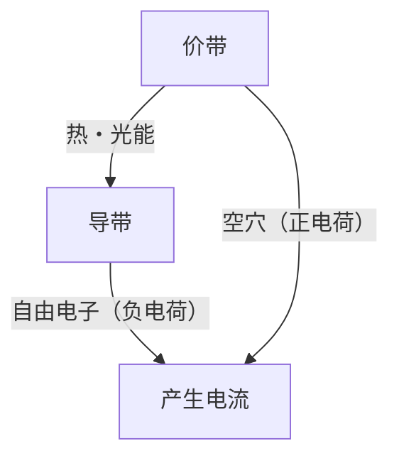
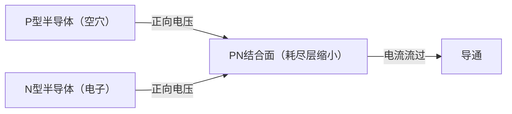
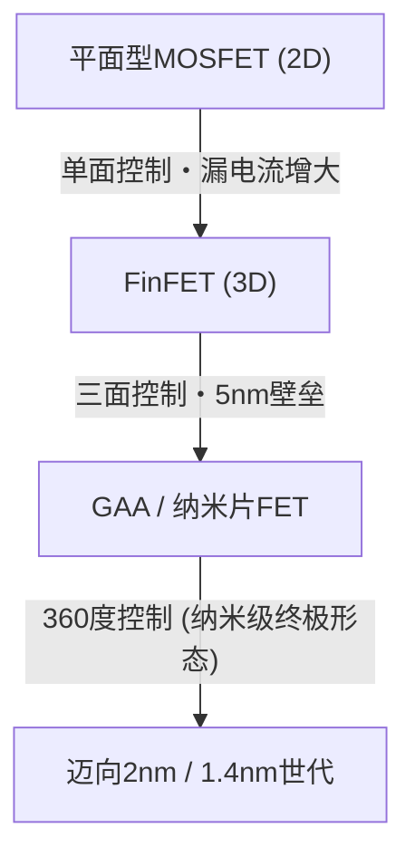

现代数字社会建立在被称为“魔法之石”的半导体之上。从智能手机、个人电脑、汽车，到驱动AI的巨大数据中心，所有的计算与控制都是由半导体器件完成的。然而，深入了解其底层物理机制的人并不多。本文将从量子力学的角度解开半导体的基础，并以极高的细节全貌讲解PN结二极管、MOSFET，直至最新的FinFET和GAA（Gate-All-Around）技术。

## 1. 物质的电气特性与带隙的量子力学

为什么有些物质容易导电（导体），而有些物质不导电（绝缘体）？介于两者之间的“半导体”又是什么？要回答这个问题，必须了解量子力学中的“能带理论”。

### 1.1 原子与电子的行为
原子由原子核和绕其旋转的电子组成。根据量子力学，电子不能具有连续的能量，只能具有特定的离散能级。当多个原子结合形成晶体时，各个原子的能级相互重叠，形成了由无数相邻能级组成的“能带”。

### 1.2 基于能带理论的分类
能带主要分为充满电子的“价带（Valence Band）”和没有电子（或部分存在）的“导带（Conduction Band）”。在这两个能带之间，存在一个电子无法存在的区域，即“带隙（禁带）”。

- **导体（如金属）**: 价带与导带重叠，或者导带中已经存在许多电子。因此，只需施加微小的电压（能量），电子就能自由移动，产生电流。
- **绝缘体（如玻璃、橡胶）**: 价带完全被电子填满，且与导带之间的带隙非常大（通常为数eV以上），因此在室温程度的热能下，电子无法跃迁到导带。
- **半导体（如硅、锗）**: 像绝缘体一样，价带是满的，但带隙相对较小（硅约为1.1 eV），因此当给予热或光能时，部分电子会跃过带隙被激发到导带。

被激发到导带的电子（自由电子）和留在价带中的电子空穴（空穴：Hole），都作为携带电荷的“载流子”发挥作用，从而能够传导电流。这就是半导体的基本原理。

## 2. 硅晶体与共价键
作为地球上丰度仅次于氧的第二大元素，硅（Si）是半导体的主角。硅原子的最外层有4个价电子。在纯硅晶体（本征半导体）中，每个硅原子与相邻的4个硅原子各提供1个价电子，形成被称为“共价键”的非常稳定的结合。

在绝对零度（-273.15℃）下，所有电子都被困在共价键中，因此硅是完美的绝缘体。但在室温下，部分共价键会被热能打断，产生自由电子和空穴的配对（电子-空穴对），从而能流过微弱的电流。然而，纯硅中的载流子数量太少，无法作为实用的电子元件使用。因此，我们需要使用“掺杂”这种魔法。

## 3. 掺杂：N型半导体与P型半导体的诞生
在纯硅（本征半导体）中，有意掺入极微量（几百万到几亿分之一的比例）的杂质，称为“掺杂”。通过改变这种杂质（掺杂剂）的种类，可以制造出具有两种截然不同性质的半导体。

### 3.1 N型半导体（Negative type）
在硅（4个价电子）中，掺入磷（P）或砷（As）等具有5个价电子的元素（施主）。这样，磷原子进入硅晶体的网状结构中，但由于共价键只使用4个电子，磷原子的第5个电子就多余了。这个多余的电子容易脱离共价键的束缚，在室温程度的热能下就能轻易在晶体内自由移动，成为“自由电子”。
由于电子带负（Negative）电荷，这种以电子为主要载流子的半导体被称为“N型半导体”。

### 3.2 P型半导体（Positive type）
相反，在硅中掺入硼（B）或镓（Ga）等只有3个价电子的元素（受主）。为了形成共价键，会缺少一个电子，从而产生一个被称为“空穴（Hole）”的空房间。当相邻键的电子移动到这个空房间时，原来的位置就会成为新的空穴。这样一来，空穴就像带正（Positive）电荷的粒子一样在晶体内移动，从而传导电流。这就是“P型半导体”。

## 4. PN结与二极管的机制
仅仅将P型半导体和N型半导体物理上连接在一起不会发生任何事情，但如果在原子水平上连续接合（PN结），就会产生非常有趣的物理现象。这就是“二极管”的基本原理。

### 4.1 耗尽层的形成
在形成PN结的瞬间，N型区域中丰富的自由电子和P型区域中丰富的空穴，由于彼此的浓度差开始扩散。当自由电子和空穴在结合面附近相遇时，它们会结合并消失（复合）。
结果，在结合面附近形成了一个不存在载流子（既没有自由电子也没有空穴）的区域。这被称为“耗尽层（Depletion Region）”。当耗尽层形成时，N型侧留下正离子，P型侧留下负离子，内部产生电场（内建电势）。这个电场起到了阻止电子和空穴进一步扩散的屏障（电势垒）作用。

### 4.2 整流作用（电流单行道）
当从外部对PN结施加电压时，根据施加方向的不同，行为会有很大差异。

- **正向偏置**: 在P型侧施加正电压，N型侧施加负电压。这样，外部电压抵消了内部的电势垒，P型的空穴被推向N型，N型的电子被推向P型，耗尽层缩小并消失。结果，大量电流顺畅流过。
- **反向偏置**: 在P型侧施加负电压，N型侧施加正电压。这样，电子和空穴分别被拉向远离结合面的方向，耗尽层进一步变宽。由于电势垒变高，几乎没有电流流过。

这种只允许电流朝一个方向流动的特性被称为“整流作用”，在将交流（AC）转换为直流（DC）的电源电路等中发挥着不可或缺的作用。

## 5. 晶体管的诞生与MOSFET
二极管虽然是划时代的元件，但仅仅是一个单向阀门。人类真正渴望的是能够自由进行电信号“放大”和“开关”的魔法器件，即“晶体管”。

### 5.1 从双极型晶体管到场效应晶体管
早期的晶体管是具有PNP或NPN结构的双极型晶体管，但存在制造困难和功耗大的问题。如今，构成全球99%以上数字电路的是被称为“MOSFET（金属-氧化物-半导体场效应晶体管）”的晶体管。

### 5.2 MOSFET的结构与工作原理
MOSFET（此处以N沟道增强型为例）由以下四个端子组成（通常，衬底与源极连接，因此实际上作为三端子处理）。
1. **源极（Source）**: 载流子（电子）的供应源（N型）。
2. **漏极（Drain）**: 载流子的排出处（N型）。
3. **栅极（Gate）**: 控制电流流动的“水龙头”把手。
4. **衬底（Substrate / Body）**: 整个基板（P型）。

在P型硅衬底中，制造两个N型区域（源极和漏极）。在这个状态下，源极和漏极之间有P型区域阻挡（背靠背的PN结），即使对漏极施加正电压，电流也不会流过。
在源极和漏极之间的P型区域上方，形成一层非常薄的绝缘膜（氧化硅：Oxide），并在其上放置金属或多晶硅电极（栅极：Metal）。

**开关ON的机制：沟道的形成**
当对栅极电极施加正电压时，隔着绝缘膜正下方的P型硅区域会发生变化。正电压将P型区域的多数载流子（空穴）排斥到基板深处（耗尽化），同时，将P型区域中极少数的少数载流子（电子）吸引到表面。
当栅极电压超过一定值（阈值电压：Threshold Voltage）时，电子聚集在绝缘膜正下方的表面，原本的P型区域局部反转为N型。这被称为“反型层（Inversion Layer）”或“沟道（Channel）”。
当沟道形成时，N型的源极和N型的漏极通过N型的沟道连接起来，电流就能顺利流过！

**开关OFF的机制**
当栅极电压回到零时，被吸引的电子散去，沟道消失。P型的墙壁再次立起，电流被阻断。
像这样，仅凭施加在栅极上的微小电压，就能ON/OFF源极和漏极之间的巨大电流，这是MOSFET最大的特点。此外，由于栅极被绝缘膜隔离，栅极本身几乎没有电流流过，能以极低的功耗驱动（这也是CMOS技术的核心）。

## 6. 摩尔定律与微缩化的极限
1965年，英特尔联合创始人戈登·摩尔提出了“半导体集成电路中容纳的晶体管数量大约每两年翻一番”的经验法则。这就是著名的“摩尔定律”。晶体管越小（微缩化），不仅能在一个芯片上塞进更多的电路，而且因为电子的移动距离变短，运行速度会提高，同时电压也可以降低，从而减少功耗。这种被称为“登纳德缩放比例（Dennard Scaling）”的魔法般的良性循环持续了几十年。

然而，进入2000年代后，这种魔法开始蒙上阴影。当晶体管缩小到纳米尺度时，物理极限（量子力学效应）变得显著起来。

### 6.1 短沟道效应与漏电流
当源极和漏极之间的距离（沟道长度）变得极短时，即使在栅极电压为OFF的状态下，漏极电压也会拉低源极侧的电势垒，导致电流意外泄漏。这种现象被称为“短沟道效应（Short Channel Effect）”。
此外，栅极绝缘膜也薄到了几个原子层级别，电子通过量子隧穿效应穿过绝缘膜的“栅极漏电流”也成为了严重问题。因为即使关掉开关，电还是会持续泄漏，这就导致了智能手机发热和电池电量快速耗尽。

## 7. 向立体结构演进：从FinFET到GAA
为了突破微缩化的极限，半导体工程师从根本上重新审视了晶体管的结构。这是一种从平面（2D）向立体（3D）的范式转变。

### 7.1 FinFET的登场
2011年左右，英特尔等公司实用化了“FinFET（鳍式场效应晶体管）”。传统的MOSFET是在平面的基板上形成沟道，而FinFET则是将硅基板像鱼鳍（Fin）一样垂直竖起，并跨越鱼鳍布置栅极电极。
在平面型中，栅极只能从沟道的“上方”单面进行控制，但在FinFET中，可以从“上、左、右”三个方向包围并控制沟道。由此，栅极对电场的控制力（静电控制）得到大幅提升，成功地强力抑制了短沟道效应，大幅减少了漏电流。随着FinFET的出现，摩尔定律重获新生，成为22nm至5nm世代的主角。

### 7.2 终极结构：GAA（Gate-All-Around）
然而，随着进一步微缩至3nm、2nm，即使是FinFET的三面控制也看到了极限。于是，下一代晶体管结构“GAA（全环绕栅极）”登场了。
在GAA中，作为沟道的硅被做成细线状（纳米线）或片状（纳米片：在三星被称为MBCFET，在英特尔被称为RibbonFET等），完全悬空，周围360度全部被栅极电极包裹（字面意思的Gate-All-Around）。
这样，栅极对沟道的控制能力达到了物理上的极限，能够几乎完全阻断漏电流。此外，通过灵活改变纳米片的宽度，可以更容易地在同一个芯片上优化设计注重性能的电路和注重低功耗的电路，这也是一个巨大的优势。

## 8. 面向未来
半导体的演进是物理学、化学、材料科学以及天文数字般的设备投资与人类智慧的结晶。精确控制单电子行为的量子力学魔法，在我们的手掌中以每秒数十亿次的惊人速度反复进行ON/OFF，创造了巨大的数字宇宙。
在GAA之后，垂直堆叠晶体管的CFET（互补场效应晶体管），以及取代硅的新材料（碳纳米管和二维过渡金属硫族化合物等）的研究也在推进。半导体编织的“魔法”，将继续拓宽人类的极限，开辟崭新的未来。
