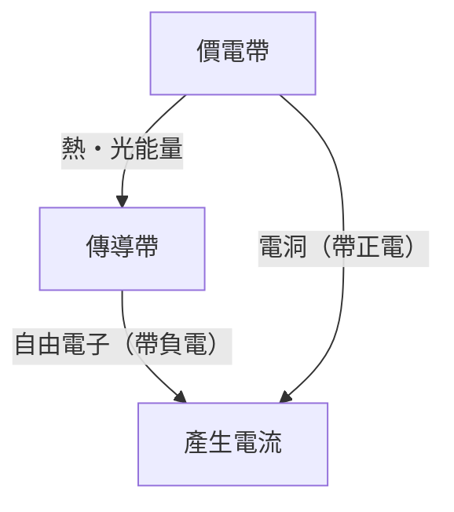
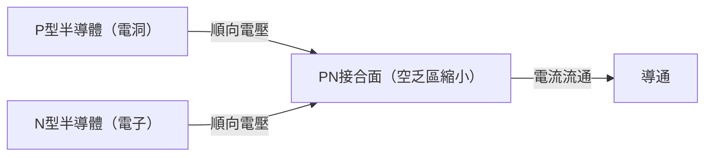
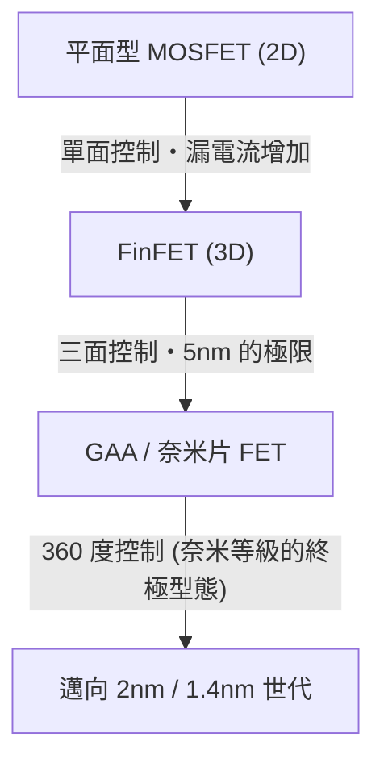

現代數位社會建立在被稱為「魔法之石」的半導體之上。從智慧型手機、個人電腦、汽車，一直到驅動 AI 的巨大資料中心，所有的計算與控制都由半導體元件執行。然而，深入理解其底層物理機制的人卻不多。本文將從量子力學的觀點出發，解開半導體的基礎原理，並以壓倒性的細節為您解說從 PN 介面二極體、MOSFET 到最新 FinFET 及 GAA（Gate-All-Around）技術等半導體與電晶體的全貌。

## 1. 物質的電氣特性與能隙的量子力學

為什麼有些物質容易導電（導體），而有些物質則不導電（絕緣體）呢？介於兩者之間的「半導體」又是什麼？為了回答這個問題，必須理解量子力學中的「能帶理論」。

### 1.1 原子與電子的行為
原子由原子核及環繞其運行的電子組成。根據量子力學，電子無法擁有連續的能量，只能處於特定的離散能階。當多個原子結合形成晶體時，各自原子的能階會互相重疊，形成由無數相近能階組成的「能帶」。

### 1.2 能帶理論分類
能帶主要分為充滿電子的「價電帶（Valence Band）」以及沒有電子（或部分存在）的「傳導帶（Conduction Band）」。在這兩個能帶之間，存在著電子無法存在的區域，稱為「能隙（Band Gap / 禁帶）」。

- **導體（如金屬等）**: 價電帶與傳導帶重疊，或者傳導帶中已經有許多電子。因此，只需施加微小的電壓（能量），電子就能自由移動，產生電流。
- **絕緣體（如玻璃、橡膠等）**: 價電帶完全被電子填滿，且與傳導帶之間的能隙非常大（通常數 eV 以上），因此在常溫的熱能下，電子無法躍遷到傳導帶。
- **半導體（如矽、鍺等）**: 與絕緣體一樣，價電帶是滿的，但能隙較小（矽約為 1.1 eV）。因此，當給予熱能或光能時，部分電子會跨越能隙被激發到傳導帶。

被激發到傳導帶的電子（自由電子）與留在價電帶中的電子空缺（電洞 / 正孔），兩者皆作為攜帶電荷的「載子」發揮作用，從而能夠導電。這就是半導體的基本機制。

## 2. 矽晶體與共價鍵
在地球上含量僅次於氧的元素——矽（Si），是半導體的主角。矽原子在最外層擁有 4 個價電子。在純矽晶體（本質半導體）中，每個矽原子與相鄰的 4 個矽原子互相分享 1 個價電子，形成稱為「共價鍵」的極穩定結合。

在絕對零度（-273.15℃）時，所有電子都被束縛在共價鍵中，矽是完全的絕緣體。但在室溫下，由於熱能的作用，部分共價鍵會斷裂，產生自由電子與電洞對（電子-電洞對），使得微小的電流得以通過。然而，純矽中的載子數量太少，無法作為實用的電子零件。因此便用上了名為「摻雜」的魔法。

## 3. 摻雜：N型半導體與P型半導體的誕生
在純矽（本質半導體）中刻意混入極微量（比例為數百萬至數億分之一）的雜質，這個過程稱為「摻雜（Doping）」。透過改變這種雜質（摻雜物）的種類，可以製造出具有兩種截然不同特性的半導體。

### 3.1 N型半導體（Negative type）
在矽（4 個價電子）中混入磷（P）或砷（As）等擁有 5 個價電子的元素（施體）。磷原子進入矽晶體的網狀結構中，但共價鍵只需要 4 個電子，導致磷原子的第 5 個電子多餘出來。這個多餘的電子容易脫離共價鍵的束縛，在室溫下只需微小的熱能就能在晶體內自由移動，成為「自由電子」。
因為電子帶負電（Negative），以電子為主要載子的這類半導體被稱為「N型半導體」。

### 3.2 P型半導體（Positive type）
相反地，在矽中混入硼（B）或鎵（Ga）等只擁有 3 個價電子的元素（受體）。為了形成共價鍵會缺少 1 個電子，那個空缺便產生了所謂的「電洞（Hole）」。當相鄰鍵結的電子移動到這個空缺時，原本的位置就變成了新的電洞。這樣一來，電洞就像是帶正電（Positive）的粒子般在晶體內移動並傳遞電流。這就是「P型半導體」。

## 4. PN介面與二極體的機制
如果只是單純把 P型半導體與 N型半導體物理上貼在一起，什麼也不會發生。但如果在原子等級上連續接合（PN介面），就會產生非常有趣的物理現象。這正是「二極體」的基本原理。

### 4.1 空乏區的形成
形成 PN介面的瞬間，N型區域豐富的自由電子與 P型區域豐富的電洞，會因為彼此的濃度差而開始擴散。當自由電子與電洞在接合面附近相遇時，會互相結合而消失（復合）。
結果在接合面附近，形成了一個沒有載子（沒有自由電子也沒有電洞）的區域。這被稱為「空乏區（Depletion Region）」。空乏區形成後，N型側會留下正離子，P型側則留下負離子，內部產生電場（內建電位）。這個電場會作為阻止電子與電洞繼續擴散的屏障（電位障壁）。

### 4.2 整流作用（電流單向通行）
當從外部對 PN介面施加電壓時，根據施加的方向，其行為會完全不同。

- **順向偏壓**: 在 P型側施加正電壓，N型側施加負電壓。外部電壓抵消了內部的電位障壁，P型的電洞被推向 N型，N型的電子被推向 P型，空乏區縮小甚至消失。結果使得大量電流順暢通過。
- **逆向偏壓**: 在 P型側施加負電壓，N型側施加正電壓。此時電子與電洞分別被拉向遠離接合面的方向，空乏區進一步擴大。由於電位障壁變高，電流幾乎無法通過。

像這樣只允許電流朝單一方向流動的特性稱為「整流作用」，在將交流電（AC）轉換為直流電（DC）的電源電路中扮演不可或缺的角色。

## 5. 電晶體的誕生與 MOSFET
二極體雖然是劃時代的元件，但只不過是個單向通行的閥門。人類真正渴望的，是能夠自如進行電子訊號「放大」與「開關（Switching）」的魔法元件，也就是「電晶體」。

### 5.1 從雙極性電晶體到場效應電晶體
早期的電晶體是具有 PNP 或 NPN 結構的雙極性電晶體，但有製造困難且耗電量大的問題。現在，構成全球數位電路 99% 以上的是被稱為「MOSFET（金屬氧化物半導體場效應電晶體）」的電晶體。

### 5.2 MOSFET 的結構與運作原理
MOSFET（這裡以 N通道增強型為例）由以下 4 個端子組成（通常基底會與源極連接，因此實質上視為 3 端子）。
1. **源極（Source）**: 載子（電子）的供應源（N型）。
2. **汲極（Drain）**: 載子的排出處（N型）。
3. **閘極（Gate）**: 控制電流流動的「水龍頭」把手。
4. **基底（Substrate / Body）**: 整體基板（P型）。

在 P型的矽基板中，製造出 2 個 N型區域（源極與汲極）。在這種狀態下，源極與汲極之間隔著 P型區域（背對背的 PN介面），即使對汲極施加正電壓，電流也不會流動。
在源極與汲極之間的 P型區域上方，形成一層極薄的絕緣體膜（氧化矽），然後在其上方配置金屬或多晶矽的電極（閘極）。

**開關開啟（ON）的機制：通道的形成**
當對閘極施加正電壓時，隔著絕緣膜的正下方 P型矽區域會發生變化。由於正電壓的影響，P型區域的多數載子（電洞）被排斥到基板深處（空乏化），同時，P型區域中少量存在的少數載子（電子）被吸引到表面。
當閘極電壓超過一定值（閾值電壓：Threshold Voltage）時，絕緣膜正下方的表面會聚集大量電子，原本是 P型的區域局部反轉為 N型。這被稱為「反轉層（Inversion Layer）」或「通道（Channel）」。
通道形成後，N型的源極與 N型的汲極就被 N型的通道連接起來，電流便能順利流通！

**開關關閉（OFF）的機制**
當閘極電壓歸零時，被吸引過來的電子散去，通道消失。P型屏障再次立起，電流被阻斷。
像這樣，僅靠施加在閘極的微小電壓，就能夠開啟/關閉源極與汲極之間的巨大電流，這是 MOSFET 最大的特色。此外，由於閘極被絕緣膜隔開，閘極本身幾乎沒有電流通過，能夠以極低的功耗驅動（這正是 CMOS 技術的核心）。

## 6. 摩爾定律與微縮化的極限
1965 年，Intel 共同創辦人高登·摩爾提出了「半導體積體電路上容納的電晶體數量大約每兩年會增加一倍」的經驗法則。這就是著名的「摩爾定律」。電晶體越做越小（微縮化），不僅能將更多電路塞進一個晶片裡，還能因為電子移動距離變短而提高運算速度，甚至可以降低電壓從而減少功耗。這種被稱為「登納德縮放（Dennard Scaling）」的魔法般良性循環持續了數十年。

然而進入 2000 年代後，這種魔法開始出現陰影。當電晶體縮小到奈米等級時，物理極限（量子力學效應）變得顯著。

### 6.1 短通道效應與漏電流
當源極與汲極的距離（通道長度）極端縮短時，即使閘極電壓處於 OFF 狀態，汲極的電壓也會拉低源極側的電位障壁，導致電流意外漏出。這被稱為「短通道效應（Short Channel Effect）」。
同時，閘極絕緣膜也薄至數個原子層的等級，電子會因為量子穿隧效應而穿過絕緣膜，這種「閘極漏電流」也成了嚴重的問題。明明關閉了開關卻依然漏電，這正是智慧型手機發熱、電池耗電快的原因。

## 7. 向立體結構進化：從 FinFET 到 GAA
為了突破微縮化的極限，半導體工程師從根本重新檢視了電晶體的結構。這是一場從平面（2D）到立體（3D）的典範轉移。

### 7.1 FinFET（鰭式場效電晶體）的登場
2011 年左右，Intel 等公司將「FinFET」投入實用。傳統 MOSFET 是在平面基板上建立通道，而 FinFET 則是將矽基板像魚鰭（Fin）一樣垂直立起，並讓閘極電極跨越這個魚鰭進行配置。
平面型的閘極只能從通道的「上方」一面進行控制，而 FinFET 則能從「上、左、右」三個方向包覆通道進行控制。這使得閘極對電場的支配力（靜電控制）大幅提升，強力抑制了短通道效應，成功大幅減少了漏電流。FinFET 的問世讓摩爾定律重獲新生，成為 22nm 到 5nm 世代的主角。

### 7.2 終極結構：GAA（Gate-All-Around）
不過，當進一步微縮至 3nm、2nm 時，即使是 FinFET 的三面控制也看到了極限。於是，次世代的電晶體結構「GAA（Gate-All-Around）」登場了。
GAA 將作為通道的矽做成細線狀（奈米線）或片狀（奈米片：Samsung 稱之為 MBCFET，Intel 稱之為 RibbonFET），讓其完全懸空，並在周圍 360 度完全以閘極電極包覆（字面上的 Gate-All-Around）。
如此一來，閘極對通道的控制能力達到了物理極限，幾乎可以完全阻斷漏電流。此外，藉由靈活改變奈米片的寬度，還帶來了一個巨大優勢：可以更容易地在同一個晶片上，為重視效能的電路與重視省電的電路進行最佳化設計。

## 8. 邁向未來
半導體的進化，是物理學、化學、材料科學，以及天文數字般的資本投資與人類智慧的結晶。精確控制單一電子行為的量子力學魔法，正在我們的手掌心中以每秒數十億次的驚人速度反覆進行 ON/OFF，創造出巨大的數位宇宙。
在 GAA 之後，將電晶體垂直堆疊的 CFET（Complementary FET），以及取代矽的新材料（如碳奈米管、二維過渡金屬二硫屬化物等）研究也在持續進行。半導體交織出的「魔法」，未來也將繼續拓展人類的極限，開拓嶄新的未來。
