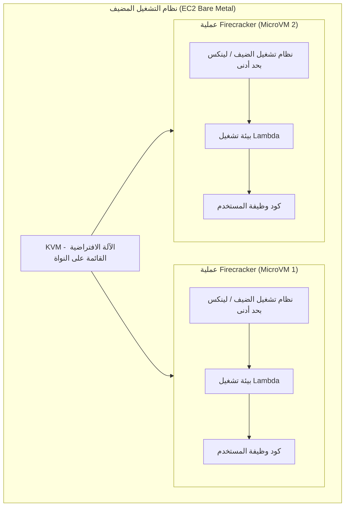
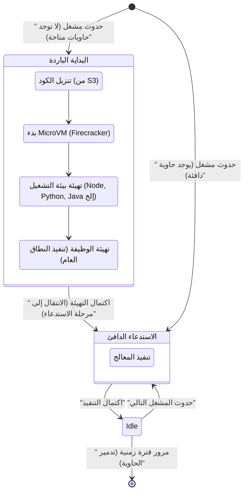
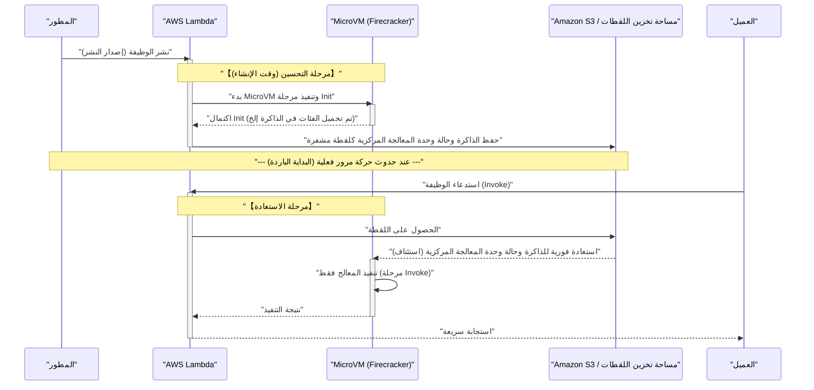

في السنوات الأخيرة، رسخت **البنية المعمارية بدون خوادم** (Serverless Architecture) مكانتها كواحدة من المعايير القياسية في عالم الحوسبة السحابية. ولعل أبرز أمثلتها هي **AWS Lambda**. سحرت الكلمات المعسولة (النور) مثل "لا حاجة لإدارة الخوادم" و "الدفع على قدر الاستخدام" و "التوسع التلقائي" الكثير من الشركات ودعمتها للانتقال بأنظمتها إلى بنية بدون خوادم.

ولكن، هناك دائمًا مقايضات (ظلام) في أي تقنية. يمكن القول إن "الظلام" الأكبر في البنية المعمارية بدون خوادم هو موضوع مقالتنا: مشكلة **البداية الباردة** (Cold Start).

في هذه المقالة، سنشرح نور وظلام البنية المعمارية بدون خوادم، مع التعمق بشكل شامل من مستوى البنية المعمارية في ما يحدث خلف كواليس AWS Lambda، وآلية مشكلة البداية الباردة التي تزعج المطورين، وأحدث الحلول المتاحة (مثل SnapStart).

---

## 1. "نور" البنية المعمارية بدون خوادم

أولاً، دعونا نلخص المزايا الساحقة (النور) التي تفسر سبب دعم البنية المعمارية بدون خوادم بشكل كبير.

### 1.1. التحرر من إدارة البنية التحتية (NoOps)

في البنى المعمارية التقليدية داخل مقار الشركات أو باستخدام IaaS (مثل Amazon EC2)، كان من الضروري تخصيص موارد هائلة لصيانة وعمليات البنية التحتية (Ops) مثل تطبيق تصحيحات نظام التشغيل، وتحديثات الأمان، ومراقبة حالة الخوادم.

في البنية المعمارية بدون خوادم، يمكن تفريغ كل هذه الإدارة للبنية التحتية إلى موفر السحابة (مثل AWS). يتيح ذلك للمطورين التركيز فقط على "برمجة منطق الأعمال"، وهو العمل الذي يولد أكبر قدر من القيمة.

### 1.2. التوسع التلقائي المطلق

سلاح قوي آخر للبنية بدون خوادم هو **التوسع السلس** استجابةً للزيادة والنقصان في حركة المرور.

على سبيل المثال، لنفترض بدء عرض محدود بوقت على موقع تجارة إلكترونية، وحدوث زيادة فورية في الزيارات تعادل 100 ضعف الأوقات العادية. في البنية المعمارية التقليدية، كان يتطلب الأمر إما توفير خوادم بشكل مفرط مسبقًا لتتناسب مع الذروة، أو ضبط مجموعات التوسع التلقائي المعقدة.

في حالة AWS Lambda، في كل مرة يرد فيها طلب، تبدأ بيئة تنفيذ مستقلة (حاوية) على الفور لمعالجة الطلب. عندما تكون الزيارات صفرًا، تنخفض الموارد إلى الصفر تمامًا، وعندما تتزايد الزيارات بسرعة، تزداد عمليات التنفيذ المتوازية تلقائيًا للتعامل معها.

### 1.3. تحسين التكلفة من خلال الدفع على قدر الاستخدام

في البنية بدون خوادم، يتم الدفع فقط مقابل وقت التنفيذ بالمللي ثانية (وحدة 1 مللي ثانية في حالة Lambda) وحجم الذاكرة المخصصة. لا توجد أي تكلفة أثناء حالة الخمول (عندما لا يصل أحد إلى النظام).

يؤدي هذا إلى خفض جذري في التكلفة للأنظمة ذات تقلبات حركة المرور الشديدة، أو الأنظمة الداخلية التي لا تُستخدم ليلاً.

---

## 2. "ظلام" البنية بدون خوادم، وحقيقته

كلما كان النور ساطعًا، زادت كثافة الظلام. البنية بدون خوادم لا تعني "عدم وجود خوادم"، بل تعني فقط "تفويض إدارة الخوادم إلى موفر السحابة". في الخلفية، تعمل الخوادم المادية بالتأكيد، وتعمل أنظمة التشغيل، ويتم تنفيذ الأكواد البرمجية الخاصة بنا عليها.

إذا لم نفهم "آلية العمل في الخلفية" هذه، فسنواجه تدهورًا غير متوقع في الأداء وقيودًا معمارية.

### 2.1. عدم إمكانية الاحتفاظ بالحالة (Stateless)

من حيث المبدأ، يُطلب من وظائف Lambda أن تكون **عديمة الحالة** (Stateless). نظرًا لأن بيئة التنفيذ يتم التخلص منها (أو إعادة استخدامها) لكل طلب، فلا يوجد ضمان بأن نظام الملفات المحلي أو البيانات الموجودة في الذاكرة ستنتقل إلى الطلب التالي.

للاحتفاظ بالحالة، من الضروري دمجها مع مخزن بيانات دائم خارجي أو قاعدة بيانات في الذاكرة مثل Amazon DynamoDB، أو ElastiCache، أو S3.

### 2.2. قيود وقت التنفيذ

لدى AWS Lambda حد أقصى لوقت التنفيذ يبلغ **15 دقيقة** (900 ثانية) لكل عملية. لا يمكن نقل مهام المعالجة المجمعة التي تستغرق ساعات إلى Lambda كما هي. بدلاً من ذلك، يجب تقسيم هذه المهام وجعلها غير متزامنة باستخدام خدمات مثل AWS Step Functions، أو AWS Batch، أو Amazon ECS.

### 2.3. مشكلة البداية الباردة

وأكبر ظلام هو **البداية الباردة** (Cold Start). على الرغم من الاستفادة من التوسع التلقائي، تظهر "نفقات التهيئة" عند بدء بيئة تنفيذ جديدة كأوقات استجابة متأخرة.

---

## 3. ما وراء AWS Lambda: آلية Firecracker microVM

لفهم البداية الباردة، يجب أن نعرف التكنولوجيا الأساسية لكيفية تنفيذ AWS Lambda للكود في الخلفية.

في البداية، استخدمت AWS Lambda حاويات Linux (تقنية قريبة من LXC/[Docker](https://kenji.blog/ar/p/docker-container-namespace-[cgroups](https://kenji.blog/ar/p/docker-container-namespace-cgroups-layers/)-layers/)) للعزل. ومع ذلك، من أجل تعزيز التوازن بين الأمان، وسرعة بدء التشغيل، وكثافة التجميع إلى أقصى حد، طورت AWS تقنية المحاكاة الافتراضية مفتوحة المصدر الخاصة بها تسمى **Firecracker**.

### 3.1. ما هو Firecracker؟

Firecracker هو مراقب أجهزة افتراضية (VMM) يستخدم KVM (الآلة الافتراضية القائمة على النواة) لتشغيل "أجهزة افتراضية صغيرة" (MicroVM) خفيفة الوزن في أجزاء من الألف من الثانية. مكتوب بلغة Rust، ومن خلال إزالة نماذج الأجهزة غير الضرورية إلى أقصى حد مقارنة بالأجهزة الافتراضية التقليدية (مثل QEMU)، فإنه يحقق تشغيلًا سريعًا للغاية مع عبء منخفض على الذاكرة.



في البنية التحتية متعددة المستأجرين لـ AWS، لتشغيل أكواد العملاء المختلفين بأمان على نفس الخادم المادي، يوفر Firecracker حدودًا قوية للمحاكاة الافتراضية على مستوى الأجهزة. هذا هو أساس سبب كون Lambda آمنة وقابلة للتطوير.

---

## 4. تشريح البداية الباردة

عند استدعاء وظيفة Lambda، في حال عدم وجود MicroVM قيد الانتظار مُشغّل مسبقًا (حاوية دافئة)، يجب على AWS توفير MicroVM جديد. التأخير الناتج عن عملية التهيئة بأكملها هذه يُعرف باسم **البداية الباردة**.

### 4.1. تفصيل دورة الحياة وزمن الاستجابة

يمكن تمثيل دورة حياة Lambda بمخطط حالة Mermaid التالي.



ينقسم الوقت المستغرق في البداية الباردة بشكل أساسي إلى **التهيئة من جانب AWS** (عبء المنصة) و **التهيئة من جانب المستخدم** (عبء الكود).

1. **تنزيل الكود وفك ضغطه**: يتم تنزيل حزمة النشر من S3 واستخراجها في البيئة. يستغرق الأمر وقتًا يتناسب مع حجم الحزمة (كمية المكتبات التابعة).
2. **بدء MicroVM**: يبدأ Firecracker. هذا الجزء سريع جدًا (بالمللي ثانية) بفضل تحسينات AWS.
3. **تهيئة بيئة التشغيل**: تبدأ عمليات مثل Node.js، و Python، و Java، وما إلى ذلك. تستهلك اللغات التي تستخدم تجميع في الوقت المناسب (JIT) مثل Java و C# وقتًا طويلاً هنا.
4. **تهيئة الوظيفة (مرحلة Init)**: يتم تقييم النطاق العام للكود (خارج وظيفة المعالج). إذا قمت بإنشاء تجمع اتصالات لقاعدة البيانات هنا، أو هيأت حزمة SDK ثقيلة، فسيستغرق وقت التهيئة فترة أطول.

### 4.2. البداية الباردة من منظور الاحتمالات

باستخدام نظرية الطوابير (مثل نموذج M/M/c)، يمكن وضع نموذج رياضي لاحتمالية حدوث بداية باردة.
بافتراض أن معدل وصول الطلبات هو $\lambda$، ووقت بقاء الحاوية الدافئة هو $T_w$، ووقت المعالجة هو $\mu$، فعندما تبلغ حركة المرور ذروتها، سيزداد عدد العمليات المتوازية المطلوبة (عدد الحاويات) بشكل كبير، مما يؤدي إلى زيادة احتمالية البداية الباردة.

في الحالة المستقرة، يمكن تقريب احتمالية إعادة استخدام الحاوية الدافئة $P_{warm}$ على النحو التالي.

$ P_{warm} \approx 1 - e^{-\lambda \cdot T_w} $

بعبارة أخرى، كلما ارتفع معدل وصول الطلبات $\lambda$، أو زاد وقت بقاء الحاوية $T_w$، قل احتمال مواجهة بداية باردة. وعلى العكس من ذلك، فإن واجهات برمجة التطبيقات التي يتم الوصول إليها من حين لآخر ستعاني من بدايات باردة باحتمالية عالية.

---

## 5. استراتيجيات التحسين للقضاء على البداية الباردة

البداية الباردة هي مصير البنية بدون خوادم، ولكن يمكن تقليل تأثيرها إلى الحد الأدنى من خلال تصميم البنية المعمارية وأساليب التنفيذ.

### 5.1. اختيار لغة البرمجة

تختلف سرعة البداية الباردة بشكل جذري حسب اللغة.

- **المجموعة الأسرع**: لغات التجميع المسبق (AOT) مثل Go، و Rust، و C++، ولغات البرمجة النصية خفيفة الوزن (Python، و Node.js). تميل البدايات الباردة هنا إلى أن تستغرق مئات المللي ثانية أو أقل.
- **المجموعة البطيئة**: Java، و C# (.NET). نظرًا لتشغيل JVM أو CLR، وعبء تجميع JIT، يمكن أن تحدث بدايات باردة تستغرق من عدة ثوانٍ إلى أكثر من عشر ثوانٍ.

يجذب النهج لتقليل سرعة بدء تشغيل Node.js الانتباه بشكل أكبر باستخدام بيئة تشغيل JavaScript خفيفة الوزن تجريبية مقدمة من AWS مثل **LLRT (Low Latency Runtime)**.

### 5.2. تخفيف حزمة النشر

تقوم Lambda بتنزيل الكود من S3 عند بدء التشغيل. لذلك، يُعد الحفاظ على حجم الحزمة صغيرًا تحسينًا مباشرًا.
من المهم للغاية عدم تضمين التبعيات غير الضرورية (مثل DevDependencies)، واستخدام حزم (Bundlers) مثل Webpack / esbuild لتصغير (Minify) و إزالة الأكواد غير المستخدمة (Tree-shaking).

### 5.3. تحسين عملية التهيئة والتقييم المؤجل (Lazy Initialization)

يتم تنفيذ المعالجة في النطاق العام أثناء مرحلة Init الخاصة بوظيفة Lambda. تحسين المعالجة هنا هو مفتاح تقليل أوقات البداية الباردة.

على سبيل المثال، عند استخدام AWS SDK، قم باستيراد الوحدات النمطية الضرورية فقط.

```javascript
// ❌ مثال سيئ: تحميل SDK بأكمله يجعل التهيئة بطيئة
const AWS = require('aws-sdk');
const dynamo = new AWS.DynamoDB.DocumentClient();

// ✅ مثال جيد: تحميل العملاء الضروريين فقط (استخدام الإصدار 3 من SDK)
const { DynamoDBClient } = require("@aws-sdk/client-dynamodb");
const { DynamoDBDocumentClient } = require("@aws-sdk/lib-dynamodb");

const client = new DynamoDBClient({});
const dynamo = DynamoDBDocumentClient.from(client);
```

بالإضافة إلى ذلك، فإن تقنية تأجيل تقييم (Lazy Initialization) الموارد التي لا تكون ضرورية بالضرورة في كل طلب (مثل اتصالات قاعدة البيانات المستخدمة فقط في مسارات معالجة محددة) داخل معالج الوظيفة فعالة أيضًا.

### 5.4. التزامن المزود (Provisioned Concurrency)

بالنسبة لمتطلبات المؤسسات التي ترغب حقًا في التخلص من البداية الباردة بالكامل، تقدم AWS حلاً يسمى **التزامن المزود** (Provisioned Concurrency).

هذه ميزة تحتفظ بعدد محدد مسبقًا من بيئات تنفيذ Lambda في حالة دافئة جاهزة ومُهيأة للعمل. يتيح ذلك التخلص تمامًا من البداية الباردة وتحقيق زمن استجابة منخفض باستمرار (بضع مللي ثانية).

ومع ذلك، نظرًا لأنه يتم تكبد تكاليف أثناء الانتظار، فهناك معضلة (مقايضة) حيث يتم فقدان جزء من فائدة الدفع على قدر الاستخدام الخاصة بالبنية بدون خوادم.

---

## 6. مغير قواعد اللعبة: AWS Lambda SnapStart

جاء **AWS Lambda SnapStart** كمنقذ للغات ذات بدء التشغيل البطيء مثل Java. هذه تقنية رائدة تأخذ لقطة لحالة الآلة الافتراضية وتستعيدها أثناء البداية الباردة.

تُستخدم ميزة **CRaU** (نقطة التحقق/الاستعادة في مساحة المستخدم) وميزة لقطة MicroVM الخاصة بـ Firecracker كتقنيات أساسية.

### 6.1. آلية SnapStart

يوضح مخطط التسلسل التالي كيفية عمل SnapStart.



### 6.2. فوائد SnapStart والنقاط التي يجب مراعاتها

عند تمكين SnapStart، يتم تسريع وقت البداية الباردة لوظائف Java بما يصل إلى **10 أضعاف أو أكثر**. ويرجع ذلك إلى أن بدء تشغيل بيئة التشغيل، وتجميع JIT، وتهيئة أطر العمل الثقيلة مثل Spring Boot يتم تقديمها إلى "وقت النشر".

ومع ذلك، هناك بضع نقاط يجب الانتباه إليها.

1. **مشكلة حالة الأرقام العشوائية**: نظرًا لأن الأجهزة الافتراضية المستعادة تبدأ من نفس لقطة الذاكرة بالضبط، فإن حالة البذور لمولد الأرقام العشوائية شبه القياسي (PRNG) ستكون هي نفسها أيضًا. يجب إعادة تهيئة الأرقام العشوائية المرتبطة بأمان التشفير بأمان باستخدام `/dev/urandom` الخاص بنظام التشغيل وما شابه (تقدم AWS مكتبات للتعامل مع هذا الأمر).
2. **انقطاع اتصال الشبكة**: اتصالات TCP بقواعد البيانات التي تم إنشاؤها في مرحلة التهيئة قد تكون بالفعل قد انتهت مهلتها وتم قطع اتصالها من جانب الخادم في الوقت الذي يتم فيه استعادتها من اللقطة. لذلك، من الضروري تنفيذ منطق (آلية إعادة المحاولة) لاكتشاف أخطاء الاتصال وإعادة الاتصال داخل المعالج.

---

## 7. الخاتمة: هل البنية بدون خوادم هي رصاصة فضية؟

لا شك أن البنية المعمارية بدون خوادم، وخاصة AWS Lambda، قد أحدثت نقلة نوعية في تصميم التطبيقات السحابية الأصلية.

يعمل "النور" المتمثل في تقليل عبء إدارة البنية التحتية، وتحسين التكلفة، والتوسع الفوري على تحسين سرعة الأعمال (المرونة) بشكل كبير من الشركات الناشئة إلى الشركات الكبرى.

ولكن، إذا قمت بالتصميم متجاهلاً "الظلام" مثل البدايات الباردة، والقيود عديمة الحالة، وتعقيد شبكات VPC، فستواجه صعوبات غير متوقعة في بيئة الإنتاج.

الشيء المهم هو ألا ننسى المبدأ الأساسي للهندسة وهو **"لا توجد رصاصة فضية"**.

- بالنسبة إلى **الأنظمة التي تتطلب أوقات استجابة منخفضة للغاية** (مثل: المنطق الأساسي لألعاب تنافسية عبر الإنترنت، والتداول عالي التردد بالمللي ثانية)، قد تكون الحاويات التي تعمل دائمًا (Amazon ECS/EKS) أكثر ملاءمة من البنية بدون خوادم.
- بالنسبة إلى **المعالجة غير المتزامنة التي تكثر فيها الاندفاعات في حركة المرور** أو **واجهات برمجة تطبيقات الويب التي تريد تقليل تكاليف تشغيلها إلى الحد الأدنى**، ستكون AWS Lambda هي الخيار الأفضل.

فهم خصائص البنية المعمارية بعمق واختيار التكنولوجيا المناسبة في المكان المناسب. هذه هي الطريقة الوحيدة للتحكم في "الظلام" مع تحقيق أقصى استفادة من "نور" البنية بدون خوادم.

---
*كُتبت هذه المقالة لاستكشاف البنية الداخلية للبنية المعمارية بدون خوادم ومشاركة أساليب التحسين العملية. لا يوجد نهاية لعالم تحسين الأداء. لنستمتع بالقياس والتحسين المستمر!*
