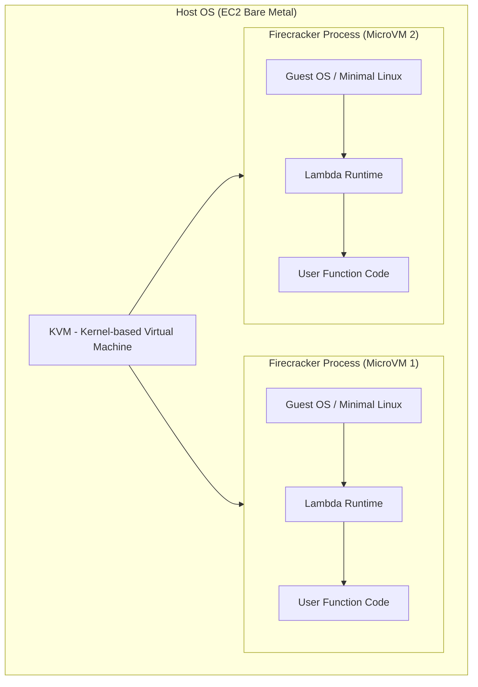
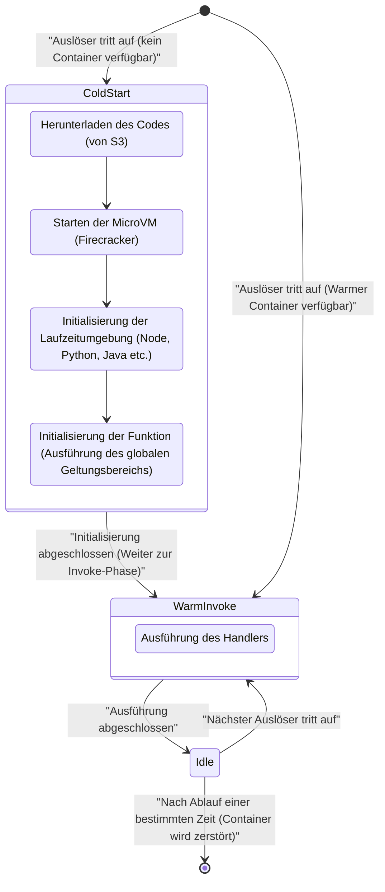
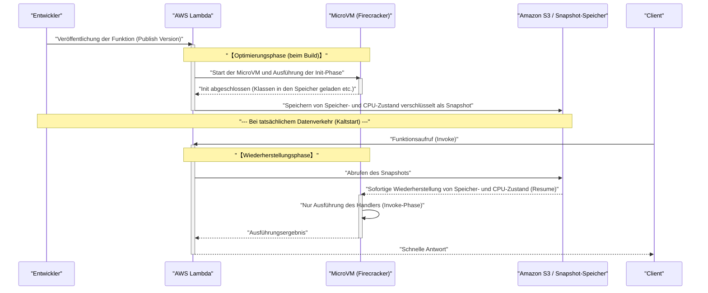

In den letzten Jahren hat sich die **Serverless-Architektur** (Serverless Architecture) als einer der De-facto-Standards in der Welt des Cloud-Computings fest etabliert. Ihr prominentester Vertreter ist **AWS Lambda** . Verführt von süßen Versprechen (dem Licht) wie „Keine Serververwaltung erforderlich“, „Pay-as-you-go-Abrechnung“ und „Automatische Skalierung“, haben viele Unternehmen ihre Systeme auf Serverless umgestellt.

Wie bei jeder Technologie gibt es jedoch immer einen Kompromiss (den Schatten). Der größte „Schatten“ der Serverless-Architektur ist das **Kaltstart** -Problem (Cold Start), welches das Hauptthema dieses Artikels ist.

In diesem Artikel werden wir das Licht und den Schatten der Serverless-Architektur erläutern und tiefgehend sowie umfassend auf Architekturebene untersuchen, was genau hinter den Kulissen von AWS Lambda passiert, wie der Mechanismus des Kaltstartproblems aussieht, das Entwickler plagt, und welche neuesten Gegenmaßnahmen (wie SnapStart) existieren.

---

## 1. Das „Licht“ der Serverless-Architektur

Lassen Sie uns zunächst klären, warum die Serverless-Architektur so beliebt ist, und ihre überwältigenden Vorteile (das Licht) zusammenfassen.

### 1.1. Befreiung von der Infrastrukturverwaltung (NoOps)

In traditionellen On-Premises- oder IaaS-basierten (wie Amazon EC2) Architekturen mussten enorme Ressourcen für den Betrieb und die Wartung (Ops) der Infrastruktur aufgewendet werden, einschließlich Betriebssystem-Patching, Sicherheitsupdates und Serverüberwachung.

Mit der Serverless-Architektur kann all dieses Infrastrukturmanagement an den Cloud-Anbieter (wie AWS) ausgelagert werden. Entwickler können sich ausschließlich auf das Schreiben der Geschäftslogik konzentrieren, was die eigentlich wertschöpfendste Arbeit ist.

### 1.2. Ultimative automatische Skalierung

Eine weitere mächtige Waffe von Serverless ist die **nahtlose Skalierung** in Reaktion auf Verkehrsschwankungen.

Nehmen wir beispielsweise an, eine E-Commerce-Website startet einen zeitlich begrenzten Verkauf und erlebt einen plötzlichen Traffic-Anstieg auf das 100-fache des Normalwerts. In traditionellen Architekturen hätte dies eine Vorabüberdimensionierung der Server erfordert, um Spitzenlasten zu bewältigen, oder eine komplexe Abstimmung der Auto Scaling-Gruppen.

Bei AWS Lambda wird für jede eingehende Anfrage sofort eine unabhängige Ausführungsumgebung ([Container](https://kenji.blog/de/p/docker-container-namespace-cgroups-layers/)) hochgefahren, um die Anfrage zu bearbeiten. Wenn der Datenverkehr null ist, werden die Ressourcen vollständig auf null reduziert, und bei Spitzenlast wird die Anzahl der parallelen Ausführungen automatisch erhöht, um die Last zu bewältigen.

### 1.3. Kostenoptimierung durch Pay-as-you-go

Bei Serverless wird Ihnen nur die Ausführungszeit in Millisekunden (bei Lambda in Schritten von 1 ms) und die zugewiesene Speichermenge in Rechnung gestellt. Im Leerlauf (wenn niemand zugreift) fallen keinerlei Kosten an.

Dies führt zu dramatischen Kosteneinsparungen für Systeme mit stark schwankendem Datenverkehr oder interne Systeme, die nachts nicht genutzt werden.

---

## 2. Der „Schatten“ von Serverless und seine wahre Natur

Je heller das Licht, desto dunkler der Schatten. Serverless bedeutet nicht, dass es „keine Server“ gibt. Es bedeutet lediglich, dass wir „die Serververwaltung dem Cloud-Anbieter überlassen“. Im Hintergrund laufen definitiv physische Server, Betriebssysteme arbeiten, und unser Code wird auf ihnen ausgeführt.

Wenn Sie diesen „Hintergrundmechanismus“ nicht verstehen, werden Sie mit unerwarteten Leistungseinbußen und architektonischen Einschränkungen konfrontiert.

### 2.1. Keine [Zustand](https://kenji.blog/de/p/state-management-history-redux-context-recoil-zustand/)sspeicherung (Zustandslosigkeit)

Lambda-Funktionen müssen grundsätzlich **zustandslos** (stateless) sein. Da die Ausführungsumgebung für jede Anfrage weggeworfen (oder wiederverwendet) wird, gibt es keine Garantie dafür, dass das lokale Dateisystem oder In-Memory-Daten an die nächste Anfrage weitergegeben werden.

Um den Zustand beizubehalten, müssen Sie externe persistente Speicher oder In-Memory-Datenbanken wie Amazon DynamoDB, ElastiCache oder S3 integrieren.

### 2.2. Begrenzung der Ausführungszeit

AWS Lambda hat ein striktes Timeout-Limit von maximal **15 Minuten** (900 Sekunden) pro Ausführung. Sie können nicht einfach langlaufende Batch-Prozesse, die Stunden dauern, zu Lambda migrieren. Solche Prozesse müssen mithilfe von Diensten wie AWS Step Functions, AWS Batch oder Amazon ECS in kleinere, asynchrone Aufgaben aufgeteilt werden.

### 2.3. Das Kaltstartproblem

Und der größte Schatten ist der **Kaltstart** (Cold Start). Während Sie von der automatischen Skalierung profitieren, äußert sich der „Initialisierungs-Overhead“ beim Hochfahren einer neuen Ausführungsumgebung als Latenzverzögerung.

---

## 3. Hinter den Kulissen von AWS Lambda: Wie Firecracker MicroVMs funktionieren

Um Kaltstarts zu verstehen, müssen wir die zugrunde liegende Technologie kennen und wissen, wie AWS Lambda den Code hinter den Kulissen ausführt.

Ursprünglich nutzte AWS Lambda Linux-Container (ähnlich wie LXC/[Docker](https://kenji.blog/de/p/docker-container-namespace-[cgroups](https://kenji.blog/de/p/docker-container-namespace-cgroups-layers/)-layers/)) zur Isolierung. Um jedoch die Balance zwischen Sicherheit, Startgeschwindigkeit und Packungsdichte zu maximieren, entwickelte AWS seine eigene Open-Source-Virtualisierungstechnologie namens **Firecracker** .

### 3.1. Was ist Firecracker?

Firecracker ist ein Virtual Machine Monitor (VMM), der KVM (Kernel-based Virtual Machine) verwendet, um leichtgewichtige „MicroVMs“ im Millisekundenbereich zu starten. Es ist in der Programmiersprache Rust geschrieben und erreicht im Vergleich zu herkömmlichen virtuellen Maschinen (wie QEMU) extrem schnelle Startzeiten und einen geringen Speicher-Overhead, indem unnötige Gerätemodelle auf das absolute Minimum reduziert werden.



In der mandantenfähigen (Multi-Tenant) AWS-Infrastruktur bietet Firecracker eine robuste, hardwarebasierte Virtualisierungsgrenze, um den Code verschiedener Kunden sicher auf demselben physischen Server auszuführen. Dies ist der Kern der Tatsache, dass Lambda sowohl sicher als auch skalierbar ist.

---

## 4. Die Anatomie eines Kaltstarts

Wenn eine Lambda-Funktion aufgerufen wird und es keine bereits laufende, wartende MicroVM (warmen [Container](https://kenji.blog/de/p/docker-container-namespace-cgroups-layers/)) gibt, muss die AWS-Seite eine neue MicroVM bereitstellen. Die durch diesen Initialisierungsprozess verursachte Verzögerung nennt man einen **Kaltstart** .

### 4.1. Lebenszyklus und Aufschlüsselung der Latenz

Der Lebenszyklus einer Lambda-Funktion kann wie im folgenden Mermaid-[Zustand](https://kenji.blog/de/p/state-management-history-redux-context-recoil-zustand/)sdiagramm dargestellt werden.



Die Zeit, die für einen Kaltstart benötigt wird, kann grob in den **AWS-seitigen Initialisierungsaufwand** (Plattform-Overhead) und den **benutzerseitigen Initialisierungsaufwand** (Code-Overhead) unterteilt werden.

1. **Herunterladen und Entpacken des Codes**: Das Bereitstellungspaket wird von S3 heruntergeladen und in die Umgebung extrahiert. Die benötigte Zeit ist proportional zur Paketgröße (Menge der Abhängigkeiten).
2. **Starten der MicroVM**: Firecracker wird gestartet. Dies ist dank Optimierungen durch AWS extrem schnell (im Millisekundenbereich).
3. **Initialisierung der Laufzeitumgebung**: Der Node.js-, Python- oder Java-Prozess wird gestartet. Insbesondere Sprachen, die JIT-Kompilierung (Just-In-Time) verwenden, wie Java und C#, verbrauchen hier eine beträchtliche Menge an Zeit.
4. **Initialisierung der Funktion (Init-Phase)**: Der globale Geltungsbereich des Codes (außerhalb der Handler-Funktion) wird ausgewertet. Wenn Sie hier einen Datenbankverbindungspool erstellen oder schwere SDKs initialisieren, verlängert sich die Initialisierungszeit.

### 4.2. Kaltstarts aus Sicht der Wahrscheinlichkeitstheorie

Mithilfe der Warteschlangentheorie (z. B. dem M/M/c-Modell) kann die Wahrscheinlichkeit eines Kaltstarts mathematisch modelliert werden.
Angenommen, die Ankunftsrate der Anfragen ist $\lambda$, die Überlebenszeit eines warmen [Container](https://kenji.blog/de/p/docker-container-namespace-cgroups-layers/)s ist $T_w$ und die Verarbeitungszeit ist $\mu$. Wenn der Datenverkehr ansteigt, nimmt die erforderliche Parallelität (Anzahl der Container) schnell zu, und die Kaltstartwahrscheinlichkeit steigt.

Im stationären [Zustand](https://kenji.blog/de/p/state-management-history-redux-context-recoil-zustand/) kann die Wahrscheinlichkeit $P_{warm}$, dass ein warmer Container wiederverwendet wird, wie folgt approximiert werden:

$ P_{warm} \approx 1 - e^{-\lambda \cdot T_w} $

Das bedeutet, je höher die Anfragefrequenz $\lambda$ oder je länger die Überlebenszeit des Containers $T_w$ ist, desto geringer ist die Wahrscheinlichkeit, auf einen Kaltstart zu stoßen. Umgekehrt werden APIs, auf die nur selten zugegriffen wird, mit hoher Wahrscheinlichkeit einen Kaltstart erleiden.

---

## 5. Optimierungsstrategien zur Überwindung von Kaltstarts

Kaltstarts sind das Schicksal von Serverless, aber ihre Auswirkungen können durch architektonisches Design und clevere Implementierung minimiert werden.

### 5.1. Wahl der Programmiersprache

Die Geschwindigkeit von Kaltstarts variiert drastisch je nach Sprache.

- **Die schnellste Gruppe**: AOT-kompilierte (Ahead-Of-Time) Sprachen wie Go, Rust und C++ sowie leichtgewichtige Skriptsprachen (Python, Node.js). Diese halten Kaltstarts in der Regel unter ein paar hundert Millisekunden.
- **Die langsame Gruppe**: Java, C# (.NET). Durch den Start der JVM oder CLR und den Overhead der JIT-Kompilierung können Kaltstarts von einigen Sekunden bis zu mehr als zehn Sekunden auftreten.

Auch der Ansatz, experimentelle, leichtgewichtige JavaScript-Laufzeitumgebungen von AWS wie **LLRT (Low Latency Runtime)** zu nutzen, um die Startgeschwindigkeit von Node.js weiter zu reduzieren, gewinnt an Aufmerksamkeit.

### 5.2. Reduzierung der Bereitstellungspaketgröße

Lambda lädt beim Start Code von S3 herunter. Daher ist das Kleinhalten der Paketgröße eine direkte Optimierung.
Es ist äußerst wichtig, keine unnötigen Abhängigkeiten (wie DevDependencies) einzuschließen und Bundler wie Webpack oder esbuild zu verwenden, um den Code zu minimieren (Minify) und ungenutzten Code zu entfernen (Tree-shaking).

### 5.3. Optimierung der Initialisierungsverarbeitung und verzögerte Auswertung (Lazy Initialization)

Die Verarbeitung im globalen Geltungsbereich wird während der Init-Phase der Lambda-Funktion ausgeführt. Die Optimierung der Verarbeitung hier ist der Schlüssel zur Reduzierung von Kaltstarts.

Wenn Sie beispielsweise das AWS SDK verwenden, importieren Sie nur die benötigten Module.

```javascript
// ❌ Schlechtes Beispiel: Das gesamte SDK zu laden, macht die Initialisierung langsam
const AWS = require('aws-sdk');
const dynamo = new AWS.DynamoDB.DocumentClient();

// ✅ Gutes Beispiel: Nur die benötigten Clients laden (Verwendung des v3 SDK)
const { DynamoDBClient } = require("@aws-sdk/client-dynamodb");
const { DynamoDBDocumentClient } = require("@aws-sdk/lib-dynamodb");

const client = new DynamoDBClient({});
const dynamo = DynamoDBDocumentClient.from(client);
```

Zusätzlich ist es auch effektiv, eine verzögerte Auswertung (Lazy Initialization) innerhalb des Funktions-Handlers für Ressourcen zu verwenden, die nicht unbedingt für jede Anfrage benötigt werden (wie Datenbankverbindungen, die nur in bestimmten Ausführungspfaden verwendet werden).

### 5.4. Bereitgestellte Nebenläufigkeit (Provisioned Concurrency)

Für Unternehmensanforderungen, bei denen Kaltstarts unbedingt eliminiert werden müssen, bietet AWS eine Lösung namens **Provisioned Concurrency** (Bereitgestellte Nebenläufigkeit) an.

Dabei handelt es sich um eine Funktion, die eine vorgegebene Anzahl von Lambda-Ausführungsumgebungen vorinitialisiert und im warmen [Zustand](https://kenji.blog/de/p/state-management-history-redux-context-recoil-zustand/) bereithält. Dadurch werden Kaltstarts vollständig beseitigt und eine durchgehend niedrige Latenz (im Millisekundenbereich) gewährleistet.

Allerdings gibt es ein Dilemma (einen Kompromiss): Da auch im Leerlauf Kosten anfallen, geht der Vorteil der „Pay-as-you-go“-Abrechnung von Serverless teilweise verloren.

---

## 6. Ein Game-Changer: AWS Lambda SnapStart

Als Retter für langsam startende Sprachen wie Java wurde **AWS Lambda SnapStart** eingeführt. Dies ist eine bahnbrechende Technologie, die einen Snapshot (Schnappschuss) des Zustands der virtuellen Maschine erstellt und diesen bei einem Kaltstart wiederherstellt.

Als Hintergrundtechnologien werden **CRaU** (Checkpoint/Restore in Userspace) und die MicroVM-Snapshot-Funktion von Firecracker verwendet.

### 6.1. Der SnapStart-Mechanismus

Das folgende Sequenzdiagramm zeigt, wie SnapStart funktioniert.



### 6.2. Vorteile und Hinweise zu SnapStart

Wenn Sie SnapStart aktivieren, wird die Kaltstartzeit von Java-Funktionen **bis zu 10-mal oder mehr** beschleunigt. Dies liegt daran, dass der Start der Laufzeitumgebung, die JIT-Kompilierung und die Initialisierung schwerer Frameworks wie Spring Boot auf die „Bereitstellungszeit“ vorgezogen werden.

Es gibt jedoch einige Dinge zu beachten:

1. **Problem der Zufallszahlengenerierung**: Da die wiederhergestellte VM mit exakt demselben Speichersnapshot startet, ist auch der Seed-[Zustand](https://kenji.blog/de/p/state-management-history-redux-context-recoil-zustand/) des Standard-Pseudozufallszahlengenerators (PRNG) identisch. Für kryptografische Sicherheit relevante Zufallszahlen müssen sicher neu initialisiert werden, z. B. mithilfe von `/dev/urandom` des Betriebssystems (AWS bietet hierfür entsprechende Bibliotheken an).
2. **Trennung der Netzwerkverbindungen**: TCP-Verbindungen zu Datenbanken, die in der Initialisierungsphase aufgebaut wurden, könnten aufgrund von serverseitigen Timeouts bereits getrennt sein, wenn sie aus dem Snapshot wiederhergestellt werden. Daher müssen Sie innerhalb des Handlers eine Logik (Wiederholungsmechanismus) implementieren, um Verbindungsfehler zu erkennen und die Verbindung neu aufzubauen.

---

## 7. Fazit: Ist Serverless ein Allheilmittel?

Die Serverless-Architektur, insbesondere AWS Lambda, hat zweifellos einen Paradigmenwechsel im Design cloudnativer Anwendungen herbeigeführt.

Das „Licht“ der verringerten Infrastrukturverwaltung, der Kostenoptimierung und der sofortigen Skalierung verbessert die Agilität von Unternehmen, vom Startup bis zum Großkonzern, dramatisch.

Wenn Sie jedoch Architekturen entwerfen und dabei die „Schatten“ ignorieren, wie Kaltstarts, die Einschränkung der [Zustand](https://kenji.blog/de/p/state-management-history-redux-context-recoil-zustand/)slosigkeit und die Komplexität des VPC-Networkings, werden Sie in der Produktionsumgebung unerwartete Schmerzen erleiden.

Das Wichtigste ist, das grundlegende technische Prinzip nicht zu vergessen: **Es gibt keine „Silver Bullet“ (Allheilmittel)**.

- Für **Systeme mit extrem strengen Latenzanforderungen** (z. B. Kernlogik von Online-Multiplayer-Spielen, hochfrequenter Handel im Millisekundenbereich) sind ständig laufende [Container](https://kenji.blog/de/p/docker-container-namespace-cgroups-layers/) (Amazon ECS/EKS) möglicherweise besser geeignet als Serverless.
- Für **asynchrone Prozesse mit häufigen Traffic-Bursts** oder **Web-APIs, bei denen die Betriebskosten minimiert werden sollen**, ist AWS Lambda die beste Wahl.

Es geht darum, die Eigenschaften der Architektur tiefgehend zu verstehen und die Technologie am richtigen Ort einzusetzen. Das ist der einzige Weg, das „Licht“ von Serverless voll auszuschöpfen und gleichzeitig seine „Schatten“ zu kontrollieren.

---
*Dieser Artikel wurde verfasst, um die interne Struktur der Serverless-Architektur zu erforschen und praktische Optimierungstechniken zu teilen. Die Welt des Performance-Tunings ist niemals zu Ende. Genießen wir die kontinuierliche Messung und Verbesserung!*
