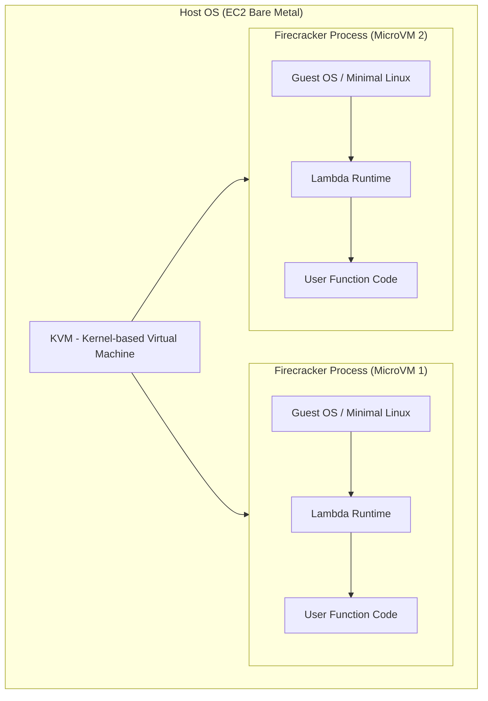
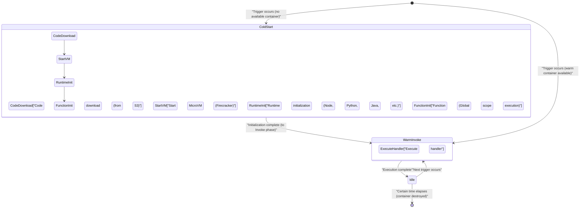
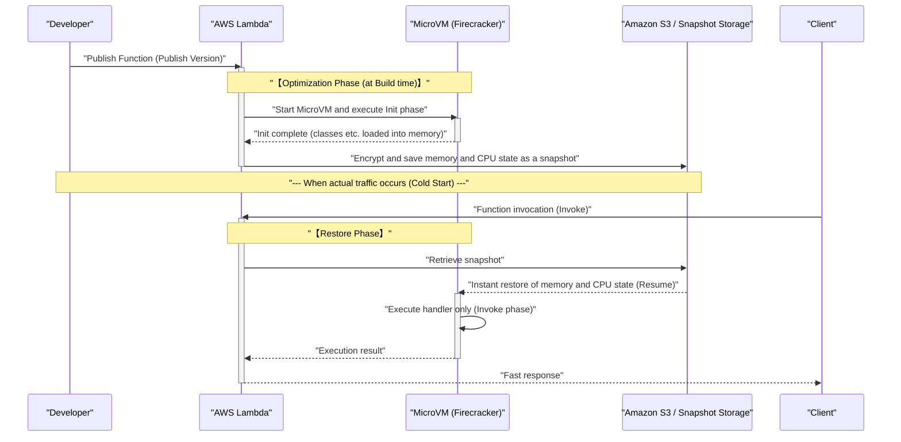

In recent years, in the world of cloud computing, **serverless architecture** (Serverless Architecture) has firmly established its position as one of the de facto standards. The most representative example of this is **AWS Lambda**. Enticed by sweet promises (the light) such as "no server management required," "pay-as-you-go pricing for what you use," and "automatic scaling," many companies have migrated their systems to serverless.

However, every technology always has trade-offs (the shadow). The biggest "shadow" of serverless architecture is the **cold start** problem, which is the main subject of this article.

In this article, while explaining the light and shadow of serverless architecture, we will deeply and comprehensively dig into what is happening behind the scenes of AWS Lambda, the mechanics of the cold start problem that troubles developers, and the latest countermeasures (such as SnapStart) from an architectural level.

---

## 1. The "Light" of Serverless Architecture

First, let's summarize the overwhelming advantages (the light) of why serverless architecture is so widely supported.

### 1.1. Freedom from Infrastructure Management (NoOps)

In traditional on-premises or architectures utilizing IaaS (such as Amazon EC2), it was necessary to dedicate enormous resources to the operation and maintenance (Ops) of the infrastructure, such as OS patching, security updates, and server health monitoring.

With serverless architecture, all of this infrastructure management can be offloaded to the cloud provider (such as AWS). Developers can focus solely on "coding business logic," the task that inherently creates the most value.

### 1.2. Ultimate Auto-scaling

Another powerful weapon of serverless is **seamless scaling** in response to traffic fluctuations.

For example, suppose a flash sale starts on an e-commerce site, and access instantaneously spikes to 100 times the normal level. In a traditional architecture, you would have to either over-provision servers in advance to match the peak or tune complex auto-scaling groups.

With AWS Lambda, every time a request comes in, an independent execution environment (container) instantly starts up and processes the request. When access is zero, resources are completely dropped to zero, and when access suddenly increases, the number of parallel executions is automatically increased to handle it.

### 1.3. Cost Optimization through Pay-As-You-[Go](https://kenji.blog/en/p/programming-languages-history-paradigm-evolution/)

Serverless bills only for the execution time in milliseconds (1ms increments for Lambda) and the amount of memory allocated. When in an idle state (when no one is accessing it), there is absolutely no cost.

As a result, it brings dramatic cost reduction effects in systems with extreme traffic waves or internal systems that are not used at night.

---

## 2. The "Shadow" of Serverless and Its True Identity

The stronger the light, the darker the shadow. Serverless does not mean there are "no servers." It simply means "server management is left to the cloud provider." Behind the scenes, physical servers are definitely running, operating systems are working, and our code is being executed on top of them.

If you do not understand this "behind-the-scenes mechanism," you will face unexpected performance degradation and architectural limitations.

### 2.1. Inability to Hold [State](https://kenji.blog/en/p/iac-infrastructure-as-code-terraform/) (Stateless)

Lambda functions are fundamentally required to be **stateless**. Because the execution environment is discarded (or reused) for each request, there is no guarantee that the local file system or data in memory will be carried over to the next request.

To maintain state, you need to combine it with external persistent storage or in-memory databases such as Amazon DynamoDB, ElastiCache, or S3.

### 2.2. Execution Time Limits

AWS Lambda has a maximum timeout limit of **15 minutes** (900 seconds) per execution. You cannot directly migrate batch processes that take hours to Lambda. Such processes need to be split and made asynchronous utilizing AWS Step Functions, AWS Batch, Amazon ECS, etc.

### 2.3. The Cold Start Problem

And the biggest shadow is the **cold start**. While enjoying the benefits of automatic scaling, the "initialization overhead" when starting a new execution environment appears as a latency delay.

---

## 3. Behind AWS Lambda: How Firecracker MicroVMs Work

To understand cold starts, you need to know the underlying technology of how AWS Lambda executes code behind the scenes.

Initially, AWS Lambda used Linux containers (technology similar to LXC/[Docker](https://kenji.blog/en/p/docker-container-namespace-[cgroups](https://kenji.blog/en/p/docker-container-namespace-cgroups-layers/)-layers/)) for isolation. However, to maximize the balance between security, startup speed, and packing density, AWS independently developed an open-source virtualization technology called **Firecracker**.

### 3.1. What is Firecracker?

Firecracker is a Virtual Machine Monitor (VMM) that utilizes KVM (Kernel-based Virtual Machine) to boot lightweight "MicroVMs" in milliseconds. It is written in the [Rust](https://kenji.blog/en/p/programming-languages-history-paradigm-evolution/) language, and compared to traditional virtual machines (like QEMU), it achieves extremely fast startup and low memory overhead by aggressively stripping away unnecessary device models.



In the AWS infrastructure, which is a multi-tenant environment, Firecracker provides a robust hardware-level virtualization boundary to securely execute different customers' code on the same physical server. This is the foundation of why Lambda is secure and scalable.

---

## 4. Anatomy of a Cold Start

When a Lambda function is invoked, if there is no pre-warmed waiting MicroVM (warm container) available, AWS must provision a new MicroVM. The delay caused by this series of initialization processes is the **cold start**.

### 4.1. Lifecycle and Latency Breakdown

The lifecycle of a Lambda can be represented by the following Mermaid state transition diagram.



The time it takes for a cold start can be broadly divided into **AWS-side initialization** (platform overhead) and **user-side initialization** (code overhead).

1. **Code download and extraction**: The deployment package is downloaded from S3 and extracted into the environment. The time taken is proportional to the package size (amount of dependency libraries).
2. **Starting the MicroVM**: Firecracker boots up. This is extremely fast (in milliseconds) due to AWS optimizations.
3. **Runtime initialization**: Processes for Node.js, Python, [Java](https://kenji.blog/en/p/programming-languages-history-paradigm-evolution/), etc. start. In particular, languages that use JIT (Just-In-Time) compilation, such as Java or C#, consume a significant amount of time here.
4. **Function initialization (Init Phase)**: The global scope of the code (outside the handler function) is evaluated. If you create a DB connection pool or initialize a heavy SDK here, the initialization time will be prolonged.

### 4.2. Cold Starts from a Probability Perspective

Using queuing theory (like the M/M/c model), you can mathematically model the probability of a cold start occurring.
If the request arrival rate is $\lambda$, the lifespan of a warm container is $T_w$, and the processing time is $\mu$, when traffic spikes, the required concurrency (number of containers) rapidly increases, raising the cold start probability.

In a steady state, the probability $P_{warm}$ that a warm container is reused can sometimes be approximated as follows.

$ P_{warm} \approx 1 - e^{-\lambda \cdot T_w} $

In other words, the higher the request frequency $\lambda$ or the longer the container lifespan $T_w$, the lower the probability of encountering a cold start. Conversely, for an API that is rarely accessed, you will hit a cold start with high probability.

---

## 5. Optimization Strategies to Defeat Cold Starts

Cold starts are the destiny of serverless, but through architectural design and implementation ingenuity, it is possible to minimize their impact.

### 5.1. [Programming Language](https://kenji.blog/en/p/programming-languages-history-paradigm-evolution/) Selection

The speed of a cold start varies dramatically depending on the language.

- **Fastest group**: AOT (Ahead-Of-Time) compiled languages like [Go](https://kenji.blog/en/p/programming-languages-history-paradigm-evolution/), [Rust](https://kenji.blog/en/p/programming-languages-history-paradigm-evolution/), and C++, as well as lightweight scripting languages (Python, Node.js). Their cold starts often fit within a few hundred milliseconds.
- **Slow group**: Java, C# (.NET). Due to the overhead of starting the JVM or CLR and JIT compilation, cold starts of several seconds to over ten seconds may occur.

Approaches to further shorten Node.js startup times by using experimental lightweight JavaScript runtimes provided by AWS, such as **LLRT (Low Latency Runtime)**, are also gaining attention.

### 5.2. Lightening the Deployment Package

Lambda downloads the code from S3 upon startup. Therefore, keeping the package size small is an optimization that has a direct impact.
It is extremely important to exclude unnecessary dependencies (like DevDependencies) and use a bundler like Webpack / esbuild to minimize (Minify) and tree-shake the code.

### 5.3. Initialization Optimization and Lazy Initialization

Processing in the global scope is executed during the Init phase of the Lambda function. Optimizing the processing here is key to shortening cold starts.

For example, when using the AWS SDK, you should import only the necessary modules.

```javascript
// ❌ Bad example: Initialization is slow because the entire SDK is loaded
const AWS = require('aws-sdk');
const dynamo = new AWS.DynamoDB.DocumentClient();

// ✅ Good example: Load only necessary clients (using v3 SDK)
const { DynamoDBClient } = require("@aws-sdk/client-dynamodb");
const { DynamoDBDocumentClient } = require("@aws-sdk/lib-dynamodb");

const client = new DynamoDBClient({});
const dynamo = DynamoDBDocumentClient.from(client);
```

Additionally, it is effective to use a technique where resources that are not always needed for every request (such as a DB connection only used in a specific processing path) are evaluated lazily (Lazy Initialization) within the function handler.

### 5.4. Provisioned Concurrency

For enterprise requirements that absolutely want to reduce cold starts to zero, AWS provides a solution called **Provisioned Concurrency**.

This is a feature that keeps a specified number of Lambda execution environments on standby in a pre-initialized warm state. This completely eliminates cold starts and allows you to always achieve consistently low latency (a few milliseconds).

However, there is a dilemma (trade-off) that the serverless benefit of "pay-as-you-go" is partially lost because costs are incurred even while they are on standby.

---

## 6. Game Changer: AWS Lambda SnapStart

What emerged as a savior for slow-starting languages like [Java](https://kenji.blog/en/p/programming-languages-history-paradigm-evolution/) was **AWS Lambda SnapStart**. This is a groundbreaking technology that takes a snapshot of the virtual machine's state and restores it during a cold start.

As background technology, **CRaU** (Checkpoint/Restore in Userspace) and Firecracker's MicroVM snapshot feature are utilized.

### 6.1. The Mechanism of SnapStart

The sequence diagram below shows how SnapStart works.



### 6.2. Benefits and Caveats of SnapStart

Enabling SnapStart can speed up the cold start time for [Java](https://kenji.blog/en/p/programming-languages-history-paradigm-evolution/) functions by **up to 10 times or more**. This is because the initialization of the runtime, JIT compilation, and heavy frameworks like Spring Boot are brought forward to "deploy time."

However, there are a few caveats.

1. **The random number state problem**: Because the restored VM starts from the exact same memory snapshot, the seed state of standard pseudo-random number generators (PRNG) will also be the same. Random numbers related to cryptographic security must be safely re-initialized using the OS's `/dev/urandom` etc. (AWS provides mitigation libraries).
2. **Network connection disconnects**: TCP connections to a database established during the initialization phase may already have timed out and been disconnected on the server side by the time they are restored from the snapshot. Therefore, you must implement logic (a retry mechanism) inside the handler to detect connection errors and reconnect.

---

## 7. Conclusion: Is Serverless a Silver Bullet?

Serverless architecture, especially AWS Lambda, has undoubtedly brought a paradigm shift in cloud-native application design.

The "light" of reduced infrastructure management burden, cost optimization, and instantaneous scaling dramatically improves business agility for everyone from startups to large enterprises.

However, if you design while ignoring the "shadows" such as cold starts, stateless constraints, and VPC networking complexity, you will suffer unexpected pain in a production environment.

What is important is not to forget the basic principle of engineering that **"there is no silver bullet."**

- For **systems with extremely strict latency requirements** (e.g., core logic of online multiplayer games, high-frequency trading in milliseconds), always-on containers (Amazon ECS/EKS) might be more suitable than serverless.
- For **asynchronous processing with high burst traffic** or **Web APIs where you want to minimize operational costs**, AWS Lambda is the best choice.

Deeply understanding the characteristics of the architecture and selecting the right technology for the right place. That is the only way to maximize the "light" of serverless while controlling its "shadow."

---
*This article was written to explore the internal structure of serverless architecture and share practical optimization techniques. There is no end to the world of performance tuning. Let's enjoy continuous measurement and improvement!*
