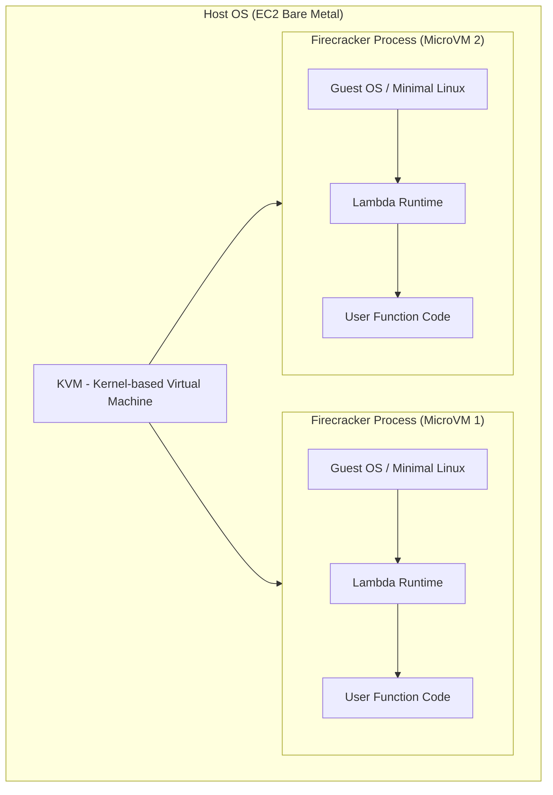
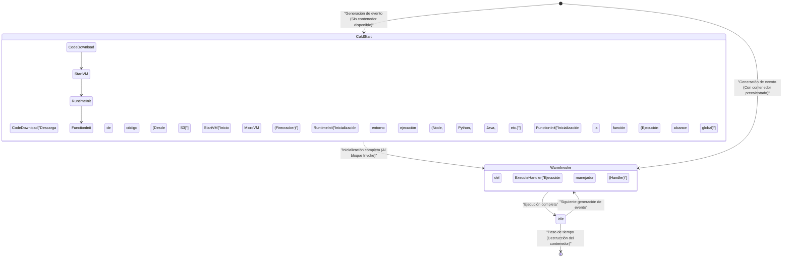
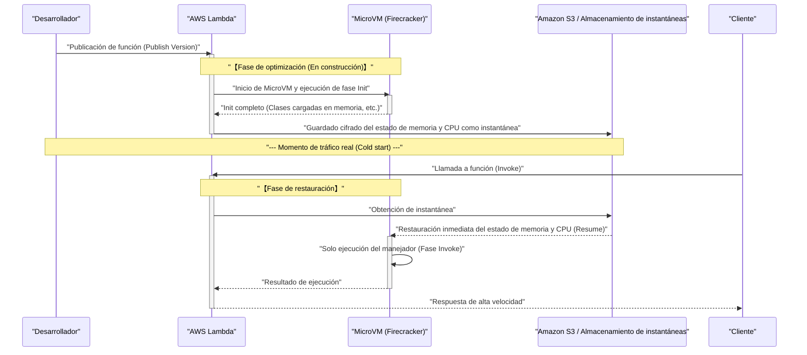

En los últimos años, la **arquitectura serverless** (Serverless Architecture) ha establecido una posición sólida como uno de los estándares de facto en el mundo de la computación en la nube. El máximo representante de esto podría decirse que es **AWS Lambda**. Atraídas por promesas (las "luces") como "no requiere gestión de servidores", "pago por uso según lo consumido" y "escalado automático", muchas empresas han migrado sus sistemas a serverless.

Sin embargo, cualquier tecnología siempre tiene sus compensaciones (las "sombras"). La mayor "sombra" de la arquitectura serverless, y el tema principal de este artículo, es el problema del **cold start** (arranque en frío).

En este artículo, mientras explicamos las luces y sombras de la arquitectura serverless, profundizaremos de forma exhaustiva, desde el nivel de arquitectura, en lo que sucede en el funcionamiento interno de AWS Lambda, el mecanismo del problema del cold start que atormenta a los desarrolladores, y las últimas soluciones (como SnapStart).

---

## 1. Las "luces" de la arquitectura serverless

Primero, analicemos por qué la arquitectura serverless cuenta con tanto apoyo y cuáles son sus abrumadoras ventajas (luces).

### 1.1. Liberación de la gestión de infraestructura (NoOps)

En las arquitecturas tradicionales on-premise o utilizando IaaS (como Amazon EC2), era necesario dedicar enormes recursos a las operaciones y mantenimiento (Ops) de la infraestructura, como la aplicación de parches del SO, actualizaciones de seguridad y monitoreo del estado de los servidores.

En la arquitectura serverless, toda esta gestión de infraestructura puede delegarse (offload) al proveedor de la nube (como AWS). Los desarrolladores pueden concentrarse exclusivamente en la tarea que originalmente aporta más valor: "programar la lógica de negocio".

### 1.2. Escalado automático definitivo

Otra arma poderosa de serverless es el **escalado continuo** frente a las fluctuaciones de tráfico.

Por ejemplo, supongamos que comienza una oferta por tiempo limitado en un sitio de comercio electrónico y se genera un acceso instantáneo que es 100 veces superior al normal. En las arquitecturas tradicionales, habría sido necesario sobreaprovisionar servidores por adelantado para coincidir con el pico o ajustar complejos grupos de autoescalado.

En el caso de AWS Lambda, cada vez que llega una solicitud, se inicia instantáneamente un entorno de ejecución independiente (contenedor) para procesar la petición. Cuando el acceso es cero, los recursos se reducen completamente a cero, y cuando el acceso aumenta repentinamente, aumenta automáticamente el número de ejecuciones paralelas para responder.

### 1.3. Optimización de costos mediante pago por uso

Serverless factura solo por el tiempo de ejecución en milisegundos (en unidades de 1ms en el caso de Lambda) y por la cantidad de memoria asignada. En estado de inactividad (cuando nadie está accediendo), no se incurre en ningún costo.

Esto proporciona un efecto de reducción de costos espectacular en sistemas con fuertes picos de acceso o en sistemas internos que no se utilizan por la noche.

---

## 2. Las "sombras" de serverless y su verdadera naturaleza

Cuanto más fuerte es la luz, más oscura es la sombra. Serverless no significa "sin servidores". Simplemente significa "dejar la gestión de los servidores al proveedor de la nube". Entre bastidores, hay servidores físicos funcionando sin falta, con un SO en ejecución y nuestro código ejecutándose sobre ellos.

Si no se entiende este "mecanismo subyacente", uno se enfrentará a degradaciones de rendimiento inesperadas o restricciones arquitectónicas.

### 2.1. No se puede mantener estado (Stateless)

Fundamentalmente se requiere que las funciones Lambda sean **sin estado (stateless)**. Dado que el entorno de ejecución se desecha (o reutiliza) para cada solicitud, no hay garantía de que los datos en el sistema de archivos local o en memoria se transfieran a la siguiente petición.

Para mantener el estado, es necesario integrar bases de datos en memoria o almacenamiento persistente externo como Amazon DynamoDB, ElastiCache o S3.

### 2.2. Restricciones en el tiempo de ejecución

AWS Lambda tiene un límite máximo de tiempo de espera (timeout) de **15 minutos** (900 segundos) por ejecución. Procesos por lotes que tardan horas no pueden migrarse tal cual a Lambda. Estos procesos deben dividirse y hacerse asíncronos utilizando herramientas como AWS Step Functions, AWS Batch o Amazon ECS.

### 2.3. El problema del cold start

Y la mayor sombra es el **cold start**. Aunque se beneficia del escalado automático, la "sobrecarga de inicialización" al iniciar un nuevo entorno de ejecución se manifiesta como un retraso en la latencia.

---

## 3. El funcionamiento interno de AWS Lambda: Mecanismo de las MicroVM Firecracker

Para entender el cold start, es necesario conocer la tecnología base de cómo AWS Lambda ejecuta el código subyacente.

Inicialmente, AWS Lambda utilizaba contenedores Linux (tecnología similar a LXC/[Docker](https://kenji.blog/es/p/docker-container-namespace-[cgroups](https://kenji.blog/es/p/docker-container-namespace-cgroups-layers/)-layers/)) para lograr el aislamiento. Sin embargo, para maximizar el equilibrio entre seguridad, velocidad de inicio y densidad de consolidación, AWS desarrolló su propia tecnología de virtualización de código abierto llamada **Firecracker**.

### 3.1. ¿Qué es Firecracker?

Firecracker es un monitor de máquina virtual (VMM) que utiliza KVM (Kernel-based Virtual Machine) para iniciar "MicroVMs" ligeras en milisegundos. Escrito en el lenguaje [Rust](https://kenji.blog/es/p/programming-languages-history-paradigm-evolution/), en comparación con las máquinas virtuales tradicionales (como QEMU), elimina por completo los modelos de dispositivos innecesarios para lograr inicios extremadamente rápidos y una baja sobrecarga de memoria.



En la infraestructura de AWS, que es un entorno multiinquilino, Firecracker proporciona un fuerte límite de virtualización a nivel de hardware para ejecutar de forma segura el código de diferentes clientes en el mismo servidor físico. Esta es la base de por qué Lambda es seguro y escalable.

---

## 4. Anatomía del cold start

Cuando se llama a una función Lambda, si no existe una MicroVM precalentada (contenedor tibio/warm) en espera que ya esté iniciada, AWS debe aprovisionar una nueva MicroVM. El retraso causado por esta serie de procesos de inicialización es el **cold start**.

### 4.1. Ciclo de vida y desglose de la latencia

El ciclo de vida de Lambda se puede representar mediante el siguiente diagrama de transición de estados de Mermaid.



El tiempo que toma el cold start se divide a grandes rasgos en la **inicialización del lado de AWS** (sobrecarga de la plataforma) y la **inicialización del lado del usuario** (sobrecarga del código).

1. **Descarga y descompresión del código**: El paquete de despliegue se descarga desde S3 y se extrae en el entorno. Toma tiempo en proporción al tamaño del paquete (cantidad de bibliotecas dependientes).
2. **Inicio de MicroVM**: Inicia Firecracker. Esta parte es extremadamente rápida (en milisegundos) debido a las optimizaciones de AWS.
3. **Inicialización del entorno de ejecución (Runtime)**: Inicia el proceso de Node.js, Python, [Java](https://kenji.blog/es/p/programming-languages-history-paradigm-evolution/), etc. Especialmente los lenguajes que compilan JIT (Just-In-Time), como Java o C#, consumen mucho tiempo aquí.
4. **Inicialización de la función (Init Phase)**: Se evalúa el alcance global del código (fuera de la función del manejador). Si aquí se crea un pool de conexiones a la DB o se inicializa un SDK pesado, el tiempo de inicialización se prolongará.

### 4.2. El cold start desde la teoría de la probabilidad

La probabilidad de que ocurra un cold start se puede modelar matemáticamente utilizando la teoría de colas (como el modelo M/M/c).
Si definimos la tasa de llegada de peticiones como $\lambda$, el tiempo de vida de un contenedor precalentado como $T_w$, y el tiempo de procesamiento como $\mu$, un pico de tráfico causará un rápido aumento en el número de procesos paralelos requeridos (número de contenedores) e incrementará la probabilidad de cold start.

En estado estacionario, la probabilidad de que un contenedor precalentado sea reutilizado, $P_{warm}$, puede aproximarse como sigue:

$ P_{warm} \approx 1 - e^{-\lambda \cdot T_w} $

En otras palabras, cuanto mayor sea la frecuencia de solicitudes $\lambda$ o cuanto mayor sea el tiempo de supervivencia del contenedor $T_w$, menor será la probabilidad de encontrar un cold start. A la inversa, con una API a la que se accede con poca frecuencia, hay una alta probabilidad de experimentar cold starts.

---

## 5. Estrategias de optimización para derrotar el cold start

El cold start es el destino de serverless, pero con creatividad en el diseño de la arquitectura y la implementación, es posible minimizar su impacto.

### 5.1. Elección del lenguaje de programación

La velocidad del cold start varía drásticamente según el lenguaje.

- **Grupo más rápido**: Lenguajes con compilación AOT (Ahead-Of-Time) como [Go](https://kenji.blog/es/p/programming-languages-history-paradigm-evolution/), [Rust](https://kenji.blog/es/p/programming-languages-history-paradigm-evolution/) y C++, y lenguajes de scripting ligeros (Python, Node.js). Estos tienden a mantener los cold starts por debajo de los cientos de milisegundos.
- **Grupo lento**: Java, C# (.NET). Debido a la sobrecarga del inicio de JVM o CLR, y la compilación JIT, pueden producirse cold starts de varios a más de diez segundos.

También llama la atención el enfoque de acortar aún más el tiempo de inicio de Node.js utilizando tiempos de ejecución JavaScript experimentales y ligeros proporcionados por AWS, como **LLRT (Low Latency Runtime)**.

### 5.2. Reducción del paquete de despliegue

Lambda descarga el código desde S3 al iniciarse. Por lo tanto, mantener un tamaño de paquete pequeño es una optimización directa.
Es sumamente importante no incluir dependencias innecesarias (como DevDependencies) y utilizar bundlers como Webpack / esbuild para minimizar (Minify) y eliminar el código muerto ([Tree](https://kenji.blog/es/p/tree-graph-data-structures-search-dfs-bfs-dijkstra/)-shaking).

### 5.3. Optimización de la inicialización y evaluación diferida (Lazy Initialization)

El código en el alcance global se ejecuta en la fase Init de la función Lambda. Optimizar este procesamiento es la clave para reducir el cold start.

Por ejemplo, al usar el SDK de AWS, solo importe los módulos necesarios.

```javascript
// ❌ Mal ejemplo: Inicialización lenta porque carga todo el SDK
const AWS = require('aws-sdk');
const dynamo = new AWS.DynamoDB.DocumentClient();

// ✅ Buen ejemplo: Carga solo los clientes necesarios (Uso del SDK v3)
const { DynamoDBClient } = require("@aws-sdk/client-dynamodb");
const { DynamoDBDocumentClient } = require("@aws-sdk/lib-dynamodb");

const client = new DynamoDBClient({});
const dynamo = DynamoDBDocumentClient.from(client);
```

Además, para recursos que no siempre son necesarios en cada solicitud (como conexiones de DB que solo se utilizan en rutas de procesamiento específicas), la técnica de evaluación diferida (Lazy Initialization) dentro del manejador de la función también es efectiva.

### 5.4. Concurrencia aprovisionada (Provisioned Concurrency)

Para requisitos orientados a empresas donde es absolutamente necesario que los cold starts sean cero, AWS ofrece una solución llamada **Provisioned Concurrency** (Concurrencia aprovisionada).

Esta función mantiene un número predeterminado de entornos de ejecución de Lambda inicializados y en espera en estado precalentado (warm). Como resultado, elimina por completo los cold starts, logrando consistentemente bajas latencias (milisegundos).

Sin embargo, dado que los costos se incurren mientras los contenedores están en espera, existe un dilema (compensación) por el cual parte del beneficio de serverless del "pago por uso" se pierde.

---

## 6. Un cambio de juego: AWS Lambda SnapStart

Como el salvador de los lenguajes de inicio lento como [Java](https://kenji.blog/es/p/programming-languages-history-paradigm-evolution/), apareció **AWS Lambda SnapStart**. Esta es una tecnología revolucionaria que crea una instantánea (snapshot) del estado de la máquina virtual y la restaura durante un cold start.

Como tecnología base, se utilizan **CRaU** (Checkpoint/Restore in Userspace) y la funcionalidad de instantáneas de MicroVM de Firecracker.

### 6.1. El mecanismo de SnapStart

El diagrama de secuencia a continuación muestra cómo funciona SnapStart.



### 6.2. Ventajas y consideraciones de SnapStart

Al habilitar SnapStart, el tiempo de cold start para funciones en [Java](https://kenji.blog/es/p/programming-languages-history-paradigm-evolution/) se acelera en **hasta más de 10 veces**. Esto se debe a que el inicio del entorno de ejecución, la compilación JIT y la inicialización de frameworks pesados como Spring Boot se adelantan al "momento del despliegue".

Sin embargo, hay algunas cosas a tener en cuenta.

1. **Problema de estado de números aleatorios**: Como la VM restaurada comienza a partir de exactamente la misma instantánea de memoria, el estado de semilla de los generadores de números pseudoaleatorios (PRNG) estándar será el mismo. Los números aleatorios involucrados en la seguridad criptográfica deben ser reinicializados de forma segura utilizando `/dev/urandom` del SO, etc. (AWS proporciona bibliotecas para abordar esto).
2. **Desconexión de redes**: Las conexiones TCP, como las de una base de datos establecida en la fase de inicialización, pueden ya haberse agotado (timeout) y desconectado en el lado del servidor para el momento en que se restaura la instantánea. Por lo tanto, es necesario implementar una lógica para detectar errores de conexión y volver a conectar (mecanismo de reintento) dentro del manejador.

---

## 7. Conclusión: ¿Es serverless una bala de plata?

La arquitectura serverless, y especialmente AWS Lambda, sin duda ha provocado un cambio de paradigma en el diseño de aplicaciones nativas en la nube.

La "luz" de la reducción en la gestión de infraestructura, optimización de costos y escalado instantáneo mejora drásticamente la agilidad empresarial (agility), desde startups hasta grandes empresas.

Sin embargo, si se diseña ignorando "sombras" como el cold start, las restricciones sin estado y la complejidad de redes en VPC, experimentará reveses inesperados en los entornos de producción.

Lo importante es no olvidar el principio fundamental de la ingeniería de que **"no hay una bala de plata"**.

- Para **sistemas con requisitos de latencia extremadamente estrictos** (p.ej., la lógica central en los juegos competitivos en línea o el trading de alta frecuencia en milisegundos), los contenedores de ejecución continua (Amazon ECS/EKS) pueden ser más adecuados que serverless.
- Para el **procesamiento asíncrono con ráfagas de tráfico** o **APIs Web en las que desea minimizar los costos operativos**, AWS Lambda es la mejor opción.

Comprender en profundidad las características de la arquitectura y elegir la tecnología adecuada para el trabajo adecuado. Es verdaderamente la única forma de maximizar la exposición a la "luz" de serverless mientras se controla su "sombra".

---
*Este artículo se escribió con el fin de explorar la estructura interna de la arquitectura serverless y compartir técnicas de optimización prácticas. El mundo de la optimización del rendimiento nunca termina. ¡Disfrutemos de la medición y mejora continuas!*
