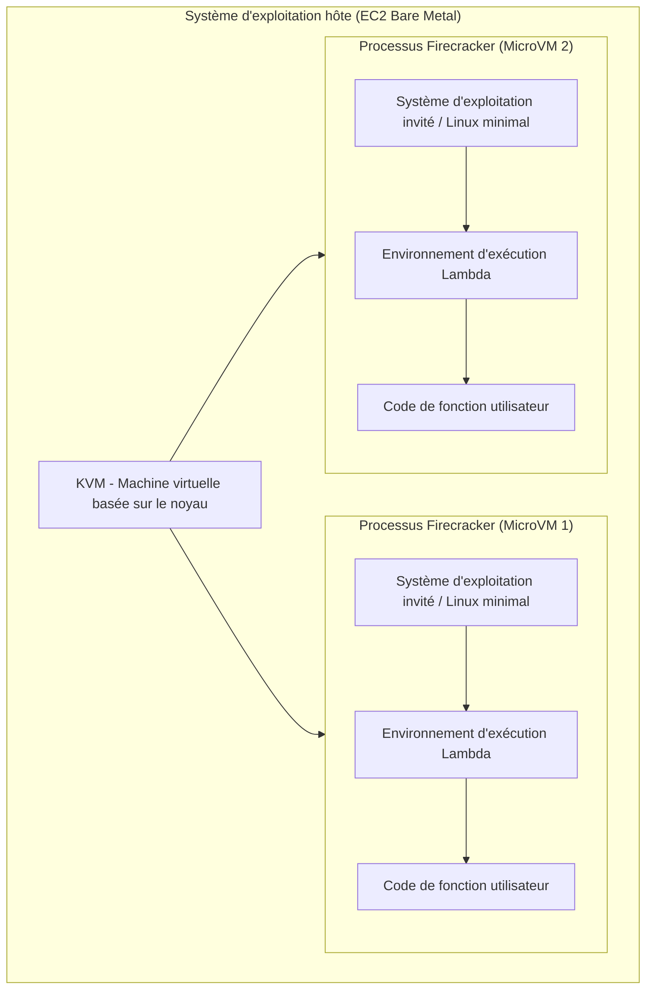
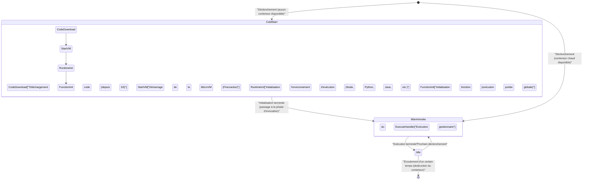
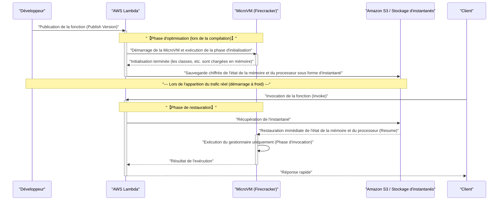

Ces dernières années, dans le monde du cloud computing, l' **architecture sans serveur** (Serverless Architecture) a consolidé sa position comme l'un des standards de facto. Son représentant le plus emblématique est sans doute **AWS Lambda**. Séduites par des promesses (la lumière) telles que « aucune gestion de serveur », « facturation à l'usage » et « mise à l'échelle automatique », de nombreuses entreprises ont migré leurs systèmes vers le sans serveur.

Cependant, toute technologie comporte inévitablement des compromis (l'ombre). L'ombre la plus importante de l'architecture sans serveur, et le sujet principal de cet article, est le problème du **démarrage à froid** (Cold Start).

Dans cet article, tout en expliquant l'ombre et la lumière de l'architecture sans serveur, nous plongerons de manière approfondie et exhaustive, au niveau de l'architecture, dans ce qui se passe réellement dans les coulisses d'AWS Lambda, ainsi que dans le mécanisme du problème du démarrage à froid qui tourmente les développeurs, et ses dernières solutions (comme SnapStart).

---

## 1. La « lumière » de l'architecture sans serveur

Tout d'abord, clarifions pourquoi l'architecture sans serveur est si populaire et quels sont ses avantages écrasants (la lumière).

### 1.1. Libération de la gestion de l'infrastructure (NoOps)

Dans les architectures traditionnelles sur site ou utilisant l'IaaS (comme Amazon EC2), il était nécessaire de consacrer d'énormes ressources à l'exploitation et à la maintenance (Ops) de l'infrastructure, telles que l'application de correctifs du système d'exploitation, les mises à jour de sécurité et la surveillance de la disponibilité des serveurs.

Dans l'architecture sans serveur, toute cette gestion d'infrastructure peut être déchargée sur le fournisseur de cloud (comme AWS). Les développeurs peuvent se concentrer uniquement sur « le codage de la logique métier », la tâche qui crée fondamentalement le plus de valeur.

### 1.2. La mise à l'échelle automatique ultime

Une autre arme redoutable du sans serveur est la **mise à l'échelle transparente** en réponse aux fluctuations du trafic.

Par exemple, supposons qu'une vente flash commence sur un site de commerce électronique, générant instantanément un trafic 100 fois supérieur à la normale. Dans une architecture traditionnelle, il aurait fallu sur-provisionner les serveurs à l'avance pour gérer les pics ou ajuster de manière complexe des groupes de mise à l'échelle automatique.

Avec AWS Lambda, à chaque requête, un environnement d'exécution (conteneur) indépendant est instantanément lancé pour traiter la requête. Lorsque le trafic est nul, les ressources sont totalement réduites à zéro, et lorsque le trafic augmente de manière exponentielle, le nombre d'exécutions parallèles est automatiquement augmenté pour y faire face.

### 1.3. Optimisation des coûts grâce à la facturation à l'usage

Le sans serveur n'est facturé que pour le temps d'exécution, au millième de seconde (au millième de seconde pour Lambda), et pour la quantité de mémoire allouée. À l'état inactif (lorsque personne n'y accède), aucun coût n'est engagé.

Cela se traduit par des réductions de coûts spectaculaires pour les systèmes connaissant de fortes variations de trafic ou les systèmes internes qui ne sont pas utilisés la nuit.

---

## 2. L'« ombre » du sans serveur et sa véritable nature

Plus la lumière est forte, plus l'ombre est sombre. Le sans serveur ne signifie pas qu'il n'y a « pas de serveur ». Cela signifie simplement que « la gestion du serveur est déléguée au fournisseur de cloud ». En coulisses, des serveurs physiques fonctionnent avec certitude, des systèmes d'exploitation tournent, et notre code est exécuté par-dessus.

Si vous ne comprenez pas ce « mécanisme en coulisses », vous serez confronté à des baisses de performances inattendues ou à des limitations architecturales.

### 2.1. Incapacité à conserver un état (Apatride)

Les fonctions Lambda doivent fondamentalement être **sans état** (stateless). Étant donné que l'environnement d'exécution est jetable (ou réutilisé) pour chaque requête, il n'y a aucune garantie que le système de fichiers local ou les données en mémoire seront conservés pour la requête suivante.

Pour conserver un état, il est nécessaire de combiner un stockage persistant externe ou des bases de données en mémoire, telles qu'Amazon DynamoDB, ElastiCache ou S3.

### 2.2. Limite de temps d'exécution

AWS Lambda impose une limite de délai d'attente (timeout) maximale de **15 minutes** (900 secondes) par exécution. Il n'est pas possible de migrer tel quel vers Lambda des traitements par lots qui durent des heures. Ces traitements doivent être divisés et rendus asynchrones en utilisant AWS Step Functions, AWS Batch, Amazon ECS, etc.

### 2.3. Le problème du démarrage à froid

La plus grande ombre est le **démarrage à froid**. Bien que l'on bénéficie de la mise à l'échelle automatique, la « surcharge d'initialisation » lors du lancement d'un nouvel environnement d'exécution se manifeste par des retards de latence.

---

## 3. Les coulisses d'AWS Lambda : le mécanisme de la micro-VM Firecracker

Pour comprendre le démarrage à froid, il est nécessaire de savoir comment AWS Lambda exécute le code en coulisses et de connaître sa technologie sous-jacente.

Au départ, AWS Lambda utilisait des conteneurs Linux (technologie similaire à LXC/[Docker](https://kenji.blog/fr/p/docker-container-namespace-[cgroups](https://kenji.blog/fr/p/docker-container-namespace-cgroups-layers/)-layers/)) pour l'isolation. Cependant, pour optimiser à l'extrême l'équilibre entre sécurité, vitesse de démarrage et densité de consolidation, AWS a développé sa propre technologie de virtualisation open source appelée **Firecracker**.

### 3.1. Qu'est-ce que Firecracker ?

Firecracker est un moniteur de machine virtuelle (VMM) qui utilise KVM (Kernel-based Virtual Machine) pour lancer des « micro-VM » (MicroVM) légères en quelques millisecondes. Écrit en langage Rust, il permet un démarrage extrêmement rapide et une faible surcharge de mémoire par rapport aux machines virtuelles traditionnelles (comme QEMU), en supprimant radicalement les modèles de périphériques inutiles.



Dans l'infrastructure AWS, qui est un environnement mutualisé, des limites de virtualisation robustes au niveau matériel sont fournies par Firecracker afin d'exécuter le code de différents clients de manière sécurisée sur le même serveur physique. C'est la raison fondamentale pour laquelle Lambda est sécurisé et évolutif.

---

## 4. L'anatomie du démarrage à froid

Lorsqu'une fonction Lambda est invoquée, si aucune MicroVM en attente (conteneur chaud) n'est déjà lancée et disponible, AWS doit provisionner une nouvelle MicroVM. Le retard causé par ce processus d'initialisation est le **démarrage à froid**.

### 4.1. Cycle de vie et répartition de la latence

Le cycle de vie de Lambda peut être représenté par le diagramme de transition d'état Mermaid suivant.



Le temps nécessaire au démarrage à froid se divise principalement en **initialisation côté AWS** (surcharge de la plateforme) et **initialisation côté utilisateur** (surcharge du code).

1. **Téléchargement et décompression du code** : Le package de déploiement est téléchargé depuis S3 et déployé dans l'environnement. Le temps requis est proportionnel à la taille du package (quantité de bibliothèques dépendantes).
2. **Démarrage de la MicroVM** : Firecracker démarre. Cette étape est extrêmement rapide (de l'ordre de la milliseconde) grâce à l'optimisation côté AWS.
3. **Initialisation de l'environnement d'exécution** : Des processus tels que Node.js, Python, Java démarrent. Les langages qui effectuent une compilation JIT (Just-In-Time), comme Java et C#, consomment beaucoup de temps ici.
4. **Initialisation de la fonction (phase Init)** : La portée globale du code (à l'extérieur de la fonction de gestion) est évaluée. Si l'on crée un pool de connexions à une base de données ou si l'on initialise un SDK lourd à ce stade, le temps d'initialisation se prolonge.

### 4.2. Le démarrage à froid du point de vue de la théorie des probabilités

En utilisant la théorie des files d'attente (comme le modèle M/M/c), on peut modéliser mathématiquement la probabilité d'occurrence d'un démarrage à froid.
Le taux d'arrivée des requêtes étant $\lambda$, la durée de vie du conteneur chaud étant $T_w$, et le temps de traitement étant $\mu$, alors lors d'un pic de trafic, le nombre d'exécutions parallèles nécessaires (nombre de conteneurs) augmente fortement, ce qui fait monter la probabilité d'un démarrage à froid.

En régime permanent, la probabilité $P_{warm}$ qu'un conteneur chaud soit réutilisé peut être approximée comme suit :

$ P_{warm} \approx 1 - e^{-\lambda \cdot T_w} $

En d'autres termes, plus la fréquence des requêtes $\lambda$ est élevée, ou plus la durée de vie du conteneur $T_w$ est longue, plus la probabilité de rencontrer un démarrage à froid est faible. Inversement, pour une API rarement consultée, vous rencontrerez un démarrage à froid avec une forte probabilité.

---

## 5. Stratégies d'optimisation pour vaincre le démarrage à froid

Le démarrage à froid est le destin du sans serveur, mais il est possible de minimiser son impact grâce à des choix d'architecture et de mise en œuvre.

### 5.1. Choix du langage de programmation

La vitesse du démarrage à froid varie considérablement selon le langage.

- **Le groupe le plus rapide** : Langages compilés AOT (Ahead-Of-Time) tels que Go, Rust, C++, ainsi que les langages de script légers (Python, Node.js). Leurs démarrages à froid restent souvent inférieurs à quelques centaines de millisecondes.
- **Le groupe lent** : Java, C# (.NET). En raison du démarrage de la JVM ou du CLR, et de la surcharge de la compilation JIT, des démarrages à froid de plusieurs secondes à plus de dix secondes peuvent se produire.

L'utilisation de **LLRT (Low Latency Runtime)**, un environnement d'exécution JavaScript léger expérimental fourni par AWS, suscite également l'intérêt en tant qu'approche pour réduire davantage la vitesse de démarrage de Node.js.

### 5.2. Allègement du package de déploiement

Lambda télécharge le code depuis S3 au démarrage. Par conséquent, maintenir une petite taille de package est une optimisation directe.
Il est extrêmement important de ne pas inclure de dépendances inutiles (comme les DevDependencies) et d'utiliser des bundlers comme Webpack / esbuild pour minimiser (Minify) et éliminer le code mort ([Tree](https://kenji.blog/fr/p/tree-graph-data-structures-search-dfs-bfs-dijkstra/)-shaking).

### 5.3. Optimisation de l'initialisation et évaluation paresseuse (Lazy Initialization)

Le traitement dans la portée globale est exécuté pendant la phase d'initialisation de la fonction Lambda. L'optimisation de ce traitement est la clé pour réduire le démarrage à froid.

Par exemple, lors de l'utilisation du SDK AWS, importez uniquement les modules nécessaires.

```javascript
// ❌ Mauvais exemple : L'initialisation est lente car tout le SDK est chargé
const AWS = require('aws-sdk');
const dynamo = new AWS.DynamoDB.DocumentClient();

// ✅ Bon exemple : Ne charger que le client nécessaire (utilisation du SDK v3)
const { DynamoDBClient } = require("@aws-sdk/client-dynamodb");
const { DynamoDBDocumentClient } = require("@aws-sdk/lib-dynamodb");

const client = new DynamoDBClient({});
const dynamo = DynamoDBDocumentClient.from(client);
```

De plus, pour les ressources qui ne sont pas nécessairement requises pour toutes les requêtes (comme une connexion à une base de données utilisée uniquement dans un chemin de traitement spécifique), la technique d'évaluation paresseuse (Lazy Initialization) à l'intérieur de la fonction de gestion est également efficace.

### 5.4. Exécution simultanée provisionnée (Provisioned Concurrency)

Pour les exigences des entreprises qui souhaitent absolument éliminer les démarrages à froid, AWS propose une solution appelée **Provisioned Concurrency** (exécution simultanée provisionnée).

Il s'agit d'une fonctionnalité qui permet de maintenir en attente, dans un état chaud déjà initialisé, un nombre spécifié d'environnements d'exécution Lambda. Cela permet d'éliminer complètement les démarrages à froid et de garantir en permanence une faible latence cohérente (quelques millisecondes).

Cependant, il y a un dilemme (compromis) : des coûts sont encourus même pendant la période d'attente, ce qui fait perdre une partie de l'avantage de la « facturation à l'usage » du sans serveur.

---

## 6. L'innovateur : AWS Lambda SnapStart

**AWS Lambda SnapStart** est apparu comme le sauveur des langages à démarrage lent comme Java. Il s'agit d'une technologie révolutionnaire qui crée un instantané (snapshot) de l'état de la machine virtuelle et le restaure lors d'un démarrage à froid.

En arrière-plan, cette technologie utilise **CRaU** (Checkpoint/Restore in Userspace) ainsi que la fonction d'instantané de la MicroVM Firecracker.

### 6.1. Le mécanisme de SnapStart

Le diagramme de séquence suivant montre comment fonctionne SnapStart.



### 6.2. Avantages et précautions concernant SnapStart

En activant SnapStart, le temps de démarrage à froid des fonctions Java est accéléré jusqu'à **10 fois plus** (ou plus). Cela s'explique par le fait que le lancement de l'environnement d'exécution, la compilation JIT et l'initialisation de frameworks lourds comme Spring Boot sont avancés au moment du « déploiement ».

Cependant, il y a quelques précautions à prendre.

1. **Le problème de l'état des nombres aléatoires** : Étant donné que les machines virtuelles restaurées démarrent à partir du même instantané de mémoire, l'état de départ des générateurs de nombres pseudo-aléatoires (PRNG) standard sera identique. Les nombres aléatoires liés à la sécurité cryptographique doivent être réinitialisés de manière sécurisée en utilisant `/dev/urandom` du système d'exploitation, etc. (AWS fournit des bibliothèques de contournement).
2. **Déconnexion du réseau** : Les connexions TCP aux bases de données établies lors de la phase d'initialisation peuvent déjà être interrompues par un délai d'attente côté serveur au moment de la restauration à partir de l'instantané. Par conséquent, il est nécessaire d'implémenter une logique de détection des erreurs de connexion et de reconnexion (mécanisme de nouvelle tentative) dans le gestionnaire.

---

## 7. Conclusion : Le sans serveur est-il une solution miracle ?

L'architecture sans serveur, et en particulier AWS Lambda, a indéniablement apporté un changement de paradigme dans la conception d'applications natives du cloud.

La « lumière » que représentent la réduction de la charge de gestion de l'infrastructure, l'optimisation des coûts et la mise à l'échelle instantanée améliore de manière spectaculaire l'agilité commerciale (agility), des startups aux grandes entreprises.

Cependant, si vous concevez un système en ignorant l'« ombre » comme le démarrage à froid, les contraintes d'absence d'état (stateless) et la complexité des réseaux VPC, vous risquez de subir des dommages inattendus en environnement de production.

L'important est de ne pas oublier le principe fondamental de l'ingénierie selon lequel **« il n'y a pas de solution miracle »**.

- **Pour les systèmes où la latence est extrêmement stricte** (par exemple : logique de base d'un jeu de compétition en ligne, transactions à haute fréquence de l'ordre de la milliseconde), des conteneurs fonctionnant en permanence (Amazon ECS/EKS) pourraient être plus appropriés que le sans serveur.
- **Pour les traitements asynchrones avec de forts pics de trafic** ou les **API Web pour lesquelles on souhaite minimiser les coûts d'exploitation**, AWS Lambda est la meilleure option.

Comprendre profondément les caractéristiques de l'architecture et choisir la technologie au bon endroit. C'est la seule façon de maximiser la « lumière » du sans serveur tout en contrôlant son « ombre ».

---
*Cet article a été rédigé pour explorer la structure interne de l'architecture sans serveur et partager des techniques d'optimisation pratiques. Le monde de l'optimisation des performances n'a pas de fin. Continuons à mesurer et à améliorer avec plaisir !*
