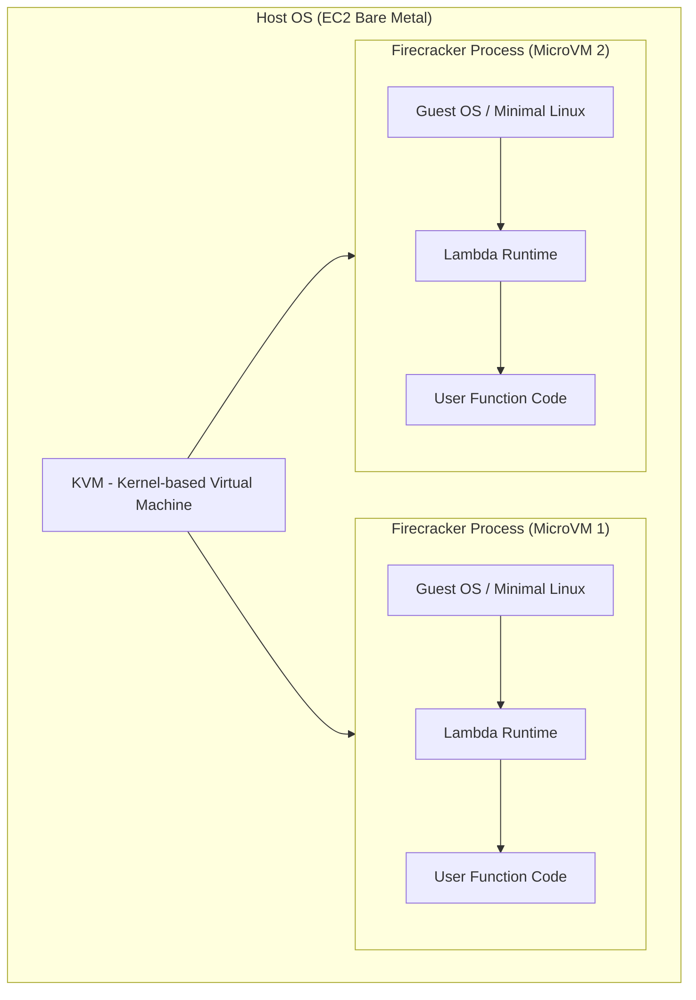
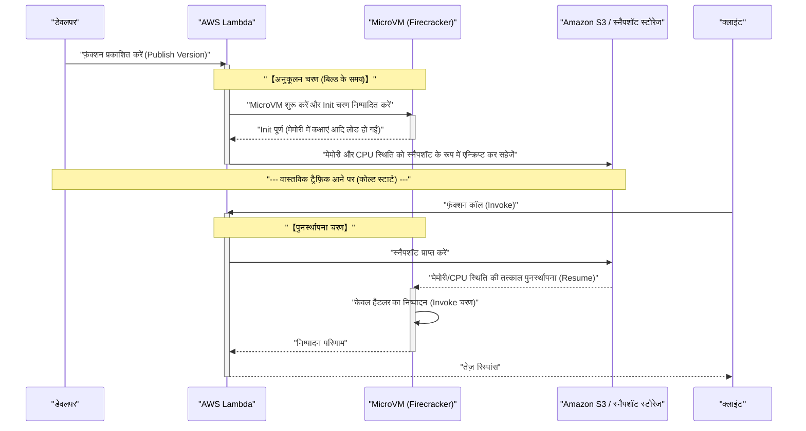

हाल ही में, क्लाउड कंप्यूटिंग की दुनिया में **सर्वरलेस आर्किटेक्चर** (Serverless Architecture) ने एक वास्तविक मानक के रूप में अपनी स्थिति मजबूत कर ली है। इसका एक प्रमुख उदाहरण **AWS Lambda** है। "सर्वर प्रबंधन की आवश्यकता नहीं", "उपयोग के अनुसार भुगतान", और "स्वचालित स्केलिंग" जैसे आकर्षक वादों (प्रकाश) से प्रभावित होकर, कई कंपनियों ने अपने सिस्टम को सर्वरलेस में माइग्रेट किया है।

हालांकि, किसी भी तकनीक में ट्रेड-ऑफ (अंधकार) अवश्य होता है। सर्वरलेस आर्किटेक्चर का सबसे बड़ा "अंधकार", जो इस लेख का मुख्य विषय है, वह **कोल्ड स्टार्ट** (Cold Start) की समस्या है।

इस लेख में, हम सर्वरलेस आर्किटेक्चर के प्रकाश और अंधकार की व्याख्या करते हुए, AWS Lambda के पीछे वास्तव में क्या हो रहा है, और डेवलपर्स को परेशान करने वाली कोल्ड स्टार्ट समस्या के तंत्र और नवीनतम समाधान (जैसे SnapStart) के बारे में वास्तुकला के स्तर से गहराई और व्यापकता से चर्चा करेंगे।

---

## 1. सर्वरलेस आर्किटेक्चर का "प्रकाश"

सबसे पहले, आइए देखें कि सर्वरलेस आर्किटेक्चर को इतना अधिक समर्थन क्यों मिल रहा है, और इसके अत्यधिक लाभ (प्रकाश) क्या हैं।

### 1.1. इन्फ्रास्ट्रक्चर प्रबंधन से मुक्ति (NoOps)

पारंपरिक ऑन-प्रिमाइसेस या IaaS (जैसे Amazon EC2) का उपयोग करने वाले आर्किटेक्चर में, OS पैचिंग, सुरक्षा अपडेट, और सर्वर की स्थिति की निगरानी जैसे इन्फ्रास्ट्रक्चर संचालन और रखरखाव (Ops) में भारी संसाधनों का निवेश करना पड़ता था।

सर्वरलेस आर्किटेक्चर में, इस पूरे इन्फ्रास्ट्रक्चर प्रबंधन को क्लाउड प्रदाता (जैसे AWS) पर ऑफलोड किया जा सकता है। डेवलपर्स केवल "बिजनेस लॉजिक की कोडिंग" पर ध्यान केंद्रित कर सकते हैं, जो वास्तव में सबसे अधिक मूल्य पैदा करने वाला काम है।

### 1.2. अल्टीमेट ऑटो-स्केलिंग

सर्वरलेस का एक और शक्तिशाली हथियार ट्रैफ़िक में उतार-चढ़ाव के लिए **निर्बाध स्केलिंग** (Seamless Scaling) है।

उदाहरण के लिए, मान लीजिए कि एक ई-कॉमर्स साइट पर फ्लैश सेल शुरू होती है और सामान्य से 100 गुना अधिक ट्रैफ़िक तुरंत आता है। पारंपरिक आर्किटेक्चर में, या तो पीक के अनुसार सर्वर को पहले से ही अत्यधिक प्रोविज़न करना पड़ता था, या जटिल ऑटो-स्केलिंग समूहों की ट्यूनिंग की आवश्यकता होती थी।

AWS Lambda के मामले में, जब भी कोई अनुरोध आता है, एक स्वतंत्र निष्पादन वातावरण (कंटेनर) तुरंत शुरू होता है और अनुरोध को संसाधित करता है। जब ट्रैफ़िक शून्य होता है, तो संसाधन पूरी तरह से शून्य हो जाते हैं, और जब ट्रैफ़िक तेजी से बढ़ता है, तो यह स्वचालित रूप से समानांतर निष्पादन की संख्या बढ़ा देता है।

### 1.3. उपयोग के अनुसार बिलिंग द्वारा लागत अनुकूलन

सर्वरलेस में, केवल मिलीसेकंड (Lambda के मामले में 1ms) के निष्पादन समय और आवंटित मेमोरी मात्रा के लिए बिल किया जाता है। निष्क्रिय अवस्था (जब कोई एक्सेस नहीं कर रहा हो) में कोई लागत नहीं लगती है।

यह उन प्रणालियों में भारी लागत बचत लाता है जहां ट्रैफ़िक में अत्यधिक उतार-चढ़ाव होता है या उन आंतरिक प्रणालियों में जो रात में उपयोग नहीं की जाती हैं।

---

## 2. सर्वरलेस का "अंधकार" और उसकी वास्तविकता

जहाँ प्रकाश तेज़ होता है, वहाँ परछाइयाँ भी गहरी होती हैं। सर्वरलेस का मतलब यह नहीं है कि "कोई सर्वर नहीं है"। इसका मतलब सिर्फ यह है कि "सर्वर प्रबंधन क्लाउड प्रदाता पर छोड़ दिया गया है"। बैकग्राउंड में, भौतिक सर्वर निश्चित रूप से चल रहे हैं, OS चल रहे हैं, और उन पर हमारा कोड निष्पादित हो रहा है।

यदि आप इस "बैकग्राउंड तंत्र" को नहीं समझते हैं, तो आपको अप्रत्याशित प्रदर्शन गिरावट या वास्तुकला संबंधी सीमाओं का सामना करना पड़ सकता है।

### 2.1. स्टेट बनाए रखने में असमर्थता (स्टेटलेस)

Lambda फ़ंक्शंस को मूल रूप से **स्टेटलेस** (Stateless) होना आवश्यक है। चूंकि निष्पादन वातावरण प्रत्येक अनुरोध के लिए हटा दिया जाता है (या पुन: उपयोग किया जाता है), इस बात की कोई गारंटी नहीं है कि स्थानीय फ़ाइल सिस्टम या मेमोरी का डेटा अगले अनुरोध में स्थानांतरित किया जाएगा।

स्टेट को बनाए रखने के लिए, Amazon DynamoDB, ElastiCache, और S3 जैसे बाहरी स्थायी स्टोरेज या इन-मेमोरी डेटाबेस को संयोजित करना आवश्यक है।

### 2.2. निष्पादन समय की सीमा

AWS Lambda में प्रति निष्पादन अधिकतम **15 मिनट** (900 सेकंड) की टाइमआउट सीमा है। घंटों तक चलने वाले बैच प्रोसेसिंग को सीधे Lambda में माइग्रेट नहीं किया जा सकता। ऐसे कार्यों को AWS Step Functions, AWS Batch, या Amazon ECS का उपयोग करके विभाजित और अतुल्यकालिक (asynchronous) किया जाना चाहिए।

### 2.3. कोल्ड स्टार्ट की समस्या

और सबसे बड़ा अंधकार **कोल्ड स्टार्ट** है। जबकि स्वचालित स्केलिंग के लाभ मिलते हैं, नए निष्पादन वातावरण को शुरू करने के "आरंभीकरण ओवरहेड" के कारण लेटेंसी में देरी होती है।

---

## 3. AWS Lambda के पीछे: Firecracker माइक्रो-VM का तंत्र

कोल्ड स्टार्ट को समझने के लिए, हमें यह जानना होगा कि AWS Lambda बैकग्राउंड में कोड को कैसे निष्पादित करता है और इसकी अंतर्निहित तकनीक क्या है।

शुरुआत में, AWS Lambda ने अलगाव (isolation) के लिए Linux कंटेनरों (LXC/[Docker](https://kenji.blog/hi/p/docker-container-namespace-[cgroups](https://kenji.blog/hi/p/docker-container-namespace-cgroups-layers/)-layers/) के समान तकनीक) का उपयोग किया। हालांकि, सुरक्षा, स्टार्ट-अप गति, और घनत्व के बीच संतुलन को अधिकतम करने के लिए, AWS ने **Firecracker** (फायरक्रैकर) नामक एक ओपन-सोर्स वर्चुअलाइजेशन तकनीक विकसित की।

### 3.1. Firecracker क्या है?

Firecracker एक वर्चुअल मशीन मॉनिटर (VMM) है जो KVM (Kernel-based Virtual Machine) का उपयोग करके मिलीसेकंड में हल्के "माइक्रो-VM" (MicroVM) शुरू करता है। यह [Rust](https://kenji.blog/hi/p/programming-languages-history-paradigm-evolution/) भाषा में लिखा गया है, और पारंपरिक वर्चुअल मशीनों (जैसे QEMU) की तुलना में, यह अनावश्यक डिवाइस मॉडल को हटाकर अत्यधिक तेज़ स्टार्ट-अप और कम मेमोरी ओवरहेड प्राप्त करता है।



AWS इन्फ्रास्ट्रक्चर जैसे मल्टी-टेनेंट वातावरण में, एक ही भौतिक सर्वर पर विभिन्न ग्राहकों के कोड को सुरक्षित रूप से निष्पादित करने के लिए Firecracker के माध्यम से मजबूत हार्डवेयर-स्तरीय वर्चुअलाइजेशन सीमाएँ प्रदान की जाती हैं। यही कारण है कि Lambda सुरक्षित और स्केलेबल है।

---

## 4. कोल्ड स्टार्ट का एनाटॉमी

जब कोई Lambda फ़ंक्शन कॉल किया जाता है, और यदि पहले से शुरू किया गया स्टैंडबाय MicroVM (वार्म कंटेनर) मौजूद नहीं है, तो AWS को एक नया MicroVM प्रोविज़न करना पड़ता है। इस आरंभिक प्रक्रिया के कारण होने वाली देरी को **कोल्ड स्टार्ट** कहा जाता है।

### 4.1. जीवनचक्र और लेटेंसी का विश्लेषण

Lambda के जीवनचक्र को निम्नलिखित Mermaid स्टेट ट्रांज़िशन डायग्राम के रूप में दर्शाया जा सकता है।

```mermaid
stateDiagram-v2
    [*] --> ColdStart : "ट्रिगर उत्पन्न (कोई उपलब्ध कंटेनर नहीं)"
    state ColdStart {
        direction TB
        CodeDownload["कोड डाउनलोड (S3 से)"]
        StartVM["MicroVM का स्टार्ट-अप (Firecracker)"]
        RuntimeInit["रनटाइम आरंभीकरण (Node, Python, Java आदि)"]
        FunctionInit["फ़ंक्शन आरंभीकरण (ग्लोबल स्कोप का निष्पादन)"]
        
        CodeDownload --> StartVM
        StartVM --> RuntimeInit
        RuntimeInit --> FunctionInit
    }
    ColdStart --> WarmInvoke : "आरंभीकरण पूर्ण (Invoke चरण की ओर)"
    
    [*] --> WarmInvoke : "ट्रिगर उत्पन्न (वार्म कंटेनर उपलब्ध)"
    state WarmInvoke {
        ExecuteHandler["हैंडलर का निष्पादन"]
    }
    
    WarmInvoke --> Idle : "निष्पादन पूर्ण"
    Idle --> WarmInvoke : "अगला ट्रिगर उत्पन्न"
    Idle --> [*] : "निश्चित समय बीता (कंटेनर नष्ट)"
```

कोल्ड स्टार्ट में लगने वाले समय को मुख्य रूप से **AWS साइड आरंभीकरण** (प्लेटफ़ॉर्म ओवरहेड) और **यूज़र साइड आरंभीकरण** (कोड ओवरहेड) में विभाजित किया जा सकता है।

1. **कोड डाउनलोड और डीकंप्रेसन**: डिप्लॉयमेंट पैकेज S3 से डाउनलोड किया जाता है और वातावरण में अनपैक किया जाता है। पैकेज के आकार (निर्भर लाइब्रेरी की मात्रा) के अनुपात में समय लगता है।
2. **MicroVM का स्टार्ट-अप**: Firecracker शुरू होता है। AWS के अनुकूलन के कारण यह बहुत तेज़ (मिलीसेकंड) है।
3. **रनटाइम आरंभीकरण**: Node.js, Python, [Java](https://kenji.blog/hi/p/programming-languages-history-paradigm-evolution/) जैसी प्रक्रियाएँ शुरू होती हैं। विशेष रूप से Java या C# जैसी JIT (Just-In-Time) संकलन करने वाली भाषाएँ यहाँ काफी समय लेती हैं।
4. **फ़ंक्शन आरंभीकरण (Init Phase)**: कोड के ग्लोबल स्कोप (हैंडलर फ़ंक्शन के बाहर) का मूल्यांकन किया जाता है। यदि आप यहाँ DB के लिए कनेक्शन पूल बनाते हैं या भारी SDK को इनिशियलाइज़ करते हैं, तो आरंभीकरण का समय बढ़ जाएगा।

### 4.2. प्रायिकता के दृष्टिकोण से कोल्ड स्टार्ट

कतार सिद्धांत (Queueing theory, जैसे M/M/c मॉडल) का उपयोग करके कोल्ड स्टार्ट की घटना की प्रायिकता को गणितीय रूप से मॉडल किया जा सकता है।
अनुरोध की आगमन दर को $\lambda$, वार्म कंटेनर के जीवनकाल को $T_w$, और प्रसंस्करण समय को $\mu$ मानते हुए, जब ट्रैफ़िक बढ़ता है, तो आवश्यक समानांतरता (कंटेनरों की संख्या) तेज़ी से बढ़ती है, जिससे कोल्ड स्टार्ट की संभावना बढ़ जाती है।

स्थिर स्थिति में, वार्म कंटेनर के पुन: उपयोग किए जाने की संभावना $P_{warm}$ को लगभग इस प्रकार माना जा सकता है:

$ P_{warm} \approx 1 - e^{-\lambda \cdot T_w} $

अर्थात, अनुरोध आवृत्ति $\lambda$ जितनी अधिक होगी, या कंटेनर का जीवनकाल $T_w$ जितना लंबा होगा, कोल्ड स्टार्ट का सामना करने की संभावना उतनी ही कम होगी। इसके विपरीत, ऐसे API जिन्हें शायद ही कभी एक्सेस किया जाता है, उनमें कोल्ड स्टार्ट की उच्च संभावना होती है।

---

## 5. कोल्ड स्टार्ट को हराने के लिए अनुकूलन रणनीतियाँ

कोल्ड स्टार्ट सर्वरलेस का एक अपरिहार्य हिस्सा है, लेकिन आर्किटेक्चर डिज़ाइन और कार्यान्वयन की युक्तियों के माध्यम से इसके प्रभाव को कम किया जा सकता है।

### 5.1. प्रोग्रामिंग भाषा का चयन

कोल्ड स्टार्ट की गति भाषा के आधार पर काफी भिन्न होती है।

- **सबसे तेज़ समूह**: [Go](https://kenji.blog/hi/p/programming-languages-history-paradigm-evolution/), [Rust](https://kenji.blog/hi/p/programming-languages-history-paradigm-evolution/), C++ जैसी AOT (Ahead-Of-Time) संकलित भाषाएँ, और हल्की स्क्रिप्टिंग भाषाएँ (Python, Node.js)। इनका कोल्ड स्टार्ट अक्सर कुछ सौ मिलीसेकंड के भीतर होता है।
- **धीमा समूह**: Java, C# (.NET)। JVM या CLR के स्टार्ट-अप और JIT संकलन के ओवरहेड के कारण, कई सेकंड से लेकर दसियों सेकंड तक का कोल्ड स्टार्ट हो सकता है।

**LLRT (Low Latency Runtime)** जैसे AWS द्वारा प्रदान किए गए प्रयोगात्मक हल्के JavaScript रनटाइम का उपयोग करके Node.js की स्टार्ट-अप गति को और भी कम करने के दृष्टिकोण पर भी ध्यान दिया जा रहा है।

### 5.2. डिप्लॉयमेंट पैकेज को हल्का करना

Lambda स्टार्ट-अप के दौरान S3 से कोड डाउनलोड करता है। इसलिए, पैकेज के आकार को छोटा रखना एक सीधा अनुकूलन है।
अनावश्यक निर्भरताओं (जैसे DevDependencies) को शामिल न करना, और Webpack / esbuild जैसे बंडलर का उपयोग करके कोड को न्यूनतम (Minify) और ट्री-शेकिंग ([Tree](https://kenji.blog/hi/p/tree-graph-data-structures-search-dfs-bfs-dijkstra/)-shaking) करना बहुत महत्वपूर्ण है।

### 5.3. आरंभीकरण प्रक्रिया का अनुकूलन और विलंबित मूल्यांकन (Lazy Initialization)

ग्लोबल स्कोप में प्रसंस्करण Lambda फ़ंक्शन के Init चरण में निष्पादित होता है। यहाँ प्रसंस्करण को अनुकूलित करना कोल्ड स्टार्ट को कम करने की कुंजी है।

उदाहरण के लिए, AWS SDK का उपयोग करते समय, केवल आवश्यक मॉड्यूल ही इंपोर्ट करें।

```javascript
// ❌ खराब उदाहरण: संपूर्ण SDK लोड करने के कारण आरंभीकरण धीमा हो जाता है
const AWS = require('aws-sdk');
const dynamo = new AWS.DynamoDB.DocumentClient();

// ✅ अच्छा उदाहरण: केवल आवश्यक क्लाइंट लोड करें (v3 SDK का उपयोग)
const { DynamoDBClient } = require("@aws-sdk/client-dynamodb");
const { DynamoDBDocumentClient } = require("@aws-sdk/lib-dynamodb");

const client = new DynamoDBClient({});
const dynamo = DynamoDBDocumentClient.from(client);
```

इसके अलावा, जिन संसाधनों की हर अनुरोध के लिए हमेशा आवश्यकता नहीं होती है (जैसे कि DB कनेक्शन जो केवल विशिष्ट प्रोसेसिंग पथों में उपयोग किए जाते हैं), उन्हें फ़ंक्शन हैंडलर के भीतर विलंबित रूप से मूल्यांकन (Lazy Initialization) करने की तकनीक भी प्रभावी है।

### 5.4. प्रोविज़न्ड कॉनकरेंसी (Provisioned Concurrency)

उन एंटरप्राइज़ आवश्यकताओं के लिए जहाँ कोल्ड स्टार्ट को पूरी तरह से समाप्त करना आवश्यक है, AWS **Provisioned Concurrency** (प्रोविज़न्ड कॉनकरेंसी) नामक समाधान प्रदान करता है।

यह एक ऐसी सुविधा है जो निर्दिष्ट संख्या में Lambda निष्पादन वातावरणों को पहले से इनिशियलाइज़ करके वार्म स्थिति में स्टैंडबाय पर रखती है। यह कोल्ड स्टार्ट को पूरी तरह से समाप्त कर देता है और हमेशा सुसंगत कम लेटेंसी (कुछ मिलीसेकंड) प्रदान कर सकता है।

हालांकि, चूंकि स्टैंडबाय के दौरान भी लागत लगती है, इसलिए "उपयोग के अनुसार बिलिंग" वाले सर्वरलेस के लाभ आंशिक रूप से कम हो जाते हैं, जो एक दुविधा (ट्रेड-ऑफ) है।

---

## 6. गेम चेंजर: AWS Lambda SnapStart

[Java](https://kenji.blog/hi/p/programming-languages-history-paradigm-evolution/) जैसी धीमी स्टार्ट-अप भाषाओं के उद्धारकर्ता के रूप में **AWS Lambda SnapStart** सामने आया है। यह एक क्रांतिकारी तकनीक है जो वर्चुअल मशीन की स्थिति का स्नैपशॉट लेती है और कोल्ड स्टार्ट के दौरान उसे पुनर्स्थापित (restore) करती है।

बैकग्राउंड तकनीक के रूप में **CRaU** (Checkpoint/Restore in Userspace) और Firecracker की MicroVM स्नैपशॉट सुविधा का उपयोग किया जाता है।

### 6.1. SnapStart का तंत्र

नीचे दिया गया अनुक्रम आरेख दिखाता है कि SnapStart कैसे काम करता है।



### 6.2. SnapStart के लाभ और सावधानियां

SnapStart को सक्षम करने से [Java](https://kenji.blog/hi/p/programming-languages-history-paradigm-evolution/) फ़ंक्शंस का कोल्ड स्टार्ट समय **अधिकतम 10 गुना या उससे अधिक** तेज़ हो जाता है। ऐसा इसलिए है क्योंकि रनटाइम का स्टार्ट-अप, JIT संकलन, और Spring Boot जैसे भारी फ्रेमवर्क का आरंभीकरण "डिप्लॉयमेंट के समय" पहले ही कर लिया जाता है।

हालांकि, कुछ सावधानियां बरतने की आवश्यकता है।

1. **स्थिति की यादृच्छिक संख्या की समस्या**: चूंकि पुनर्स्थापित VM बिल्कुल उसी मेमोरी स्नैपशॉट से शुरू होता है, इसलिए मानक छद्म-यादृच्छिक संख्या जनरेटर (PRNG) की सीड स्थिति भी समान होगी। क्रिप्टोग्राफ़िक सुरक्षा से संबंधित यादृच्छिक संख्याओं को OS के `/dev/urandom` आदि का उपयोग करके सुरक्षित रूप से फिर से इनिशियलाइज़ किया जाना चाहिए (AWS इसके लिए शमन लाइब्रेरी प्रदान करता है)।
2. **नेटवर्क कनेक्शन का टूटना**: आरंभीकरण चरण के दौरान स्थापित डेटाबेस के TCP कनेक्शन आदि, स्नैपशॉट से पुनर्स्थापित होने तक सर्वर साइड पर टाइमआउट के कारण कट चुके हो सकते हैं। इसलिए, कनेक्शन त्रुटियों का पता लगाने और पुनः कनेक्ट करने के लिए तर्क (रीट्राई तंत्र) को हैंडलर के भीतर लागू करने की आवश्यकता होती है।

---

## 7. निष्कर्ष: क्या सर्वरलेस एक जादू की छड़ी (सिल्वर बुलेट) है?

सर्वरलेस आर्किटेक्चर, विशेष रूप से AWS Lambda, निस्संदेह क्लाउड-नेटिव एप्लिकेशन डिज़ाइन में एक प्रतिमान बदलाव (paradigm shift) लाया है।

इन्फ्रास्ट्रक्चर प्रबंधन के बोझ में कमी, लागत अनुकूलन, और तत्काल स्केलिंग जैसे "प्रकाश", स्टार्टअप से लेकर बड़े उद्यमों तक, व्यवसाय की चपलता (Agility) में नाटकीय रूप से सुधार करते हैं।

हालांकि, यदि आप कोल्ड स्टार्ट, स्टेटलेस सीमाओं, और VPC नेटवर्किंग की जटिलताओं जैसे "अंधकार" को नज़रअंदाज़ करके डिज़ाइन करते हैं, तो आपको उत्पादन वातावरण (production environment) में अप्रत्याशित नुकसान का सामना करना पड़ सकता है।

महत्वपूर्ण बात यह है कि इंजीनियरिंग के इस मूल सिद्धांत को न भूलें कि **"कोई भी तकनीक जादू की छड़ी (सिल्वर बुलेट) नहीं है"**।

- **अत्यधिक लेटेंसी-संवेदनशील प्रणालियों** (उदा: ऑनलाइन मल्टीप्लेयर गेम्स का कोर लॉजिक, मिलीसेकंड-स्तर की उच्च-आवृत्ति ट्रेडिंग) के लिए, सर्वरलेस की तुलना में हमेशा चलने वाले कंटेनर (Amazon ECS/EKS) अधिक उपयुक्त हो सकते हैं।
- **बहुत सारे बर्स्ट ट्रैफ़िक वाले अतुल्यकालिक प्रसंस्करण** और **ऐसे Web API जहाँ परिचालन लागत को कम करना है** के लिए, AWS Lambda सबसे अच्छा विकल्प है।

आर्किटेक्चर की विशेषताओं को गहराई से समझना और सही जगह पर सही तकनीक का चयन करना। यही सर्वरलेस के "प्रकाश" का अधिकतम लाभ उठाते हुए "अंधकार" को नियंत्रित करने का एकमात्र तरीका है।

---
*यह लेख सर्वरलेस आर्किटेक्चर की आंतरिक संरचना का अन्वेषण करने और व्यावहारिक अनुकूलन तकनीकों को साझा करने के लिए लिखा गया था। प्रदर्शन ट्यूनिंग (Performance tuning) की दुनिया का कोई अंत नहीं है। आइए निरंतर माप और सुधार का आनंद लें!*
