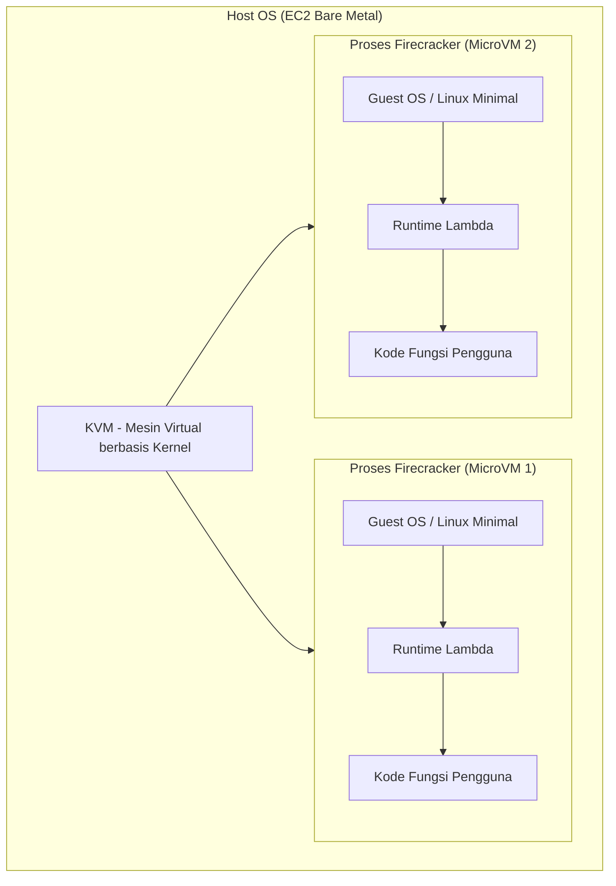
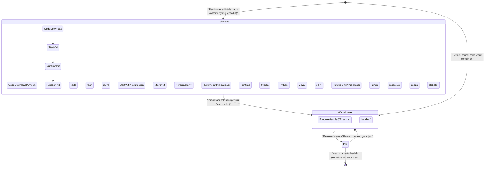
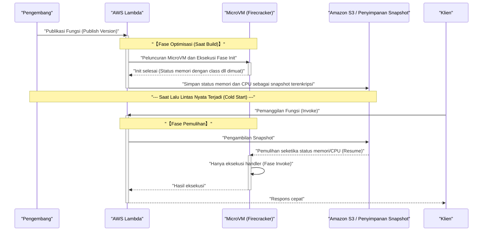

Dalam beberapa tahun terakhir, di dunia komputasi awan (cloud computing), **arsitektur serverless** (Serverless Architecture) telah membangun posisi yang kuat sebagai salah satu standar de facto. Perwakilan utamanya adalah **AWS Lambda**. Terpesona oleh kata-kata manis (terang) seperti "tidak perlu mengelola server", "penagihan bayar sesuai penggunaan (pay-as-you-go)", dan "penskalaan otomatis", banyak perusahaan telah memigrasikan sistem mereka ke serverless.

Namun, setiap teknologi pasti memiliki trade-off (gelap). "Gelap" terbesar dari arsitektur serverless, yang merupakan topik utama artikel ini, adalah masalah **cold start** (Cold Start).

Dalam artikel ini, sambil menjelaskan terang dan gelap dari arsitektur serverless, kami akan menggali lebih dalam dan komprehensif dari tingkat arsitektur tentang apa yang sebenarnya terjadi di balik layar AWS Lambda, serta mekanisme masalah cold start yang mengganggu para pengembang dan solusi terbarunya (seperti SnapStart).

---

## 1. "Terang" dari Arsitektur Serverless

Pertama-tama, mari kita bahas mengapa arsitektur serverless begitu didukung, dan apa saja kelebihan (terang) yang luar biasa.

### 1.1. Pembebasan dari Manajemen Infrastruktur (NoOps)

Pada arsitektur tradisional on-premise atau yang menggunakan IaaS (seperti Amazon EC2), perlu dialokasikan banyak sumber daya untuk operasi dan pemeliharaan (Ops) infrastruktur, seperti penambalan (patching) OS, pembaruan keamanan, dan pemantauan status server.

Dengan arsitektur serverless, semua manajemen infrastruktur ini dapat dialihkan ke penyedia cloud (seperti AWS). Pengembang dapat sepenuhnya fokus pada tugas yang sebenarnya paling bernilai: "menulis kode logika bisnis".

### 1.2. Penskalaan Otomatis (Autoscaling) yang Ultimate

Senjata ampuh lain dari serverless adalah **penskalaan yang mulus** terhadap naik turunnya lalu lintas (traffic).

Sebagai contoh, bayangkan sebuah situs e-commerce memulai flash sale, dan akses tiba-tiba melonjak menjadi 100 kali lipat dari biasanya. Pada arsitektur tradisional, Anda harus melakukan penyediaan (provisioning) server secara berlebihan sebelumnya untuk menghadapi puncak, atau menyetel grup autoscaling yang rumit.

Dalam kasus AWS Lambda, setiap kali ada permintaan (request), lingkungan eksekusi (kontainer) independen akan langsung menyala dalam sekejap dan memproses permintaan tersebut. Saat tidak ada akses, sumber daya dikurangi sepenuhnya menjadi nol, dan saat akses melonjak, jumlah eksekusi paralel ditingkatkan secara otomatis untuk menanganinya.

### 1.3. Optimalisasi Biaya melalui Pay-as-You-[Go](https://kenji.blog/id/p/programming-languages-history-paradigm-evolution/)

Serverless hanya menagih berdasarkan waktu eksekusi dalam satuan milidetik (dalam kasus Lambda, satuan 1ms) dan jumlah memori yang dialokasikan. Saat dalam keadaan diam (idle, tidak ada akses sama sekali), Anda tidak akan dikenakan biaya sedikit pun.

Hal ini memberikan efek pengurangan biaya yang drastis untuk sistem dengan gelombang akses yang fluktuatif atau sistem internal perusahaan yang tidak digunakan di malam hari.

---

## 2. "Gelap" dari Serverless dan Identitas Aslinya

Semakin terang cahayanya, semakin pekat bayangannya. Serverless bukan berarti "tidak ada server". Ini hanya berarti "menyerahkan manajemen server kepada penyedia cloud". Di belakang layar, server fisik tetap berjalan, OS beroperasi, dan kode kita dieksekusi di atasnya.

Jika Anda tidak memahami "mekanisme di balik layar" ini, Anda akan menghadapi degradasi performa dan batasan arsitektur yang tidak terduga.

### 2.1. Tidak Dapat Menyimpan Status (Stateless)

Fungsi Lambda pada dasarnya dituntut untuk bersifat **stateless**. Karena lingkungan eksekusi dibuang (atau digunakan kembali) setiap kali ada permintaan, tidak ada jaminan bahwa sistem file lokal atau data di memori akan diteruskan ke permintaan berikutnya.

Untuk menyimpan status, Anda harus mengombinasikan penyimpanan persisten eksternal atau database in-memory seperti Amazon DynamoDB, ElastiCache, atau S3.

### 2.2. Batasan Waktu Eksekusi

AWS Lambda memiliki batasan waktu (timeout) maksimum **15 menit** (900 detik) per eksekusi. Proses batch yang memakan waktu berjam-jam tidak dapat dipindahkan begitu saja ke Lambda. Proses semacam itu harus dibagi dan dibuat asinkron menggunakan layanan seperti AWS Step Functions, AWS Batch, atau Amazon ECS.

### 2.3. Masalah Cold Start

Dan bayangan (gelap) terbesar adalah **cold start**. Di balik manfaat penskalaan otomatis, "overhead inisialisasi" saat menjalankan lingkungan eksekusi baru muncul sebagai penundaan latensi (latency).

---

## 3. Di Balik Layar AWS Lambda: Mekanisme Firecracker MicroVM

Untuk memahami cold start, kita perlu mengetahui teknologi dasar tentang bagaimana AWS Lambda mengeksekusi kode di belakang layar.

Awalnya, AWS Lambda menggunakan kontainer Linux (teknologi yang mirip dengan LXC/[Docker](https://kenji.blog/id/p/docker-container-namespace-[cgroups](https://kenji.blog/id/p/docker-container-namespace-cgroups-layers/)-layers/)) untuk melakukan isolasi (isolation). Namun, untuk memaksimalkan keseimbangan antara keamanan, kecepatan peluncuran, dan kepadatan konsolidasi, AWS mengembangkan teknologi virtualisasi open source mereka sendiri yang disebut **Firecracker**.

### 3.1. Apa itu Firecracker?

Firecracker adalah Virtual Machine Monitor (VMM) yang menggunakan KVM (Kernel-based Virtual Machine) untuk meluncurkan "MicroVM" (mesin virtual mikro) yang ringan dalam hitungan milidetik. Ditulis dalam bahasa [Rust](https://kenji.blog/id/p/programming-languages-history-paradigm-evolution/), dibandingkan dengan mesin virtual tradisional (seperti QEMU), Firecracker menanggalkan model perangkat keras (device model) yang tidak perlu, sehingga mencapai peluncuran yang sangat cepat dan overhead memori yang rendah.



Di lingkungan infrastruktur AWS yang multi-tenant, untuk menjalankan kode pelanggan yang berbeda pada server fisik yang sama dengan aman, batas virtualisasi tingkat perangkat keras yang kuat disediakan oleh Firecracker. Inilah fondasi utama mengapa Lambda aman dan dapat diskalakan (scalable).

---

## 4. Anatomi Cold Start

Ketika fungsi Lambda dipanggil, jika tidak ada MicroVM yang sudah menyala dan dalam status siaga (warm container), pihak AWS harus melakukan provisioning MicroVM baru. Penundaan (delay) yang terjadi akibat serangkaian proses inisialisasi ini disebut **cold start**.

### 4.1. Siklus Hidup dan Rincian Latensi

Siklus hidup Lambda dapat direpresentasikan melalui diagram transisi status (state diagram) Mermaid berikut.



Waktu yang dibutuhkan untuk cold start pada garis besarnya dibagi menjadi **inisialisasi sisi AWS** (overhead platform) dan **inisialisasi sisi pengguna** (overhead kode).

1. **Unduhan dan ekstraksi kode**: Paket penerapan (deployment package) diunduh dari S3 dan diekstraksi ke lingkungan (environment). Waktu yang dibutuhkan sebanding dengan ukuran paket (jumlah library dependensi).
2. **Peluncuran MicroVM**: Firecracker diluncurkan. Bagian ini sangat cepat (dalam hitungan milidetik) berkat optimisasi pihak AWS.
3. **Inisialisasi Runtime**: Proses Node.js, Python, [Java](https://kenji.blog/id/p/programming-languages-history-paradigm-evolution/), dll. diluncurkan. Terutama bahasa yang melakukan kompilasi JIT (Just-In-Time) seperti Java atau C#, akan memakan banyak waktu di bagian ini.
4. **Inisialisasi Fungsi (Fase Init)**: Scope global dari kode (di luar fungsi handler) akan dievaluasi. Jika Anda membuat pool koneksi ke DB atau menginisialisasi SDK yang berat di sini, waktu inisialisasi akan bertambah panjang.

### 4.2. Cold Start dari Sudut Pandang Probabilitas

Dengan menggunakan [teori antrean](/id/p/queuing-theory-basics/) (seperti model M/M/c), kita dapat memodelkan probabilitas terjadinya cold start secara matematis.
Misalkan laju kedatangan permintaan adalah $\lambda$, waktu hidup warm container adalah $T_w$, dan waktu pemrosesan adalah $\mu$, ketika lalu lintas melonjak (spike), jumlah paralel (jumlah kontainer) yang diperlukan akan meningkat drastis, dan probabilitas cold start pun meningkat.

Dalam kondisi stabil (steady state), probabilitas $P_{warm}$ di mana warm container digunakan kembali dapat diaproksimasikan sebagai berikut:

$ P_{warm} \approx 1 - e^{-\lambda \cdot T_w} $

Dengan kata lain, semakin tinggi frekuensi permintaan $\lambda$, atau semakin lama waktu hidup kontainer $T_w$, maka probabilitas Anda menemui cold start akan semakin rendah. Sebaliknya, untuk API yang jarang diakses, Anda akan lebih sering menemui cold start.

---

## 5. Strategi Optimisasi untuk Mengalahkan Cold Start

Cold start adalah takdir bagi serverless, tetapi melalui rancangan arsitektur dan penyesuaian implementasi, dampaknya dapat ditekan seminimal mungkin.

### 5.1. Pemilihan Bahasa Pemrograman

Kecepatan cold start bervariasi secara dramatis tergantung pada bahasanya.

- **Grup tercepat**: Bahasa yang dikompilasi AOT (Ahead-Of-Time) seperti [Go](https://kenji.blog/id/p/programming-languages-history-paradigm-evolution/), [Rust](https://kenji.blog/id/p/programming-languages-history-paradigm-evolution/), C++, dan bahasa skrip ringan (Python, Node.js). Pada kelompok ini, cold start sering kali dapat ditekan di bawah beberapa ratus milidetik.
- **Grup lambat**: Java, C# (.NET). Karena adanya overhead dari peluncuran JVM atau CLR, serta kompilasi JIT, cold start bisa memakan waktu mulai dari beberapa detik hingga belasan detik.

Pendekatan dengan menggunakan runtime JavaScript eksperimental yang ringan yang disediakan oleh AWS, seperti **LLRT (Low Latency Runtime)**, juga mendapat banyak perhatian karena mampu memangkas waktu peluncuran Node.js lebih lanjut.

### 5.2. Peringanan Paket Penerapan (Deployment Package)

Lambda mengunduh kode dari S3 saat diluncurkan. Oleh karena itu, menjaga agar ukuran paket tetap kecil merupakan optimisasi yang berdampak langsung.
Sangat penting untuk tidak menyertakan dependensi yang tidak diperlukan (seperti DevDependencies), serta menggunakan bundler seperti Webpack / esbuild untuk meminifikasi (Minify) dan memangkas pohon ([Tree](https://kenji.blog/id/p/tree-graph-data-structures-search-dfs-bfs-dijkstra/)-shaking) kode.

### 5.3. Optimisasi Proses Inisialisasi dan Evaluasi Malas (Lazy Initialization)

Pemrosesan dalam scope global dijalankan pada fase Init di fungsi Lambda. Mengoptimalkan pemrosesan di sini merupakan kunci untuk mempersingkat cold start.

Sebagai contoh, jika Anda menggunakan AWS SDK, impor (import) hanya modul yang diperlukan.

```javascript
// ❌ Contoh buruk: Inisialisasi lambat karena memuat seluruh SDK
const AWS = require('aws-sdk');
const dynamo = new AWS.DynamoDB.DocumentClient();

// ✅ Contoh baik: Memuat hanya klien yang diperlukan (penggunaan SDK v3)
const { DynamoDBClient } = require("@aws-sdk/client-dynamodb");
const { DynamoDBDocumentClient } = require("@aws-sdk/lib-dynamodb");

const client = new DynamoDBClient({});
const dynamo = DynamoDBDocumentClient.from(client);
```

Selain itu, teknik evaluasi malas (Lazy Initialization) di dalam handler fungsi untuk sumber daya yang tidak selalu diperlukan di setiap permintaan (seperti koneksi DB yang hanya digunakan pada jalur pemrosesan tertentu) juga sangat efektif.

### 5.4. Eksekusi Konkuren yang Diprovisikan (Provisioned Concurrency)

Untuk kebutuhan tingkat perusahaan (enterprise) yang mutlak harus membuat cold start menjadi nol, AWS menyediakan solusi yang disebut **Provisioned Concurrency**.

Ini adalah fitur untuk menyiagakan lingkungan eksekusi Lambda dalam jumlah yang telah ditentukan sebelumnya dalam kondisi sudah diinisialisasi (warm state). Dengan ini, Anda dapat menghilangkan cold start sepenuhnya dan selalu mendapatkan latensi rendah yang konsisten (dalam hitungan milidetik).

Namun, ada dilema (trade-off) di mana sebagian dari manfaat serverless yaitu "pay-as-you-go" akan hilang karena Anda tetap dikenakan biaya selama lingkungan tersebut dalam keadaan siaga (standby).

---

## 6. Game Changer: AWS Lambda SnapStart

Penyelamat bagi bahasa yang lambat diluncurkan seperti [Java](https://kenji.blog/id/p/programming-languages-history-paradigm-evolution/) adalah **AWS Lambda SnapStart**. Ini adalah teknologi terobosan (breakthrough) yang mengambil snapshot dari status mesin virtual, dan memulihkannya pada saat terjadi cold start.

Sebagai teknologi latar belakangnya, fitur snapshot MicroVM dari Firecracker dan **CRaU** (Checkpoint/Restore in Userspace) digunakan.

### 6.1. Mekanisme SnapStart

Diagram urutan (sequence diagram) berikut ini menunjukkan bagaimana SnapStart bekerja.



### 6.2. Kelebihan dan Hal yang Perlu Diperhatikan dari SnapStart

Jika SnapStart diaktifkan, waktu cold start untuk fungsi [Java](https://kenji.blog/id/p/programming-languages-history-paradigm-evolution/) dapat dipercepat hingga **lebih dari 10 kali lipat**. Ini karena peluncuran runtime, kompilasi JIT, dan inisialisasi framework berat seperti Spring Boot dimajukan ke "saat deployment".

Namun, ada beberapa hal yang perlu diperhatikan.

1. **Masalah keadaan bilangan acak (Randomness)**: Karena VM yang dipulihkan dimulai dari snapshot memori yang sama persis, status seed dari generator angka acak pseudo (PRNG) standar juga akan sama. Angka acak yang berkaitan dengan keamanan kriptografi harus diinisialisasi ulang dengan aman menggunakan seperti `/dev/urandom` pada OS (AWS menyediakan library penanggulangan untuk ini).
2. **Pemutusan Koneksi Jaringan**: Koneksi TCP ke database yang dibuat pada fase inisialisasi, mungkin saja sudah mengalami timeout (habis waktu) dan diputuskan oleh sisi server pada saat snapshot dipulihkan. Oleh karena itu, perlu diterapkan logika deteksi kesalahan koneksi dan penyambungan ulang (mekanisme retry) di dalam handler.

---

## 7. Kesimpulan: Apakah Serverless adalah Peluru Perak?

Arsitektur serverless, khususnya AWS Lambda, tidak diragukan lagi telah membawa pergeseran paradigma (paradigm shift) dalam perancangan aplikasi cloud-native.

"Cahaya terang" (kelebihan) seperti berkurangnya beban manajemen infrastruktur, optimalisasi biaya, dan penskalaan instan, akan secara drastis meningkatkan kelincahan (agility) bisnis, dari startup hingga perusahaan besar.

Namun, jika Anda mendesainnya dengan mengabaikan "bayangan" (kekurangan) seperti cold start, batasan stateless, dan kerumitan jaringan VPC, Anda akan mengalami masalah tak terduga di lingkungan produksi.

Yang penting adalah, jangan melupakan prinsip dasar rekayasa bahwa **"Peluru Perak" tidaklah ada**.

- Untuk **sistem dengan persyaratan latensi yang sangat ketat** (contoh: logika inti dari game online multiplayer, atau transaksi frekuensi tinggi dalam hitungan milidetik), menggunakan kontainer yang selalu berjalan (Amazon ECS/EKS) mungkin lebih cocok dibandingkan serverless.
- Untuk **[pemrosesan asinkron](/id/p/event-driven-architecture-async/) dengan banyak lalu lintas burst** atau **Web API dengan biaya operasional yang ingin ditekan seminimal mungkin**, AWS Lambda menjadi pilihan yang terbaik.

Memahami karakteristik arsitektur secara mendalam dan memilih teknologi yang tepat pada tempat yang tepat. Itulah satu-satunya cara untuk mengendalikan "bayangan" sekaligus memaksimalkan cahaya terang dari serverless.

---
*Artikel ini ditulis untuk mengeksplorasi struktur internal dari arsitektur serverless dan membagikan metode optimisasi yang praktis. Tidak ada akhir dalam dunia penyesuaian kinerja (performance tuning). Mari kita terus menikmati pengukuran dan peningkatan yang berkelanjutan!*
