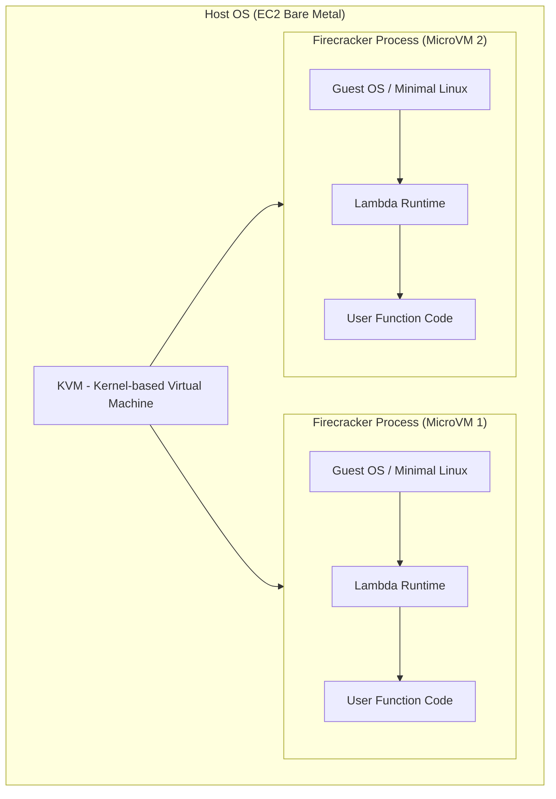
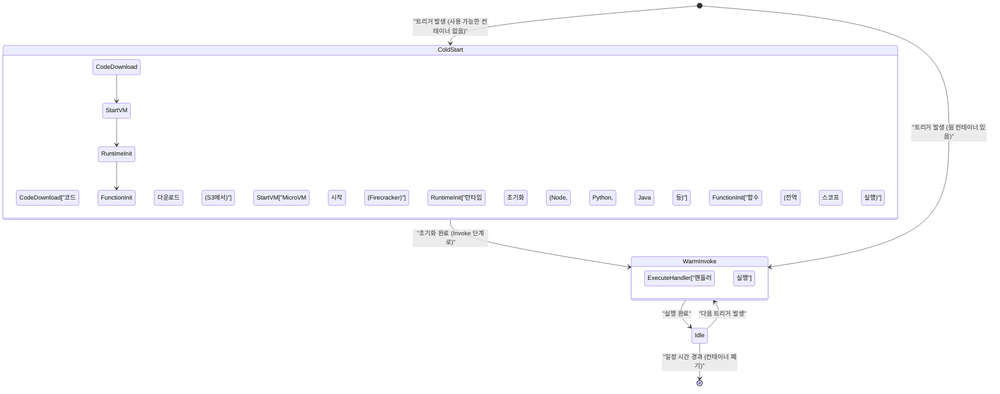
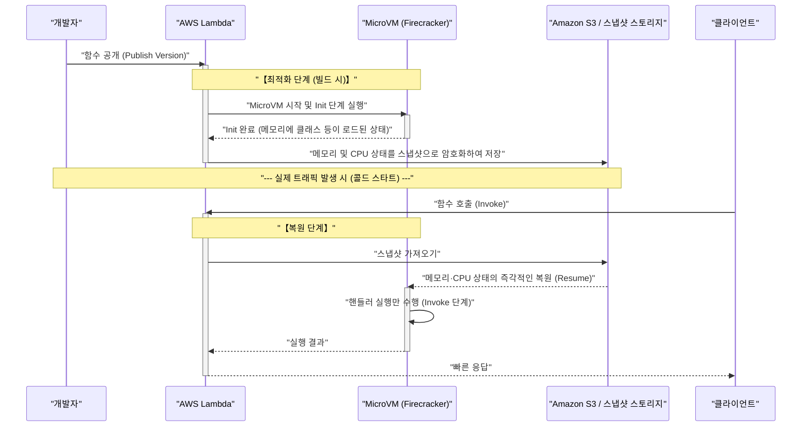

최근 클라우드 컴퓨팅 세계에서 **서버리스 아키텍처** (Serverless Architecture)는 사실상 표준 중 하나로 확고한 입지를 구축하고 있습니다. 그 대표격이라고 할 수 있는 것이 바로 **AWS Lambda** 입니다. "서버 관리가 불필요", "사용한 만큼만 지불하는 종량 과금", "자동 스케일링"과 같은 달콤한 말(빛)에 매료되어, 많은 기업이 시스템을 서버리스로 마이그레이션해 왔습니다.

하지만 어떤 기술이든 반드시 트레이드오프(그림자)가 존재합니다. 서버리스 아키텍처의 가장 큰 '그림자'라고 할 수 있는 것이, 본 문서의 주제인 **콜드 스타트** (Cold Start) 문제입니다.

본 문서에서는 서버리스 아키텍처의 빛과 그림자에 대해 해설하면서, AWS Lambda의 배후에서 대체 무슨 일이 일어나고 있는지, 그리고 개발자를 괴롭히는 콜드 스타트 문제의 메커니즘과 최신 대책(SnapStart 등)에 대해 아키텍처 수준에서 깊고 포괄적으로 파헤쳐 봅니다.

---

## 1. 서버리스 아키텍처의 '빛'

우선, 왜 이렇게까지 서버리스 아키텍처가 지지받고 있는지, 그 압도적인 장점(빛)에 대해 정리해 보겠습니다.

### 1.1. 인프라 관리로부터의 해방 (NoOps)

기존 온프레미스나 IaaS(Amazon EC2 등)를 이용한 아키텍처에서는 OS 패치 적용, 보안 업데이트, 서버 상태 모니터링 등 인프라스트럭처의 운영 및 유지보수(Ops)에 막대한 리소스를 할애해야 했습니다.

서버리스 아키텍처에서는 이러한 인프라스트럭처 관리를 모두 클라우드 제공자(AWS 등)에게 오프로드할 수 있습니다. 개발자는 '비즈니스 로직 코딩'이라는, 본래 가장 가치를 창출하는 작업에만 집중할 수 있게 됩니다.

### 1.2. 궁극의 오토 스케일링

서버리스의 또 다른 강력한 무기는 트래픽 증감에 대한 **원활한 스케일링** 입니다.

예를 들어, EC 사이트에서 타임 세일이 시작되어 평상시의 100배에 달하는 액세스가 순간적으로 발생했다고 가정해 보겠습니다. 기존 아키텍처에서는 미리 피크에 맞춰 서버를 과도하게 프로비저닝해 두거나, 복잡한 오토 스케일링 그룹의 튜닝이 필요했습니다.

AWS Lambda의 경우, 요청이 올 때마다 독립된 실행 환경(컨테이너)이 순식간에 구동되어 요청을 처리합니다. 액세스가 0일 때는 리소스를 완전히 0으로 줄이고, 액세스가 급증했을 때는 자동으로 병렬 실행 수를 늘려 대응합니다.

### 1.3. 종량 과금에 의한 비용 최적화

서버리스는 밀리초 단위(Lambda의 경우 1ms 단위)의 실행 시간과 할당한 메모리 용량에 대해서만 과금됩니다. 유휴 상태(아무도 액세스하지 않는 상태)일 때는 비용이 전혀 발생하지 않습니다.

이를 통해 액세스의 기복이 심한 시스템이나 야간에는 사용되지 않는 사내 시스템 등에서 극적인 비용 절감 효과를 가져옵니다.

---

## 2. 서버리스의 '그림자'와 그 실체

빛이 강할수록 그림자도 짙어집니다. 서버리스는 "서버가 없는" 것이 아닙니다. "서버 관리를 클라우드 제공자에게 맡기고 있는" 것뿐입니다. 배후에서는 확실히 물리 서버가 움직이고 OS가 가동되며, 그 위에서 우리의 코드가 실행되고 있습니다.

이 "배후의 원리"를 이해하지 못하면 예기치 못한 성능 저하나 아키텍처 상의 한계에 직면하게 됩니다.

### 2.1. 상태를 가질 수 없음 (상태 비저장)

Lambda 함수는 기본적으로 **상태 비저장** (Stateless)이어야 합니다. 실행 환경은 요청마다 버려지거나(또는 재사용되거나) 하므로, 로컬 파일 시스템이나 메모리 상의 데이터가 다음 요청으로 이어질 것이라는 보장은 없습니다.

상태를 유지하려면 Amazon DynamoDB나 ElastiCache, S3와 같은 외부 영구 스토리지 또는 인메모리 데이터베이스를 결합해야 합니다.

### 2.2. 실행 시간의 제한

AWS Lambda에는 1회 실행 시 최대 **15분** (900초)이라는 타임아웃 제한이 있습니다. 몇 시간씩 걸리는 배치 처리 등을 그대로 Lambda로 마이그레이션할 수는 없습니다. 그러한 처리는 AWS Step Functions나 AWS Batch, Amazon ECS 등을 활용하여 분할 및 비동기화해야 합니다.

### 2.3. 콜드 스타트 문제

그리고 가장 큰 그림자가 **콜드 스타트** 입니다. 자동 스케일링의 혜택을 받는 반면, 새로운 실행 환경을 시작할 때의 "초기화 오버헤드"가 지연 시간으로 나타납니다.

---

## 3. AWS Lambda의 배후: Firecracker 마이크로VM의 원리

콜드 스타트를 이해하려면 AWS Lambda가 배후에서 어떻게 코드를 실행하고 있는지 그 기반 기술을 알아야 합니다.

AWS Lambda는 당초 Linux 컨테이너(LXC/[Docker](https://kenji.blog/ko/p/docker-container-namespace-[cgroups](https://kenji.blog/ko/p/docker-container-namespace-cgroups-layers/)-layers/)에 가까운 기술)를 사용하여 격리(Isolation)를 수행했습니다. 하지만 보안과 시작 속도, 집적 밀도의 균형을 극한까지 높이기 위해 AWS는 **Firecracker** 라는 오픈 소스 가상화 기술을 독자적으로 개발했습니다.

### 3.1. Firecracker란 무엇인가?

Firecracker는 KVM(Kernel-based Virtual Machine)을 활용하여 경량 "마이크로VM(MicroVM)"을 밀리초 단위로 시작하기 위한 가상 머신 모니터(VMM)입니다. [Rust](https://kenji.blog/ko/p/programming-languages-history-paradigm-evolution/) 언어로 작성되었으며, 기존 가상 머신(QEMU 등)과 비교하여 불필요한 디바이스 모델을 극한까지 덜어냄으로써 매우 빠른 시작과 낮은 메모리 오버헤드를 실현했습니다.



멀티 테넌트 환경인 AWS 인프라에서 서로 다른 고객의 코드를 동일한 물리 서버 상에서 안전하게 실행하기 위해, Firecracker를 통한 강력한 하드웨어 수준의 가상화 경계가 제공됩니다. 이것이 Lambda가 안전하고 확장 가능한 이유의 근간입니다.

---

## 4. 콜드 스타트의 해부학

Lambda 함수가 호출되었을 때 이미 시작된 대기 중인 MicroVM(웜 컨테이너)이 없는 경우, AWS 측은 새로운 MicroVM을 프로비저닝해야 합니다. 이 일련의 초기화 프로세스로 인해 발생하는 지연이 **콜드 스타트** 입니다.

### 4.1. 수명 주기와 지연 시간의 내역

Lambda의 수명 주기는 아래의 Mermaid 상태 전이도처럼 표현할 수 있습니다.



콜드 스타트에 걸리는 시간은 크게 **AWS 측의 초기화** (플랫폼 오버헤드)와 **사용자 측의 초기화** (코드 오버헤드)로 나뉩니다.

1. **코드 다운로드 및 압축 해제**: 배포 패키지가 S3에서 다운로드되어 환경에 압축 해제됩니다. 패키지 크기(종속성 라이브러리의 양)에 비례하여 시간이 걸립니다.
2. **MicroVM 시작**: Firecracker가 시작됩니다. 이 부분은 AWS 측의 최적화를 통해 매우 빠릅니다(밀리초 단위).
3. **런타임 초기화**: Node.js, Python, [Java](https://kenji.blog/ko/p/programming-languages-history-paradigm-evolution/) 등의 프로세스가 시작됩니다. 특히 Java나 C# 등 JIT(Just-In-Time) 컴파일을 수행하는 언어는 여기서 많은 시간을 소비합니다.
4. **함수 초기화 (Init Phase)**: 코드의 전역 스코프(핸들러 함수 외부)가 평가됩니다. 여기서 DB에 대한 연결 풀을 생성하거나 무거운 SDK를 초기화하면 초기화 시간이 길어집니다.

### 4.2. 확률론으로 보는 콜드 스타트

대기열 이론(M/M/c 모델 등)을 사용하여 콜드 스타트가 발생할 확률을 수학적으로 모델링할 수 있습니다.
요청의 도착률을 $\lambda$, 웜 컨테이너의 생존 시간을 $T_w$, 처리 시간을 $\mu$ 라고 할 때, 트래픽이 스파이크를 일으키면 필요한 병렬 수(컨테이너 수)가 급증하여 콜드 스타트 확률이 상승합니다.

정상 상태에서 웜 컨테이너가 재사용될 확률 $P_{warm}$ 은 다음과 같이 근사될 수 있습니다.

$ P_{warm} \approx 1 - e^{-\lambda \cdot T_w} $

즉, 요청 빈도 $\lambda$ 가 높을수록, 또는 컨테이너의 생존 시간 $T_w$ 가 길수록 콜드 스타트에 직면할 확률은 낮아집니다. 반대로, 가끔씩만 액세스되는 API에서는 높은 확률로 콜드 스타트를 겪게 됩니다.

---

## 5. 콜드 스타트를 타파하는 최적화 전략

콜드 스타트는 서버리스의 숙명입니다만, 아키텍처 설계나 구현상의 노력을 통해 그 영향을 최소화할 수 있습니다.

### 5.1. 프로그래밍 언어의 선택

콜드 스타트의 속도는 언어에 따라 극적으로 다릅니다.

- **가장 빠른 그룹**: [Go](https://kenji.blog/ko/p/programming-languages-history-paradigm-evolution/), [Rust](https://kenji.blog/ko/p/programming-languages-history-paradigm-evolution/), C++ 등의 AOT(Ahead-Of-Time) 컴파일 언어, 그리고 경량 스크립트 언어(Python, Node.js). 이들은 콜드 스타트가 수백 밀리초 이내로 유지되기 쉽습니다.
- **느린 그룹**: Java, C# (.NET). JVM이나 CLR의 시작, JIT 컴파일의 오버헤드로 인해 수 초에서 십여 초의 콜드 스타트가 발생하는 경우가 있습니다.

**LLRT (Low Latency Runtime)** 와 같은, AWS가 제공하는 실험적인 경량 JavaScript 런타임을 사용하여 Node.js의 시작 속도를 더욱 단축시키는 접근 방식도 주목받고 있습니다.

### 5.2. 배포 패키지 경량화

Lambda는 시작 시 코드를 S3에서 다운로드합니다. 따라서 패키지 크기를 작게 유지하는 것이 직결되는 최적화가 됩니다.
불필요한 종속성(DevDependencies 등)을 포함하지 않는 것이나, Webpack / esbuild 등의 번들러를 사용하여 코드를 최소화(Minify)하고 트리 셰이킹([Tree](https://kenji.blog/ko/p/tree-graph-data-structures-search-dfs-bfs-dijkstra/)-shaking)하는 것이 매우 중요합니다.

### 5.3. 초기화 처리 최적화 및 지연 평가 (Lazy Initialization)

전역 스코프에서의 처리는 Lambda 함수의 Init 단계에서 실행됩니다. 이 부분의 처리를 최적화하는 것이 콜드 스타트 단축의 핵심입니다.

예를 들어, AWS SDK를 사용하는 경우 필요한 모듈만 가져옵니다.

```javascript
// ❌ 나쁜 예: SDK 전체를 로드하므로 초기화가 느림
const AWS = require('aws-sdk');
const dynamo = new AWS.DynamoDB.DocumentClient();

// ✅ 좋은 예: 필요한 클라이언트만 로드함 (v3 SDK 사용)
const { DynamoDBClient } = require("@aws-sdk/client-dynamodb");
const { DynamoDBDocumentClient } = require("@aws-sdk/lib-dynamodb");

const client = new DynamoDBClient({});
const dynamo = DynamoDBDocumentClient.from(client);
```

또한 모든 요청에서 반드시 필요하지 않은 리소스(특정 처리 경로에서만 사용하는 DB 연결 등)는 함수 핸들러 내부에서 지연 평가(Lazy Initialization)시키는 기법도 효과적입니다.

### 5.4. 프로비저닝된 동시성 (Provisioned Concurrency)

어떻게 해서든 콜드 스타트를 0으로 만들고 싶은 엔터프라이즈 대상 요건에 대해, AWS는 **Provisioned Concurrency** (프로비저닝된 동시성)라는 솔루션을 제공하고 있습니다.

이것은 미리 지정한 수의 Lambda 실행 환경을 초기화 완료된 웜 상태로 대기시켜 두는 기능입니다. 이를 통해 콜드 스타트를 완전히 배제하고 항상 일관된 낮은 지연 시간(수 밀리초)을 실현할 수 있습니다.

단, 대기시키는 동안에도 비용이 발생하므로 "종량 과금"이라는 서버리스의 혜택이 일부 훼손된다는 딜레마(트레이드오프)가 있습니다.

---

## 6. 게임 체인저: AWS Lambda SnapStart

[Java](https://kenji.blog/ko/p/programming-languages-history-paradigm-evolution/)와 같이 시작이 느린 언어의 구세주로 등장한 것이 **AWS Lambda SnapStart** 입니다. 이는 가상 머신의 상태를 스냅샷화하고 콜드 스타트 시에 이를 복원하는 획기적인 기술입니다.

배경 기술로 **CRaU** (Checkpoint/Restore in Userspace) 및 Firecracker의 MicroVM 스냅샷 기능이 사용되고 있습니다.

### 6.1. SnapStart의 메커니즘

아래의 시퀀스 다이어그램은 SnapStart가 어떻게 작동하는지를 보여줍니다.



### 6.2. SnapStart의 장점과 주의점

SnapStart를 활성화하면 [Java](https://kenji.blog/ko/p/programming-languages-history-paradigm-evolution/) 함수의 콜드 스타트 시간이 **최대 10배 이상** 빨라집니다. 런타임 시작이나 JIT 컴파일, Spring Boot 등 무거운 프레임워크의 초기화가 '배포 시'에 앞당겨지기 때문입니다.

단, 몇 가지 주의점이 있습니다.

1. **상태의 난수 문제**: 복원된 VM은 완전히 동일한 메모리 스냅샷에서 시작되므로, 표준 의사 난수 생성기(PRNG)의 시드 상태도 동일해집니다. 암호학적 보안과 관련된 난수는 OS의 `/dev/urandom` 등을 사용하여 안전하게 재초기화해야 합니다(AWS 측에서 대책 라이브러리를 제공하고 있습니다).
2. **네트워크 연결 끊김**: 초기화 단계에서 설정한 데이터베이스에 대한 TCP 연결 등은 스냅샷에서 복원된 시점에서는 이미 서버 측에서 타임아웃되어 끊어져 있을 가능성이 있습니다. 따라서 연결 오류를 감지하고 다시 연결하는 로직(재시도 메커니즘)을 핸들러 내에 구현해야 합니다.

---

## 7. 결론: 서버리스는 은탄환인가?

서버리스 아키텍처, 특히 AWS Lambda는 의심할 여지 없이 클라우드 네이티브 애플리케이션 설계의 패러다임 시프트를 가져왔습니다.

인프라 관리의 부담 경감, 비용 최적화, 즉각적인 스케일링이라는 '빛'은 스타트업부터 대기업까지 비즈니스의 민첩성(Agility)을 극적으로 향상시킵니다.

하지만 콜드 스타트, 상태 비저장 제약, VPC 네트워킹의 복잡성과 같은 '그림자'를 무시하고 설계하면 프로덕션 환경에서 뜻밖의 타격을 입게 됩니다.

중요한 것은 **"은탄환"은 존재하지 않는다** 는 엔지니어링의 기본 원칙을 잊지 않는 것입니다.

- **지연 시간에 극도로 엄격한 시스템** (예: 온라인 대전 게임의 코어 로직, 밀리초 단위의 고빈도 거래)에는 서버리스보다 상시 가동되는 컨테이너(Amazon ECS/EKS)가 적합할 수 있습니다.
- **버스트 트래픽이 많은 비동기 처리** 나, **운영 비용을 극소화하고 싶은 Web API** 에는 AWS Lambda가 최고의 선택지가 됩니다.

아키텍처의 특성을 깊이 이해하고 적재적소에 기술을 선택하는 것. 그것이야말로 서버리스의 '빛'을 최대한 받으면서 '그림자'를 제어하는 유일한 길입니다.

---
*본 문서는 서버리스 아키텍처의 내부 구조를 탐구하고 실천적인 최적화 기법을 공유하기 위해 작성되었습니다. 성능 튜닝의 세계에는 끝이 없습니다. 지속적인 측정과 개선을 즐겨 봅시다!*
