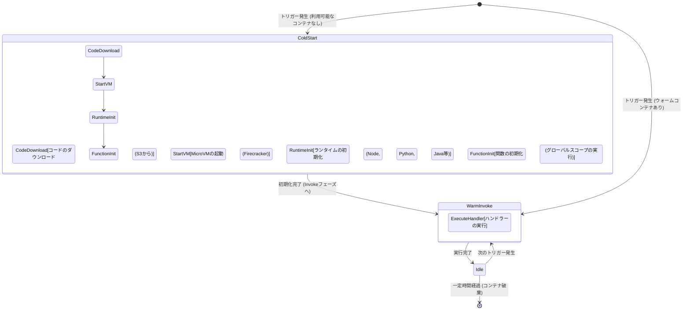
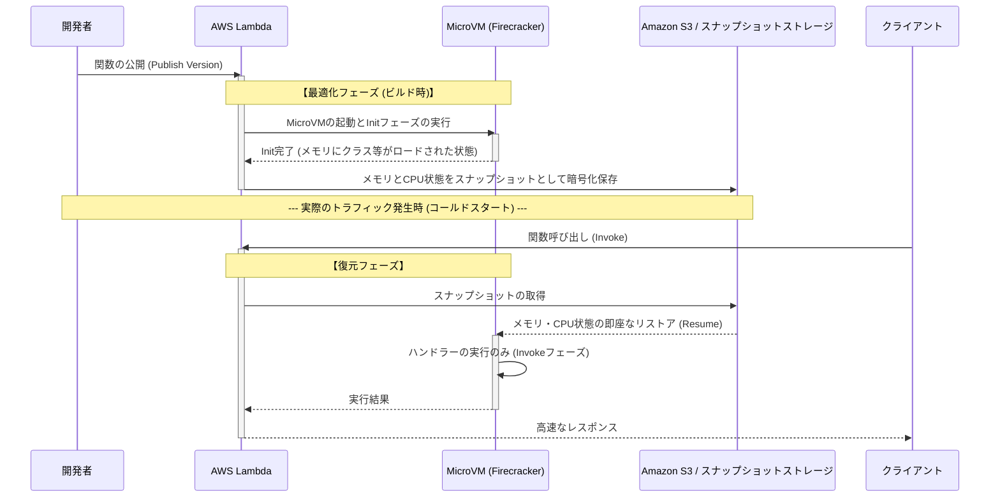

近年、クラウドコンピューティングの世界において **サーバーレスアーキテクチャ** （Serverless Architecture）はデファクトスタンダードの一つとして確固たる地位を築いています。その代表格とも言えるのが **AWS Lambda** です。「サーバーの管理が不要」「使った分だけの従量課金」「自動的なスケーリング」といった甘い言葉（光）に魅了され、多くの企業がシステムをサーバーレスへと移行してきました。

しかし、どのような技術にも必ずトレードオフ（影）が存在します。サーバーレスアーキテクチャ最大の「影」と言えるのが、本記事の主題である **コールドスタート** （Cold Start）問題です。

本記事では、サーバーレスアーキテクチャの光と影について解説しつつ、AWS Lambdaの裏側で一体何が起きているのか、そして開発者を悩ませるコールドスタート問題のメカニズムと最新の対策（SnapStartなど）について、アーキテクチャレベルから深く、網羅的に掘り下げていきます。

---

## 1. サーバーレスアーキテクチャの「光」

まずは、なぜこれほどまでにサーバーレスアーキテクチャが支持されているのか、その圧倒的なメリット（光）について整理しましょう。

### 1.1. インフラ管理からの解放（NoOps）

従来のオンプレミスや、IaaS（Amazon EC2など）を利用したアーキテクチャでは、OSのパッチ当て、セキュリティアップデート、サーバーの死活監視など、インフラストラクチャの運用保守（Ops）に膨大なリソースを割く必要がありました。

サーバーレスアーキテクチャでは、これらのインフラストラクチャ管理をすべてクラウドプロバイダー（AWSなど）にオフロードできます。開発者は「ビジネスロジックのコーディング」という、本来最も価値を生み出す作業にのみ集中できるようになります。

### 1.2. 究極のオートスケーリング

サーバーレスのもう一つの強力な武器は、トラフィックの増減に対する **シームレスなスケーリング** です。

たとえば、ECサイトでタイムセールが開始され、平常時の100倍のアクセスが瞬間的に発生したとします。従来のアーキテクチャでは、あらかじめピークに合わせてサーバーを過剰にプロビジョニングしておくか、複雑なオートスケーリンググループのチューニングが必要でした。

AWS Lambdaの場合、リクエストが来るたびに独立した実行環境（[コンテナ](https://kenji.blog/p/docker-container-namespace-cgroups-layers/)）が瞬時に立ち上がり、リクエストを処理します。アクセスがゼロの時はリソースを完全にゼロに落とし、アクセスが急増した時は自動的に並列実行数を増やして対応します。

### 1.3. 従量課金によるコスト最適化

サーバーレスは、ミリ秒単位（Lambdaの場合は1ms単位）の実行時間と、割り当てたメモリ量に対してのみ課金されます。アイドル状態（誰もアクセスしていない状態）の時は一切コストがかかりません。

これにより、アクセスの波が激しいシステムや、夜間に利用されない社内システムなどにおいて、劇的なコスト削減効果をもたらします。

---

## 2. サーバーレスの「影」と、その正体

光が強ければ強いほど、影も濃くなります。サーバーレスは「サーバーがない」わけではありません。「サーバーの管理をクラウドプロバイダーに任せている」だけです。裏側では確実に物理サーバーが動き、OSが稼働し、その上で私たちのコードが実行されています。

この「裏側の仕組み」を理解していないと、予期せぬパフォーマンス劣化やアーキテクチャ上の制限に直面することになります。

### 2.1. 状態を持てない（ステートレス）

Lambda関数は基本的に **ステートレス** であることが求められます。実行環境はリクエストごとに使い捨てられる（または再利用される）ため、ローカルのファイルシステムやメモリ上のデータが次のリクエストに引き継がれる保証はありません。

状態を保持するためには、Amazon DynamoDB や ElastiCache、S3といった外部の永続化ストレージやインメモリデータベースを組み合わせる必要があります。

### 2.2. 実行時間の制限

AWS Lambdaには、1回の実行につき最大 **15分** （900秒）というタイムアウト制限があります。何時間もかかるバッチ処理などをそのままLambdaに移行することはできません。そうした処理は AWS Step Functions や AWS Batch、Amazon ECSなどを活用して分割・非同期化する必要があります。

### 2.3. コールドスタート問題

そして最大の影が **コールドスタート** です。自動スケーリングの恩恵を受ける反面、新しい実行環境を立ち上げる際の「初期化のオーバーヘッド」がレイテンシの遅延として現れます。

---

## 3. AWS Lambdaの裏側：FirecrackerマイクロVMの仕組み

コールドスタートを理解するためには、AWS Lambdaが裏側でどのようにコードを実行しているのか、その基盤技術を知る必要があります。

AWS Lambdaは当初、Linuxコンテナ（LXC/[Docker](https://kenji.blog/p/docker-container-namespace-[cgroups](https://kenji.blog/p/docker-container-namespace-cgroups-layers/)-layers/)に近い技術）を用いてアイソレーション（隔離）を行っていました。しかし、セキュリティと起動速度、集約密度のバランスを極限まで高めるため、AWSは **Firecracker** （ファイアクラッカー）というオープンソースの仮想化技術を独自開発しました。

### 3.1. Firecrackerとは何か？

Firecrackerは、KVM（Kernel-based Virtual Machine）を利用して、軽量な「マイクロVM（MicroVM）」をミリ秒単位で起動するための仮想マシンモニター（VMM）です。Rust言語で書かれており、従来の仮想マシン（QEMUなど）と比較して、不要なデバイスモデルを極限まで削ぎ落とすことで、極めて高速な起動と低いメモリオーバーヘッドを実現しています。

```mermaid
graph TD
    subgraph Host_OS [Host OS (EC2 Bare Metal)]
        KVM[KVM - Kernel-based Virtual Machine]
        subgraph Firecracker_Process_1 [Firecracker Process (MicroVM 1)]
            GuestOS_1[Guest OS / Minimal Linux]
            Runtime_1[Lambda Runtime]
            Function_1[User Function Code]
            GuestOS_1 --> Runtime_1 --> Function_1
        end
        subgraph Firecracker_Process_2 [Firecracker Process (MicroVM 2)]
            GuestOS_2[Guest OS / Minimal Linux]
            Runtime_2[Lambda Runtime]
            Function_2[User Function Code]
            GuestOS_2 --> Runtime_2 --> Function_2
        end
        KVM --> Firecracker_Process_1
        KVM --> Firecracker_Process_2
    end
```

マルチテナント環境であるAWSインフラにおいて、異なる顧客のコードを同じ物理サーバー上で安全に実行するために、Firecrackerによる強固なハードウェアレベルの仮想化境界が提供されています。これが、Lambdaが安全かつスケーラブルである理由の根幹です。

---

## 4. コールドスタートの解剖学

Lambda関数が呼び出されたとき、すでに起動済みの待機中MicroVM（ウォーム[コンテナ](https://kenji.blog/p/docker-container-namespace-cgroups-layers/)）が存在しない場合、AWS側は新しいMicroVMをプロビジョニングする必要があります。この一連の初期化プロセスによって発生する遅延が **コールドスタート** です。

### 4.1. ライフサイクルとレイテンシの内訳

Lambdaのライフサイクルは、以下のMermaid状態遷移図のように表すことができます。



コールドスタートにかかる時間は、大きく分けて **AWS側の初期化** （プラットフォームオーバーヘッド）と **ユーザー側の初期化** （コードオーバーヘッド）に分かれます。

1. **コードのダウンロードと解凍**: デプロイパッケージがS3からダウンロードされ、環境に展開されます。パッケージサイズ（依存ライブラリの量）に比例して時間がかかります。
2. **MicroVMの起動**: Firecrackerが起動します。ここはAWS側の最適化により非常に高速（ミリ秒単位）です。
3. **ランタイムの初期化**: Node.js、Python、Javaなどのプロセスが起動します。特にJavaやC#などのJIT（Just-In-Time）コンパイルを行う言語は、ここで大きな時間を消費します。
4. **関数の初期化 (Init Phase)**: コードのグローバルスコープ（ハンドラー関数の外側）が評価されます。ここでDBへの接続プールを作成したり、重いSDKを初期化したりすると、初期化時間が長引きます。

### 4.2. 確率論から見るコールドスタート

キューイング理論（M/M/cモデルなど）を用いて、コールドスタートが発生する確率を数学的にモデル化することができます。
リクエストの到着率を $\lambda$、ウォーム[コンテナ](https://kenji.blog/p/docker-container-namespace-cgroups-layers/)の生存時間を $T_w$、処理時間を $\mu$ とすると、トラフィックがスパイクした際に必要な並列数（コンテナ数）が急増し、コールドスタート確率が上昇します。

定常状態において、ウォームコンテナが再利用される確率 $P_{warm}$ は以下のように近似されることがあります。

$$ P_{warm} \approx 1 - e^{-\lambda \cdot T_w} $$

つまり、リクエスト頻度 $\lambda$ が高いほど、またはコンテナの生存時間 $T_w$ が長いほど、コールドスタートに遭遇する確率は低くなります。逆に、たまにしかアクセスされないAPIでは、高い確率でコールドスタートを踏むことになります。

---

## 5. コールドスタートを打倒する最適化戦略

コールドスタートはサーバーレスの宿命ですが、アーキテクチャ設計や実装の工夫により、その影響を最小限に抑えることが可能です。

### 5.1. プログラミング言語の選択

コールドスタートの速度は言語によって劇的に異なります。

- **最速グループ**: Go、Rust、C++ などのAOT（Ahead-Of-Time）コンパイル言語、および軽量なスクリプト言語（Python、Node.js）。これらはコールドスタートが数百ミリ秒以内に収まりやすいです。
- **遅いグループ**: Java、C# (.NET)。JVMやCLRの起動、JITコンパイルのオーバーヘッドにより、数秒〜十数秒のコールドスタートが発生する場合があります。

**LLRT (Low Latency Runtime)** のような、AWSが提供する実験的な軽量JavaScriptランタイムを利用することで、Node.jsの起動速度をさらに短縮するアプローチも注目されています。

### 5.2. デプロイパッケージの軽量化

Lambdaは起動時にコードをS3からダウンロードします。したがって、パッケージサイズを小さく保つことが直結する最適化となります。
不要な依存関係（DevDependencies等）を含めないことや、Webpack / esbuild などのバンドラーを用いてコードを最小化（Minify）およびツリーシェイキング（Tree-shaking）することが非常に重要です。

### 5.3. 初期化処理の最適化と遅延評価 (Lazy Initialization)

グローバルスコープでの処理は、Lambda関数のInitフェーズで実行されます。ここでの処理を最適化することが、コールドスタート短縮の鍵です。

例えば、AWS SDKを利用する場合、必要なモジュールだけをインポートします。

```javascript
// ❌ 悪い例: SDK全体を読み込むため初期化が遅い
const AWS = require('aws-sdk');
const dynamo = new AWS.DynamoDB.DocumentClient();

// ✅ 良い例: 必要なクライアントのみを読み込む (v3 SDKの利用)
const { DynamoDBClient } = require("@aws-sdk/client-dynamodb");
const { DynamoDBDocumentClient } = require("@aws-sdk/lib-dynamodb");

const client = new DynamoDBClient({});
const dynamo = DynamoDBDocumentClient.from(client);
```

また、全てのリクエストで必ずしも必要でないリソース（特定の処理パスでしか使わないDB接続など）は、関数ハンドラー内で遅延評価（Lazy Initialization）させるテクニックも有効です。

### 5.4. プロビジョニングされた同時実行 (Provisioned Concurrency)

どうしてもコールドスタートをゼロにしたいエンタープライズ向けの要件に対して、AWSは **Provisioned Concurrency** （プロビジョニングされた同時実行）というソリューションを提供しています。

これは、あらかじめ指定した数のLambda実行環境を初期化済みのウォーム状態でスタンバイさせておく機能です。これにより、コールドスタートを完全に排除し、常に一貫した低レイテンシ（数ミリ秒）を実現できます。

ただし、待機させている間もコストが発生するため、「従量課金」というサーバーレスの恩恵が一部損なわれるというジレンマ（トレードオフ）があります。

---

## 6. ゲームチェンジャー：AWS Lambda SnapStart

Javaのような起動の遅い言語の救世主として登場したのが **AWS Lambda SnapStart** です。これは仮想マシンの状態をスナップショット化し、コールドスタート時にそれを復元するという画期的な技術です。

背景技術として **CRaU** (Checkpoint/Restore in Userspace) および FirecrackerのMicroVMスナップショット機能が利用されています。

### 6.1. SnapStartのメカニズム

以下のシーケンス図は、SnapStartがどのように機能するかを示しています。



### 6.2. SnapStartのメリットと注意点

SnapStartを有効にすると、Java関数のコールドスタート時間が **最大10倍以上** 高速化されます。ランタイムの起動やJITコンパイル、Spring Bootなどの重いフレームワークの初期化が「デプロイ時」に前倒しされるためです。

ただし、いくつかの注意点があります。

1. **状態の乱数問題**: 復元されたVMは全く同じメモリスナップショットから開始されるため、標準的な疑似乱数生成器（PRNG）のシード状態も同じになります。暗号論的セキュリティに関わる乱数は、OSの `/dev/urandom` 等を利用して安全に再初期化する必要があります（AWS側で対策ライブラリが提供されています）。
2. **ネットワーク接続の切断**: 初期化フェーズで張ったデータベースへのTCP接続などは、スナップショットから復元された時点ではすでにサーバー側でタイムアウトして切断されている可能性があります。そのため、接続エラーを検知して再接続するロジック（リトライ機構）をハンドラー内に実装する必要があります。

---

## 7. 結論：サーバーレスは銀の弾丸か？

サーバーレスアーキテクチャ、とりわけAWS Lambdaは、間違いなくクラウドネイティブアプリケーション設計のパラダイムシフトをもたらしました。

インフラ管理の負担軽減、コスト最適化、瞬時のスケーリングという「光」は、スタートアップから大企業まで、ビジネスの俊敏性（アジリティ）を劇的に向上させます。

しかし、コールドスタート、ステートレス制約、VPCネットワーキングの複雑さといった「影」を無視して設計すると、本番環境で思わぬ痛手を見ることになります。

重要なのは、**「銀の弾丸」は存在しない** というエンジニアリングの基本原則を忘れないことです。

- **レイテンシに極度に厳しいシステム**（例: オンライン対戦ゲームのコアロジック、ミリ秒単位の高頻度取引）には、サーバーレスよりも常時稼働の[コンテナ](https://kenji.blog/p/docker-container-namespace-cgroups-layers/)（Amazon ECS/EKS）が適しているかもしれません。
- **バーストトラフィックが多い非同期処理** や、**運用コストを極小化したいWeb API** には、AWS Lambdaが最高の選択肢となります。

アーキテクチャの特性を深く理解し、適材適所で技術を選定すること。それこそが、サーバーレスの「光」を最大限に浴びつつ、「影」を制御する唯一の道なのです。

---
*本記事は、サーバーレスアーキテクチャの内部構造を探求し、実践的な最適化手法を共有するために執筆されました。パフォーマンスチューニングの世界に終わりはありません。継続的な計測と改善を楽しんでいきましょう！*
