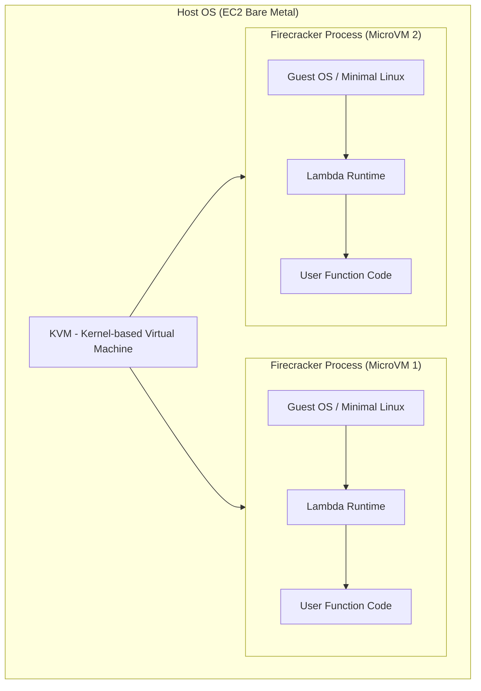
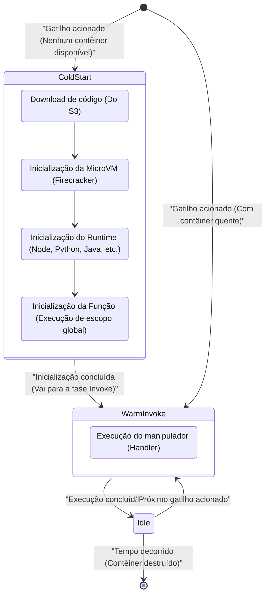
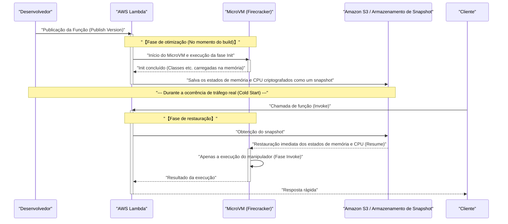

Nos últimos anos, no mundo da computação em nuvem, a **Arquitetura Serverless** (Serverless Architecture) estabeleceu uma posição sólida como um dos padrões de fato. Um dos exemplos mais representativos é o **AWS Lambda** . Seduzidas por doces promessas (a "luz") como "não é necessário gerenciar servidores", "pagamento conforme o uso (pay-as-you-go)" e "escalabilidade automática", muitas empresas migraram seus sistemas para o serverless.

No entanto, toda tecnologia tem seus compromissos (a "sombra"). O maior "sombra" da arquitetura serverless é o problema do **Cold Start** , que é o tema principal deste artigo.

Neste artigo, explicaremos a luz e a sombra da arquitetura serverless, o que exatamente acontece nos bastidores do AWS Lambda, os mecanismos do problema de cold start que incomoda os desenvolvedores, e as contramedidas mais recentes (como o SnapStart), explorando de forma profunda e abrangente a partir do nível da arquitetura.

---

## 1. A "Luz" da Arquitetura Serverless

Primeiro, vamos resumir por que a arquitetura serverless é tão apoiada e quais são suas vantagens esmagadoras (a "luz").

### 1.1. Libertação do Gerenciamento de Infraestrutura (NoOps)

Nas arquiteturas tradicionais locais (on-premises) ou usando IaaS (como Amazon EC2), era necessário alocar recursos massivos para a operação e manutenção (Ops) da infraestrutura, como aplicação de patches no OS, atualizações de segurança e monitoramento de integridade dos servidores.

Com a arquitetura serverless, todo esse gerenciamento de infraestrutura pode ser descarregado para o provedor de nuvem (como a AWS). Os desenvolvedores podem se concentrar apenas na tarefa que originalmente gera mais valor: a "codificação da lógica de negócios".

### 1.2. Auto Scaling Definitivo

Outra arma poderosa do serverless é a **escalabilidade contínua** em resposta a aumentos e diminuições no tráfego.

Por exemplo, suponha que uma liquidação relâmpago comece em um site de comércio eletrônico, gerando instantaneamente 100 vezes o tráfego normal. Em arquiteturas tradicionais, seria necessário provisionar servidores em excesso antecipadamente para lidar com o pico, ou realizar ajustes complexos em grupos de auto scaling.

No caso do AWS Lambda, cada vez que chega uma solicitação, um ambiente de execução independente (contêiner) é iniciado instantaneamente para processar a solicitação. Quando os acessos caem a zero, os recursos são reduzidos completamente a zero, e quando os acessos disparam, ele aumenta automaticamente o número de execuções paralelas para responder.

### 1.3. Otimização de Custos por Pay-As-You-[Go](https://kenji.blog/pt/p/programming-languages-history-paradigm-evolution/)

O serverless cobra apenas pelo tempo de execução em milissegundos (incrementos de 1ms para o Lambda) e pela quantidade de memória alocada. Durante o estado ocioso (quando ninguém está acessando), não há custo algum.

Isso traz efeitos dramáticos de redução de custos em sistemas com flutuações extremas de tráfego, ou sistemas internos que não são usados à noite.

---

## 2. A "Sombra" do Serverless e sua Verdadeira Natureza

Quanto mais forte a luz, mais escura a sombra. Serverless não significa que "não há servidores". Significa apenas que "o gerenciamento dos servidores é deixado a cargo do provedor de nuvem". Nos bastidores, há servidores físicos funcionando de forma confiável, sistemas operacionais (OS) operando, e nosso código é executado sobre eles.

Se não compreendermos esses "mecanismos dos bastidores", enfrentaremos degradação inesperada de desempenho ou restrições arquiteturais.

### 2.1. Incapacidade de Manter Estado (Stateless)

As funções do Lambda, por princípio, devem ser **stateless** . Como os ambientes de execução são descartáveis (ou reutilizados) a cada solicitação, não há garantia de que o sistema de arquivos local ou os dados na memória sejam preservados para a próxima solicitação.

Para preservar o estado, é necessário integrá-las a armazenamentos de persistência externos ou bancos de dados em memória, como Amazon DynamoDB, ElastiCache ou S3.

### 2.2. Limite de Tempo de Execução

O AWS Lambda tem um tempo limite máximo de **15 minutos** (900 segundos) por execução. Processamentos em lote que levam horas não podem ser migrados diretamente para o Lambda. Esses processamentos precisam ser divididos e tornados assíncronos utilizando serviços como AWS Step Functions, AWS Batch ou Amazon ECS.

### 2.3. O Problema do Cold Start

E a maior sombra é o **Cold Start** . Embora você se beneficie do escalonamento automático, a "sobrecarga de inicialização" ao criar um novo ambiente de execução se manifesta como atraso na latência (latency).

---

## 3. Bastidores do AWS Lambda: O Mecanismo das MicroVMs Firecracker

Para entender o cold start, precisamos conhecer a tecnologia fundamental de como o AWS Lambda executa o código nos bastidores.

Inicialmente, o AWS Lambda usava contêineres Linux (tecnologia semelhante a LXC/[Docker](https://kenji.blog/pt/p/docker-container-namespace-[cgroups](https://kenji.blog/pt/p/docker-container-namespace-cgroups-layers/)-layers/)) para fornecer isolamento. No entanto, para maximizar o equilíbrio entre segurança, velocidade de inicialização e densidade de consolidação, a AWS desenvolveu sua própria tecnologia de virtualização de código aberto chamada **Firecracker** .

### 3.1. O que é o Firecracker?

O Firecracker é um monitor de máquina virtual (Virtual Machine Monitor - VMM) que usa KVM (Kernel-based Virtual Machine) para iniciar "MicroVMs" leves em milissegundos. Escrito na linguagem [Rust](https://kenji.blog/pt/p/programming-languages-history-paradigm-evolution/), ele corta os modelos de dispositivos desnecessários até o limite extremo em comparação com máquinas virtuais tradicionais (como QEMU), alcançando uma inicialização extremamente rápida e baixa sobrecarga de memória.



Em uma infraestrutura AWS com múltiplos locatários (multi-tenant), fronteiras robustas de virtualização em nível de hardware são fornecidas pelo Firecracker para executar com segurança o código de diferentes clientes no mesmo servidor físico. Essa é a base de por que o Lambda é seguro e escalável.

---

## 4. Anatomia do Cold Start

Quando uma função do Lambda é chamada, se não houver uma MicroVM em espera já iniciada (um contêiner quente - warm container), o lado da AWS precisará provisionar uma nova MicroVM. O atraso causado por esta série de processos de inicialização é o **Cold Start** .

### 4.1. Ciclo de Vida e Divisão de Latência

O ciclo de vida do Lambda pode ser representado pelo diagrama de transição de estado Mermaid abaixo.



O tempo gasto no cold start pode ser dividido principalmente em **inicialização do lado da AWS** (sobrecarga da plataforma) e **inicialização do lado do usuário** (sobrecarga de código).

1. **Download e extração do código**: O pacote de implantação é baixado do S3 e extraído no ambiente. O tempo gasto é proporcional ao tamanho do pacote (quantidade de dependências).
2. **Inicialização da MicroVM**: O Firecracker é iniciado. Esta etapa é muito rápida (na ordem dos milissegundos) devido às otimizações do lado da AWS.
3. **Inicialização do Runtime**: Os processos do Node.js, Python, [Java](https://kenji.blog/pt/p/programming-languages-history-paradigm-evolution/), etc., são iniciados. As linguagens que usam compilação JIT (Just-In-Time), em particular Java e C#, consomem bastante tempo aqui.
4. **Inicialização da função (Fase Init)**: O escopo global do código (fora da função do manipulador) é avaliado. Se você criar pools de conexões de banco de dados aqui ou inicializar SDKs pesados, o tempo de inicialização se estenderá.

### 4.2. O Cold Start Visto a partir da Teoria das Probabilidades

Podemos usar a teoria das filas (como o modelo M/M/c) para modelar matematicamente a probabilidade de ocorrência de um cold start.
Seja a taxa de chegada de solicitações $\lambda$, o tempo de sobrevivência do contêiner quente $T_w$, e o tempo de processamento $\mu$. Quando ocorrem picos de tráfego, o número de paralelismos necessários (número de contêineres) aumenta rapidamente e a probabilidade de cold start sobe.

Em estado estacionário, a probabilidade de um contêiner quente ser reutilizado $P_{warm}$ pode ser aproximada da seguinte forma:

$ P_{warm} \approx 1 - e^{-\lambda \cdot T_w} $

Em outras palavras, quanto maior a frequência de solicitações $\lambda$ ou quanto mais longo o tempo de vida do contêiner $T_w$, menor a probabilidade de encontrar um cold start. Por outro lado, para APIs que são acessadas apenas ocasionalmente, você vai se deparar com um cold start com alta probabilidade.

---

## 5. Estratégias de Otimização para Derrotar o Cold Start

Embora o cold start seja o destino do serverless, é possível minimizar seu impacto por meio de design de arquitetura e otimizações de implementação.

### 5.1. Escolha da Linguagem de Programação

A velocidade do cold start varia dramaticamente dependendo da linguagem.

- **Grupo mais rápido**: Linguagens compiladas AOT (Ahead-Of-Time) como [Go](https://kenji.blog/pt/p/programming-languages-history-paradigm-evolution/), [Rust](https://kenji.blog/pt/p/programming-languages-history-paradigm-evolution/) e C++, bem como linguagens de script leves (Python, Node.js). Estas tendem a manter o cold start dentro de poucas centenas de milissegundos.
- **Grupo lento**: Java, C# (.NET). Devido à inicialização da JVM ou CLR e à sobrecarga da compilação JIT, podem ocorrer cold starts de vários segundos a mais de dez segundos.

A abordagem de usar tempos de execução JavaScript experimentais de baixo peso fornecidos pela AWS, como o **LLRT (Low Latency Runtime)** , para reduzir ainda mais o tempo de inicialização do Node.js, também está atraindo atenção.

### 5.2. Redução do Pacote de Implantação

O Lambda baixa o código do S3 durante a inicialização. Portanto, manter o tamanho do pacote pequeno é uma otimização direta.
É de extrema importância não incluir dependências desnecessárias (como DevDependencies) e minimizar (Minify) e aplicar o sacudimento de árvores ([Tree](https://kenji.blog/pt/p/tree-graph-data-structures-search-dfs-bfs-dijkstra/)-shaking) no código usando empacotadores (bundlers) como Webpack / esbuild.

### 5.3. Otimização do Processo de Inicialização e Avaliação Preguiçosa (Lazy Initialization)

O processamento no escopo global é executado na fase Init da função Lambda. Otimizar o processamento aqui é a chave para reduzir o cold start.

Por exemplo, ao usar o AWS SDK, importe apenas os módulos necessários.

```javascript
// ❌ Exemplo ruim: a inicialização é lenta devido ao carregamento de todo o SDK
const AWS = require('aws-sdk');
const dynamo = new AWS.DynamoDB.DocumentClient();

// ✅ Bom exemplo: carregar apenas os clientes necessários (uso do SDK v3)
const { DynamoDBClient } = require("@aws-sdk/client-dynamodb");
const { DynamoDBDocumentClient } = require("@aws-sdk/lib-dynamodb");

const client = new DynamoDBClient({});
const dynamo = DynamoDBDocumentClient.from(client);
```

Além disso, para recursos que não são necessariamente essenciais em todas as solicitações (como conexões com o banco de dados que são usadas apenas em caminhos de processamento específicos), a técnica de fazer a avaliação preguiçosa (Lazy Initialization) dentro do manipulador da função também é eficaz.

### 5.4. Simultaneidade Provisionada (Provisioned Concurrency)

Para requisitos orientados a empresas em que os cold starts devem ser reduzidos a zero de qualquer forma, a AWS oferece uma solução chamada **Provisioned Concurrency** (Simultaneidade provisionada).

Esse é um recurso que permite que você mantenha um número especificado de ambientes de execução do Lambda pré-inicializados (quentes) em modo de espera. Com isso, os cold starts são completamente eliminados e uma baixa latência consistente (poucos milissegundos) pode sempre ser alcançada.

No entanto, como os custos incorrem enquanto eles são mantidos em espera, existe o dilema (trade-off) de que o benefício da arquitetura serverless de "pagamento por uso (pay-as-you-go)" se perde parcialmente.

---

## 6. O Divisor de Águas: AWS Lambda SnapStart

O salvador que emergiu para as linguagens de inicialização lenta, como [Java](https://kenji.blog/pt/p/programming-languages-history-paradigm-evolution/), foi o **AWS Lambda SnapStart** . Esta é uma tecnologia revolucionária que captura um snapshot do estado de uma máquina virtual e o restaura durante o cold start.

As tecnologias de base por trás disso utilizam o **CRaU** (Checkpoint/Restore in Userspace) e a capacidade de snapshot do MicroVM do Firecracker.

### 6.1. Mecanismo do SnapStart

O diagrama de sequência abaixo ilustra como o SnapStart funciona.



### 6.2. Vantagens e Pontos de Atenção do SnapStart

Quando o SnapStart é ativado, o tempo de cold start de funções [Java](https://kenji.blog/pt/p/programming-languages-history-paradigm-evolution/) pode ser acelerado em **até mais de 10 vezes** . Isso ocorre porque a inicialização do runtime, a compilação JIT e a inicialização de frameworks pesados, como o Spring Boot, são adiantadas no "momento do deploy".

Entretanto, há alguns pontos de atenção.

1. **O problema de estado de números aleatórios**: Uma vez que a VM restaurada começa a partir exatamente do mesmo snapshot de memória, o estado da semente do gerador de números pseudoaleatórios (PRNG) padrão também será o mesmo. Números aleatórios vitais para a segurança criptográfica devem ser reinicializados com segurança usando `/dev/urandom` do OS ou semelhante (a AWS providencia bibliotecas como soluções de contorno).
2. **Quedas de conexão de rede**: Conexões TCP, como aquelas de banco de dados estabelecidas na fase de inicialização, podem já ter expirado (timeout) e sido fechadas pelo servidor no momento em que são restauradas do snapshot. Portanto, é necessário implementar a lógica para detectar erros de conexão e reconectar (um mecanismo de tentativas - retry) dentro do manipulador (handler).

---

## 7. Conclusão: Serverless é uma Bala de Prata?

A arquitetura serverless, com destaque para o AWS Lambda, introduziu inegavelmente uma mudança de paradigma no design de aplicativos nativos de nuvem (cloud-native).

A "luz", como redução da sobrecarga de gerenciamento de infraestrutura, otimização de custos e escalabilidade imediata, aumenta drasticamente a agilidade dos negócios, desde as startups até as grandes corporações.

No entanto, ignorar a "sombra", como o cold start, as limitações sem estado (stateless) e a complexidade de redes de VPC, resultará em sofrimentos inesperados no ambiente de produção.

É essencial não esquecer o princípio fundamental da engenharia de que **"não existe bala de prata"** .

- Para **sistemas extremamente sensíveis à latência** (por exemplo: lógica principal de jogos multiplayer online, negociação de alta frequência em milissegundos), o uso de contêineres que estão sempre em execução (Amazon ECS/EKS) pode ser mais apropriado do que o serverless.
- Para **processamentos assíncronos com altos volumes de tráfego intermitente (burst traffic)** , e **Web APIs em que se deseja minimizar os custos operacionais** , o AWS Lambda continua sendo a melhor escolha.

Entenda profundamente as características da arquitetura e escolha a tecnologia de forma adequada à situação (a pessoa certa no lugar certo). Esse é o único caminho para tirar o máximo proveito da "luz" do serverless enquanto ainda controla a "sombra".

---
*Este artigo foi escrito para explorar as estruturas internas da arquitetura serverless e compartilhar métodos práticos de otimização. Não há fim para o mundo do ajuste de desempenho. Vamos continuar a medir e melhorar de forma contínua e agradável!*
