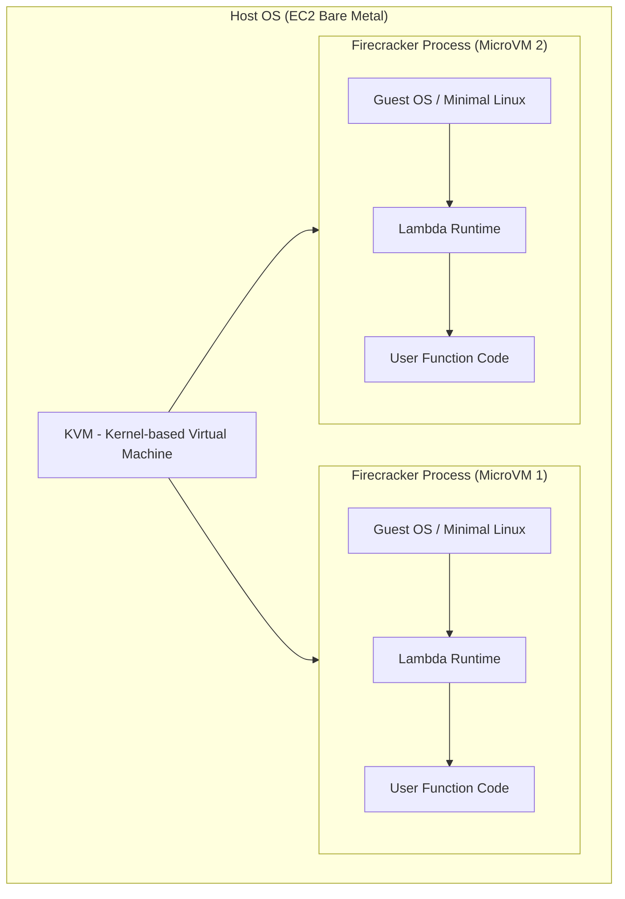
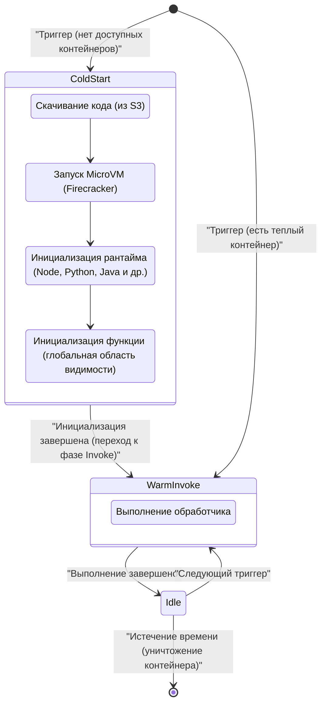
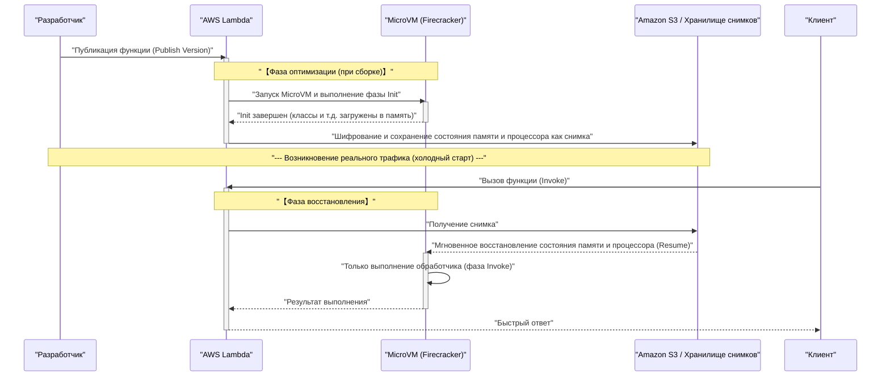

В последние годы в мире облачных вычислений **бессерверная архитектура** (Serverless Architecture) прочно заняла позиции одного из стандартов де-факто. Ярким ее представителем является **AWS Lambda**. Привлеченные такими сладкими обещаниями (светом), как «отсутствие необходимости управлять серверами», «оплата только за использованные ресурсы» и «автоматическое масштабирование», многие компании перевели свои системы на бессерверную архитектуру.

Однако у любой технологии всегда есть компромиссы (тень). Самой большой «тенью» бессерверной архитектуры является проблема **холодного старта** (Cold Start), которая и станет главной темой этой статьи.

В этой статье мы обсудим свет и тень бессерверной архитектуры, подробно и всесторонне, на уровне архитектуры, разберем, что именно происходит за кулисами AWS Lambda, а также рассмотрим механизм проблемы холодного старта, мучающей разработчиков, и новейшие способы борьбы с ней (такие как SnapStart).

---

## 1. «Свет» бессерверной архитектуры

Сначала давайте разберемся, почему бессерверная архитектура пользуется такой огромной поддержкой, и систематизируем ее подавляющие преимущества (свет).

### 1.1. Освобождение от управления инфраструктурой (NoOps)

В традиционных локальных средах (on-premises) и архитектурах с использованием IaaS (например, Amazon EC2) приходилось тратить огромные ресурсы на эксплуатацию и обслуживание инфраструктуры (Ops), такие как установка патчей ОС, обновления безопасности и мониторинг работоспособности серверов.

В бессерверной архитектуре все это управление инфраструктурой можно переложить на плечи облачного провайдера (например, AWS). Разработчики могут сосредоточиться исключительно на «написании бизнес-логики» — задаче, которая изначально приносит наибольшую ценность.

### 1.2. Идеальное автомасштабирование

Еще одним мощным оружием бессерверных вычислений является **бесшовное масштабирование** в ответ на колебания трафика.

Например, представьте, что на сайте электронной коммерции началась распродажа, и мгновенно возник трафик, в 100 раз превышающий обычный. В традиционной архитектуре потребовалось бы заранее избыточно выделить серверы под пиковую нагрузку или выполнить сложную настройку групп автомасштабирования.

В случае AWS Lambda при каждом запросе мгновенно запускается независимая среда выполнения (контейнер) для его обработки. Когда обращений нет, ресурсы полностью сводятся к нулю, а при резком скачке обращений количество параллельных выполнений автоматически увеличивается.

### 1.3. Оптимизация затрат за счет оплаты по мере использования

В бессерверных вычислениях оплата взимается только за время выполнения с точностью до миллисекунды (в случае Lambda — до 1 мс) и выделенный объем памяти. В состоянии простоя (когда никто не обращается к системе) затраты абсолютно отсутствуют.

Это приносит колоссальный эффект снижения затрат для систем с резкими колебаниями трафика или внутренних корпоративных систем, которые не используются в ночное время.

---

## 2. «Тень» бессерверных вычислений и ее истинная природа

Чем ярче свет, тем гуще тень. Бессерверность не означает, что «серверов нет вообще». Она означает лишь, что «управление серверами доверено облачному провайдеру». За кулисами абсолютно точно работают физические серверы, функционируют ОС, и поверх них выполняется наш код.

Если не понимать эти «закулисные механизмы», можно столкнуться с неожиданным снижением производительности и архитектурными ограничениями.

### 2.1. Невозможность сохранения состояния (Stateless)

От функций Lambda, как правило, требуется быть **без сохранения состояния** (Stateless). Поскольку среда выполнения создается и уничтожается (или переиспользуется) для каждого запроса, нет никаких гарантий, что локальная файловая система или данные в памяти будут доступны для следующего запроса.

Для сохранения состояния необходимо комбинировать Lambda с внешними хранилищами данных или базами данных в памяти, такими как Amazon DynamoDB, ElastiCache и S3.

### 2.2. Ограничение времени выполнения

В AWS Lambda установлено строгое ограничение по времени (тайм-аут): максимум **15 минут** (900 секунд) на одно выполнение. Нельзя просто взять и перенести в Lambda пакетную обработку, занимающую многие часы. Такие процессы необходимо разделять и делать асинхронными с помощью таких сервисов, как AWS Step Functions, AWS Batch или Amazon ECS.

### 2.3. Проблема холодного старта

И самая большая тень — это **холодный старт**. Несмотря на все блага автомасштабирования, «накладные расходы на инициализацию» при запуске новой среды выполнения проявляются в виде задержек (latency).

---

## 3. Изнанка AWS Lambda: Механизм микро-ВМ Firecracker

Чтобы понять холодный старт, нужно узнать базовую технологию — как именно AWS Lambda выполняет код за кулисами.

Изначально AWS Lambda использовала контейнеры Linux (технологию, близкую к LXC/[Docker](https://kenji.blog/ru/p/docker-container-namespace-[cgroups](https://kenji.blog/ru/p/docker-container-namespace-cgroups-layers/)-layers/)) для обеспечения изоляции. Однако, чтобы довести до предела баланс между безопасностью, скоростью запуска и плотностью размещения, AWS самостоятельно разработала технологию виртуализации с открытым исходным кодом под названием **Firecracker**.

### 3.1. Что такое Firecracker?

Firecracker — это монитор виртуальных машин (VMM), использующий KVM (Kernel-based Virtual Machine) для запуска легковесных «микро-ВМ» (MicroVM) за миллисекунды. Он написан на языке [Rust](https://kenji.blog/ru/p/programming-languages-history-paradigm-evolution/) и, по сравнению с традиционными виртуальными машинами (например, QEMU), за счет максимального удаления ненужных моделей устройств обеспечивает чрезвычайно быстрый запуск и низкие накладные расходы по памяти.



В мультиарендной (multi-tenant) среде инфраструктуры AWS, чтобы безопасно выполнять код разных клиентов на одном физическом сервере, Firecracker предоставляет надежные границы виртуализации на аппаратном уровне. В этом кроется основная причина безопасности и масштабируемости Lambda.

---

## 4. Анатомия холодного старта

Когда функция Lambda вызывается, и если не существует уже запущенной и ожидающей микро-ВМ (теплого контейнера), AWS необходимо инициализировать новую микро-ВМ. Задержка, возникающая в результате этого процесса инициализации, и есть **холодный старт**.

### 4.1. Жизненный цикл и структура задержки

Жизненный цикл Lambda можно представить с помощью следующей диаграммы состояний Mermaid.



Время, затрачиваемое на холодный старт, можно грубо разделить на **инициализацию на стороне AWS** (накладные расходы платформы) и **инициализацию на стороне пользователя** (накладные расходы кода).

1. **Скачивание и распаковка кода**: Пакет развертывания скачивается из S3 и разворачивается в среде. Время зависит от размера пакета (объема зависимостей).
2. **Запуск MicroVM**: Запускается Firecracker. Благодаря оптимизациям на стороне AWS, этот этап очень быстрый (миллисекунды).
3. **Инициализация среды выполнения (Runtime)**: Запускаются процессы Node.js, Python, [Java](https://kenji.blog/ru/p/programming-languages-history-paradigm-evolution/) и др. В частности, языки, использующие JIT (Just-In-Time) компиляцию, такие как Java или C#, тратят здесь значительное время.
4. **Инициализация функции (Init Phase)**: Вычисляется глобальная область видимости кода (вне функции-обработчика). Если здесь создаются пулы подключений к БД или инициализируются тяжеловесные SDK, время инициализации увеличивается.

### 4.2. Холодный старт с точки зрения теории вероятностей

Вероятность возникновения холодного старта можно математически смоделировать с помощью теории массового обслуживания (например, модель M/M/c).
Если частота поступления запросов — $\lambda$, время жизни теплого контейнера — $T_w$, а время обработки — $\mu$, то при скачке трафика резко возрастает необходимое количество параллельных выполнений (количество контейнеров), и вероятность холодного старта увеличивается.

В установившемся режиме вероятность того, что теплый контейнер будет переиспользован $P_{warm}$, можно аппроксимировать следующим образом:

$ P_{warm} \approx 1 - e^{-\lambda \cdot T_w} $

То есть, чем выше частота запросов $\lambda$ или чем дольше время жизни контейнера $T_w$, тем ниже вероятность столкнуться с холодным стартом. И наоборот, для редко используемых API вероятность наткнуться на холодный старт будет высокой.

---

## 5. Стратегии оптимизации для победы над холодным стартом

Холодный старт — это судьба бессерверных вычислений, но за счет проектирования архитектуры и оптимизации реализации можно свести его влияние к минимуму.

### 5.1. Выбор языка программирования

Скорость холодного старта кардинально зависит от языка.

- **Самая быстрая группа**: языки с AOT (Ahead-Of-Time) компиляцией, такие как [Go](https://kenji.blog/ru/p/programming-languages-history-paradigm-evolution/), [Rust](https://kenji.blog/ru/p/programming-languages-history-paradigm-evolution/), C++, а также легковесные скриптовые языки (Python, Node.js). Их холодный старт обычно укладывается в несколько сотен миллисекунд.
- **Медленная группа**: Java, C# (.NET). Из-за запуска JVM или CLR и накладных расходов на JIT-компиляцию холодный старт может занимать от нескольких до более чем десяти секунд.

Также стоит обратить внимание на подход с использованием экспериментальных легковесных сред выполнения JavaScript от AWS, таких как **LLRT (Low Latency Runtime)**, для дальнейшего сокращения времени запуска Node.js.

### 5.2. Уменьшение размера пакета развертывания

При запуске Lambda скачивает код из S3. Следовательно, поддержание небольшого размера пакета — это прямая оптимизация.
Крайне важно не включать ненужные зависимости (например, DevDependencies) и использовать бандлеры, такие как Webpack / esbuild, для минификации (Minify) и удаления неиспользуемого кода ([Tree](https://kenji.blog/ru/p/tree-graph-data-structures-search-dfs-bfs-dijkstra/)-shaking).

### 5.3. Оптимизация инициализации и ленивые вычисления (Lazy Initialization)

Код в глобальной области видимости выполняется во время фазы Init функции Lambda. Оптимизация этих процессов является ключом к сокращению холодного старта.

Например, при использовании AWS SDK импортируйте только необходимые модули.

```javascript
// ❌ Плохой пример: инициализация медленная из-за загрузки всего SDK
const AWS = require('aws-sdk');
const dynamo = new AWS.DynamoDB.DocumentClient();

// ✅ Хороший пример: загрузка только нужных клиентов (использование SDK v3)
const { DynamoDBClient } = require("@aws-sdk/client-dynamodb");
const { DynamoDBDocumentClient } = require("@aws-sdk/lib-dynamodb");

const client = new DynamoDBClient({});
const dynamo = DynamoDBDocumentClient.from(client);
```

Также эффективным приемом является откладывание инициализации (Lazy Initialization) внутри обработчика функции для ресурсов, которые не обязательно требуются при каждом запросе (например, подключение к БД, используемое только в определенном пути выполнения).

### 5.4. Предварительно подготовленный параллелизм (Provisioned Concurrency)

Для требований корпоративного уровня, где абсолютно необходимо свести холодные старты к нулю, AWS предоставляет решение **Provisioned Concurrency** (предварительно выделенная пропускная способность).

Эта функция позволяет заранее инициализировать заданное количество сред выполнения Lambda и держать их в состоянии готовности (теплыми). Благодаря этому холодные старты полностью исключаются, и всегда обеспечивается стабильно низкая задержка (несколько миллисекунд).

Однако существует дилемма (компромисс): поскольку во время ожидания также взимается плата, часть преимуществ «оплаты по мере использования» бессерверной архитектуры теряется.

---

## 6. Меняющий правила игры: AWS Lambda SnapStart

В качестве спасителя для языков с медленным запуском, таких как [Java](https://kenji.blog/ru/p/programming-languages-history-paradigm-evolution/), появился **AWS Lambda SnapStart**. Это революционная технология, которая создает снимок состояния виртуальной машины и восстанавливает его во время холодного старта.

В качестве базовой технологии используются **CRaU** (Checkpoint/Restore in Userspace) и функция создания снимков состояния MicroVM в Firecracker.

### 6.1. Механизм SnapStart

Следующая диаграмма последовательности (sequence diagram) показывает, как работает SnapStart.



### 6.2. Преимущества и предостережения SnapStart

При включении SnapStart время холодного старта для функций [Java](https://kenji.blog/ru/p/programming-languages-history-paradigm-evolution/) ускоряется **в 10 раз и более**. Это связано с тем, что запуск среды выполнения, JIT-компиляция и инициализация тяжелых фреймворков, таких как Spring Boot, переносятся на момент «развертывания».

Однако следует учитывать несколько важных моментов:

1. **Проблема состояния случайных чисел**: Поскольку восстановленная ВМ запускается с абсолютно одинакового снимка памяти, состояние (seed) стандартного генератора псевдослучайных чисел (PRNG) также будет одинаковым. Случайные числа, критичные для криптографической безопасности, необходимо безопасно переинициализировать с использованием `/dev/urandom` ОС и т.д. (AWS предоставляет библиотеки для решения этой проблемы).
2. **Разрыв сетевых соединений**: TCP-соединения с базами данных и т.д., установленные во время фазы инициализации, могут быть уже разорваны по тайм-ауту на стороне сервера к моменту восстановления из снимка. Поэтому в обработчике необходимо реализовать логику обнаружения ошибок соединения и повторного подключения (механизм retry).

---

## 7. Заключение: Является ли бессерверная архитектура серебряной пулей?

Бессерверная архитектура, и в особенности AWS Lambda, несомненно, привела к смене парадигмы в проектировании cloud-native приложений.

Ее «свет» — снижение нагрузки на управление инфраструктурой, оптимизация затрат и мгновенное масштабирование — радикально повышает гибкость (agility) бизнеса для всех, от стартапов до крупных корпораций.

Однако, если при проектировании игнорировать такую «тень», как холодный старт, ограничения из-за отсутствия состояния и сложности сетевой настройки VPC, можно получить болезненный удар в производственной среде (production).

Важно помнить фундаментальный инженерный принцип: **«серебряной пули не существует»**.

- **Для систем с крайне жесткими требованиями к задержке** (например, базовая логика соревновательных онлайн-игр, высокочастотный трейдинг на миллисекундах), возможно, больше подойдут постоянно работающие контейнеры (Amazon ECS/EKS), чем бессерверные вычисления.
- **Для асинхронной обработки с частыми всплесками трафика** и **Web API, для которых необходимо минимизировать эксплуатационные расходы**, AWS Lambda станет идеальным выбором.

Глубоко понимать особенности архитектуры и выбирать технологии в зависимости от задачи. Только так можно в полной мере насладиться «светом» бессерверных вычислений, контролируя при этом их «тень».

---
*Эта статья была написана с целью исследования внутренней структуры бессерверной архитектуры и обмена практическими методами оптимизации. В мире настройки производительности нет конца. Давайте продолжим получать удовольствие от постоянных измерений и улучшений!*
