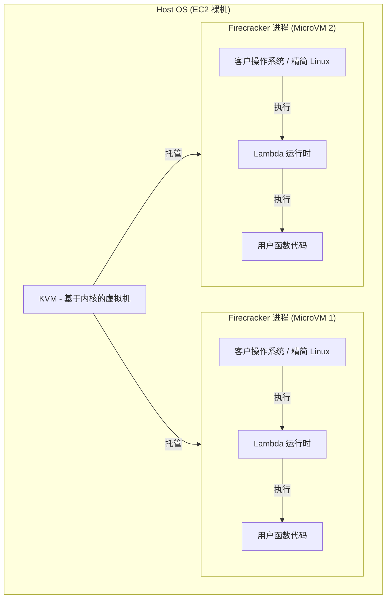
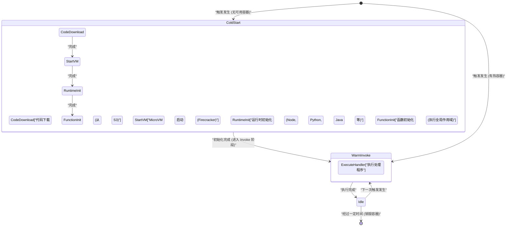
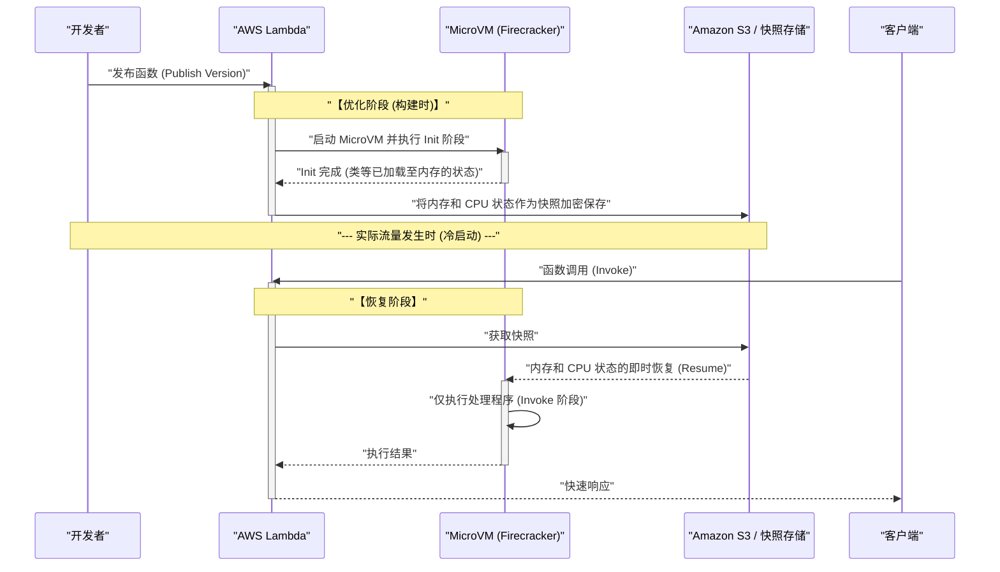

近年来，在云计算领域中， **无服务器架构** （Serverless Architecture）作为事实上的标准之一确立了坚实的地位。其代表就是 **AWS Lambda** 。诸如“无需管理服务器”、“按需付费”、“自动扩展”等甜言蜜语（光）吸引了许多企业将系统迁移到无服务器架构。

然而，任何技术都必然存在权衡（影）。无服务器架构最大的“影”，便是本文的主题—— **冷启动** （Cold Start）问题。

在本文中，我们将一边解说无服务器架构的光与影，一边深入且全面地从架构层面挖掘 AWS Lambda 背后到底发生了什么，以及困扰开发者的冷启动问题的机制和最新对策（如 SnapStart 等）。

---

## 1. 无服务器架构的“光”

首先，让我们梳理一下为什么无服务器架构能获得如此广泛的支持，了解其压倒性的优势（光）。

### 1.1. 从基础设施管理中解放（NoOps）

在传统的本地部署或利用 IaaS（如 Amazon EC2）的架构中，需要将大量的资源投入到基础设施的运维（Ops）中，例如操作系统打补丁、安全更新和服务器健康监控。

在无服务器架构中，所有的基础设施管理都可以卸载给云提供商（如 AWS）。开发者将能够专注于真正创造价值的工作，也就是“业务逻辑的编码”。

### 1.2. 终极的自动扩展

无服务器架构的另一个强大武器是能够应对流量增减的 **无缝扩展** 。

例如，假设电商网站开始限时抢购，瞬间爆发了平时 100 倍的访问量。在传统架构中，需要提前针对峰值过度配置服务器，或者进行复杂的自动扩展组的调优。

而对于 AWS Lambda，每次有请求到来时，独立的执行环境（容器）都会瞬间启动并处理请求。当访问量为零时，资源会完全降至零；当访问量激增时，会自动增加并行执行数来应对。

### 1.3. 按需付费的成本优化

无服务器架构的计费仅针对毫秒级（Lambda 为 1ms 级）的执行时间和分配的内存量进行计费。在空闲状态（无人访问的状态）下完全不产生任何成本。

这在访问量波动剧烈的系统，或者夜间无人使用的内部系统中，能够带来显著的成本降低效果。

---

## 2. 无服务器的“影”及其真面目

光越亮，影越深。无服务器并非“没有服务器”。它只是“将服务器的管理交给了云提供商”。在它的背后，绝对有物理服务器在运行，有操作系统在运行，我们的代码就在这上面执行。

如果不理解这种“背后的机制”，就会面临意想不到的性能下降和架构上的限制。

### 2.1. 无法保持状态（无状态）

通常要求 Lambda 函数是 **无状态** 的。因为执行环境在每次请求后被抛弃（或者重用），所以本地文件系统或内存中的数据并不能保证会传递给下一个请求。

为了保持状态，需要结合外部的持久化存储或内存数据库，如 Amazon DynamoDB、ElastiCache 或 S3。

### 2.2. 执行时间的限制

AWS Lambda 对单次执行有最大 **15 分钟** （900 秒）的超时限制。不能将需要耗费数小时的批处理直接迁移到 Lambda。这类处理需要借助 AWS Step Functions、AWS Batch 或 Amazon ECS 等进行拆分与异步化。

### 2.3. 冷启动问题

而最大的影就是 **冷启动** 。在享受自动扩展带来的好处的同时，启动新执行环境时的“初始化开销”表现为了延迟。

---

## 3. AWS Lambda 的背后：Firecracker MicroVM 的机制

为了理解冷启动，我们需要了解 AWS Lambda 在后台是如何执行代码的，即它的底层技术。

最初，AWS Lambda 使用 Linux 容器（类似于 LXC/[Docker](https://kenji.blog/zh-cn/p/docker-container-namespace-[cgroups](https://kenji.blog/zh-cn/p/docker-container-namespace-cgroups-layers/)-layers/) 的技术）进行隔离。但是，为了将安全性、启动速度和聚合密度的平衡提升到极致，AWS 独家开发了一种名为 **Firecracker** 的开源虚拟化技术。

### 3.1. 什么是 Firecracker？

Firecracker 是一个利用 KVM（Kernel-based Virtual Machine），能够在毫秒级启动轻量级“MicroVM”的虚拟机监控程序（VMM）。它是用 Rust 语言编写的，与传统的虚拟机（如 QEMU）相比，通过极力削减不必要的设备模型，实现了极快的启动速度和极低的内存开销。



在 AWS 基础设施这一多租户环境中，为了能够安全地在同一物理服务器上执行不同客户的代码，Firecracker 提供了强大的硬件级虚拟化边界。这也是 Lambda 既安全又可扩展的根本原因。

---

## 4. 冷启动的解剖学

当 Lambda 函数被调用时，如果不存在已经启动并待命的 MicroVM（热容器），AWS 端需要配置一个新的 MicroVM。由这一系列初始化过程产生的延迟，就是 **冷启动** 。

### 4.1. 生命周期与延迟的细分

Lambda 的生命周期可以用以下 Mermaid 状态转换图来表示。



冷启动所需的时间，大致分为 **AWS 端的初始化** （平台开销）和 **用户端的初始化** （代码开销）。

1. **代码下载和解压**：部署包从 S3 下载并解压到环境中。这与包的大小（依赖库的数量）成正比消耗时间。
2. **MicroVM 启动**：Firecracker 启动。这部分由于 AWS 的优化非常快（毫秒级）。
3. **运行时初始化**：Node.js、Python、Java 等进程启动。特别像 Java 和 C# 这种执行 JIT（即时）编译的语言，会在这里消耗大量时间。
4. **函数初始化 (Init 阶段)**：评估代码的全局作用域（处理函数外部）。如果在这里创建数据库连接池或初始化繁重的 SDK，初始化时间将被拉长。

### 4.2. 从概率论看冷启动

可以使用排队论（如 M/M/c 模型），通过数学模型来模拟冷启动发生的概率。
假设请求的到达率为 $\lambda$，热容器的生存时间为 $T_w$，处理时间为 $\mu$，当流量激增时，所需的并发数（容器数）急剧增加，冷启动的概率也会上升。

在稳态下，热容器被重用的概率 $P_{warm}$ 可以近似如下：

$ P_{warm} \approx 1 - e^{-\lambda \cdot T_w} $

也就是说，请求频率 $\lambda$ 越高，或者容器的生存时间 $T_w$ 越长，遇到冷启动的概率就越低。反之，对于偶尔才被访问的 API，有很高的概率会遇到冷启动。

---

## 5. 打败冷启动的优化策略

冷启动是无服务器架构的宿命，但通过优化架构设计和实现，可以将其影响降至最低。

### 5.1. 编程语言的选择

不同语言的冷启动速度差异极大。

- **最快组**：Go、Rust、C++ 等 AOT（提前）编译语言，以及轻量级的脚本语言（Python、Node.js）。这些语言的冷启动时间通常在几百毫秒以内。
- **较慢组**：Java、C# (.NET)。由于 JVM 或 CLR 的启动以及 JIT 编译的开销，有时会产生几秒甚至十几秒的冷启动。

**LLRT (Low Latency Runtime)** 作为 AWS 提供的实验性轻量级 JavaScript 运行时，因其可以进一步缩短 Node.js 启动速度的方法也备受关注。

### 5.2. 精简部署包

Lambda 启动时会从 S3 下载代码。因此，保持较小的包体积是一项直接的优化。
不包含不必要的依赖关系（如 DevDependencies 等），使用 Webpack / esbuild 等打包工具进行代码压缩（Minify）和树摇（Tree-shaking）非常重要。

### 5.3. 优化初始化处理与延迟计算 (Lazy Initialization)

全局作用域中的处理会在 Lambda 函数的 Init 阶段执行。优化此处的处理是缩短冷启动时间的关键。

例如，使用 AWS SDK 时，仅导入必需的模块。

```javascript
// ❌ 坏例子：因为读取整个 SDK，所以初始化很慢
const AWS = require('aws-sdk');
const dynamo = new AWS.DynamoDB.DocumentClient();

// ✅ 好例子：只读取必要的客户端 (利用 v3 SDK)
const { DynamoDBClient } = require("@aws-sdk/client-dynamodb");
const { DynamoDBDocumentClient } = require("@aws-sdk/lib-dynamodb");

const client = new DynamoDBClient({});
const dynamo = DynamoDBDocumentClient.from(client);
```

此外，对于每次请求并非必然需要的资源（例如只在特定处理路径中使用的数据库连接等），在函数处理程序内进行延迟计算（Lazy Initialization）也是一种有效的技巧。

### 5.4. 预置并发 (Provisioned Concurrency)

针对无论如何都想将冷启动降为零的企业级需求，AWS 提供了 **预置并发** （Provisioned Concurrency）的解决方案。

这是一种预先指定数量，让 Lambda 执行环境保持已初始化完成的热备用状态的功能。借此，可以完全消除冷启动，始终实现一致的低延迟（几毫秒）。

然而，由于在待命期间也会产生费用，因此存在一个两难境地（权衡），即无服务器架构“按需付费”的好处会受到部分损失。

---

## 6. 游戏改变者：AWS Lambda SnapStart

**AWS Lambda SnapStart** 作为像 Java 这种启动较慢语言的救世主而登场。这是一项将其虚拟机状态生成快照，并在冷启动时恢复的突破性技术。

其底层利用了 **CRaU** (Checkpoint/Restore in Userspace) 以及 Firecracker 的 MicroVM 快照功能。

### 6.1. SnapStart 的机制

下面的时序图展示了 SnapStart 是如何工作的。



### 6.2. SnapStart 的优点和注意事项

启用 SnapStart 后，Java 函数的冷启动时间可提速 **高达 10 倍以上** 。因为运行时的启动、JIT 编译以及 Spring Boot 等繁重框架的初始化都被提前到了“部署时”。

不过，也有一些注意事项。

1. **状态随机数问题**：由于恢复的 VM 是从完全相同的内存快照开始的，标准的伪随机数生成器（PRNG）种子状态也会相同。涉及密码学安全的随机数，必须利用操作系统的 `/dev/urandom` 等进行安全的重新初始化（AWS 提供了相应的防范库）。
2. **网络连接断开**：如果在初始化阶段建立了与数据库的 TCP 连接，当从快照恢复时，在服务器端可能因为超时而早已断开。因此，需要在处理程序中实现检测连接错误并重新连接的逻辑（重试机制）。

---

## 7. 结论：无服务器是银弹吗？

无服务器架构，尤其是 AWS Lambda，毫无疑问带来了云原生应用程序设计的范式转移。

减轻基础设施管理负担、优化成本和瞬时扩展的“光”，能够极大地提升从初创公司到大型企业业务的敏捷性。

但是，如果在设计时忽略了冷启动、无状态约束、VPC 网络复杂性这些“影”，在生产环境中就会遭受意想不到的打击。

关键是不要忘记工程学的基本原则，即 **“没有银弹”** 。

- 对于 **对延迟极其敏感的系统** （如在线对战游戏的核心逻辑、毫秒级高频交易），常驻容器（Amazon ECS/EKS）可能比无服务器更合适。
- 对于 **突发流量多的异步处理** 和 **希望将运营成本最小化的 Web API** ，AWS Lambda 则是不二之选。

深入理解架构特性，在适合的地方选用合适的技术。这才是能最大限度沐浴无服务器的“光”，并控制其“影”的唯一途径。

---
 *本文旨在探索无服务器架构的内部结构并分享实践优化方法。性能调优的世界没有尽头。让我们一起享受持续测量和改进的乐趣吧！* 
