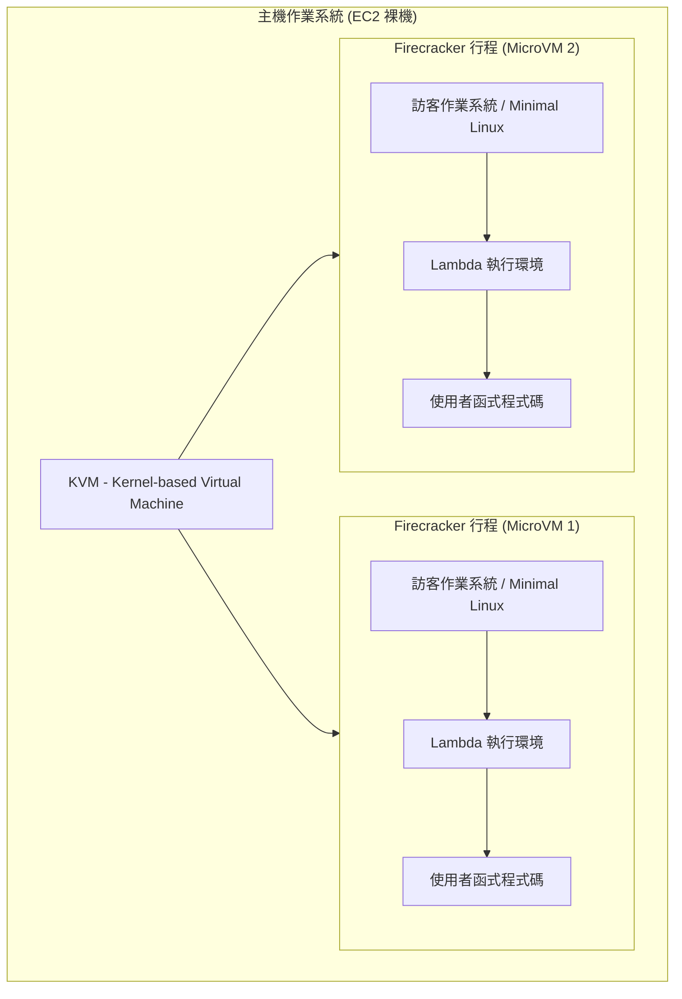
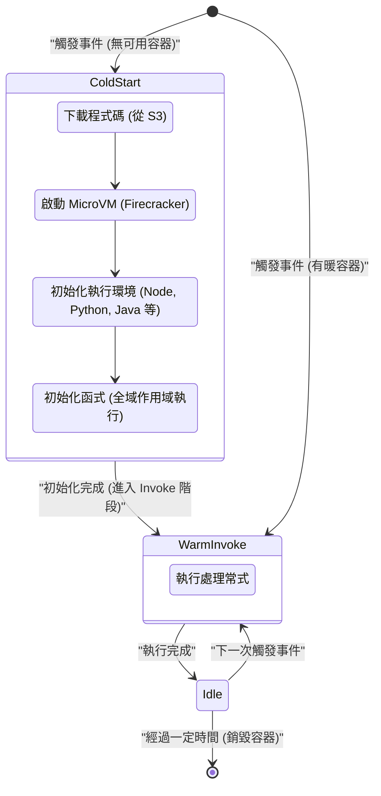
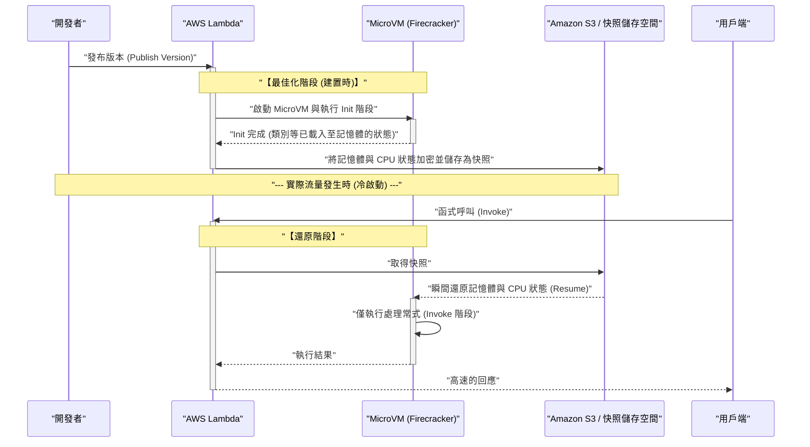

近年來，在雲端運算的世界中， **無伺服器架構** （Serverless Architecture）已作為事實上的標準之一確立了堅固的地位。其代表性服務非 **AWS Lambda** 莫屬。被「無需管理伺服器」、「按使用量計費」、「自動擴展」等甜美的承諾（光）所吸引，許多企業紛紛將系統遷移至無伺服器架構。

然而，任何技術必定存在權衡（影）。可以說無伺服器架構最大的「影」，就是本文的主題 **冷啟動** （Cold Start）問題。

本文將在解說無伺服器架構的光與影的同時，從架構層面深入且全面地探討 AWS Lambda 幕後究竟發生了什麼事，以及令開發者苦惱的冷啟動問題的機制與最新對策（如 SnapStart 等）。

---

## 1. 無伺服器架構的「光」

首先，讓我們先整理一下為什麼無伺服器架構能獲得如此廣泛的支持，及其壓倒性的優勢（光）。

### 1.1. 從基礎設施管理中解放 (NoOps)

在傳統的地端部署或使用 IaaS（如 Amazon EC2）的架構中，必須投入龐大的資源於基礎設施的維運（Ops），例如作業系統修補、安全性更新、伺服器的可用性監控等。

在無伺服器架構中，這些基礎設施管理全都可以卸載給雲端服務供應商（如 AWS）。開發者變得能專注於「商業邏輯程式碼編寫」這個本來就能創造最大價值的作業上。

### 1.2. 終極的自動擴展

無伺服器的另一個強大武器是，針對流量增減的 **無縫擴展** 。

例如，在電子商務網站開始限時搶購時，瞬間產生了平時 100 倍的流量。在傳統架構中，必須預先配合尖峰時段過度配置伺服器，或進行複雜的自動擴展群組調校。

在 AWS Lambda 的情況下，每當有請求到來，獨立的執行環境（容器）會瞬間啟動並處理請求。當流量為零時，資源會完全歸零；當流量激增時，則會自動增加平行執行數量來應對。

### 1.3. 透過按量計費實現成本最佳化

無伺服器僅會針對毫秒級（以 Lambda 為例是 1ms 單位）的執行時間以及分配的記憶體量進行計費。在閒置狀態（無人存取的狀態）時，不會產生任何成本。

這對於流量波動劇烈的系統，或是在夜間無人使用的內部系統等，能帶來戲劇性的成本降低效果。

---

## 2. 無伺服器的「影」與其真面目

光越強，影就越深。無伺服器並不是真的「沒有伺服器」。它只是「將伺服器的管理交給雲端服務供應商」。在幕後，確實有實體伺服器在運作，作業系統在執行，我們的程式碼就跑在這些之上。

如果不了解這套「幕後的機制」，就會面臨預期之外的效能衰退或架構上的限制。

### 2.1. 無法保持狀態 (Stateless)

Lambda 函式基本上被要求必須是 **無狀態的** （Stateless）。由於執行環境在每次請求後就會被拋棄（或重新利用），因此無法保證本機檔案系統或記憶體上的資料能傳遞給下一次的請求。

為了保持狀態，必須結合 Amazon DynamoDB、ElastiCache、S3 等外部的持久化儲存空間或記憶體內資料庫。

### 2.2. 執行時間的限制

AWS Lambda 有單次執行最長 **15 分鐘** （900 秒）的逾時限制。因此無法將耗時數小時的批次處理直接遷移到 Lambda。這類處理必須利用 AWS Step Functions、AWS Batch、Amazon ECS 等服務進行分割與非同步化。

### 2.3. 冷啟動問題

而最大的陰影就是 **冷啟動** 。雖然能享受自動擴展的恩惠，但另一方面，啟動全新執行環境時的「初始化負載」就會以延遲的形式顯現出來。

---

## 3. AWS Lambda 的幕後：Firecracker MicroVM 的機制

為了理解冷啟動，我們必須了解 AWS Lambda 在幕後是如何執行程式碼的，以及其底層技術。

AWS Lambda 最初使用 Linux 容器（類似 LXC/[Docker](https://kenji.blog/zh-tw/p/docker-container-namespace-[cgroups](https://kenji.blog/zh-tw/p/docker-container-namespace-cgroups-layers/)-layers/) 的技術）來進行隔離。然而，為了將安全性、啟動速度和資源密度提升到極致，AWS 獨自開發了一項名為 **Firecracker** 的開源虛擬化技術。

### 3.1. Firecracker 是什麼？

Firecracker 是一種利用 KVM（Kernel-based Virtual Machine），可在毫秒級別啟動輕量級「MicroVM（微虛擬機）」的虛擬機器監視器（VMM）。它是用 Rust 語言撰寫的，與傳統的虛擬機器（如 QEMU 等）相比，透過極致地削減不必要的裝置模型，實現了極快的啟動速度與極低的記憶體負擔。



在 AWS 基礎設施這個多租戶環境中，為了在同一台實體伺服器上安全地執行不同客戶的程式碼，Firecracker 提供了堅固的硬體層級虛擬化邊界。這就是 Lambda 既安全又具備擴展性的核心原因。

---

## 4. 冷啟動剖析

當 Lambda 函式被呼叫時，如果沒有已經啟動並待命中的 MicroVM（暖容器），AWS 端就必須配置一個全新的 MicroVM。這一連串初始化過程所產生的延遲就是 **冷啟動** 。

### 4.1. 生命週期與延遲的組成

Lambda 的生命週期可以用以下的 Mermaid 狀態轉移圖來表示。



冷啟動所需的時間，大致可分為 **AWS 端的初始化** （平台負載）與 **使用者端的初始化** （程式碼負載）。

1. **下載與解壓縮程式碼** ：從 S3 下載部署套件並解壓縮至環境中。此步驟耗時與套件大小（相依程式庫的數量）成正比。
2. **啟動 MicroVM** ：啟動 Firecracker。得益於 AWS 端的最佳化，這部分非常快速（毫秒級別）。
3. **初始化執行環境** ：啟動 Node.js、Python、Java 等行程。特別是像 Java 或 C# 這類進行 JIT（Just-In-Time）編譯的語言，會在此消耗大量時間。
4. **初始化函式 (Init 階段)** ：評估程式碼的全域作用域（處理常式函式之外的部分）。如果在這邊建立資料庫連線池或初始化沉重的 SDK，將會拖長初始化時間。

### 4.2. 從機率論看冷啟動

我們可以使用排隊理論（如 M/M/c 模型等）在數學上對冷啟動發生的機率建立模型。
假設請求到達率為 $\lambda$，暖容器的存活時間為 $T_w$，處理時間為 $\mu$。當流量突增時，所需的平行數量（容器數）急劇增加，冷啟動的機率就會上升。

在穩定狀態下，暖容器被重新利用的機率 $P_{warm}$ 大致可用以下公式近似：

$ P_{warm} \approx 1 - e^{-\lambda \cdot T_w} $

也就是說，請求頻率 $\lambda$ 越高，或者容器的存活時間 $T_w$ 越長，遇到冷啟動的機率就越低。反之，若 API 偶爾才會被存取，遇到冷啟動的機率就會很高。

---

## 5. 打破冷啟動的最佳化策略

雖然冷啟動是無伺服器架構的宿命，但透過架構設計與實作上的巧思，我們可以將其影響降至最低。

### 5.1. 程式語言的選擇

冷啟動的速度會因語言而有戲劇性的差異。

- **最快群組** ：Go、Rust、C++ 等 AOT（Ahead-Of-Time）編譯語言，以及輕量級的指令碼語言（Python、Node.js）。這些語言的冷啟動時間通常能控制在數百毫秒以內。
- **較慢群組** ：Java、C# (.NET)。由於 JVM 或 CLR 的啟動及 JIT 編譯的負載，有時會發生數秒至十幾秒的冷啟動。

像 **LLRT (Low Latency Runtime)** 這種 AWS 提供的實驗性輕量級 JavaScript 執行環境，因其能進一步縮短 Node.js 啟動速度的方法而備受關注。

### 5.2. 輕量化部署套件

Lambda 啟動時會從 S3 下載程式碼。因此，保持套件大小的精簡是直接相關的最佳化手段。
避免包含不必要的相依關係（如 DevDependencies 等），並使用 Webpack / esbuild 等打包工具進行程式碼縮小化（Minify）及 Tree-shaking，這是非常重要的。

### 5.3. 最佳化初始化處理與延遲求值 (Lazy Initialization)

全域作用域中的處理會在 Lambda 函式的 Init 階段執行。將這裡的處理進行最佳化是縮短冷啟動時間的關鍵。

例如，當使用 AWS SDK 時，只匯入需要的模組。

```javascript
// ❌ 錯誤範例：讀取整個 SDK 導致初始化緩慢
const AWS = require('aws-sdk');
const dynamo = new AWS.DynamoDB.DocumentClient();

// ✅ 良好範例：只讀取需要的用戶端 (使用 v3 SDK)
const { DynamoDBClient } = require("@aws-sdk/client-dynamodb");
const { DynamoDBDocumentClient } = require("@aws-sdk/lib-dynamodb");

const client = new DynamoDBClient({});
const dynamo = DynamoDBDocumentClient.from(client);
```

此外，針對非每次請求都絕對必要的資源（例如只有特定執行路徑才會用到的資料庫連線等），在函式處理常式內採用延遲求值（Lazy Initialization）也是非常有效的技巧。

### 5.4. 預先佈建並行 (Provisioned Concurrency)

針對無論如何都想將冷啟動降為零的企業級需求，AWS 提供了名為 **預先佈建並行 (Provisioned Concurrency)** 的解決方案。

這是一項預先啟動指定數量的 Lambda 執行環境，並讓它們處於已初始化完畢的暖狀態下待命的功能。這能完全消除冷啟動，隨時實現一致的低延遲（數毫秒）。

不過，由於待命期間仍會產生費用，這帶來了一定程度的兩難（權衡），因為它部分抵消了無伺服器「按量計費」的優勢。

---

## 6. 改變遊戲規則的技術：AWS Lambda SnapStart

作為啟動較慢語言（如 Java）的救星而登場的，便是 **AWS Lambda SnapStart** 。這是一項將虛擬機器狀態快照化，並在冷啟動時將其還原的革命性技術。

作為背景技術，它利用了 **CRaU** (Checkpoint/Restore in Userspace) 以及 Firecracker 的 MicroVM 快照功能。

### 6.1. SnapStart 的機制

以下的循序圖展示了 SnapStart 是如何運作的。



### 6.2. SnapStart 的優點與注意事項

啟用 SnapStart 後，Java 函式的冷啟動時間 **最高可加速 10 倍以上** 。這是因為啟動執行環境、JIT 編譯以及 Spring Boot 等沉重框架的初始化，都被提前到了「部署時」完成。

但是，有幾點需要注意。

1. **狀態的亂數問題** ：還原後的虛擬機器是從完全相同的記憶體快照開始執行的，因此標準的偽亂數產生器（PRNG）的種子狀態也會是相同的。涉及密碼學安全性的亂數，必須利用作業系統的 `/dev/urandom` 等方式安全地重新初始化（AWS 官方有提供對策用的程式庫）。
2. **網路連線中斷** ：在初始化階段建立的資料庫 TCP 連線等，在從快照還原的時間點，可能已經在伺服器端因為逾時而中斷了。因此，必須在處理常式內實作能偵測連線錯誤並重新連線的邏輯（重試機制）。

---

## 7. 結論：無伺服器是銀彈嗎？

無伺服器架構，尤其是 AWS Lambda，毫無疑問地為雲端原生應用程式設計帶來了典範轉移。

減輕基礎設施管理負擔、成本最佳化以及瞬間擴展等「光」，無論是新創還是大型企業，都能劇烈提升商業的敏捷性（Agility）。

然而，如果無視冷啟動、無狀態限制、VPC 網路複雜性等「影」來進行設計，就會在正式環境中遭遇意料之外的慘痛代價。

最重要的是，不要忘記 **「沒有銀彈」** 這個工程學的基本原則。

- 對於 **延遲要求極度嚴苛的系統** （例如：線上對戰遊戲的核心邏輯、毫秒級別的高頻交易），與其使用無伺服器，可能更適合使用常駐運作的容器（Amazon ECS/EKS）。
- 對於 **突發流量多的非同步處理** ，或者 **希望將維運成本降到最低的 Web API** ，AWS Lambda 則是最佳的選擇。

深入理解架構的特性，並在適當的地方選擇適當的技術。這才是能最大程度沐浴在無伺服器的「光」之中，同時掌控其「影」的唯一途徑。

---
*本文旨在探索無伺服器架構的內部結構，並分享實用的最佳化手法。效能調校的世界沒有終點。讓我們繼續享受持續的測量與改善吧！*
