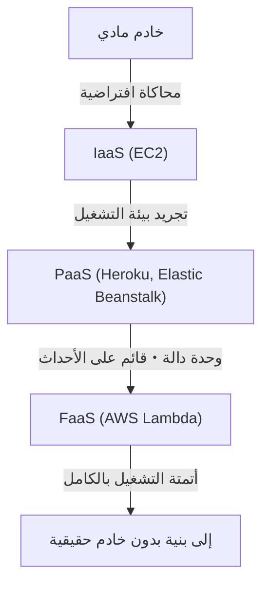
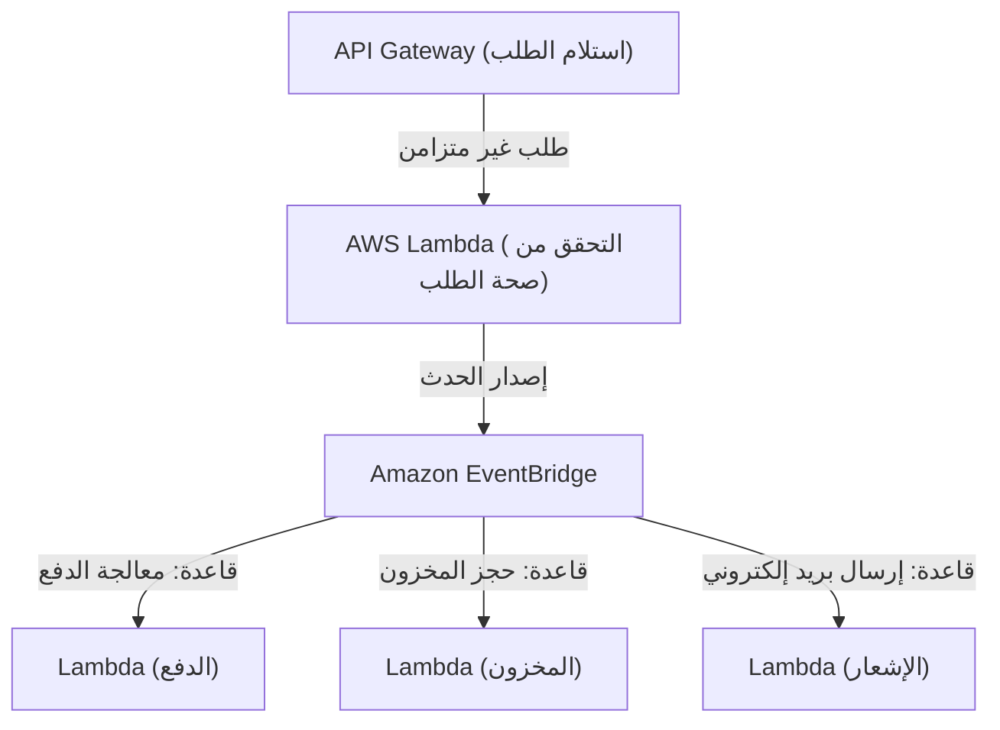

## 1. مقدمة: ما هي البنية التحتية بدون خادم (Serverless)؟

عند سماع مصطلح "بدون خادم (Serverless)" لأول مرة، ربما يتخيل العديد من المطورين "نظامًا سحريًا بدون خوادم مادية". ومع ذلك، فإن المعنى الحقيقي لمصطلح بدون خادم في الحوسبة السحابية ليس "عدم وجود خوادم"، بل "عدم الحاجة إلى الوعي بوجود خوادم"، أي "التحرر من العبء الثقيل المتمثل في توفير البنية التحتية وإدارتها التشغيلية".

أرست FaaS (Function as a Service) - الدالة كخدمة، والمتمثلة في AWS Lambda، نموذجًا يتم فيه تخصيص موارد الحوسبة لتنفيذ التعليمات البرمجية ديناميكيًا فقط في اللحظة التي يحدث فيها طلب، مع فوترة بالملي ثانية. بفضل هذا، تم تحرير المطورين من المتطلبات غير الوظيفية مثل "تطبيق تصحيحات الخوادم"، "إعدادات التوسع"، و"تخطيط السعة"، وأصبح بإمكانهم التركيز على خلق القيمة الأساسية وهي بناء منطق الأعمال. في هذا المقال، سنتعمق في القيمة الحقيقية للبنية التحتية بدون خادم، وأحدث منهجيات التصميم باستخدام AWS Lambda، بالإضافة إلى التحديات التشغيلية غير المعروفة وحلولها.

## 2. تاريخ تطور البنية التحتية: من الخوادم المادية إلى FaaS

لفهم صعود البنية التحتية بدون خادم، نحتاج إلى إلقاء نظرة للوراء على تطور البنية التحتية على مدى العقود القليلة الماضية. لقد تطورت البنية التحتية دائمًا بهدف "مستوى أعلى من التجريد" و"تقليل تكاليف التشغيل".

### 2.1 عصر الخوادم المادية (داخل المؤسسة - On-Premises)
كانت تطبيقات الويب المبكرة تعمل على خوادم مادية مثبتة على رفوف في مراكز البيانات الخاصة بالشركة. استغرق شراء الأجهزة شهورًا، وكان من الضروري دائمًا تأمين موارد زائدة (توفير مفرط) تحسبًا لحركة المرور في أوقات الذروة. كان ذلك عصرًا تتحمل فيه الشركة المسؤولية في جميع الطبقات، بما في ذلك أعطال الأجهزة، أعطال الشبكة، وانقطاع التيار الكهربائي.

### 2.2 ثورة IaaS (البنية التحتية كخدمة)
أحدث ظهور Amazon EC2 (Elastic Compute Cloud) في عام 2006 نقلة نوعية في الصناعة. أصبح من الممكن جعل الخوادم المادية افتراضية وتشغيل الخوادم (المثيلات) في غضون دقائق عبر واجهات برمجة التطبيقات (API). ومع ذلك، ظلت إدارة تصحيحات نظام التشغيل، إعدادات البرامج الوسيطة، وتحديد قواعد التوسع مسؤولية المستخدم، حيث بقي النموذج عند حدود "الخوادم الافتراضية على السحابة".

### 2.3 PaaS (المنصة كخدمة) والحاويات
قدمت منصات PaaS مثل Heroku و Google App Engine تجربة تتيح للمطورين نشر التطبيقات بمجرد دفع التعليمات البرمجية (Push)، حيث تدير المنصة بيئة التشغيل. في الوقت نفسه، ظهرت تقنية الحاويات المتمثلة في Docker، والتي أدت إلى تحسين قابلية نقل البيئة وكفاءة الموارد بشكل كبير من خلال تجميع التطبيقات وتبعياتها. لكن ظهر تحدي "عمليات اليوم الثاني (Day 2 Operations)" حيث أصبحت إدارة المجموعات (مثل Kubernetes) لتشغيل الحاويات عبئًا تشغيليًا جديدًا بحد ذاته.

### 2.4 ولادة FaaS (الدالة كخدمة)
ثم في عام 2014، ولدت FaaS مع الإعلان عن AWS Lambda. يقوم المطورون بنشر التعليمات البرمجية في أصغر وحدة تسمى "الدالة"، ويتم تنفيذها بناءً على أحداث معينة (طلبات HTTP، تحميل الملفات، تغييرات قاعدة البيانات، إلخ). أصبحت تكلفة وقت الخمول صفرًا، وتم إنشاء نموذج "بدون خادم" حقيقي يتوسع تلقائيًا وبشكل لا نهائي (نظريًا) وفقًا لعدد الطلبات.

## 3. المفهوم الأساسي للبنية بدون خادم: الفصل التام بين الحوسبة والتخزين

أهم تحول في النموذج عند تصميم بنية بدون خادم هو "الفصل التام بين الحوسبة (المعالجة) والتخزين (الذاكرة)".

في البنى الأحادية (Monolithic) التقليدية، كان من الشائع استخدام تصميم "حفظ الحالة (Stateful)" حيث يتم الاحتفاظ بمعلومات الجلسة والبيانات المؤقتة في الذاكرة أو القرص المحلي لخادم التطبيق. ومع ذلك، في بيئة FaaS، يتم إنشاء الحاوية (في AWS Lambda تُسمى Firecracker microVM) التي تنفذ الدالة ديناميكيًا لكل طلب، ومن الممكن إتلافها في أي وقت بمجرد انتهاء التنفيذ.

بسبب هذه الطبيعة "العابرة (Ephemeral)"، يعتبر الاحتفاظ بالحالة داخل الدالة نمطًا غير مرغوب فيه (Anti-pattern). بدلاً من ذلك، يجب نقل الحالات والبيانات خارجيًا إلى قواعد بيانات NoSQL مُدارة مثل Amazon DynamoDB، أو تخزين كائنات مثل Amazon S3، أو مخازن في الذاكرة مثل Amazon ElastiCache (Redis).

بفضل هذا الفصل التام، تصبح طبقة الحوسبة "عديمة الحالة (Stateless)" تمامًا، وحتى إذا تم تشغيل 1000 دالة في وقت واحد لمعالجة طلبات فردية، يمكن إدارة اتساق البيانات والتعارضات بشكل مركزي على جانب طبقة قاعدة البيانات.

## 4. البنية الداخلية لـ AWS Lambda ونموذج التنفيذ

على الرغم من اسم "بدون خادم"، إلا أن الخوادم تعمل بالتأكيد في أعماق مراكز بيانات AWS. ما هي الآلية التي تعمل بها التعليمات البرمجية داخل Lambda؟

تستخدم AWS Lambda جهازًا افتراضيًا مصغرًا (microVM) مفتوح المصدر وخفيف الوزن يُدعى "Firecracker" لتحقيق التوازن بين الأمان والأداء. يستخدم Firecracker تقنية KVM (Kernel-based Virtual Machine) لتوفير أجهزة افتراضية دقيقة للغاية يتم تشغيلها في أجزاء من الألف من الثانية. وهذا يضمن بيئة تنفيذ آمنة معزولة تمامًا عن التعليمات البرمجية للعملاء الآخرين (حدود أمان قوية) في بيئة متعددة المستأجرين، مع تحقيق سرعة بدء تشغيل تعادل سرعة الحاويات.

تنقسم دورة حياة تنفيذ Lambda إلى ثلاث مراحل:
1. **مرحلة التهيئة (Init)**: يتم تنزيل التعليمات البرمجية، وبناء بيئة التنفيذ، وتشغيل بيئة التشغيل (Node.js، Python، Java، إلخ)، وإجراء عمليات التهيئة خارج كود الدالة (مثل إنشاء اتصالات قاعدة البيانات).
2. **مرحلة الاستدعاء (Invoke)**: يتم تمرير حمولة الحدث إلى دالة المعالج (Handler)، ويتم تنفيذ منطق الأعمال الفعلي.
3. **مرحلة الإغلاق (Shutdown)**: يتم إرسال إشارة إغلاق إلى بيئة التشغيل قبل تدمير بيئة التنفيذ (إذا كانت الملحقات Extensions قيد الاستخدام).

## 5. مشكلة التشغيل البارد (Cold Start) وتطور حلولها

من أكبر التحديات التقنية التي نوقشت لسنوات في البنية بدون خادم هي مشكلة "التشغيل البارد". التشغيل البارد هو التأخير (Latency) الذي يحدث عند استدعاء دالة Lambda لأول مرة، أو عند استدعائها مرة أخرى بعد فترة من عدم النشاط وتدمير بيئة التنفيذ. الوقت المستغرق لتنفيذ "مرحلة التهيئة" المذكورة أعلاه هو السبب الحقيقي لهذا التأخير.

خاصة مع اللغات ذات الكتابة الثابتة مثل Java و C#، أو التطبيقات التي تقوم بتحميل مكتبات ضخمة (مثل TensorFlow)، يمكن أن يستغرق التشغيل البارد عدة ثوانٍ، مما قد يؤدي إلى تدهور كبير في تجربة المستخدم.

لمعالجة هذه المشكلة، قدمت AWS حلولاً مختلفة على مر السنين.

### 5.1 التنفيذ المتزامن المُجهز (Provisioned Concurrency)
تم الإعلان عن هذه الميزة في عام 2019، وهي تحافظ على عدد محدد مسبقًا من بيئات التنفيذ دافئة (في حالة استعداد) مع اكتمال "مرحلة التهيئة". هذا يسمح بتجنب التشغيل البارد تمامًا ويضمن استجابة مستقرة في حدود أجزاء من الألف من الثانية. ومع ذلك، هناك مقايضة حيث يتم فرض رسوم على الموارد في حالة الاستعداد، مما يُفقد بعضًا من ميزة البنية بدون خادم المتمثلة في "الدفع فقط مقابل ما تستخدمه".

### 5.2 بدء التشغيل السريع لـ AWS Lambda (SnapStart)
كان SnapStart (الذي تم إدخاله في عام 2022، وموجه بشكل أساسي لـ Java) بمثابة اختراق في حل مشكلة التشغيل البارد. عند تمكين SnapStart، فإنه يهيئ الدالة مسبقًا عند نشر إصدار جديد من الدالة، ويأخذ "لقطة (Snapshot)" لحالة الذاكرة والقرص ويقوم بتخزينها مؤقتًا. عند الاستدعاء، بدلاً من التهيئة من الصفر، يستأنف (Resume) البيئة من هذه اللقطة، مما يمكن أن يقلل أوقات التشغيل البارد بنسبة تصل إلى 90٪. هذا نهج ثوري يستفيد من ميزة MicroVM Snapshot في Firecracker.

## 6. التوافق مع البنية القائمة على الأحداث (Event-Driven Architecture)

تتجلى القوة الحقيقية للبنية بدون خادم عند دمجها مع خدمات AWS المُدارة الأخرى لبناء "بنية قائمة على الأحداث".

في البنية القائمة على الأحداث، يتم إصدار التغييرات في الحالة داخل النظام كـ "أحداث"، والتي تُشغّل المكونات المختلفة للعمل بشكل غير متزامن. لا يمكن لـ Lambda معالجة طلبات HTTP من API Gateway فحسب، بل يمكنها أيضًا معالجة أحداث من أكثر من 140 خدمة AWS بشكل أصلي، مثل تحميل ملفات إلى S3، أو تغييرات الجداول في DynamoDB (DynamoDB Streams)، أو وصول رسائل إلى SQS.

### 6.1 الاستفادة من تعيين مصادر الأحداث (Event Source Mapping)
من خلال الجمع بين Amazon SQS (قوائم الانتظار) أو Amazon SNS (النشر/الاشتراك) و Amazon EventBridge (ناقل الأحداث)، يمكن منع الاقتران الوثيق (Tight Coupling) بين الأنظمة.
على سبيل المثال، دعونا نفكر في معالجة الطلبات على موقع للتجارة الإلكترونية.

بهذه الطريقة، يمكن بناء بنية تتفاعل فيها العديد من الخدمات المصغرة بشكل مستقل وغير متزامن مع حدث واحد (حدوث طلب). حتى إذا تعطلت خدمة واحدة (على سبيل المثال، خدمة الإشعارات)، يتم الاحتفاظ بالحدث وإعادة المحاولة، مما يحسن من توفر النظام بأكمله بشكل كبير.

## 7. أفضل الممارسات للتشغيل والمراقبة (Observability)

على الرغم من التحرر من إدارة البنية التحتية، تصبح مسألة ضمان "قابلية الملاحظة (Observability)" في نظام بدون خادم - حيث يعمل عدد لا يحصى من الدوال الموزعة بشكل تعاوني - أكثر أهمية مما كانت عليه في عصر الأنظمة داخل المؤسسات. وذلك لأنه يصبح من الصعب تحديد "في أي دالة حدث الخطأ؟" أو "أين تكمن نقطة الاختناق؟".

1. **التتبع الموزع (Distributed Tracing)**: استخدم AWS X-Ray لتصور مسار الطلبات أثناء انتشارها من API Gateway إلى Lambda و DynamoDB. يمكنك تحديد التأخيرات بين كل خدمة بوحدة أجزاء من الألف من الثانية.
2. **التسجيل المنظم (Structured Logging)**: بدلاً من التسجيل النصي البسيط، قم بإخراج السجلات بتنسيق JSON بحيث يمكن البحث فيها باستخدام استعلامات AWS CloudWatch Logs Insights. قم دائمًا بتضمين السياق مثل معرف الطلب ومعرف المستخدم في السجلات.
3. **المقاييس المخصصة والتنبيهات**: بالإضافة إلى معدل الخطأ ووقت التنفيذ، قم بإرسال مقاييس تتعلق بـ "نجاح أو فشل الأعمال" (مثل: عدد معالجات الطلبات الناجحة) إلى CloudWatch، وقم بتصميم نظام لإطلاق التنبيهات عندما تتجاوز هذه المقاييس حدًا معينًا.

## 8. تحسين التكلفة والأنماط غير المرغوب فيها (Anti-patterns)

يمكن أن تؤدي البنية بدون خادم إلى توفير كبير في التكاليف إذا تم استخدامها بشكل صحيح، ولكن الوقوع في الأنماط غير المرغوب فيها قد يؤدي إلى فواتير غير متوقعة (إفلاس سحابي).

### 8.1 تحسين الذاكرة والمهل الزمنية
يتم حساب فاتورة Lambda عن طريق ضرب "كمية الذاكرة المخصصة" في "وقت التنفيذ (بالملي ثانية)". نظرًا لأن زيادة الذاكرة تؤدي إلى زيادة أداء وحدة المعالجة المركزية (CPU) وعرض النطاق الترددي للشبكة بشكل تناسبي، فقد يؤدي مضاعفة الذاكرة إلى خفض وقت التنفيذ إلى أكثر من النصف، مما يؤدي في الواقع إلى انخفاض التكلفة الإجمالية. نظرًا لصعوبة ضبط هذا يدويًا، فإن أفضل ممارسة هي استخدام أدوات مفتوحة المصدر مثل AWS Lambda Power Tuning للعثور على نقطة التوازن المثلى بين التكلفة والأداء.

### 8.2 نمط غير مرغوب فيه: الاستدعاء المتزامن بين الدوال
يجب تجنب تصميم تقوم فيه دالة Lambda باستدعاء دالة Lambda أخرى بشكل متزامن وانتظار نتيجتها. تستمر محاسبة دالة Lambda المستدعية أثناء الانتظار، مما يؤدي إلى "فوترة مزدوجة". عندما يكون التنسيق بين الدوال ضروريًا، يجب استخدام Step Functions (للأوركسترا - Orchestration) أو اعتماد الاستدعاءات غير المتزامنة (مثل تصميم الرقصات - Choreography) عبر SQS/SNS وما إلى ذلك.

### 8.3 نمط غير مرغوب فيه: الاتصالات المفرطة بقواعد البيانات العلائقية (RDBMS)
نظرًا لأن دوال Lambda يمكن أن تتوسع إلى آلاف المثيلات في لحظة، فإن الاتصال المباشر بقاعدة بيانات RDS (مثل MySQL أو PostgreSQL) سيؤدي إلى استنفاد تجمع اتصالات قاعدة البيانات (Connection Pool) على الفور، مما يتسبب في تعطل قاعدة البيانات. للتعامل مع هذا، من الضروري التفكير في استخدام RDS Proxy لتجميع الاتصالات، أو الانتقال إلى قاعدة بيانات NoSQL يمكن الوصول إليها عبر واجهة برمجة تطبيقات (API) قائمة على HTTP، مثل DynamoDB.

## 9. الخاتمة والنظرة المستقبلية

البنية التحتية بدون خادم ليست مجرد صيحة عابرة، بل هي ذروة التطور الحتمي لتطوير التطبيقات السحابية الأصلية (Cloud-Native). لقد تم تحرير المطورين من العمليات الشاقة للبنية التحتية، وأصبح بإمكانهم تقديم قيمة الأعمال للمستخدمين النهائيين بشكل أسرع وأكثر أمانًا.

في المستقبل، مع تسريع أوقات التشغيل البارد بشكل أكبر من خلال انتشار WebAssembly (Wasm) والتكامل مع حوسبة الحافة (مثل CloudFront Functions و Lambda@Edge)، سيستمر نظام بيئة العمل بدون خادم في التطور بشكل أكبر.

نحو عالم لا نضطر فيه للتفكير في البنية التحتية. هذه هي القيمة الحقيقية التي جلبتها لنا نماذج FaaS والبنية التحتية بدون خادم.
