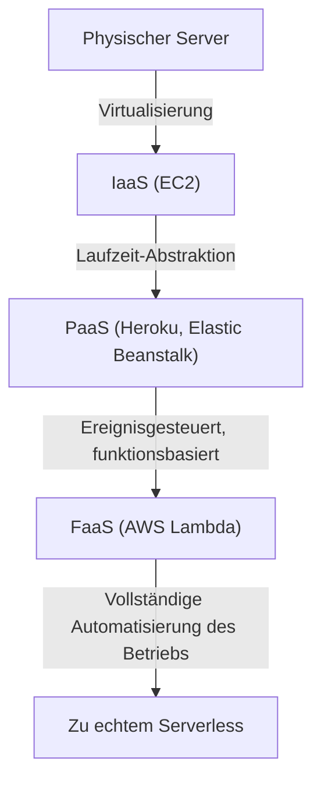
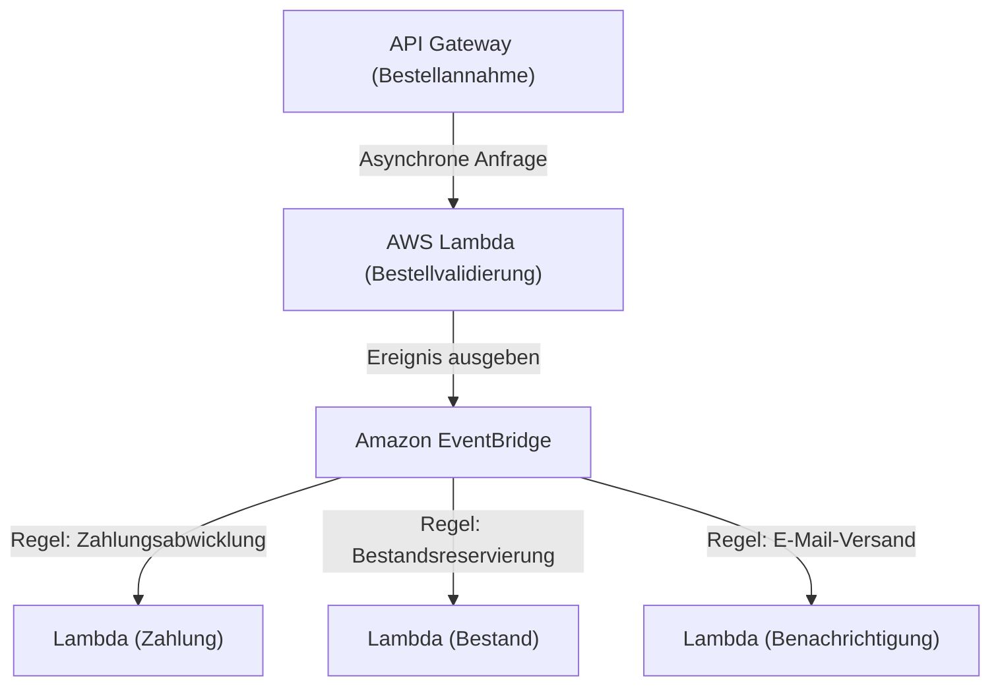

## 1. Einführung: Was ist Serverless?

Als viele Entwickler das Wort "Serverless" zum ersten Mal hörten, stellten sie sich vielleicht ein magisches System vor, in dem keine physischen Server existieren. Die wahre Bedeutung von Serverless im Cloud Computing ist jedoch nicht das Fehlen von Servern, sondern die Tatsache, dass man sich nicht um ihre Existenz kümmern muss. Es bedeutet die Befreiung von der mühsamen Bereitstellung und dem Betriebsmanagement der Infrastruktur.

FaaS (Function as a Service), das durch AWS Lambda repräsentiert wird, etablierte ein Modell, bei dem Computerressourcen zur Codeausführung nur im Moment einer Anfrage dynamisch zugewiesen und millisekundengenau abgerechnet werden. Dadurch werden Entwickler von nicht-funktionalen Anforderungen wie "Server-Patching", "Skalierungskonfiguration" und "Kapazitätsplanung" befreit, sodass sie sich auf ihre eigentliche Wertschöpfung konzentrieren können: den Aufbau von Geschäftslogik. Dieser Artikel befasst sich eingehend mit dem wahren Wert dieser Serverless-Architektur, den neuesten Entwurfsmethoden mit AWS Lambda sowie den oft unbekannten operativen Herausforderungen und deren Lösungen.

## 2. Die Geschichte der Infrastrukturentwicklung: Vom physischen Server zu FaaS

Um den Aufstieg von Serverless zu verstehen, müssen wir auf die Entwicklung der Infrastruktur in den letzten Jahrzehnten zurückblicken. Die Infrastruktur hat sich stets weiterentwickelt, mit dem Ziel "höherer Abstraktion" und "Reduzierung der Betriebskosten".

### 2.1 Die Ära der physischen Server (On-Premises)
Frühe Webanwendungen liefen auf physischen Servern, die in den Racks des unternehmenseigenen Rechenzentrums montiert waren. Die Beschaffung von Hardware dauerte Monate, und es mussten stets überschüssige Ressourcen (Überprovisionierung) bereitgestellt werden, um Traffic-Spitzen antizipieren zu können. Es war eine Zeit, in der Unternehmen die Verantwortung für alle Ebenen übernehmen mussten, einschließlich Hardware-, Netzwerk- und Stromausfällen.

### 2.2 Die IaaS-Revolution (Infrastructure as a Service)
Die Einführung von Amazon EC2 (Elastic Compute Cloud) im Jahr 2006 brachte einen Paradigmenwechsel in die Branche. Physische Server wurden virtualisiert, sodass Server (Instanzen) innerhalb von Minuten über eine API gestartet werden konnten. Das Patch-Management des Betriebssystems, die Middleware-Konfiguration und die Definition von Skalierungsregeln blieben jedoch weiterhin in der Verantwortung des Benutzers, sodass man beim Paradigma "virtuelle Server in der Cloud" blieb.

### 2.3 PaaS (Platform as a Service) und Container
PaaS wie Heroku und Google App Engine boten Entwicklern die Möglichkeit, Anwendungen durch einfaches Pushen von Code bereitzustellen, da die Laufzeitumgebung von der Plattform verwaltet wurde. Gleichzeitig entstanden Container-Technologien, vertreten durch Docker. Durch die Paketierung von Anwendungen und deren Abhängigkeiten wurden die Portabilität der Umgebungen und die Ressourceneffizienz drastisch verbessert. Jedoch entstand durch die Verwaltung von Clustern (wie Kubernetes) zur Ausführung von Containern ein neuer operativer Aufwand, der als "Day 2 Operations"-Herausforderung bekannt ist.

### 2.4 Die Geburt von FaaS (Function as a Service)
Im Jahr 2014 wurde mit der Ankündigung von AWS Lambda FaaS geboren. Entwickler stellen Code in der kleinstmöglichen Einheit, der "Funktion", bereit und führen ihn aus, wenn ein bestimmtes Ereignis (HTTP-Anfrage, Datei-Upload, Datenbankänderung usw.) ausgelöst wird. Die Kosten im Leerlauf sinken auf null, und es etablierte sich ein echtes "Serverless"-Paradigma, das basierend auf der Anzahl der Anfragen (theoretisch) unendlich automatisch skaliert.

## 3. Das Kernkonzept von Serverless: Vollständige Trennung von Berechnung und Speicherung

Der wichtigste Paradigmenwechsel beim Entwerfen einer Serverless-Architektur ist die "vollständige Trennung von Berechnung (Compute) und Speicherung (Storage)".

In herkömmlichen monolithischen Architekturen war ein "zustandsbehaftetes" (stateful) Design üblich, bei dem Sitzungsinformationen oder temporäre Daten im Speicher oder auf der lokalen Festplatte des Anwendungsservers gehalten wurden. In einer FaaS-Umgebung werden die Container, die die Funktionen ausführen (bei AWS Lambda die Firecracker microVM), jedoch für jede Anfrage dynamisch generiert und können nach Abschluss der Ausführung jederzeit zerstört werden.

Aufgrund dieser "flüchtigen" (ephemeren) Natur ist es ein Anti-Pattern, den Zustand innerhalb der Funktion zu speichern. Stattdessen müssen Zustände und Daten an externe Systeme ausgelagert werden, wie etwa verwaltete NoSQL-Datenbanken wie Amazon DynamoDB, Objektspeicher wie Amazon S3 oder In-Memory-Speicher wie Amazon ElastiCache (Redis).

Durch diese vollständige Trennung wird die Berechnungsebene vollständig "zustandslos" (stateless). Selbst wenn 1000 Funktionen zur Verarbeitung einer einzelnen Anfrage gleichzeitig gestartet werden, können Datenkonsistenz und Konflikte zentral auf der Datenbankebene verwaltet werden.

## 4. Die interne Architektur und das Ausführungsmodell von AWS Lambda

Trotz des Begriffs "Serverless" laufen in den Tiefen der AWS-Rechenzentren definitiv Server. Wie wird der Code intern bei Lambda ausgeführt?

AWS Lambda nutzt eine Open-Source-Leichtgewicht-MicroVM namens "Firecracker", um sowohl Sicherheit als auch Leistung zu gewährleisten. Firecracker verwendet KVM (Kernel-based Virtual Machine) und stellt winzige virtuelle Maschinen bereit, die in Millisekunden starten. Dies gewährleistet eine sichere Ausführungsumgebung (starke Sicherheitsgrenze), die vollständig vom Code anderer Kunden in einer mandantenfähigen Umgebung isoliert ist, während gleichzeitig Startgeschwindigkeiten auf Container-Niveau erreicht werden.

Der Ausführungslebenszyklus von Lambda ist in die folgenden drei Phasen unterteilt:
1. **Init-Phase (Initialisierung)**: Der Code wird heruntergeladen, die Ausführungsumgebung wird eingerichtet, die Laufzeitumgebung (Node.js, Python, Java usw.) wird gestartet und Initialisierungen außerhalb des Funktionscodes (z. B. Aufbau von Datenbankverbindungen) werden durchgeführt.
2. **Invoke-Phase (Aufruf)**: Die Ereignisnutzlast wird an die Handler-Funktion übergeben, und die eigentliche Geschäftslogik wird ausgeführt.
3. **Shutdown-Phase (Herunterfahren)**: Bevor die Ausführungsumgebung zerstört wird, wird ein Shutdown-Signal an die Laufzeit gesendet (falls Erweiterungen verwendet werden).

## 5. Das Kaltstartproblem und die Entwicklung von Gegenmaßnahmen

Die größte technische Herausforderung, die seit Jahren in der Serverless-Architektur diskutiert wird, ist der "Kaltstart" (Cold Start). Ein Kaltstart ist die Verzögerung (Latenz), die auftritt, wenn eine Lambda-Funktion zum ersten Mal aufgerufen wird, oder wenn sie erneut aufgerufen wird, nachdem die Ausführungsumgebung wegen mangelnder Aufrufe für eine Weile zerstört wurde. Die Zeit, die für die oben erwähnte "Init-Phase" benötigt wird, ist die eigentliche Ursache für diese Verzögerung.

Besonders bei statisch typisierten Sprachen wie Java oder C# oder bei Anwendungen, die große Bibliotheken (wie TensorFlow) laden, kann der Kaltstart mehrere Sekunden dauern, was die Benutzererfahrung erheblich beeinträchtigen könnte.

AWS hat im Laufe der Jahre verschiedene Lösungen für dieses Problem angeboten.

### 5.1 Provisioned Concurrency (Bereitgestellte Nebenläufigkeit)
Die 2019 eingeführte "Provisioned Concurrency" ist eine Funktion, die eine vorher festgelegte Anzahl von Ausführungsumgebungen, deren "Init-Phase" bereits abgeschlossen ist, stets warm (im Standby) hält. Dadurch können Kaltstarts vollständig vermieden und stabile Antworten im Millisekundenbereich garantiert werden. Da jedoch auch für die Ressourcen im Standby-Modus Gebühren anfallen, beeinträchtigt dies teilweise den Serverless-Vorteil der "Abrechnung nur für die Nutzung".

### 5.2 AWS Lambda SnapStart
Das 2022 eingeführte SnapStart (hauptsächlich für Java) war ein Durchbruch bei den Gegenmaßnahmen gegen Kaltstarts. Wenn SnapStart aktiviert ist, wird die Funktion bei der Veröffentlichung einer Funktionsversion im Voraus initialisiert. Ein "Snapshot" (Schnappschuss) des Zustands von Speicher und Festplatte wird erstellt und zwischengespeichert. Beim Aufruf wird die Umgebung aus diesem Snapshot fortgesetzt (Resume), anstatt von Grund auf neu zu initialisieren. Dies kann die Kaltstartzeit um bis zu 90 % reduzieren. Es handelt sich um einen revolutionären Ansatz, der die MicroVM-Snapshot-Funktion von Firecracker nutzt.

## 6. Kompatibilität mit ereignisgesteuerter Architektur

Die wahre Stärke von Serverless entfaltet sich in einer "ereignisgesteuerten Architektur" (Event-Driven Architecture) in Kombination mit anderen verwalteten AWS-Diensten.

In einer ereignisgesteuerten Architektur werden Zustandsänderungen im System als "Ereignisse" ausgegeben, die dazu führen, dass jede Komponente asynchron als Reaktion darauf arbeitet. Lambda kann nicht nur HTTP-Anfragen von API Gateway verarbeiten, sondern Ereignisse von über 140 AWS-Diensten nativ verarbeiten, wie z. B. Datei-Uploads zu S3, Änderungen an DynamoDB-Tabellen (DynamoDB Streams) oder den Eingang von SQS-Nachrichten.

### 6.1 Nutzung von Ereignisquellen-Zuweisungen (Event Source Mapping)
Durch die Kombination von Amazon SQS (Queuing), Amazon SNS (Pub/Sub) und Amazon EventBridge (Event Bus) kann eine enge Kopplung zwischen Systemen verhindert werden.
Betrachten wir beispielsweise die Bestellabwicklung auf einer E-Commerce-Website.

Auf diese Weise kann eine Architektur aufgebaut werden, bei der mehrere Microservices asynchron und unabhängig auf ein einzelnes Ereignis (das Auftreten einer Bestellung) reagieren. Selbst wenn ein Dienst ausfällt (z. B. der Benachrichtigungsdienst), bleibt das Ereignis erhalten und wird erneut versucht, was die Verfügbarkeit des gesamten Systems drastisch verbessert.

## 7. Best Practices für Betrieb und Überwachung (Observability)

Obwohl wir von der Verwaltung der Infrastruktur befreit sind, ist die Gewährleistung der "Beobachtbarkeit" (Observability) in einem Serverless-System, in dem unzählige verteilte Funktionen zusammenarbeiten, wichtiger denn je zuvor. Es wird schwieriger herauszufinden, in welcher Funktion ein Fehler aufgetreten ist oder wo sich ein Engpass befindet.

1. **Distributed Tracing (Verteiltes Tracing)**: Nutzen Sie AWS X-Ray, um den Pfad einer Anfrage vom API Gateway zu Lambda und zu DynamoDB zu visualisieren. Verzögerungen zwischen den einzelnen Diensten können millisekundengenau ermittelt werden.
2. **Strukturierte Protokollierung**: Geben Sie Protokolle im JSON-Format anstatt als einfachen Text aus, sodass sie in AWS CloudWatch Logs Insights abgefragt und durchsucht werden können. Schließen Sie immer Kontext wie Anfrage-ID und Benutzer-ID in die Protokolle ein.
3. **Benutzerdefinierte Metriken und Warnungen**: Neben Fehlerraten und Ausführungszeiten sollten Metriken zum "geschäftlichen Erfolg/Misserfolg" (z. B. Anzahl der erfolgreichen Bestellabwicklungen) an CloudWatch gesendet werden. Konfigurieren Sie Alarme, die ausgelöst werden, wenn Schwellenwerte überschritten werden.

## 8. Kostenoptimierung und Anti-Patterns

Serverless kann zu erheblichen Kosteneinsparungen führen, wenn es richtig eingesetzt wird. Wenn man jedoch in Anti-Patterns verfällt, besteht die Gefahr unerwarteter Rechnungen (Cloud-Bankrott).

### 8.1 Optimierung von Speicher und Zeitüberschreitungen
Die Abrechnung von Lambda ist das Produkt aus "zugewiesener Speichermenge" und "Ausführungszeit (Millisekunden)". Wenn der Speicher vergrößert wird, steigen auch die CPU-Leistung und die Netzwerkbandbreite proportional. Wenn die Verdoppelung des Speichers also die Ausführungszeit um mehr als die Hälfte reduziert, können die Gesamtkosten sogar sinken. Da es schwierig ist, dies manuell anzupassen, ist es eine Best Practice, Open-Source-Tools wie AWS Lambda Power Tuning zu verwenden, um den optimalen Punkt zwischen Kosten und Leistung zu finden.

### 8.2 Anti-Pattern: Synchrone Aufrufe zwischen Funktionen
Das Design, bei dem eine Lambda-Funktion synchron eine andere aufruft und auf deren Ergebnis wartet, sollte unbedingt vermieden werden. Der aufrufenden Lambda-Funktion werden auch während der Wartezeit Kosten berechnet, was zu "Doppelberechnungen" führt. Wenn eine Koordination zwischen Funktionen erforderlich ist, sollten Sie Step Functions (Orchestrierung) verwenden oder asynchrone Aufrufe (Choreografie) über SQS/SNS einführen.

### 8.3 Anti-Pattern: Übermäßige Verbindungen zu relationalen Datenbanken
Da Lambda innerhalb von Sekundenbruchteilen auf Tausende von Instanzen skalieren kann, erschöpft eine direkte Verbindung zu einer RDS (wie MySQL oder PostgreSQL) sofort den Verbindungspool der Datenbank, was zum Absturz der DB führt. Um dies zu beheben, muss in Betracht gezogen werden, RDS Proxy zum Pooling von Verbindungen zu verwenden oder zu einer NoSQL-Datenbank wie DynamoDB zu migrieren, auf die über eine HTTP-basierte API zugegriffen werden kann.

## 9. Fazit und Zukunftsaussichten

Die Serverless-Architektur ist nicht nur ein vorübergehender Trend, sondern der Endpunkt der irreversiblen Entwicklung der Cloud-Native-Anwendungsentwicklung. Entwickler wurden vom schmutzigen Betrieb der Infrastruktur befreit und können nun schneller und sicherer geschäftlichen Wert für Endbenutzer liefern.

In Zukunft wird sich das Serverless-Ökosystem weiterentwickeln, angetrieben durch noch schnellere Kaltstarts durch die Verbreitung von WebAssembly (Wasm) und die Integration mit Edge-Computing (wie CloudFront Functions und Lambda@Edge).

Auf in eine Welt, in der wir uns nicht um die Infrastruktur kümmern müssen. Das ist der wahre Wert, den FaaS und die Serverless-Architektur uns gebracht haben.
