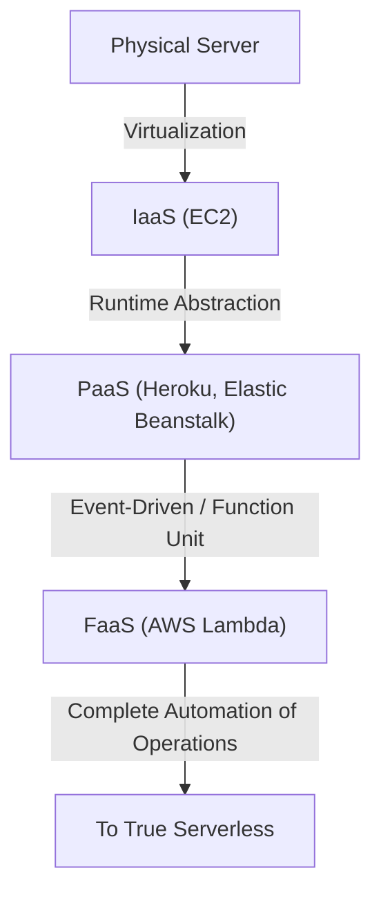
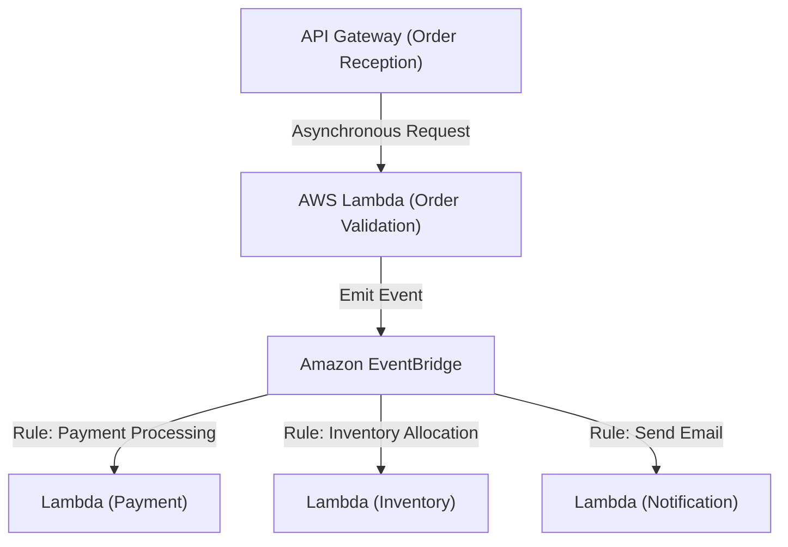

## 1. Introduction: What is Serverless?

When first hearing the term 'Serverless', many developers might have imagined a magical system where physical servers don't exist. However, the true meaning of serverless in cloud computing is not that 'servers do not exist', but that 'there is no need to be aware of the existence of servers', in other words, 'liberation from the heavy lifting of infrastructure provisioning and operational management'.

FaaS (Function as a Service), represented by AWS Lambda, established a model where computing resources for executing code are dynamically allocated only at the moment a request occurs, and billed by the millisecond. This freed developers from non-functional requirements such as 'server patching', 'scaling configuration', and 'capacity planning', allowing them to focus on their primary value creation: building business logic. In this article, we will delve deeply into the true value of this serverless architecture, modern design methodologies utilizing AWS Lambda, and the lesser-known operational challenges and their solutions.

## 2. History of Infrastructure Evolution: From Physical Servers to FaaS

To understand the rise of serverless, we need to look back at the evolution of infrastructure over the past few decades. Infrastructure has always evolved aiming for 'higher abstraction' and 'reduction of operational costs'.

### 2.1 The Era of Physical Servers (On-Premises)
Early web applications ran on physical servers mounted in racks within an in-house data center. Hardware procurement took months, and it was always necessary to secure excess resources (over-provisioning) in anticipation of peak traffic. It was an era where the company bore responsibility for all layers, including hardware failures, network failures, and power outages.

### 2.2 The IaaS (Infrastructure as a Service) Revolution
The introduction of Amazon EC2 (Elastic Compute Cloud) in 2006 brought a paradigm shift to the industry. It virtualized physical servers and allowed servers (instances) to be launched via API in minutes. However, OS patch management, middleware configuration, and defining scaling rules remained the user's responsibility, keeping it within the paradigm of 'virtual servers on the cloud'.

### 2.3 PaaS (Platform as a Service) and Containers
PaaS like Heroku and Google App Engine provided an experience where developers could deploy applications just by pushing code, as the platform managed the runtime environment. At the same time, container technology represented by Docker emerged, dramatically improving environmental portability and resource efficiency by packaging applications and their dependencies. However, managing the clusters (like Kubernetes) to run containers became a new operational burden, creating 'Day 2 Operations' challenges.

### 2.4 The Birth of FaaS (Function as a Service)
Then in 2014, FaaS was born with the announcement of AWS Lambda. Developers deploy code in the smallest unit called a 'function', and execute it triggered by specific events (HTTP requests, file uploads, database changes, etc.). Cost during idle time became zero, establishing a true 'serverless' paradigm that automatically scales (theoretically) infinitely according to the number of requests.

## 3. Core Concept of Serverless: Complete Separation of Compute and Storage

The most important paradigm shift in designing a serverless architecture is the 'complete separation of compute (calculation) and storage (memory)'.

In traditional monolithic architectures, 'stateful' design, which holds session information and temporary data in the application server's memory or local disk, was common. However, in a FaaS environment, the container executing the function (Firecracker microVM in AWS Lambda) is dynamically generated for each request and can be destroyed at any time after execution completes.

Due to this 'ephemeral' nature, holding state within a function becomes an anti-pattern. Instead, state and data must be externalized to a managed NoSQL database like Amazon DynamoDB, object storage like Amazon S3, or an in-memory store like Amazon ElastiCache (Redis).

With this complete separation, the compute layer becomes completely 'stateless', and even if 1000 functions handling single requests spin up simultaneously, data consistency and conflicts can be centrally managed at the database layer.

## 4. Internal Architecture and Execution Model of AWS Lambda

Although it's 'serverless', servers are certainly running deep inside AWS data centers. By what mechanism is code executed inside Lambda?

AWS Lambda uses a lightweight open-source microVM called 'Firecracker' to balance security and performance. Firecracker utilizes KVM (Kernel-based Virtual Machine) to provide extremely small virtual machines that boot in milliseconds. This ensures a secure execution environment completely isolated from other customers' code (strong security boundary) in a multi-tenant environment, while achieving boot speeds comparable to containers.

The execution lifecycle of Lambda is divided into the following three phases:
1. **Init (Initialization) Phase**: Downloads the code, builds the execution environment, starts the runtime (Node.js, Python, Java, etc.), and executes initialization processing outside the function code (such as establishing database connections).
2. **Invoke Phase**: The event payload is passed to the handler function, and the actual business logic is executed.
3. **Shutdown Phase**: A shutdown signal is sent to the runtime before the execution environment is destroyed (when using extensions).

## 5. The Cold Start Problem and the Evolution of Its Countermeasures

'Cold start' has been debated for years as the biggest technical challenge in serverless architectures. A cold start is the delay (latency) that occurs when a Lambda function is invoked for the first time, or invoked again after a period of no invocations and the execution environment has been destroyed. The time it takes to execute the aforementioned 'Init Phase' is the true identity of this delay.

Particularly with statically typed languages like Java and C#, or applications loading massive libraries (like TensorFlow), a cold start can take several seconds, potentially severely degrading the user experience.

AWS has provided various solutions to this problem over the years.

### 5.1 Provisioned Concurrency
Provisioned Concurrency, announced in 2019, is a feature that keeps a specified number of execution environments always warm (standby state) with the 'Init Phase' completed in advance. This completely avoids cold starts and guarantees stable millisecond response times. However, there is a trade-off that partially undermines the 'pay-as-you-go' benefit of serverless, as billing also occurs for resources in the standby state.

### 5.2 AWS Lambda SnapStart
SnapStart (primarily for Java), introduced in 2022, was a breakthrough in cold start countermeasures. When SnapStart is enabled, publishing a function version initializes the function in advance, takes a 'snapshot' of the memory and disk state, and caches it. Upon invocation, instead of initializing from scratch, the environment is resumed from this snapshot, reducing cold start time by up to 90%. This is an innovative approach utilizing Firecracker's MicroVM Snapshot feature.

## 6. Affinity with Event-Driven Architecture

The true power of serverless is unleashed in an 'Event-Driven Architecture' combined with other AWS managed services.

In an event-driven architecture, state changes within the system are emitted as 'events', triggering each component to operate asynchronously. Lambda can natively process events from over 140 AWS services, not just HTTP requests from API Gateway, but also file uploads to S3, table changes in DynamoDB (DynamoDB Streams), and message arrivals in SQS.

### 6.1 Utilizing Event Source Mapping
By combining Amazon SQS (queuing), Amazon SNS (Pub/Sub), and Amazon EventBridge (event bus), you can prevent tight coupling between systems.
For example, let's consider order processing on an e-commerce site.

In this way, you can build an architecture where multiple microservices react asynchronously and independently to a single event (order generation). Even if one service (for example, the notification service) goes down, the event is retained and retried, dramatically improving the availability of the entire system.

## 7. Best Practices for Operations and Monitoring (Observability)

Although freed from infrastructure management, ensuring 'observability' becomes more important than in the on-premises era in a serverless system where countless distributed functions operate collaboratively. This is because it becomes difficult to identify 'in which function did the error occur?' and 'where is the bottleneck?'.

1. **Distributed Tracing**: Utilize AWS X-Ray to visualize the path a request propagates from API Gateway to Lambda to DynamoDB. You can identify delays between each service in milliseconds.
2. **Structured Logging**: Instead of simple text logging, output logs in JSON format so they can be queried with AWS CloudWatch Logs Insights. Always include context such as request ID and user ID in the logs.
3. **Custom Metrics and Alerts**: Send not only error rates and execution times, but also metrics related to 'business success/failure' (e.g., number of successful order processing) to CloudWatch, and design it to issue alerts when thresholds are exceeded.

## 8. Cost Optimization and Anti-Patterns

Serverless can result in significant cost reductions if used well, but falling into anti-patterns risks unexpected billing (cloud bankruptcy).

### 8.1 Optimizing Memory and Timeouts
Lambda billing is a multiplication of 'allocated memory amount' and 'execution time (milliseconds)'. Increasing memory proportionally increases CPU performance and network bandwidth, so if increasing memory by a factor of 2 results in execution time dropping by more than half, the total cost might conversely become cheaper. It is difficult to adjust this manually, so the best practice is to utilize open-source tools like AWS Lambda Power Tuning to derive the optimal point of cost and performance.

### 8.2 Anti-Pattern: Synchronous Invocation Between Functions
Designing a Lambda to synchronously invoke another Lambda and wait for its result should be absolutely avoided. The calling Lambda continues to be billed while waiting, resulting in 'double billing'. If coordination between functions is necessary, you should use Step Functions (orchestration) or adopt asynchronous invocation (choreography) via SQS/SNS etc.

### 8.3 Anti-Pattern: Excessive Connections to Relational Databases
Because Lambda scales to thousands of instances in an instant, connecting directly to RDS (MySQL, PostgreSQL, etc.) will instantly deplete the DB's connection pool and bring the DB down. To address this, you need to consider using RDS Proxy to pool connections, or migrating to a NoSQL database like DynamoDB that can be accessed via HTTP-based API.

## 9. Conclusion and Future Prospects

Serverless architecture is not just a temporary fad, but the destination of the irreversible evolution of cloud-native application development. Developers have been liberated from the unglamorous operations of infrastructure, and can now deliver business value to end-users faster and more safely.

Looking ahead, the serverless ecosystem will likely develop further through faster cold starts driven by the spread of WebAssembly (Wasm) and integration with edge computing (such as CloudFront Functions and Lambda@Edge).

Towards a world unaware of infrastructure. That is the true value that FaaS and serverless architecture have brought us.
