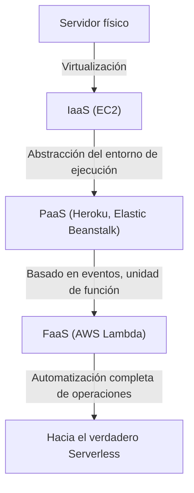
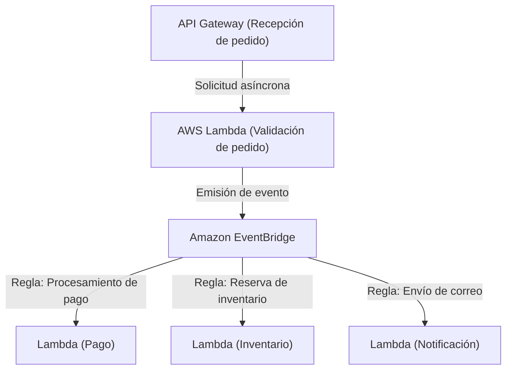

## 1. Introducción: ¿Qué es Serverless?

Cuando escucharon por primera vez la palabra "Serverless" (Sin servidor), muchos desarrolladores pueden haber imaginado "un sistema mágico donde los servidores físicos no existen". Sin embargo, el verdadero significado de Serverless en la computación en la nube no es "que no existan servidores", sino "que no es necesario ser consciente de la existencia de servidores", es decir, "la liberación de la ardua tarea de aprovisionamiento y gestión operativa de la infraestructura".

FaaS (Function as a Service), representado por AWS Lambda, ha establecido un modelo en el que los recursos informáticos para ejecutar código se asignan dinámicamente solo en el momento en que ocurre una solicitud, facturando en milisegundos. Gracias a esto, los desarrolladores se liberan de requisitos no funcionales como "aplicar parches a servidores", "configurar el escalado" y "planificar la capacidad", pudiendo concentrarse en la creación de valor real: la construcción de la lógica de negocio. En este artículo, profundizaremos en el verdadero valor de esta arquitectura Serverless, los últimos métodos de diseño utilizando AWS Lambda, y los desafíos operativos poco conocidos junto con sus soluciones.

## 2. Historia de la evolución de la infraestructura: Del servidor físico a FaaS

Para entender el auge de Serverless, es necesario repasar la evolución de la infraestructura en las últimas décadas. La infraestructura siempre ha evolucionado con el objetivo de "mayor abstracción" y "reducción de costos operativos".

### 2.1 La era de los servidores físicos (On-Premises)
Las primeras aplicaciones web se ejecutaban en servidores físicos montados en racks en el centro de datos propio de la empresa. La adquisición de hardware tomaba meses, y siempre era necesario asegurar recursos excesivos (sobreaprovisionamiento) anticipando el tráfico en horas pico. Era una época en la que la empresa asumía la responsabilidad en todos los niveles por fallas de hardware, fallas de red, fallos de energía, etc.

### 2.2 La revolución de IaaS (Infrastructure as a Service)
La aparición de Amazon EC2 (Elastic Compute Cloud) en 2006 provocó un cambio de paradigma en la industria. Se hizo posible virtualizar servidores físicos y lanzar servidores (instancias) en cuestión de minutos a través de una API. Sin embargo, la gestión de parches del sistema operativo, la configuración del middleware y la definición de reglas de escalado seguían siendo responsabilidad del usuario, manteniéndose en el paradigma de un "servidor virtual en la nube".

### 2.3 PaaS (Platform as a Service) y Contenedores
PaaS como Heroku y Google App Engine ofrecieron una experiencia donde los desarrolladores solo tenían que empujar el código para desplegar la aplicación, ya que la plataforma gestionaba el entorno de ejecución. Al mismo tiempo, apareció la tecnología de contenedores representada por Docker, que al empaquetar la aplicación y sus dependencias mejoró drásticamente la portabilidad del entorno y la eficiencia de los recursos. Sin embargo, surgió el desafío de las "Operaciones del Día 2", donde la gestión del propio clúster (como Kubernetes) para ejecutar los contenedores se convirtió en una nueva carga operativa.

### 2.4 El nacimiento de FaaS (Function as a Service)
Y en 2014, FaaS nació con el anuncio de AWS Lambda. Los desarrolladores despliegan código en la unidad mínima de "función", que se ejecuta activada por un evento específico (solicitudes HTTP, carga de archivos, cambios en la base de datos, etc.). El costo durante el tiempo de inactividad es cero, estableciendo un verdadero paradigma "Serverless" que se escala automáticamente de forma (teóricamente) infinita según el número de solicitudes.

## 3. El concepto central de Serverless: Separación completa de cómputo y almacenamiento

El cambio de paradigma más importante al diseñar una arquitectura Serverless es la "separación completa del cómputo (cálculo) y el almacenamiento (memoria)".

En la arquitectura monolítica tradicional, era común un diseño "con estado" (stateful) donde la información de la sesión y los datos temporales se mantenían en la memoria o el disco local del servidor de aplicaciones. Sin embargo, en un entorno FaaS, los contenedores que ejecutan las funciones (Firecracker microVM en AWS Lambda) se generan dinámicamente para cada solicitud y pueden ser destruidos en cualquier momento una vez que finaliza la ejecución.

Debido a esta naturaleza "efímera", mantener el estado dentro de una función se convierte en un antipatrón. En su lugar, el estado y los datos deben ser externalizados a una base de datos NoSQL administrada como Amazon DynamoDB, a un almacenamiento de objetos como Amazon S3, o a un almacén en memoria como Amazon ElastiCache (Redis).

Con esta separación completa, la capa de cómputo se vuelve completamente "sin estado" (stateless), de modo que incluso si se inician simultáneamente 1000 funciones procesando una única solicitud, la consistencia y los conflictos de los datos pueden ser gestionados de forma centralizada en la capa de la base de datos.

## 4. Arquitectura interna y modelo de ejecución de AWS Lambda

Aunque se llame "Serverless", es seguro que hay servidores funcionando en las profundidades de los centros de datos de AWS. ¿Bajo qué mecanismo se ejecuta el código dentro de Lambda?

AWS Lambda utiliza una microVM ligera de código abierto llamada "Firecracker" para equilibrar la seguridad y el rendimiento. Firecracker utiliza KVM (Kernel-based Virtual Machine) para proporcionar máquinas virtuales extremadamente pequeñas que arrancan en milisegundos. Gracias a esto, en un entorno multi-inquilino (multi-tenant), garantiza un entorno de ejecución seguro (un fuerte límite de seguridad) completamente aislado del código de otros clientes, mientras logra velocidades de arranque comparables a las de un contenedor.

El ciclo de vida de ejecución de Lambda se divide en las siguientes 3 fases:
1. **Fase de Inicialización (Init)**: Se descarga el código, se construye el entorno de ejecución, se inicia el tiempo de ejecución (Node.js, Python, Java, etc.) y se realizan los procesos de inicialización fuera del código de la función (como el establecimiento de conexiones a bases de datos).
2. **Fase de Invocación (Invoke)**: La carga útil del evento se pasa a la función controladora (handler) y se ejecuta la lógica de negocio real.
3. **Fase de Apagado (Shutdown)**: Antes de que el entorno de ejecución sea destruido, se envía una señal de apagado al tiempo de ejecución (si se utilizan extensiones).

## 5. El problema del inicio en frío y la evolución de sus soluciones

El "inicio en frío" (Cold Start) se ha debatido durante mucho tiempo como el mayor desafío técnico en la arquitectura Serverless. El inicio en frío es el retraso (latencia) que se produce cuando una función Lambda es invocada por primera vez, o cuando es invocada de nuevo después de un tiempo sin ser llamada y su entorno de ejecución ha sido destruido. El tiempo que tarda la "Fase de Inicialización" mencionada anteriormente es la verdadera causa de este retraso.

Especialmente en lenguajes de tipado estático como Java o C#, o en aplicaciones que cargan bibliotecas enormes (como TensorFlow), el inicio en frío puede durar varios segundos, lo que podría dañar significativamente la experiencia del usuario.

En respuesta a este problema, AWS ha ofrecido diversas soluciones a lo largo de los años.

### 5.1 Concurrencia Provisionada (Provisioned Concurrency)
Anunciada en 2019, la Concurrencia Provisionada es una característica que mantiene siempre cálido (en estado de espera) un número especificado de entornos de ejecución con la "Fase de Inicialización" completada. De esta manera, es posible evitar completamente el inicio en frío y garantizar respuestas estables en milisegundos. Sin embargo, dado que los recursos en espera también se facturan, existe el compromiso de perder parcialmente la ventaja de Serverless de "pagar solo por lo que usas".

### 5.2 AWS Lambda SnapStart
Introducido en 2022, SnapStart (principalmente para Java) supuso un gran avance en las medidas contra el inicio en frío. Al habilitar SnapStart, cuando se publica una versión de la función, esta se inicializa previamente y se captura y almacena en caché una "instantánea" (snapshot) del estado de la memoria y el disco. En el momento de la invocación, en lugar de inicializar desde cero, el entorno se reanuda desde esta instantánea, lo que puede reducir el tiempo de inicio en frío hasta en un 90%. Este es un enfoque revolucionario que aprovecha la función Snapshot de Firecracker MicroVM.

## 6. Afinidad con la arquitectura orientada a eventos

El verdadero poder de Serverless se manifiesta en la "Arquitectura Orientada a Eventos" (Event-Driven Architecture) combinada con otros servicios administrados de AWS.

En una arquitectura orientada a eventos, los cambios de estado en el sistema se emiten como "eventos", que actúan como disparadores para que cada componente opere de forma asíncrona. Lambda puede procesar eventos de forma nativa desde más de 140 servicios de AWS, no solo solicitudes HTTP desde API Gateway, sino también cargas de archivos a S3, cambios en tablas de DynamoDB (DynamoDB Streams), llegadas de mensajes a SQS, entre otros.

### 6.1 Aprovechamiento del mapeo de fuentes de eventos
Al combinar Amazon SQS (colas), Amazon SNS (Pub/Sub) y Amazon EventBridge (bus de eventos), es posible prevenir el acoplamiento estrecho entre sistemas.
Por ejemplo, consideremos el procesamiento de un pedido en un sitio de comercio electrónico.

De esta manera, se puede construir una arquitectura en la que múltiples microservicios reaccionen de forma asíncrona e independiente ante un solo evento (la generación del pedido). Incluso si un servicio (por ejemplo, el servicio de notificaciones) se cae, los eventos se retienen y se reintentan, mejorando drásticamente la disponibilidad general del sistema.

## 7. Mejores prácticas de operación y monitoreo (Observabilidad)

Aunque te liberes de la gestión de la infraestructura, en un sistema Serverless donde innumerables funciones distribuidas cooperan, asegurar la "observabilidad" es aún más importante que en la era on-premises. Porque resulta más difícil identificar "en qué función ocurrió el error" o "dónde está el cuello de botella".

1. **Rastreo Distribuido**: Aprovechar AWS X-Ray para visualizar la ruta por la que se propagan las solicitudes desde API Gateway hacia Lambda y DynamoDB. Puedes identificar los retrasos entre cada servicio con precisión de milisegundos.
2. **Registro Estructurado (Structured Logging)**: En lugar del simple registro de texto, generar registros en formato JSON y permitir búsquedas mediante consultas en AWS CloudWatch Logs Insights. Los registros deben incluir siempre el contexto, como el ID de la solicitud y el ID del usuario.
3. **Métricas Personalizadas y Alertas**: Diseñar el envío a CloudWatch no solo de métricas de tasas de error y tiempos de ejecución, sino también de métricas sobre "éxito y fracaso empresarial" (por ejemplo: el número de procesamientos exitosos de pedidos), y configurar alertas para que se disparen si se superan ciertos umbrales.

## 8. Optimización de costos y antipatrones

Serverless, si se usa bien, conduce a una reducción significativa de costos, pero caer en antipatrones puede conllevar el peligro de facturas inesperadas (bancarrota en la nube).

### 8.1 Optimización de memoria y tiempos de espera
La facturación de Lambda es la multiplicación de "la cantidad de memoria asignada" y el "tiempo de ejecución (milisegundos)". Al aumentar la memoria, el rendimiento de la CPU y el ancho de banda de la red también aumentan proporcionalmente, por lo que, como resultado de duplicar la memoria, si el tiempo de ejecución se reduce a menos de la mitad, el costo total puede ser en realidad menor. Debido a que ajustar esto manualmente es difícil, la mejor práctica es aprovechar herramientas de código abierto como AWS Lambda Power Tuning para encontrar el punto óptimo entre costo y rendimiento.

### 8.2 Antipatrón: Llamadas síncronas entre funciones
Se debe evitar absolutamente el diseño en el que se llama sincrónicamente a un Lambda desde otro Lambda y se espera su resultado. El Lambda origen de la llamada seguirá siendo facturado mientras está en espera, produciendo "doble facturación". Si se requiere la colaboración entre funciones, se debe adoptar Step Functions (orquestación) o llamadas asíncronas a través de SQS/SNS, etc. (coreografía).

### 8.3 Antipatrón: Conexiones excesivas a bases de datos relacionales
Dado que Lambda puede escalar a miles de instancias en un instante, conectarse directamente a un RDS (como MySQL o PostgreSQL) de esa forma agotará instantáneamente el grupo de conexiones (connection pool) de la base de datos, lo que provocará la caída de la misma. Para abordar esto, es necesario considerar el uso de RDS Proxy para agrupar las conexiones o migrar a una base de datos NoSQL como DynamoDB que se puede acceder mediante una API basada en HTTP.

## 9. Conclusión y perspectivas de futuro

La arquitectura Serverless no es una moda pasajera, sino el destino inevitable de la evolución en el desarrollo de aplicaciones nativas de la nube. Los desarrolladores se han liberado de las tediosas operaciones de infraestructura y ahora pueden entregar valor de negocio a los usuarios finales de forma más rápida y segura.

En el futuro, con la adopción de WebAssembly (Wasm) para acelerar aún más los inicios en frío, y su integración con la computación en el borde (Edge Computing, como CloudFront Functions y Lambda@Edge), el ecosistema Serverless seguirá desarrollándose aún más.

Hacia un mundo donde no nos preocupemos por la infraestructura. Ese es el verdadero valor que FaaS y la arquitectura Serverless nos han aportado.
