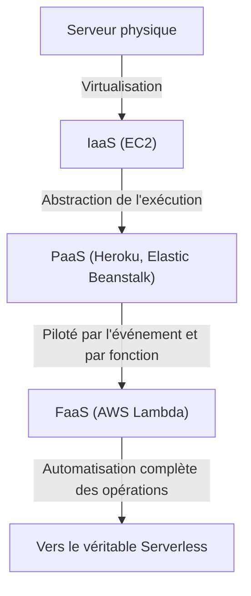
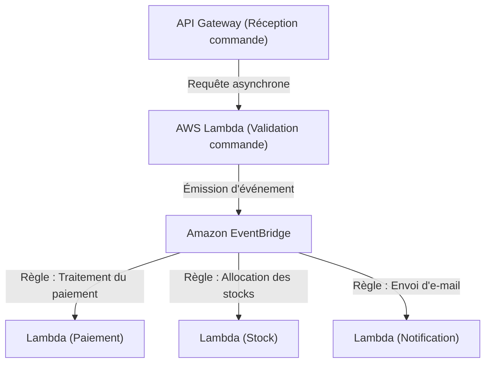

## 1. Introduction : Qu'est-ce que le Serverless ?

Lorsque l'on entend le mot "Serverless" pour la première fois, de nombreux développeurs peuvent imaginer "un système magique sans serveurs physiques". Cependant, la véritable signification du serverless dans le cloud computing n'est pas "qu'il n'y a pas de serveurs", mais "qu'il n'est pas nécessaire de se soucier de l'existence des serveurs", c'est-à-dire "se libérer du lourd fardeau de l'approvisionnement et de la gestion opérationnelle de l'infrastructure".

Le FaaS (Function as a Service), représenté par AWS Lambda, a établi un modèle dans lequel les ressources informatiques pour exécuter le code sont allouées dynamiquement uniquement au moment où une requête se produit, et facturées à la milliseconde. Cela a libéré les développeurs des exigences non fonctionnelles telles que "l'application de correctifs aux serveurs", "la configuration de la mise à l'échelle" et "la planification de la capacité", leur permettant de se concentrer sur la création de valeur fondamentale, à savoir la construction de la logique métier. Dans cet article, nous allons approfondir la véritable valeur de cette architecture serverless, les dernières méthodes de conception utilisant AWS Lambda, ainsi que les défis opérationnels méconnus et leurs solutions.

## 2. L'histoire de l'évolution de l'infrastructure : Des serveurs physiques au FaaS

Pour comprendre l'essor du serverless, il est nécessaire de revenir sur l'évolution de l'infrastructure au cours des dernières décennies. L'infrastructure a toujours évolué dans le but d'atteindre "une plus grande abstraction" et "une réduction des coûts opérationnels".

### 2.1 L'ère des serveurs physiques (sur site)
Les premières applications web fonctionnaient sur des serveurs physiques montés dans des baies au sein de centres de données internes. L'acquisition de matériel prenait des mois, et il était toujours nécessaire de s'assurer de ressources excessives (surprovisionnement) en prévision des pics de trafic. C'était une époque où l'entreprise elle-même assumait la responsabilité de tous les niveaux, tels que les pannes matérielles, les pannes de réseau et les pannes de courant.

### 2.2 La révolution de l'IaaS (Infrastructure as a Service)
L'apparition d'Amazon EC2 (Elastic Compute Cloud) en 2006 a apporté un changement de paradigme dans l'industrie. Les serveurs physiques ont été virtualisés, permettant de lancer des serveurs (instances) en quelques minutes via une API. Cependant, la gestion des correctifs du système d'exploitation, la configuration des middlewares et la définition des règles de mise à l'échelle restaient sous la responsabilité de l'utilisateur, ce qui maintenait le paradigme des "serveurs virtuels dans le cloud".

### 2.3 Le PaaS (Platform as a Service) et les conteneurs
Les PaaS comme Heroku et Google App Engine ont offert une expérience où les développeurs n'avaient qu'à pousser leur code pour déployer des applications, la plateforme gérant l'environnement d'exécution. Simultanément, des technologies de conteneurs représentées par Docker sont apparues, améliorant considérablement la portabilité des environnements et l'efficacité des ressources en empaquetant les applications et leurs dépendances. Cependant, la gestion des clusters pour exécuter les conteneurs (comme Kubernetes) est devenue une nouvelle charge opérationnelle, donnant naissance au défi des "Day 2 Operations".

### 2.4 La naissance du FaaS (Function as a Service)
Puis, en 2014, l'annonce d'AWS Lambda a donné naissance au FaaS. Les développeurs déploient du code sous la forme de "fonctions" comme unité minimale, et l'exécutent en réponse à des événements spécifiques (requêtes HTTP, téléchargements de fichiers, modifications de bases de données, etc.). Le coût en cas d'inactivité est devenu nul, et un véritable paradigme "serverless", capable de s'adapter automatiquement et de manière (théoriquement) infinie au nombre de requêtes, a été établi.

## 3. Le concept central du Serverless : La séparation complète du calcul et du stockage

Le changement de paradigme le plus important dans la conception d'une architecture serverless est "la séparation complète du calcul (compute) et du stockage (storage)".

Dans l'architecture monolithique traditionnelle, il était courant d'avoir une conception "stateful" (avec maintien de l'état) où les informations de session et les données temporaires étaient conservées dans la mémoire ou le disque local du serveur d'application. Cependant, dans un environnement FaaS, les conteneurs qui exécutent les fonctions (Firecracker microVM dans AWS Lambda) sont générés dynamiquement pour chaque requête et peuvent être détruits à tout moment une fois l'exécution terminée.

En raison de cette nature "éphémère" (de courte durée), maintenir un état à l'intérieur d'une fonction est un anti-pattern. À la place, les états et les données doivent être externalisés vers des bases de données NoSQL gérées comme Amazon DynamoDB, du stockage d'objets comme Amazon S3, ou des stockages en mémoire comme Amazon ElastiCache (Redis).

Grâce à cette séparation complète, la couche de calcul devient totalement "stateless" (sans état), de sorte que même si 1000 fonctions traitant une seule requête sont lancées simultanément, la cohérence et les conflits de données peuvent être gérés de manière centralisée au niveau de la couche de base de données.

## 4. L'architecture interne et le modèle d'exécution d'AWS Lambda

Bien qu'il soit qualifié de "serverless", des serveurs fonctionnent bel et bien au plus profond des centres de données d'AWS. Par quel mécanisme le code est-il exécuté à l'intérieur de Lambda ?

AWS Lambda utilise un microVM open-source léger appelé "Firecracker" pour équilibrer la sécurité et les performances. Firecracker utilise KVM (Kernel-based Virtual Machine) pour fournir de minuscules machines virtuelles qui démarrent en quelques millisecondes. Cela permet de garantir un environnement d'exécution sûr (frontière de sécurité forte) complètement isolé du code des autres clients dans un environnement multi-locataire, tout en atteignant des vitesses de démarrage comparables à celles des conteneurs.

Le cycle de vie d'exécution de Lambda est divisé en trois phases :
1. **Phase Init (Initialisation)** : Téléchargement du code, construction de l'environnement d'exécution, démarrage du runtime (Node.js, Python, Java, etc.) et exécution du processus d'initialisation en dehors du code de la fonction (comme l'établissement des connexions à la base de données).
2. **Phase Invoke (Appel)** : La charge utile de l'événement est passée à la fonction de gestion (handler), et la logique métier réelle est exécutée.
3. **Phase Shutdown (Arrêt)** : Avant que l'environnement d'exécution ne soit détruit, un signal d'arrêt est envoyé au runtime (si des extensions sont utilisées).

## 5. Le problème du démarrage à froid et l'évolution de ses solutions

Le "démarrage à froid" (cold start) est le défi technique le plus débattu depuis des années dans les architectures serverless. Le démarrage à froid est le délai (latence) qui se produit lorsqu'une fonction Lambda est appelée pour la première fois, ou lorsqu'elle est rappelée après que son environnement d'exécution a été détruit suite à une période d'inactivité. Le temps nécessaire à l'exécution de la "phase Init" mentionnée ci-dessus est la cause de ce délai.

En particulier pour les langages à typage statique comme Java ou C#, ou les applications chargeant d'énormes bibliothèques (comme TensorFlow), le démarrage à froid pouvait prendre plusieurs secondes, risquant de détériorer considérablement l'expérience utilisateur.

Face à ce problème, AWS a fourni diverses solutions au fil des ans.

### 5.1 Provisioned Concurrency (Accès simultané provisionné)
Annoncée en 2019, la fonction Provisioned Concurrency maintient toujours au chaud (en attente) un nombre prédéfini d'environnements d'exécution dont la "phase Init" est terminée. Cela permet d'éviter complètement les démarrages à froid et de garantir de manière stable des temps de réponse de l'ordre de la milliseconde. Cependant, il y a un compromis, car les ressources en attente sont également facturées, ce qui annule partiellement l'avantage du "paiement à l'usage" du serverless.

### 5.2 AWS Lambda SnapStart
Introduit en 2022, SnapStart (principalement pour Java) a été une percée dans la lutte contre les démarrages à froid. Lorsqu'on active SnapStart, la fonction est initialisée à l'avance lors de la publication d'une version de fonction, et un "snapshot" (instantané) de l'état de la mémoire et du disque est capturé et mis en cache. Lors de l'appel, l'environnement reprend à partir de ce snapshot au lieu d'être initialisé depuis zéro, ce qui peut réduire le temps de démarrage à froid jusqu'à 90 %. Il s'agit d'une approche révolutionnaire exploitant la fonctionnalité MicroVM Snapshot de Firecracker.

## 6. Affinité avec l'architecture pilotée par les événements

La véritable puissance du serverless se révèle lorsqu'il est combiné avec d'autres services gérés d'AWS dans une "architecture pilotée par les événements (Event-Driven Architecture)".

Dans une architecture pilotée par les événements, un changement d'état dans le système est émis sous forme d'"événement", qui déclenche le fonctionnement asynchrone de chaque composant. Lambda peut traiter nativement des événements provenant de plus de 140 services AWS, tels que des requêtes HTTP depuis API Gateway, des téléchargements de fichiers vers S3, des modifications de tables DynamoDB (DynamoDB Streams), ou l'arrivée de messages dans SQS.

### 6.1 Utilisation du mappage des sources d'événements
En combinant Amazon SQS (mise en file d'attente), Amazon SNS (Pub/Sub) et Amazon EventBridge (bus d'événements), on peut éviter un couplage fort entre les systèmes.
Prenons par exemple le traitement des commandes sur un site de e-commerce.

De cette façon, il est possible de construire une architecture où de multiples microservices réagissent de manière asynchrone et indépendante à un seul événement (la génération d'une commande). Même si un service (comme le service de notification) tombe en panne, les événements sont conservés et les tentatives sont répétées, ce qui améliore considérablement la disponibilité de l'ensemble du système.

## 7. Meilleures pratiques d'opération et de surveillance (Observability)

Bien que l'on soit libéré de la gestion de l'infrastructure, garantir l'"observabilité (Observability)" devient plus important que du temps du sur site dans un système serverless où d'innombrables fonctions distribuées opèrent en coordination. Il devient plus difficile d'identifier "dans quelle fonction l'erreur s'est produite ?" et "où se situe le goulot d'étranglement ?".

1. **Traçage distribué** : Utilisez AWS X-Ray pour visualiser le chemin par lequel les requêtes se propagent depuis API Gateway vers Lambda et DynamoDB. Vous pouvez identifier les retards entre chaque service à la milliseconde près.
2. **Journalisation structurée** : Au lieu d'une simple journalisation textuelle, produisez des journaux au format JSON afin qu'ils puissent être interrogés avec AWS CloudWatch Logs Insights. Incluez toujours des contextes tels que l'ID de requête et l'ID utilisateur dans les journaux.
3. **Métriques personnalisées et alertes** : Concevez pour envoyer non seulement les taux d'erreur et les temps d'exécution, mais aussi des métriques concernant les "succès et échecs commerciaux" (par ex. le nombre de traitements de commandes réussis) à CloudWatch, et déclenchez des alertes lorsque les seuils sont dépassés.

## 8. Optimisation des coûts et anti-patterns

Le serverless peut réduire considérablement les coûts s'il est bien utilisé, mais tomber dans des anti-patterns risque d'entraîner des factures inattendues (faillite cloud).

### 8.1 Optimisation de la mémoire et des délais d'attente
La facturation de Lambda est le produit de "la quantité de mémoire allouée" et "le temps d'exécution (en millisecondes)". Étant donné que les performances du processeur et la bande passante du réseau augmentent proportionnellement avec l'ajout de mémoire, si doubler la mémoire réduit le temps d'exécution de plus de la moitié, le coût total peut en fait baisser. Il est difficile de l'ajuster manuellement, c'est pourquoi la meilleure pratique consiste à utiliser des outils open-source comme AWS Lambda Power Tuning pour trouver le point d'optimisation entre coût et performance.

### 8.2 Anti-pattern : Appels synchrones entre les fonctions
Concevoir un appel synchrone d'une fonction Lambda depuis une autre fonction Lambda et attendre le résultat doit être absolument évité. La fonction Lambda appelante continue d'être facturée pendant son attente, ce qui entraîne une "double facturation". Si une coordination entre les fonctions est nécessaire, vous devez utiliser Step Functions (orchestration) ou adopter un appel asynchrone (chorégraphie) via SQS/SNS, etc.

### 8.3 Anti-pattern : Connexions excessives aux bases de données relationnelles
Puisque Lambda peut s'adapter (scale) à des milliers d'instances en un instant, si vous vous connectez directement à RDS (comme MySQL ou PostgreSQL), le pool de connexions de la base de données s'épuisera instantanément, provoquant une panne de la base de données. Pour y remédier, vous devez utiliser RDS Proxy pour regrouper les connexions, ou envisager de migrer vers une base de données NoSQL accessible via une API HTTP comme DynamoDB.

## 9. Conclusion et perspectives d'avenir

L'architecture serverless n'est pas qu'une simple tendance passagère, c'est le point d'aboutissement irréversible de l'évolution du développement d'applications cloud-natives. Les développeurs sont libérés des opérations fastidieuses de l'infrastructure et peuvent désormais fournir plus rapidement et plus sûrement de la valeur commerciale aux utilisateurs finaux.

À l'avenir, l'écosystème serverless continuera probablement de se développer avec l'accélération des démarrages à froid grâce à la popularisation de WebAssembly (Wasm) et son intégration avec l'edge computing (comme CloudFront Functions et Lambda@Edge).

Vers un monde où l'on ne se soucie plus de l'infrastructure. Telle est la véritable valeur que le FaaS et l'architecture serverless nous ont apportée.
