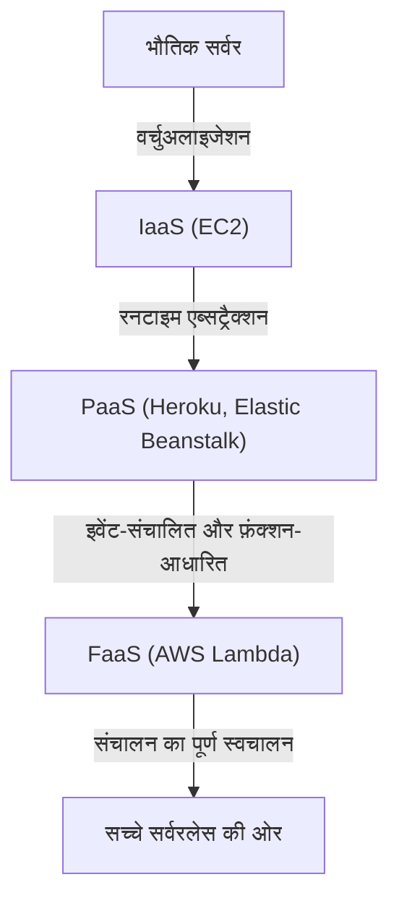
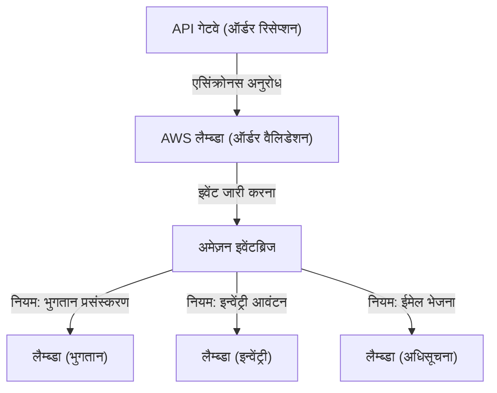

## 1. परिचय: सर्वरलेस क्या है?

"सर्वरलेस (Serverless)" शब्द पहली बार सुनने पर, कई डेवलपर्स ने "एक जादुई प्रणाली जहां कोई भौतिक सर्वर मौजूद नहीं है" की कल्पना की होगी। हालाँकि, क्लाउड कंप्यूटिंग में सर्वरलेस का वास्तविक अर्थ यह नहीं है कि "कोई सर्वर मौजूद नहीं है", बल्कि यह है कि "सर्वर के अस्तित्व के बारे में जागरूक होने की कोई आवश्यकता नहीं है", यानी "बुनियादी ढांचे के प्रोविज़निंग और संचालन प्रबंधन के भारी काम से मुक्ति"।

AWS लैम्ब्डा द्वारा प्रदर्शित FaaS (फ़ंक्शन एज़ ए सर्विस), ने एक ऐसा मॉडल स्थापित किया है जहाँ कोड निष्पादित करने के लिए कंप्यूटिंग संसाधन केवल उसी क्षण गतिशील रूप से आवंटित किए जाते हैं जब कोई अनुरोध उत्पन्न होता है, और बिलिंग मिलीसेकंड में की जाती है। इसने डेवलपर्स को "सर्वर पैचिंग," "स्केलिंग कॉन्फ़िगरेशन," और "क्षमता नियोजन (Capacity Planning)" जैसी गैर-कार्यात्मक आवश्यकताओं से मुक्त कर दिया, जिससे वे व्यावसायिक तर्क (Business Logic) बनाने के अपने मूल मूल्य-निर्माण पर ध्यान केंद्रित कर सकें। इस लेख में, हम इस सर्वरलेस आर्किटेक्चर के वास्तविक मूल्य, AWS लैम्ब्डा का उपयोग करके नवीनतम डिज़ाइन विधियों, और अज्ञात परिचालन चुनौतियों तथा उनके समाधानों पर गहराई से विचार करेंगे।

## 2. बुनियादी ढांचे के विकास का इतिहास: भौतिक सर्वर से FaaS तक

सर्वरलेस के उदय को समझने के लिए, हमें पिछले कुछ दशकों में बुनियादी ढांचे के विकास को देखने की जरूरत है। बुनियादी ढांचा (Infrastructure) हमेशा "उच्च एब्सट्रैक्शन (Abstraction)" और "परिचालन लागत में कमी" के लक्ष्य के साथ विकसित हुआ है।

### 2.1 भौतिक सर्वर (ऑन-प्रिमाइसेस) का युग
शुरुआती वेब एप्लिकेशन कंपनी के अपने डेटा सेंटर में रैक-माउंटेड भौतिक सर्वरों पर चलते थे। हार्डवेयर की खरीद में महीनों लग जाते थे, और चरम ट्रैफ़िक की प्रत्याशा में हमेशा अतिरिक्त संसाधनों (ओवर-प्रोविज़निंग) को सुरक्षित करना आवश्यक था। यह एक ऐसा युग था जब कंपनियों को हार्डवेयर विफलता, नेटवर्क विफलता और बिजली विफलता जैसे सभी परतों की जिम्मेदारी खुद उठानी पड़ती थी।

### 2.2 IaaS (इन्फ्रास्ट्रक्चर एज़ ए सर्विस) की क्रांति
2006 में Amazon EC2 (Elastic Compute Cloud) की शुरुआत ने उद्योग में एक आदर्श बदलाव (Paradigm Shift) लाया। भौतिक सर्वरों को वर्चुअलाइज़ करना और API के माध्यम से मिनटों में सर्वर (इंस्टेंस) शुरू करना संभव हो गया। हालाँकि, OS पैच प्रबंधन, मिडलवेयर कॉन्फ़िगरेशन, और स्केलिंग नियमों को परिभाषित करना अभी भी उपयोगकर्ता की ज़िम्मेदारी थी, और यह प्रतिमान (Paradigm) "क्लाउड में वर्चुअल सर्वर" तक ही सीमित रहा।

### 2.3 PaaS (प्लेटफ़ॉर्म एज़ ए सर्विस) और कंटेनर
Heroku और Google App Engine जैसे PaaS ने एक ऐसा अनुभव प्रदान किया जहाँ प्लेटफ़ॉर्म द्वारा रनटाइम वातावरण का प्रबंधन करके डेवलपर्स केवल कोड पुश करके एप्लिकेशन परिनियोजित (Deploy) कर सकते थे। साथ ही, डॉकर द्वारा प्रदर्शित कंटेनर तकनीक उभरी, और एप्लिकेशन तथा उसकी निर्भरताओं (Dependencies) को पैकेज करके, पर्यावरण की पोर्टेबिलिटी और संसाधन दक्षता में नाटकीय रूप से सुधार हुआ। हालाँकि, "डे 2 ऑपरेशंस (Day 2 Operations)" की समस्या उत्पन्न हुई जहाँ कंटेनरों को चलाने के लिए क्लस्टर (जैसे कुबेरनेट्स) का प्रबंधन करना अपने आप में एक नया परिचालन बोझ बन गया।

### 2.4 FaaS (फ़ंक्शन एज़ ए सर्विस) का जन्म
और फिर 2014 में, AWS लैम्ब्डा की घोषणा के साथ FaaS का जन्म हुआ। डेवलपर्स "फ़ंक्शन" नामक सबसे छोटी इकाई में कोड परिनियोजित करते हैं, और इसे विशिष्ट घटनाओं (HTTP अनुरोध, फ़ाइल अपलोड, डेटाबेस परिवर्तन आदि) द्वारा ट्रिगर होने पर निष्पादित करते हैं। निष्क्रिय होने पर लागत शून्य हो जाती है, और अनुरोधों की संख्या के अनुसार असीमित रूप से (सैद्धांतिक रूप से) ऑटो-स्केल होने वाले एक सच्चे "सर्वरलेस" प्रतिमान की स्थापना हुई।

## 3. सर्वरलेस की मुख्य अवधारणा: कंप्यूट और स्टोरेज का पूर्ण पृथक्करण

सर्वरलेस आर्किटेक्चर को डिज़ाइन करने में सबसे महत्वपूर्ण बदलाव "कंप्यूट (गणना) और स्टोरेज (भंडारण) का पूर्ण पृथक्करण" है।

पारंपरिक मोनोलिथिक आर्किटेक्चर में, "स्टेटफुल (Stateful)" डिज़ाइन जहाँ सत्र (Session) की जानकारी और अस्थायी डेटा को एप्लिकेशन सर्वर की मेमोरी या स्थानीय डिस्क में रखा जाता था, आम बात थी। हालाँकि, FaaS वातावरण में, फ़ंक्शन निष्पादित करने वाला कंटेनर (AWS लैम्ब्डा में Firecracker microVM) प्रत्येक अनुरोध के लिए गतिशील रूप से उत्पन्न होता है और निष्पादन पूरा होने के बाद किसी भी समय नष्ट किया जा सकता है।

इस "अस्थायी (Ephemeral)" प्रकृति के कारण, फ़ंक्शन के भीतर स्थिति को बनाए रखना एक एंटी-पैटर्न है। इसके बजाय, स्थिति और डेटा को Amazon DynamoDB जैसे प्रबंधित NoSQL डेटाबेस, Amazon S3 जैसे ऑब्जेक्ट स्टोरेज, या Amazon ElastiCache (Redis) जैसे इन-मेमोरी स्टोर में बाहरी रूप से संग्रहीत किया जाना चाहिए।

इस पूर्ण पृथक्करण के साथ, कंप्यूट परत पूरी तरह से "स्टेटलेस (Stateless)" हो जाती है, और भले ही एक ही अनुरोध को संसाधित करने वाले 1000 फ़ंक्शन एक साथ शुरू हो जाएँ, डेटा स्थिरता और संघर्ष को डेटाबेस परत पर केंद्रीय रूप से प्रबंधित किया जा सकता है।

## 4. AWS लैम्ब्डा का आंतरिक आर्किटेक्चर और निष्पादन मॉडल

हालाँकि इसे "सर्वरलेस" कहा जाता है, सर्वर निश्चित रूप से AWS के डेटा सेंटरों में गहराई से चल रहे हैं। लैम्ब्डा के भीतर किस तरह के तंत्र (Mechanism) से कोड निष्पादित किया जाता है?

AWS लैम्ब्डा सुरक्षा और प्रदर्शन दोनों को संतुलित करने के लिए "Firecracker" नामक एक ओपन-सोर्स लाइटवेट माइक्रो-VM का उपयोग करता है। Firecracker KVM (Kernel-based Virtual Machine) का उपयोग करता है और मिलीसेकंड में बूट होने वाली बहुत छोटी वर्चुअल मशीनें प्रदान करता है। परिणामस्वरूप, एक मल्टी-टेनेंट वातावरण में, यह कंटेनर-स्तर की बूट गति प्राप्त करते हुए एक सुरक्षित निष्पादन वातावरण (मजबूत सुरक्षा सीमा) सुनिश्चित करता है जो अन्य ग्राहकों के कोड से पूरी तरह से अलग है।

लैम्ब्डा के निष्पादन जीवनचक्र (Execution Lifecycle) को निम्नलिखित तीन चरणों में विभाजित किया गया है:
1. **Init (आरंभीकरण) चरण**: कोड डाउनलोड करना, निष्पादन वातावरण का निर्माण, रनटाइम (Node.js, Python, Java आदि) शुरू करना, और फ़ंक्शन कोड के बाहर की प्रारंभिक प्रक्रियाएं (जैसे डेटाबेस कनेक्शन स्थापित करना)।
2. **Invoke (आह्वान) चरण**: इवेंट पेलोड को हैंडलर फ़ंक्शन में पास किया जाता है, और वास्तविक व्यावसायिक तर्क (Business Logic) निष्पादित किया जाता है।
3. **Shutdown (शटडाउन) चरण**: निष्पादन वातावरण नष्ट होने से पहले, रनटाइम को एक शटडाउन सिग्नल भेजा जाता है (यदि एक्सटेंशन का उपयोग किया जा रहा है)।

## 5. कोल्ड स्टार्ट की समस्या और इसके समाधान का विकास

"कोल्ड स्टार्ट" को सर्वरलेस आर्किटेक्चर में सबसे बड़ी तकनीकी चुनौती के रूप में लंबे समय से बहस का विषय रहा है। कोल्ड स्टार्ट वह विलंब (Latency) है जो तब होता है जब पहली बार लैम्ब्डा फ़ंक्शन को कॉल किया जाता है, या जब निष्पादन वातावरण को निष्क्रियता की अवधि के बाद नष्ट किए जाने के बाद इसे फिर से कॉल किया जाता है। ऊपर उल्लिखित "Init चरण" को निष्पादित करने में लगने वाला समय इस विलंब का मूल कारण है।

विशेष रूप से Java और C# जैसी स्थिर रूप से टाइप की गई (Statically Typed) भाषाओं में, या भारी लाइब्रेरीज़ (जैसे TensorFlow) लोड करने वाले एप्लिकेशनों में, कोल्ड स्टार्ट में कई सेकंड लग सकते हैं, जो उपयोगकर्ता अनुभव को गंभीर रूप से खराब कर सकता है।

इस समस्या के लिए, AWS ने कई वर्षों में विभिन्न समाधान प्रदान किए हैं।

### 5.1 Provisioned Concurrency (प्रावधानित समवर्तीता)
2019 में घोषित Provisioned Concurrency एक ऐसी सुविधा है जो निष्पादन वातावरण की एक निर्दिष्ट संख्या को "Init चरण" पूरा होने के साथ हमेशा वार्म (स्टैंडबाय अवस्था) में रखती है। यह कोल्ड स्टार्ट से पूरी तरह बचाता है और मिलीसेकंड में स्थिर प्रतिक्रियाओं की गारंटी देता है। हालाँकि, स्टैंडबाय संसाधनों के लिए भी शुल्क लिया जाता है, इसलिए सर्वरलेस के "उपयोग के अनुसार भुगतान (Pay-as-you-go)" लाभ से समझौता किया जाता है।

### 5.2 AWS लैम्ब्डा स्नैपस्टार्ट (AWS Lambda SnapStart)
2022 में पेश किया गया SnapStart (मुख्य रूप से Java के लिए) कोल्ड स्टार्ट समाधानों में एक सफलता थी। जब SnapStart सक्षम होता है, तो फ़ंक्शन संस्करण प्रकाशित होने पर यह पहले से फ़ंक्शन को इनिशियलाइज़ करता है, और मेमोरी तथा डिस्क स्थिति का "स्नैपशॉट" कैप्चर करके कैश करता है। आह्वान (Invocation) पर, वातावरण को खरोंच से शुरू करने के बजाय इस स्नैपशॉट से फिर से शुरू (Resume) किया जाता है, जो कोल्ड स्टार्ट समय को 90% तक कम कर सकता है। यह Firecracker की MicroVM Snapshot सुविधा का लाभ उठाने वाला एक क्रांतिकारी दृष्टिकोण है।

## 6. इवेंट-संचालित आर्किटेक्चर के साथ आत्मीयता

सर्वरलेस की असली ताकत तब सामने आती है जब इसे अन्य प्रबंधित AWS सेवाओं के संयोजन में "इवेंट-संचालित आर्किटेक्चर (Event-Driven Architecture)" में उपयोग किया जाता है।

इवेंट-संचालित आर्किटेक्चर में, सिस्टम के भीतर स्थिति में परिवर्तन "इवेंट्स" के रूप में जारी किए जाते हैं, और प्रत्येक घटक (Component) इसे ट्रिगर के रूप में उपयोग करके एसिंक्रोनस रूप से संचालित होता है। लैम्ब्डा 140 से अधिक AWS सेवाओं से इवेंट्स को मूल रूप से प्रोसेस कर सकता है, न केवल API गेटवे से HTTP अनुरोध, बल्कि S3 पर फ़ाइल अपलोड, DynamoDB टेबल में बदलाव (DynamoDB Streams), और SQS संदेशों का आगमन भी।

### 6.1 इवेंट सोर्स मैपिंग का उपयोग
Amazon SQS (क्यूइंग), Amazon SNS (पब/सब), और Amazon EventBridge (इवेंट बस) को मिलाकर, आप सिस्टम के बीच तंग युग्मन (Tight Coupling) को रोक सकते हैं।
उदाहरण के लिए, ई-कॉमर्स साइट पर ऑर्डर प्रोसेसिंग पर विचार करें।

इस तरह, आप एक ऐसा आर्किटेक्चर बना सकते हैं जहाँ कई माइक्रोसर्विसेज एक ही इवेंट (ऑर्डर की घटना) पर एसिंक्रोनस और स्वतंत्र रूप से प्रतिक्रिया करती हैं। भले ही कोई भी सेवा (उदाहरण के लिए, अधिसूचना सेवा) डाउन हो जाए, इवेंट को बनाए रखा जाता है और फिर से प्रयास किया जाता है, जिससे समग्र सिस्टम की उपलब्धता में नाटकीय रूप से सुधार होता है।

## 7. संचालन और निगरानी की सर्वोत्तम प्रथाएं (ऑब्जर्वेबिलिटी)

हालाँकि आपको बुनियादी ढांचे के प्रबंधन से मुक्त कर दिया जाता है, "ऑब्जर्वेबिलिटी (अवलोकन क्षमता)" सुनिश्चित करना सर्वरलेस सिस्टम में ऑन-प्रिमाइसेस युग की तुलना में और भी महत्वपूर्ण हो जाता है जहाँ अनगिनत वितरित फ़ंक्शन एक साथ काम करते हैं। ऐसा इसलिए है क्योंकि यह पहचानना मुश्किल हो जाता है कि "किस फ़ंक्शन में त्रुटि हुई?" और "अड़चन (Bottleneck) कहाँ है?"।

1. **डिस्ट्रिब्यूटेड ट्रेसिंग**: AWS X-Ray का उपयोग करते हुए, उस पथ की कल्पना करें जिसके माध्यम से अनुरोध API गेटवे से लैम्ब्डा और DynamoDB तक फैलता है। प्रत्येक सेवा के बीच विलंबता को मिलीसेकंड में पहचाना जा सकता है।
2. **स्ट्रक्चर्ड लॉगिंग**: केवल टेक्स्ट लॉगिंग के बजाय, JSON प्रारूप में लॉग आउटपुट करें ताकि उन्हें AWS CloudWatch Logs Insights में खोजा जा सके। लॉग में हमेशा अनुरोध ID और उपयोगकर्ता ID जैसे संदर्भ (Context) शामिल करें।
3. **कस्टम मेट्रिक्स और अलर्ट**: केवल त्रुटि दर और निष्पादन समय ही नहीं, बल्कि "व्यावसायिक सफलता/विफलता" से संबंधित मेट्रिक्स (उदाहरण: सफल ऑर्डर प्रोसेसिंग की संख्या) को CloudWatch पर भेजें, और सीमा से अधिक होने पर अलर्ट जारी करने के लिए इसे डिज़ाइन करें।

## 8. लागत अनुकूलन और एंटी-पैटर्न

यदि सही तरीके से उपयोग किया जाए तो सर्वरलेस के परिणामस्वरूप महत्वपूर्ण लागत बचत हो सकती है, लेकिन यदि आप एंटी-पैटर्न में पड़ जाते हैं, तो अप्रत्याशित बिलिंग (क्लाउड दिवालियापन) का जोखिम होता है।

### 8.1 मेमोरी और टाइमआउट का अनुकूलन
लैम्ब्डा बिलिंग "आवंटित मेमोरी की मात्रा" और "निष्पादन समय (मिलीसेकंड)" का गुणन है। जैसे-जैसे आप मेमोरी बढ़ाते हैं, CPU प्रदर्शन और नेटवर्क बैंडविड्थ भी आनुपातिक रूप से बढ़ते हैं, इसलिए यदि आप मेमोरी को दोगुना करते हैं और परिणामस्वरूप निष्पादन समय आधा हो जाता है, तो कुल लागत वास्तव में सस्ती हो सकती है। इसे मैन्युअल रूप से समायोजित करना मुश्किल है, इसलिए सर्वोत्तम अभ्यास AWS Lambda Power Tuning जैसे ओपन-सोर्स टूल का उपयोग करके लागत और प्रदर्शन के इष्टतम बिंदु को खोजना है।

### 8.2 एंटी-पैटर्न: कार्यों के बीच सिंक्रोनस आह्वान
एक लैम्ब्डा से दूसरे लैम्ब्डा को सिंक्रोनस रूप से कॉल करने और परिणाम की प्रतीक्षा करने के डिज़ाइन से हर कीमत पर बचा जाना चाहिए। कॉल करने वाले लैम्ब्डा से प्रतीक्षा करते समय शुल्क लिया जाता रहेगा, जिसके परिणामस्वरूप "दोहरा शुल्क (Double Billing)" लगेगा। यदि फ़ंक्शंस के बीच समन्वय की आवश्यकता है, तो आपको Step Functions (ऑर्केस्ट्रेशन) का उपयोग करना चाहिए, या SQS/SNS आदि के माध्यम से एसिंक्रोनस आह्वान (कोरिओग्राफी) को अपनाना चाहिए।

### 8.3 एंटी-पैटर्न: रिलेशनल डेटाबेस से अत्यधिक कनेक्शन
चूंकि लैम्ब्डा पलक झपकते ही हजारों इंस्टेंसेस तक स्केल हो जाता है, अगर आप सीधे RDS (जैसे MySQL या PostgreSQL) से जुड़ते हैं, तो DB का कनेक्शन पूल तुरंत समाप्त हो जाएगा और DB डाउन हो जाएगा। इससे निपटने के लिए, आपको कनेक्शन पूल करने के लिए RDS Proxy का उपयोग करने या DynamoDB जैसे HTTP-आधारित API के माध्यम से सुलभ NoSQL डेटाबेस में माइग्रेट करने पर विचार करना होगा।

## 9. निष्कर्ष और भविष्य की संभावनाएं

सर्वरलेस आर्किटेक्चर केवल एक क्षणिक प्रवृत्ति नहीं है, बल्कि क्लाउड-नेटिव एप्लिकेशन विकास के अपरिवर्तनीय विकास की परिणति है। डेवलपर्स अब बुनियादी ढांचे के कठिन संचालन से मुक्त हैं, और अंतिम उपयोगकर्ताओं (End Users) तक व्यावसायिक मूल्य तेजी से और सुरक्षित रूप से पहुंचा सकते हैं।

भविष्य में, WebAssembly (Wasm) के प्रसार और एज कंप्यूटिंग (जैसे CloudFront Functions और Lambda@Edge) के साथ एकीकरण के कारण और भी तेज़ कोल्ड स्टार्ट के साथ, सर्वरलेस इकोसिस्टम का और विस्तार होना तय है।

बुनियादी ढांचे के बारे में जागरूकता के बिना एक दुनिया की ओर। यही वह वास्तविक मूल्य है जो FaaS और सर्वरलेस आर्किटेक्चर हमारे लिए लेकर आए हैं。
