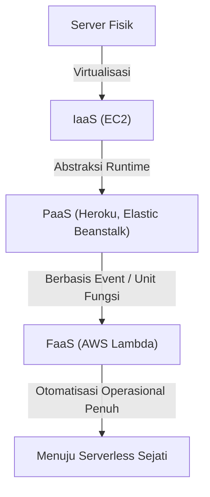
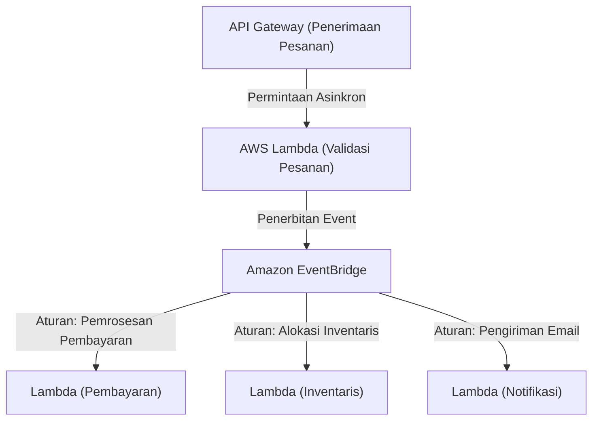

## 1. Pendahuluan: Apa itu Serverless?

Ketika pertama kali mendengar kata "Serverless", banyak pengembang mungkin membayangkan "sistem ajaib di mana server fisik tidak ada". Namun, makna sebenarnya dari serverless dalam komputasi awan bukanlah "server tidak ada", melainkan "tidak perlu menyadari keberadaan server", yaitu "pembebasan dari kerja keras penyediaan infrastruktur dan manajemen operasional".

FaaS (Function as a Service), yang diwakili oleh AWS Lambda, menetapkan model di mana sumber daya komputasi untuk menjalankan kode dialokasikan secara dinamis hanya pada saat permintaan terjadi, dan ditagih dalam satuan milidetik. Hal ini membebaskan pengembang dari persyaratan non-fungsional seperti "menambal server (patching)", "mengatur penskalaan", dan "perencanaan kapasitas (capacity planning)", sehingga mereka dapat fokus pada penciptaan nilai yang sebenarnya, yaitu membangun logika bisnis. Dalam artikel ini, kita akan menggali lebih dalam tentang nilai sebenarnya dari arsitektur serverless, metode desain terbaru yang memanfaatkan AWS Lambda, serta tantangan operasional yang jarang diketahui beserta solusinya.

## 2. Sejarah Evolusi Infrastruktur: Dari Server Fisik ke FaaS

Untuk memahami kebangkitan serverless, kita perlu menengok kembali evolusi infrastruktur selama beberapa dekade terakhir. Infrastruktur selalu berevolusi dengan tujuan mencapai "abstraksi yang lebih tinggi" dan "pengurangan biaya operasional".

### 2.1 Era Server Fisik (On-Premises)
Aplikasi web awal berjalan di server fisik yang dipasang di rak pusat data perusahaan sendiri. Pengadaan perangkat keras membutuhkan waktu berbulan-bulan, dan sumber daya berlebih (over-provisioning) selalu perlu diamankan untuk mengantisipasi lalu lintas saat beban puncak. Itu adalah era di mana perusahaan harus menanggung tanggung jawab di semua lapisan, termasuk kegagalan perangkat keras, kegagalan jaringan, dan kegagalan daya.

### 2.2 Revolusi IaaS (Infrastructure as a Service)
Munculnya Amazon EC2 (Elastic Compute Cloud) pada tahun 2006 membawa pergeseran paradigma ke dalam industri. Server fisik divirtualisasikan, sehingga server (instance) dapat dijalankan dalam beberapa menit melalui API. Namun, manajemen patch OS, konfigurasi middleware, dan penentuan aturan penskalaan masih menjadi tanggung jawab pengguna, dan tetap berada pada paradigma "server virtual di cloud".

### 2.3 PaaS (Platform as a Service) dan Kontainer
PaaS seperti Heroku dan Google App Engine menawarkan pengalaman di mana pengembang hanya perlu mendorong kode untuk menerapkan aplikasi, dengan lingkungan runtime yang dikelola oleh platform. Pada saat yang sama, teknologi kontainer yang diwakili oleh Docker muncul, secara dramatis meningkatkan portabilitas lingkungan dan efisiensi sumber daya dengan memaketkan aplikasi beserta dependensinya. Namun, muncul tantangan baru "Day 2 Operations", di mana pengelolaan klaster untuk menjalankan kontainer (seperti Kubernetes) itu sendiri menjadi beban operasional yang baru.

### 2.4 Kelahiran FaaS (Function as a Service)
Kemudian pada tahun 2014, FaaS lahir dengan pengumuman AWS Lambda. Pengembang menerapkan kode dalam unit terkecil yang disebut "fungsi", dan menjalankannya dengan menggunakan event (permintaan HTTP, pengunggahan file, perubahan database, dll.) sebagai pemicu (trigger). Biaya pada saat diam (idle) menjadi nol, dan paradigma "serverless" sejati yang secara otomatis berskala tanpa batas (secara teori) sesuai dengan jumlah permintaan pun terbentuk.

## 3. Konsep Inti Serverless: Pemisahan Total antara Komputasi dan Penyimpanan

Pergeseran paradigma terpenting dalam merancang arsitektur serverless adalah "pemisahan total antara komputasi (perhitungan) dan penyimpanan (memori)".

Dalam arsitektur monolitik konvensional, desain "stateful (mempertahankan status)" di mana informasi sesi dan data sementara disimpan dalam memori atau disk lokal dari server aplikasi adalah hal yang umum. Namun, di lingkungan FaaS, kontainer yang menjalankan fungsi (Firecracker microVM pada AWS Lambda) dibuat secara dinamis untuk setiap permintaan, dan dapat dihancurkan kapan saja setelah eksekusi selesai.

Karena sifat "ephemeral (berumur pendek)" ini, mempertahankan status di dalam fungsi menjadi sebuah anti-pattern. Sebagai gantinya, status dan data harus dieksternalisasi ke database NoSQL terkelola seperti Amazon DynamoDB, penyimpanan objek seperti Amazon S3, atau penyimpanan in-memory seperti Amazon ElastiCache (Redis).

Melalui pemisahan total ini, lapisan komputasi menjadi sepenuhnya "stateless", dan bahkan jika 1000 fungsi yang menangani permintaan tunggal dijalankan secara bersamaan, konsistensi dan konflik data dapat dikelola secara terpusat di sisi lapisan database.

## 4. Arsitektur Internal dan Model Eksekusi AWS Lambda

Meskipun disebut "serverless", jauh di dalam pusat data AWS, server pasti sedang berjalan. Mekanisme seperti apa yang digunakan di dalam Lambda untuk menjalankan kode?

AWS Lambda menggunakan mikroVM ringan sumber terbuka yang disebut "Firecracker" untuk menyeimbangkan keamanan dan kinerja. Firecracker memanfaatkan KVM (Kernel-based Virtual Machine) untuk menyediakan mesin virtual sangat kecil yang dapat dimulai dalam hitungan milidetik. Hal ini memungkinkan terwujudnya lingkungan eksekusi yang aman (batas keamanan yang kuat) yang sepenuhnya terisolasi dari kode pelanggan lain di lingkungan multi-tenant, sembari mencapai kecepatan booting yang setara dengan kontainer.

Siklus hidup eksekusi Lambda dibagi menjadi 3 fase berikut:
1. **Fase Init (Inisialisasi)**: Kode diunduh, lingkungan eksekusi dibangun, runtime (Node.js, Python, Java, dll.) dimulai, dan proses inisialisasi di luar kode fungsi (seperti membangun koneksi database) dilakukan.
2. **Fase Invoke (Pemanggilan)**: Payload dari event diteruskan ke fungsi handler, dan logika bisnis yang sebenarnya dieksekusi.
3. **Fase Shutdown (Penghentian)**: Sinyal shutdown dikirim ke runtime sebelum lingkungan eksekusi dihancurkan (jika menggunakan ekstensi).

## 5. Masalah Cold Start dan Evolusi Penanganannya

Tantangan teknis terbesar dalam arsitektur serverless yang telah lama didiskusikan adalah "Cold Start". Cold start adalah keterlambatan (latensi) yang terjadi ketika fungsi Lambda dipanggil untuk pertama kalinya, atau dipanggil kembali setelah beberapa saat tidak ada pemanggilan dan lingkungan eksekusi telah dihancurkan. Waktu yang diperlukan untuk menjalankan "Fase Init" yang disebutkan di atas adalah penyebab sebenarnya dari keterlambatan ini.

Khususnya untuk bahasa dengan pengetikan statis (seperti Java atau C#), atau aplikasi yang memuat pustaka besar (seperti TensorFlow), cold start dapat memakan waktu beberapa detik, yang berpotensi merusak pengalaman pengguna secara signifikan.

Untuk mengatasi masalah ini, AWS telah menyediakan berbagai solusi selama bertahun-tahun.

### 5.1 Provisioned Concurrency (Konkurensi yang Disediakan)
Diumumkan pada tahun 2019, Provisioned Concurrency adalah fitur yang selalu menjaga sejumlah lingkungan eksekusi yang telah ditentukan sebelumnya dalam keadaan hangat (standby) dengan "Fase Init" yang sudah selesai. Hal ini dapat sepenuhnya menghindari cold start dan menjamin respons dalam satuan milidetik yang stabil. Namun, ada trade-off di mana biaya juga dikenakan untuk sumber daya yang dalam keadaan siaga, yang sedikit mengurangi keuntungan "bayar sesuai penggunaan" dari serverless.

### 5.2 AWS Lambda SnapStart
Diperkenalkan pada tahun 2022, SnapStart (terutama untuk Java) menjadi terobosan dalam menangani cold start. Saat SnapStart diaktifkan, fungsi akan diinisialisasi terlebih dahulu ketika versi fungsi dipublikasikan, dan status memori serta disk akan diambil sebagai "snapshot" lalu disimpan di cache. Pada saat pemanggilan, alih-alih menginisialisasi dari awal, lingkungan dilanjutkan (Resume) dari snapshot ini, sehingga waktu cold start dapat dikurangi hingga 90%. Ini adalah pendekatan inovatif yang memanfaatkan fitur Snapshot MicroVM dari Firecracker.

## 6. Afinitas dengan Arsitektur Berbasis Event (Event-Driven Architecture)

Kekuatan sejati serverless ditunjukkan dalam "Arsitektur Berbasis Event (Event-Driven Architecture)" jika digabungkan dengan layanan terkelola AWS lainnya.

Dalam arsitektur berbasis event, perubahan status dalam sistem dipublikasikan sebagai "event", yang kemudian memicu setiap komponen untuk beroperasi secara asinkron. Lambda dapat memproses secara natif event dari lebih dari 140 layanan AWS, tidak hanya permintaan HTTP dari API Gateway, tetapi juga pengunggahan file ke S3, perubahan tabel di DynamoDB (DynamoDB Streams), kedatangan pesan di SQS, dan lain-lain.

### 6.1 Memanfaatkan Pemetaan Sumber Event (Event Source Mapping)
Dengan menggabungkan Amazon SQS (antrean), Amazon SNS (Pub/Sub), dan Amazon EventBridge (bus event), Anda dapat mencegah integrasi yang terlalu erat antar sistem.
Sebagai contoh, mari kita pertimbangkan pemrosesan pesanan di situs e-commerce.

Dengan cara ini, Anda dapat membangun arsitektur di mana beberapa layanan mikro bereaksi secara asinkron dan independen terhadap satu event (terjadinya pesanan). Bahkan jika salah satu layanan (misalnya, layanan notifikasi) mati, event akan disimpan dan dicoba lagi, sehingga ketersediaan sistem secara keseluruhan meningkat secara drastis.

## 7. Praktik Terbaik untuk Operasi & Pemantauan (Observability)

Meskipun terbebas dari manajemen infrastruktur, memastikan "observabilitas (keteramatan)" dalam sistem serverless di mana banyak fungsi terdistribusi bekerja secara bersamaan menjadi lebih penting daripada era on-premises. Hal ini karena menjadi lebih sulit untuk mengidentifikasi "fungsi mana yang mengalami kesalahan?" dan "di mana letak bottleneck-nya?".

1. **Distributed Tracing (Pelacakan Terdistribusi)**: Memanfaatkan AWS X-Ray untuk memvisualisasikan rute transmisi permintaan dari API Gateway ke Lambda, lalu ke DynamoDB. Anda dapat mengidentifikasi keterlambatan antar layanan dalam satuan milidetik.
2. **Structured Logging (Pencatatan Log Terstruktur)**: Alih-alih hanya teks biasa, keluarkan log dalam format JSON agar dapat dicari dengan kueri di AWS CloudWatch Logs Insights. Pastikan untuk selalu menyertakan konteks seperti ID permintaan atau ID pengguna di dalam log.
3. **Custom Metrics and Alerts (Metrik dan Peringatan Kustom)**: Selain tingkat kesalahan dan waktu eksekusi, rancang agar metrik yang berkaitan dengan "keberhasilan/kegagalan bisnis" (misalnya, jumlah pemrosesan pesanan yang berhasil) dikirim ke CloudWatch, dan peringatan dikeluarkan jika melampaui ambang batas.

## 8. Optimalisasi Biaya dan Anti-Pattern

Jika digunakan dengan baik, serverless akan menghasilkan pengurangan biaya yang signifikan, tetapi jika terjebak dalam anti-pattern, ada risiko tagihan tak terduga (kebangkrutan cloud).

### 8.1 Optimalisasi Memori dan Batas Waktu (Timeout)
Tagihan Lambda adalah perkalian antara "jumlah memori yang dialokasikan" dan "waktu eksekusi (milidetik)". Karena peningkatan memori juga secara proporsional meningkatkan kinerja CPU dan bandwidth jaringan, jika memori digandakan dan menghasilkan waktu eksekusi berkurang lebih dari setengahnya, total biaya malah akan menjadi lebih murah. Mengatur hal ini secara manual sangatlah sulit, sehingga praktik terbaiknya adalah memanfaatkan alat sumber terbuka seperti AWS Lambda Power Tuning untuk menemukan titik optimal antara biaya dan kinerja.

### 8.2 Anti-Pattern: Pemanggilan Sinkron antar Fungsi
Merancang agar sebuah fungsi Lambda memanggil fungsi Lambda lain secara sinkron dan menunggu hasilnya harus benar-benar dihindari. Lambda pemanggil akan terus ditagih selama masa tunggu, yang mengakibatkan "tagihan ganda". Jika kolaborasi antar fungsi diperlukan, Anda harus menggunakan Step Functions (orkestrasi) atau mengadopsi pemanggilan asinkron (koreografi) melalui SQS/SNS dan lain-lain.

### 8.3 Anti-Pattern: Koneksi Berlebihan ke Database Relasional
Karena Lambda berskala hingga ribuan instance dalam sekejap, jika terhubung langsung ke RDS (seperti MySQL atau PostgreSQL), kumpulan koneksi basis data akan langsung habis, dan basis data akan mati. Untuk mengatasinya, perlu dipertimbangkan penggunaan RDS Proxy untuk mengumpulkan koneksi, atau bermigrasi ke database NoSQL yang dapat diakses dengan API berbasis HTTP seperti DynamoDB.

## 9. Kesimpulan dan Prospek Masa Depan

Arsitektur serverless bukanlah sekadar tren sesaat, melainkan titik pencapaian yang tidak dapat diubah dari evolusi pengembangan aplikasi cloud-native. Pengembang kini terbebas dari operasi infrastruktur yang rumit dan dapat memberikan nilai bisnis kepada pengguna akhir dengan lebih cepat dan lebih aman.

Ke depannya, dengan percepatan cold start lebih lanjut melalui populernya WebAssembly (Wasm) dan integrasinya dengan komputasi edge (seperti CloudFront Functions dan Lambda@Edge), ekosistem serverless akan semakin berkembang.

Menuju dunia di mana infrastruktur tidak lagi perlu disadari. Itulah nilai sebenarnya yang dibawa oleh FaaS dan arsitektur serverless kepada kita.
