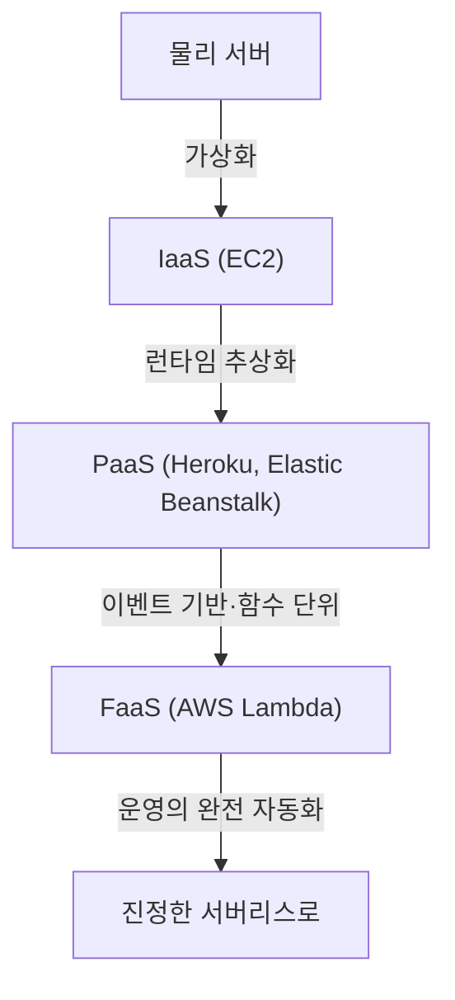
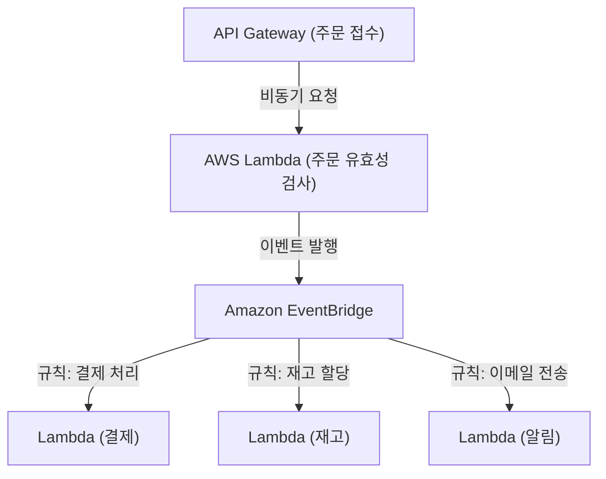

## 1. 시작하며: 서버리스란 무엇인가?

'서버리스(Serverless)'라는 단어를 처음 들었을 때, 많은 개발자는 '물리적인 서버가 존재하지 않는 마법 같은 시스템'을 상상했을지도 모릅니다. 하지만 클라우드 컴퓨팅에서 서버리스의 진의는 '서버가 존재하지 않는다'는 것이 아니라 '서버의 존재를 의식할 필요가 없다', 즉 '인프라의 프로비저닝과 운영 관리라는 중노동으로부터의 해방'에 있습니다.

AWS Lambda로 대표되는 FaaS(Function as a Service)는 코드를 실행하기 위한 컴퓨팅 리소스를 요청이 발생한 순간에만 동적으로 할당하고 밀리초 단위로 과금하는 모델을 확립했습니다. 이를 통해 개발자는 '서버 패치 적용', '스케일링 설정', '용량 계획'과 같은 비기능 요구사항에서 벗어나 비즈니스 로직 구축이라는 본연의 가치 창출에 집중할 수 있게 되었습니다. 본 기사에서는 이러한 서버리스 아키텍처의 진가와 AWS Lambda를 활용한 최신 설계 기법, 그리고 잘 알려지지 않은 운영상의 과제와 그 해결책에 대해 깊이 파헤쳐 보겠습니다.

## 2. 인프라의 진화 역사: 물리 서버에서 FaaS로

서버리스의 대두를 이해하기 위해서는 지난 수십 년간 인프라의 진화를 되돌아볼 필요가 있습니다. 인프라는 항상 '더 높은 추상화'와 '운영 비용 절감'을 목표로 진화해 왔습니다.

### 2.1 물리 서버(온프레미스) 시대
초기의 웹 애플리케이션은 자사 데이터 센터의 랙에 마운트된 물리 서버 위에서 구동되었습니다. 하드웨어 조달에는 수개월이 걸렸고, 피크 시 트래픽을 예상하여 항상 과잉 리소스(오버 프로비저닝)를 확보해야 했습니다. 하드웨어 장애, 네트워크 장애, 전원 장애 등 모든 계층에서의 책임을 자사에서 져야 하는 시대였습니다.

### 2.2 IaaS(Infrastructure as a Service)의 혁명
2006년 Amazon EC2(Elastic Compute Cloud)의 등장은 업계에 패러다임 전환을 가져왔습니다. 물리 서버를 가상화하고 API를 통해 수 분 만에 서버(인스턴스)를 시작할 수 있게 된 것입니다. 하지만 OS 패치 관리, 미들웨어 설정, 스케일링 규칙 정의 등은 여전히 사용자의 책임이었으며, '클라우드 상의 가상 서버'라는 패러다임에 머물러 있었습니다.

### 2.3 PaaS(Platform as a Service)와 컨테이너
Heroku나 Google App Engine 등의 PaaS는 런타임 환경을 플랫폼이 관리함으로써 개발자가 코드를 푸시하는 것만으로 애플리케이션을 배포할 수 있는 경험을 제공했습니다. 동시에 Docker로 대표되는 컨테이너 기술이 등장하여 애플리케이션과 그 의존 관계를 패키지화함으로써 환경의 이식성과 리소스 효율이 극적으로 향상되었습니다. 하지만 컨테이너를 실행하기 위한 클러스터(Kubernetes 등) 관리 자체가 새로운 운영 부담이 되는 'Day 2 Operations' 과제가 발생했습니다.

### 2.4 FaaS(Function as a Service)의 탄생
그리고 2014년, AWS Lambda의 발표와 함께 FaaS가 탄생했습니다. 개발자는 '함수'라는 최소 단위로 코드를 배포하고, 특정 이벤트(HTTP 요청, 파일 업로드, 데이터베이스 변경 등)를 트리거로 하여 실행합니다. 유휴 상태일 때의 비용은 제로가 되며, 요청 수에 따라 무한(이론상)으로 자동 확장되는 진정한 '서버리스' 패러다임이 확립되었습니다.

## 3. 서버리스의 핵심 개념: 컴퓨팅과 스토리지의 완전한 분리

서버리스 아키텍처를 설계하는 데 있어 가장 중요한 패러다임 전환은 '컴퓨팅(계산)과 스토리지(기억)의 완전한 분리'입니다.

기존의 모놀리식 아키텍처에서는 애플리케이션 서버의 메모리나 로컬 디스크에 세션 정보나 임시 데이터를 유지하는 '스테이트풀(상태 유지)' 설계가 일반적이었습니다. 하지만 FaaS 환경에서는 함수를 실행하는 컨테이너(AWS Lambda에서는 Firecracker microVM)가 요청마다 동적으로 생성되며, 실행이 끝나면 언제든 파기될 수 있습니다.

이러한 '단명(ephemeral)'하는 성질 때문에 함수 내에서 상태를 유지하는 것은 안티패턴이 됩니다. 대신 상태나 데이터는 Amazon DynamoDB와 같은 관리형 NoSQL 데이터베이스, Amazon S3와 같은 객체 스토리지, 혹은 Amazon ElastiCache(Redis)와 같은 인메모리 스토어 외부로 분리해야 합니다.

이 완전한 분리를 통해 컴퓨팅 계층은 완전히 '스테이트리스(stateless)'가 되며, 단일 요청을 처리하는 함수가 1000개 동시에 기동하더라도 데이터의 일관성이나 경합을 데이터베이스 계층 측에서 집중 관리할 수 있게 됩니다.

## 4. AWS Lambda의 내부 아키텍처와 실행 모델

'서버리스'라고는 하지만, AWS 데이터 센터의 깊숙한 곳에서는 분명히 서버가 움직이고 있습니다. Lambda 내부에서는 어떤 원리로 코드가 실행되고 있을까요?

AWS Lambda는 보안과 성능을 양립하기 위해 'Firecracker'라는 오픈소스 경량 마이크로 VM을 사용하고 있습니다. Firecracker는 KVM(Kernel-based Virtual Machine)을 이용하여 밀리초 단위로 부팅되는 아주 작은 가상 머신을 제공합니다. 이를 통해 멀티 테넌트 환경에서 다른 고객의 코드로부터 완전히 격리된 안전한 실행 환경(강력한 보안 경계)을 확보하면서도 컨테이너 수준의 기동 속도를 실현하고 있습니다.

Lambda의 실행 수명 주기는 다음 세 가지 단계로 나뉩니다:
1. **Init(초기화) 단계**: 코드 다운로드, 실행 환경 구축, 런타임(Node.js, Python, Java 등)의 기동 및 함수 코드 외부의 초기화 처리(데이터베이스 연결 확립 등)가 이루어집니다.
2. **Invoke(호출) 단계**: 이벤트 페이로드가 핸들러 함수로 전달되고, 실제 비즈니스 로직이 실행됩니다.
3. **Shutdown(종료) 단계**: 실행 환경이 파기되기 전에 런타임에 종료 신호가 전송됩니다(확장 기능을 사용하는 경우).

## 5. 콜드 스타트 문제와 그 대책의 진화

서버리스 아키텍처에서 가장 큰 기술적 과제로 오랫동안 논의되어 온 것이 바로 '콜드 스타트'입니다. 콜드 스타트란 Lambda 함수가 처음 호출되었을 때, 혹은 한동안 호출이 없어 실행 환경이 파기된 후 다시 호출되었을 때 발생하는 지연(레이턴시)을 말합니다. 앞서 언급한 'Init 단계'의 실행에 걸리는 시간이 이 지연의 정체입니다.

특히 Java나 C#과 같은 정적 타입 언어나 거대한 라이브러리(TensorFlow 등)를 불러오는 애플리케이션에서는 콜드 스타트가 수 초에 달하기도 하여 사용자 경험을 현저히 저해할 가능성이 있었습니다.

이 문제에 대해 AWS는 수년간 다양한 해결책을 제공해 왔습니다.

### 5.1 Provisioned Concurrency(프로비저닝된 동시 실행)
2019년에 발표된 Provisioned Concurrency는 사전에 지정한 수의 실행 환경을 'Init 단계'가 완료된 상태로 항상 웜(대기 상태)으로 유지하는 기능입니다. 이를 통해 콜드 스타트를 완전히 회피하고 안정적으로 밀리초 단위의 응답을 보장할 수 있습니다. 단, 대기 상태의 리소스에 대해서도 과금이 발생하므로 서버리스의 '사용한 만큼 과금'이라는 장점을 일부 희생하는 트레이드오프가 있습니다.

### 5.2 AWS Lambda SnapStart
2022년에 도입된 SnapStart(주로 Java용)는 콜드 스타트 대책의 돌파구가 되었습니다. SnapStart를 활성화하면 함수 버전을 배포할 때 사전에 함수를 초기화하고 메모리와 디스크 상태의 '스냅샷'을 얻어 캐시합니다. 호출 시에는 처음부터 초기화하는 대신 이 스냅샷에서 환경을 재개(Resume)시키기 때문에 콜드 스타트 시간을 최대 90%까지 줄일 수 있습니다. 이는 Firecracker의 MicroVM Snapshot 기능을 활용한 획기적인 접근법입니다.

## 6. 이벤트 기반 아키텍처와의 친화성

서버리스의 진정한 힘은 AWS의 다른 관리형 서비스와 결합된 '이벤트 기반 아키텍처(Event-Driven Architecture)'에서 발휘됩니다.

이벤트 기반 아키텍처에서는 시스템 내의 상태 변화가 '이벤트'로 발행되고, 이를 트리거로 하여 각 컴포넌트가 비동기적으로 동작합니다. Lambda는 API Gateway의 HTTP 요청뿐만 아니라 S3로의 파일 업로드, DynamoDB 테이블 변경(DynamoDB Streams), SQS 메시지 도착 등 140개 이상의 AWS 서비스에서 발생하는 이벤트를 네이티브하게 처리할 수 있습니다.

### 6.1 이벤트 소스 매핑의 활용
Amazon SQS(큐잉)나 Amazon SNS(Pub/Sub), Amazon EventBridge(이벤트 버스)를 조합함으로써 시스템 간의 강한 결합을 막을 수 있습니다.
예를 들어, 이커머스 사이트에서의 주문 처리를 생각해 봅시다.

이와 같이 하나의 이벤트(주문 발생)에 대해 여러 마이크로서비스가 비동기적이고 독립적으로 반응하는 아키텍처를 구축할 수 있습니다. 어딘가 하나의 서비스(예: 알림 서비스)가 다운되더라도 이벤트는 유지되고 재시도되므로 시스템 전체의 가용성이 극적으로 향상됩니다.

## 7. 운영·모니터링 모범 사례 (Observability)

인프라 관리에서는 해방되지만, 분산된 수많은 함수가 협력하여 동작하는 서버리스 시스템에서 '옵저버빌리티(관측 가능성)'의 확보는 온프레미스 시대 이상으로 중요해집니다. '어떤 함수에서 에러가 발생했는지', '병목 현상은 어디인지'를 파악하기 어려워지기 때문입니다.

1. **분산 트레이싱**: AWS X-Ray를 활용하여 요청이 API Gateway에서 Lambda, DynamoDB로 전파되는 경로를 시각화합니다. 각 서비스 간의 지연을 밀리초 단위로 파악할 수 있습니다.
2. **구조화된 로깅**: 단순한 텍스트 로깅이 아니라 JSON 형식으로 로그를 출력하여 AWS CloudWatch Logs Insights에서 쿼리 검색을 할 수 있도록 합니다. 로그에는 반드시 요청 ID나 사용자 ID 등의 컨텍스트를 포함시킵니다.
3. **사용자 지정 지표 및 알림**: 에러율이나 실행 시간뿐만 아니라 '비즈니스 상의 성공·실패'와 관련된 지표(예: 주문 처리 성공 건수)를 CloudWatch로 전송하고, 임계값을 초과하면 알림이 발생하도록 설계합니다.

## 8. 비용 최적화와 안티패턴

서버리스는 잘 사용하면 대폭적인 비용 절감이 되지만, 안티패턴에 빠지면 예기치 않은 청구(클라우드 파산)를 초래할 위험이 있습니다.

### 8.1 메모리와 타임아웃의 최적화
Lambda의 과금은 '할당된 메모리 양'과 '실행 시간(밀리초)'의 곱입니다. 메모리를 늘리면 CPU 성능이나 네트워크 대역폭도 비례하여 증가하기 때문에, 메모리를 2배로 늘린 결과 실행 시간이 절반 이하가 된다면 총비용은 오히려 저렴해질 수 있습니다. 이를 수동으로 조정하는 것은 어렵기 때문에 AWS Lambda Power Tuning과 같은 오픈소스 도구를 활용하여 비용과 성능의 최적점을 도출하는 것이 모범 사례입니다.

### 8.2 안티패턴: 함수 간의 동기 호출
Lambda에서 다른 Lambda를 동기적으로 호출하고 그 결과를 기다리는 설계는 절대 피해야 합니다. 호출한 Lambda는 대기 중에도 과금이 계속되어 '이중 과금'이 발생합니다. 함수 간의 연동이 필요한 경우에는 Step Functions(오케스트레이션)를 사용하거나 SQS/SNS 등을 통한 비동기 호출(코레오그래피)을 채택해야 합니다.

### 8.3 안티패턴: 관계형 데이터베이스로의 과도한 연결
Lambda는 순식간에 수천 개의 인스턴스로 확장되기 때문에 그대로 RDS(MySQL이나 PostgreSQL 등)에 연결하면 DB의 커넥션 풀이 순식간에 고갈되어 DB가 다운됩니다. 이에 대처하기 위해서는 RDS Proxy를 이용하여 커넥션을 풀링하거나 DynamoDB와 같이 HTTP 기반의 API로 접근할 수 있는 NoSQL 데이터베이스로의 이전을 검토해야 합니다.

## 9. 결론 및 향후 전망

서버리스 아키텍처는 단순한 일시적 유행이 아니라 클라우드 네이티브 애플리케이션 개발의 비가역적인 진화의 도달점입니다. 개발자는 인프라의 험난한 운영에서 벗어나 더 빠르고 더 안전하게 비즈니스 가치를 최종 사용자에게 전달할 수 있게 되었습니다.

향후 WebAssembly(Wasm) 보급으로 인한 콜드 스타트의 추가적인 고속화나 엣지 컴퓨팅(CloudFront Functions나 Lambda@Edge 등)과의 융합을 통해 서버리스 생태계는 더욱 발전해 나갈 것입니다.

인프라를 의식하지 않는 세계로. 그것이 FaaS와 서버리스 아키텍처가 우리에게 가져다준 진가입니다.
