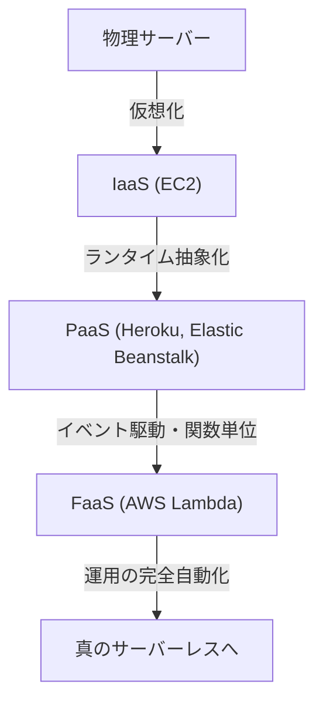
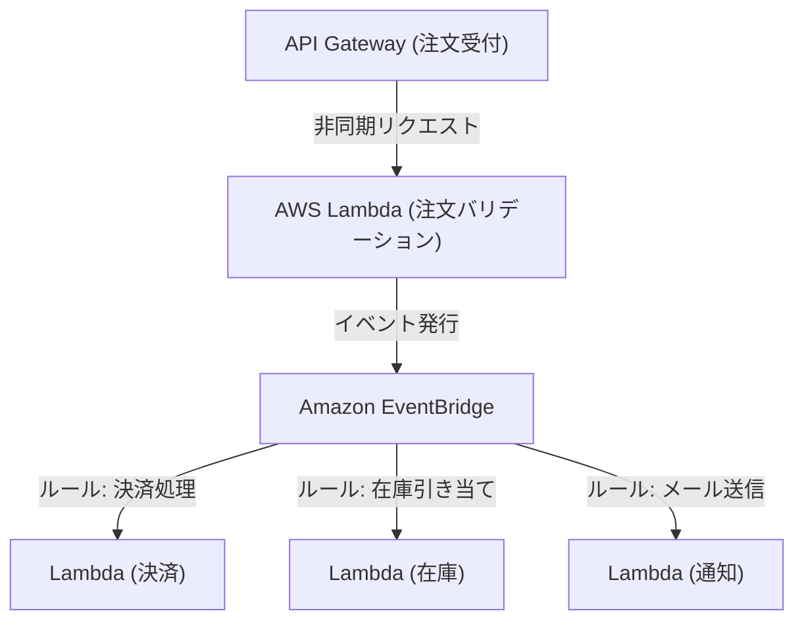

## 1. はじめに：サーバーレスとは何か？

「サーバーレス（Serverless）」という言葉を初めて耳にしたとき、多くの開発者は「物理的なサーバーが存在しない魔法のようなシステム」を想像したかもしれません。しかし、クラウドコンピューティングにおけるサーバーレスの真意は、「サーバーが存在しない」ことではなく、「サーバーの存在を意識する必要がない」、つまり「インフラストラクチャのプロビジョニングと運用管理という重労働からの解放」にあります。

AWS Lambdaに代表されるFaaS（Function as a Service）は、コードを実行するためのコンピューティングリソースを、リクエストが発生した瞬間にのみ動的に割り当て、ミリ秒単位で課金するモデルを確立しました。これにより、開発者は「サーバーのパッチ当て」「スケーリングの設定」「キャパシティプランニング」といった非機能要件から解放され、ビジネスロジックの構築という本来の価値創造に集中できるようになりました。本記事では、このサーバーレスアーキテクチャの真価と、AWS Lambdaを活用した最新の設計手法、そして知られざる運用上の課題とその解決策について深く掘り下げていきます。

## 2. インフラストラクチャの進化の歴史：物理サーバーからFaaSへ

サーバーレスの台頭を理解するためには、過去数十年間のインフラストラクチャの進化を振り返る必要があります。インフラストラクチャは、常に「より高い抽象化」と「運用コストの削減」を目指して進化してきました。

### 2.1 物理サーバー（オンプレミス）の時代
初期のウェブアプリケーションは、自社データセンターのラックにマウントされた物理サーバー上で稼働していました。ハードウェアの調達には数ヶ月を要し、ピーク時のトラフィックを見越して常に過剰なリソース（オーバープロビジョニング）を確保する必要がありました。ハードウェア障害、ネットワーク障害、電源障害など、すべてのレイヤーでの責任を自社で負う時代でした。

### 2.2 IaaS（Infrastructure as a Service）の革命
2006年のAmazon EC2（Elastic Compute Cloud）の登場は、業界にパラダイムシフトをもたらしました。物理サーバーを仮想化し、API経由で数分でサーバー（インスタンス）を起動できるようになったのです。しかし、OSのパッチ管理、ミドルウェアの設定、スケーリングルールの定義などは依然としてユーザーの責任であり、「クラウド上の仮想サーバー」というパラダイムにとどまっていました。

### 2.3 PaaS（Platform as a Service）とコンテナ
HerokuやGoogle App EngineなどのPaaSは、ランタイム環境をプラットフォームが管理することで、開発者がコードをプッシュするだけでアプリケーションをデプロイできる体験を提供しました。同時にDockerに代表されるコンテナ技術が登場し、アプリケーションとその依存関係をパッケージ化することで、環境の移植性とリソース効率が劇的に向上しました。しかし、コンテナを実行するためのクラスター（Kubernetesなど）の管理自体が新たな運用負荷となる「Day 2 Operations」の課題が生じました。

### 2.4 FaaS（Function as a Service）の誕生
そして2014年、AWS Lambdaの発表によりFaaSが誕生しました。開発者は「関数」という最小単位でコードをデプロイし、特定のイベント（HTTPリクエスト、ファイルのアップロード、データベースの変更など）をトリガーにして実行します。アイドル時のコストはゼロとなり、リクエスト数に応じて無限（理論上）に自動スケールする真の「サーバーレス」パラダイムが確立されました。

## 3. サーバーレスの中核概念：コンピュートとストレージの完全な分離

サーバーレスアーキテクチャを設計する上で最も重要なパラダイムシフトは、「コンピュート（計算）とストレージ（記憶）の完全な分離」です。

従来のモノリシックなアーキテクチャでは、アプリケーションサーバーのメモリやローカルディスクにセッション情報や一時データを保持する「ステートフル（状態保持）」な設計が一般的でした。しかし、FaaS環境では、関数を実行するコンテナ（AWS LambdaではFirecracker microVM）はリクエストごとに動的に生成され、実行が終了するといつでも破棄される可能性があります。

この「エフェメラル（短命）」な性質により、関数内で状態を保持することはアンチパターンとなります。代わりに、状態やデータはAmazon DynamoDBのようなマネージドなNoSQLデータベース、Amazon S3のようなオブジェクトストレージ、あるいはAmazon ElastiCache（Redis）のようなインメモリストアに外部化する必要があります。

この完全な分離により、コンピュートレイヤーは完全に「ステートレス」となり、単一のリクエストを処理する関数が1000個同時に立ち上がっても、データの一貫性や競合をデータベースレイヤー側で集中管理できるようになるのです。

## 4. AWS Lambdaの内部アーキテクチャと実行モデル

「サーバーレス」とはいえ、AWSのデータセンターの奥深くでは確実にサーバーが動いています。Lambdaの内部ではどのような仕組みでコードが実行されているのでしょうか。

AWS Lambdaは、セキュリティとパフォーマンスを両立するために「Firecracker」と呼ばれるオープンソースの軽量マイクロVMを使用しています。FirecrackerはKVM（Kernel-based Virtual Machine）を利用し、ミリ秒単位で起動する極小の仮想マシンを提供します。これにより、マルチテナント環境において、他の顧客のコードから完全に隔離された安全な実行環境（強力なセキュリティ境界）を確保しつつ、コンテナ並みの起動速度を実現しています。

Lambdaの実行ライフサイクルは以下の3つのフェーズに分かれます：
1. **Init（初期化）フェーズ**：コードのダウンロード、実行環境の構築、ランタイム（Node.js, Python, Java等）の起動、および関数コード外の初期化処理（データベース接続の確立など）が行われます。
2. **Invoke（呼び出し）フェーズ**：イベントペイロードがハンドラー関数に渡され、実際のビジネスロジックが実行されます。
3. **Shutdown（シャットダウン）フェーズ**：実行環境が破棄される前に、ランタイムにシャットダウンシグナルが送られます（拡張機能を使用している場合）。

## 5. コールドスタート問題とその対策の進化

サーバーレスアーキテクチャにおける最大の技術的課題として長年議論されてきたのが「コールドスタート」です。コールドスタートとは、Lambda関数が初めて呼び出されたとき、あるいはしばらく呼び出しがなく実行環境が破棄された後に再度呼び出されたときに発生する遅延（レイテンシー）のことです。前述の「Initフェーズ」の実行にかかる時間がこの遅延の正体です。

特にJavaやC#などの静的型付け言語や、巨大なライブラリ（TensorFlowなど）を読み込むアプリケーションでは、コールドスタートが数秒に及ぶこともあり、ユーザー体験を著しく損なう可能性がありました。

この問題に対し、AWSは長年にわたり様々な解決策を提供してきました。

### 5.1 Provisioned Concurrency（プロビジョニングされた同時実行）
2019年に発表されたProvisioned Concurrencyは、事前に指定した数の実行環境を「Initフェーズ」が完了した状態で常にウォーム（待機状態）にしておく機能です。これにより、コールドスタートを完全に回避し、安定してミリ秒単位の応答を保証できます。ただし、待機状態のリソースに対しても課金が発生するため、サーバーレスの「使った分だけ課金」というメリットを一部損なうトレードオフがあります。

### 5.2 AWS Lambda SnapStart
2022年に導入されたSnapStart（主にJava向け）は、コールドスタート対策のブレイクスルーとなりました。SnapStartを有効にすると、関数バージョンを公開した際に事前に関数を初期化し、メモリとディスクの状態の「スナップショット」を取得してキャッシュします。呼び出し時には、一から初期化する代わりにこのスナップショットから環境を再開（Resume）させるため、コールドスタートの時間を最大90%削減できます。これはFirecrackerのMicroVM Snapshot機能を活用した画期的なアプローチです。

## 6. イベント駆動型アーキテクチャとの親和性

サーバーレスの真の力は、AWSの他のマネージドサービスと組み合わせた「イベント駆動型アーキテクチャ（Event-Driven Architecture）」で発揮されます。

イベント駆動型アーキテクチャでは、システム内の状態変化が「イベント」として発行され、それをトリガーとして各コンポーネントが非同期に動作します。Lambdaは、API GatewayからのHTTPリクエストだけでなく、S3へのファイルアップロード、DynamoDBのテーブルの変更（DynamoDB Streams）、SQSのメッセージ到達など、140以上のAWSサービスからのイベントをネイティブに処理できます。

### 6.1 イベントソースマッピングの活用
Amazon SQS（キューイング）やAmazon SNS（Pub/Sub）、Amazon EventBridge（イベントバス）を組み合わせることで、システム間の密結合を防ぐことができます。
例えば、Eコマースサイトでの注文処理を考えてみましょう。

このように、1つのイベント（注文発生）に対して複数のマイクロサービスが非同期かつ独立して反応するアーキテクチャを構築できます。どこか一つのサービス（例えば通知サービス）がダウンしても、イベントは保持され再試行されるため、システム全体の可用性が劇的に向上します。

## 7. 運用・監視のベストプラクティス (Observability)

インフラの管理からは解放されますが、分散された無数の関数が協調して動作するサーバーレスシステムにおいて、「オブザーバビリティ（可観測性）」の確保はオンプレミス時代以上に重要になります。「どの関数でエラーが起きたのか？」「ボトルネックはどこか？」を特定するのが難しくなるからです。

1. **分散トレーシング**：AWS X-Rayを活用し、リクエストがAPI GatewayからLambda、DynamoDBへと伝播する経路を可視化します。各サービス間での遅延をミリ秒単位で特定できます。
2. **構造化ロギング**：単なるテキストロギングではなく、JSON形式でログを出力し、AWS CloudWatch Logs Insightsでクエリ検索できるようにします。ログには必ずリクエストIDやユーザーIDなどのコンテキストを含めます。
3. **カスタムメトリクスとアラート**：エラー率や実行時間だけでなく、「ビジネス上の成功・失敗」に関するメトリクス（例：注文処理の成功件数）をCloudWatchに送信し、しきい値を超えたらアラートを発報するように設計します。

## 8. コスト最適化とアンチパターン

サーバーレスはうまく使えば大幅なコスト削減になりますが、アンチパターンに陥ると予期せぬ請求（クラウド破産）を招く危険性があります。

### 8.1 メモリとタイムアウトの最適化
Lambdaの課金は「割り当てたメモリ量」と「実行時間（ミリ秒）」の掛け算です。メモリを増やすとCPU性能やネットワーク帯域も比例して増加するため、メモリを2倍に増やした結果、実行時間が半分以下になれば、トータルコストは逆に安くなることがあります。これを手動で調整するのは困難なため、AWS Lambda Power Tuningのようなオープンソースツールを活用して、コストとパフォーマンスの最適ポイントを導き出すのがベストプラクティスです。

### 8.2 アンチパターン：関数間の同期呼び出し
Lambdaから別のLambdaを同期的に呼び出し、その結果を待つ設計は絶対に避けるべきです。呼び出し元のLambdaは待機中も課金され続け、「二重課金」が発生します。関数間の連携が必要な場合は、Step Functions（オーケストレーション）を使用するか、SQS/SNSなどを介した非同期呼び出し（コレオグラフィ）を採用すべきです。

### 8.3 アンチパターン：リレーショナルデータベースへの過剰な接続
Lambdaは一瞬で数千インスタンスにスケールするため、そのままRDS（MySQLやPostgreSQLなど）に接続すると、DBのコネクションプールが瞬時に枯渇し、DBがダウンします。これに対処するためには、RDS Proxyを利用してコネクションをプーリングするか、DynamoDBのようなHTTPベースのAPIでアクセスできるNoSQLデータベースへの移行を検討する必要があります。

## 9. 結論と将来の展望

サーバーレスアーキテクチャは、単なる一時的な流行ではなく、クラウドネイティブアプリケーション開発の不可逆的な進化の到達点です。開発者はインフラの泥臭い運用から解放され、より早く、より安全に、ビジネス価値をエンドユーザーに届けることができるようになりました。

今後、WebAssembly（Wasm）の普及によるさらなるコールドスタートの高速化や、エッジコンピューティング（CloudFront FunctionsやLambda@Edgeなど）との融合により、サーバーレスエコシステムはさらに発展していくでしょう。

インフラを意識しない世界へ。それがFaaSとサーバーレスアーキテクチャが私たちにもたらした真価なのです。
