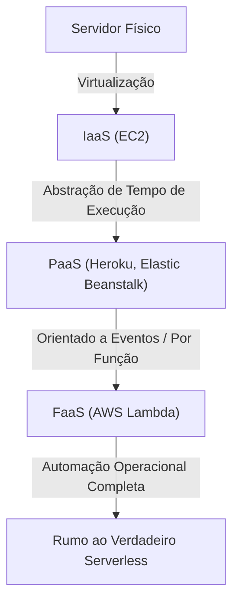
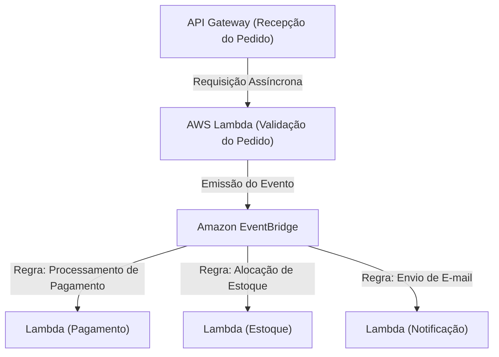

## 1. Introdução: O que é Serverless?

Quando ouviram a palavra "Serverless" pela primeira vez, muitos desenvolvedores podem ter imaginado "um sistema mágico onde servidores físicos não existem". No entanto, o verdadeiro significado de serverless na computação em nuvem não é que "não existem servidores", mas que "não é necessário estar ciente da existência de servidores", ou seja, "a libertação do trabalho pesado de provisionamento e gerenciamento operacional da infraestrutura".

O FaaS (Function as a Service), representado pelo AWS Lambda, estabeleceu um modelo no qual os recursos de computação para executar código são alocados dinamicamente apenas no momento em que uma solicitação ocorre, com cobrança por milissegundos. Isso libertou os desenvolvedores de requisitos não funcionais, como "aplicação de patches em servidores", "configuração de escalonamento" e "planejamento de capacidade", permitindo que eles se concentrem na verdadeira criação de valor: a construção da lógica de negócios. Neste artigo, nos aprofundaremos no verdadeiro valor desta arquitetura serverless, nas mais recentes metodologias de design utilizando o AWS Lambda e nos desafios operacionais desconhecidos, bem como em suas soluções.

## 2. A História da Evolução da Infraestrutura: Dos Servidores Físicos ao FaaS

Para entender a ascensão do serverless, é necessário revisitar a evolução da infraestrutura ao longo das últimas décadas. A infraestrutura sempre evoluiu com o objetivo de alcançar "maior abstração" e "redução de custos operacionais".

### 2.1 A Era dos Servidores Físicos (On-Premises)
As primeiras aplicações web rodavam em servidores físicos montados em racks nos próprios data centers das empresas. A aquisição de hardware levava meses, e era sempre necessário garantir recursos excessivos (superprovisionamento) em antecipação ao tráfego nos horários de pico. Era uma era em que a própria empresa assumia a responsabilidade em todas as camadas por falhas de hardware, falhas de rede, quedas de energia, etc.

### 2.2 A Revolução do IaaS (Infrastructure as a Service)
O lançamento do Amazon EC2 (Elastic Compute Cloud) em 2006 trouxe uma mudança de paradigma para a indústria. A virtualização de servidores físicos possibilitou a inicialização de servidores (instâncias) em minutos através de APIs. No entanto, o gerenciamento de patches do SO, a configuração de middleware e a definição de regras de escalonamento continuavam sendo de responsabilidade do usuário, permanecendo no paradigma de "servidores virtuais na nuvem".

### 2.3 PaaS (Platform as a Service) e Contêineres
PaaS como Heroku e Google App Engine forneceram uma experiência em que os desenvolvedores podiam implantar aplicações simplesmente enviando o código por push, com a plataforma gerenciando o ambiente de tempo de execução. Ao mesmo tempo, surgiu a tecnologia de contêineres, representada pelo Docker, empacotando a aplicação e suas dependências, o que melhorou drasticamente a portabilidade do ambiente e a eficiência dos recursos. No entanto, o próprio gerenciamento dos clusters (como o Kubernetes) para executar os contêineres tornou-se um novo fardo operacional, dando origem aos desafios do "Day 2 Operations".

### 2.4 O Nascimento do FaaS (Function as a Service)
Então, em 2014, o FaaS nasceu com o anúncio do AWS Lambda. Os desenvolvedores implantam código na menor unidade possível, chamada "função", e a executam acionada por eventos específicos (solicitações HTTP, upload de arquivos, alterações de banco de dados, etc.). O custo durante o tempo ocioso tornou-se zero, e estabeleceu-se o verdadeiro paradigma "serverless", que escala automaticamente (teoricamente) infinitamente em resposta ao número de solicitações.

## 3. O Conceito Central do Serverless: A Separação Completa entre Computação e Armazenamento

A mudança de paradigma mais importante ao projetar uma arquitetura serverless é a "separação completa entre computação e armazenamento".

Nas arquiteturas monolíticas tradicionais, era comum um design "stateful" (com retenção de estado), onde as informações de sessão e os dados temporários eram mantidos na memória ou no disco local do servidor de aplicação. No entanto, em um ambiente FaaS, os contêineres que executam funções (Firecracker microVM no AWS Lambda) são gerados dinamicamente para cada solicitação e podem ser destruídos a qualquer momento após o término da execução.

Devido a essa natureza "efêmera", reter o estado dentro da função torna-se um antipadrão. Em vez disso, o estado e os dados devem ser externalizados para um banco de dados NoSQL gerenciado como o Amazon DynamoDB, um armazenamento de objetos como o Amazon S3, ou um armazenamento na memória como o Amazon ElastiCache (Redis).

Com esta separação completa, a camada de computação torna-se totalmente "stateless" (sem estado), de modo que, mesmo que 1000 funções que processam uma única solicitação sejam iniciadas simultaneamente, a consistência de dados e os conflitos podem ser gerenciados de forma centralizada no lado da camada do banco de dados.

## 4. Arquitetura Interna e Modelo de Execução do AWS Lambda

Embora seja "serverless", servidores estão definitivamente em execução nas profundezas dos data centers da AWS. Como o código é executado dentro do Lambda?

O AWS Lambda utiliza microVMs leves de código aberto chamadas "Firecracker" para equilibrar segurança e desempenho. O Firecracker utiliza KVM (Kernel-based Virtual Machine) para fornecer máquinas virtuais minúsculas que inicializam em milissegundos. Isso garante um ambiente de execução seguro (forte fronteira de segurança) completamente isolado do código de outros clientes em um ambiente multilocatário, enquanto alcança velocidades de inicialização comparáveis às de contêineres.

O ciclo de vida de execução do Lambda é dividido nas três fases a seguir:
1. **Fase de Init (Inicialização)**: É realizado o download do código, a construção do ambiente de execução, a inicialização do tempo de execução (Node.js, Python, Java, etc.) e o processamento de inicialização fora do código da função (como o estabelecimento de conexões de banco de dados).
2. **Fase de Invoke (Invocação)**: A carga útil (payload) do evento é passada para a função manipuladora, e a verdadeira lógica de negócios é executada.
3. **Fase de Shutdown (Desligamento)**: Um sinal de desligamento é enviado ao tempo de execução antes que o ambiente de execução seja destruído (se as extensões estiverem sendo usadas).

## 5. O Problema do Cold Start e a Evolução das Soluções

O "cold start" (inicialização a frio) tem sido discutido há muito tempo como o maior desafio técnico na arquitetura serverless. O cold start é a latência (atraso) que ocorre quando uma função Lambda é invocada pela primeira vez, ou quando é invocada novamente após o ambiente de execução ter sido destruído devido a um período sem invocações. O tempo que leva para executar a "Fase de Init" mencionada acima é a verdadeira identidade desse atraso.

Especialmente para linguagens tipadas estaticamente como Java e C#, ou para aplicações que carregam bibliotecas enormes (como o TensorFlow), os cold starts podiam levar vários segundos, arruinando significativamente a experiência do usuário.

Para este problema, a AWS tem fornecido várias soluções ao longo dos anos.

### 5.1 Provisioned Concurrency (Simultaneidade Provisionada)
O Provisioned Concurrency, anunciado em 2019, é um recurso que mantém um número especificado de ambientes de execução sempre aquecidos (em estado de espera) com a "Fase de Init" já concluída. Isso permite evitar completamente os cold starts e garantir respostas consistentes em milissegundos. No entanto, como também são cobrados recursos no estado de espera, há um trade-off que anula parcialmente a vantagem do serverless de "pagar apenas pelo que usa".

### 5.2 AWS Lambda SnapStart
O SnapStart (voltado principalmente para Java), introduzido em 2022, tornou-se um grande avanço no combate aos cold starts. Quando o SnapStart é ativado, a função é inicializada antecipadamente ao publicar a versão da função, e é feito o cache de um "snapshot" (instantâneo) do estado da memória e do disco. Na invocação, o ambiente é retomado (Resume) a partir deste snapshot em vez de ser inicializado do zero, o que pode reduzir o tempo de cold start em até 90%. Esta é uma abordagem inovadora que utiliza o recurso MicroVM Snapshot do Firecracker.

## 6. Afinidade com Arquiteturas Orientadas a Eventos

O verdadeiro poder do serverless é demonstrado em uma "Arquitetura Orientada a Eventos" combinada com outros serviços gerenciados da AWS.

Em uma arquitetura orientada a eventos, as mudanças de estado no sistema são publicadas como "eventos", que acionam cada componente para operar de forma assíncrona. O Lambda pode processar nativamente eventos de mais de 140 serviços da AWS, não apenas requisições HTTP do API Gateway, mas também uploads de arquivos no S3, alterações de tabela no DynamoDB (DynamoDB Streams) e chegada de mensagens no SQS.

### 6.1 Utilizando o Mapeamento de Fontes de Eventos
A combination de Amazon SQS (enfileiramento), Amazon SNS (Pub/Sub) e Amazon EventBridge (barramento de eventos) permite evitar um alto acoplamento (tight coupling) entre os sistemas.
Por exemplo, vamos considerar o processamento de pedidos em um site de comércio eletrônico.

Desta forma, é possível construir uma arquitetura onde múltiplos microsserviços reagem de forma assíncrona e independente a um único evento (ocorrência do pedido). Mesmo que um serviço sofra uma queda (por exemplo, o serviço de notificação), o evento é retido e o sistema tenta novamente, melhorando drasticamente a disponibilidade geral de todo o sistema.

## 7. Melhores Práticas Operacionais e de Monitoramento (Observability)

Embora sejamos libertados do gerenciamento da infraestrutura, garantir a "observabilidade" (observability) em sistemas serverless onde inúmeras funções distribuídas trabalham juntas torna-se ainda mais importante do que na era on-premises. Isso porque é mais difícil identificar "qual função apresentou o erro?" e "onde está o gargalo?".

1. **Rastreamento Distribuído**: O AWS X-Ray é utilizado para visualizar o caminho de propagação de uma requisição desde o API Gateway até o Lambda e o DynamoDB. Ele pode identificar atrasos em milissegundos entre cada serviço.
2. **Log Estruturado**: Em vez do simples registro em texto, os logs devem ser gerados no formato JSON, para que possam ser pesquisados por meio de consultas no AWS CloudWatch Logs Insights. Os logs devem sempre incluir contextos como ID da solicitação e ID do usuário.
3. **Métricas Personalizadas e Alertas**: Além da taxa de erro e do tempo de execução, métricas relacionadas ao "sucesso/falha de negócios" (ex.: número de processos de pedidos bem-sucedidos) devem ser enviadas ao CloudWatch, com alertas configurados para disparar caso os limites sejam excedidos.

## 8. Otimização de Custos e Antipadrões

Quando o serverless é bem utilizado, resulta em reduções significativas de custos, mas cair em antipadrões carrega o risco de acarretar faturamentos inesperados (falência da nuvem).

### 8.1 Otimização de Memória e Tempo Limite (Timeout)
O faturamento do Lambda é a multiplicação da "quantidade de memória alocada" e o "tempo de execução (milissegundos)". Como o desempenho da CPU e a largura de banda da rede também aumentam proporcionalmente quando a memória é aumentada, se o tempo de execução cair para menos da metade como resultado de dobrar a memória, o custo total poderá ser menor. Ajustar isso manualmente é difícil, por isso a melhor prática é usar uma ferramenta de código aberto como o AWS Lambda Power Tuning para encontrar o ponto ideal entre custo e desempenho.

### 8.2 Antipadrão: Chamadas Síncronas Entre Funções
Você deve evitar absolutamente um design em que um Lambda chame de forma síncrona outro Lambda e espere por seu resultado. O Lambda que faz a chamada continuará a ser cobrado enquanto espera, resultando em "cobrança dupla". Se for necessária a coordenação entre funções, você deve usar o Step Functions (orquestração) ou adotar a chamada assíncrona (coreografia) através de SQS/SNS, etc.

### 8.3 Antipadrão: Conexões Excessivas a Bancos de Dados Relacionais
Como o Lambda escala para milhares de instâncias instantaneamente, a conexão direta ao RDS (como MySQL ou PostgreSQL) esgotará instantaneamente o pool de conexões do banco de dados, fazendo com que o DB caia. Para lidar com isso, é necessário usar o RDS Proxy para o pool de conexões ou considerar a migração para um banco de dados NoSQL que possa ser acessado por meio de uma API baseada em HTTP, como o DynamoDB.

## 9. Conclusão e Perspectivas Futuras

A arquitetura serverless não é apenas uma tendência passageira, mas sim o ponto culminante da evolução irreversível do desenvolvimento de aplicações nativas da nuvem. Os desenvolvedores foram libertados das operações complexas de infraestrutura e agora podem entregar valor de negócios aos usuários finais de forma mais rápida e segura.

No futuro, o ecossistema serverless evoluirá ainda mais devido a cold starts ainda mais rápidos por meio da adoção do WebAssembly (Wasm) e a convergência com o edge computing (como CloudFront Functions e Lambda@Edge).

Um mundo onde a infraestrutura não é percebida. Esse é o verdadeiro valor que o FaaS e a arquitetura serverless nos trouxeram.
