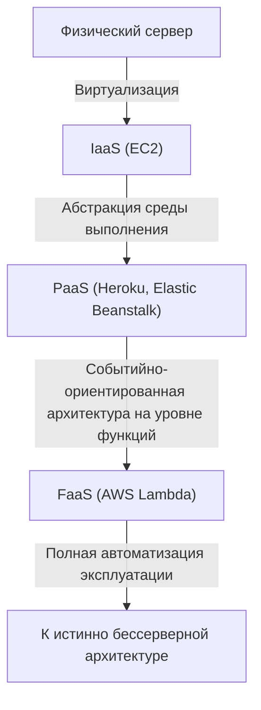
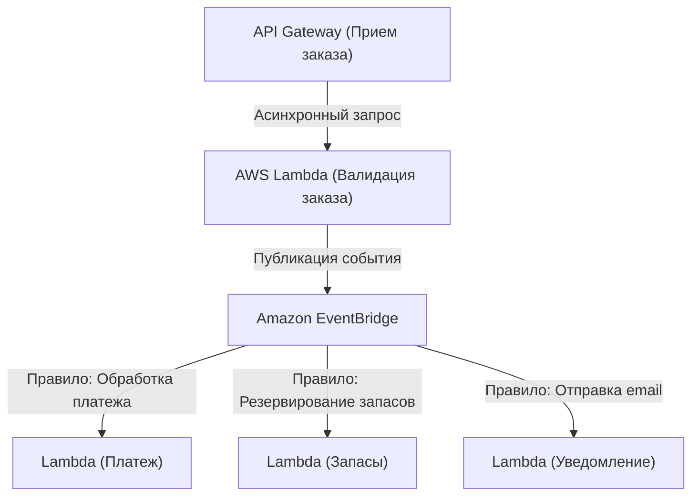

## 1. Введение: Что такое бессерверная архитектура?

Когда разработчики впервые услышали слово «бессерверный» (Serverless), многие, вероятно, представили себе «волшебную систему без физических серверов». Однако истинный смысл бессерверной архитектуры в облачных вычислениях заключается не в том, что «серверов не существует», а в том, что «нет необходимости думать о существовании серверов», то есть в «освобождении от тяжелой работы по подготовке инфраструктуры и управлению эксплуатацией».

FaaS (Function as a Service), ярким примером которого является AWS Lambda, утвердил модель, при которой вычислительные ресурсы для выполнения кода выделяются динамически только в момент возникновения запроса, с тарификацией с точностью до миллисекунды. Это освободило разработчиков от нефункциональных требований, таких как «установка патчей на серверы», «настройка масштабирования» и «планирование мощности», позволив им сосредоточиться на создании реальной ценности — построении бизнес-логики. В этой статье мы глубоко погрузимся в истинную ценность бессерверной архитектуры, современные методы проектирования с использованием AWS Lambda, а также малоизвестные эксплуатационные проблемы и способы их решения.

## 2. История эволюции инфраструктуры: от физических серверов к FaaS

Чтобы понять причину появления бессерверных технологий, необходимо оглянуться на эволюцию инфраструктуры за последние несколько десятилетий. Инфраструктура всегда развивалась с целью «повышения уровня абстракции» и «снижения эксплуатационных расходов».

### 2.1 Эпоха физических серверов (On-Premises)
Ранние веб-приложения работали на физических серверах, установленных в стойках собственных центров обработки данных. Закупка оборудования занимала месяцы, и всегда было необходимо обеспечивать избыточные ресурсы (over-provisioning) в ожидании пикового трафика. Это была эпоха, когда компании несли ответственность за все уровни, включая аппаратные сбои, сетевые сбои и перебои в электропитании.

### 2.2 Революция IaaS (Infrastructure as a Service)
Появление Amazon EC2 (Elastic Compute Cloud) в 2006 году привело к смене парадигмы в отрасли. Оно позволило виртуализировать физические серверы и запускать серверы (инстансы) за считанные минуты через API. Однако управление патчами ОС, настройка промежуточного ПО (middleware) и определение правил масштабирования оставались обязанностью пользователя, что оставляло нас в парадигме «виртуальных серверов в облаке».

### 2.3 PaaS (Platform as a Service) и контейнеры
PaaS, такие как Heroku и Google App Engine, предоставили разработчикам возможность развертывать приложения простым push-ом кода, при этом платформа управляла средой выполнения. Одновременно появились контейнерные технологии, такие как Docker, которые позволили упаковать приложения и их зависимости, кардинально улучшив переносимость среды и эффективность использования ресурсов. Однако управление самими кластерами для выполнения контейнеров (например, Kubernetes) породило новую эксплуатационную нагрузку, известную как проблема "Day 2 Operations".

### 2.4 Рождение FaaS (Function as a Service)
Затем, в 2014 году, с анонсом AWS Lambda родился FaaS. Разработчики развертывают код в минимальных единицах, называемых «функциями», и они выполняются при срабатывании определенных событий (HTTP-запросы, загрузка файлов, изменения в базе данных и т. д.). Затраты во время простоя стали равны нулю, и была утверждена парадигма истинно «бессерверной» архитектуры, которая (теоретически) автоматически масштабируется до бесконечности в зависимости от количества запросов.

## 3. Ключевая концепция бессерверной архитектуры: полное разделение вычислений и хранения

Самый важный сдвиг парадигмы при проектировании бессерверной архитектуры — это «полное разделение вычислений (compute) и хранения (storage)».

В традиционных монолитных архитектурах стандартом был «stateful» (с сохранением состояния) дизайн, при котором информация о сессиях и временные данные хранились в памяти или на локальных дисках серверов приложений. Однако в среде FaaS контейнер, выполняющий функцию (Firecracker microVM в случае AWS Lambda), динамически создается для каждого запроса и может быть уничтожен в любой момент после завершения выполнения.

Из-за этой «эфемерной» (недолговечной) природы сохранение состояния внутри функции является антипаттерном. Вместо этого состояние и данные должны быть вынесены наружу, в управляемые NoSQL базы данных, такие как Amazon DynamoDB, объектные хранилища, такие как Amazon S3, или In-Memory хранилища, такие как Amazon ElastiCache (Redis).

Благодаря такому полному разделению вычислительный уровень становится полностью «stateless» (без сохранения состояния), и даже если одновременно запускаются 1000 функций, обрабатывающих отдельные запросы, консистентность данных и конфликты могут централизованно управляться на уровне базы данных.

## 4. Внутренняя архитектура и модель выполнения AWS Lambda

Несмотря на термин «бессерверный», серверы определенно работают глубоко в центрах обработки данных AWS. Как именно выполняется код внутри Lambda?

Для обеспечения баланса между безопасностью и производительностью AWS Lambda использует легковесные микро-ВМ с открытым исходным кодом под названием Firecracker. Firecracker использует KVM (Kernel-based Virtual Machine) для предоставления крошечных виртуальных машин, которые запускаются за миллисекунды. В многопользовательской среде это обеспечивает изолированную и безопасную среду выполнения (надежную границу безопасности) от кода других клиентов, достигая при этом скорости запуска, сопоставимой с контейнерами.

Жизненный цикл выполнения Lambda делится на следующие 3 фазы:
1. **Фаза Init (Инициализация)**: загружается код, создается среда выполнения, запускается runtime (Node.js, Python, Java и т. д.) и выполняется код инициализации вне функции обработчика (например, установка подключения к базе данных).
2. **Фаза Invoke (Вызов)**: полезная нагрузка (payload) события передается функции-обработчику, и выполняется фактическая бизнес-логика.
3. **Фаза Shutdown (Завершение)**: перед уничтожением среды выполнения в runtime отправляется сигнал завершения работы (если используются расширения).

## 5. Проблема холодного старта и эволюция методов ее решения

«Холодный старт» на протяжении многих лет обсуждается как самая большая техническая проблема в бессерверной архитектуре. Холодный старт — это задержка (latency), возникающая при первом вызове функции Lambda или при ее повторном вызове после того, как она некоторое время не вызывалась и среда выполнения была уничтожена. Время, затрачиваемое на выполнение вышеупомянутой «фазы Init», и есть истинная причина этой задержки.

Особенно для статически типизированных языков, таких как Java или C#, или приложений, загружающих огромные библиотеки (например, TensorFlow), холодный старт может занимать несколько секунд, что может значительно ухудшить пользовательский опыт.

В ответ на эту проблему AWS на протяжении многих лет предлагала различные решения.

### 5.1 Provisioned Concurrency (Предварительно выделенный параллелизм)
Функция Provisioned Concurrency, анонсированная в 2019 году, поддерживает заранее заданное количество сред выполнения постоянно «разогретыми» (в состоянии ожидания) с уже завершенной «фазой Init». Это позволяет полностью избежать холодных стартов и гарантировать стабильное время отклика в миллисекундах. Однако существует компромисс: за простаивающие ресурсы в состоянии ожидания также взимается плата, что частично нивелирует преимущество бессерверной модели «оплата только за использованное».

### 5.2 AWS Lambda SnapStart
Представленный в 2022 году SnapStart (в основном для Java) стал прорывом в решении проблемы холодного старта. Когда включен SnapStart, при публикации версии функции она предварительно инициализируется, делается «снимок» (snapshot) состояния памяти и диска, который затем кэшируется. При вызове вместо инициализации с нуля среда возобновляет работу (Resume) из этого снимка, сокращая время холодного старта до 90%. Это революционный подход, использующий возможности MicroVM Snapshot от Firecracker.

## 6. Совместимость с событийно-ориентированной архитектурой

Истинная сила бессерверных технологий раскрывается в сочетании с другими управляемыми сервисами AWS в рамках «событийно-ориентированной архитектуры» (Event-Driven Architecture).

В событийно-ориентированной архитектуре изменения состояния в системе публикуются как «события», которые служат триггерами для асинхронной работы каждого компонента. Lambda может изначально обрабатывать события из более чем 140 сервисов AWS, таких как HTTP-запросы от API Gateway, загрузка файлов в S3, изменения таблиц DynamoDB (DynamoDB Streams) и получение сообщений SQS.

### 6.1 Использование сопоставления источников событий (Event Source Mapping)
Комбинируя Amazon SQS (очереди), Amazon SNS (Pub/Sub) и Amazon EventBridge (шина событий), можно предотвратить сильную связность (tight coupling) между системами.
Например, рассмотрим процесс обработки заказа на сайте электронной коммерции.

Таким образом, можно построить архитектуру, в которой несколько микросервисов асинхронно и независимо реагируют на одно событие (создание заказа). Даже если один сервис (например, сервис уведомлений) выйдет из строя, событие будет сохранено и повторно отправлено, что кардинально повышает доступность всей системы.

## 7. Лучшие практики эксплуатации и мониторинга (Observability)

Хотя вы освобождаетесь от управления инфраструктурой, обеспечение «наблюдаемости» (Observability) в бессерверной системе, где согласованно работают бесчисленные распределенные функции, становится еще более важным, чем в эпоху on-premises. Это связано с тем, что становится сложнее определить, «в какой функции произошла ошибка?» и «где находится узкое место?».

1. **Распределенная трассировка (Distributed Tracing)**: Использование AWS X-Ray позволяет визуализировать путь, по которому запрос распространяется от API Gateway к Lambda и DynamoDB. Задержки между сервисами можно определить с точностью до миллисекунды.
2. **Структурированное логирование (Structured Logging)**: Вместо простого текстового логирования логи следует выводить в формате JSON, чтобы по ним можно было выполнять запросы в AWS CloudWatch Logs Insights. Всегда включайте в логи контекст, такой как идентификатор запроса (Request ID) или идентификатор пользователя.
3. **Пользовательские метрики и оповещения (Custom Metrics and Alerts)**: Помимо частоты ошибок и времени выполнения, отправляйте метрики, связанные с «бизнес-успехом или неудачей» (например, количество успешно обработанных заказов), в CloudWatch и настраивайте систему на выдачу оповещений при превышении пороговых значений.

## 8. Оптимизация затрат и антипаттерны

При правильном использовании бессерверная архитектура может привести к значительному снижению затрат, но попадание в антипаттерны несет в себе риск непредвиденных расходов (облачного банкротства).

### 8.1 Оптимизация памяти и таймаутов
Счет за Lambda формируется путем умножения «объема выделенной памяти» на «время выполнения (в миллисекундах)». Увеличение памяти пропорционально увеличивает производительность CPU и пропускную способность сети. В результате, если увеличить память вдвое, время выполнения может сократиться более чем наполовину, и общая стоимость, наоборот, снизится. Вручную регулировать это сложно, поэтому лучшей практикой является использование инструментов с открытым исходным кодом, таких как AWS Lambda Power Tuning, для нахождения оптимального баланса между стоимостью и производительностью.

### 8.2 Антипаттерн: Синхронные вызовы между функциями
Следует категорически избегать архитектуры, в которой одна Lambda синхронно вызывает другую Lambda и ожидает результата. Вызывающая Lambda продолжает тарифицироваться во время ожидания, что приводит к «двойной оплате». Если требуется взаимодействие между функциями, следует использовать Step Functions (оркестрация) или применять асинхронные вызовы через SQS/SNS и т. д. (хореография).

### 8.3 Антипаттерн: Чрезмерные подключения к реляционным базам данных
Поскольку Lambda мгновенно масштабируется до тысяч инстансов, прямое подключение к RDS (например, MySQL или PostgreSQL) приведет к мгновенному истощению пула соединений БД, и база данных выйдет из строя. Чтобы справиться с этим, необходимо рассмотреть возможность использования RDS Proxy для объединения соединений (пулинга) или перехода на NoSQL базы данных, к которым можно обращаться через HTTP-API, такие как DynamoDB.

## 9. Заключение и перспективы на будущее

Бессерверная архитектура — это не просто преходящая тенденция, а точка необратимой эволюции в разработке облачных приложений. Разработчики освободились от грязной работы по эксплуатации инфраструктуры и теперь могут быстрее и безопаснее доставлять бизнес-ценность конечным пользователям.

Ожидается, что в будущем экосистема бессерверных технологий будет развиваться еще больше благодаря дальнейшему ускорению холодных стартов за счет популяризации WebAssembly (Wasm) и интеграции с граничными вычислениями (Edge Computing), такими как CloudFront Functions и Lambda@Edge.

В мир без мыслей об инфраструктуре. Это и есть истинная ценность, которую принесли нам FaaS и бессерверная архитектура.
