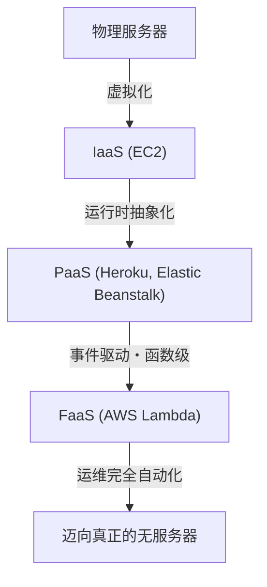
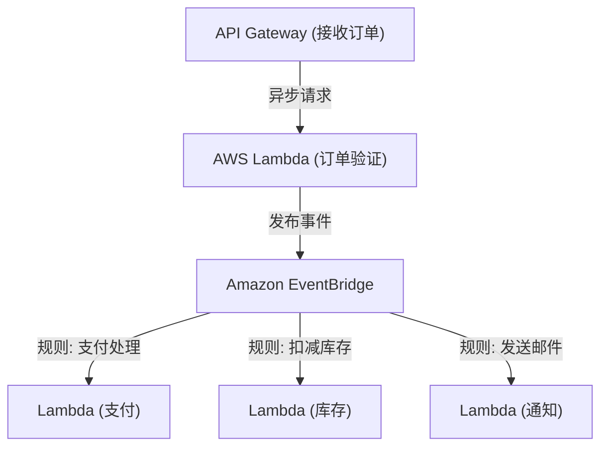

## 1. 前言：什么是无服务器（Serverless）？

当第一次听到“无服务器（Serverless）”这个词时，许多开发者可能会想象一个“物理服务器不存在的魔法般系统”。然而，在云计算中，无服务器的真正含义并非“服务器不存在”，而是“无需意识到服务器的存在”，即“从基础设施配置和运维管理这些繁重的劳动中解放出来”。

以AWS Lambda为代表的FaaS（Function as a Service），建立了一种模型：仅在请求发生的瞬间，才动态分配用于执行代码的计算资源，并以毫秒为单位进行计费。由此，开发者能够摆脱“服务器补丁”、“扩展设置”、“容量规划”等非功能性需求，从而集中精力构建业务逻辑这一创造核心价值的工作上。本文将深入探讨无服务器架构的真正价值、利用AWS Lambda的最新设计手法，以及鲜为人知的运维挑战与解决方案。

## 2. 基础设施的演进史：从物理服务器到FaaS

为了理解无服务器的崛起，有必要回顾过去几十年来基础设施的演进过程。基础设施始终朝着“更高的抽象化”和“降低运维成本”的方向演进。

### 2.1 物理服务器（本地部署）时代
早期的Web应用程序运行在安装于自有数据中心机架上的物理服务器上。采购硬件需要耗费数月，而且为了应对流量高峰，总是需要预留过剩的资源（过度配置）。这是一个必须由企业自行承担所有层级（包括硬件故障、网络故障、电源故障等）责任的时代。

### 2.2 IaaS（基础设施即服务）的革命
2006年Amazon EC2（Elastic Compute Cloud）的出现，为业界带来了范式的转变。通过虚拟化物理服务器，用户可以通过API在几分钟内启动服务器（实例）。然而，操作系统的补丁管理、中间件配置、扩展规则定义等仍然是用户的责任，这依然停留在“云上虚拟服务器”的范畴。

### 2.3 PaaS（平台即服务）与容器
Heroku和Google App Engine等PaaS平台通过接管运行时环境，让开发者只需推送代码即可部署应用，提供了极大的便利。与此同时，以Docker为代表的容器技术应运而生，通过将应用程序及其依赖进行打包，极大地提高了环境可移植性和资源效率。然而，管理运行容器的集群（如Kubernetes）本身又成为新的运维负担，即所谓的“Day 2 Operations”挑战。

### 2.4 FaaS（函数即服务）的诞生
在2014年，随着AWS Lambda的发布，FaaS应运而生。开发者可以以“函数”为最小单位部署代码，并以特定事件（如HTTP请求、文件上传、数据库变更等）作为触发器来执行。闲置时的成本为零，并且能够根据请求量自动进行理论上的无限扩展，从而确立了真正的“无服务器”范式。

## 3. 无服务器的核心概念：计算与存储的完全分离

在设计无服务器架构时，最重要的范式转变是“计算（Compute）与存储（Storage）的完全分离”。

在传统的单体架构中，将应用服务器的内存或本地磁盘用于保存会话信息或临时数据，即“有状态（Stateful）”设计是非常普遍的。但是，在FaaS环境中，执行函数的容器（如AWS Lambda中的Firecracker microVM）在每次请求时动态生成，并在执行结束后随时可能被销毁。

由于这种“短暂（Ephemeral）”的特性，在函数内部保留状态成为了一种反模式。相反，状态和数据必须外包给托管的NoSQL数据库（如Amazon DynamoDB）、对象存储（如Amazon S3）或内存数据存储（如Amazon ElastiCache / Redis）。

由于这种完全分离，计算层变得完全“无状态”，即使同时启动1000个处理单个请求的函数，也能在数据库层面上集中管理数据一致性和冲突。

## 4. AWS Lambda的内部架构与执行模型

尽管被称为“无服务器”，但在AWS数据中心的深处，服务器依然在切实运行着。在Lambda的内部，代码究竟是如何执行的呢？

AWS Lambda为了兼顾安全与性能，使用了被称为“Firecracker”的开源轻量级微虚拟机（microVM）。Firecracker利用KVM（Kernel-based Virtual Machine），提供了能在毫秒级启动的极小虚拟机。通过这种方式，它在多租户环境中，既确保了与其他客户代码完全隔离的安全执行环境（强大的安全边界），又实现了媲美容器的启动速度。

Lambda的执行生命周期分为以下3个阶段：
1. **Init（初始化）阶段**：下载代码、构建执行环境、启动运行时（Node.js、Python、Java等），以及执行函数代码之外的初始化处理（如建立数据库连接等）。
2. **Invoke（调用）阶段**：将事件负载传递给处理程序（Handler）函数，执行实际的业务逻辑。
3. **Shutdown（关闭）阶段**：在执行环境被销毁之前，向运行时发送关闭信号（当使用扩展功能时）。

## 5. 冷启动问题及其对策的演进

长久以来，在无服务器架构中被讨论最多的最大技术挑战就是“冷启动”。冷启动是指，当Lambda函数首次被调用，或者在一段时间内没有调用导致执行环境被销毁后再次被调用时，所产生的延迟。前文所述的“Init阶段”所耗费的时间，正是这种延迟的来源。

尤其是对于Java、C#等静态类型语言，或是加载庞大库（如TensorFlow）的应用程序而言，冷启动有时可达数秒，可能严重损害用户体验。

针对这一问题，AWS多年来提供了多种解决方案。

### 5.1 Provisioned Concurrency（预配置并发）
2019年发布的Provisioned Concurrency功能，可使指定数量的执行环境始终保持在完成“Init阶段”的“温暖（待命）”状态。通过这种方式，可以完全避免冷启动，稳定地保证毫秒级的响应。然而，对于处于待命状态的资源也需付费，这在某种程度上削弱了无服务器“按需付费”的优势。

### 5.2 AWS Lambda SnapStart
2022年推出的SnapStart（主要面向Java）成为了冷启动对策的重大突破。启用SnapStart后，当发布函数版本时，系统会预先初始化函数，提取内存和磁盘状态的“快照”并将其缓存。在调用时，它从该快照中恢复（Resume）环境，而不是从头开始初始化，因此最多可缩短90%的冷启动时间。这是利用Firecracker MicroVM Snapshot功能实现的突破性方法。

## 6. 与事件驱动型架构的契合度

无服务器的真正威力，在与AWS其他托管服务相结合的“事件驱动型架构（Event-Driven Architecture）”中得到了充分发挥。

在事件驱动型架构中，系统内部状态的变化会被发布为“事件”，以此为触发器，各个组件异步地运行。Lambda不仅能够原生处理来自API Gateway的HTTP请求，还能处理S3的文件上传、DynamoDB的表变更（DynamoDB Streams）、SQS的消息到达等来自140多种AWS服务的事件。

### 6.1 充分利用事件源映射
通过组合Amazon SQS（队列）、Amazon SNS（发布/订阅）以及Amazon EventBridge（事件总线），可以防止系统间的紧耦合。
例如，考虑一个电子商务网站的订单处理：

像这样，针对一个事件（订单生成），可以构建出多个微服务异步且独立响应的架构。即使某个服务（比如通知服务）宕机，事件也会被保留并重试，因此整个系统的可用性得到了大幅提升。

## 7. 运维与监控的最佳实践 (Observability)

虽然从基础设施管理中解放了出来，但在分布有无数函数协同工作的无服务器系统中，确保“可观测性（Observability）”比本地部署时代更为重要。因为确定“哪个函数发生了错误？”或“瓶颈在哪里？”变得更加困难。

1. **分布式追踪**：利用AWS X-Ray，可视化请求从API Gateway传播到Lambda，再到DynamoDB的路径。可以精确到毫秒级定位各服务之间的延迟。
2. **结构化日志**：不要使用纯文本日志，而是以JSON格式输出日志，以便能在AWS CloudWatch Logs Insights中进行查询检索。日志中务必包含请求ID、用户ID等上下文信息。
3. **自定义指标与警报**：不仅包括错误率和执行时间，还要将有关“业务成功/失败”的指标（例如：订单处理成功件数）发送到CloudWatch，并设定阈值以便在超限时发出警报。

## 8. 成本优化与反模式

如果使用得当，无服务器能大幅降低成本；但若陷入反模式，则有招致意外账单（云破产）的风险。

### 8.1 内存与超时优化
Lambda的计费是“分配的内存量”乘以“执行时间（毫秒）”。由于增加内存会成比例地提升CPU性能和网络带宽，因此在内存增加一倍后，如果执行时间缩短到一半以下，总成本反而会降低。因为很难手动调整这一点，所以最佳实践是利用AWS Lambda Power Tuning等开源工具，找到成本与性能的最佳平衡点。

### 8.2 反模式：函数间的同步调用
绝对应该避免从一个Lambda同步调用另一个Lambda并等待其结果的设计。因为调用方Lambda在等待期间也会持续计费，从而产生“双重计费”。如果需要函数间的协同，应该使用Step Functions（编排）或通过SQS/SNS等进行异步调用（编排）。

### 8.3 反模式：对关系型数据库的过度连接
因为Lambda会在瞬间扩展到数千个实例，如果直接连接到RDS（如MySQL或PostgreSQL等），数据库的连接池将瞬间枯竭，导致数据库宕机。为了解决这个问题，必须考虑利用RDS Proxy对连接进行池化，或者迁移到可以像DynamoDB那样通过基于HTTP的API访问的NoSQL数据库。

## 9. 结论与未来展望

无服务器架构并非短暂的流行，而是云原生应用开发不可逆转的演进终点。开发者已从繁重的基础设施运维中解放出来，从而能够更快、更安全地将业务价值交付给终端用户。

展望未来，随着WebAssembly（Wasm）的普及带来更快的冷启动速度，以及与边缘计算（如CloudFront Functions或Lambda@Edge等）的融合，无服务器生态系统必将得到进一步的发展。

迈向无视基础设施的世界。这正是FaaS与无服务器架构带给我们的真正价值。
