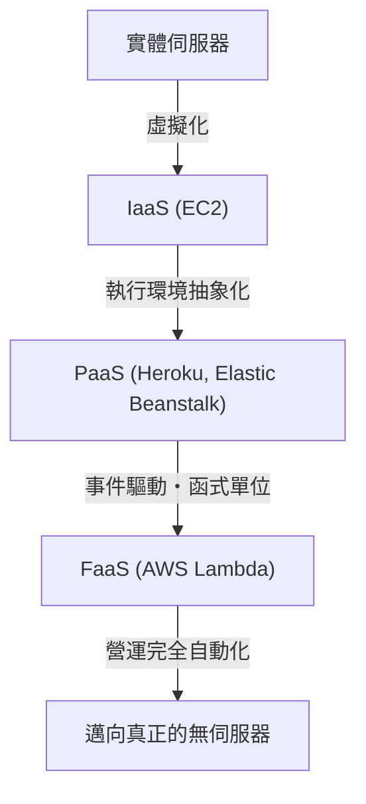
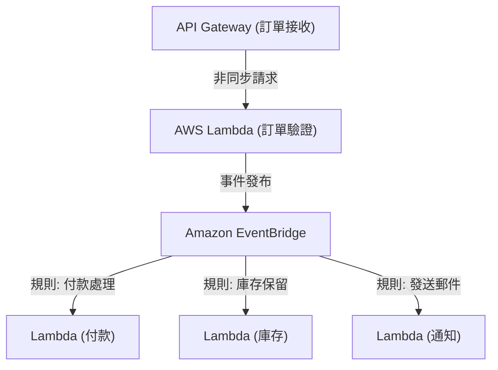

## 1. 簡介：什麼是無伺服器 (Serverless)？

當第一次聽到「無伺服器 (Serverless)」這個詞時，許多開發者可能會想像這是一個「不存在實體伺服器的魔法般系統」。然而，在雲端運算中，無伺服器的真正含義並非「沒有伺服器」，而是「不需要意識到伺服器的存在」，換句話說，就是「從基礎設施佈建與營運管理的繁重勞動中解放出來」。

以 AWS Lambda 為代表的 FaaS (Function as a Service) 確立了一種模式：僅在請求發生的瞬間動態分配執行程式碼所需的運算資源，並以毫秒為單位進行計費。這使得開發者能從「伺服器修補」、「擴展設定」、「容量規劃」等非功能性需求中解脫，進而專注於建立商業邏輯這一核心的價值創造上。本文將深入探討無伺服器架構的真正價值、活用 AWS Lambda 的最新設計手法，以及鮮為人知的營運挑戰及其解決方案。

## 2. 基礎設施的演進歷史：從實體伺服器到 FaaS

為了理解無伺服器的崛起，我們有必要回顧過去幾十年來基礎設施的演進。基礎設施的發展始終朝著「更高的抽象化」與「降低營運成本」的方向邁進。

### 2.1 實體伺服器 (地端) 時代
早期的網路應用程式運行在安裝於自家資料中心機架上的實體伺服器上。採購硬體需要花費數個月的時間，且為了應對尖峰時段的流量，必須隨時保留過剩的資源 (過度佈建)。那是一個必須自行承擔硬體故障、網路故障、電源故障等所有層級責任的時代。

### 2.2 IaaS (Infrastructure as a Service) 的革命
2006 年 Amazon EC2 (Elastic Compute Cloud) 的問世，為業界帶來了典範轉移。透過將實體伺服器虛擬化，開發者能在幾分鐘內透過 API 啟動伺服器 (執行個體)。然而，作業系統修補程式管理、中介軟體設定以及擴展規則定義等，依然是用戶的責任，當時的架構仍停留在「雲端上的虛擬伺服器」的範疇中。

### 2.3 PaaS (Platform as a Service) 與容器
如 Heroku 或 Google App Engine 等 PaaS，透過由平台管理執行階段環境，為開發者提供了只需推送程式碼即可部署應用程式的體驗。同時，以 Docker 為代表的容器技術出現，透過將應用程式及其依賴項目打包，大幅提升了環境的可攜性與資源效率。然而，管理用來執行容器的叢集 (如 Kubernetes 等) 本身卻成為了新的營運負擔，進而產生了「Day 2 Operations (第二天營運)」的挑戰。

### 2.4 FaaS (Function as a Service) 的誕生
接著在 2014 年，隨著 AWS Lambda 的發表，FaaS 正式誕生。開發者以「函式 (Function)」這種最小單位來部署程式碼，並以特定事件 (HTTP 請求、檔案上傳、資料庫變更等) 作為觸發條件來執行。在閒置時的成本為零，且能根據請求數量進行 (理論上) 無限的自動擴展，從而確立了真正的「無伺服器」典範。

## 3. 無伺服器的核心概念：運算與儲存的完全分離

在設計無伺服器架構時，最重要的典範轉移就是「運算與儲存的完全分離」。

在傳統的單體式架構中，普遍採用「有狀態 (Stateful)」的設計，即在應用程式伺服器的記憶體或本機磁碟中保留工作階段資訊或暫存資料。然而，在 FaaS 環境中，執行函式的容器 (在 AWS Lambda 中為 Firecracker microVM) 會針對每個請求動態生成，並在執行結束後隨時可能被銷毀。

由於這種「短暫 (Ephemeral)」的特性，在函式內保持狀態成為了一種反模式 (Anti-pattern)。取而代之的是，狀態與資料必須外部化至如 Amazon DynamoDB 等受管的 NoSQL 資料庫、如 Amazon S3 等物件儲存，或如 Amazon ElastiCache (Redis) 等記憶體內資料儲存。

透過這種完全的分離，運算層變成了完全的「無狀態 (Stateless)」。即使處理單一請求的函式同時啟動了 1,000 個，資料的一致性與衝突也能在資料庫層集中管理。

## 4. AWS Lambda 的內部架構與執行模型

雖說是「無伺服器」，但在 AWS 資料中心的深處，伺服器確實仍在運作。在 Lambda 內部，程式碼究竟是透過什麼樣的機制執行的呢？

AWS Lambda 為兼顧安全性與效能，使用了名為「Firecracker」的開源輕量級微虛擬機 (microVM)。Firecracker 利用 KVM (Kernel-based Virtual Machine)，提供能在毫秒級啟動的極小虛擬機。這使得在多租戶環境中，不僅能確保完全隔離於其他客戶程式碼的安全執行環境 (強大的安全邊界)，同時還能實現媲美容器的啟動速度。

Lambda 的執行生命週期可分為以下 3 個階段：
1. **Init (初始化) 階段**：進行程式碼下載、建立執行環境、啟動執行階段環境 (如 Node.js, Python, Java 等)，以及執行函式程式碼外的初始化處理 (例如建立資料庫連線)。
2. **Invoke (呼叫) 階段**：事件負載 (Payload) 傳遞給處理常式 (Handler) 函式，並執行實際的商業邏輯。
3. **Shutdown (關閉) 階段**：在銷毀執行環境前，將關閉訊號發送給執行階段環境 (當有使用擴充功能時)。

## 5. 冷啟動問題及其對策的演進

在無伺服器架構中，長年被討論的最大技術挑戰就是「冷啟動 (Cold Start)」。冷啟動是指當 Lambda 函式首次被呼叫，或是經過一段時間未被呼叫導致執行環境被銷毀後，再次被呼叫時所產生的延遲 (Latency)。前述「Init 階段」執行所需的時間就是這個延遲的真面目。

特別是在 Java 或 C# 等靜態型別語言，或是載入龐大函式庫 (如 TensorFlow 等) 的應用程式中，冷啟動可能會長達數秒，這有可能嚴重損害使用者體驗。

針對這個問題，AWS 多年來提供了各種解決方案。

### 5.1 Provisioned Concurrency (預先佈建的並行處理)
2019 年發表的 Provisioned Concurrency 是一項能讓事先指定數量的執行環境，在完成「Init 階段」的狀態下始終保持溫熱 (待機狀態) 的功能。這能完全避免冷啟動，並確保穩定提供毫秒級的延遲回應。然而，由於待機狀態的資源也會產生費用，這成為了一種會部分犧牲無伺服器「用多少付多少」優勢的權衡取捨。

### 5.2 AWS Lambda SnapStart
2022 年導入的 SnapStart (主要針對 Java) 成為了冷啟動對策的突破。啟用 SnapStart 後，當發布函式版本時會事先初始化函式，並擷取記憶體與磁碟狀態的「快照 (Snapshot)」進行快取。呼叫時，系統不會從頭開始初始化，而是從此快照中恢復 (Resume) 環境，這最多能減少 90% 的冷啟動時間。這是活用 Firecracker 的 MicroVM Snapshot 功能的劃時代方法。

## 6. 與事件驅動型架構的契合度

無伺服器的真正力量，在於與 AWS 其他受管服務相結合的「事件驅動型架構 (Event-Driven Architecture)」中發揮。

在事件驅動型架構中，系統內的狀態變化會作為「事件 (Event)」發布，並以此作為觸發條件讓各元件非同步運作。Lambda 不僅能處理來自 API Gateway 的 HTTP 請求，還能原生處理 S3 檔案上傳、DynamoDB 資料表變更 (DynamoDB Streams)、SQS 訊息到達等來自超過 140 個 AWS 服務的事件。

### 6.1 活用事件來源對應 (Event Source Mapping)
透過結合 Amazon SQS (佇列)、Amazon SNS (Pub/Sub) 及 Amazon EventBridge (事件匯流排)，可以防止系統間的緊密耦合。
例如，讓我們來考量電子商務網站的訂單處理流程。

透過這種方式，我們可以建立一個針對單一事件 (訂單產生)，讓多個微服務非同步且獨立反應的架構。即使其中某個服務 (例如通知服務) 停機，事件也會被保留並重試，從而使系統整體的可用性大幅提升。

## 7. 營運與監控的最佳實務 (Observability)

儘管已從基礎設施的管理中解放，但在由無數分散函式協同運作的無伺服器系統中，確保「可觀測性 (Observability)」變得比地端時代更為重要。因為要找出「哪個函式發生了錯誤？」或「瓶頸在哪裡？」將會變得相當困難。

1. **分散式追蹤 (Distributed Tracing)**：活用 AWS X-Ray，將請求從 API Gateway 傳遞至 Lambda、DynamoDB 的路徑視覺化。能以毫秒為單位找出各服務間的延遲。
2. **結構化日誌 (Structured Logging)**：與其單純輸出文字日誌，不如以 JSON 格式輸出日誌，以便在 AWS CloudWatch Logs Insights 中進行查詢搜尋。日誌中務必包含請求 ID 或使用者 ID 等上下文資訊。
3. **自訂指標與警報 (Custom Metrics and Alerts)**：除了錯誤率或執行時間外，還應將關於「商業上的成功或失敗」的指標 (例如：訂單處理成功件數) 傳送到 CloudWatch，並設計為超過閾值時發出警報。

## 8. 成本最佳化與反模式

若能善加利用無伺服器，將能大幅削減成本；但若陷入反模式，則有招致預期外帳單 (雲端破產) 的風險。

### 8.1 記憶體與逾時的最佳化
Lambda 的計費是基於「分配的記憶體量」與「執行時間 (毫秒)」的乘積。增加記憶體時，CPU 效能與網路頻寬也會等比例增加；因此若將記憶體加倍，結果使執行時間縮短至一半以下，總成本反而會變便宜。因為手動調整這點相當困難，所以最佳實務是活用如 AWS Lambda Power Tuning 這樣的開源工具，來推導出成本與效能的最佳平衡點。

### 8.2 反模式：函式間的同步呼叫
應絕對避免從一個 Lambda 同步呼叫另一個 Lambda 並等待其結果的設計。因為發起呼叫的 Lambda 在等待期間仍會持續計費，從而產生「雙重計費」。若需要函式間的協作，應該使用 Step Functions (協調)，或是採用透過 SQS/SNS 等進行非同步呼叫 (編舞)。

### 8.3 反模式：對關聯式資料庫的過度連線
由於 Lambda 會在瞬間擴展至數千個執行個體，若直接連線至 RDS (如 MySQL 或 PostgreSQL 等)，資料庫的連線池會瞬間枯竭，導致資料庫停機。為了應對這點，必須考慮利用 RDS Proxy 來對連線進行池化 (Pooling)，或是轉移到如 DynamoDB 這類可透過基於 HTTP 的 API 存取的 NoSQL 資料庫。

## 9. 結論與未來展望

無伺服器架構並非只是一時的流行，而是雲端原生應用程式開發不可逆轉的演進終點。開發者已經從基礎設施繁雜的營運中解放出來，能夠更快、更安全地將商業價值傳遞給終端使用者。

未來，隨著 WebAssembly (Wasm) 的普及所帶來更進一步的冷啟動加速，以及與邊緣運算 (如 CloudFront Functions 或 Lambda@Edge 等) 的融合，無伺服器生態系統預計將會更加發展。

邁向一個不需意識到基礎設施的世界。這正是 FaaS 與無伺服器架構帶給我們的真正價值。
