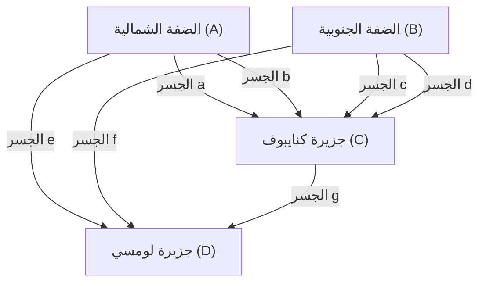

## مقدمة

في تاريخ الرياضيات، يمكن للأسئلة والألعاب اليومية التافهة أن تثير مجالات رياضية جديدة تمامًا. واحدة من أشهر وأجمل الأمثلة على ذلك هي مسألة **"[جسور كونيغسبرغ السبعة](https://kenji.blog/ar/p/seven-bridges-of-konigsberg/)"** ([Seven Bridges of Königsberg](https://kenji.blog/ar/p/seven-bridges-of-konigsberg/)).

في القرن الثامن عشر، في مدينة كونيغسبرغ في مملكة بروسيا (كالينينغراد الحالية، الاتحاد الروسي)، كان يتدفق نهر كبير يسمى نهر بريغوليا (Pregel)، وكانت هناك سبعة جسور مبنية لربط الجزر النهرية بالضفتين. في ذلك الوقت، خطرت للمواطنين خلال نزهاتهم المسائية الفكرة التالية: "هل من الممكن المشي عبر جميع الجسور السبعة في المدينة، بحيث يتم عبور كل جسر مرة واحدة فقط، والعودة إلى نقطة البداية الأصلية؟"

عندما وصلت هذه المسألة، التي بدت مجرد لغز بسيط للوهلة الأولى، إلى عالم الرياضيات العبقري **ليونهارت أويلر** ([Leonhard Euler](https://kenji.blog/ar/p/euler/))، حدثت ثورة في عالم الرياضيات. لم يثبت أويلر استحالة حل هذه المسألة فحسب، بل أعاد خلال هذه العملية النظر في طبيعة الفضاء من منظور جديد تمامًا، ووضع الأسس لمجالين في غاية الأهمية في الرياضيات الحديثة: **نظرية المخططات** ([Graph Theory](https://kenji.blog/ar/p/graph-theory-dijkstra-a-star/)) و **الطوبولوجيا** (Topology، الهندسة الطوبولوجية).

في هذه المقالة، سنتعمق مع التفاصيل الرياضية في الخلفية التاريخية لمسألة [جسور كونيغسبرغ السبعة](https://kenji.blog/ar/p/seven-bridges-of-konigsberg/)، والحل الرائع الذي قدمه أويلر، وكيف يرتبط هذا بالعلوم والتكنولوجيا الحديثة. بدلاً من مجرد مقدمة تاريخية، استمتع بجمال البنية الرياضية التي تكمن وراءها.

## مدينة كونيغسبرغ والجسور السبعة: الخلفية التاريخية

في أوائل القرن الثامن عشر، كانت كونيغسبرغ مدينة تجارية مزدهرة تواجه بحر البلطيق، وكانت أيضًا مركزًا للتعلم. في وسط المدينة، تدفق نهر بريغوليا (Pregel) نحو الغرب، وكانت هناك جزيرتان كبيرتان (جزر نهرية) في النهر تُعرفان باسم كنايبوف (Kneiphof) ولومسي (Lomse).

تم تقسيم البنية الجغرافية للمدينة بشكل عام إلى أربع كتل يابسة:

- اليابسة على الضفة الشمالية (A)
- اليابسة على الضفة الجنوبية (B)
- جزيرة كنايبوف (C)
- جزيرة لومسي، أو اليابسة الشرقية (D)

لربط هذه الكتل اليابسة الأربع، تم بناء ما مجموعه **سبعة جسور**.
اثنان بين الضفة الشمالية (A) والجزيرة (C)، واثنان بين الضفة الجنوبية (B) والجزيرة (C)، وواحد بين الضفة الشمالية (A) والجزيرة (D)، وواحد بين الضفة الجنوبية (B) والجزيرة (D)، وواحد بين الجزيرتين (C) و (D). لم تكن هذه الجسور مجرد بنية تحتية أساسية لحياة المواطنين فحسب، بل كانت أيضًا عناصر مهمة شكلت منظر المدينة الجميل.

كمسيرة بعد ظهر أيام العطل، حاول المثقفون والمواطنون في كونيغسبرغ في ذلك الوقت العثور على طريق يعبرون فيه كل جسر من هذه الجسور السبعة "مرة واحدة بالضبط" للقيام بدورة حول المدينة. ومع ذلك، وبغض النظر عن مدى المحاولات والخطأ، لم ينجح أحد. إما أن ينسوا عبور جسر ما، أو يعبروا نفس الجسر مرتين. سرعان ما بدأ المواطنون يتهامسون قائلين: "ربما لا يوجد مسار مشي كهذا في المقام الأول"، لكن لم يكن هناك أحد يستطيع إثبات ذلك رياضيًا.

## من لغز عبور الجسور إلى مسألة رياضية: حلم لايبنتس وحدس أويلر

في النهاية، وصلت هذه الشائعات بين المواطنين إلى مسامع عالم الرياضيات السويسري العظيم **ليونهارت أويلر**، الذي كان يقيم في أكاديمية سانت بطرسبرغ للعلوم في روسيا. كان ذلك في عام 1735.

في البداية، يبدو أن أويلر شعر تجاه هذه المسألة بأنها "قد لا تكون رياضيات، بل مجرد لعبة منطقية بسيطة". كان التيار الرئيسي للرياضيات في ذلك الوقت هو الهندسة الإقليدية (التي تتعامل مع الأطوال والزوايا والمساحات والأحجام، وما إلى ذلك)، أو الجبر، أو حساب التفاضل والتكامل الذي أسسه للتو نيوتن ولايبنتس. مسألة جسور كونيغسبرغ لا تعتمد على الإطلاق على الخصائص الهندسية التقليدية مثل طول الجسور بالأمتار، أو مساحة الجزر، أو الزاوية التي بنيت بها الجسور بالنسبة للنهر. كان الشيء الوحيد المهم هو العلاقة الصافية لـ **الارتباط (الاتصال)**، أي "أي الكتل اليابسة متصلة ببعضها البعض، وبكم جسر".

كان هذا نوعًا جديدًا تمامًا من المسائل الهندسية التي لم يكن من الممكن التعامل معها ضمن الإطار المتري للهندسة الإقليدية في ذلك الوقت. ومع ذلك، بدأ أويلر تدريجيًا يدرك عمق هذه المسألة. أدرك أنها مسألة مهمة تتعلق بـ "تحليل الموقع" (Analysis Situs) أو "هندسة الموقع" (Geometria Situs)، التي حلم بها ذات يوم غوتفريد فيلهلم لايبنتس (Gottfried Wilhelm Leibniz)، واتخذ قرارًا بالعمل بجدية لتوضيح هذه المسألة.

## تجريد أويلر: التخلص من المعلومات غير الضرورية

كان أبرز مظاهر عبقرية أويلر هو قدرته الاستثنائية على **التجريد** (Abstraction)، أي التخلص من كل المعلومات غير الضرورية من العالم الحقيقي المعقد واستخراج البنية الأساسية للمسألة فقط.

من الخريطة الدقيقة لمدينة كونيغسبرغ الحقيقية، تجاهل تمامًا الشكل الفيزيائي وحجم اليابسة، وعرض النهر وسرعة تياره، ومواد الجسور وأطوالها، وما إلى ذلك. وبعد ذلك، ابتكر النموذج الرياضي التجريدي البسيط للغاية التالي.

1. يتم تمثيل **اليابسة (الجزر والضفاف)** كـ "نقاط" بسيطة ليس لها حجم. في المصطلحات الحديثة، يُطلق على هذا اسم **الرأس** (Vertex) أو **العقدة** (Node).
2. يتم تمثيل **الجسور** كـ "خطوط" تربط بين الرؤوس. يُطلق على هذا اسم **الحافة** (Edge) أو **الرابط** (Link). درجة انحناء الخطوط أو طولها لا تهم.

وبهذه الطريقة، فإن البنية المنفصلة الممثلة كمجموعة محدودة من الرؤوس والحواف التي تربط بينها تسمى **مخططًا** (Graph) في الرياضيات. كانت هذه هي اللحظة الدقيقة لولادة المجال الذي نطلق عليه الآن "نظرية المخططات".

يوضح رسم Mermaid التالي كيف تم تحويل الخريطة الجغرافية لمدينة كونيغسبرغ إلى تمثيل مخطط تجريدي.

بفضل هذا التجريد القوي، تم تحويل سؤال المواطنين اليومي "هل يوجد طريق يعبر الجسور السبعة في المدينة مرة واحدة بالضبط؟" بالكامل إلى مسألة رياضية منطقية وصارمة تمامًا: "هل يوجد مسار متصل (رسم بخط واحد) يمر عبر كل حافة من المخطط المعطى مرة واحدة بالضبط؟".

## درجة الرأس ونظرية الرسم بخط واحد: إثبات أويلر

بعد صياغة المسألة في شكل مخطط، اكتشف أويلر قانونًا عالميًا بسيطًا جدًا ولكنه قوي للغاية. كان مفتاح هذا الإثبات هو إدخال المفهوم الجديد، وهو **الدرجة** (Degree).

في نظرية المخططات، تُكتب **درجة** الرأس $v$ كـ $d(v)$ أو $\text{deg}(v)$، وتعني "العدد الإجمالي للحواف المتصلة مباشرة بذلك الرأس".

درس أويلر منطقيًا كيف أن فعل رسم "مسار يمر عبر جميع الحواف مرة واحدة بالضبط (رسم بخط واحد)" على المخطط يفرض قيودًا على درجة كل رأس.

لنفترض أنه يوجد مسار يرسم المخطط بأكمله بالمرور عبر كل حافة مرة واحدة بالضبط. في عملية تتبع هذا المسار، دعونا نفكر في رأس سيكون بمثابة "نقطة عبور" (رأس ليس نقطة البداية ولا نقطة النهاية). من أجل "الدخول" إلى ذلك الرأس، يجب أن يستخدم المسار حافة واحدة، ومن أجل "الخروج" من ذلك الرأس، يجب أن يستخدم حافة واحدة أخرى.
بعبارة أخرى، في كل مرة تزور فيها رأسًا يمثل نقطة عبور، يجب عليك دائمًا **استهلاك حافتين كزوج**.

لذلك، بالنسبة للرؤوس التي يتم المرور من خلالها فقط في منتصف المسار، يجب أن توجد دائمًا الحواف للدخول والخروج في أزواج، لذلك يجب أن يكون العدد الإجمالي للحواف المتصلة بذلك الرأس (الدرجة) دائمًا **زوجيًا** (Even).

الاستثناءات المحتملة الوحيدة هي الرؤوس التي تتوافق مع "نقطة البداية" و "نقطة النهاية" للمسار.

هنا، يتم تصنيف أنماط المسار إلى الاثنين التاليين:

1. **دائرة أويلر (Eulerian Circuit)**: عندما تكون نقطة البداية ونقطة النهاية هي نفس الرأس.
   في هذه الحالة، يدور المسار حوله ويعود إلى الرأس الأصلي. لذلك، يتم التعامل مع **جميع الرؤوس**، بما في ذلك نقطة البداية = نقطة النهاية، عمليًا على أنها "نقاط عبور". نظرًا لأن الدخول والخروج مقترنان تمامًا، **يجب أن تكون درجة كل الرؤوس في المخطط زوجية**.

2. **مسار أويلر (Eulerian Path)**: عندما تكون نقطة البداية ونقطة النهاية رأسين مختلفين.
   في هذه الحالة، هناك حاجة إلى حافة إضافية واحدة "للخروج أولاً" من نقطة البداية، وهناك حاجة إلى حافة إضافية واحدة "للدخول أخيرًا" إلى نقطة النهاية. لذلك، بالنسبة لنقطة البداية ونقطة النهاية فقط، لا يكتمل زوج الحواف، وسيكون لهما درجة **فردية** (Odd). يجب أن تكون درجة جميع نقاط العبور الأخرى زوجية.

هذه هي النظرية الأكثر أساسية وشهرة في نظرية المخططات (نظرية أويلر)، والتي أثبتها أويلر بصرامة.

للتعبير عن هذه النظرية بدقة أكبر باستخدام الصيغ الرياضية، في مخطط غير موجه متصل $G = (V, E)$:

- **الشرط الضروري والكافي لوجود دائرة أويلر (Eulerian Circuit)**:
  بالنسبة لجميع الرؤوس $v \in V$ في المخطط $G$، تكون درجتها $d(v)$ زوجية.
  $\forall v \in V, \ d(v) \equiv 0 \pmod 2$

- **الشرط الضروري والكافي لوجود مسار أويلر (Eulerian Path)**:
  في المخطط $G$، يوجد "بالضبط اثنان" من الرؤوس درجتهما فردية.
  $|\{v \in V \mid d(v) \equiv 1 \pmod 2\}| = 2$

## التطبيق على مخطط كونيغسبرغ والاستنتاج

الآن، دعونا نطبق هذه النظرية الجميلة والمثالية، التي استنتجها أويلر عن طريق الاستدلال الاستنتاجي، على المخطط الفعلي ل[جسور كونيغسبرغ السبعة](https://kenji.blog/ar/p/seven-bridges-of-konigsberg/).

دعونا نحسب درجات كل من الكتل اليابسة الأربع المجردة (الرؤوس $A, B, C, D$).

- اليابسة على الضفة الشمالية $A$: هناك جسران إلى الجزيرة $C$ وجسر واحد إلى الجزيرة $D$. لذلك، الدرجة هي $d(A) = 3$ (فردي).
- اليابسة على الضفة الجنوبية $B$: هناك جسران إلى الجزيرة $C$ وجسر واحد إلى الجزيرة $D$. لذلك، الدرجة هي $d(B) = 3$ (فردي).
- جزيرة لومسي $D$: هناك جسر واحد إلى الضفة $A$، وجسر واحد إلى الضفة $B$، وجسر واحد إلى الجزيرة $C$. لذلك، الدرجة هي $d(D) = 3$ (فردي).
- جزيرة كنايبوف $C$: هناك جسران إلى الضفة $A$، وجسران إلى الضفة $B$، وجسر واحد إلى الجزيرة $D$. لذلك، الدرجة هي $d(C) = 5$ (فردي).

لتلخيص النتائج، فإن درجات الرؤوس الأربعة الموجودة في مخطط كونيغسبرغ هي "3, 3, 3, 5". المثير للدهشة أن **درجة كل الرؤوس فردية**.

وفقًا لنظرية أويلر، لكي يكون المسار الذي يمر عبر جميع الحواف مرة واحدة بالضبط (رسم بخط واحد) ممكنًا، يجب أن يكون عدد الرؤوس ذات الدرجة الفردية "0" أو "2" بشكل قاطع. ومع ذلك، في مخطط كونيغسبرغ، يوجد "4" رؤوس بدرجة فردية.

استنادًا إلى هذه الحقيقة، توصل أويلر إلى الاستنتاج النهائي التالي:
**"إن المسار الذي يعبر [جسور كونيغسبرغ السبعة](https://kenji.blog/ar/p/seven-bridges-of-konigsberg/) بأكملها مرة واحدة بالضبط لا يمكن أن يوجد على الإطلاق"**

كانت هذه لحظة بالغة الأهمية في تاريخ الرياضيات. لأن أويلر لم يتأكد من الاستحالة عن طريق المشي الدقيق واختبار كل من طرق المشي الممكنة التي تقترب من اللانهاية واحدة تلو الأخرى. لقد أثبت بأناقة أن هذا مستحيل باستخدام الخصائص المنطقية والعالمية البحتة المتمثلة في "بنية المخطط" و "التكافؤ (الزوجي والفردي)". يمكن القول إن هذا النهج الاستنتاجي هو الجوهر الحقيقي للرياضيات الحديثة.

## التطور إلى الطوبولوجيا: ولادة هندسة الموقع

من خلال مسألة جسور كونيغسبرغ، فتح أويلر نموذجًا هندسيًا جديدًا تمامًا يركز حصريًا على "طريقة الاتصال (الاستمرارية والاتصال)" للأشكال والمساحات، دون الاعتماد على الخصائص "المترية" التقليدية للهندسة الإقليدية مثل المسافة والطول والزاوية والمساحة.

كانت هذه بداية المجال الذي سيُعرف لاحقًا باسم **الطوبولوجيا** (Topology، الهندسة الطوبولوجية). في الطوبولوجيا، تتم دراسة "الخصائص التي لا تتغير حتى عندما تتشوه بشكل مستمر (الخصائص الطوبولوجية)". نكتة مشهورة تقول: "لا يستطيع الطوبولوجي (عالم الهندسة الطوبولوجية) التفريق بين فنجان القهوة والكعكة المحلاة (الدونات)". كلاهما "شكل ثلاثي الأبعاد به ثقب واحد"، وإذا تم تشويههما باستمرار مثل الطين دون قطع أو لصق، فيمكن أن يتحول كل منهما إلى الآخر، لذلك في عالم الطوبولوجيا، يعتبران "نفس الشكل".

الشيء نفسه ينطبق على مخطط كونيغسبرغ. حتى لو قمت بتمديد أو تقليص الجسور مثل الأربطة المطاطية أو سحق الجزر، طالما تم الحفاظ على علاقة الاتصال التي تنص على "أي الرؤوس متصلة بأي الرؤوس"، فإن الجوهر كمخطط لا يتغير على الإطلاق. ما ركز عليه أويلر كان بالضبط هذه الخاصية الطوبولوجية لـ "الاتصال غير المتغير حتى عند التشوه".

اكتشف أويلر نفسه لاحقًا في عام 1750 قانونًا عالميًا مذهلاً بشأن عدد الرؤوس ($V$)، والحواف ($E$)، والوجوه ($F$) لمتعدد السطوح، وهو ما يسمى بـ **نظرية أويلر لمتعددات السطوح** ($V - E + F = 2$). كان هذا أيضًا يجسد ثابتًا طوبولوجيًا لا يعتمد على الشكل أو الحجم المحدد لمتعدد السطوح، وأصبح إنجازًا بالغ الأهمية في تطور الطوبولوجيا.

## تطبيقات نظرية المخططات وامتداداتها في المجتمع الحديث

لم تبق نظرية المخططات والطوبولوجيا، التي ولدت من الاستكشاف الفكري البحت لعلماء الرياضيات في القرن الثامن عشر، مجرد تخصص أكاديمي في أبراج عاجية. فقد ازدهرت الآن كأدوات عملية ولا غنى عنها تدعم بشكل أساسي جذور مجتمعنا وتكنولوجياتنا المتقدمة للغاية من حيث المعلومات.

### 1. شبكات الكمبيوتر والإنترنت
إن البنية المادية والمنطقية للإنترنت الذي نستخدمه كل يوم هي بالضبط المخطط العملاق ذاته على نطاق عالمي. يتم تمثيل كل جهاز توجيه وخادم وكمبيوتر كرؤوس، ويتم تمثيل كابلات الألياف الضوئية وخطوط الاتصال اللاسلكي التي تربط بينها كحواف. تم تصميم جميع بروتوكولات التوجيه (مثل خوارزمية ديكسترا) لتوصيل حزم البيانات إلى وجهتها في أسرع وقت وبكفاءة مع تجنب الازدحام المروري، كخوارزميات في نظرية المخططات.

### 2. أنظمة الملاحة وتحسين الخدمات اللوجستية
يقوم البحث عن المسار في تطبيقات الخرائط على الهواتف الذكية وأنظمة الملاحة في السيارات بإجراء حسابات من خلال اعتبار التقاطعات ومناطق الدمج كرؤوس، والطرق كحواف. هذا ليس سوى **مسألة أقصر مسار** (Shortest Path Problem) في نظرية المخططات. بالإضافة إلى ذلك، في شبكات الخدمات اللوجستية، تُعرف مسألة تحديد المسار الذي يزور عددًا كبيرًا من وجهات التوصيل بالترتيب الأكثر كفاءة باسم **مسألة البائع المتجول** (Traveling Salesman Problem).

### 3. تحليل الشبكات الاجتماعية (SNA)
تعتمد أيضًا تحليلات الشبكات الاجتماعية، التي تحتل مكانة مهمة في العلوم الاجتماعية والمعلوماتية الحديثة، على نظرية المخططات. يتم تصميم العلاقات الإنسانية في خدمات الشبكات الاجتماعية مثل X (تويتر سابقًا) و Facebook على شكل "مخططات اجتماعية" مع اعتبار المستخدمين رؤوسًا، وعلاقات المتابعة كحواف. من خلال تحليل هذا المخطط، يصبح من الممكن اكتشاف هياكل المجتمعات، وبناء نماذج لكيفية انتشار المعلومات.

### 4. علوم الحياة: علم الأحياء، الكيمياء، والطب
تلعب نظرية المخططات أيضًا دورًا نشطًا في نطاقات مختلفة من العلوم الطبيعية. في الكيمياء، عند نمذجة التركيب الجزيئي، يتم استخدام مخطط يمثل الذرات كرؤوس والروابط الكيميائية كحواف. في علم الأحياء، لفهم التفاعلات المعقدة بين البروتينات في الخلايا كشبكة، أو في علم الدماغ لفهم كيف تتصل العديد من الخلايا العصبية وتعالج المعلومات (تحليل الكونيكتوم)، أصبحت طرق التحليل القوية لنظرية المخططات لا غنى عنها.

## خاتمة

في عام 1736، قدمت ورقة بحثية واحدة نشرها ليونهارت أويلر بعنوان "حلول للمسائل المتعلقة بهندسة الموقع" إجابة كاملة للغز نزهة عطلة المواطنين البسيط في كونيغسبرغ. ومع ذلك، فإن ما كان يعنيه هذا حقًا لم يكن نهاية مسألة واحدة، بل ولادة كون رياضي شاسع له عدد لا يحصى من التطبيقات.

إنها **قوة التجريد**، التي تنفذ بشكل حاد لترى فقط البنية الأساسية المتمثلة في "ما الذي يتصل بماذا وكيف"، دون أن تقتصر على الأشكال السطحية وأحجام الأشياء. تعلمنا قصة [جسور كونيغسبرغ السبعة](https://kenji.blog/ar/p/seven-bridges-of-konigsberg/) عبر العصور كيف أن التفكير الرياضي التجريدي هو سلاح قوي يحلل العالم الحقيقي ويخلق تكنولوجيا المستقبل.

إذا كنت تمشي في المدينة في المرة القادمة، أو رأيت جسرًا يمر فوق نهر، أو نظرت إلى خريطة طريق مترو الأنفاق، ففكر في بنية "الاتصال" التي تقف وراءها. هناك، لا تزال الخيوط الجميلة للرياضيات غير المرئية، التي اكتشفها عالم رياضيات عبقري قبل أكثر من 280 عامًا، ممتدة لتطوقنا في العصر الحديث.
