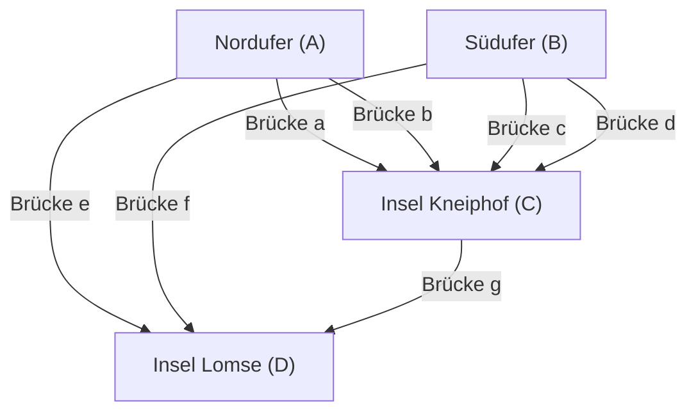

## Einführung

In der Geschichte der Mathematik kommt es manchmal vor, dass alltägliche, triviale Fragen oder Spiele völlig neue mathematische Disziplinen eröffnen. Eines der berühmtesten und schönsten Beispiele dafür ist das Problem der **"Sieben Brücken von Königsberg"** ([Seven Bridges of Königsberg](https://kenji.blog/de/p/seven-bridges-of-konigsberg/)).

Im 18. Jahrhundert floss durch die preußische Stadt Königsberg (das heutige Kaliningrad in der Russischen Föderation) der große Fluss Pregel. Es gab sieben Brücken, die die Flussinseln mit beiden Ufern verbanden. Die damaligen Bürger erdachten sich bei ihren abendlichen Spaziergängen folgendes Spiel: "Ist es möglich, einen Spaziergang zu machen, bei dem man alle sieben Brücken der Stadt genau einmal überquert und zum Ausgangspunkt zurückkehrt?"

Als dieses scheinbar bloße Rätsel in die Hände des genialen Mathematikers **[Leonhard Euler](https://kenji.blog/de/p/euler/)** ([Leonhard Euler](https://kenji.blog/de/p/euler/)) fiel, kam es zu einer Revolution in der Welt der Mathematik. Euler bewies nicht nur, dass dieses Problem unlösbar ist, sondern betrachtete in diesem Prozess die Eigenschaften des Raumes aus einer völlig neuen Perspektive und legte den Grundstein für zwei in der modernen Mathematik äußerst wichtige Gebiete: die **Graphentheorie** ([Graph Theory](https://kenji.blog/de/p/graph-theory-dijkstra-a-star/)) und die **Topologie** (Topology).

In diesem Artikel werden wir den historischen Hintergrund des Problems der sieben Brücken von Königsberg, Eulers brillante Lösung und wie dies mit moderner Wissenschaft und Technologie zusammenhängt, mit mathematischen Details tiefgehend untersuchen. Genießen Sie nicht nur die historische Einführung, sondern auch die Schönheit der dahinterliegenden mathematischen Struktur.

## Die Stadt Königsberg und ihre sieben Brücken: Historischer Hintergrund

Zu Beginn des 18. Jahrhunderts war Königsberg eine florierende Handelsstadt an der Ostsee und ein Zentrum der Gelehrsamkeit. Im Zentrum der Stadt floss die Pregel nach Westen, und im Fluss befanden sich zwei große Inseln namens Kneiphof und Lomse.

Die geografische Struktur der Stadt war grob in die folgenden vier Landmassen unterteilt:

- Das nördliche Ufer (A)
- Das südliche Ufer (B)
- Die Insel Kneiphof (C)
- Die Insel Lomse, oder das östliche Land (D)

Um diese vier Landmassen zu verbinden, wurden insgesamt **sieben Brücken** gebaut.
Zwei zwischen dem Nordufer (A) und der Insel (C), zwei zwischen dem Südufer (B) und der Insel (C), eine zwischen dem Nordufer (A) und der Insel (D), eine zwischen dem Südufer (B) und der Insel (D) und eine zwischen den beiden Inseln (C) und (D). Diese Brücken waren eine unverzichtbare Infrastruktur für das Leben der Bürger und bildeten gleichzeitig ein wichtiges Element des wunderschönen Stadtbildes.

Die Intellektuellen und Bürger des damaligen Königsbergs versuchten bei ihren sonntäglichen Nachmittagsspaziergängen, eine Route durch die Stadt zu finden, die jede dieser sieben Brücken "genau einmal" überquert. Doch egal wie viel sie es durch Versuch und Irrtum probierten, niemandem gelang es. Man vergaß eine Brücke oder überquerte dieselbe Brücke zweimal. Bald wurde unter den Bürgern gemunkelt: "Gibt es eine solche Spazierroute überhaupt?", aber niemand konnte dies mathematisch beweisen.

## Vom Brückenrätsel zum mathematischen Problem: Leibniz' Traum und Eulers Intuition

Dieses Gerücht der Bürger erreichte schließlich die Ohren des großen Schweizer Mathematikers **[Leonhard Euler](https://kenji.blog/de/p/euler/)**, der sich damals an der Russischen Akademie der Wissenschaften in Sankt Petersburg aufhielt. Es war das Jahr 1735.

Anfänglich hatte Euler offenbar das Gefühl: "Ist das nicht bloß eine logische Spielerei und keine Mathematik?" Die damaligen Hauptströmungen der Mathematik waren die euklidische Geometrie (die sich mit Länge, Winkel, Fläche, Volumen usw. befasst), die Algebra oder die gerade erst von Newton und Leibniz begründete Differential- und Integralrechnung. Das Problem der Königsberger Brücken hängt überhaupt nicht von traditionellen geometrischen Eigenschaften ab, wie etwa davon, wie viele Meter die Brücken lang sind, wie groß die Flächen der Inseln sind oder in welchem Winkel die Brücken zum Fluss stehen. Wichtig war nur die reine Beziehung der **Verbindung**: "Welches Land ist durch wie viele Brücken mit welchem Land verbunden?"

Dies war ein völlig neuartiges geometrisches Problem, das im metrischen Rahmen der damaligen euklidischen Geometrie nicht behandelt werden konnte. Euler begann jedoch allmählich, die Tiefe dieses Problems zu erkennen. Er erkannte, dass es sich um ein wichtiges Problem im Zusammenhang mit der von Gottfried Wilhelm Leibniz erträumten "Analysis Situs" oder "Geometria Situs" (Geometrie der Lage) handelte, und beschloss, sich ernsthaft der Klärung dieses Problems zu widmen.

## Eulers Abstraktion: Unnötige Informationen weglassen

Die auffälligste Manifestation von Eulers Genie lag in seiner herausragenden Fähigkeit zur **Abstraktion** (Abstraction), bei der er alle unnötigen Informationen aus der komplexen realen Welt eliminierte und nur die wesentliche Struktur des Problems extrahierte.

Er ignorierte aus der präzisen Landkarte des realen Königsbergs völlig physikalische Form und Größe der Landmassen, die Breite des Flusses, die Fließgeschwindigkeit des Wassers, das Material und die Länge der Brücken usw. Dann erschuf er das folgende extrem einfache und abstrakte mathematische Modell:

1. **Landmassen (Inseln und Ufer)** werden als bloße "Punkte" ohne Größe dargestellt. In der modernen Terminologie nennt man dies einen **Knoten** (Vertex) oder **Node** (Node).
2. **Brücken** werden als "Linien" dargestellt, die Knoten miteinander verbinden. Dies nennt man eine **Kante** (Edge) oder einen **Link** (Link). Die Krümmung oder Länge der Linie spielt keine Rolle.

Eine solche diskrete Struktur, die als Menge von endlich vielen Knoten und sie verbindenden Kanten dargestellt wird, nennt man in der Mathematik einen **[Graph](https://kenji.blog/de/p/tree-graph-data-structures-search-dfs-bfs-dijkstra/)** (Graph). Dies war genau der Moment der Geburt des Gebiets, das wir heute "Graphentheorie" nennen.

Das folgende Mermaid-Diagramm zeigt, wie die geografische Karte der Stadt Königsberg in eine abstrakte Graphendarstellung umgewandelt wurde.

Durch diese kraftvolle Abstraktion wurde die alltägliche Frage der Bürger, "ob es eine Route gibt, um jede der sieben Brücken der Stadt einmal zu überqueren", vollständig in ein rein logisches und streng mathematisches Problem umgewandelt: "Gibt es in einem gegebenen Graphen einen kontinuierlichen Pfad (einen Eulerschen Weg), der jede Kante genau einmal durchläuft?"

## Der Grad der Knoten und der Satz vom Eulerweg: Eulers Beweis

Nachdem er das Problem in Form eines Graphen formuliert hatte, entdeckte Euler ein sehr einfaches, aber extrem mächtiges universelles Gesetz. Der Schlüssel zu seinem Beweis war die Einführung des neuen Konzepts des **Grades** (Degree).

In der Graphentheorie wird der **Grad** eines Knotens $v$ als $d(v)$ oder $\text{deg}(v)$ bezeichnet und bedeutet "die Gesamtzahl der direkt mit diesem Knoten verbundenen Kanten".

Euler überlegte logisch, welche Einschränkungen der Akt, einen "Pfad, der alle Kanten genau einmal durchläuft (Eulerweg)" auf einem Graphen zu zeichnen, dem Grad jedes Knotens auferlegt.

Nehmen wir an, es gäbe einen Pfad, der den gesamten Graphen abzeichnet, indem er alle Kanten genau einmal durchläuft. Betrachten wir im Verlauf dieses Pfades einen Knoten, der ein "Durchgangspunkt" (ein Knoten, der weder Start- noch Endpunkt ist) ist. Um in den Knoten "hineinzukommen", muss der Pfad eine Kante benutzen, und um aus dem Knoten "herauszukommen", muss er eine andere Kante benutzen.
Das heißt, jedes Mal, wenn man einen Knoten als Durchgangspunkt besucht, verbraucht man zwangsläufig **zwei Kanten als Paar**.

Daher müssen an Knoten, die nur im Verlauf des Pfades passiert werden, die Kanten zum Betreten und Verlassen immer paarweise vorhanden sein, sodass die Gesamtzahl der mit diesem Knoten verbundenen Kanten (der Grad) immer **gerade** (Even) sein muss.

Die einzigen möglichen Ausnahmen sind die Knoten, die dem "Startpunkt" und dem "Endpunkt" des Pfades entsprechen.

Hierbei lassen sich die Muster des Pfades in die folgenden zwei Kategorien einteilen:

1. **Eulerkreis (Eulerian Circuit)**: Wenn der Startpunkt und der Endpunkt derselbe Knoten sind.
   In diesem Fall macht der Pfad eine volle Runde und kehrt zum ursprünglichen Knoten zurück. Daher werden praktisch **alle Knoten**, einschließlich Startpunkt = Endpunkt, wie "Durchgangspunkte" behandelt. Da das Ein- und Austreten vollständig gepaart ist, muss **der Grad aller Knoten im Graphen gerade sein**.

2. **Eulerweg (Eulerian Path)**: Wenn der Startpunkt und der Endpunkt unterschiedliche Knoten sind.
   In diesem Fall wird am Startpunkt eine zusätzliche Kante "für das erste Hinausgehen" benötigt, und am Endpunkt wird eine zusätzliche Kante "für das letzte Hineinkommen" benötigt. Daher sind nur bei den zwei Knoten von Start- und Endpunkt die Kantenpaare nicht vollständig, und sie haben einen **ungeraden** (Odd) Grad. Die Grade aller anderen Durchgangspunkte müssen gerade sein.

Dies ist der grundlegendste und berühmteste Satz in der Graphentheorie (Eulerscher Satz), den Euler streng bewies.

Strenger mathematisch ausgedrückt mit Hilfe von Formeln für einen zusammenhängenden ungerichteten Graphen $G = (V, E)$:

- **Notwendige und hinreichende Bedingung für die Existenz eines Eulerkreises (Eulerian Circuit)**:
  Für alle Knoten $v \in V$ im Graphen $G$ muss deren Grad $d(v)$ gerade sein.
  $\forall v \in V, \ d(v) \equiv 0 \pmod 2$

- **Notwendige und hinreichende Bedingung für die Existenz eines Eulerweges (Eulerian Path)**:
  Im Graphen $G$ gibt es "genau zwei" Knoten mit einem ungeraden Grad.
  $|\{v \in V \mid d(v) \equiv 1 \pmod 2\}| = 2$

## Anwendung auf den Königsberger Graphen und Schlussfolgerung

Wenden wir nun diesen schönen und perfekten Satz, den Euler durch deduktives Denken abgeleitet hat, auf den eigentlichen Graphen der sieben Brücken von Königsberg an.

Zählen wir den Grad jedes der 4 abstrahierten Landmassen (Knoten $A, B, C, D$).

- Nordufer $A$: Es gibt 2 Brücken zur Insel $C$ und 1 Brücke zur Insel $D$. Daher ist der Grad $d(A) = 3$ (ungerade).
- Südufer $B$: Es gibt 2 Brücken zur Insel $C$ und 1 Brücke zur Insel $D$. Daher ist der Grad $d(B) = 3$ (ungerade).
- Insel Lomse $D$: Es gibt 1 Brücke zum Ufer $A$, 1 zum Ufer $B$ und 1 zur Insel $C$. Daher ist der Grad $d(D) = 3$ (ungerade).
- Insel Kneiphof $C$: Es gibt 2 Brücken zum Ufer $A$, 2 zum Ufer $B$ und 1 zur Insel $D$. Daher ist der Grad $d(C) = 5$ (ungerade).

Zusammenfassend sind die Grade der 4 Knoten im Königsberger Graphen "3, 3, 3, 5". Erstaunlicherweise ist **der Grad aller Knoten ungerade**.

Nach dem Eulerschen Satz muss die Anzahl der Knoten mit ungeradem Grad zwingend "0" oder "2" sein, damit ein Pfad möglich ist, der alle Kanten genau einmal durchläuft. Im Königsberger Graphen gibt es jedoch "4" Knoten mit ungeradem Grad.

Aufgrund dieser Tatsache zog Euler die folgende endgültige Schlussfolgerung:
**"Es gibt absolut keinen Pfad, bei dem man alle sieben Brücken von Königsberg genau einmal überqueren kann."**

Dies war ein äußerst wichtiger Moment in der Geschichte der Mathematik. Denn Euler hatte die Unmöglichkeit nicht dadurch bestätigt, dass er alle beinahe unendlich vielen denkbaren Spazierwege einzeln abgelaufen war. Er bewies die Unmöglichkeit auf elegante Weise, indem er sich nur auf die rein logischen und universellen Eigenschaften der "Graphenstruktur" und der "Parität (Gerade/Ungerade-Eigenschaft)" stützte. Genau dieser deduktive Ansatz ist die wahre Essenz der modernen Mathematik.

## Entwicklung zur Topologie: Die Geburt der Geometrie der Lage

Durch das Problem der Königsberger Brücken eröffnete Euler ein völlig neues geometrisches Paradigma, das wesentliche Studienobjekte nur noch in der "Art der Verbindung (Kontinuität und Verbindungsverhältnisse)" von Figuren und Räumen sieht und sich überhaupt nicht mehr auf die traditionellen "metrischen" Eigenschaften der euklidischen Geometrie wie Abstand, Länge, Winkel oder Fläche verlässt.

Dies war der Beginn des Fachgebiets, das später als **Topologie** (Topology) bekannt werden sollte. In der Topologie werden "Eigenschaften, die sich bei kontinuierlicher Verformung nicht ändern (topologische Eigenschaften)" untersucht. Ein bekannter Witz besagt, dass "ein Topologe eine Kaffeetasse nicht von einem Donut unterscheiden kann". Beide sind "dreidimensionale Objekte mit einem Loch", und da sie durch kontinuierliches Verformen wie Ton, ohne Schneiden oder Kleben, ineinander umgewandelt werden können, gelten sie in der Welt der Topologie als "gleiche Form".

Das Gleiche gilt für den Königsberger Graphen. Selbst wenn man die Brücken wie Gummibänder dehnt oder schrumpft oder die Inseln zerquetscht, ändert sich die Essenz des Graphen überhaupt nicht, solange die Verbindungsbeziehung "welcher Knoten mit welchem Knoten verbunden ist" gewahrt bleibt. Euler konzentrierte sich genau auf diese topologische Eigenschaft der "Verbindung, die unter Verformung unveränderlich ist".

Euler selbst entdeckte daraufhin im Jahr 1750 ein erstaunliches universelles Gesetz betreffend die Anzahl der Knoten ($V$), Kanten ($E$) und Flächen ($F$) eines Polyeders, den sogenannten **Eulerschen Polyedersatz** ($V - E + F = 2$). Dies erfasste ebenfalls eine topologische Invariante, die nicht von der spezifischen Form oder Größe des Polyeders abhängt, und stellt einen äußerst wichtigen Meilenstein in der Entwicklung der Topologie dar.

## Anwendung und Verbreitung der Graphentheorie in der modernen Gesellschaft

Die Graphentheorie und die Topologie, die aus der reinen intellektuellen Suche der Mathematiker des 18. Jahrhunderts hervorgegangen sind, blieben keineswegs im Elfenbeinturm der Wissenschaft. Sie haben sich mittlerweile zu äußerst praktischen und unverzichtbaren Werkzeugen entwickelt, die das Fundament unserer hochgradig informatisierten Gesellschaft und Technologie stützen.

### 1. Computernetzwerke und das Internet
Die physische und logische Struktur des Internets, das wir täglich nutzen, ist genau das: ein riesiger [Graph](https://kenji.blog/de/p/tree-graph-data-structures-search-dfs-bfs-dijkstra/) auf globaler Ebene. Einzelne Router, Server und Computer sind die Knoten, und die sie verbindenden Glasfaser- oder drahtlosen Kommunikationsleitungen werden als Kanten dargestellt. Routing-Protokolle (wie etwa der [Dijkstra](https://kenji.blog/de/p/graph-theory-dijkstra-a-star/)-Algorithmus), um Datenpakete am schnellsten und effizientesten an ihr Ziel zu bringen und dabei Staus zu vermeiden, sind alle als graphentheoretische Algorithmen konzipiert.

### 2. Navigationssysteme und Logistikoptimierung
Die Routensuche in Karten-Apps auf Smartphones oder in Autonavigationssystemen führt Berechnungen durch, bei denen Kreuzungen und Einmündungen als Knoten und Straßen als Kanten betrachtet werden. Dies ist nichts anderes als das **Problem des kürzesten Pfades** (Shortest Path Problem) in der Graphentheorie. Das Problem der Bestimmung der Route, die zahlreiche Lieferziele in logistischen Netzwerken in der effizientesten Reihenfolge ansteuert, ist ebenfalls als das **Problem des Handlungsreisenden** (Traveling Salesman Problem) bekannt.

### 3. Analyse sozialer Netzwerke (SNA)
Die Analyse sozialer Netzwerke, die einen wichtigen Platz in den modernen Sozial- und Informationswissenschaften einnimmt, basiert ebenfalls auf der Graphentheorie. Menschliche Beziehungen in SNS wie X (früher Twitter) und Facebook werden als "Social [Graph](https://kenji.blog/de/p/tree-graph-data-structures-search-dfs-bfs-dijkstra/)" modelliert, mit den Benutzern als Knoten und den Follower-Beziehungen als Kanten. Die Analyse dieses Graphen ermöglicht es, die Struktur von Gemeinschaften zu entdecken oder Modelle dafür zu erstellen, wie sich Informationen verbreiten.

### 4. Biowissenschaften: Biologie, Chemie und Medizin
Auch in verschiedenen Maßstäben der Naturwissenschaften ist die Graphentheorie aktiv. In der Chemie werden bei der Modellierung molekularer Strukturen Graphen verwendet, bei denen Atome die Knoten und chemische Bindungen die Kanten sind. In der Biologie sind die leistungsstarken Analysemethoden der Graphentheorie unverzichtbar, um die komplexen Interaktionen zwischen Proteinen in Zellen als Netzwerke zu begreifen oder um in den Neurowissenschaften zu verstehen, wie unzählige Neuronen miteinander verbunden sind und Informationen verarbeiten (Konnektomanalyse).

## Fazit

Ein einziges im Jahr 1736 von [Leonhard Euler](https://kenji.blog/de/p/euler/) veröffentlichtes Papier, "Lösung eines Problems bezüglich der Geometrie der Lage", gab dem trivialen Sonntagsspaziergangsrätsel der Königsberger Bürger eine vollständige Antwort. Was es jedoch wirklich bedeutete, war nicht das Ende eines Problems, sondern die Geburt eines riesigen mathematischen Universums mit zahllosen Anwendungen.

Es ist die **Kraft der Abstraktion**, die nicht an den oberflächlichen Formen und Größen der Dinge festhält, sondern scharfsinnig nur die wesentlichste Struktur durchschaut: "Was ist wie womit verbunden?". Die Geschichte der sieben Brücken von Königsberg lehrt uns über alle Zeiten hinweg, wie abstraktes mathematisches Denken eine mächtige Waffe sein kann, um die reale Welt zu entschlüsseln und die Technologie der Zukunft zu erschaffen.

Wenn Sie das nächste Mal durch die Stadt spazieren und eine Brücke über einen Fluss sehen oder sich einen U-Bahn-Netzplan ansehen, denken Sie doch bitte an die Struktur der "Verbindungen" dahinter. Dort sind die wunderschönen, unsichtbaren Fäden der Mathematik gespannt, die vor über 280 Jahren von einem mathematischen Genie entdeckt wurden und uns heute noch so umgeben.
