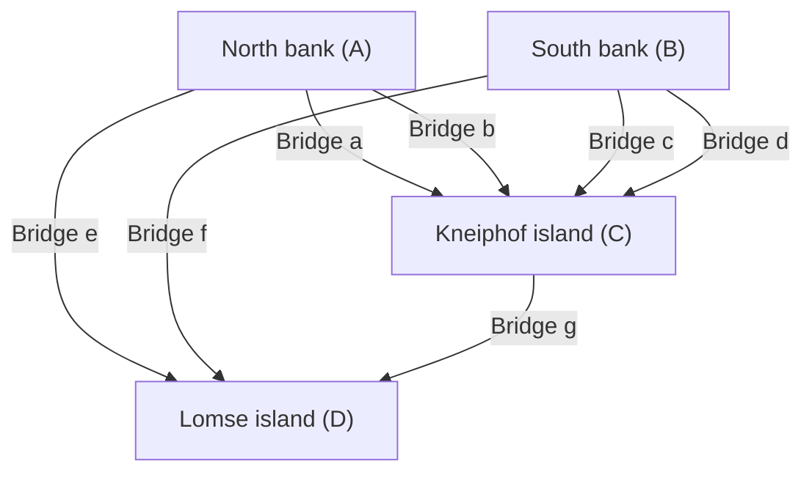

## Introduction

In the history of mathematics, trivial everyday questions or games can sometimes act as catalysts for pioneering entirely new fields of mathematics. One of the most famous and beautiful examples of this is the **"[Seven Bridges of Königsberg](https://kenji.blog/en/p/seven-bridges-of-konigsberg/)"** problem.

In the 18th century, the city of Königsberg in the Kingdom of Prussia (now Kaliningrad, Russian Federation) was divided by the large Pregel River, and seven bridges were built to connect its islands and both banks. During their evening walks, the citizens of the time came up with the following game: "Is it possible to walk across all seven bridges in the city exactly once and return to the starting point?"

When this seemingly simple puzzle fell into the hands of the genius mathematician **[Leonhard Euler](https://kenji.blog/en/p/euler/)**, a revolution occurred in the world of mathematics. Euler not only proved that this problem was impossible but, in the process, also re-examined the properties of space from an entirely new perspective, laying the foundations for two critically important fields in modern mathematics: **[Graph Theory](https://kenji.blog/en/p/graph-theory-dijkstra-a-star/)** and **Topology**.

In this article, we will delve deeply into the historical background of the [Seven Bridges of Königsberg](https://kenji.blog/en/p/seven-bridges-of-konigsberg/) problem, Euler's brilliant method of solving it, and how it connects to modern science and technology, incorporating mathematical details. [Go](https://kenji.blog/en/p/programming-languages-history-paradigm-evolution/) beyond a mere historical introduction and enjoy the beauty of the mathematical structure behind it.

## The City of Königsberg and the Seven Bridges: Historical Background

In the early 18th century, Königsberg was a prosperous commercial city facing the Baltic Sea and a center of learning. The Pregel River flowed westward through the center of the city, and within the river were two large islands called Kneiphof and Lomse.

The geographical structure of the city was broadly divided into the following four landmasses:

- North bank landmass (A)
- South bank landmass (B)
- Kneiphof island (C)
- Lomse island, or the east landmass (D)

To connect these four landmasses, a total of **seven bridges** were built.
There were two between the north bank (A) and island (C), two between the south bank (B) and island (C), one between the north bank (A) and island (D), one between the south bank (B) and island (D), and one between the two islands (C) and (D). These bridges were indispensable infrastructure for civic life and at the same time important elements constituting the beautiful cityscape.

Intellectuals and citizens of Königsberg at the time tried to find a route around the city by crossing each of these seven bridges "exactly once" as a Sunday afternoon walk. However, no matter how much trial and error they went through, no one succeeded. They would either forget to cross a bridge or cross the same bridge twice. Eventually, citizens began to whisper that "such a walking route might not exist in the first place," but no one could prove it mathematically.

## From a Bridge Puzzle to a Mathematical Problem: Leibniz's Dream and Euler's Intuition

This rumor among the citizens eventually reached the ears of the great Swiss-born mathematician, **[Leonhard Euler](https://kenji.blog/en/p/euler/)**, who was staying at the St. Petersburg Academy of Sciences in Russia. It was the year 1735.

Initially, Euler seemed to feel that "this is not mathematics, but merely a logical game." The mainstream mathematics of the time was [[Euclid](https://kenji.blog/en/p/euclid/)e](https://kenji.blog/p/euclid/)an geometry (dealing with length, angle, area, volume, etc.), algebra, or the newly founded calculus by Newton and Leibniz. The Königsberg bridge problem does not depend at all on traditional geometric properties such as how many meters long the bridges are, how large the islands are, or at what angle the bridges are built relative to the river. The only important thing was the pure **connection** relationship of "which landmass is connected to which landmass by how many bridges."

This was a completely new type of geometric problem that could not be handled within the metric framework of [[Euclid](https://kenji.blog/en/p/euclid/)e](https://kenji.blog/p/euclid/)an geometry of the time. However, Euler gradually began to realize the depth of this problem. He recognized it as an important problem related to the "Geometry of Position (Geometria Situs)" or "Analysis Situs" that Gottfried Wilhelm Leibniz once dreamed of, and resolved to earnestly work on solving it.

## Euler's Abstraction: Stripping Away Unnecessary Information

The most prominent manifestation of Euler's genius lay in his outstanding ability for **abstraction**, stripping away all unnecessary information from the complex real world and extracting only the essential structure of the problem.

From the elaborate real map of Königsberg, he completely ignored the physical shape and size of the landmasses, the width of the river and the speed of the water flow, the material and length of the bridges, and so on. He then created an extremely simple and abstract mathematical model as follows:

1. Represent **landmasses (islands and banks)** as mere "points" with no size. In modern terms, these are called **vertices** or **nodes**.
2. Represent **bridges** as "lines" connecting vertices to each other. These are called **edges** or **links**. The curvature and length of the lines do not matter.

A discrete structure represented as a finite set of vertices and edges connecting them in this way is called a **graph** in mathematics. This was precisely the moment of birth of the field we now call "[Graph Theory](https://kenji.blog/en/p/graph-theory-dijkstra-a-star/)."

The Mermaid diagram below shows how the geographical map of the city of Königsberg was transformed into an abstract graph representation.

Through this powerful abstraction, the citizens' everyday question of "is there a route to cross the city's seven bridges once each?" was completely transformed into the purely logical and rigorous mathematical problem of "does there exist a continuous path that traverses all the edges of a given graph exactly once?"

## Vertex Degrees and the Eulerian Path Theorem: Euler's Proof

After formulating the problem in the form of a graph, Euler discovered an extremely simple yet incredibly powerful universal law. The key to its proof was the introduction of a new concept called **degree**.

In graph theory, the **degree** of a vertex $v$ is denoted as $d(v)$ or $\text{deg}(v)$, which means "the total number of edges directly connected to that vertex."

Euler logically considered what constraints the act of drawing a "path that traverses all edges exactly once" on a graph would place on the degree of each vertex.

Let's assume that there exists a path that draws the entire graph by passing through all edges exactly once. In the process of tracing this path, let's consider a vertex that acts as a "passing point" (a vertex that is neither the starting nor ending point). To "enter" that vertex, the path must use one edge, and to "exit" that vertex, it must use another edge.
In other words, every time you visit a vertex that serves as a passing point, you must always **consume two edges as a pair**.

Therefore, for vertices that are merely passed through in the middle of the path, the edges for entering and exiting them must always exist in pairs, so the total number of edges (degree) connected to that vertex must always be **even**.

The only potential exceptions are the vertices corresponding to the "starting point" and "ending point" of the path.

Here, the path patterns are classified into the following two types:

1. **Eulerian Circuit**: When the starting point and ending point are the same vertex.
   In this case, the path goes all the way around and returns to the original vertex. Therefore, **all vertices** including the starting point = ending point are essentially treated the same as "passing points." Since entries and exits are perfectly paired, **the degree of all vertices in the graph must be even**.

2. **Eulerian Path**: When the starting point and ending point are different vertices.
   In this case, one extra edge is needed to "leave first" from the starting point, and one extra edge is needed to "enter last" at the ending point. Therefore, the pairs of edges are not completed only at the two vertices of the starting and ending points, and they will have an **odd** degree. The degree of all other passing points must be even.

This is the most fundamental and famous theorem in graph theory (Euler's Theorem), rigorously proved by Euler.

Expressing this theorem more rigorously using mathematical formulas, for a connected undirected graph $G = (V, E)$:

- **Necessary and sufficient condition for an Eulerian Circuit to exist**:
  For all vertices $v \in V$ of graph $G$, its degree $d(v)$ is even.
  $\forall v \in V, \ d(v) \equiv 0 \pmod 2$

- **Necessary and sufficient condition for an Eulerian Path to exist**:
  In graph $G$, there exist "exactly two" vertices with an odd degree.
  $|\{v \in V \mid d(v) \equiv 1 \pmod 2\}| = 2$

## Application to the Königsberg [Graph](https://kenji.blog/en/p/tree-graph-data-structures-search-dfs-bfs-dijkstra/) and Conclusion

Now, let's apply this beautiful and perfect theorem deduced by Euler through deductive reasoning to the actual graph of the [Seven Bridges of Königsberg](https://kenji.blog/en/p/seven-bridges-of-konigsberg/).

Let's count the degrees of each of the four abstracted landmasses (vertices $A, B, C, D$).

- North bank landmass $A$: 2 bridges to island $C$, 1 bridge to island $D$. Thus, the degree is $d(A) = 3$ (odd).
- South bank landmass $B$: 2 bridges to island $C$, 1 bridge to island $D$. Thus, the degree is $d(B) = 3$ (odd).
- Lomse island $D$: 1 bridge to bank $A$, 1 bridge to bank $B$, 1 bridge to island $C$. Thus, the degree is $d(D) = 3$ (odd).
- Kneiphof island $C$: 2 bridges to bank $A$, 2 bridges to bank $B$, 1 bridge to island $D$. Thus, the degree is $d(C) = 5$ (odd).

Summarizing the results, the degrees of the four vertices existing in the Königsberg graph are "3, 3, 3, 5". Surprisingly, **the degrees of all vertices are odd**.

According to Euler's theorem, in order for a path traversing all edges exactly once to be possible, the number of odd-degree vertices must absolutely be "0" or "2". However, in the Königsberg graph, there are "4" odd-degree vertices.

With this fact, Euler reached his final conclusion as follows:
**"There absolutely does not exist a walking path that crosses the seven bridges of Königsberg exactly once each."**

This was an extremely important moment in the history of mathematics. Because Euler did not confirm the impossibility by painstakingly walking one by one through an almost infinite number of possible walking routes. He elegantly proved that it is impossible using only purely logical and universal properties of "graph structure" and "parity (evenness/oddness)". This deductive approach is precisely the true essence of modern mathematics.

## Evolution into Topology: The Birth of the Geometry of Position

Through the Königsberg bridge problem, Euler opened up an entirely new paradigm of geometry that essentially studies only the "way things are connected (continuity and connectivity)" of figures and spaces, without relying at all on traditional [[Euclid](https://kenji.blog/en/p/euclid/)e](https://kenji.blog/p/euclid/)an geometric "metric" properties such as distance, length, angle, and area.

This was the dawn of the field that would later be called **Topology**. In topology, "properties that do not change even if continuously deformed (topological properties)" are studied. A well-known joke is that "a topologist cannot distinguish between a coffee cup and a doughnut." Both are "solid bodies with one hole," and since they can be continuously deformed into each other like clay without cutting or pasting, they are considered to be the "same shape" in the world of topology.

The Königsberg graph is exactly the same. Even if you stretch or shrink the bridges like rubber bands, or squash the islands, as long as the connection relationship of "which vertex is connected to which vertex" is preserved, the essence as a graph does not change at all. What Euler focused on was precisely this topological property of "connections that remain invariant even under deformation".

Euler himself later discovered an astonishing universal law regarding the number of vertices ($V$), edges ($E$), and faces ($F$) of a polyhedron in 1750, the so-called **Euler's Polyhedral Formula** ($V - E + F = 2$). This also captures a topological invariant that does not depend on the specific shape or size of the polyhedron, and it stands as a monumentally important milestone in the development of topology.

## Applications and Expansion of [Graph Theory](https://kenji.blog/en/p/graph-theory-dijkstra-a-star/) in Modern Society

[Graph](https://kenji.blog/en/p/tree-graph-data-structures-search-dfs-bfs-dijkstra/) theory and topology, which originated from the pure intellectual exploration of an 18th-century mathematician, certainly did not remain confined to the ivory tower. Today, they are blooming as highly practical and indispensable tools that fundamentally support our highly information-oriented society and technology.

### 1. Computer Networks and the Internet
The physical and logical structure of the Internet that we use every day is exactly a gigantic graph on a global scale. Individual routers, servers, and computers act as vertices, and the optical fibers and wireless communication links connecting them are represented as edges. Routing protocols (e.g., [Dijkstra](https://kenji.blog/en/p/graph-theory-dijkstra-a-star/)'s algorithm) to deliver packets of data to their destinations as quickly and efficiently as possible while avoiding congestion are all designed as algorithms on graph theory.

### 2. Navigation Systems and Logistics Optimization
Route searches on smartphone map apps and car navigation systems perform calculations by considering intersections and junctions as vertices and roads as edges. This is nothing other than the **Shortest Path Problem** in graph theory. Also, in logistics networks, the problem of determining a route to visit numerous delivery destinations in the most efficient order is known as the **Traveling Salesman Problem**.

### 3. Social Network Analysis (SNA)
Social network analysis, which holds an important position in modern social sciences and informatics, is also based on graph theory. Human relationships on SNS like X (formerly Twitter) and Facebook are modeled as a "social graph" with users as vertices and follow relationships as edges. By analyzing this graph, it becomes possible to discover community structures and build models of how information spreads.

### 4. Life Sciences: Biology, Chemistry, and Medicine
[Graph](https://kenji.blog/en/p/tree-graph-data-structures-search-dfs-bfs-dijkstra/) theory is also active across various scales in natural sciences. In chemistry, when modeling molecular structures, a graph with atoms as vertices and chemical bonds as edges is used. In biology, to capture the complex interactions between proteins within cells as a network, or to understand how numerous neurons connect and process information in brain science (connectome analysis), the powerful analytical methods of graph theory have become indispensable.

## Conclusion

In 1736, a single paper published by [Leonhard Euler](https://kenji.blog/en/p/euler/), "The Solution of a Problem Relating to the Geometry of Position," provided a complete answer to the harmless holiday walking puzzle of the citizens of Königsberg. However, what it truly signified was not the end of a single problem, but the birth of a vast mathematical universe with infinite applications.

The **power of abstraction**, which sharply discerns only the most essential structure of "what is connected to what and how," without being caught up in the superficial shape or size of things. The story of the [Seven Bridges of Königsberg](https://kenji.blog/en/p/seven-bridges-of-konigsberg/) teaches us across eras how abstract mathematical thinking can unravel the real world and become a powerful weapon for creating future technologies.

The next time you walk through a city, see bridges over a river, or gaze at a subway map, please think about the structure of "connections" behind it. There, the invisible beautiful threads of mathematics discovered by a genius mathematician over 280 years ago are still stretched out today, as if to envelop us in modern times.
