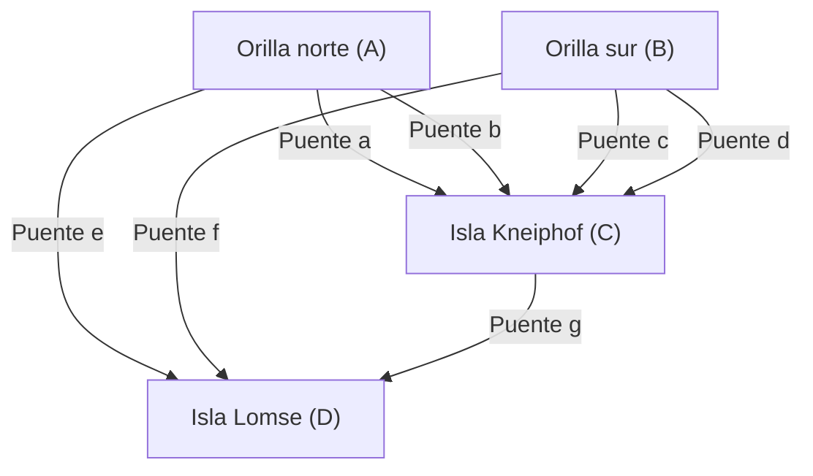

## Introducción

En la historia de las matemáticas, dudas triviales o juegos cotidianos a veces sirven como catalizadores para abrir áreas completamente nuevas de las matemáticas. Uno de los ejemplos más famosos y hermosos es el problema de los **"Siete Puentes de Königsberg"** ([Seven Bridges of Königsberg](https://kenji.blog/es/p/seven-bridges-of-konigsberg/)).

En el siglo XVIII, en la ciudad de Königsberg, en el Reino de Prusia (actualmente Kaliningrado, en la Federación Rusa), fluía un gran río llamado Pregel. Había siete puentes construidos para conectar las islas del río (islotes) y ambas orillas. Los ciudadanos de la época, durante sus paseos al atardecer, idearon el siguiente juego: "¿Sería posible cruzar los siete puentes de la ciudad, pasando por cada uno exactamente una vez, y regresar al punto de partida original?"

Cuando este problema, que a primera vista parecía un simple rompecabezas, llegó a manos del genio matemático **[Leonhard Euler](https://kenji.blog/es/p/euler/)**, se produjo una revolución en el mundo de las matemáticas. Euler no solo demostró que este problema era imposible, sino que en el proceso reinterpretó la naturaleza del espacio desde una perspectiva completamente nueva, sentando las bases de la **Teoría de grafos** ([Graph Theory](https://kenji.blog/es/p/graph-theory-dijkstra-a-star/)) y la **Topología** (Topology), dos campos extremadamente importantes en las matemáticas modernas.

En este artículo, profundizaremos en el contexto histórico del problema de los Siete Puentes de Königsberg, la brillante solución de Euler y cómo se conecta esto con la ciencia y la tecnología modernas, intercalando detalles matemáticos. No te limites a una simple introducción histórica; disfruta de la belleza de la estructura matemática que subyace en él.

## La ciudad de Königsberg y sus siete puentes: Contexto histórico

A principios del siglo XVIII, Königsberg era una próspera ciudad comercial a orillas del Mar Báltico y también un centro de aprendizaje. En el centro de la ciudad, el río Pregel fluía hacia el oeste, y en el río había dos grandes islas (islotes) llamadas Kneiphof y Lomse.

La estructura geográfica de la ciudad se dividía a grandes rasgos en las siguientes cuatro áreas de tierra firme:

- Tierra firme en la orilla norte (A)
- Tierra firme en la orilla sur (B)
- Isla Kneiphof (C)
- Isla Lomse, o la tierra firme del este (D)

Para conectar estas cuatro áreas de tierra firme, se construyeron un total de **siete puentes**.
Había 2 entre la orilla norte (A) y la isla (C), 2 entre la orilla sur (B) y la isla (C), 1 entre la orilla norte (A) y la isla (D), 1 entre la orilla sur (B) y la isla (D), y 1 entre las dos islas (C) y (D). Estos puentes eran infraestructuras esenciales en la vida de los ciudadanos y, al mismo tiempo, elementos importantes que formaban el hermoso paisaje urbano.

Los intelectuales y ciudadanos de Königsberg de la época, como paseo dominical por la tarde, intentaban encontrar una ruta para cruzar cada uno de estos siete puentes "exactamente una vez" y dar la vuelta a la ciudad. Sin embargo, por mucho que lo intentaran a través del ensayo y error, nadie tuvo éxito. Olvidaban cruzar algún puente o cruzaban el mismo puente dos veces. Pronto, se empezó a rumorear entre los ciudadanos que "tal ruta de paseo simplemente no existe", pero nadie podía demostrarlo matemáticamente.

## De un rompecabezas de puentes a un problema matemático: El sueño de Leibniz y la intuición de Euler

Este rumor entre los ciudadanos finalmente llegó a los oídos del gran matemático de origen suizo **[Leonhard Euler](https://kenji.blog/es/p/euler/)**, quien se encontraba en la Academia de Ciencias de San Petersburgo en Rusia. Fue en el año 1735.

Inicialmente, Euler sintió que este problema "no era matemáticas, sino un mero juego de lógica". La corriente principal de las matemáticas en ese momento era la geometría euclidiana (que se ocupaba de la longitud, el ángulo, el área, el volumen, etc.), el álgebra o el cálculo recién fundado por Newton y Leibniz. El problema de los puentes de Königsberg no dependía en absoluto de las propiedades geométricas tradicionales, como la longitud de los puentes, el área de las islas o el ángulo en el que los puentes cruzaban el río. Lo importante era únicamente la relación pura de **conexión**, es decir, "qué área de tierra estaba conectada con cuál, y mediante cuántos puentes".

Este era un tipo de problema geométrico completamente nuevo que no se podía abordar dentro del marco métrico de la geometría euclidiana de la época. Sin embargo, Euler gradualmente comenzó a darse cuenta de la profundidad de este problema. Reconoció que se trataba de un problema importante relacionado con la "Geometría de posición (Analysis Situs)" o "Geometría posicional (Geometria Situs)" con la que Gottfried Wilhelm Leibniz había soñado una vez, y decidió dedicarse seriamente a dilucidar este problema.

## La abstracción de Euler: Eliminando la información innecesaria

La manifestación más destacada de la genialidad de Euler radicaba en su extraordinaria capacidad de **abstracción** (Abstraction) para eliminar toda la información innecesaria del complejo mundo real y extraer solo la estructura esencial del problema.

Ignoró por completo la forma y el tamaño físicos de la tierra firme, la anchura del río, la velocidad de la corriente, el material y la longitud de los puentes, a partir del elaborado mapa real de Königsberg. Y creó un modelo matemático extremadamente simple y abstracto de la siguiente manera:

1. Representar las **áreas de tierra firme (islas y orillas)** simplemente como "puntos" sin tamaño. En la terminología moderna, esto se llama **vértice** (Vertex) o **nodo** (Node).
2. Representar los **puentes** como "líneas" que conectan los vértices. A esto se le llama **arista** (Edge) o **enlace** (Link). La curvatura y la longitud de la línea no importan.

De esta manera, una estructura discreta representada como un conjunto de un número finito de vértices y aristas que los conectan se llama **grafo** (Graph) en matemáticas. Este fue el momento exacto del nacimiento del campo que ahora llamamos "Teoría de grafos".

El siguiente diagrama de Mermaid muestra cómo el mapa geográfico de la ciudad de Königsberg se convirtió en una representación gráfica abstracta.

Gracias a esta poderosa abstracción, la pregunta cotidiana de los ciudadanos de "si existe una ruta que cruce los siete puentes de la ciudad una vez cada uno" se transformó por completo en un problema matemático puramente lógico y riguroso: "¿Existe un camino continuo (dibujo de un solo trazo) que atraviese todas las aristas de un grafo dado exactamente una vez?".

## El grado de los vértices y el teorema del dibujo de un solo trazo: La demostración de Euler

Después de formular el problema en forma de grafo, Euler descubrió una ley universal muy simple pero extremadamente poderosa. La clave de su demostración fue la introducción de un nuevo concepto llamado **grado** (Degree).

En la teoría de grafos, el **grado** de un vértice $v$ se denota como $d(v)$ o $\text{deg}(v)$, lo que significa "el número total de aristas directamente conectadas a ese vértice".

Euler consideró lógicamente qué tipo de restricción impone el acto de dibujar un "camino que atraviesa cada arista exactamente una vez (dibujo de un solo trazo)" en el grado de cada vértice.

Supongamos que existe un camino que dibuja todo el grafo pasando por cada arista exactamente una vez. En el proceso de seguir este camino, consideremos un vértice que actúa como un "punto de paso" (un vértice que no es ni el punto de partida ni el punto de destino final). Para que el camino "entre" en ese vértice, debe usar una arista, y para "salir" de ese vértice, debe usar otra arista.
En otras palabras, cada vez que se visita un vértice de paso, siempre se deben **consumir dos aristas en pares**.

Por lo tanto, en un vértice que solo se pasa por alto durante el trayecto, las aristas para entrar y salir de él siempre deben existir en pares, por lo que el número total de aristas conectadas a ese vértice (el grado) siempre debe ser un número **par** (Even).

Las únicas posibles excepciones son los vértices correspondientes al "punto de partida" y al "punto de destino final" del camino.

Aquí, los patrones de ruta se clasifican en los dos siguientes:

1. **Circuito euleriano (Eulerian Circuit)**: Cuando el punto de partida y el punto final son el mismo vértice.
   En este caso, la ruta da la vuelta completa y regresa al vértice original. Por lo tanto, **todos los vértices**, incluido el punto de partida = punto final, se tratan esencialmente igual que los "puntos de paso". Dado que las entradas y salidas están perfectamente emparejadas, **los grados de todos los vértices del grafo deben ser pares**.

2. **Camino euleriano (Eulerian Path)**: Cuando el punto de partida y el punto final son vértices diferentes.
   En este caso, se necesita una arista adicional para "salir primero" del punto de partida, y se necesita una arista adicional para "entrar al final" en el punto final. Por lo tanto, solo estos dos vértices (el punto de partida y el punto final) no tendrán pares completos de aristas, y tendrán un grado **impar** (Odd). Los grados de todos los demás puntos de paso deben ser pares.

Este es el teorema más fundamental y famoso de la teoría de grafos (el Teorema de Euler) rigurosamente demostrado por Euler.

Expresando este teorema de manera más rigurosa usando fórmulas matemáticas, en un grafo no dirigido conexo $G = (V, E)$:

- **Condición necesaria y suficiente para que exista un circuito euleriano (Eulerian Circuit)**:
  Para todos los vértices $v \in V$ del grafo $G$, su grado $d(v)$ es par.
  $\forall v \in V, \ d(v) \equiv 0 \pmod 2$

- **Condición necesaria y suficiente para que exista un camino euleriano (Eulerian Path)**:
  En el grafo $G$, existen "exactamente dos" vértices con grado impar.
  $|\{v \in V \mid d(v) \equiv 1 \pmod 2\}| = 2$

## Aplicación al grafo de Königsberg y conclusión

Ahora, apliquemos este hermoso y perfecto teorema deducido por el razonamiento deductivo de Euler al grafo real de los Siete Puentes de Königsberg.

Contemos los grados de cada una de las cuatro áreas de tierra abstractas (vértices $A, B, C, D$).

- Tierra firme en la orilla norte $A$: Hay 2 puentes construidos hacia la isla $C$ y 1 hacia la isla $D$. Por lo tanto, el grado es $d(A) = 3$ (impar).
- Tierra firme en la orilla sur $B$: Hay 2 puentes construidos hacia la isla $C$ y 1 hacia la isla $D$. Por lo tanto, el grado es $d(B) = 3$ (impar).
- Isla Lomse $D$: Hay 1 puente hacia la orilla $A$, 1 hacia la orilla $B$ y 1 hacia la isla $C$. Por lo tanto, el grado es $d(D) = 3$ (impar).
- Isla Kneiphof $C$: Hay 2 puentes hacia la orilla $A$, 2 hacia la orilla $B$ y 1 hacia la isla $D$. Por lo tanto, el grado es $d(C) = 5$ (impar).

Resumiendo los resultados, los grados de los 4 vértices que existen en el grafo de Königsberg son "3, 3, 3, 5". Sorprendentemente, **los grados de todos los vértices son impares**.

Según el teorema de Euler, para que sea posible un camino que pase por todas las aristas exactamente una vez (un dibujo de un solo trazo), el número de vértices de grado impar debe ser absolutamente "0" o "2". Sin embargo, en el grafo de Königsberg, hay hasta "4" vértices de grado impar.

Basándose en este hecho, Euler llegó a la siguiente conclusión final.
**"Definitivamente no existe una ruta para caminar cruzando todos los Siete Puentes de Königsberg exactamente una vez".**

Este fue un momento de extrema importancia en la historia de las matemáticas. Porque Euler no confirmó la imposibilidad caminando minuciosamente a través de un número casi infinito de posibles rutas de paseo una por una. Él demostró elegantemente que era imposible usando solo propiedades lógicas y universales puras: "la estructura del grafo" y "la paridad (ser par o impar)". Este enfoque deductivo es precisamente el verdadero valor de las matemáticas modernas.

## Desarrollo hacia la topología: El nacimiento de la geometría de posición

A través del problema de los puentes de Königsberg, Euler abrió el camino a un paradigma geométrico completamente nuevo, donde el objeto de estudio esencial es únicamente la "forma de conexión (continuidad y relaciones de conexión)" de figuras y espacios, sin depender en absoluto de las propiedades "métricas" tradicionales de la geometría euclidiana como la distancia, la longitud, el ángulo y el área.

Este es el amanecer del campo que más tarde se conocería como **Topología** (Topology). En la topología, se estudian "propiedades que no cambian incluso si se deforman continuamente (propiedades topológicas)". Hay una broma muy conocida que dice que "un topólogo es alguien que no puede distinguir entre una taza de café y una rosquilla". Ambos son "sólidos con un agujero", y dado que pueden transformarse el uno en el otro si se deforman continuamente como la arcilla sin cortarlos ni pegarlos, ambos se consideran de "la misma forma" en el mundo de la topología.

Lo mismo ocurre con el grafo de Königsberg. Incluso si estiras o encoges los puentes como bandas elásticas, o aplastas las islas, la esencia del grafo no cambia en absoluto mientras se mantengan las relaciones de conexión, es decir, "qué vértice está conectado a cuál". Lo que Euler notó fue precisamente esta propiedad topológica de "conexión invariante bajo deformación".

El propio Euler descubrió posteriormente, en 1750, una ley universal sorprendente con respecto al número de vértices ($V$), aristas ($E$) y caras ($F$) de un poliedro, conocida como la **fórmula del poliedro de Euler** ($V - E + F = 2$). Esto también captura un invariante topológico que no depende de la forma o el tamaño específicos del poliedro, lo que lo convierte en un hito de suma importancia en el desarrollo de la topología.

## Aplicación y expansión de la teoría de grafos en la sociedad moderna

La teoría de grafos y la topología, que nacieron de la pura investigación intelectual de un matemático del siglo XVIII, nunca se limitaron a estudios en una torre de marfil. Hoy en día han florecido como herramientas extremadamente prácticas e indispensables que sustentan la base de nuestra sociedad y tecnología altamente informatizadas.

### 1. Redes de computadoras e Internet
La estructura física y lógica de Internet que usamos a diario es exactamente un enorme grafo a escala mundial. Los enrutadores individuales, los servidores y las computadoras se convierten en vértices, y los cables de fibra óptica y las líneas de comunicación inalámbrica que los conectan se representan como aristas. Los protocolos de enrutamiento (por ejemplo, el algoritmo de [Dijkstra](https://kenji.blog/es/p/graph-theory-dijkstra-a-star/)) para entregar paquetes de datos a sus destinos de la manera más rápida y eficiente, evitando la congestión, están diseñados como algoritmos en la teoría de grafos.

### 2. Sistemas de navegación y optimización logística
La búsqueda de rutas en las aplicaciones de mapas de teléfonos inteligentes y los sistemas de navegación de automóviles realizan cálculos considerando las intersecciones y las uniones como vértices, y las carreteras como aristas. Esto no es otra cosa que el **problema del camino más corto** (Shortest Path Problem) en la teoría de grafos. Además, en las redes logísticas, el problema de determinar la ruta que visita múltiples destinos de entrega en el orden más eficiente se conoce como el **problema del viajante de comercio** (Traveling Salesman Problem).

### 3. Análisis de redes sociales (SNA)
El análisis de redes sociales, que ocupa una posición importante en las ciencias sociales modernas y la informática, también se basa en la teoría de grafos. Las relaciones humanas en redes sociales como X (anteriormente Twitter) o Facebook se modelan como un "grafo social" con los usuarios como vértices y las relaciones de seguimiento como aristas. Al analizar este grafo, es posible descubrir la estructura de las comunidades y construir modelos de cómo se difunde la información.

### 4. Ciencias de la vida: Biología, química, medicina
La teoría de grafos también está activa en varias escalas de las ciencias naturales. En química, al modelar estructuras moleculares, se usan grafos con los átomos como vértices y los enlaces químicos como aristas. En biología, para comprender interacciones complejas entre proteínas dentro de una célula como una red, o para comprender cómo se conectan y procesan la información numerosos neuronas en la ciencia del cerebro (análisis de conectomas), los poderosos métodos analíticos de la teoría de grafos son indispensables.

## Conclusión

En 1736, un solo artículo publicado por [Leonhard Euler](https://kenji.blog/es/p/euler/), "Solución de un problema relativo a la geometría de posición", dio una respuesta completa al inocente rompecabezas de los domingos de los ciudadanos de Königsberg. Sin embargo, lo que realmente significaba no era el final de un problema, sino el nacimiento de un vasto universo matemático con innumerables aplicaciones.

El **poder de la abstracción** para discernir claramente solo la estructura más esencial de "qué está conectado a qué y cómo", sin estar atado a la forma o tamaño superficial de las cosas. La historia de los Siete Puentes de Königsberg nos enseña a lo largo de los tiempos cómo el pensamiento matemático abstracto puede ser un arma poderosa para desentrañar el mundo real y crear la tecnología del futuro.

La próxima vez que camines por la ciudad, veas un puente sobre un río o mires un mapa del metro, reflexiona sobre la estructura de "conexiones" detrás de él. Allí, los hermosos hilos invisibles de las matemáticas, descubiertos por un matemático genial hace más de 280 años, aún se extienden para envolvernos hoy.
