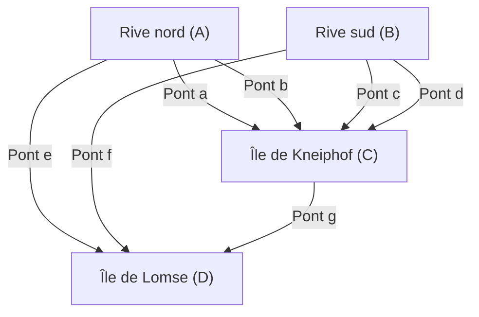

## Introduction

Dans l'histoire des mathématiques, des questions futiles ou des jeux du quotidien ont parfois été le point de départ de domaines mathématiques totalement nouveaux. L'un des exemples les plus célèbres et les plus beaux est le problème des **« sept ponts de Königsberg »** ([Seven Bridges of Königsberg](https://kenji.blog/fr/p/seven-bridges-of-konigsberg/)).

Au 18ème siècle, la ville de Königsberg dans le royaume de Prusse (aujourd'hui Kaliningrad, dans la Fédération de Russie), était traversée par un grand fleuve, la Pregolia (Pregel), où sept ponts avaient été construits pour relier les îles (bancs de sable) aux deux rives. Lors de leurs promenades au crépuscule, les habitants de l'époque ont imaginé le jeu suivant : « Est-il possible de se promener dans la ville en traversant chacun des sept ponts une et une seule fois, et de revenir à son point de départ ? »

Lorsque ce problème, qui semblait n'être qu'un simple casse-tête, est parvenu au mathématicien de génie **[Leonhard Euler](https://kenji.blog/fr/p/euler/)** (Leonhard Euler), une révolution s'est produite dans le monde des mathématiques. Euler a non seulement prouvé que ce problème était impossible, mais au cours de ce processus, il a redéfini la nature de l'espace sous une perspective totalement nouvelle, posant ainsi les bases de deux domaines extrêmement importants des mathématiques modernes : la **théorie des graphes** ([Graph Theory](https://kenji.blog/fr/p/graph-theory-dijkstra-a-star/)) et la **topologie** (Topology).

Dans cet article, nous explorerons en profondeur le contexte historique du problème des sept ponts de Königsberg, la brillante méthode de résolution d'Euler, et comment cela est lié aux sciences et technologies modernes, en incluant des détails mathématiques. Au-delà d'une simple introduction historique, profitez de la beauté de la structure mathématique qui se cache derrière ce problème.

## La ville de Königsberg et les sept ponts : Contexte historique

Au début du 18ème siècle, Königsberg était une ville commerciale prospère sur la mer Baltique, ainsi qu'un centre d'apprentissage. Au centre de la ville, le fleuve Pregolia (Pregel) s'écoulait vers l'ouest, abritant deux grandes îles (bancs de sable) appelées Kneiphof et Lomse.

La structure géographique de la ville était globalement divisée en quatre masses terrestres :

- La rive nord (A)
- La rive sud (B)
- L'île de Kneiphof (C)
- L'île de Lomse, ou la rive est (D)

Pour relier ces quatre masses terrestres, un total de **sept ponts** avait été construit.
Il y en avait 2 entre la rive nord (A) et l'île (C), 2 entre la rive sud (B) et l'île (C), 1 entre la rive nord (A) et l'île (D), 1 entre la rive sud (B) et l'île (D), et 1 entre les deux îles (C) et (D). Ces ponts étaient une infrastructure indispensable à la vie des citoyens, tout en constituant un élément majeur de la beauté du paysage urbain.

Les intellectuels et les citoyens de Königsberg de l'époque, lors de leurs promenades du dimanche après-midi, essayaient de trouver un itinéraire pour faire le tour de la ville en traversant chacun de ces sept ponts « exactement une fois ». Cependant, peu importe le nombre d'essais et d'erreurs, personne ne réussissait. Soit ils oubliaient de traverser un pont, soit ils traversaient le même pont deux fois. Bientôt, les citoyens commencèrent à chuchoter : « Un tel itinéraire n'existe peut-être tout simplement pas », mais personne ne pouvait le prouver mathématiquement.

## D'un puzzle de ponts à un problème mathématique : Le rêve de Leibniz et l'intuition d'Euler

Ces rumeurs parmi les citoyens parvinrent finalement aux oreilles de **[Leonhard Euler](https://kenji.blog/fr/p/euler/)**, le grand mathématicien d'origine suisse qui séjournait à l'Académie des sciences de Saint-Pétersbourg en Russie. C'était en 1735.

Au début, Euler semblait penser à propos de ce problème : « Ce n'est pas des mathématiques, mais juste un simple jeu de logique. » Le courant principal des mathématiques à l'époque était la géométrie euclidienne (qui traite de la longueur, de l'angle, de la surface, du volume, etc.), l'algèbre, ou le calcul différentiel et intégral nouvellement fondé par Newton et Leibniz. Le problème des ponts de Königsberg ne dépendait absolument d'aucune propriété géométrique traditionnelle, telle que la longueur des ponts en mètres, la surface des îles, ou l'angle auquel les ponts enjambaient le fleuve. Ce qui importait, c'était purement la relation de **connexion (connexité)** : « Quelle masse terrestre est reliée à quelle masse terrestre, et par combien de ponts ? »

Il s'agissait d'un type de problème géométrique totalement nouveau qui ne pouvait pas être traité dans le cadre métrique de la géométrie euclidienne de l'époque. Cependant, Euler commença progressivement à réaliser la profondeur de ce problème. Il reconnut qu'il s'agissait d'un problème important lié à l'« analyse de situation (Analysis Situs) » ou la « géométrie de position (Geometria Situs) » que Gottfried Wilhelm Leibniz (Gottfried Wilhelm Leibniz) avait autrefois rêvé, et décida de s'attaquer sérieusement à la résolution de ce problème.

## L'abstraction d'Euler : Éliminer les informations inutiles

La manifestation la plus remarquable du génie d'Euler résidait dans sa capacité exceptionnelle d'**abstraction** (Abstraction) : éliminer toutes les informations inutiles du monde réel complexe pour n'extraire que la structure essentielle du problème.

À partir de la carte détaillée du Königsberg réel, il a complètement ignoré la forme et la taille physiques des terres, la largeur de la rivière, la vitesse du courant, ainsi que les matériaux et la longueur des ponts. Il a ensuite créé le modèle mathématique suivant, extrêmement simple et abstrait :

1. Les **terres (îles et rives)** sont représentées comme de simples « points » sans dimension. C'est ce qu'on appelle aujourd'hui un **sommet** (Vertex) ou un **nœud** (Node).
2. Les **ponts** sont représentés comme des « lignes » reliant les sommets. C'est ce qu'on appelle une **arête** (Edge) ou un **lien** (Link). La courbure ou la longueur des lignes n'a pas d'importance.

Ainsi, une structure discrète représentée comme un ensemble fini de sommets et d'arêtes les reliant est appelée un **graphe** ([Graph](https://kenji.blog/fr/p/tree-graph-data-structures-search-dfs-bfs-dijkstra/)) en mathématiques. Ce fut le moment exact de la naissance de la discipline que nous appelons aujourd'hui la « théorie des graphes ».

Le diagramme Mermaid suivant montre comment la carte géographique de la ville de Königsberg a été transformée en une représentation graphique abstraite.

Grâce à cette puissante abstraction, la question quotidienne des citoyens « Existe-il un itinéraire pour traverser chacun des sept ponts de la ville une seule fois ? » a été complètement transformée en un problème mathématique purement logique et rigoureux : « Existe-t-il un chemin continu (un tracé continu) qui parcourt toutes les arêtes d'un graphe donné exactement une fois ? ».

## Le degré des sommets et le théorème du tracé : La preuve d'Euler

Après avoir formulé le problème sous forme de graphe, Euler a découvert une loi universelle très simple mais extrêmement puissante. La clé de cette preuve a été l'introduction du nouveau concept de **degré** (Degree).

Dans la théorie des graphes, le **degré** d'un sommet $v$ est noté $d(v)$ ou $\text{deg}(v)$, et cela signifie « le nombre total d'arêtes directement connectées à ce sommet ».

Euler a examiné de manière logique les contraintes que l'action de tracer un chemin qui « parcourt toutes les arêtes une seule fois (tracé continu) » sur le graphe imposerait au degré de chaque sommet.

Supposons qu'il existe un chemin qui dessine l'ensemble du graphe en passant par toutes les arêtes exactement une fois. En suivant ce chemin, considérons un sommet qui sert de « point de passage » (un sommet qui n'est ni le point de départ ni le point d'arrivée). Pour « entrer » dans ce sommet, le chemin doit utiliser une arête, et pour « sortir » de ce sommet, il doit utiliser une autre arête.
En d'autres termes, chaque fois que l'on visite un sommet servant de point de passage, on **consomme toujours deux arêtes en paire**.

Par conséquent, pour les sommets qui ne font que passer au cours du chemin, les arêtes pour y entrer et en sortir doivent nécessairement exister en paires, ce qui signifie que le nombre total d'arêtes connectées à ce sommet (le degré) doit toujours être **pair** (Even).

Les seules exceptions possibles sont les sommets qui correspondent au « point de départ » et au « point d'arrivée » du chemin.

Ici, les modèles de chemin peuvent être classés en deux catégories :

1. **Circuit eulérien (Eulerian Circuit)** : Lorsque le point de départ et le point d'arrivée sont le même sommet.
   Dans ce cas, le chemin fait un tour complet et revient au sommet initial. Par conséquent, **tous les sommets**, y compris le point de départ = point d'arrivée, sont pratiquement traités comme des « points de passage ». Puisque les entrées et sorties forment des paires parfaites, **le degré de tous les sommets du graphe doit être pair**.

2. **Chemin eulérien (Eulerian Path)** : Lorsque le point de départ et le point d'arrivée sont des sommets différents.
   Dans ce cas, une arête supplémentaire est nécessaire au point de départ pour « sortir en premier », et une arête supplémentaire est nécessaire au point d'arrivée pour « entrer en dernier ». Par conséquent, seuls les deux sommets du point de départ et du point d'arrivée n'auront pas de paires d'arêtes complètes et auront un degré **impair** (Odd). Tous les autres points de passage doivent avoir un degré pair.

Ceci est le théorème le plus fondamental et le plus célèbre de la théorie des graphes rigoureusement prouvé par Euler (le théorème d'Euler).

Si l'on exprime ce théorème plus rigoureusement à l'aide de formules mathématiques, dans un graphe non orienté connexe $G = (V, E)$ :

- **Condition nécessaire et suffisante pour l'existence d'un circuit eulérien (Eulerian Circuit)** :
  Pour chaque sommet $v \in V$ du graphe $G$, son degré $d(v)$ est pair.
  $\forall v \in V, \ d(v) \equiv 0 \pmod 2$

- **Condition nécessaire et suffisante pour l'existence d'un chemin eulérien (Eulerian Path)** :
  Dans le graphe $G$, il y a « exactement deux » sommets dont le degré est impair.
  $|\{v \in V \mid d(v) \equiv 1 \pmod 2\}| = 2$

## Application au graphe de Königsberg et conclusion

Appliquons maintenant ce théorème magnifiquement parfait, déduit par Euler grâce à un raisonnement déductif, au graphe réel des sept ponts de Königsberg.

Comptons les degrés de chacune des 4 masses terrestres abstraites (sommets $A, B, C, D$).

- Rive nord $A$ : 2 ponts la relient à l'île $C$, et 1 pont à l'île $D$. Par conséquent, son degré est $d(A) = 3$ (impair).
- Rive sud $B$ : 2 ponts la relient à l'île $C$, et 1 pont à l'île $D$. Par conséquent, son degré est $d(B) = 3$ (impair).
- Île de Lomse $D$ : 1 pont la relie à la rive $A$, 1 à la rive $B$, et 1 à l'île $C$. Par conséquent, son degré est $d(D) = 3$ (impair).
- Île de Kneiphof $C$ : 2 ponts la relient à la rive $A$, 2 à la rive $B$, et 1 à l'île $D$. Par conséquent, son degré est $d(C) = 5$ (impair).

En résumé, les degrés des 4 sommets présents dans le graphe de Königsberg sont « 3, 3, 3, 5 ». Étonnamment, **les degrés de tous les sommets sont impairs**.

Selon le théorème d'Euler, pour qu'un chemin traversant toutes les arêtes une seule fois (tracé continu) soit possible, le nombre de sommets de degré impair doit absolument être « 0 » ou « 2 ». Cependant, dans le graphe de Königsberg, il y a pas moins de « 4 » sommets de degré impair.

Sur la base de ce fait, Euler a tiré la conclusion finale suivante.
**« Il n'existe absolument aucun itinéraire permettant de se promener en traversant chacun des sept ponts de Königsberg une et une seule fois. »**

Ce fut un moment extrêmement important dans l'histoire des mathématiques. Car Euler n'a pas vérifié l'impossibilité en essayant de parcourir un par un le nombre quasi infini d'itinéraires de promenade imaginables. Il a élégamment prouvé que c'était impossible en utilisant uniquement les propriétés purement logiques et universelles de la « structure du graphe » et de la « parité ». C'est précisément cette approche déductive qui illustre l'essence des mathématiques modernes.

## Développement vers la topologie : Naissance de la géométrie de position

À travers le problème des ponts de Königsberg, Euler a ouvert le paradigme d'une géométrie complètement nouvelle, dont le sujet d'étude essentiel est uniquement la « façon dont les choses sont connectées » (continuité et connectivité) des figures et de l'espace, indépendamment des propriétés « métriques » de la géométrie euclidienne traditionnelle telles que la distance, la longueur, l'angle, et la surface.

C'était le début du domaine qui serait plus tard appelé **topologie** (Topology). En topologie, on étudie les « propriétés qui ne changent pas même lors de déformations continues (propriétés topologiques) ». Une blague bien connue dit qu'« un topologue est incapable de distinguer une tasse de café d'un beignet ». Les deux sont des « solides avec un trou » et peuvent être transformés l'un en l'autre par une déformation continue comme de l'argile, sans couper ni coller, de sorte que dans le monde de la topologie, ils sont considérés comme ayant « la même forme ».

Il en va de même pour le graphe de Königsberg. Même si les ponts sont étirés ou rétrécis comme des élastiques, ou si les îles sont déformées, l'essence du graphe reste complètement inchangée tant que la relation de connexion « quel sommet est connecté à quel sommet » est préservée. Ce sur quoi Euler s'est concentré, c'était précisément cette propriété topologique de « connexion invariante sous déformation ».

Plus tard, en 1750, Euler lui-même a découvert une loi universelle surprenante concernant le nombre de sommets ($V$), d'arêtes ($E$) et de faces ($F$) d'un polyèdre, connue sous le nom de **formule d'Euler pour les polyèdres** ($V - E + F = 2$). Cela aussi capture un invariant topologique qui ne dépend pas de la forme ou de la taille spécifique du polyèdre, et constitue un jalon extrêmement important dans le développement de la topologie.

## L'application et l'expansion de la théorie des graphes dans la société moderne

La théorie des graphes et la topologie, nées de l'exploration intellectuelle pure d'un mathématicien du 18ème siècle, ne sont jamais restées confinées dans la tour d'ivoire du monde universitaire. Elles s'épanouissent aujourd'hui comme des outils extrêmement pratiques et indispensables, soutenant fondamentalement notre société hautement informatisée et nos technologies.

### 1. Réseaux informatiques et Internet
La structure physique et logique d'Internet que nous utilisons tous les jours est elle-même un immense graphe à l'échelle mondiale. Chaque routeur, serveur et ordinateur est un sommet, et les fibres optiques et les lignes de communication sans fil qui les relient sont représentées comme des arêtes. Les protocoles de routage (par exemple, l'algorithme de [Dijkstra](https://kenji.blog/fr/p/graph-theory-dijkstra-a-star/)) pour acheminer les paquets de données vers leur destination le plus rapidement et le plus efficacement possible tout en évitant la congestion sont tous conçus comme des algorithmes basés sur la théorie des graphes.

### 2. Systèmes de navigation et optimisation logistique
La recherche d'itinéraire dans les applications de cartographie des smartphones et les systèmes de navigation automobile effectue des calculs en considérant les intersections et les bifurcations comme des sommets, et les routes comme des arêtes. Ce n'est autre que le **problème du plus court chemin** (Shortest Path Problem) de la théorie des graphes. De plus, le problème de déterminer l'itinéraire le plus efficace pour visiter de nombreuses destinations dans un réseau logistique est connu sous le nom de **problème du voyageur de commerce** (Traveling Salesman Problem).

### 3. Analyse des réseaux sociaux (SNA)
L'analyse des réseaux sociaux, qui occupe une place importante dans les sciences sociales et l'informatique modernes, repose également sur la théorie des graphes. Les relations humaines sur les réseaux sociaux tels que X (anciennement Twitter) et Facebook sont modélisées comme un « graphe social » avec les utilisateurs comme sommets et les relations de suivi comme arêtes. En analysant ce graphe, il devient possible de découvrir la structure des communautés ou de construire des modèles de la façon dont l'information se diffuse.

### 4. Sciences de la vie : Biologie, Chimie, Médecine
La théorie des graphes est également active à diverses échelles des sciences naturelles. En chimie, lors de la modélisation des structures moléculaires, un graphe est utilisé avec les atomes comme sommets et les liaisons chimiques comme arêtes. En biologie, les puissantes méthodes d'analyse de la théorie des graphes sont indispensables pour comprendre les interactions complexes entre les protéines au sein des cellules sous forme de réseaux, ou pour comprendre comment de nombreux neurones se connectent et traitent l'information dans les sciences du cerveau (analyse du connectome).

## Conclusion

L'article « Solution d'un problème relatif à la géométrie de position » publié par [Leonhard Euler](https://kenji.blog/fr/p/euler/) en 1736 a fourni une réponse complète au casse-tête trivial de promenade du dimanche des citoyens de Königsberg. Cependant, ce qu'il signifiait vraiment n'était pas la fin d'un problème, mais la naissance d'un vaste univers mathématique aux applications innombrables.

C'est la **force de l'abstraction** de percevoir avec perspicacité uniquement la structure la plus essentielle de « comment quoi est connecté à quoi », sans se laisser piéger par la forme superficielle ou la taille des choses. L'histoire des sept ponts de Königsberg nous enseigne, au-delà des époques, comment la pensée mathématique abstraite peut devenir une arme puissante pour démystifier le monde réel et créer les technologies de demain.

La prochaine fois que vous vous promènerez en ville et que vous verrez un pont sur une rivière, ou que vous regarderez le plan du métro, pensez à la structure des « connexions » qui se cache derrière. Là, les magnifiques fils invisibles des mathématiques, découverts par un mathématicien de génie il y a plus de 280 ans, sont encore tissés aujourd'hui pour nous envelopper dans les temps modernes.
