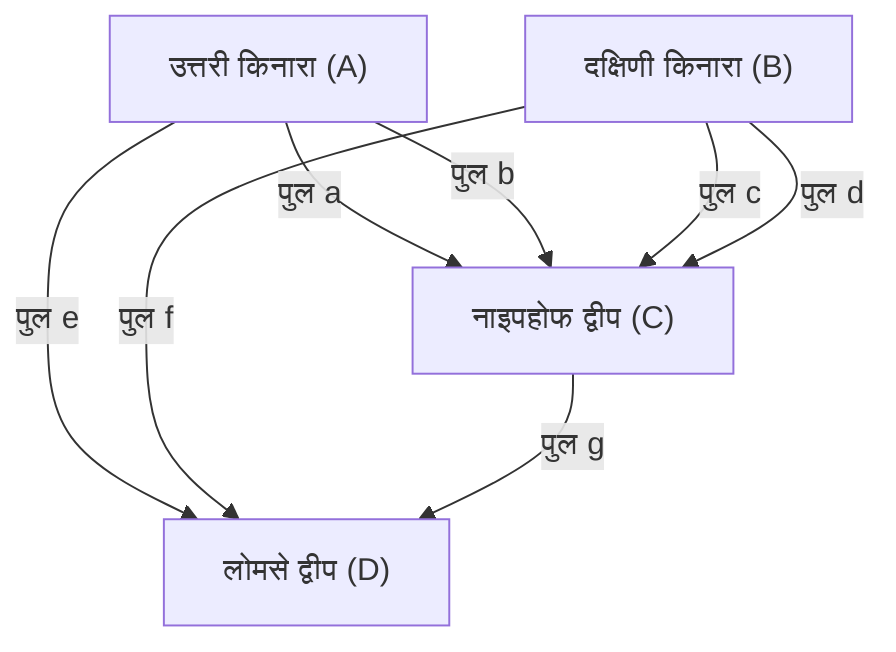

## प्रस्तावना

गणित के इतिहास में, रोज़मर्रा के छोटे-मोटे सवाल और खेल कभी-कभी गणित के बिल्कुल नए क्षेत्रों को खोलने का कारण बन जाते हैं। इसका सबसे प्रसिद्ध और सुंदर उदाहरणों में से एक है **"[कोनिग्सबर्ग के सात पुल](https://kenji.blog/hi/p/seven-bridges-of-konigsberg/)"** ([Seven Bridges of Königsberg](https://kenji.blog/hi/p/seven-bridges-of-konigsberg/)) की समस्या।

18वीं सदी में, प्रशिया साम्राज्य के शहर कोनिग्सबर्ग (वर्तमान रूस का कैलिनिनग्राद) में प्रेगेल नामक एक बड़ी नदी बहती थी, जिसके बीच के द्वीपों और दोनों किनारों को जोड़ने वाले सात पुल थे। उस समय के नागरिकों ने शाम की सैर के दौरान एक खेल सोचा: "क्या शहर के सात पुलों में से हर एक को ठीक एक बार पार करके शुरुआती बिंदु पर वापस आना संभव है?"

यह समस्या, जो पहली नज़र में सिर्फ एक पहेली लगती थी, जब प्रतिभाशाली गणितज्ञ **[लियोनहार्ड यूलर](https://kenji.blog/hi/p/euler/)** (Leonhard Euler) के हाथों में पहुँची, तो गणित की दुनिया में एक क्रांति आ गई। यूलर ने न केवल यह साबित किया कि यह समस्या असंभव है, बल्कि इस प्रक्रिया में अंतरिक्ष के गुणों को बिल्कुल नए दृष्टिकोण से फिर से परिभाषित किया, और **ग्राफ सिद्धांत** ([Graph Theory](https://kenji.blog/hi/p/graph-theory-dijkstra-a-star/)) और **टोपोलॉजी** (Topology) जैसे आधुनिक गणित के अत्यंत महत्वपूर्ण दो क्षेत्रों की नींव रखी।

इस लेख में, हम [कोनिग्सबर्ग के सात पुल](https://kenji.blog/hi/p/seven-bridges-of-konigsberg/)ों की समस्या की ऐतिहासिक पृष्ठभूमि, यूलर द्वारा इसके शानदार समाधान, और यह आधुनिक विज्ञान और प्रौद्योगिकी से कैसे जुड़ता है, इसकी गणितीय बारीकियों के साथ गहराई से पड़ताल करेंगे। केवल इतिहास के परिचय तक सीमित न रहकर, इसके पीछे छिपी गणितीय संरचना की सुंदरता का आनंद लें।

## कोनिग्सबर्ग शहर और सात पुल: ऐतिहासिक पृष्ठभूमि

18वीं सदी की शुरुआत में कोनिग्सबर्ग बाल्टिक सागर का सामना करने वाला एक समृद्ध वाणिज्यिक शहर और शिक्षा का केंद्र था। शहर के मध्य में प्रेगेल (Pregel) नदी पश्चिम की ओर बहती थी, और नदी के बीच में नाइपहोफ (Kneiphof) और लोमसे (Lomse) नामक दो बड़े द्वीप थे।

शहर की भौगोलिक संरचना को मोटे तौर पर निम्नलिखित चार भूमि क्षेत्रों में विभाजित किया गया था:

- उत्तरी किनारे की भूमि (A)
- दक्षिणी किनारे की भूमि (B)
- नाइपहोफ द्वीप (C)
- लोमसे द्वीप, या पूर्वी भूमि (D)

इन चार भूमि क्षेत्रों को जोड़ने के लिए, कुल मिलाकर **सात पुल** बनाए गए थे।
उत्तरी किनारे (A) और द्वीप (C) के बीच 2, दक्षिणी किनारे (B) और द्वीप (C) के बीच 2, उत्तरी किनारे (A) और द्वीप (D) के बीच 1, दक्षिणी किनारे (B) और द्वीप (D) के बीच 1, और दो द्वीपों (C) और (D) के बीच 1 पुल था। ये पुल नागरिकों के जीवन के लिए आवश्यक बुनियादी ढाँचे थे, और साथ ही सुंदर शहर के दृश्य का एक महत्वपूर्ण हिस्सा भी थे।

उस समय के कोनिग्सबर्ग के बुद्धिजीवियों और नागरिकों ने अपनी छुट्टी की दोपहर की सैर के दौरान इन सात पुलों में से प्रत्येक को "ठीक एक बार" पार करके शहर के चारों ओर एक रास्ता खोजने की कोशिश की। हालाँकि, कितनी भी कोशिश कर लें, कोई भी इसमें सफल नहीं हो सका। या तो वे किसी पुल को पार करना भूल जाते थे, या एक ही पुल को दो बार पार कर लेते थे। जल्द ही नागरिकों के बीच यह कानाफूसी होने लगी कि "शायद ऐसा कोई रास्ता मौजूद ही नहीं है", लेकिन कोई भी इसे गणितीय रूप से साबित नहीं कर सका।

## पुल पार करने की पहेली से गणित की समस्या तक: लाइबनिट्स का सपना और यूलर की अंतर्दृष्टि

नागरिकों की यह अफवाह अंततः रूस में सेंट पीटर्सबर्ग विज्ञान अकादमी में रह रहे स्विट्जरलैंड के महान गणितज्ञ, **[लियोनहार्ड यूलर](https://kenji.blog/hi/p/euler/)** तक पहुँची। यह 1735 की बात है।

शुरुआत में, यूलर ने इस समस्या के बारे में सोचा कि "यह गणित नहीं है, बल्कि केवल एक तार्किक खेल है।" उस समय गणित की मुख्यधारा [यूक्लिड](https://kenji.blog/hi/p/euclid/)ियन ज्यामिति (लंबाई, कोण, क्षेत्रफल, आयतन आदि को संभालना) या बीजगणित, या न्यूटन और लाइबनिट्स द्वारा अभी-अभी स्थापित किया गया कैलकुलस था। कोनिग्सबर्ग के पुलों की समस्या पुल की लंबाई कितने मीटर है, द्वीपों का क्षेत्रफल कितना है, या पुल नदी के किस कोण पर बने हैं जैसी पारंपरिक ज्यामितीय गुणों पर बिल्कुल निर्भर नहीं करती है। जो महत्वपूर्ण था, वह पूरी तरह से शुद्ध **कनेक्शन (संयोजन)** संबंध था कि "कौन सी भूमि किस भूमि से कितने पुलों द्वारा जुड़ी हुई है।"

यह एक पूरी तरह से नए प्रकार की ज्यामितीय समस्या थी जिसे उस समय के [यूक्लिड](https://kenji.blog/hi/p/euclid/)ियन ज्यामिति के मात्रात्मक ढांचे में नहीं संभाला जा सकता था। हालाँकि, यूलर को धीरे-धीरे इस समस्या की गहराई का एहसास होने लगा। उन्होंने पहचाना कि यह "स्थिति के विश्लेषण" (Analysis Situs) या "स्थिति की ज्यामिति" (Geometria Situs) से संबंधित एक महत्वपूर्ण समस्या थी, जिसका सपना कभी गॉटफ्राइड विल्हेम लाइबनिट्स (Gottfried Wilhelm Leibniz) ने देखा था, और उन्होंने इस समस्या को हल करने पर गंभीरता से काम करने का फैसला किया।

## यूलर का अमूर्तीकरण: अनावश्यक जानकारी को हटाना

यूलर की प्रतिभा का सबसे स्पष्ट प्रकटीकरण जटिल वास्तविक दुनिया से सभी अनावश्यक जानकारी को हटाने और केवल समस्या की आवश्यक संरचना को निकालने की उनकी **अमूर्तीकरण** (Abstraction) की उत्कृष्ट क्षमता में था।

उन्होंने कोनिग्सबर्ग के यथार्थवादी, विस्तृत मानचित्र से भूमि के भौतिक आकार और आकार, नदी की चौड़ाई और पानी के प्रवाह की गति, और पुलों की सामग्री और लंबाई को पूरी तरह से अनदेखा कर दिया। और उन्होंने निम्नलिखित अत्यंत सरल और अमूर्त गणितीय मॉडल बनाया:

1. **भूमि (द्वीप या किनारे)** को बिना आकार वाले एक साधारण "बिंदु" के रूप में दर्शाएं। आधुनिक शब्दावली में इसे **शीर्ष** (Vertex) या **नोड** (Node) कहा जाता है।
2. **पुल** को शीर्षों को जोड़ने वाली "रेखा" के रूप में दर्शाएं। इसे **किनारा** (Edge) या **लिंक** (Link) कहा जाता है। रेखा की वक्रता या लंबाई कोई मायने नहीं रखती।

इस प्रकार, गणित में, परिमित संख्या में शीर्षों और उन्हें जोड़ने वाले किनारों के एक सेट के रूप में व्यक्त की गई असतत संरचना को **ग्राफ** ([Graph](https://kenji.blog/hi/p/tree-graph-data-structures-search-dfs-bfs-dijkstra/)) कहा जाता है। यह ठीक उसी क्षेत्र के जन्म का क्षण था जिसे अब हम "ग्राफ सिद्धांत" कहते हैं।

नीचे दिया गया Mermaid आरेख दिखाता है कि कैसे कोनिग्सबर्ग शहर के भौगोलिक मानचित्र को एक अमूर्त ग्राफ प्रतिनिधित्व में बदल दिया गया था।

इस शक्तिशाली अमूर्तीकरण के साथ, "क्या शहर के सात पुलों को एक बार पार करने का कोई रास्ता है?" यह नागरिकों का रोज़मर्रा का सवाल, "क्या किसी दिए गए ग्राफ के सभी किनारों को ठीक एक बार पार करने वाला कोई निरंतर मार्ग (एक स्ट्रोक) मौजूद है?" इस शुद्ध तार्किक और कठोर गणितीय समस्या में बदल गया था।

## शीर्षों की डिग्री और एक स्ट्रोक का प्रमेय: यूलर का प्रमाण

समस्या को एक ग्राफ के रूप में तैयार करने के बाद, यूलर ने एक बहुत ही सरल लेकिन अत्यंत शक्तिशाली सार्वभौमिक नियम की खोज की। उनके प्रमाण की कुंजी **डिग्री** (Degree) की नई अवधारणा का परिचय था।

ग्राफ सिद्धांत में, एक शीर्ष $v$ की **डिग्री** को $d(v)$ या $\text{deg}(v)$ के रूप में लिखा जाता है, और इसका अर्थ है "उस शीर्ष से सीधे जुड़े किनारों की कुल संख्या।"

यूलर ने तार्किक रूप से विचार किया कि ग्राफ पर "एक ऐसा मार्ग खींचना जो सभी किनारों से एक-एक बार होकर गुज़रता है (एक स्ट्रोक)" प्रत्येक शीर्ष की डिग्री पर क्या प्रतिबंध लगाता है।

मान लीजिए कि ऐसा कोई मार्ग मौजूद है जो सभी किनारों को ठीक एक बार पार करके पूरे ग्राफ को खींचता है। इस मार्ग का अनुसरण करने की प्रक्रिया में, आइए हम एक "पारगमन बिंदु" (प्रारंभिक या अंतिम बिंदु नहीं) वाले शीर्ष पर विचार करें। उस शीर्ष में "प्रवेश" करने के लिए मार्ग को 1 किनारे का उपयोग करना चाहिए, और उस शीर्ष से "बाहर निकलने" के लिए दूसरे 1 किनारे का उपयोग करना चाहिए।
दूसरे शब्दों में, हर बार जब आप किसी पारगमन शीर्ष पर जाते हैं, तो आप हमेशा **जोड़े में 2 किनारों की खपत करेंगे** ।

इसलिए, चूँकि मार्ग के बीच में केवल गुजरने वाले शीर्षों में हमेशा प्रवेश करने और बाहर निकलने के लिए जोड़े में किनारे होने चाहिए, उस शीर्ष से जुड़े किनारों की कुल संख्या (डिग्री) हमेशा **सम** (Even) होनी चाहिए।

एकमात्र संभावित अपवाद मार्ग के "शुरुआती बिंदु" और "अंतिम बिंदु" के अनुरूप शीर्ष हैं।

यहाँ, मार्ग के पैटर्न को निम्नलिखित दो में वर्गीकृत किया गया है:

1. **यूलरियन सर्किट (Eulerian Circuit)** : जब शुरुआती और अंतिम बिंदु एक ही शीर्ष हों।
   इस मामले में, मार्ग एक पूर्ण चक्र बनाता है और मूल शीर्ष पर लौट आता है। इसलिए, शुरुआती बिंदु = अंतिम बिंदु सहित **सभी शीर्षों** को प्रभावी रूप से "पारगमन बिंदुओं" के समान ही माना जाता है। चूँकि प्रवेश और निकास पूरी तरह से जोड़े में हैं, **ग्राफ में सभी शीर्षों की डिग्री सम होनी चाहिए** ।

2. **यूलरियन पथ (Eulerian Path)** : जब शुरुआती और अंतिम बिंदु अलग-अलग शीर्ष हों।
   इस मामले में, शुरुआती बिंदु को "पहली बार बाहर निकलने" के लिए 1 अतिरिक्त किनारे की आवश्यकता होती है, और अंतिम बिंदु को "आखिरी बार प्रवेश करने" के लिए 1 अतिरिक्त किनारे की आवश्यकता होती है। इसलिए, केवल शुरुआती और अंतिम बिंदुओं के 2 शीर्ष किनारे के जोड़े को पूरा नहीं करते हैं, और उनकी डिग्री **विषम** (Odd) होगी। अन्य सभी पारगमन बिंदुओं की डिग्री सम होनी चाहिए।

यह ग्राफ सिद्धांत में सबसे बुनियादी और प्रसिद्ध प्रमेय (यूलर का प्रमेय) है जिसे यूलर ने कड़ाई से साबित किया था।

गणितीय सूत्रों का उपयोग करके इस प्रमेय को अधिक कड़ाई से व्यक्त करने के लिए, एक जुड़े हुए अप्रत्यक्ष ग्राफ $G = (V, E)$ में:

- **यूलरियन सर्किट (Eulerian Circuit) के अस्तित्व के लिए आवश्यक और पर्याप्त शर्तें** :
  ग्राफ $G$ के सभी शीर्षों $v \in V$ के लिए, उनकी डिग्री $d(v)$ सम है।
  $\forall v \in V, \ d(v) \equiv 0 \pmod 2$

- **यूलरियन पथ (Eulerian Path) के अस्तित्व के लिए आवश्यक और पर्याप्त शर्तें** :
  ग्राफ $G$ में, विषम डिग्री वाले ठीक "दो" शीर्ष मौजूद हैं।
  $|\{v \in V \mid d(v) \equiv 1 \pmod 2\}| = 2$

## कोनिग्सबर्ग के ग्राफ पर अनुप्रयोग और निष्कर्ष

अब, आइए यूलर द्वारा निगमनात्मक तर्क के माध्यम से निकाले गए इस सुंदर और पूर्ण प्रमेय को [कोनिग्सबर्ग के सात पुल](https://kenji.blog/hi/p/seven-bridges-of-konigsberg/)ों के वास्तविक ग्राफ पर लागू करें।

हम चार अमूर्त भूमि (शीर्ष $A, B, C, D$) में से प्रत्येक की डिग्री गिनते हैं।

- उत्तरी किनारे की भूमि $A$: द्वीप $C$ के लिए 2 पुल और द्वीप $D$ के लिए 1 पुल हैं। इसलिए, डिग्री $d(A) = 3$ (विषम) है।
- दक्षिणी किनारे की भूमि $B$: द्वीप $C$ के लिए 2 पुल और द्वीप $D$ के लिए 1 पुल हैं। इसलिए, डिग्री $d(B) = 3$ (विषम) है।
- लोमसे द्वीप $D$: किनारे $A$ के लिए 1, किनारे $B$ के लिए 1 और द्वीप $C$ के लिए 1 पुल है। इसलिए, डिग्री $d(D) = 3$ (विषम) है।
- नाइपहोफ द्वीप $C$: किनारे $A$ के लिए 2, किनारे $B$ के लिए 2 और द्वीप $D$ के लिए 1 पुल है। इसलिए, डिग्री $d(C) = 5$ (विषम) है।

परिणामों को संक्षेप में कहें तो, कोनिग्सबर्ग के ग्राफ में चार शीर्षों की डिग्री "3, 3, 3, 5" है। आश्चर्यजनक रूप से, **सभी शीर्षों की डिग्री विषम है** ।

यूलर के प्रमेय के अनुसार, एक ऐसे मार्ग के लिए जो सभी किनारों को एक बार पार करता है (एक स्ट्रोक) संभव होने के लिए, विषम डिग्री वाले शीर्षों की संख्या बिल्कुल "0" या "2" होनी चाहिए। हालाँकि, कोनिग्सबर्ग ग्राफ में विषम डिग्री वाले "4" शीर्ष हैं।

इस तथ्य के आधार पर यूलर ने अंतिम निष्कर्ष निकाला:
**"कोनिग्सबर्ग के सभी सात पुलों को एक-एक बार पार करने वाला मार्ग बिल्कुल मौजूद नहीं है।"**

गणित के इतिहास में यह एक अत्यंत महत्वपूर्ण क्षण था। ऐसा इसलिए है क्योंकि यूलर ने असीमित संख्या में संभव चलने वाले मार्गों में से प्रत्येक को चलकर यह जाँच नहीं की कि यह असंभव था। उन्होंने केवल "ग्राफ की संरचना" और "पैरिटी (सम-विषम)" के विशुद्ध रूप से तार्किक और सार्वभौमिक गुणों का उपयोग करके सुरुचिपूर्ण ढंग से असंभवता को साबित किया। इस निगमनात्मक दृष्टिकोण को आधुनिक गणित का सच्चा सार कहा जा सकता है।

## टोपोलॉजी का विकास: स्थिति की ज्यामिति का जन्म

कोनिग्सबर्ग के पुल की समस्या के माध्यम से, यूलर ने पूरी तरह से नए ज्यामितीय प्रतिमान को खोल दिया, जिसमें दूरी, लंबाई, कोण और क्षेत्र जैसे पारंपरिक [यूक्लिड](https://kenji.blog/hi/p/euclid/)ियन "मात्रात्मक" गुणों पर बिल्कुल भी निर्भर किए बिना आकृतियों और रिक्त स्थानों के "कनेक्शन (निरंतरता और कनेक्शन संबंध)" को आवश्यक शोध विषय माना जाता है।

यह उस क्षेत्र की शुरुआत थी जिसे बाद में **टोपोलॉजी** (Topology) के रूप में जाना जाएगा। टोपोलॉजी में, "ऐसे गुणों का अध्ययन किया जाता है जो निरंतर विरूपण (टोपोलॉजिकल गुण) के तहत नहीं बदलते हैं।" एक प्रसिद्ध चुटकुला है कि "एक टोपोलॉजिस्ट एक कॉफी कप और एक डोनट के बीच का अंतर नहीं बता सकता है।" दोनों "एक छेद वाले ठोस" हैं, और चूंकि वे काटे या चिपकाए बिना मिट्टी की तरह लगातार विकृत होने पर एक दूसरे में बदल सकते हैं, टोपोलॉजी की दुनिया में उन्हें "समान आकार" माना जाता है।

यही बात कोनिग्सबर्ग ग्राफ पर भी लागू होती है। भले ही पुल रबर बैंड की तरह फैले या सिकुड़े हों, या द्वीप विकृत हों, जब तक यह संबंध बना रहता है कि "कौन सा शीर्ष किस शीर्ष से जुड़ा है," ग्राफ का सार बिल्कुल नहीं बदलता है। यूलर ने इस टोपोलॉजिकल संपत्ति पर ध्यान केंद्रित किया, जिसे "कनेक्शन जो विरूपण के तहत अपरिवर्तनीय हैं" कहा जाता है।

यूलर ने स्वयं 1750 में पॉलीहेड्रा के शीर्षों ($V$), किनारों ($E$), और चेहरों ($F$) की संख्या के संबंध में एक आश्चर्यजनक सार्वभौमिक नियम की खोज की, जिसे **यूलर का पॉलीहेड्रॉन फॉर्मूला** ($V - E + F = 2$) के रूप में जाना जाता है। यह भी, टोपोलॉजिकल इनवेरिएंट्स को कैप्चर करता है जो पॉलीहेड्रॉन के विशिष्ट आकार और आकार पर निर्भर नहीं करते हैं, और टोपोलॉजी के विकास में एक अत्यंत महत्वपूर्ण मील का पत्थर है।

## आधुनिक समाज में ग्राफ सिद्धांत का अनुप्रयोग और प्रसार

18वीं सदी के गणितज्ञों की शुद्ध बौद्धिक खोज से पैदा हुआ ग्राफ सिद्धांत और टोपोलॉजी, कभी भी हाथीदांत के टॉवर के भीतर एक अकादमिक अनुशासन तक सीमित नहीं रहा। आज, वे अत्यंत व्यावहारिक और आवश्यक उपकरणों के रूप में फले-फूले हैं जो हमारे अत्यधिक सूचना-आधारित समाज और प्रौद्योगिकी की नींव को रेखांकित करते हैं।

### 1. कंप्यूटर नेटवर्क और इंटरनेट
हम हर दिन जिस इंटरनेट का उपयोग करते हैं उसकी भौतिक और तार्किक संरचना वास्तव में एक विशाल वैश्विक ग्राफ है। व्यक्तिगत राउटर, सर्वर और कंप्यूटर शीर्ष हैं, और उन्हें जोड़ने वाले ऑप्टिकल फाइबर और वायरलेस संचार लाइनें किनारों के रूप में दर्शाई गई हैं। भीड़भाड़ से बचते हुए डेटा पैकेट को उनके गंतव्य तक सबसे तेज़ और सबसे कुशल तरीके से पहुँचाने के लिए रूटिंग प्रोटोकॉल (जैसे, दिज्क्स्ट्रा का एल्गोरिथम) सभी को ग्राफ सिद्धांत एल्गोरिदम के रूप में डिज़ाइन किया गया है।

### 2. नेविगेशन सिस्टम और लॉजिस्टिक्स अनुकूलन
स्मार्टफ़ोन मैप ऐप्स और कार नेविगेशन सिस्टम में रूट सर्च चौराहों और जंक्शनों को शीर्ष और सड़कों को किनारों के रूप में मानकर गणना करते हैं। यह ग्राफ सिद्धांत में **सबसे छोटा पथ समस्या** (Shortest Path Problem) से कम नहीं है। साथ ही, रसद नेटवर्क में सबसे कुशल क्रम में कई डिलीवरी गंतव्यों का दौरा करने वाले मार्ग को निर्धारित करने की समस्या को **ट्रैवलिंग सेल्समैन समस्या** (Traveling Salesman Problem) के रूप में जाना जाता है।

### 3. सामाजिक नेटवर्क विश्लेषण (SNA)
सामाजिक नेटवर्क विश्लेषण, जो आधुनिक सामाजिक विज्ञान और सूचना विज्ञान में एक महत्वपूर्ण स्थान रखता है, ग्राफ सिद्धांत पर भी आधारित है। X (पूर्व में Twitter) और Facebook जैसे SNS पर मानवीय संबंधों को "सोशल ग्राफ़" के रूप में तैयार किया जाता है, जहाँ उपयोगकर्ता शीर्ष होते हैं और फॉलोइंग संबंध किनारे होते हैं। इस ग्राफ का विश्लेषण करके, समुदाय की संरचना की खोज करना और जानकारी कैसे फैलती है, इसका एक मॉडल बनाना संभव हो जाता है।

### 4. जीवन विज्ञान: जीव विज्ञान, रसायन विज्ञान, चिकित्सा
प्राकृतिक विज्ञानों के विभिन्न पैमानों पर ग्राफ सिद्धांत भी सक्रिय है। रसायन विज्ञान में, आणविक संरचनाओं को मॉडल करते समय, एक ग्राफ का उपयोग किया जाता है जिसमें परमाणु शीर्ष होते हैं और रासायनिक बंधन किनारे होते हैं। जीव विज्ञान में, कोशिकाओं के भीतर प्रोटीन के बीच जटिल अंतःक्रियाओं को एक नेटवर्क के रूप में समझने के लिए, और मस्तिष्क विज्ञान में यह समझने के लिए कि कई न्यूरॉन्स सूचना को संसाधित करने के लिए कैसे जुड़ते हैं (कनेक्टोम विश्लेषण), ग्राफ सिद्धांत के शक्तिशाली विश्लेषण के तरीके आवश्यक हो गए हैं।

## निष्कर्ष

1736 में, [लियोनहार्ड यूलर](https://kenji.blog/hi/p/euler/) द्वारा प्रकाशित एक पेपर, "स्थिति की ज्यामिति से संबंधित समस्याओं का समाधान", ने कोनिग्सबर्ग के नागरिकों की छुट्टी की सैर की पहेली का एक आदर्श उत्तर प्रदान किया। हालाँकि, इसका वास्तव में क्या अर्थ था, वह किसी एक समस्या का अंत नहीं था, बल्कि अनगिनत अनुप्रयोगों वाले एक विशाल गणितीय ब्रह्मांड का जन्म था।

चीजों के सतही आकार और आकार से बंधे बिना "क्या और कैसे जुड़ा है" की केवल सबसे आवश्यक संरचना को तेज दृष्टि से देखने की **अमूर्तीकरण की शक्ति** । [कोनिग्सबर्ग के सात पुल](https://kenji.blog/hi/p/seven-bridges-of-konigsberg/)ों की कहानी हमें समय-समय पर सिखाती है कि कैसे अमूर्त गणितीय सोच वास्तविक दुनिया के रहस्यों को सुलझाने और भविष्य की तकनीक बनाने के लिए एक शक्तिशाली हथियार बन सकती है।

यदि आप अगली बार शहर में चलते हैं, तो नदी पर एक पुल देखते हैं, या सबवे रूट मैप को देखते हैं, तो कृपया इसके पीछे "कनेक्शन" संरचना के बारे में सोचें। वहां, 280 से अधिक साल पहले एक प्रतिभाशाली गणितज्ञ द्वारा खोजे गए अदृश्य गणितीय धागे आज भी हम आधुनिक लोगों को लपेटते हुए फैले हुए हैं。
