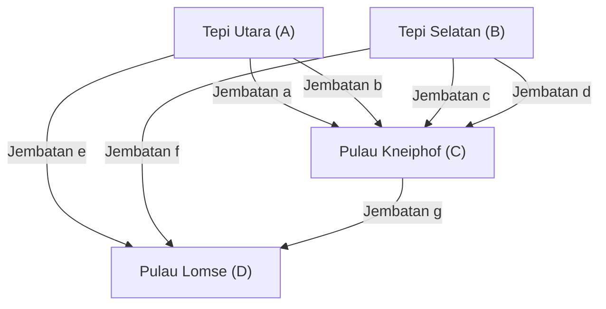

## Pendahuluan

Dalam sejarah matematika, pertanyaan kecil atau permainan sehari-hari terkadang bisa menjadi pemicu yang membuka bidang matematika yang sama sekali baru. Salah satu contoh paling terkenal dan indah dari hal ini adalah masalah **"[Tujuh Jembatan Königsberg](https://kenji.blog/id/p/seven-bridges-of-konigsberg/)"** ([Seven Bridges of Königsberg](https://kenji.blog/id/p/seven-bridges-of-konigsberg/)).

Pada abad ke-18, di kota Königsberg di Kerajaan Prusia (sekarang Kaliningrad, Federasi Rusia), mengalir sungai besar yang disebut Sungai Pregel, dengan tujuh jembatan yang menghubungkan pulau di tengah sungai dan kedua tepinya. Penduduk kota pada masa itu memikirkan permainan berikut saat mereka berjalan-jalan di sore hari: "Mungkinkah kita berjalan melintasi ketujuh jembatan di kota masing-masing tepat satu kali, lalu kembali ke titik awal?"

Ketika masalah yang sekilas tampak seperti teka-teki sederhana ini jatuh ke tangan matematikawan jenius **[Leonhard Euler](https://kenji.blog/id/p/euler/)**, revolusi terjadi di dunia matematika. Euler tidak hanya membuktikan bahwa masalah ini mustahil, tetapi dalam prosesnya ia juga mendefinisikan ulang sifat-sifat ruang dari perspektif yang sama sekali baru, meletakkan dasar bagi dua bidang yang sangat penting dalam matematika modern: **Teori Graf** ([Graph Theory](https://kenji.blog/id/p/graph-theory-dijkstra-a-star/)) dan **Topologi** (Topology).

Dalam artikel ini, kita akan menggali lebih dalam tentang latar belakang sejarah masalah [Tujuh Jembatan Königsberg](https://kenji.blog/id/p/seven-bridges-of-konigsberg/), solusi brilian Euler, dan bagaimana hal tersebut terhubung dengan ilmu pengetahuan dan teknologi modern, beserta rincian matematisnya. Jangan hanya berhenti pada pengenalan sejarah, tetapi nikmatilah keindahan struktur matematis di baliknya.

## Kota Königsberg dan Tujuh Jembatan: Latar Belakang Sejarah

Pada awal abad ke-18, Königsberg adalah kota komersial yang makmur di tepi Laut Baltik dan pusat pembelajaran. Sungai Pregel mengalir ke barat melalui pusat kota, dengan dua pulau besar di tengahnya yang disebut Kneiphof dan Lomse.

Secara garis besar, struktur geografis kota ini dibagi menjadi empat daratan berikut:

- Daratan tepi utara (A)
- Daratan tepi selatan (B)
- Pulau Kneiphof (C)
- Pulau Lomse, atau daratan timur (D)

Total ada **tujuh jembatan** yang dibangun untuk menghubungkan keempat daratan ini.
Dua antara tepi utara (A) dan pulau (C), dua antara tepi selatan (B) dan pulau (C), satu antara tepi utara (A) dan pulau (D), satu antara tepi selatan (B) dan pulau (D), serta satu antara kedua pulau (C) dan (D). Jembatan-jembatan ini bukan hanya infrastruktur yang penting bagi kehidupan warga, tetapi juga elemen penting yang memperindah pemandangan kota.

Para cendekiawan dan penduduk Königsberg pada masa itu, sebagai hiburan saat jalan-jalan sore di hari libur, mencoba menemukan rute untuk mengelilingi kota dengan melintasi ketujuh jembatan ini "tepat satu kali" masing-masing. Namun, tidak peduli berapa banyak percobaan yang mereka lakukan, tidak ada satupun yang berhasil. Entah mereka lupa melintasi satu jembatan, atau mereka melintasi jembatan yang sama dua kali. Akhirnya, mulai muncul rumor di kalangan warga bahwa "jangan-jangan rute perjalanan seperti itu memang tidak ada sejak awal," namun tak seorang pun yang mampu membuktikannya secara matematis.

## Dari Teka-Teki Jembatan Menjadi Masalah Matematika: Impian Leibniz dan Intuisi Euler

Rumor dari warga kota ini akhirnya sampai ke telinga matematikawan besar asal Swiss, **[Leonhard Euler](https://kenji.blog/id/p/euler/)**, yang saat itu tinggal di Akademi Ilmu Pengetahuan Saint Petersburg di Rusia. Hal itu terjadi pada tahun 1735.

Pada awalnya, Euler sepertinya merasa bahwa masalah ini "bukanlah matematika, melainkan hanya permainan logika belaka." Arus utama matematika pada waktu itu adalah geometri [Euclide](https://kenji.blog/p/euclid/)an (yang membahas panjang, sudut, luas, volume, dll.), aljabar, atau kalkulus yang baru saja diciptakan oleh Newton dan Leibniz. Masalah jembatan Königsberg sama sekali tidak bergantung pada sifat-sifat geometris tradisional seperti berapa meter panjang jembatan, seberapa besar luas pulau-pulau itu, atau pada sudut berapa jembatan itu dibangun terhadap sungai. Yang penting hanyalah relasi **koneksi** (hubungan) murni, yaitu "daratan mana yang terhubung dengan daratan mana, dan oleh berapa banyak jembatan."

Ini adalah jenis masalah geometris yang sama sekali baru, yang tidak dapat ditangani dalam kerangka pengukuran geometri [Euclide](https://kenji.blog/p/euclid/)an saat itu. Namun, Euler secara bertahap mulai menyadari kedalaman masalah ini. Ia menyadari bahwa ini merupakan masalah penting yang berkaitan dengan "Analisis Posisi" (Analysis Situs) atau "Geometri Posisi" (Geometria Situs) yang pernah diimpikan oleh Gottfried Wilhelm Leibniz, dan ia pun memutuskan untuk mengatasinya dengan sungguh-sungguh.

## Abstraksi Euler: Membuang Informasi yang Tidak Perlu

Manifestasi paling mencolok dari kejeniusan Euler terletak pada kemampuannya yang luar biasa dalam melakukan **abstraksi** (Abstraction), yaitu menghilangkan semua informasi yang tidak perlu dari dunia nyata yang kompleks dan hanya mengekstrak struktur esensial dari sebuah masalah.

Dari peta detail Königsberg yang nyata, ia mengabaikan seluruh bentuk fisik dan ukuran daratan, lebar dan kecepatan aliran sungai, serta bahan dan panjang jembatan. Kemudian, ia menciptakan model matematis yang sangat sederhana dan abstrak seperti berikut:

1. Mewakili **daratan (pulau dan tepian)** sekadar sebagai "titik" tanpa ukuran. Dalam istilah modern, ini disebut **simpul** (Vertex) atau **node** (Node).
2. Mewakili **jembatan** sebagai "garis" yang menghubungkan simpul dengan simpul lainnya. Ini disebut **sisi** (Edge) atau **tautan** (Link). Kelengkungan atau panjang garis tidak menjadi masalah.

Struktur diskrit yang direpresentasikan sebagai himpunan simpul terhingga dan sisi-sisi yang menghubungkannya ini disebut sebagai **graf** ([Graph](https://kenji.blog/id/p/tree-graph-data-structures-search-dfs-bfs-dijkstra/)) dalam matematika. Inilah momen lahirnya bidang yang sekarang kita sebut sebagai "Teori Graf".

Diagram Mermaid berikut menunjukkan bagaimana peta geografis kota Königsberg diubah menjadi representasi graf abstrak.

Melalui abstraksi yang kuat ini, pertanyaan sehari-hari warga mengenai "apakah ada rute untuk melintasi ketujuh jembatan di kota masing-masing satu kali" sepenuhnya diubah menjadi masalah matematika yang logis dan ketat murni: "Apakah ada lintasan kontinu (satu tarikan garis) yang melewati semua sisi dari graf yang diberikan tepat satu kali?"

## Derajat Simpul dan Teorema Lintasan Eulerian: Bukti Euler

Setelah merumuskan masalah ke dalam bentuk graf, Euler menemukan hukum universal yang sangat sederhana namun sangat kuat. Kunci dari buktinya adalah pengenalan konsep baru yaitu **derajat** (Degree).

Dalam teori graf, **derajat** dari sebuah simpul $v$ dinotasikan sebagai $d(v)$ atau $\text{deg}(v)$, yang berarti "jumlah total sisi yang terhubung langsung ke simpul tersebut".

Euler secara logis mempertimbangkan bagaimana tindakan "menggambar rute yang melewati setiap sisi tepat satu kali" pada sebuah graf memberikan batasan pada derajat masing-masing simpul.

Misalkan ada sebuah rute yang melewati seluruh sisi tepat satu kali untuk menggambar keseluruhan graf. Dalam proses menyusuri rute ini, mari kita perhatikan sebuah simpul yang menjadi "titik transit" (simpul yang bukan merupakan titik awal maupun titik akhir). Untuk "masuk" ke simpul tersebut, rute harus menggunakan satu sisi, dan untuk "keluar" dari simpul tersebut, rute harus menggunakan satu sisi yang lain.
Artinya, setiap kali kita mengunjungi simpul yang menjadi titik transit, kita selalu **menghabiskan sepasang (2) sisi**.

Oleh karena itu, pada simpul yang hanya dilewati di tengah rute, sisi untuk masuk dan keluar harus selalu ada berpasangan, sehingga jumlah total sisi (derajat) yang terhubung ke simpul tersebut harus selalu **genap** (Even).

Satu-satunya pengecualian yang mungkin adalah simpul yang merupakan "titik awal" dan "titik akhir" dari rute tersebut.

Di sini, pola rute diklasifikasikan menjadi dua:

1. **Sirkuit Eulerian (Eulerian Circuit)**: Jika titik awal dan titik akhir adalah simpul yang sama.
   Dalam kasus ini, rute berputar dan kembali ke simpul asal. Dengan demikian, **semua simpul** termasuk titik awal = titik akhir secara efektif diperlakukan sebagai "titik transit". Karena jalur masuk dan keluar harus sepenuhnya berpasangan, maka **derajat semua simpul dalam graf harus genap**.

2. **Jalur Eulerian (Eulerian Path)**: Jika titik awal dan titik akhir adalah simpul yang berbeda.
   Dalam kasus ini, diperlukan satu sisi tambahan untuk "keluar pertama kali" dari titik awal, dan diperlukan satu sisi tambahan untuk "masuk terakhir kali" ke titik akhir. Dengan demikian, hanya pada kedua simpul ini (titik awal dan titik akhir) pasangan sisinya tidak lengkap, sehingga keduanya akan memiliki derajat **ganjil** (Odd). Semua simpul transit lainnya harus memiliki derajat genap.

Inilah teorema dasar dan paling terkenal dalam teori graf yang dibuktikan secara ketat oleh Euler (Teorema Euler).

Dengan menggunakan rumus matematika, teorema ini dapat direpresentasikan dengan lebih ketat pada graf tak berarah yang terhubung $G = (V, E)$:

- **Syarat perlu dan cukup agar Sirkuit Eulerian ada**:
  Untuk semua simpul $v \in V$ dari graf $G$, derajatnya $d(v)$ adalah genap.
  $\forall v \in V, \ d(v) \equiv 0 \pmod 2$

- **Syarat perlu dan cukup agar Jalur Eulerian ada**:
  Pada graf $G$, hanya terdapat "tepat dua" simpul yang memiliki derajat ganjil.
  $|\{v \in V \mid d(v) \equiv 1 \pmod 2\}| = 2$

## Penerapan pada Graf Königsberg dan Kesimpulan

Sekarang, mari kita terapkan teorema yang indah dan sempurna ini, yang diturunkan oleh Euler melalui penalaran deduktif, ke graf sebenarnya dari [Tujuh Jembatan Königsberg](https://kenji.blog/id/p/seven-bridges-of-konigsberg/).

Kita akan menghitung derajat dari masing-masing 4 daratan yang telah diabstraksi (simpul $A, B, C, D$).

- Daratan Tepi Utara $A$: Ada 2 jembatan ke Pulau $C$ dan 1 jembatan ke Pulau $D$. Oleh karena itu, derajatnya adalah $d(A) = 3$ (ganjil).
- Daratan Tepi Selatan $B$: Ada 2 jembatan ke Pulau $C$ dan 1 jembatan ke Pulau $D$. Oleh karena itu, derajatnya adalah $d(B) = 3$ (ganjil).
- Pulau Lomse $D$: Ada 1 jembatan ke Tepi $A$, 1 jembatan ke Tepi $B$, dan 1 jembatan ke Pulau $C$. Oleh karena itu, derajatnya adalah $d(D) = 3$ (ganjil).
- Pulau Kneiphof $C$: Ada 2 jembatan ke Tepi $A$, 2 jembatan ke Tepi $B$, dan 1 jembatan ke Pulau $D$. Oleh karena itu, derajatnya adalah $d(C) = 5$ (ganjil).

Singkatnya, derajat keempat simpul dalam graf Königsberg adalah "3, 3, 3, 5". Mengejutkannya, **semua simpul memiliki derajat ganjil**.

Menurut Teorema Euler, agar ada rute yang melewati setiap sisi tepat satu kali (satu tarikan garis), jumlah simpul dengan derajat ganjil mutlak harus "0" atau "2". Namun, pada graf Königsberg, terdapat "4" simpul berderajat ganjil.

Berdasarkan fakta ini, Euler menarik kesimpulan akhir sebagai berikut:
**"Rute berjalan kaki yang melintasi ketujuh jembatan Königsberg tepat satu kali masing-masing sama sekali tidak ada."**

Ini merupakan momen yang sangat penting dalam sejarah matematika. Karena Euler tidak membuktikan kemustahilan itu dengan menelusuri satu per satu kemungkinan rute jalan kaki yang tak terhingga jumlahnya. Ia secara elegan membuktikan bahwa hal tersebut mustahil dengan hanya menggunakan properti universal murni logis dari "struktur graf" dan "paritas" (ganjil-genap). Pendekatan deduktif inilah yang menjadi inti dari matematika modern.

## Berkembang Menjadi Topologi: Lahirnya Geometri Posisi

Melalui masalah jembatan Königsberg, Euler membuka paradigma geometri yang sama sekali baru, yang subjek studi esensialnya hanya pada "bagaimana bentuk dan ruang terhubung" (hubungan konektivitas dan kontinuitas), tanpa bergantung sedikitpun pada sifat "metrik" geometri [Euclide](https://kenji.blog/p/euclid/)an konvensional seperti jarak, panjang, sudut, atau luas.

Inilah awal mula dari bidang yang kelak dikenal sebagai **Topologi** (Topology). Dalam topologi, yang dipelajari adalah "sifat-sifat yang tidak berubah bahkan jika dideformasi (diubah bentuknya) secara kontinu" (sifat-sifat topologis). Ada lelucon terkenal yang mengatakan bahwa "seorang topolog tidak bisa membedakan antara cangkir kopi dan donat." Keduanya adalah "benda padat dengan satu lubang", dan karena keduanya dapat berubah satu sama lain jika dideformasi secara kontinu seperti tanah liat tanpa dipotong atau direkatkan, keduanya dianggap memiliki "bentuk yang sama" di dunia topologi.

Graf Königsberg juga demikian. Meskipun jembatan ditarik atau dipendekkan seperti pita karet, atau pulaunya didatarkan, esensi dari graf tersebut tidak berubah sama sekali asalkan hubungan koneksi "simpul mana terhubung ke simpul mana" tetap dipertahankan. Yang diperhatikan oleh Euler justru pada sifat topologis, yaitu "hubungan koneksi yang invarian (tetap) terhadap deformasi" ini.

Euler sendiri kemudian, pada tahun 1750, menemukan hukum universal yang menakjubkan terkait jumlah simpul ($V$), sisi ($E$), dan sisi/wajah ($F$) dari sebuah polihedron (bangun ruang banyak sisi), yang dikenal sebagai **Rumus Polihedron Euler** ($V - E + F = 2$). Ini juga merupakan invarian topologis yang tidak bergantung pada bentuk atau ukuran spesifik dari polihedron, dan merupakan tonggak yang sangat penting dalam perkembangan topologi.

## Penerapan dan Perluasan Teori Graf dalam Masyarakat Modern

Lahir dari murni pencarian intelektual seorang matematikawan abad ke-18, teori graf dan topologi sama sekali tidak berhenti sebagai ilmu menara gading. Keduanya kini mekar sebagai alat praktis yang sangat penting dan menopang fondasi masyarakat serta teknologi modern yang sarat informasi secara mendasar.

### 1. Jaringan Komputer dan Internet
Struktur logis dan fisik internet yang kita gunakan setiap hari tak lain adalah graf raksasa berskala global. Router, server, dan komputer individu menjadi simpul, sedangkan serat optik dan jalur komunikasi nirkabel yang menghubungkannya direpresentasikan sebagai sisi. Protokol routing (misalnya, Algoritma [Dijkstra](https://kenji.blog/id/p/graph-theory-dijkstra-a-star/)) untuk menyampaikan paket data ke tujuan secepat dan seefisien mungkin sambil menghindari kemacetan, seluruhnya dirancang sebagai algoritma pada teori graf.

### 2. Sistem Navigasi dan Optimalisasi Logistik
Pencarian rute dan sistem navigasi mobil pada aplikasi peta ponsel pintar melakukan perhitungan dengan menganggap persimpangan atau persimpangan jalan sebagai simpul, dan jalan sebagai sisi. Ini tidak lain adalah **Masalah Jalur Terpendek** (Shortest Path Problem) dalam teori graf. Selain itu, masalah penentuan rute yang mengunjungi banyak tujuan pengiriman dalam urutan paling efisien pada jaringan logistik dikenal sebagai **Masalah Pedagang Keliling** (Traveling Salesman Problem).

### 3. Analisis Jejaring Sosial (SNA)
Analisis Jejaring Sosial (Social Network Analysis), yang menempati posisi penting dalam ilmu sosial dan informatika modern, juga berbasis pada teori graf. Hubungan antarmanusia di SNS seperti X (sebelumnya Twitter) dan Facebook dimodelkan sebagai "graf sosial", dengan pengguna sebagai simpul dan hubungan pertemanan/mengikuti sebagai sisi. Dengan menganalisis graf ini, kita dapat menemukan struktur komunitas dan membangun model tentang bagaimana informasi menyebar.

### 4. Ilmu Kehidupan: Biologi, Kimia, dan Kedokteran
Teori graf juga berperan aktif dalam berbagai skala ilmu alam. Dalam kimia, saat memodelkan struktur molekul, graf dengan atom sebagai simpul dan ikatan kimia sebagai sisi sering digunakan. Dalam biologi, untuk memahami interaksi kompleks antar protein di dalam sel sebagai suatu jaringan, atau bagaimana begitu banyak neuron terhubung untuk memproses informasi dalam ilmu otak (analisis konektom), metode analisis kuat dari teori graf menjadi sangat diperlukan.

## Penutup

Pada tahun 1736, makalah "Solusi Masalah Terkait Geometri Posisi" yang diterbitkan oleh [Leonhard Euler](https://kenji.blog/id/p/euler/) memberikan jawaban lengkap atas teka-teki jalan-jalan sore yang sederhana dari warga Königsberg. Namun, makna sesungguhnya bukanlah akhir dari sebuah masalah, melainkan kelahiran alam semesta matematis yang luas dengan penerapan tak terbatas.

**Kekuatan abstraksi** yang secara tajam hanya melihat struktur paling esensial, yakni "apa yang terhubung dengan apa dan bagaimana," tanpa terperangkap oleh bentuk fisik permukaan. Kisah [Tujuh Jembatan Königsberg](https://kenji.blog/id/p/seven-bridges-of-konigsberg/) mengajarkan kita lintas zaman tentang bagaimana pemikiran matematis yang abstrak menjadi senjata ampuh untuk mengungkap dunia nyata dan menciptakan teknologi masa depan.

Jika Anda berjalan di kota dan melihat jembatan di atas sungai, atau melihat peta rute kereta bawah tanah, luangkanlah waktu untuk memikirkan struktur "koneksi" di baliknya. Di sana, benang-benang matematika tak kasatmata yang indah yang ditemukan oleh seorang jenius matematika lebih dari 280 tahun yang lalu, terus terjalin hingga hari ini, membungkus kita yang hidup di era modern ini.
