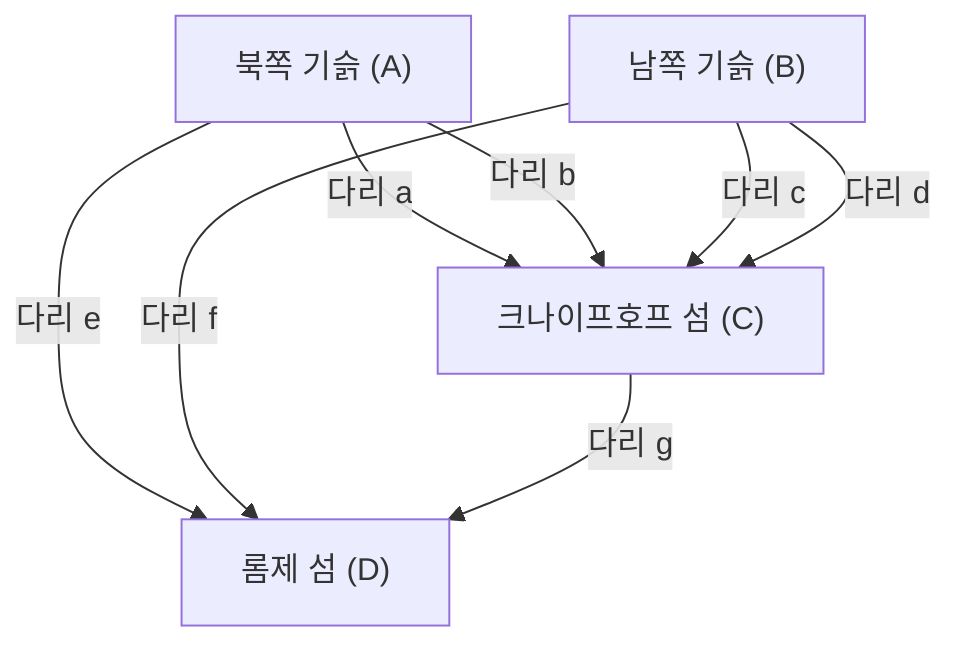

## 들어가며

수학의 역사에서 일상의 사소한 의문이나 놀이가 전혀 새로운 수학 분야를 개척하는 계기가 되기도 합니다. 그 가장 유명하고 아름다운 예 중 하나가 바로 **"[쾨니히스베르크의 7개의 다리](https://kenji.blog/ko/p/seven-bridges-of-konigsberg/)"** ([Seven Bridges of Königsberg](https://kenji.blog/ko/p/seven-bridges-of-konigsberg/)) 문제입니다.

18세기 프로이센 왕국의 도시 쾨니히스베르크(현재의 러시아 연방 칼리닌그라드)에는 프레겔(Pregel) 강이라는 큰 강이 흐르고 있었고, 그 하중도와 양안을 연결하도록 7개의 다리가 놓여 있었습니다. 당시 시민들은 해질녘 산책을 하며 다음과 같은 놀이를 생각했습니다. "도시에 있는 7개의 다리를 모두 한 번씩만 건너서 원래의 출발점으로 돌아올 수 있을까?"

얼핏 보면 단순한 퍼즐에 불과해 보이는 이 문제가 천재 수학자 **[레온하르트 오일러](https://kenji.blog/ko/p/euler/)** ([Leonhard Euler](https://kenji.blog/ko/p/euler/)) 의 손에 넘어갔을 때, 수학계에는 혁명이 일어났습니다. 오일러는 이 문제가 불가능하다는 것을 증명했을 뿐만 아니라, 그 과정에서 공간의 성질을 전혀 새로운 시각에서 재조명하여 **그래프 이론** ([Graph Theory](https://kenji.blog/ko/p/graph-theory-dijkstra-a-star/)) 과 **위상수학** (Topology, 위상기하학) 이라는, 현대 수학에서 극히 중요한 두 분야의 기초를 다졌습니다.

본 기사에서는 [쾨니히스베르크의 7개의 다리](https://kenji.blog/ko/p/seven-bridges-of-konigsberg/) 문제의 역사적 배경, 오일러의 기발한 해결 방법, 그리고 그것이 현대 과학과 기술에 어떻게 연결되어 있는지를 수학적 세부 사항과 함께 깊이 파헤칩니다. 단순한 역사의 소개에 그치지 않고, 그 이면에 있는 수리적 구조의 아름다움을 만끽해 보세요.

## 쾨니히스베르크의 도시와 7개의 다리: 역사적 배경

18세기 초 쾨니히스베르크는 발트해와 접한 번영하는 상업 도시이자 학문의 중심지이기도 했습니다. 도시 중심부에는 프레겔(Pregel) 강이 서쪽으로 흐르고 있었고, 강 안에는 크나이프호프(Kneiphof)와 롬제(Lomse)라는 두 개의 큰 섬(하중도)이 있었습니다.

도시의 지리적 구조는 크게 다음 4개의 육지로 나뉘어져 있었습니다.

- 북쪽 기슭의 육지 (A)
- 남쪽 기슭의 육지 (B)
- 크나이프호프 섬 (C)
- 롬제 섬, 또는 동쪽 육지 (D)

이 4개의 육지를 연결하기 위해 총 **7개의 다리** 가 놓여 있었습니다.
북쪽 기슭(A)과 섬(C) 사이에 2개, 남쪽 기슭(B)과 섬(C) 사이에 2개, 북쪽 기슭(A)과 섬(D) 사이에 1개, 남쪽 기슭(B)과 섬(D) 사이에 1개, 그리고 두 섬(C)과 (D) 사이에 1개입니다. 이 다리들은 시민 생활에 필수적인 인프라이자, 동시에 아름다운 거리 풍경을 구성하는 중요한 요소이기도 했습니다.

당시 쾨니히스베르크의 지식인과 시민들은 휴일 오후 산책 삼아 이 7개의 다리를 각각 '정확히 한 번씩만' 건너서 도시를 한 바퀴 도는 경로를 찾으려 했습니다. 하지만 아무리 시행착오를 거듭해도 단 한 명도 성공하는 사람이 없었습니다. 어떤 다리를 건너는 것을 잊어버리거나, 같은 다리를 두 번 건너게 되는 것입니다. 머지않아 시민들 사이에서는 "애초에 그런 산책 경로는 존재하지 않는 것이 아닐까?"라는 소문이 돌기 시작했지만, 그것을 수학적으로 증명할 수 있는 사람은 아무도 없었습니다.

## 다리 건너기 퍼즐에서 수학 문제로: 라이프니츠의 꿈과 오일러의 직관

시민들의 이 소문은 마침내 러시아의 상트페테르부르크 과학 아카데미에 머물고 있던 스위스 출신의 위대한 수학자 **[레온하르트 오일러](https://kenji.blog/ko/p/euler/)** 의 귀에 들어갔습니다. 1735년의 일입니다.

처음에 오일러는 이 문제에 대해 "이것은 수학이 아니라 단순한 논리 놀이에 불과한 것이 아닐까"라고 느꼈던 것 같습니다. 당시 수학의 주류는 [유클리드](https://kenji.blog/ko/p/euclid/) 기하학(길이, 각도, 면적, 부피 등을 다루는)이나 대수학, 혹은 뉴턴이나 라이프니츠에 의해 막 창시된 미적분학이었습니다. 쾨니히스베르크의 다리 문제는 다리의 길이가 몇 미터인지, 섬들의 면적이 얼마나 되는지, 다리가 강에 대해 어떤 각도로 놓여 있는지와 같은 전통적인 기하학적 성질에는 전혀 의존하지 않습니다. 중요한 것은 "어느 육지와 어느 육지가 몇 개의 다리로 연결되어 있는가"라는 순수한 **연결(접속)** 의 관계뿐이었습니다.

이것은 당시 [유클리드](https://kenji.blog/ko/p/euclid/) 기하학의 계량적인 틀로는 다룰 수 없는, 전혀 새로운 유형의 기하학적 문제였던 것입니다. 하지만 오일러는 점차 이 문제의 깊이를 깨닫기 시작했습니다. 그는 과거에 고트프리트 빌헬름 라이프니츠(Gottfried Wilhelm Leibniz)가 꿈꿨던 "위치의 해석(Analysis Situs)" 혹은 "위치의 기하학(Geometria Situs)"과 관련된 중요한 문제임을 인식하고, 본격적으로 이 문제의 해명에 나설 결심을 한 것입니다.

## 오일러의 추상화: 불필요한 정보를 덜어내다

오일러의 천재성이 가장 돋보이는 부분은 복잡한 현실 세계에서 불필요한 정보를 모두 덜어내고, 문제의 본질적인 구조만을 추출하는 **추상화** (Abstraction) 의 탁월한 능력에 있었습니다.

그는 현실의 쾨니히스베르크의 정밀한 지도에서 육지의 물리적인 형태나 크기, 강의 폭이나 물살의 속도, 다리의 재질이나 길이 등을 모두 무시했습니다. 그리고 다음과 같은 극히 단순하고 추상적인 수리 모델을 만들어 냈습니다.

1. **육지(섬이나 기슭)** 를 크기가 없는 단순한 "점"으로 나타낸다. 이를 현대의 용어로 **정점** (Vertex) 혹은 **노드** (Node) 라고 부릅니다.
2. **다리** 를 정점과 정점을 잇는 "선"으로 나타낸다. 이를 **간선** (Edge) 혹은 **링크** (Link) 라고 부릅니다. 선의 굽은 정도나 길이는 문제 삼지 않습니다.

이처럼 유한 개의 정점과 그것들을 잇는 간선의 집합으로 표현된 이산적인 구조를 수학에서는 **그래프** (Graph) 라고 부릅니다. 이것이 바로 현재 우리가 "그래프 이론"이라고 부르는 분야의 탄생 순간이었습니다.

아래의 Mermaid 다이어그램은 쾨니히스베르크 도시의 지리적 지도가 어떻게 추상적인 그래프 표현으로 변환되었는지를 보여줍니다.

이 강력한 추상화를 통해 "도시의 7개의 다리를 한 번씩 건너는 경로가 있는가?"라는 시민의 일상적인 의문은 "주어진 그래프의 모든 간선을 정확히 한 번씩 지나는 연속된 경로(한붓그리기)가 존재하는가?"라는 순수하게 논리적이고 엄밀한 수학 문제로 완전히 변환된 것입니다.

## 정점의 차수와 한붓그리기 정리: 오일러의 증명

문제를 그래프 형태로 정형화한 후, 오일러는 매우 단순하면서도 지극히 강력한 보편적 법칙을 발견했습니다. 그 증명의 열쇠가 된 것이 바로 **차수** (Degree) 라는 새로운 개념의 도입입니다.

그래프 이론에서 특정 정점 $v$ 의 **차수** 를 $d(v)$ 또는 $\text{deg}(v)$ 로 표기하며, 이는 "해당 정점에 직접 연결된 간선의 총 개수"를 의미합니다.

오일러는 그래프 상에서 "모든 간선을 한 번씩 지나는 경로(한붓그리기)"를 그린다는 행위가 각 정점의 차수에 어떤 제약을 주는지를 논리적으로 고찰했습니다.

만약 모든 간선을 정확히 한 번씩 지나서 그래프 전체를 다 그리는 경로가 존재한다고 가정해 봅시다. 이 경로를 따라가는 과정에서, 어떤 "통과점"이 되는 정점(출발점도 도착점도 아닌 정점)을 생각해 보겠습니다. 경로가 그 정점에 "들어가기" 위해서는 1개의 간선을 사용하고, 그 정점에서 "나오기" 위해서는 다른 1개의 간선을 사용해야 합니다.
즉, 통과점이 되는 정점을 방문할 때마다 반드시 **2개의 간선을 쌍으로 소비하게** 됩니다.

따라서 경로 도중에 통과하기만 하는 정점에서는 그곳에 드나들기 위한 간선이 반드시 쌍으로 존재해야 하므로, 해당 정점에 연결된 간선의 총 개수(차수)는 반드시 **짝수** (Even) 이어야 합니다.

예외가 될 수 있는 것은 경로의 "출발점"과 "도착점"에 해당하는 정점뿐입니다.

여기서 경로의 패턴은 다음 2가지로 분류됩니다.

1. **오일러 회로 (Eulerian Circuit)** : 출발점과 도착점이 같은 정점인 경우.
   이 경우, 경로는 빙 돌아 출발했던 정점으로 되돌아옵니다. 따라서 출발점 = 도착점을 포함한 **모든 정점** 이 실질적으로 "통과점"과 동일하게 취급됩니다. 드나듦이 완전히 쌍을 이루기 때문에, **그래프 내의 모든 정점의 차수가 짝수** 여야 합니다.

2. **오일러 경로 (Eulerian Path)** : 출발점과 도착점이 다른 정점인 경우.
   이 경우, 출발점에서는 "처음에 나가기" 위한 간선이 1개 여분으로 필요하며, 도착점에는 "마지막에 들어오기" 위한 간선이 1개 여분으로 필요합니다. 따라서 출발점과 도착점의 2개의 정점에서만 간선의 쌍이 완결되지 않아, **홀수** (Odd) 의 차수를 가지게 됩니다. 그 외의 모든 통과점의 차수는 짝수여야 합니다.

이것이 오일러가 엄밀하게 증명한, 그래프 이론에서 가장 기본적이고 유명한 정리(오일러의 정리)입니다.

수식을 사용하여 이 정리를 보다 엄밀하게 표현하면, 연결된 무방향 그래프 $G = (V, E)$ 에 대하여:

- **오일러 회로(Eulerian Circuit)가 존재하기 위한 필요충분조건** :
  그래프 $G$ 의 모든 정점 $v \in V$ 에 대해 그 차수 $d(v)$ 가 짝수일 것.
  $\forall v \in V, \ d(v) \equiv 0 \pmod 2$

- **오일러 경로(Eulerian Path)가 존재하기 위한 필요충분조건** :
  그래프 $G$ 에서 차수가 홀수인 정점이 "정확히 2개"만 존재할 것.
  $|\{v \in V \mid d(v) \equiv 1 \pmod 2\}| = 2$

## 쾨니히스베르크의 그래프 적용과 결론

자, 이제 오일러가 연역적 추론을 통해 이끌어낸 이 아름답고 완벽한 정리를 실제 [쾨니히스베르크의 7개의 다리](https://kenji.blog/ko/p/seven-bridges-of-konigsberg/) 그래프에 적용해 봅시다.

추상화된 4개의 육지(정점 $A, B, C, D$) 각각의 차수를 세어 봅니다.

- 북쪽 기슭의 육지 $A$: 섬 $C$ 로 2개, 섬 $D$ 로 1개의 다리가 놓여 있다. 따라서 차수는 $d(A) = 3$ (홀수).
- 남쪽 기슭의 육지 $B$: 섬 $C$ 로 2개, 섬 $D$ 로 1개의 다리가 놓여 있다. 따라서 차수는 $d(B) = 3$ (홀수).
- 롬제 섬 $D$: 기슭 $A$ 로 1개, 기슭 $B$ 로 1개, 섬 $C$ 로 1개의 다리가 놓여 있다. 따라서 차수는 $d(D) = 3$ (홀수).
- 크나이프호프 섬 $C$: 기슭 $A$ 로 2개, 기슭 $B$ 로 2개, 섬 $D$ 로 1개의 다리가 놓여 있다. 따라서 차수는 $d(C) = 5$ (홀수).

결과를 요약하면, 쾨니히스베르크의 그래프에 존재하는 4개 정점의 차수는 "3, 3, 3, 5"가 됩니다. 놀랍게도, **모든 정점의 차수가 홀수** 인 것입니다.

오일러의 정리에 따르면, 모든 간선을 한 번씩 지나는 경로(한붓그리기)가 가능해지려면 홀수 차수인 정점의 개수는 무조건 "0개" 또는 "2개"여야만 합니다. 하지만 쾨니히스베르크의 그래프에는 홀수 차수의 정점이 "4개"나 존재합니다.

이 사실을 바탕으로 오일러는 다음과 같은 최종 결론을 내렸습니다.
**"[쾨니히스베르크의 7개의 다리](https://kenji.blog/ko/p/seven-bridges-of-konigsberg/)를 모두 한 번씩만 건너서 걷는 경로는 절대 존재하지 않는다"**

이것은 수학사에서 지극히 중요한 순간이었습니다. 왜냐하면 오일러는 상상할 수 있는 무한에 가까운 산책 경로를 일일이 다 걸어보면서 불가능함을 확인한 것이 아니기 때문입니다. 그는 "그래프의 구조"와 "패리티(홀짝성)"라는 순수하게 논리적이고 보편적인 성질만을 이용하여 불가능하다는 것을 우아하게 증명해 냈습니다. 이러한 연역적 접근이야말로 근대 수학의 진면목이라 할 수 있습니다.

## 위상수학으로의 발전: 위치 기하학의 탄생

쾨니히스베르크의 다리 문제를 통해 오일러는 거리, 길이, 각도, 면적과 같은 기존 [유클리드](https://kenji.blog/ko/p/euclid/) 기하학적인 "계량적" 성질에 전혀 의존하지 않고, 도형이나 공간의 "연결 방식(연속성이나 접속 관계)"만을 본질적인 연구 대상으로 삼는 전혀 새로운 기하학의 패러다임을 열었습니다.

이것이 나중에 **위상수학** (Topology, 위상기하학) 이라고 불리게 될 분야의 서막입니다. 위상수학에서는 "연속적으로 변형시켜도 변하지 않는 성질(위상적 성질)"이 연구됩니다. 잘 알려진 농담 중에 "위상수학자(위상기하학자)는 커피잔과 도넛을 구분하지 못한다"는 것이 있습니다. 둘 다 "구멍이 하나 뚫린 입체"이며, 자르거나 붙이지 않고 찰흙처럼 연속적으로 변형시키면 서로 바뀔 수 있기 때문에, 위상수학의 세계에서는 둘을 "같은 모양"으로 간주하는 것입니다.

쾨니히스베르크의 그래프도 마찬가지입니다. 다리를 고무줄처럼 늘이거나 줄이고, 섬을 찌그러뜨리더라도, "어느 정점과 어느 정점이 연결되어 있는가"라는 접속 관계만 유지된다면 그래프로서의 본질은 전혀 변하지 않습니다. 오일러가 주목한 것은 바로 이 "변형해도 불변하는 연결"이라는 위상적인 성질이었습니다.

오일러 자신도 그 후 1750년에 다면체의 정점( $V$ ), 간선( $E$ ), 면( $F$ )의 개수에 관한 놀라운 보편적 법칙, 이른바 **[오일러의 다면체 정리](https://kenji.blog/ko/p/eulers-polyhedron-formula/)** ( $V - E + F = 2$ ) 를 발견했습니다. 이 또한 다면체의 구체적인 모양이나 크기에 의존하지 않는 위상적 불변량을 포착한 것으로, 위상수학 발전의 매우 중요한 금자탑이 되었습니다.

## 현대 사회에서의 그래프 이론의 응용과 확장

18세기 수학자의 순수한 지적 탐구에서 첫 울음을 터뜨린 그래프 이론과 위상수학은 결코 상아탑 속의 학문으로 머물지 않았습니다. 그것들은 현재 고도로 정보화된 우리 사회와 기술의 근간을 밑바탕에서부터 지탱하는 지극히 실천적이고 필수적인 도구로 만개하고 있습니다.

### 1. 컴퓨터 네트워크와 인터넷
우리가 매일 이용하는 인터넷의 물리적 및 논리적 구조는 그야말로 전 세계 규모의 거대한 그래프 그 자체입니다. 개별 라우터나 서버, 컴퓨터가 정점이 되고, 이들을 연결하는 광섬유나 무선 통신 회선이 간선으로 표현됩니다. 데이터 패킷을 혼잡을 피해 가장 빠르고 효율적으로 목적지까지 전달하기 위한 라우팅 프로토콜(예를 들어, 다익스트라 알고리즘)은 모두 그래프 이론상의 알고리즘으로 설계되어 있습니다.

### 2. 내비게이션 시스템과 물류의 최적화
스마트폰 지도 앱에서의 경로 검색이나 자동차 내비게이션 시스템은 교차로나 합류점을 정점, 도로를 간선으로 간주하여 계산을 수행합니다. 이것은 그래프 이론의 **최단 경로 문제** (Shortest Path Problem) 다름 아닙니다. 또한 물류 네트워크에서 수많은 배송지를 가장 효율적인 순서로 도는 경로를 결정하는 문제는 **외판원 문제** (Traveling Salesman Problem) 로 알려져 있습니다.

### 3. 소셜 네트워크 분석 (SNA)
현대의 사회과학이나 정보학에서 중요한 위치를 차지하는 소셜 네트워크 분석도 그래프 이론을 기반으로 합니다. X(구 Twitter)나 Facebook 같은 SNS의 인간관계는 사용자를 정점, 팔로우 관계를 간선으로 하는 "소셜 그래프"로 모델링됩니다. 이 그래프를 해석함으로써 커뮤니티의 구조를 발견하거나 정보가 어떻게 확산되는지에 대한 모델을 구축할 수 있게 됩니다.

### 4. 생명과학: 생물학, 화학, 의학
자연과학의 다양한 규모에서도 그래프 이론은 맹활약하고 있습니다. 화학에서는 분자 구조를 모델링할 때 원자를 정점, 화학 결합을 간선으로 하는 그래프가 사용됩니다. 생물학에서는 세포 내 단백질 간의 복잡한 상호 작용을 네트워크로 파악하거나, 뇌과학에서 수많은 뉴런이 어떻게 결합하여 정보 처리를 하는지(커넥톰 분석)를 이해하기 위해 그래프 이론의 강력한 분석 기법이 필수가 되었습니다.

## 맺음말

1736년 [레온하르트 오일러](https://kenji.blog/ko/p/euler/)에 의해 발표된 한 편의 논문 "위치의 기하학과 관련된 문제의 해법"은 쾨니히스베르크 시민들의 시시콜콜한 휴일 산책 퍼즐에 완벽한 해답을 제시했습니다. 하지만 그것이 진정으로 의미했던 것은 하나의 문제의 종결이 아니라 무수한 응용을 가진 광대한 수학적 우주의 탄생이었습니다.

사물의 표면적인 형태나 크기에 얽매이지 않고 "무엇과 무엇이 어떻게 연결되어 있는가"라는 가장 본질적인 구조만을 예리하게 꿰뚫어 보는 **추상화의 힘** . [쾨니히스베르크의 7개의 다리](https://kenji.blog/ko/p/seven-bridges-of-konigsberg/) 이야기는 추상적인 수리 사고가 어떻게 현실 세계를 해명하고 미래 기술을 창조하는 강력한 무기가 되는지를 시대를 뛰어넘어 우리에게 가르쳐 줍니다.

만약 당신이 다음에 거리를 걷다가 강에 놓인 다리를 보거나 지하철 노선도를 바라볼 때는 꼭 그 이면에 있는 "연결"의 구조에 대해 생각해 보시기 바랍니다. 그곳에는 280여 년 전 한 천재 수학자가 발견한, 눈에 보이지 않는 수학의 아름다운 실이 현대의 우리를 감싸 안듯 지금도 널리 퍼져 있는 것입니다.
