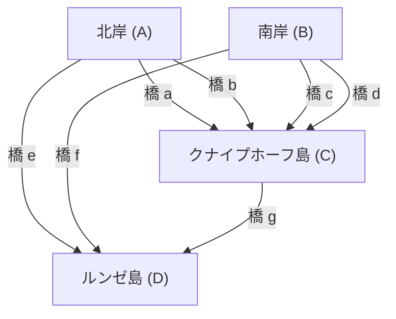

## はじめに

数学の歴史において、日常の些細な疑問や遊びが、全く新しい数学の分野を切り拓くきっかけとなることがあります。その最も有名で美しい例の一つが、 **「[ケーニヒスベルクの七つの橋](https://kenji.blog/p/seven-bridges-of-konigsberg/)」** ([Seven Bridges of Königsberg](https://kenji.blog/p/seven-bridges-of-konigsberg/)) の問題です。

18世紀、プロイセン王国の都市ケーニヒスベルク（現在のロシア連邦カリーニングラード）には、プレーゲル川という大きな川が流れており、その中州と両岸を結ぶように七つの橋が架けられていました。当時の市民たちは、夕暮れ時の散歩の際に次のような遊びを思いつきました。「街にある七つの橋を、すべて一度ずつ渡って、元の出発点に戻ってくることができるだろうか？」

この一見すると単なるパズルに過ぎないような問題が、天才数学者 **レオンハルト・[オイラー](https://kenji.blog/p/euler/)** ([Leonhard Euler](https://kenji.blog/p/euler/)) の手に渡ったとき、数学の世界に革命が起きました。[オイラー](https://kenji.blog/p/euler/)はこの問題が不可能であることを証明しただけでなく、その過程で空間の性質を全く新しい視点から捉え直し、 **[グラフ理論](https://kenji.blog/p/graph-theory-dijkstra-a-star/)** ([Graph Theory](https://kenji.blog/p/graph-theory-dijkstra-a-star/)) と **トポロジー** (Topology、位相幾何学) という、現代数学において極めて重要な二つの分野の基礎を築いたのです。

本記事では、[ケーニヒスベルクの七つの橋](https://kenji.blog/p/seven-bridges-of-konigsberg/)の問題の歴史的背景、[オイラー](https://kenji.blog/p/euler/)による鮮やかな解決方法、そしてそれが現代の科学やテクノロジーにどのように結びついているのかを、数学的な詳細を交えながら深く掘り下げていきます。単なる歴史の紹介にとどまらず、その背後にある数理的構造の美しさを堪能してください。

## ケーニヒスベルクの街と七つの橋：歴史的背景

18世紀初頭のケーニヒスベルクは、バルト海に面した繁栄する商業都市であり、学問の中心地でもありました。街の中心にはプレーゲル川（Pregel）が西に向かって流れ、川の中にはクナイプホーフ（Kneiphof）とルンゼ（Lomse）と呼ばれる二つの大きな島（中州）がありました。

街の地理的構造は、大きく分けて以下の四つの陸地に分割されていました。

- 北岸の陸地 (A)
- 南岸の陸地 (B)
- クナイプホーフ島 (C)
- ルンゼ島、あるいは東側の陸地 (D)

これら四つの陸地を繋ぐために、合計 **七つの橋** が架けられていました。
北岸(A)と島(C)の間に2つ、南岸(B)と島(C)の間に2つ、北岸(A)と島(D)の間に1つ、南岸(B)と島(D)の間に1つ、そして二つの島(C)と(D)の間に1つです。これらの橋は、市民生活において不可欠なインフラであり、同時に美しい街並みを構成する重要な要素でもありました。

当時のケーニヒスベルクの知識人や市民たちは、休日の午後の散歩として、これら七つの橋をそれぞれ「ちょうど1回ずつ」渡って、街を一周するルートを見つけようとしました。しかし、どれほど試行錯誤を重ねても、誰一人として成功する者はいませんでした。ある橋を渡り忘れたり、同じ橋を二度渡ってしまったりするのです。やがて市民たちの間では「そのような散歩ルートはそもそも存在しないのではないか」と囁かれるようになりましたが、それを数学的に証明できる者は誰もいませんでした。

## 橋渡しのパズルから数学の問題へ：[ライプニッツ](https://kenji.blog/p/leibniz/)の夢と[オイラー](https://kenji.blog/p/euler/)の直感

市民たちのこの噂は、やがてロシアのサンクトペテルブルク科学アカデミーに滞在していたスイス出身の偉大な数学者、 **レオンハルト・[オイラー](https://kenji.blog/p/euler/)** の耳に届きました。1735年のことです。

当初、[オイラー](https://kenji.blog/p/euler/)はこの問題に対して「これは数学ではなく、単なる論理遊びに過ぎないのではないか」と感じていたようです。当時の数学の主流は、[ユークリッド](https://kenji.blog/p/euclid/)幾何学（長さ、角度、面積、体積などを扱う）や代数学、あるいは[ニュートン](https://kenji.blog/p/newton/)や[ライプニッツ](https://kenji.blog/p/leibniz/)によって創始されたばかりの微分積分学でした。ケーニヒスベルクの橋の問題は、橋の長さが何メートルであるか、島々の面積がどれくらいか、橋が川に対してどのような角度で架かっているかといった、伝統的な幾何学的性質には全く依存していません。重要なのは、「どの陸地とどの陸地が、何本の橋で繋がっているか」という純粋な **繋がり（接続）** の関係だけでした。

これは、当時の[ユークリッド](https://kenji.blog/p/euclid/)幾何学の計量的な枠組みでは扱うことができない、全く新しいタイプの幾何学的問題だったのです。しかし、[オイラー](https://kenji.blog/p/euler/)は次第にこの問題の奥深さに気づき始めました。彼は、かつてゴットフリート・ヴィルヘルム・[ライプニッツ](https://kenji.blog/p/leibniz/)（Gottfried Wilhelm Leibniz）が夢想した「位置の解析（Analysis Situs）」あるいは「位置の幾何学（Geometria Situs）」に関わる重要な問題であると認識し、本格的にこの問題の解明に取り組む決意をしたのです。

## [オイラー](https://kenji.blog/p/euler/)の抽象化：不要な情報を削ぎ落とす

[オイラー](https://kenji.blog/p/euler/)の天才性の最も顕著な現れは、複雑な現実世界から不要な情報をすべて削ぎ落とし、問題の本質的な構造だけを抽出する **抽象化** (Abstraction) の卓越した能力にありました。

彼は、現実のケーニヒスベルクの精緻な地図から、陸地の物理的な形や大きさ、川の幅や水流の速さ、橋の素材や長さなどを一切合切無視しました。そして、次のような極めてシンプルで抽象的な数理モデルを作り上げました。

1. **陸地（島や岸）** を、大きさを持たない単なる「点」として表す。これを現代の用語で **頂点** (Vertex) あるいは **ノード** (Node) と呼びます。
2. **橋** を、頂点と頂点を結ぶ「線」として表す。これを **辺** (Edge) あるいは **リンク** (Link) と呼びます。線の曲がり具合や長さは問題にしません。

このように、有限個の頂点と、それらを結ぶ辺の集合として表現された離散的な構造を、数学では **グラフ** (Graph) と呼びます。これが、現在私たちが「[グラフ理論](https://kenji.blog/p/graph-theory-dijkstra-a-star/)」と呼んでいる分野のまさに誕生の瞬間でした。

以下の Mermaid 図は、ケーニヒスベルクの街の地理的地図が、どのようにして抽象的なグラフ表現へと変換されたかを示しています。

この強力な抽象化により、「街の七つの橋を一度ずつ渡るルートがあるか」という市民の日常的な疑問は、「与えられたグラフのすべての辺を、ちょうど一度ずつ通る連続した経路（一筆書き）が存在するか」という、純粋に論理的で厳密な数学の問題へと完全に変換されたのです。

## 頂点の次数と一筆書きの定理：[オイラー](https://kenji.blog/p/euler/)の証明

問題をグラフの形に定式化した後、[オイラー](https://kenji.blog/p/euler/)は非常にシンプルでありながら極めて強力な普遍的法則を発見しました。その証明の鍵となったのが、 **次数** (Degree) という新しい概念の導入です。

[グラフ理論](https://kenji.blog/p/graph-theory-dijkstra-a-star/)において、ある頂点 $v$ の **次数** を $d(v)$ または $\text{deg}(v)$ と表記し、これは「その頂点に直接接続している辺の総数」を意味します。

[オイラー](https://kenji.blog/p/euler/)は、グラフ上で「すべての辺を一度ずつ通る経路（一筆書き）」を描くという行為が、各頂点の次数にどのような制約を与えるかを論理的に考察しました。

もし、すべての辺をちょうど一度ずつ通ってグラフ全体を描き切る経路が存在すると仮定しましょう。この経路を辿っていく過程で、ある「通過点」となる頂点（出発点でも終着点でもない頂点）を考えてみます。経路がその頂点に「入る」ためには1つの辺を使用し、その頂点から「出る」ためには別の1つの辺を使用する必要があります。
つまり、通過点となる頂点を訪れるたびに、必ず **2つの辺をペアで消費する** ことになります。

したがって、経路の途中で通過するだけの頂点においては、そこに出入りするための辺が必ずペアになって存在しなければならないため、その頂点に接続している辺の総数（次数）は、必ず **偶数** (Even) でなければなりません。

例外となる可能性があるのは、経路の「出発点」と「終着点」に該当する頂点だけです。

ここで、経路のパターンは以下の2つに分類されます。

1. **[オイラー](https://kenji.blog/p/euler/)閉路 (Eulerian Circuit)** ：出発点と終着点が同じ頂点である場合。
   この場合、経路はぐるっと一周して元の頂点に戻ってきます。したがって、出発点＝終着点を含む **すべての頂点** が実質的に「通過点」と同じ扱いになります。出入りが完全にペアになるため、 **グラフ内のすべての頂点の次数が偶数** でなければなりません。

2. **[オイラー](https://kenji.blog/p/euler/)路 (Eulerian Path)** ：出発点と終着点が異なる頂点である場合。
   この場合、出発点からは「最初に出て行く」ための辺が1つ余分に必要となり、終着点には「最後に入ってくる」ための辺が1つ余分に必要となります。したがって、出発点と終着点の2つの頂点だけは辺のペアが完結せず、 **奇数** (Odd) の次数を持つことになります。それ以外のすべての通過点の次数は偶数でなければなりません。

これが、[オイラー](https://kenji.blog/p/euler/)が厳密に証明した、[グラフ理論](https://kenji.blog/p/graph-theory-dijkstra-a-star/)における最も基本的で有名な定理（[オイラー](https://kenji.blog/p/euler/)の定理）です。

数式を用いてこの定理をより厳密に表現すると、連結な無向グラフ $G = (V, E)$ において：

- **[オイラー](https://kenji.blog/p/euler/)閉路（Eulerian Circuit）が存在するための必要十分条件** ：
  グラフ $G$ のすべての頂点 $v \in V$ について、その次数 $d(v)$ が偶数であること。
  $\forall v \in V, \ d(v) \equiv 0 \pmod 2$

- **[オイラー](https://kenji.blog/p/euler/)路（Eulerian Path）が存在するための必要十分条件** ：
  グラフ $G$ において、次数が奇数である頂点が「ちょうど2つ」だけ存在すること。
  $|\{v \in V \mid d(v) \equiv 1 \pmod 2\}| = 2$

## ケーニヒスベルクのグラフへの適用と結論

さて、[オイラー](https://kenji.blog/p/euler/)が演繹的な推論によって導き出したこの美しく完璧な定理を、実際の[ケーニヒスベルクの七つの橋](https://kenji.blog/p/seven-bridges-of-konigsberg/)のグラフに当てはめてみましょう。

抽象化された4つの陸地（頂点 $A, B, C, D$ ）それぞれの次数を数えてみます。

- 北岸の陸地 $A$: 島 $C$ へ2本、島 $D$ へ1本の橋が架かっている。したがって、次数は $d(A) = 3$ （奇数）。
- 南岸の陸地 $B$: 島 $C$ へ2本、島 $D$ へ1本の橋が架かっている。したがって、次数は $d(B) = 3$ （奇数）。
- ルンゼ島 $D$: 岸 $A$ へ1本、岸 $B$ へ1本、島 $C$ へ1本の橋が架かっている。したがって、次数は $d(D) = 3$ （奇数）。
- クナイプホーフ島 $C$: 岸 $A$ へ2本、岸 $B$ へ2本、島 $D$ へ1本の橋が架かっている。したがって、次数は $d(C) = 5$ （奇数）。

結果をまとめると、ケーニヒスベルクのグラフに存在する4つの頂点の次数は「3, 3, 3, 5」となります。驚くべきことに、 **すべての頂点の次数が奇数** となっているのです。

[オイラー](https://kenji.blog/p/euler/)の定理によれば、すべての辺を一度ずつ通る経路（一筆書き）が可能となるためには、奇数次数の頂点の数は絶対に「0個」または「2個」でなければなりません。しかし、ケーニヒスベルクのグラフにおいては、奇数次数の頂点が「4個」も存在します。

この事実をもって、[オイラー](https://kenji.blog/p/euler/)は次のように最終的な結論を下しました。
**「[ケーニヒスベルクの七つの橋](https://kenji.blog/p/seven-bridges-of-konigsberg/)を、すべて一度ずつ渡って歩く経路は、絶対に存在しない」**

これは数学史において極めて重要な瞬間でした。なぜなら[オイラー](https://kenji.blog/p/euler/)は、考え得る無限に近い数の散歩ルートを一つ一つしらみつぶしに歩いて不可能を確かめたわけではないからです。彼は「グラフの構造」と「パリティ（偶奇性）」という純粋に論理的で普遍的な性質だけを用いて、不可能であることをエレガントに証明してみせたのです。この演繹的なアプローチこそが、近代数学の真骨頂と言えます。

## トポロジーへの発展：位置の幾何学の誕生

ケーニヒスベルクの橋の問題を通じて、[オイラー](https://kenji.blog/p/euler/)は距離、長さ、角度、面積といった従来の[ユークリッド](https://kenji.blog/p/euclid/)幾何学的な「計量的」な性質に一切依存しない、図形や空間の「繋がり方（連続性や接続関係）」のみを本質的な研究対象とする、全く新しい幾何学のパラダイムを切り開きました。

これが、後に **トポロジー** (Topology、位相幾何学) と呼ばれることになる分野の幕開けです。トポロジーにおいては、「連続的に変形させても変わらない性質（位相的性質）」が研究されます。よく知られた冗談に「トポロジスト（位相幾何学者）は、コーヒーカップとドーナツの区別がつかない」というものがあります。どちらも「穴が1つあいた立体」であり、切ったり貼ったりせずに粘土のように連続的に変形させれば互いに移り変わることができるため、トポロジーの世界では両者は「同じ形」と見なされるのです。

ケーニヒスベルクのグラフも同様です。橋をゴムひものように伸ばしたり縮めたり、島をひしゃげさせたりしても、「どの頂点とどの頂点が繋がっているか」という接続関係さえ保たれれば、グラフとしての本質は全く変わりません。[オイラー](https://kenji.blog/p/euler/)が着目したのは、まさにこの「変形しても不変な繋がり」という位相的な性質でした。

[オイラー](https://kenji.blog/p/euler/)自身もその後、1750年に多面体の頂点（ $V$ ）、辺（ $E$ ）、面（ $F$ ）の数に関する驚くべき普遍的な法則、いわゆる **[オイラー](https://kenji.blog/p/euler/)の多面体定理** （ $V - E + F = 2$ ）を発見しました。これもまた、多面体の具体的な形状や大きさに依存しない位相的な不変量を捉えたものであり、トポロジーの発展における極めて重要な金字塔となっています。

## 現代社会における[グラフ理論](https://kenji.blog/p/graph-theory-dijkstra-a-star/)の応用と広がり

18世紀の数学者の純粋な知的探求から産声を上げたグラフ理論とトポロジーは、決して象牙の塔の中の学問にとどまりませんでした。それらは現在、高度に情報化された私たちの社会やテクノロジーの根幹を根底から支える、極めて実践的で不可欠なツールとして開花しています。

### 1. コンピュータネットワークとインターネット
私たちが毎日利用しているインターネットの物理的および論理的な構造は、まさに世界規模の巨大なグラフそのものです。個々のルーターやサーバー、コンピュータが頂点となり、それらを結ぶ光ファイバーや無線通信回線が辺として表現されます。データのパケットを、渋滞を避けながら最も早く効率的に宛先まで届けるためのルーティングプロトコル（例えば、[ダイクストラ法](https://kenji.blog/p/graph-theory-dijkstra-a-star/)）は、すべてグラフ理論上のアルゴリズムとして設計されています。

### 2. ナビゲーションシステムと物流の最適化
スマートフォンの地図アプリでの経路検索やカーナビゲーションシステムは、交差点や合流点を頂点、道路を辺と見なして計算を行っています。これはグラフ理論における **最短経路問題** (Shortest Path Problem) に他なりません。また、物流ネットワークにおいて、多数の配送先を最も効率的な順序で回るルートを決定する問題は、 **巡回セールスマン問題** (Traveling Salesman Problem) として知られています。

### 3. ソーシャルネットワーク分析 (SNA)
現代の社会科学や情報学において重要な位置を占めるソーシャルネットワーク分析も、グラフ理論が基盤となっています。X（旧Twitter）やFacebookのようなSNSにおける人間関係は、ユーザーを頂点、フォロー関係を辺とする「ソーシャルグラフ」としてモデル化されます。このグラフを解析することで、コミュニティの構造を発見したり、情報がどのように拡散していくかのモデルを構築したりすることが可能になります。

### 4. 生命科学：生物学・化学・医学
自然科学の様々なスケールにおいてもグラフ理論は活躍しています。化学においては、分子構造をモデリングする際、原子を頂点、化学結合を辺とするグラフが用いられます。生物学においては、細胞内のタンパク質同士の複雑な相互作用をネットワークとして捉えたり、脳科学において数多くのニューロンがどのように結合して情報処理を行っているか（コネクトーム解析）を理解するために、グラフ理論の強力な分析手法が不可欠となっています。

## おわりに

1736年、レオンハルト・[オイラー](https://kenji.blog/p/euler/)によって発表された一本の論文「位置の幾何学に関連する問題の解法」は、ケーニヒスベルク市民の他愛のない休日の散歩パズルに完全な解答を与えました。しかし、それが真に意味していたのは、一つの問題の終焉ではなく、無数の応用を持つ広大な数学的宇宙の誕生でした。

物事の表面的な形や大きさにとらわれず、「何と何がどのように繋がっているか」という最も本質的な構造だけを鋭く見抜く **抽象化の力** 。[ケーニヒスベルクの七つの橋](https://kenji.blog/p/seven-bridges-of-konigsberg/)の物語は、抽象的な数理思考がいかにして現実世界を解き明かし、未来のテクノロジーを創造する強力な武器となるかを、時代を超えて私たちに教えてくれます。

もしあなたが次に街を歩き、川に架かる橋を見かけたり、地下鉄の路線図を眺めたりしたときには、ぜひその背後にある「繋がり」の構造に思いを馳せてみてください。そこには、280年以上前に一人の天才数学者が見出した、目に見えない数学の美しい糸が、現代の私たちを包み込むように今も張り巡らされているのです。
